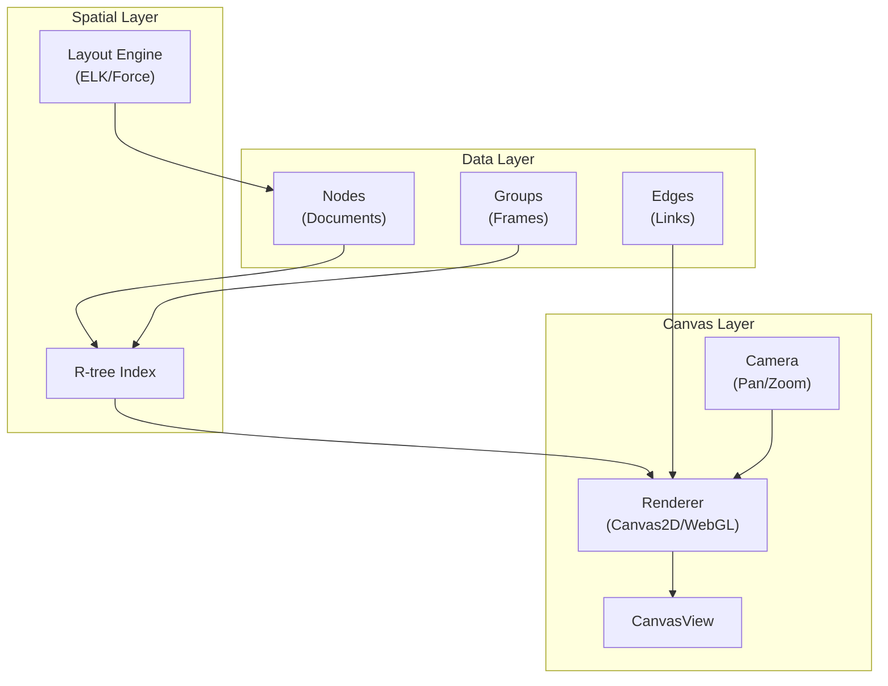

# 09: Infinite Canvas

> Spatial graph visualization with auto-layout

**Duration:** 4 weeks
**Dependencies:** @xnetjs/data, @xnetjs/vectors

> **Architecture Update (Jan 2026):**
>
> - `@xnetjs/database` → Use `@xnetjs/data` (Schema system + NodeStore)
> - Canvas nodes reference `Node` IDs from NodeStore

## Overview

The infinite canvas provides a spatial workspace for visualizing document relationships. Features:

- Pan and zoom navigation
- R-tree spatial indexing
- Auto-layout algorithms (force, hierarchical)
- Multiple edge types
- Grouping/frames

## Architecture



## Implementation

### Canvas Types

```typescript
// packages/canvas/src/types.ts

export interface CanvasNode {
  id: string
  documentId?: string // Link to xnet document
  type: 'document' | 'group' | 'text' | 'image'

  // Position and size
  x: number
  y: number
  width: number
  height: number
  rotation?: number

  // Visual properties
  color?: string
  icon?: string
  collapsed?: boolean

  // For groups
  children?: string[] // Child node IDs
}

export interface CanvasEdge {
  id: string
  source: string // Source node ID
  target: string // Target node ID
  type: EdgeType

  // Visual properties
  color?: string
  style?: 'solid' | 'dashed' | 'dotted'
  label?: string

  // Control points for curved edges
  controlPoints?: Point[]
}

export type EdgeType =
  | 'wikilink' // [[page]] references
  | 'tag' // Shared #tag
  | 'relation' // Database relation
  | 'temporal' // Date proximity
  | 'semantic' // Vector similarity
  | 'manual' // User-created

export interface Point {
  x: number
  y: number
}

export interface Viewport {
  x: number // Camera position
  y: number
  zoom: number // 0.1 to 5
}

export interface CanvasState {
  nodes: Map<string, CanvasNode>
  edges: Map<string, CanvasEdge>
  viewport: Viewport
  selection: Set<string>
}
```

### R-tree Spatial Index

```typescript
// packages/canvas/src/spatial/rtree.ts

import RBush from 'rbush'

interface BBox {
  minX: number
  minY: number
  maxX: number
  maxY: number
}

interface IndexedNode extends BBox {
  id: string
}

export class SpatialIndex {
  private tree: RBush<IndexedNode>

  constructor() {
    this.tree = new RBush()
  }

  insert(node: CanvasNode): void {
    this.tree.insert({
      id: node.id,
      minX: node.x,
      minY: node.y,
      maxX: node.x + node.width,
      maxY: node.y + node.height
    })
  }

  remove(node: CanvasNode): void {
    const item = {
      id: node.id,
      minX: node.x,
      minY: node.y,
      maxX: node.x + node.width,
      maxY: node.y + node.height
    }
    this.tree.remove(item, (a, b) => a.id === b.id)
  }

  update(oldNode: CanvasNode, newNode: CanvasNode): void {
    this.remove(oldNode)
    this.insert(newNode)
  }

  // Query nodes in viewport
  queryViewport(viewport: Viewport, canvasWidth: number, canvasHeight: number): string[] {
    const scale = 1 / viewport.zoom
    const bbox: BBox = {
      minX: viewport.x,
      minY: viewport.y,
      maxX: viewport.x + canvasWidth * scale,
      maxY: viewport.y + canvasHeight * scale
    }

    return this.tree.search(bbox).map((item) => item.id)
  }

  // Find node at point
  queryPoint(x: number, y: number): string | null {
    const results = this.tree.search({
      minX: x,
      minY: y,
      maxX: x,
      maxY: y
    })

    // Return topmost (last added)
    return results.length > 0 ? results[results.length - 1].id : null
  }

  // Find nodes in selection rectangle
  queryRect(rect: BBox): string[] {
    return this.tree.search(rect).map((item) => item.id)
  }

  // Find nearby nodes for snapping
  findNearest(x: number, y: number, radius: number): string[] {
    return this.tree
      .search({
        minX: x - radius,
        minY: y - radius,
        maxX: x + radius,
        maxY: y + radius
      })
      .map((item) => item.id)
  }

  clear(): void {
    this.tree.clear()
  }

  bulk(nodes: CanvasNode[]): void {
    this.tree.load(
      nodes.map((node) => ({
        id: node.id,
        minX: node.x,
        minY: node.y,
        maxX: node.x + node.width,
        maxY: node.y + node.height
      }))
    )
  }
}
```

### Auto-Layout with ELK

```typescript
// packages/canvas/src/layout/elk.ts

import ELK, { ElkNode, ElkExtendedEdge } from 'elkjs/lib/elk.bundled'

export interface LayoutOptions {
  algorithm: 'layered' | 'force' | 'mrtree' | 'radial' | 'stress'
  direction?: 'DOWN' | 'RIGHT' | 'UP' | 'LEFT'
  nodeSpacing?: number
  edgeSpacing?: number
  layerSpacing?: number
}

export interface LayoutResult {
  nodes: Map<string, { x: number; y: number }>
  edges: Map<string, { points: Point[] }>
}

export class LayoutEngine {
  private elk: ELK

  constructor() {
    this.elk = new ELK()
  }

  async layout(
    nodes: CanvasNode[],
    edges: CanvasEdge[],
    options: LayoutOptions
  ): Promise<LayoutResult> {
    const elkGraph: ElkNode = {
      id: 'root',
      layoutOptions: {
        'elk.algorithm': options.algorithm,
        'elk.direction': options.direction || 'DOWN',
        'elk.spacing.nodeNode': String(options.nodeSpacing || 50),
        'elk.spacing.edgeEdge': String(options.edgeSpacing || 20),
        'elk.layered.spacing.baseValue': String(options.layerSpacing || 100)
      },
      children: nodes.map((node) => ({
        id: node.id,
        width: node.width,
        height: node.height
      })),
      edges: edges.map((edge) => ({
        id: edge.id,
        sources: [edge.source],
        targets: [edge.target]
      }))
    }

    const layoutedGraph = await this.elk.layout(elkGraph)

    const nodePositions = new Map<string, { x: number; y: number }>()
    const edgePoints = new Map<string, { points: Point[] }>()

    layoutedGraph.children?.forEach((child) => {
      nodePositions.set(child.id, {
        x: child.x || 0,
        y: child.y || 0
      })
    })

    layoutedGraph.edges?.forEach((edge) => {
      const elkEdge = edge as ElkExtendedEdge
      const sections = elkEdge.sections || []
      const points: Point[] = []

      sections.forEach((section) => {
        points.push({ x: section.startPoint.x, y: section.startPoint.y })
        section.bendPoints?.forEach((bp) => {
          points.push({ x: bp.x, y: bp.y })
        })
        points.push({ x: section.endPoint.x, y: section.endPoint.y })
      })

      edgePoints.set(edge.id, { points })
    })

    return { nodes: nodePositions, edges: edgePoints }
  }
}

// Force-directed layout for dynamic updates
export class ForceLayout {
  private simulation: d3.Simulation<any, any> | null = null

  start(
    nodes: CanvasNode[],
    edges: CanvasEdge[],
    onTick: (positions: Map<string, { x: number; y: number }>) => void
  ): void {
    // Using d3-force
    const d3Nodes = nodes.map((n) => ({ id: n.id, x: n.x, y: n.y }))
    const d3Links = edges.map((e) => ({ source: e.source, target: e.target }))

    this.simulation = d3
      .forceSimulation(d3Nodes)
      .force(
        'link',
        d3
          .forceLink(d3Links)
          .id((d: any) => d.id)
          .distance(150)
      )
      .force('charge', d3.forceManyBody().strength(-300))
      .force('center', d3.forceCenter(0, 0))
      .force('collision', d3.forceCollide().radius(100))
      .on('tick', () => {
        const positions = new Map<string, { x: number; y: number }>()
        d3Nodes.forEach((n) => {
          positions.set(n.id, { x: n.x, y: n.y })
        })
        onTick(positions)
      })
  }

  stop(): void {
    this.simulation?.stop()
    this.simulation = null
  }
}
```

### Canvas Renderer

```typescript
// packages/canvas/src/renderer/CanvasRenderer.tsx

import React, { useRef, useEffect, useCallback } from 'react'
import { CanvasState, CanvasNode, CanvasEdge, Viewport, Point } from '../types'

interface CanvasRendererProps {
  state: CanvasState
  width: number
  height: number
  onViewportChange: (viewport: Viewport) => void
  onNodeMove: (nodeId: string, x: number, y: number) => void
  onNodeSelect: (nodeIds: string[]) => void
}

export function CanvasRenderer({
  state,
  width,
  height,
  onViewportChange,
  onNodeMove,
  onNodeSelect,
}: CanvasRendererProps) {
  const canvasRef = useRef<HTMLCanvasElement>(null)
  const isDragging = useRef(false)
  const lastMouse = useRef<Point>({ x: 0, y: 0 })

  // Render loop
  useEffect(() => {
    const canvas = canvasRef.current
    if (!canvas) return

    const ctx = canvas.getContext('2d')
    if (!ctx) return

    render(ctx, state, width, height)
  }, [state, width, height])

  // Pan with mouse drag
  const handleMouseDown = useCallback((e: React.MouseEvent) => {
    if (e.button === 1 || (e.button === 0 && e.altKey)) {
      // Middle click or Alt+click for pan
      isDragging.current = true
      lastMouse.current = { x: e.clientX, y: e.clientY }
    }
  }, [])

  const handleMouseMove = useCallback((e: React.MouseEvent) => {
    if (isDragging.current) {
      const dx = e.clientX - lastMouse.current.x
      const dy = e.clientY - lastMouse.current.y
      lastMouse.current = { x: e.clientX, y: e.clientY }

      onViewportChange({
        ...state.viewport,
        x: state.viewport.x - dx / state.viewport.zoom,
        y: state.viewport.y - dy / state.viewport.zoom,
      })
    }
  }, [state.viewport, onViewportChange])

  const handleMouseUp = useCallback(() => {
    isDragging.current = false
  }, [])

  // Zoom with wheel
  const handleWheel = useCallback((e: React.WheelEvent) => {
    e.preventDefault()

    const rect = canvasRef.current?.getBoundingClientRect()
    if (!rect) return

    // Cursor position relative to canvas
    const mouseX = e.clientX - rect.left
    const mouseY = e.clientY - rect.top

    // World position before zoom
    const worldX = state.viewport.x + mouseX / state.viewport.zoom
    const worldY = state.viewport.y + mouseY / state.viewport.zoom

    // Calculate new zoom
    const zoomFactor = e.deltaY > 0 ? 0.9 : 1.1
    const newZoom = Math.min(5, Math.max(0.1, state.viewport.zoom * zoomFactor))

    // Adjust viewport to keep cursor at same world position
    const newX = worldX - mouseX / newZoom
    const newY = worldY - mouseY / newZoom

    onViewportChange({
      x: newX,
      y: newY,
      zoom: newZoom,
    })
  }, [state.viewport, onViewportChange])

  return (
    <canvas
      ref={canvasRef}
      width={width}
      height={height}
      onMouseDown={handleMouseDown}
      onMouseMove={handleMouseMove}
      onMouseUp={handleMouseUp}
      onMouseLeave={handleMouseUp}
      onWheel={handleWheel}
      style={{ cursor: isDragging.current ? 'grabbing' : 'default' }}
    />
  )
}

function render(
  ctx: CanvasRenderingContext2D,
  state: CanvasState,
  width: number,
  height: number
): void {
  const { viewport, nodes, edges, selection } = state

  // Clear
  ctx.clearRect(0, 0, width, height)

  // Apply camera transform
  ctx.save()
  ctx.translate(-viewport.x * viewport.zoom, -viewport.y * viewport.zoom)
  ctx.scale(viewport.zoom, viewport.zoom)

  // Draw edges
  edges.forEach(edge => {
    drawEdge(ctx, edge, nodes)
  })

  // Draw nodes
  nodes.forEach(node => {
    const isSelected = selection.has(node.id)
    drawNode(ctx, node, isSelected)
  })

  ctx.restore()
}

function drawNode(ctx: CanvasRenderingContext2D, node: CanvasNode, isSelected: boolean): void {
  ctx.fillStyle = node.color || '#ffffff'
  ctx.strokeStyle = isSelected ? '#2196f3' : '#e0e0e0'
  ctx.lineWidth = isSelected ? 2 : 1

  // Draw rounded rectangle
  roundRect(ctx, node.x, node.y, node.width, node.height, 8)
  ctx.fill()
  ctx.stroke()

  // Draw title
  ctx.fillStyle = '#333333'
  ctx.font = '14px system-ui'
  ctx.textBaseline = 'top'
  ctx.fillText(node.id, node.x + 12, node.y + 12, node.width - 24)
}

function drawEdge(
  ctx: CanvasRenderingContext2D,
  edge: CanvasEdge,
  nodes: Map<string, CanvasNode>
): void {
  const source = nodes.get(edge.source)
  const target = nodes.get(edge.target)
  if (!source || !target) return

  // Calculate connection points
  const startX = source.x + source.width / 2
  const startY = source.y + source.height / 2
  const endX = target.x + target.width / 2
  const endY = target.y + target.height / 2

  ctx.strokeStyle = edge.color || '#999999'
  ctx.lineWidth = 1

  // Set line style
  if (edge.style === 'dashed') {
    ctx.setLineDash([5, 5])
  } else if (edge.style === 'dotted') {
    ctx.setLineDash([2, 2])
  } else {
    ctx.setLineDash([])
  }

  ctx.beginPath()
  ctx.moveTo(startX, startY)

  // Use control points if available
  if (edge.controlPoints?.length) {
    edge.controlPoints.forEach(cp => {
      ctx.lineTo(cp.x, cp.y)
    })
  }

  ctx.lineTo(endX, endY)
  ctx.stroke()

  // Draw arrow
  drawArrow(ctx, startX, startY, endX, endY)
}

function roundRect(
  ctx: CanvasRenderingContext2D,
  x: number,
  y: number,
  width: number,
  height: number,
  radius: number
): void {
  ctx.beginPath()
  ctx.moveTo(x + radius, y)
  ctx.lineTo(x + width - radius, y)
  ctx.quadraticCurveTo(x + width, y, x + width, y + radius)
  ctx.lineTo(x + width, y + height - radius)
  ctx.quadraticCurveTo(x + width, y + height, x + width - radius, y + height)
  ctx.lineTo(x + radius, y + height)
  ctx.quadraticCurveTo(x, y + height, x, y + height - radius)
  ctx.lineTo(x, y + radius)
  ctx.quadraticCurveTo(x, y, x + radius, y)
  ctx.closePath()
}

function drawArrow(
  ctx: CanvasRenderingContext2D,
  fromX: number,
  fromY: number,
  toX: number,
  toY: number
): void {
  const angle = Math.atan2(toY - fromY, toX - fromX)
  const arrowLength = 10

  ctx.beginPath()
  ctx.moveTo(toX, toY)
  ctx.lineTo(
    toX - arrowLength * Math.cos(angle - Math.PI / 6),
    toY - arrowLength * Math.sin(angle - Math.PI / 6)
  )
  ctx.moveTo(toX, toY)
  ctx.lineTo(
    toX - arrowLength * Math.cos(angle + Math.PI / 6),
    toY - arrowLength * Math.sin(angle + Math.PI / 6)
  )
  ctx.stroke()
}
```

### Canvas State Hook

```typescript
// packages/canvas/src/hooks/useCanvas.ts

import { useState, useCallback, useMemo } from 'react'
import { CanvasState, CanvasNode, CanvasEdge, Viewport } from '../types'
import { SpatialIndex } from '../spatial/rtree'

export function useCanvas(initialNodes: CanvasNode[], initialEdges: CanvasEdge[]) {
  const [nodes, setNodes] = useState(new Map(initialNodes.map((n) => [n.id, n])))
  const [edges, setEdges] = useState(new Map(initialEdges.map((e) => [e.id, e])))
  const [viewport, setViewport] = useState<Viewport>({ x: 0, y: 0, zoom: 1 })
  const [selection, setSelection] = useState<Set<string>>(new Set())

  const spatialIndex = useMemo(() => {
    const index = new SpatialIndex()
    index.bulk(Array.from(nodes.values()))
    return index
  }, [nodes])

  const moveNode = useCallback((nodeId: string, x: number, y: number) => {
    setNodes((prev) => {
      const node = prev.get(nodeId)
      if (!node) return prev

      const next = new Map(prev)
      next.set(nodeId, { ...node, x, y })
      return next
    })
  }, [])

  const addNode = useCallback((node: CanvasNode) => {
    setNodes((prev) => new Map(prev).set(node.id, node))
  }, [])

  const removeNode = useCallback((nodeId: string) => {
    setNodes((prev) => {
      const next = new Map(prev)
      next.delete(nodeId)
      return next
    })
    setEdges((prev) => {
      const next = new Map(prev)
      prev.forEach((edge, id) => {
        if (edge.source === nodeId || edge.target === nodeId) {
          next.delete(id)
        }
      })
      return next
    })
  }, [])

  const state: CanvasState = {
    nodes,
    edges,
    viewport,
    selection
  }

  return {
    state,
    spatialIndex,
    setViewport,
    setSelection,
    moveNode,
    addNode,
    removeNode
  }
}
```

## Checklist

### Week 1: Core Canvas

- [ ] Canvas types and state
- [ ] R-tree spatial index
- [ ] Basic canvas rendering
- [ ] Pan and zoom controls
- [ ] Node rendering

### Week 2: Interactions

- [ ] Node selection (single, multi)
- [ ] Node dragging
- [ ] Edge rendering
- [ ] Viewport culling (only render visible)
- [ ] Minimap

### Week 3: Layout

- [ ] ELK integration
- [ ] Force-directed layout
- [ ] Layout algorithms (layered, radial, tree)
- [ ] Animated transitions

### Week 4: Features

- [ ] Procedural edge generation
- [ ] Group/frame nodes
- [ ] Node collapse/expand
- [ ] Export to image
- [ ] All tests pass

---

[← Back to Vector Search](./08-vector-search.md) | [Next: Timeline →](./10-timeline.md)
