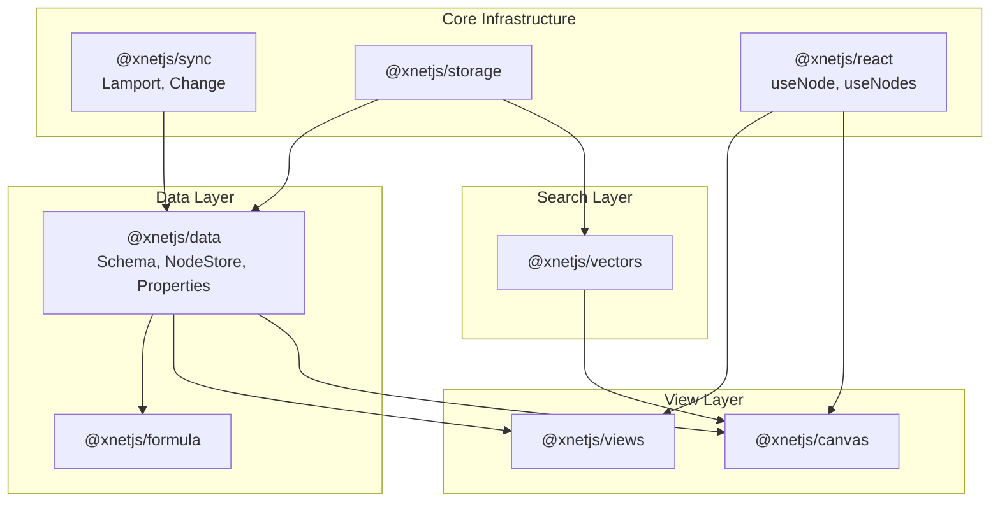

# xNet Implementation Plan - Step 02: Database Platform

> AI-agent-actionable implementation guide for Phase 2

## Prerequisites

Before starting this phase, ensure plan01MVP is complete:

- [x] All @xnetjs/\* core packages working
- [x] Platform POCs functional (Electron, Expo, Web)
- [x] Basic wiki/editor features working
- [x] P2P sync operational (Lamport timestamps, LWW conflict resolution)
- [x] > 80% test coverage on core packages
- [x] Schema-first Node architecture implemented (`@xnetjs/data`)

## Architecture Update

> **Note:** The schema-first architecture has been implemented. See `docs/plans/plan02_1DataModelConsolidation/HANDOFF.md`.
>
> Key changes:
>
> - Everything is a **Node** with a **Schema**
> - `@xnetjs/records` has been removed - all functionality is now in `@xnetjs/data`
> - Sync uses **Lamport timestamps** (not vector clocks) with LWW per property
> - 16 property types (rollup/formula are computed at read time, not stored)

## Implementation Order

Execute these documents in order. Each builds on the previous.

| #   | Document                                   | Description                          | Est. Time |
| --- | ------------------------------------------ | ------------------------------------ | --------- |
| 00  | [Overview](./00-overview.md)               | Architecture, prerequisites, goals   | Reference |
| 01  | [Property Types](./01-property-types.md)   | 16 property types system             | 3 weeks   |
| 02  | [Table View](./02-view-table.md)           | Spreadsheet view with TanStack Table | 2 weeks   |
| 03  | [Board View](./03-view-board.md)           | Kanban board with drag-drop          | 2 weeks   |
| 04  | [Gallery View](./04-view-gallery.md)       | Card-based gallery layout            | 1 week    |
| 05  | [Timeline View](./05-view-timeline.md)     | Gantt chart with dependencies        | 2 weeks   |
| 06  | [Calendar View](./06-view-calendar.md)     | Month/week/day calendar              | 2 weeks   |
| 07  | [Formula Engine](./07-formula-engine.md)   | Expression parser and evaluator      | 3 weeks   |
| 08  | [Vector Search](./08-vector-search.md)     | Semantic search with embeddings      | 2 weeks   |
| 09  | [Infinite Canvas](./09-infinite-canvas.md) | Spatial graph visualization          | 4 weeks   |
| 10  | [Timeline](./10-timeline.md)               | Development schedule and milestones  | Reference |

## Validation Gates

### After Property Types

- [x] All 16 property types functional (in `@xnetjs/data/schema/properties/`)
- [x] Property validation works (via `defineSchema()`)
- [x] LWW sync for properties works (via `NodeStore`)
- [x] Tests pass (>80% coverage)

### After Core Views (Table + Board)

- [ ] Table view renders 10k rows smoothly
- [ ] Virtual scrolling works
- [ ] Kanban drag-drop syncs across peers
- [ ] Filter/sort works on all views

### After All Views

- [ ] Gallery renders with cover images
- [ ] Timeline shows date ranges
- [ ] Calendar supports drag scheduling
- [ ] View switching is instant

### After Formula Engine

- [ ] All formula categories work (math, string, date, logic)
- [ ] Formula errors display clearly
- [ ] Circular reference detection works
- [ ] Performance acceptable for 1000+ formulas

### After Vector Search

- [ ] Semantic search returns relevant results
- [ ] Index builds in <5s for 10k documents
- [ ] Search latency <100ms

### After Infinite Canvas

- [ ] Canvas renders 1000+ nodes smoothly
- [ ] Auto-layout produces readable graphs
- [ ] Pan/zoom performance is smooth
- [ ] Links render correctly

## Quick Reference

### Package Dependencies

```
@xnetjs/data ──────> @xnetjs/core, @xnetjs/sync, @xnetjs/crypto
@xnetjs/views ─────> @xnetjs/data, @xnetjs/react
@xnetjs/formula ───> @xnetjs/data
@xnetjs/vectors ───> @xnetjs/storage
@xnetjs/canvas ────> @xnetjs/data, @xnetjs/vectors
```

### Key Types

```typescript
// Node-based architecture
type SchemaIRI = `xnet://${string}/${string}` // e.g., 'xnet://xnet.dev/Task'
type NodeId = string // NanoID (21 chars)
type PropertyKey = string

// Property Types (16 total)
type PropertyType =
  | 'text'
  | 'number'
  | 'checkbox' // Basic
  | 'date'
  | 'dateRange' // Temporal
  | 'select'
  | 'multiSelect' // Selection
  | 'person'
  | 'relation' // References
  | 'url'
  | 'email'
  | 'phone'
  | 'file' // Rich
  | 'created'
  | 'updated'
  | 'createdBy' // Auto

// View Types
type ViewType = 'table' | 'board' | 'gallery' | 'timeline' | 'calendar' | 'list'
```

### Test Commands

```bash
pnpm test                           # All tests
pnpm vitest run packages/data       # Data package (62 tests)
pnpm --filter @xnetjs/views test      # Views package
pnpm --filter @xnetjs/formula test    # Formula engine
pnpm test:coverage                  # With coverage
```

## Architecture Overview



---

[Back to plan01MVP](../plan01MVP/README.md) | [Start with Overview →](./00-overview.md)
