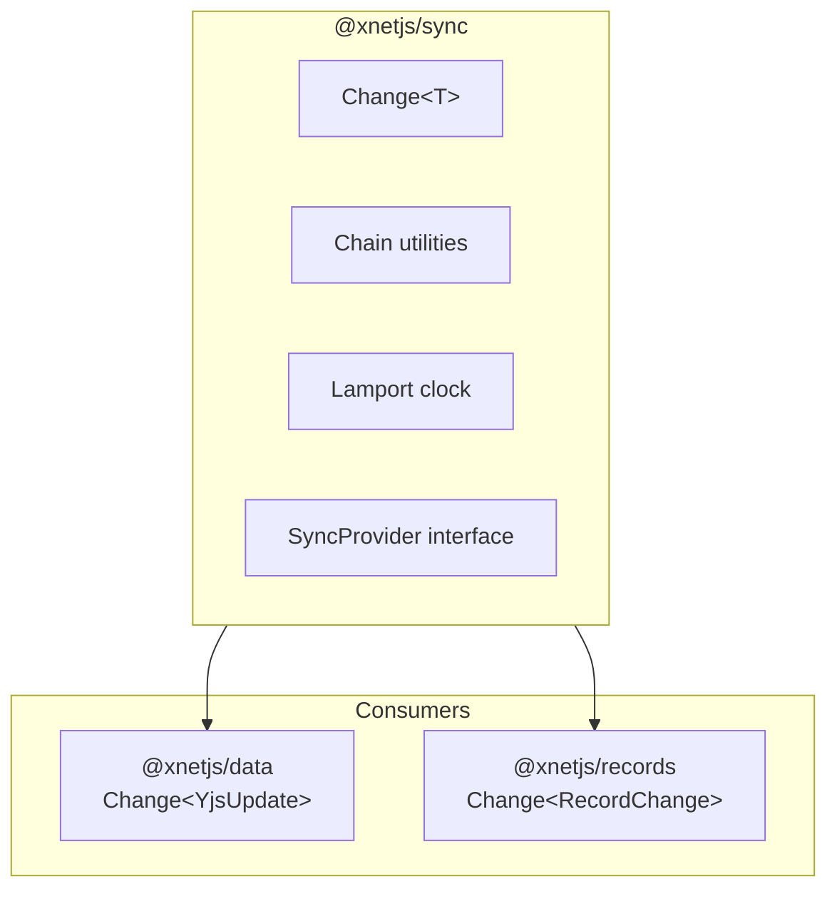

# 01: @xnetjs/sync Package

> Unified sync primitives for both Yjs and event-sourcing

**Status:** COMPLETE
**Tests:** 78 passing

## Overview

The `@xnetjs/sync` package provides base abstractions for all sync operations. Both `@xnetjs/data` (Yjs) and `@xnetjs/records` (event-sourcing) import from this package.



## Package Structure

```
packages/sync/
├── src/
│   ├── index.ts           # Public exports
│   ├── change.ts          # Change<T> type and helpers
│   ├── chain.ts           # Hash chain management
│   ├── clock.ts           # Lamport clock utilities
│   └── provider.ts        # SyncProvider interface
├── test/
│   ├── change.test.ts
│   ├── chain.test.ts
│   ├── clock.test.ts
│   └── provider.test.ts
├── package.json
└── tsconfig.json
```

## Key Design Decision: Lamport Timestamps

We use **Lamport timestamps** instead of vector clocks for ordering changes:

```typescript
interface LamportTimestamp {
  time: number // Logical time (increments on each change)
  author: DID // For deterministic tie-breaking
}
```

**Why Lamport over Vector Clocks:**

| Aspect     | Vector Clock                     | Lamport Timestamp              |
| ---------- | -------------------------------- | ------------------------------ |
| Size       | Grows with participants          | Constant (1 integer)           |
| Merge      | `max()` per participant          | `max(local, received)`         |
| Ordering   | Partial (can detect concurrency) | Total (with tie-breaker)       |
| Complexity | High                             | Low                            |
| CRDT needs | Can detect "concurrent"          | Just needs deterministic order |

For CRDTs, we don't need to detect whether events were concurrent - we just need a **deterministic total order** so all nodes converge to the same state.

**Ordering rule:**

1. Compare by `time` (lower = earlier)
2. Tie-break by `author` DID string comparison

## Implementation

### Change Type

```typescript
// packages/sync/src/change.ts

import type { ContentId, DID } from '@xnetjs/core'
import type { LamportTimestamp } from './clock'

/**
 * Base change type for all sync mechanisms.
 * Generic T allows different payload types for different use cases.
 */
export interface Change<T = unknown> {
  /** Unique change ID */
  id: string

  /** Change type (e.g., 'yjs-update', 'create-item', 'update-item') */
  type: string

  /** The actual change data */
  payload: T

  /** Content-addressed hash of this change */
  hash: ContentId

  /** Hash of the previous change in the chain (null for first) */
  parentHash: ContentId | null

  /** DID of the author */
  authorDID: DID

  /** Ed25519 signature of the hash */
  signature: Uint8Array

  /** Wall clock timestamp (ms) - for display only, not ordering */
  wallTime: number

  /** Lamport timestamp for ordering */
  lamport: LamportTimestamp
}
```

### Lamport Clock Utilities

```typescript
// packages/sync/src/clock.ts

import type { DID } from '@xnetjs/core'

/**
 * A Lamport timestamp with author for deterministic tie-breaking.
 */
export interface LamportTimestamp {
  time: number
  author: DID
}

/**
 * A Lamport clock that tracks the current logical time.
 */
export interface LamportClock {
  time: number
  author: DID
}

/**
 * Create a new Lamport clock for an author.
 * Starts at time 0; first tick will produce time 1.
 */
export function createLamportClock(author: DID): LamportClock {
  return { time: 0, author }
}

/**
 * Tick the clock and return a new timestamp.
 */
export function tick(clock: LamportClock): [LamportClock, LamportTimestamp] {
  const newTime = clock.time + 1
  return [
    { ...clock, time: newTime },
    { time: newTime, author: clock.author }
  ]
}

/**
 * Update the clock after receiving a change from another node.
 */
export function receive(clock: LamportClock, receivedTime: number): LamportClock {
  return { ...clock, time: Math.max(clock.time, receivedTime) }
}

/**
 * Compare two Lamport timestamps for total ordering.
 */
export function compareLamportTimestamps(a: LamportTimestamp, b: LamportTimestamp): -1 | 0 | 1 {
  if (a.time < b.time) return -1
  if (a.time > b.time) return 1
  const cmp = a.author.localeCompare(b.author)
  return cmp < 0 ? -1 : cmp > 0 ? 1 : 0
}

/**
 * Serialize a Lamport timestamp for storage/sorting.
 * Format: {time-padded-16-digits}-{author}
 */
export function serializeTimestamp(ts: LamportTimestamp): string {
  return `${ts.time.toString().padStart(16, '0')}-${ts.author}`
}
```

### Hash Chain Management

```typescript
// packages/sync/src/chain.ts

import type { ContentId } from '@xnetjs/core'
import type { Change } from './change'
import { compareLamportTimestamps } from './clock'

export interface ChainValidationResult {
  valid: boolean
  error?: string
  forkDetected?: boolean
  forkPoint?: ContentId
}

export interface Fork<T = unknown> {
  commonAncestor: ContentId
  branch1: Change<T>[]
  branch2: Change<T>[]
}

export function validateChain<T>(changes: Change<T>[]): ChainValidationResult
export function detectFork<T>(changes: Change<T>[]): { hasFork: boolean; forkPoints: ContentId[] }
export function getChainHeads<T>(changes: Change<T>[]): Change<T>[]
export function getChainRoots<T>(changes: Change<T>[]): Change<T>[]
export function getAncestry<T>(change: Change<T>, allChanges: Change<T>[]): Change<T>[]
export function findCommonAncestor<T>(
  a: Change<T>,
  b: Change<T>,
  allChanges: Change<T>[]
): Change<T> | null
export function getForks<T>(changes: Change<T>[]): Fork<T>[]
export function topologicalSort<T>(changes: Change<T>[]): Change<T>[]
```

### Sync Provider Interface

```typescript
// packages/sync/src/provider.ts

import type { Change } from './change'

export type SyncStatus = 'disconnected' | 'connecting' | 'synced' | 'syncing' | 'error'

export interface SyncProviderEvents<T> {
  'status-change': (status: SyncStatus) => void
  'change-received': (change: Change<T>) => void
  'changes-synced': (changes: Change<T>[]) => void
  'peer-connected': (peerId: string) => void
  'peer-disconnected': (peerId: string) => void
  error: (error: Error) => void
}

export interface SyncProvider<T = unknown> {
  readonly status: SyncStatus
  readonly peers: string[]
  connect(): Promise<void>
  disconnect(): Promise<void>
  broadcast(change: Change<T>): Promise<void>
  requestChanges(peerId: string, since?: string): Promise<Change<T>[]>
  on<E extends keyof SyncProviderEvents<T>>(event: E, listener: SyncProviderEvents<T>[E]): void
  off<E extends keyof SyncProviderEvents<T>>(event: E, listener: SyncProviderEvents<T>[E]): void
}
```

## Usage Example

```typescript
import {
  createLamportClock,
  tick,
  receive,
  createUnsignedChange,
  signChange,
  compareLamportTimestamps
} from '@xnetjs/sync'

// Create a clock for this author
let clock = createLamportClock('did:key:z6MkAuthor...')

// Create a change
let lamport: LamportTimestamp
;[clock, lamport] = tick(clock)

const unsigned = createUnsignedChange({
  id: 'change-1',
  type: 'set-property',
  payload: { property: 'title', value: 'Hello' },
  parentHash: null,
  authorDID: 'did:key:z6MkAuthor...',
  lamport
})

const signed = signChange(unsigned, signingKey)

// When receiving a change from another node
clock = receive(clock, receivedChange.lamport.time)

// Sort changes by Lamport timestamp
changes.sort((a, b) => compareLamportTimestamps(a.lamport, b.lamport))
```

## Tests

78 tests across 4 test files:

- **clock.test.ts**: Lamport clock operations, timestamp comparison, serialization
- **change.test.ts**: Change creation, signing, verification
- **chain.test.ts**: Chain validation, fork detection, topological sort
- **provider.test.ts**: SyncProvider interface, BaseSyncProvider

Run tests:

```bash
pnpm --filter @xnetjs/sync test
```

## Migration from Vector Clocks

If you have existing code using vector clocks:

```typescript
// OLD (vector clock)
const clock: VectorClock = { [nodeA]: 3, [nodeB]: 2 }
const newClock = incrementVectorClock(clock, nodeA)

// NEW (Lamport)
let clock = createLamportClock(nodeA)
let ts: LamportTimestamp
;[clock, ts] = tick(clock) // ts.time = 1, ts.author = nodeA
```

The key difference is that Lamport clocks are **per-author** and produce a **total order**, while vector clocks are **shared** and produce a **partial order**.

---

[← Back to Overview](./00-overview.md) | [Next: PropertyValue Simplification →](./02-property-value-simplification.md)
