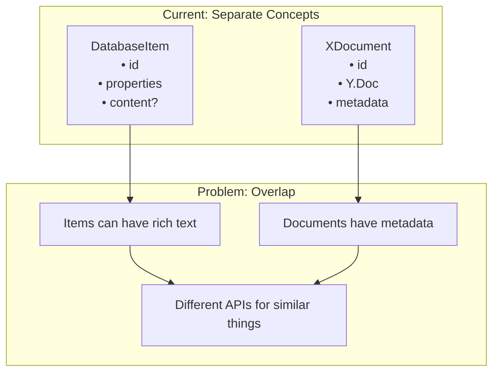
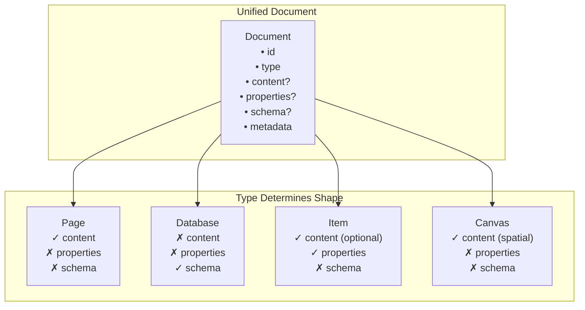

# 03: Unified Document Model

> Merge XDocument and DatabaseItem into a single Document interface

**Duration:** 1 week
**Risk Level:** Medium
**Dependencies:** 02-property-value-simplification

## Overview

Currently the codebase has two separate concepts for "things users create":

1. **XDocument** (in @xnetjs/data) - Rich text documents with Yjs
2. **DatabaseItem** (in @xnetjs/records) - Tabular data with properties

But database items can also have rich text content, and documents can have metadata properties. This creates conceptual overlap.



## Solution

Create a unified `Document` interface where the `type` field determines the shape:

```typescript
interface Document {
  id: string
  type: 'page' | 'database' | 'item' | 'canvas'

  // Rich content (optional, Yjs-backed)
  content?: Y.Doc

  // Structured properties (optional)
  properties?: Record<PropertyId, PropertyValue>

  // Schema (for databases only)
  schema?: PropertyDefinition[]

  // Metadata (all documents)
  created: number
  updated: number
  createdBy: DID
  workspaceId: string
}
```



## Implementation

### Core Types

```typescript
// packages/core/src/document.ts

import type { DID } from './did'
import type { PropertyValue } from '@xnetjs/records'

/**
 * Document types in xNet
 */
export type DocumentType = 'page' | 'database' | 'item' | 'canvas'

/**
 * Base document interface - all documents share these fields
 */
export interface DocumentBase {
  /** Unique document ID */
  id: string

  /** Document type determines available fields */
  type: DocumentType

  /** Workspace this document belongs to */
  workspaceId: string

  /** Parent document ID (for hierarchy) */
  parentId?: string

  /** Document title (extracted from content or first property) */
  title: string

  /** Icon (emoji or URL) */
  icon?: string

  /** Cover image URL */
  cover?: string

  /** Creation timestamp (ms) */
  created: number

  /** Last update timestamp (ms) */
  updated: number

  /** Creator's DID */
  createdBy: DID

  /** Last updater's DID */
  updatedBy: DID

  /** Soft delete */
  deleted: boolean
  deletedAt?: number
  deletedBy?: DID
}

/**
 * Page - rich text content
 */
export interface Page extends DocumentBase {
  type: 'page'

  /** Yjs document for rich text content */
  content: Y.Doc
}

/**
 * Database - schema definition (items stored separately)
 */
export interface Database extends DocumentBase {
  type: 'database'

  /** Property schema */
  schema: PropertyDefinition[]

  /** View definitions */
  views: View[]

  /** Default view ID */
  defaultViewId: ViewId
}

/**
 * Item - row in a database
 */
export interface Item extends DocumentBase {
  type: 'item'

  /** Parent database ID */
  databaseId: string

  /** Property values */
  properties: Record<PropertyId, PropertyValue>

  /** Optional rich text content (like Notion pages in databases) */
  content?: Y.Doc
}

/**
 * Canvas - spatial layout
 */
export interface Canvas extends DocumentBase {
  type: 'canvas'

  /** Yjs document for spatial data */
  content: Y.Doc
}

/**
 * Union of all document types
 */
export type Document = Page | Database | Item | Canvas

/**
 * Type guard for page documents
 */
export function isPage(doc: Document): doc is Page {
  return doc.type === 'page'
}

/**
 * Type guard for database documents
 */
export function isDatabase(doc: Document): doc is Database {
  return doc.type === 'database'
}

/**
 * Type guard for item documents
 */
export function isItem(doc: Document): doc is Item {
  return doc.type === 'item'
}

/**
 * Type guard for canvas documents
 */
export function isCanvas(doc: Document): doc is Canvas {
  return doc.type === 'canvas'
}
```

### Backward Compatibility Layer

Maintain existing APIs while transitioning:

```typescript
// packages/data/src/document.ts

import type { Document, Page } from '@xnetjs/core'

/**
 * @deprecated Use Document from @xnetjs/core instead
 * XDocument is now an alias for Page
 */
export type XDocument = Page

/**
 * Create a page document (backward compatible)
 */
export function createDocument(options: {
  id?: string
  workspaceId: string
  title?: string
  createdBy: DID
  signingKey: Uint8Array
}): Page {
  const id = options.id || generateId()

  return {
    id,
    type: 'page',
    workspaceId: options.workspaceId,
    title: options.title || 'Untitled',
    created: Date.now(),
    updated: Date.now(),
    createdBy: options.createdBy,
    updatedBy: options.createdBy,
    deleted: false,
    content: new Y.Doc()
  }
}
```

```typescript
// packages/records/src/types.ts

import type { Document, Item, Database } from '@xnetjs/core'

/**
 * @deprecated Use Item from @xnetjs/core instead
 */
export type DatabaseItem = Item
```

### Storage Adapter Updates

```typescript
// packages/storage/src/adapters/document-adapter.ts

import type { Document, DocumentType } from '@xnetjs/core'

export interface DocumentAdapter {
  /**
   * Get a document by ID
   */
  get(id: string): Promise<Document | null>

  /**
   * Save a document
   */
  save(document: Document): Promise<void>

  /**
   * Delete a document (soft delete)
   */
  delete(id: string, deletedBy: DID): Promise<void>

  /**
   * List documents with filters
   */
  list(options: {
    workspaceId?: string
    type?: DocumentType
    parentId?: string
    databaseId?: string // For items
    includeDeleted?: boolean
    limit?: number
    offset?: number
  }): Promise<Document[]>

  /**
   * Search documents
   */
  search(
    query: string,
    options?: {
      workspaceId?: string
      type?: DocumentType
      limit?: number
    }
  ): Promise<Document[]>
}
```

### React Hook Updates

```typescript
// packages/react/src/hooks/useDocument.ts

import type { Document, DocumentType, Page, Database, Item } from '@xnetjs/core'

interface UseDocumentOptions {
  /** Enable real-time sync */
  sync?: boolean
}

interface UseDocumentReturn<T extends Document> {
  /** The document (null while loading) */
  document: T | null

  /** Loading state */
  loading: boolean

  /** Error if any */
  error: Error | null

  /** Update the document */
  update: (changes: Partial<T>) => Promise<void>

  /** Delete the document */
  delete: () => Promise<void>
}

/**
 * Hook for working with any document type
 */
export function useDocument<T extends Document = Document>(
  id: string,
  options?: UseDocumentOptions
): UseDocumentReturn<T> {
  // Implementation uses the unified Document type
  // ...
}

/**
 * Convenience hook for page documents
 */
export function usePage(id: string, options?: UseDocumentOptions) {
  return useDocument<Page>(id, options)
}

/**
 * Convenience hook for database documents
 */
export function useDatabase(id: string, options?: UseDocumentOptions) {
  return useDocument<Database>(id, options)
}

/**
 * Convenience hook for item documents
 */
export function useItem(id: string, options?: UseDocumentOptions) {
  return useDocument<Item>(id, options)
}
```

### Query Updates

```typescript
// packages/query/src/types.ts

import type { Document, DocumentType } from '@xnetjs/core'

export interface DocumentQuery {
  /** Filter by document type */
  type?: DocumentType | DocumentType[]

  /** Filter by workspace */
  workspaceId?: string

  /** Filter by parent document */
  parentId?: string

  /** Filter by database (for items) */
  databaseId?: string

  /** Full-text search */
  search?: string

  /** Property filters (for items) */
  propertyFilters?: PropertyFilter[]

  /** Sort order */
  sort?: {
    field: 'created' | 'updated' | 'title' | string // string for property IDs
    direction: 'asc' | 'desc'
  }

  /** Pagination */
  limit?: number
  offset?: number
}

/**
 * Query documents with unified interface
 */
export function queryDocuments(query: DocumentQuery): Promise<Document[]> {
  // Implementation handles all document types uniformly
  // ...
}
```

## Migration Strategy

### Phase 1: Add Unified Types (No Breaking Changes)

1. Add `Document` union type to @xnetjs/core
2. Add type guards
3. Keep existing `XDocument` and `DatabaseItem` as aliases
4. All existing code continues to work

### Phase 2: Update Storage Layer

1. Storage adapters accept unified `Document` type
2. Internally handle all document types
3. Existing APIs still work via aliases

### Phase 3: Update React Hooks

1. Add generic `useDocument<T>` hook
2. Keep existing hooks as convenience wrappers
3. Migrate internal implementation to unified types

### Phase 4: Update Query Layer

1. Unified query interface for all document types
2. Existing query functions become thin wrappers
3. Full-text search works across all types

### Phase 5: Deprecation (Future)

1. Mark old types as deprecated
2. Update documentation
3. Eventually remove in major version

## Tests

```typescript
// packages/core/test/document.test.ts

import { describe, it, expect } from 'vitest'
import { isPage, isDatabase, isItem, isCanvas } from '../src/document'

describe('Document type guards', () => {
  const pageDoc = {
    id: 'page-1',
    type: 'page' as const,
    workspaceId: 'ws-1',
    title: 'Test Page',
    created: Date.now(),
    updated: Date.now(),
    createdBy: 'did:key:z6Mk...' as DID,
    updatedBy: 'did:key:z6Mk...' as DID,
    deleted: false,
    content: {} as Y.Doc
  }

  const itemDoc = {
    id: 'item-1',
    type: 'item' as const,
    workspaceId: 'ws-1',
    databaseId: 'db-1',
    title: 'Test Item',
    properties: {},
    created: Date.now(),
    updated: Date.now(),
    createdBy: 'did:key:z6Mk...' as DID,
    updatedBy: 'did:key:z6Mk...' as DID,
    deleted: false
  }

  it('correctly identifies page documents', () => {
    expect(isPage(pageDoc)).toBe(true)
    expect(isPage(itemDoc)).toBe(false)
  })

  it('correctly identifies item documents', () => {
    expect(isItem(itemDoc)).toBe(true)
    expect(isItem(pageDoc)).toBe(false)
  })
})
```

```typescript
// packages/react/test/hooks/useDocument.test.tsx

import { describe, it, expect } from 'vitest'
import { renderHook, waitFor } from '@testing-library/react'
import { useDocument, usePage, useItem } from '../../src/hooks/useDocument'

describe('useDocument', () => {
  it('loads page documents', async () => {
    const { result } = renderHook(() => usePage('page-1'))

    await waitFor(() => {
      expect(result.current.loading).toBe(false)
    })

    expect(result.current.document?.type).toBe('page')
  })

  it('loads item documents', async () => {
    const { result } = renderHook(() => useItem('item-1'))

    await waitFor(() => {
      expect(result.current.loading).toBe(false)
    })

    expect(result.current.document?.type).toBe('item')
  })

  it('handles generic document type', async () => {
    const { result } = renderHook(() => useDocument('doc-1'))

    await waitFor(() => {
      expect(result.current.loading).toBe(false)
    })

    // Type is determined at runtime
    expect(['page', 'database', 'item', 'canvas']).toContain(result.current.document?.type)
  })
})
```

## Checklist

### Day 1-2: Core Types

- [ ] Define `DocumentBase` interface
- [ ] Define `Page`, `Database`, `Item`, `Canvas`
- [ ] Create `Document` union type
- [ ] Add type guards (`isPage`, `isDatabase`, `isItem`, `isCanvas`)
- [ ] Add to @xnetjs/core exports
- [ ] Write type tests

### Day 3: Backward Compatibility

- [ ] Create `XDocument` alias in @xnetjs/data (maps to `Page`)
- [ ] Create `DatabaseItem` alias in @xnetjs/records (maps to `Item`)
- [ ] Add deprecation notices
- [ ] Verify existing code compiles

### Day 4: Storage Updates

- [ ] Update `DocumentAdapter` interface
- [ ] Update IndexedDB adapter
- [ ] Update SQLite adapter (if applicable)
- [ ] Write storage tests

### Day 5: React Hook Updates

- [ ] Implement generic `useDocument<T>`
- [ ] Add `usePage`, `useDatabase`, `useItem` convenience hooks
- [ ] Update existing hooks to use new implementation
- [ ] Write hook tests

### Day 6: Query Updates

- [ ] Update `DocumentQuery` interface
- [ ] Update query implementation
- [ ] Verify search works across types
- [ ] Write query tests

### Day 7: Documentation & Cleanup

- [ ] Update CLAUDE.md
- [ ] Update package READMEs
- [ ] Add migration guide
- [ ] Final test run

## Benefits

After this change:

1. **Single concept** - "Document" instead of "Document vs Item"
2. **Unified queries** - Search across all document types
3. **Simpler APIs** - One `useDocument` instead of multiple hooks
4. **Future-proof** - Easy to add new document types (e.g., 'whiteboard')
5. **Consistent storage** - All documents stored the same way

---

[← Back to PropertyValue](./02-property-value-simplification.md) | [Next: Hash Consolidation →](./04-hash-function-consolidation.md)
