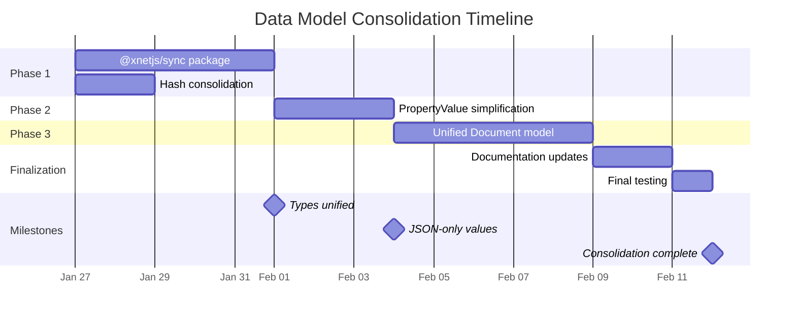
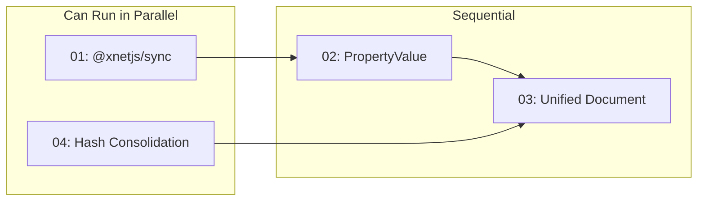

# 05: Timeline

> Schedule and milestones for Data Model Consolidation

## Overview

Total estimated duration: **2-3 weeks**

This consolidation can be done alongside other development work - it's primarily refactoring with low risk of breaking changes.

## Schedule

## Week-by-Week Breakdown

### Week 1: Foundation

| Day | Task                                         | Owner | Status |
| --- | -------------------------------------------- | ----- | ------ |
| Mon | Create @xnetjs/sync package structure        | -     | -      |
| Mon | Hash consolidation (parallel)                | -     | -      |
| Tue | Implement Change<T> type                     | -     | -      |
| Tue | Export bytesToHex from @xnetjs/crypto        | -     | -      |
| Wed | Implement vector clock utils in @xnetjs/sync | -     | -      |
| Wed | Update @xnetjs/core to use @xnetjs/crypto    | -     | -      |
| Thu | Implement chain utilities                    | -     | -      |
| Thu | Write tests for all new code                 | -     | -      |
| Fri | Update @xnetjs/data to use @xnetjs/sync      | -     | -      |
| Fri | Update @xnetjs/records to use @xnetjs/sync   | -     | -      |

**Milestone: Types Unified** - Single Change<T> type used by both sync mechanisms

### Week 2: Simplification

| Day | Task                                      | Owner | Status |
| --- | ----------------------------------------- | ----- | ------ |
| Mon | Update PropertyValue type definition      | -     | -      |
| Mon | Update date property handler              | -     | -      |
| Tue | Update dateRange property handler         | -     | -      |
| Tue | Update file property handler              | -     | -      |
| Wed | Create migration script for existing data | -     | -      |
| Wed | Write comprehensive property tests        | -     | -      |
| Thu | Define unified Document interface         | -     | -      |
| Thu | Add type guards for document types        | -     | -      |
| Fri | Create backward compatibility aliases     | -     | -      |
| Fri | Update storage adapters                   | -     | -      |

**Milestone: JSON-Only Values** - All PropertyValue types are JSON-serializable

### Week 3: Integration & Polish

| Day | Task                                       | Owner | Status |
| --- | ------------------------------------------ | ----- | ------ |
| Mon | Update React hooks for unified Document    | -     | -      |
| Tue | Update query layer for unified Document    | -     | -      |
| Wed | Documentation updates (CLAUDE.md, READMEs) | -     | -      |
| Thu | Full test suite run                        | -     | -      |
| Thu | Fix any failing tests                      | -     | -      |
| Fri | Code review and cleanup                    | -     | -      |
| Fri | Mark deprecated APIs                       | -     | -      |

**Milestone: Consolidation Complete** - All changes merged, tests passing

## Dependencies

- **01 and 04** can be done in parallel (no dependencies between them)
- **02** depends on 01 (uses Operation<T> for migrations)
- **03** depends on 02 (uses simplified PropertyValue)

## Risk Mitigation

### Risk: Breaking Existing Tests

**Mitigation:**

- Run tests after each file change
- Keep backward compatibility aliases until all tests pass
- Don't remove deprecated code until next major version

### Risk: Circular Dependencies

**Mitigation:**

- @xnetjs/sync has minimal dependencies (only crypto, core types)
- Clear layering: crypto → sync → core → data/records
- Test with `pnpm build` after each package change

### Risk: Performance Regression

**Mitigation:**

- No algorithmic changes (just type reorganization)
- Benchmark hash operations before/after
- JSON serialization should be same or faster than custom

### Risk: Incomplete Migration

**Mitigation:**

- Feature flags not needed (backward compatible)
- Deprecated APIs continue to work
- Gradual migration over multiple releases

## Success Criteria

### Quantitative

| Metric                | Before | After | Target |
| --------------------- | ------ | ----- | ------ |
| Test pass rate        | 100%   | 100%  | 100%   |
| Test coverage         | >80%   | >80%  | >80%   |
| Duplicate types       | 3      | 0     | 0      |
| Duplicate functions   | 2      | 0     | 0      |
| Packages with hashing | 2      | 1     | 1      |

### Qualitative

- [ ] Single `Change<T>` type documented in CLAUDE.md
- [ ] "Where Things Live" table accurate
- [ ] No "which function do I use?" confusion
- [ ] New developers can understand sync in <30 min

## Rollback Plan

All changes are backward compatible, so rollback is straightforward:

1. **If @xnetjs/sync causes issues:**
   - Keep using old types directly
   - Remove @xnetjs/sync dependency
   - All code continues to work

2. **If PropertyValue changes cause issues:**
   - Revert to old type definition
   - Remove migration script
   - Existing data still works

3. **If Unified Document causes issues:**
   - Remove Document union type
   - Keep using XDocument and DatabaseItem separately
   - Existing code unchanged

## Post-Consolidation

After this plan is complete, the codebase will be ready for:

1. **plan02DatabasePlatform** - Views, formulas, canvas with cleaner types
2. **plan03ERP** - Enterprise features built on unified foundation
3. **Major version bump** - Remove deprecated APIs, clean slate

## Checklist Summary

### Week 1

- [ ] @xnetjs/sync package created and tested
- [ ] Hash functions consolidated
- [ ] @xnetjs/data updated
- [ ] @xnetjs/records updated

### Week 2

- [ ] PropertyValue simplified
- [ ] Document interface unified
- [ ] Storage adapters updated
- [ ] Backward compatibility verified

### Week 3

- [ ] React hooks updated
- [ ] Query layer updated
- [ ] Documentation complete
- [ ] All tests passing
- [ ] Code reviewed

---

[← Back to Hash Consolidation](./04-hash-function-consolidation.md) | [Back to README](./README.md)
