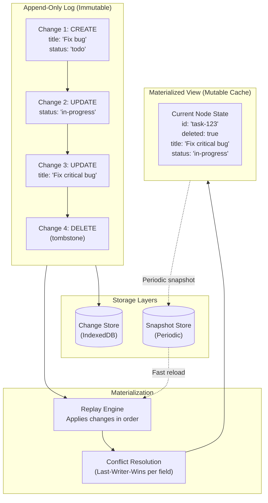
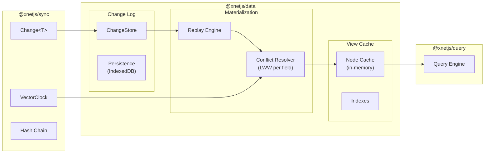
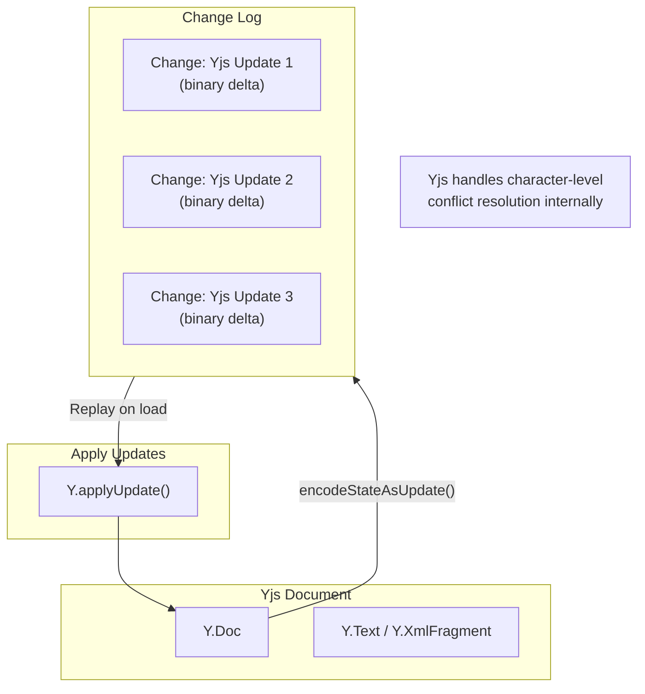

# Append-Only Architecture: Changes → Materialized Views

> How deletions and edits work in an append-only system

## Overview

The key insight: **we never delete from the log** - we append "tombstone" changes or new values, then **materialize** the current state by replaying the log.

## Data Flow Diagram



## Sequence: Create, Update, Delete

```mermaid
sequenceDiagram
    participant User
    participant API as Node API
    participant Log as Change Log
    participant Mat as Materializer
    participant View as Materialized View
    participant Sync as Sync Provider

    Note over Log: Append-only, immutable

    User->>API: createNode({ title: 'Task' })
    API->>Log: append Change&lt;Create&gt;
    Log->>Mat: new change
    Mat->>View: apply → Node created
    Log->>Sync: broadcast to peers

    User->>API: updateNode(id, { status: 'done' })
    API->>Log: append Change&lt;Update&gt;
    Log->>Mat: new change
    Mat->>View: apply → field updated
    Log->>Sync: broadcast to peers

    User->>API: deleteNode(id)
    API->>Log: append Change&lt;Delete&gt; (tombstone)
    Log->>Mat: new change
    Mat->>View: apply → mark deleted
    Log->>Sync: broadcast to peers

    Note over View: Query API filters out<br/>deleted: true by default
```

## Change Types for CRUD

```typescript
// The Change<T> payload types for different operations

type CreatePayload = {
  op: 'create'
  schemaId: string
  values: Record<string, unknown> // Initial field values
}

type UpdatePayload = {
  op: 'update'
  nodeId: string
  fields: Record<string, unknown> // Only changed fields (sparse)
}

type DeletePayload = {
  op: 'delete'
  nodeId: string
  // No other data needed - this is a tombstone
}

// All wrapped in Change<T>
type NodeChange = Change<CreatePayload | UpdatePayload | DeletePayload>
```

## Where This Lives in the Architecture



## Key Points

| Concept                                | How It Works                                      |
| -------------------------------------- | ------------------------------------------------- |
| **Log is immutable**                   | Changes are only appended, never modified         |
| **Deletes are tombstones**             | A `Change<Delete>` marks the node as deleted      |
| **Materialized view is a cache**       | Can be rebuilt from log at any time               |
| **Snapshots optimize reload**          | Periodic snapshots avoid replaying entire history |
| **Conflicts resolved by vector clock** | LWW per field using timestamps from Change        |
| **Queries filter tombstones**          | `deleted: true` nodes hidden by default           |

## Example: Task Lifecycle

```
Time    Change Log Entry                          Materialized State
────    ────────────────                          ──────────────────
t=1     CREATE task-123                           { id: 'task-123',
        { title: 'Fix bug', status: 'todo' }        title: 'Fix bug',
                                                    status: 'todo' }

t=2     UPDATE task-123                           { id: 'task-123',
        { status: 'in-progress' }                   title: 'Fix bug',
                                                    status: 'in-progress' }

t=3     UPDATE task-123                           { id: 'task-123',
        { title: 'Fix critical bug' }               title: 'Fix critical bug',
                                                    status: 'in-progress' }

t=4     DELETE task-123                           { id: 'task-123',
        (tombstone)                                 title: 'Fix critical bug',
                                                    status: 'in-progress',
                                                    deleted: true }

        Query: getTasks()                         → [] (filtered out)
        Query: getTasks({ includeDeleted: true }) → [task-123]
```

## How Yjs (Rich Text) Fits In

For rich text content, Yjs handles its own CRDT operations internally. The `Change<T>` wraps Yjs updates:



The Node stores a reference to the Yjs document, but the actual content changes flow through Yjs's own CRDT mechanism, wrapped in our `Change<T>` for signing and sync.

---

[← Back to README](./README.md)
