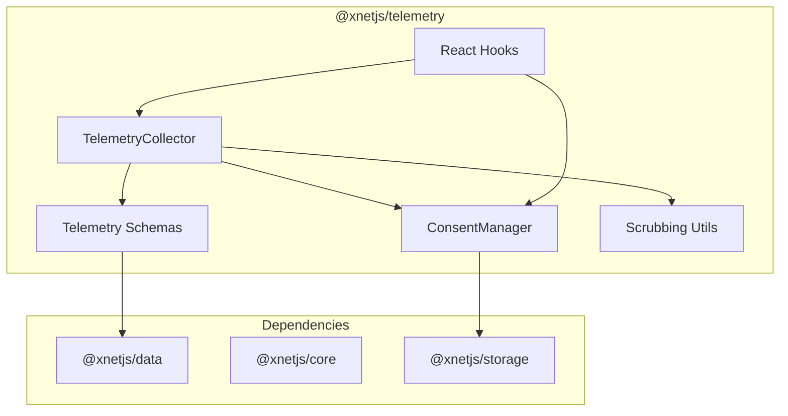

# 01: @xnetjs/telemetry Package

> Package structure and foundation for privacy-preserving telemetry

**Duration:** 2-3 days  
**Dependencies:** `@xnetjs/data`, `@xnetjs/core`, `@xnetjs/storage`

## Overview

The `@xnetjs/telemetry` package provides the foundation for collecting, storing, and optionally sharing telemetry data. It follows xNet's principles: local-first, user-controlled, and schema-defined.



## Package Structure

```
packages/telemetry/
├── src/
│   ├── index.ts                  # Public exports
│   │
│   ├── schemas/                  # Telemetry node schemas
│   │   ├── index.ts
│   │   ├── crash.ts              # CrashReport schema
│   │   ├── usage.ts              # UsageMetric schema
│   │   ├── security.ts           # SecurityEvent schema
│   │   └── performance.ts        # PerformanceMetric schema
│   │
│   ├── consent/                  # User consent management
│   │   ├── index.ts
│   │   ├── types.ts              # TelemetryTier, TelemetryConsent
│   │   ├── manager.ts            # ConsentManager class
│   │   └── storage.ts            # Consent persistence
│   │
│   ├── collection/               # Data collection
│   │   ├── index.ts
│   │   ├── collector.ts          # TelemetryCollector class
│   │   ├── scrubbing.ts          # PII removal utilities
│   │   ├── bucketing.ts          # P3A-style value bucketing
│   │   └── timing.ts             # Random delay for privacy
│   │
│   └── hooks/                    # React integration
│       ├── index.ts
│       ├── useTelemetry.ts       # Report telemetry hook
│       └── useConsent.ts         # Manage consent hook
│
├── test/
│   ├── schemas.test.ts
│   ├── consent.test.ts
│   ├── collector.test.ts
│   ├── scrubbing.test.ts
│   └── bucketing.test.ts
│
├── package.json
├── tsconfig.json
└── vitest.config.ts
```

## Package Configuration

```json
// packages/telemetry/package.json
{
  "name": "@xnetjs/telemetry",
  "version": "0.0.1",
  "type": "module",
  "main": "./dist/index.js",
  "types": "./dist/index.d.ts",
  "exports": {
    ".": {
      "import": "./dist/index.js",
      "types": "./dist/index.d.ts"
    },
    "./schemas": {
      "import": "./dist/schemas/index.js",
      "types": "./dist/schemas/index.d.ts"
    },
    "./consent": {
      "import": "./dist/consent/index.js",
      "types": "./dist/consent/index.d.ts"
    },
    "./hooks": {
      "import": "./dist/hooks/index.js",
      "types": "./dist/hooks/index.d.ts"
    }
  },
  "scripts": {
    "build": "tsup src/index.ts src/schemas/index.ts src/consent/index.ts src/hooks/index.ts --format esm --dts --external react",
    "test": "vitest run",
    "typecheck": "tsc --noEmit"
  },
  "dependencies": {
    "@xnetjs/core": "workspace:*",
    "@xnetjs/data": "workspace:*",
    "@xnetjs/storage": "workspace:*"
  },
  "peerDependencies": {
    "react": "^18.0.0 || ^19.0.0"
  },
  "devDependencies": {
    "tsup": "^8.0.0",
    "typescript": "^5.4.0",
    "vitest": "^2.0.0"
  }
}
```

## Core Types

```typescript
// packages/telemetry/src/consent/types.ts

/**
 * Telemetry consent tiers (progressive - each includes previous).
 */
export type TelemetryTier =
  | 'off' // No collection at all
  | 'local' // Collect locally for user's own debugging
  | 'crashes' // + share crash reports
  | 'anonymous' // + share anonymous usage metrics
  | 'identified' // + include stable identifier (for beta testers)

/**
 * Numeric level for tier comparison.
 */
export function tierLevel(tier: TelemetryTier): number {
  const levels: Record<TelemetryTier, number> = {
    off: 0,
    local: 1,
    crashes: 2,
    anonymous: 3,
    identified: 4
  }
  return levels[tier]
}

/**
 * User's telemetry consent configuration.
 */
export interface TelemetryConsent {
  /** Current consent tier */
  tier: TelemetryTier

  /** Review crash reports before sending? */
  reviewBeforeSend: boolean

  /** Automatically scrub PII from telemetry? */
  autoScrub: boolean

  /** Which telemetry schemas are enabled? (empty = all for tier) */
  enabledSchemas: string[]

  /** When consent was granted */
  grantedAt: Date

  /** Optional expiry (re-prompt after this) */
  expiresAt?: Date
}

/**
 * Default consent (no collection).
 */
export const DEFAULT_CONSENT: TelemetryConsent = {
  tier: 'off',
  reviewBeforeSend: true,
  autoScrub: true,
  enabledSchemas: [],
  grantedAt: new Date(0)
}
```

## Main Exports

```typescript
// packages/telemetry/src/index.ts

// Consent
export { TelemetryTier, TelemetryConsent, tierLevel, DEFAULT_CONSENT } from './consent/types'
export { ConsentManager } from './consent/manager'

// Schemas
export {
  CrashReportSchema,
  UsageMetricSchema,
  SecurityEventSchema,
  PerformanceMetricSchema
} from './schemas'

// Collection
export { TelemetryCollector } from './collection/collector'
export { scrubTelemetryData, ScrubOptions } from './collection/scrubbing'
export { bucketCount, bucketTimestamp, CountBucket } from './collection/bucketing'

// Hooks (separate entry point for tree-shaking)
export { useTelemetry, useConsent } from './hooks'
```

## Implementation Steps

### Step 1: Create package structure

```bash
mkdir -p packages/telemetry/src/{schemas,consent,collection,hooks}
mkdir -p packages/telemetry/test
```

### Step 2: Create package.json and tsconfig.json

Use the configuration above. Copy tsconfig from `@xnetjs/data` as a base.

### Step 3: Implement consent types

Create `src/consent/types.ts` with the types defined above.

### Step 4: Create placeholder exports

```typescript
// src/index.ts - Start with re-exports
export * from './consent/types'

// src/schemas/index.ts - Placeholder
export const CrashReportSchema = {} as any // Implemented in 02-telemetry-schemas.md

// src/consent/index.ts
export * from './types'

// src/collection/index.ts - Placeholder
export {}

// src/hooks/index.ts - Placeholder
export {}
```

### Step 5: Add to workspace

Update root `pnpm-workspace.yaml` if needed, then:

```bash
pnpm install
pnpm --filter @xnetjs/telemetry build
```

## Tests

```typescript
// packages/telemetry/test/consent-types.test.ts

import { describe, it, expect } from 'vitest'
import { tierLevel, DEFAULT_CONSENT, TelemetryTier } from '../src/consent/types'

describe('TelemetryTier', () => {
  it('should have correct tier levels', () => {
    expect(tierLevel('off')).toBe(0)
    expect(tierLevel('local')).toBe(1)
    expect(tierLevel('crashes')).toBe(2)
    expect(tierLevel('anonymous')).toBe(3)
    expect(tierLevel('identified')).toBe(4)
  })

  it('should allow tier comparison', () => {
    const userTier: TelemetryTier = 'crashes'
    const requiredTier: TelemetryTier = 'anonymous'

    expect(tierLevel(userTier) >= tierLevel(requiredTier)).toBe(false)
  })
})

describe('DEFAULT_CONSENT', () => {
  it('should default to off', () => {
    expect(DEFAULT_CONSENT.tier).toBe('off')
  })

  it('should default to review before send', () => {
    expect(DEFAULT_CONSENT.reviewBeforeSend).toBe(true)
  })

  it('should default to auto scrub', () => {
    expect(DEFAULT_CONSENT.autoScrub).toBe(true)
  })
})
```

## Checklist

- [ ] Create package directory structure
- [ ] Add package.json with dependencies
- [ ] Add tsconfig.json
- [ ] Create consent types (TelemetryTier, TelemetryConsent)
- [ ] Create placeholder exports for all modules
- [ ] Add package to workspace
- [ ] Verify build works
- [ ] Write initial tests for consent types
- [ ] Tests pass

## Next Steps

After this document:

1. [02-telemetry-schemas.md](./02-telemetry-schemas.md) - Define the actual telemetry schemas
2. [03-consent-manager.md](./03-consent-manager.md) - Implement ConsentManager class

---

[Back to README](./README.md) | [Next: Telemetry Schemas](./02-telemetry-schemas.md)
