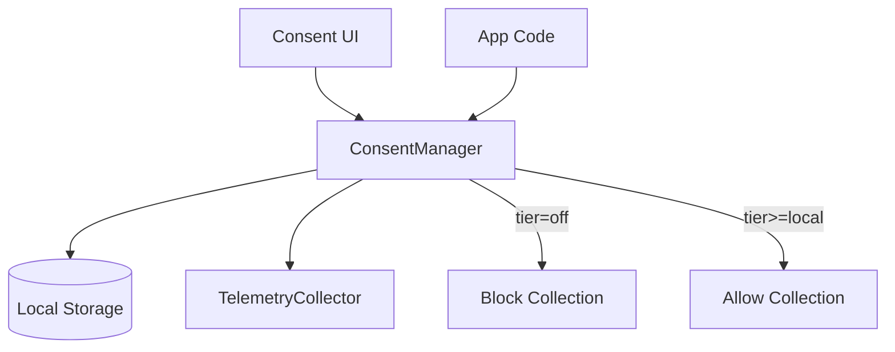

# 03: Consent Manager

> User consent management with persistence and tier enforcement

**Duration:** 2 days  
**Dependencies:** [01-telemetry-package.md](./01-telemetry-package.md), [02-telemetry-schemas.md](./02-telemetry-schemas.md)

## Overview

The `ConsentManager` is the gatekeeper for all telemetry operations. It:

- Persists user consent preferences
- Enforces tier restrictions
- Provides APIs for UI consent flows
- Emits events when consent changes



## Implementation

### ConsentManager Class

```typescript
// packages/telemetry/src/consent/manager.ts

import { EventEmitter } from 'events'
import type { TelemetryConsent, TelemetryTier } from './types'
import { DEFAULT_CONSENT, tierLevel } from './types'
import { ConsentStorage } from './storage'

export interface ConsentManagerEvents {
  'consent-changed': (consent: TelemetryConsent) => void
  'tier-changed': (oldTier: TelemetryTier, newTier: TelemetryTier) => void
}

export interface ConsentManagerOptions {
  /** Storage adapter for persisting consent */
  storage?: ConsentStorage

  /** Custom storage key */
  storageKey?: string

  /** Auto-load consent on creation */
  autoLoad?: boolean
}

export class ConsentManager extends EventEmitter {
  private consent: TelemetryConsent = DEFAULT_CONSENT
  private storage: ConsentStorage | null
  private storageKey: string
  private loaded = false

  constructor(options: ConsentManagerOptions = {}) {
    super()
    this.storage = options.storage ?? null
    this.storageKey = options.storageKey ?? 'xnet:telemetry:consent'

    if (options.autoLoad !== false && this.storage) {
      this.load()
    }
  }

  // ============ Getters ============

  /** Current consent configuration */
  get current(): Readonly<TelemetryConsent> {
    return this.consent
  }

  /** Current tier */
  get tier(): TelemetryTier {
    return this.consent.tier
  }

  /** Whether telemetry collection is enabled at all */
  get isEnabled(): boolean {
    return this.consent.tier !== 'off'
  }

  /** Whether sharing is enabled (tier >= crashes) */
  get isSharingEnabled(): boolean {
    return tierLevel(this.consent.tier) >= tierLevel('crashes')
  }

  /** Whether consent has been loaded from storage */
  get isLoaded(): boolean {
    return this.loaded
  }

  // ============ Tier Checks ============

  /**
   * Check if current consent allows a specific tier.
   */
  allowsTier(requiredTier: TelemetryTier): boolean {
    return tierLevel(this.consent.tier) >= tierLevel(requiredTier)
  }

  /**
   * Check if a specific schema is enabled.
   */
  allowsSchema(schemaIRI: string): boolean {
    if (!this.isEnabled) return false
    if (this.consent.enabledSchemas.length === 0) return true // All enabled
    return this.consent.enabledSchemas.includes(schemaIRI)
  }

  // ============ Updates ============

  /**
   * Update consent configuration.
   */
  async setConsent(updates: Partial<TelemetryConsent>): Promise<void> {
    const oldTier = this.consent.tier

    this.consent = {
      ...this.consent,
      ...updates,
      grantedAt: new Date()
    }

    // Persist
    if (this.storage) {
      await this.storage.set(this.storageKey, this.consent)
    }

    // Emit events
    this.emit('consent-changed', this.consent)
    if (updates.tier && updates.tier !== oldTier) {
      this.emit('tier-changed', oldTier, updates.tier)
    }
  }

  /**
   * Set consent tier (convenience method).
   */
  async setTier(tier: TelemetryTier): Promise<void> {
    await this.setConsent({ tier })
  }

  /**
   * Reset consent to defaults (opt-out).
   */
  async reset(): Promise<void> {
    await this.setConsent(DEFAULT_CONSENT)
  }

  // ============ Persistence ============

  /**
   * Load consent from storage.
   */
  async load(): Promise<void> {
    if (!this.storage) {
      this.loaded = true
      return
    }

    try {
      const stored = await this.storage.get(this.storageKey)
      if (stored) {
        this.consent = {
          ...DEFAULT_CONSENT,
          ...stored,
          grantedAt: new Date(stored.grantedAt),
          expiresAt: stored.expiresAt ? new Date(stored.expiresAt) : undefined
        }

        // Check if expired
        if (this.consent.expiresAt && this.consent.expiresAt < new Date()) {
          // Consent expired, reset to prompt user again
          this.consent = { ...DEFAULT_CONSENT, tier: 'off' }
        }
      }
      this.loaded = true
    } catch (error) {
      console.warn('Failed to load telemetry consent:', error)
      this.loaded = true
    }
  }

  // ============ Event Helpers ============

  on<E extends keyof ConsentManagerEvents>(event: E, listener: ConsentManagerEvents[E]): this {
    return super.on(event, listener)
  }

  off<E extends keyof ConsentManagerEvents>(event: E, listener: ConsentManagerEvents[E]): this {
    return super.off(event, listener)
  }
}
```

### Consent Storage Interface

```typescript
// packages/telemetry/src/consent/storage.ts

import type { TelemetryConsent } from './types'

/**
 * Storage adapter for consent persistence.
 */
export interface ConsentStorage {
  get(key: string): Promise<TelemetryConsent | null>
  set(key: string, consent: TelemetryConsent): Promise<void>
  delete(key: string): Promise<void>
}

/**
 * In-memory storage for testing.
 */
export class MemoryConsentStorage implements ConsentStorage {
  private data = new Map<string, TelemetryConsent>()

  async get(key: string): Promise<TelemetryConsent | null> {
    return this.data.get(key) ?? null
  }

  async set(key: string, consent: TelemetryConsent): Promise<void> {
    this.data.set(key, consent)
  }

  async delete(key: string): Promise<void> {
    this.data.delete(key)
  }
}

/**
 * localStorage adapter for browsers.
 */
export class LocalStorageConsentStorage implements ConsentStorage {
  async get(key: string): Promise<TelemetryConsent | null> {
    const raw = localStorage.getItem(key)
    if (!raw) return null
    try {
      return JSON.parse(raw)
    } catch {
      return null
    }
  }

  async set(key: string, consent: TelemetryConsent): Promise<void> {
    localStorage.setItem(key, JSON.stringify(consent))
  }

  async delete(key: string): Promise<void> {
    localStorage.removeItem(key)
  }
}

/**
 * IndexedDB adapter for larger storage needs.
 */
export class IndexedDBConsentStorage implements ConsentStorage {
  private dbName = 'xnet-telemetry'
  private storeName = 'consent'
  private db: IDBDatabase | null = null

  private async getDB(): Promise<IDBDatabase> {
    if (this.db) return this.db

    return new Promise((resolve, reject) => {
      const request = indexedDB.open(this.dbName, 1)

      request.onerror = () => reject(request.error)
      request.onsuccess = () => {
        this.db = request.result
        resolve(this.db)
      }

      request.onupgradeneeded = () => {
        const db = request.result
        if (!db.objectStoreNames.contains(this.storeName)) {
          db.createObjectStore(this.storeName)
        }
      }
    })
  }

  async get(key: string): Promise<TelemetryConsent | null> {
    const db = await this.getDB()
    return new Promise((resolve, reject) => {
      const tx = db.transaction(this.storeName, 'readonly')
      const store = tx.objectStore(this.storeName)
      const request = store.get(key)

      request.onerror = () => reject(request.error)
      request.onsuccess = () => resolve(request.result ?? null)
    })
  }

  async set(key: string, consent: TelemetryConsent): Promise<void> {
    const db = await this.getDB()
    return new Promise((resolve, reject) => {
      const tx = db.transaction(this.storeName, 'readwrite')
      const store = tx.objectStore(this.storeName)
      const request = store.put(consent, key)

      request.onerror = () => reject(request.error)
      request.onsuccess = () => resolve()
    })
  }

  async delete(key: string): Promise<void> {
    const db = await this.getDB()
    return new Promise((resolve, reject) => {
      const tx = db.transaction(this.storeName, 'readwrite')
      const store = tx.objectStore(this.storeName)
      const request = store.delete(key)

      request.onerror = () => reject(request.error)
      request.onsuccess = () => resolve()
    })
  }
}
```

### Index Export

```typescript
// packages/telemetry/src/consent/index.ts

export { TelemetryTier, TelemetryConsent, tierLevel, DEFAULT_CONSENT } from './types'
export { ConsentManager, ConsentManagerOptions, ConsentManagerEvents } from './manager'
export {
  ConsentStorage,
  MemoryConsentStorage,
  LocalStorageConsentStorage,
  IndexedDBConsentStorage
} from './storage'
```

## Usage Examples

### Basic Usage

```typescript
import { ConsentManager, LocalStorageConsentStorage } from '@xnetjs/telemetry'

// Create manager with localStorage persistence
const consent = new ConsentManager({
  storage: new LocalStorageConsentStorage()
})

// Wait for load if needed
await consent.load()

// Check current state
console.log(consent.tier) // 'off' (default)
console.log(consent.isEnabled) // false

// User opts in to crash reports
await consent.setTier('crashes')

// Check permissions
consent.allowsTier('local') // true
consent.allowsTier('anonymous') // false
```

### React Integration

```typescript
// Used by useConsent hook (implemented in 06-react-hooks.md)
const consent = useConsent()

// In consent UI
<ConsentDialog
  currentTier={consent.tier}
  onSave={async (tier) => {
    await consent.setTier(tier)
  }}
/>
```

### Event Handling

```typescript
const consent = new ConsentManager({ storage })

consent.on('tier-changed', (oldTier, newTier) => {
  console.log(`Consent changed: ${oldTier} -> ${newTier}`)

  if (newTier === 'off') {
    // User opted out, stop all collection
    telemetryCollector.stop()
  }
})
```

## Tests

```typescript
// packages/telemetry/test/consent.test.ts

import { describe, it, expect, beforeEach } from 'vitest'
import { ConsentManager, MemoryConsentStorage, DEFAULT_CONSENT, tierLevel } from '../src/consent'

describe('ConsentManager', () => {
  let storage: MemoryConsentStorage
  let consent: ConsentManager

  beforeEach(() => {
    storage = new MemoryConsentStorage()
    consent = new ConsentManager({ storage, autoLoad: false })
  })

  describe('defaults', () => {
    it('should default to off', () => {
      expect(consent.tier).toBe('off')
      expect(consent.isEnabled).toBe(false)
    })

    it('should default to review before send', () => {
      expect(consent.current.reviewBeforeSend).toBe(true)
    })
  })

  describe('setTier', () => {
    it('should update tier', async () => {
      await consent.setTier('crashes')
      expect(consent.tier).toBe('crashes')
      expect(consent.isEnabled).toBe(true)
    })

    it('should emit tier-changed event', async () => {
      const events: Array<[string, string]> = []
      consent.on('tier-changed', (old, next) => events.push([old, next]))

      await consent.setTier('crashes')

      expect(events).toEqual([['off', 'crashes']])
    })

    it('should persist to storage', async () => {
      await consent.setTier('crashes')

      const stored = await storage.get('xnet:telemetry:consent')
      expect(stored?.tier).toBe('crashes')
    })
  })

  describe('allowsTier', () => {
    it('should allow lower tiers', async () => {
      await consent.setTier('anonymous')

      expect(consent.allowsTier('off')).toBe(true)
      expect(consent.allowsTier('local')).toBe(true)
      expect(consent.allowsTier('crashes')).toBe(true)
      expect(consent.allowsTier('anonymous')).toBe(true)
      expect(consent.allowsTier('identified')).toBe(false)
    })
  })

  describe('persistence', () => {
    it('should load from storage', async () => {
      // Pre-populate storage
      await storage.set('xnet:telemetry:consent', {
        ...DEFAULT_CONSENT,
        tier: 'crashes',
        grantedAt: new Date()
      })

      // Create new manager and load
      const consent2 = new ConsentManager({ storage, autoLoad: false })
      await consent2.load()

      expect(consent2.tier).toBe('crashes')
    })

    it('should reset expired consent', async () => {
      // Pre-populate with expired consent
      await storage.set('xnet:telemetry:consent', {
        ...DEFAULT_CONSENT,
        tier: 'crashes',
        grantedAt: new Date('2020-01-01'),
        expiresAt: new Date('2020-02-01') // In the past
      })

      const consent2 = new ConsentManager({ storage, autoLoad: false })
      await consent2.load()

      // Should reset to off due to expiry
      expect(consent2.tier).toBe('off')
    })
  })

  describe('reset', () => {
    it('should reset to defaults', async () => {
      await consent.setTier('crashes')
      await consent.reset()

      expect(consent.tier).toBe('off')
      expect(consent.current).toMatchObject({
        tier: 'off',
        reviewBeforeSend: true,
        autoScrub: true
      })
    })
  })
})
```

## Checklist

- [ ] Create ConsentManager class
- [ ] Implement tier checks (allowsTier, allowsSchema)
- [ ] Implement consent updates (setConsent, setTier, reset)
- [ ] Create ConsentStorage interface
- [ ] Implement MemoryConsentStorage (for testing)
- [ ] Implement LocalStorageConsentStorage (for browser)
- [ ] Implement IndexedDBConsentStorage (optional, for larger needs)
- [ ] Handle consent expiry
- [ ] Emit events on changes
- [ ] Write comprehensive tests
- [ ] Tests pass

---

[Back to README](./README.md) | [Previous: Telemetry Schemas](./02-telemetry-schemas.md) | [Next: Telemetry Collector](./04-telemetry-collector.md)
