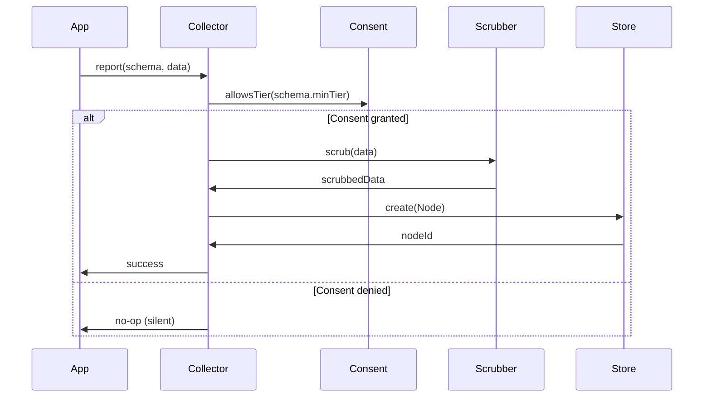

# 04: Telemetry Collector

> Central collection point for all telemetry with consent enforcement

**Duration:** 2 days  
**Dependencies:** [03-consent-manager.md](./03-consent-manager.md)

## Overview

The `TelemetryCollector` is responsible for:

- Receiving telemetry events from application code
- Checking consent before storing
- Applying scrubbing and bucketing
- Storing telemetry as Nodes locally
- Managing pending/shared status



## Implementation

### TelemetryCollector Class

```typescript
// packages/telemetry/src/collection/collector.ts

import type { NodeStore, Node, SchemaIRI } from '@xnetjs/data'
import type { ConsentManager } from '../consent/manager'
import type { TelemetryTier } from '../consent/types'
import { tierLevel } from '../consent/types'
import { scrubTelemetryData, type ScrubOptions } from './scrubbing'
import { bucketValue, bucketTimestamp } from './bucketing'
import { scheduleWithJitter } from './timing'

export interface TelemetryCollectorOptions {
  /** Node store for persisting telemetry */
  store: NodeStore

  /** Consent manager for permission checks */
  consent: ConsentManager

  /** Default scrubbing options */
  scrubOptions?: ScrubOptions

  /** Minimum tier required for any collection (default: 'local') */
  defaultMinTier?: TelemetryTier
}

export interface ReportOptions {
  /** Minimum consent tier required for this report */
  minTier?: TelemetryTier

  /** Override auto-scrub setting */
  scrub?: boolean

  /** Additional scrub patterns */
  scrubPatterns?: RegExp[]

  /** Skip random delay (for testing) */
  immediate?: boolean
}

export class TelemetryCollector {
  private store: NodeStore
  private consent: ConsentManager
  private scrubOptions: ScrubOptions
  private defaultMinTier: TelemetryTier
  private pendingReports: Map<string, NodeJS.Timeout> = new Map()

  constructor(options: TelemetryCollectorOptions) {
    this.store = options.store
    this.consent = options.consent
    this.scrubOptions = options.scrubOptions ?? {
      scrubPaths: true,
      scrubEmails: true,
      scrubIPs: true
    }
    this.defaultMinTier = options.defaultMinTier ?? 'local'

    // Listen for consent changes
    this.consent.on('tier-changed', this.handleConsentChange.bind(this))
  }

  /**
   * Report telemetry data.
   * Returns the node ID if stored, null if blocked by consent.
   */
  async report<T extends Record<string, unknown>>(
    schemaId: SchemaIRI,
    data: T,
    options: ReportOptions = {}
  ): Promise<string | null> {
    const minTier = options.minTier ?? this.defaultMinTier

    // Check consent
    if (!this.consent.allowsTier(minTier)) {
      return null // Silent no-op
    }

    if (!this.consent.allowsSchema(schemaId)) {
      return null // Schema not enabled
    }

    // Apply scrubbing
    const shouldScrub = options.scrub ?? this.consent.current.autoScrub
    let processedData = data

    if (shouldScrub) {
      processedData = scrubTelemetryData(data, {
        ...this.scrubOptions,
        scrubCustom: options.scrubPatterns
      }) as T
    }

    // Bucket timestamps
    if ('occurredAt' in processedData) {
      processedData = {
        ...processedData,
        occurredAt: bucketTimestamp(processedData.occurredAt as Date, 'hour')
      }
    }
    if ('measuredAt' in processedData) {
      processedData = {
        ...processedData,
        measuredAt: bucketTimestamp(processedData.measuredAt as Date, 'day')
      }
    }

    // Determine initial status
    const status =
      this.consent.isSharingEnabled && !this.consent.current.reviewBeforeSend ? 'pending' : 'local'

    // Create telemetry node
    const node = await this.store.create({
      schemaId,
      properties: {
        ...processedData,
        status
      }
    })

    // Schedule sync if auto-sharing enabled
    if (status === 'pending' && !options.immediate) {
      this.scheduleSyncWithJitter(node.id)
    }

    return node.id
  }

  /**
   * Report a crash/error.
   * Field names align with OTel semantic conventions (exception.*).
   */
  async reportCrash(
    error: Error,
    context?: {
      codeNamespace?: string // OTel: code.namespace
      codeFunction?: string // OTel: code.function
      userAction?: string // xNet-specific
      serviceVersion?: string // OTel: service.version
      osType?: string // OTel: os.type
    }
  ): Promise<string | null> {
    return this.report(
      'xnet://xnet.dev/telemetry/CrashReport',
      {
        exceptionType: error.name, // OTel: exception.type
        exceptionMessage: error.message, // OTel: exception.message
        exceptionStacktrace: error.stack, // OTel: exception.stacktrace
        occurredAt: new Date(),
        ...context
      },
      {
        minTier: 'crashes'
      }
    )
  }

  /**
   * Report a usage metric.
   * Uses OTel metric naming convention: <namespace>.<noun>.<verb>
   */
  async reportUsage(
    metricName: string, // e.g., 'xnet.pages.created', 'xnet.sync.events'
    value: number,
    period: 'daily' | 'weekly' | 'monthly' = 'daily'
  ): Promise<string | null> {
    return this.report(
      'xnet://xnet.dev/telemetry/UsageMetric',
      {
        metricName, // OTel metric naming
        metricBucket: bucketValue(value, 'count'),
        period,
        measuredAt: new Date()
      },
      {
        minTier: 'anonymous'
      }
    )
  }

  /**
   * Report a security event.
   * Uses OTel event.name convention: xnet.security.<event_type>
   */
  async reportSecurityEvent(
    eventName: string, // e.g., 'xnet.security.invalid_signature'
    eventSeverity: 'low' | 'medium' | 'high' | 'critical',
    details: Record<string, unknown>
  ): Promise<string | null> {
    return this.report(
      'xnet://xnet.dev/telemetry/SecurityEvent',
      {
        eventName, // OTel: event.name
        eventSeverity, // OTel-aligned severity
        eventDetails: JSON.stringify(details),
        occurredAt: new Date(),
        actionTaken: 'logged'
      },
      {
        minTier: 'local' // Security events always stored locally
      }
    )
  }

  /**
   * Get all local telemetry for user review.
   */
  async getLocalTelemetry(options?: {
    schemaId?: SchemaIRI
    status?: 'local' | 'pending' | 'shared'
    limit?: number
  }): Promise<Node[]> {
    const filters: Record<string, unknown> = {}

    if (options?.status) {
      filters.status = options.status
    }

    const results = await this.store.list({
      schemaId: options?.schemaId
      // Note: Assumes NodeStore supports property filtering
    })

    // Filter by status if needed
    let filtered = results
    if (options?.status) {
      filtered = results.filter((n) => n.properties.status === options.status)
    }

    // Apply limit
    if (options?.limit) {
      filtered = filtered.slice(0, options.limit)
    }

    return filtered
  }

  /**
   * Delete telemetry record(s).
   */
  async deleteTelemetry(nodeIds: string | string[]): Promise<void> {
    const ids = Array.isArray(nodeIds) ? nodeIds : [nodeIds]

    for (const id of ids) {
      // Cancel any pending sync
      const pending = this.pendingReports.get(id)
      if (pending) {
        clearTimeout(pending)
        this.pendingReports.delete(id)
      }

      await this.store.delete(id)
    }
  }

  /**
   * Delete all local telemetry.
   */
  async deleteAllTelemetry(): Promise<void> {
    // Cancel all pending syncs
    for (const timeout of this.pendingReports.values()) {
      clearTimeout(timeout)
    }
    this.pendingReports.clear()

    // Delete all telemetry nodes
    const schemas = [
      'xnet://xnet.dev/telemetry/CrashReport',
      'xnet://xnet.dev/telemetry/UsageMetric',
      'xnet://xnet.dev/telemetry/SecurityEvent',
      'xnet://xnet.dev/telemetry/PerformanceMetric'
    ]

    for (const schemaId of schemas) {
      const nodes = await this.store.list({ schemaId })
      for (const node of nodes) {
        await this.store.delete(node.id)
      }
    }
  }

  /**
   * Mark telemetry for sharing (user approved).
   */
  async approveForSharing(nodeIds: string | string[]): Promise<void> {
    const ids = Array.isArray(nodeIds) ? nodeIds : [nodeIds]

    for (const id of ids) {
      await this.store.update(id, {
        properties: { status: 'pending' }
      })
      this.scheduleSyncWithJitter(id)
    }
  }

  /**
   * Dismiss telemetry (user reviewed but chose not to share).
   */
  async dismiss(nodeIds: string | string[]): Promise<void> {
    const ids = Array.isArray(nodeIds) ? nodeIds : [nodeIds]

    for (const id of ids) {
      await this.store.update(id, {
        properties: { status: 'dismissed' }
      })
    }
  }

  // ============ Private Methods ============

  private scheduleSyncWithJitter(nodeId: string): void {
    // Random delay 0-5 minutes for privacy
    const delay = scheduleWithJitter(
      async () => {
        // Mark as shared (actual sync handled by sync layer)
        await this.store.update(nodeId, {
          properties: { status: 'shared' }
        })
        this.pendingReports.delete(nodeId)
      },
      { minDelay: 0, maxDelay: 5 * 60 * 1000 }
    )

    this.pendingReports.set(nodeId, delay)
  }

  private handleConsentChange(oldTier: TelemetryTier, newTier: TelemetryTier): void {
    // If user opted out, cancel all pending syncs
    if (tierLevel(newTier) < tierLevel('crashes')) {
      for (const timeout of this.pendingReports.values()) {
        clearTimeout(timeout)
      }
      this.pendingReports.clear()
    }
  }
}
```

### Timing Utilities

```typescript
// packages/telemetry/src/collection/timing.ts

/**
 * Schedule a callback with random jitter for privacy.
 * Returns the timeout handle for cancellation.
 */
export function scheduleWithJitter(
  callback: () => void | Promise<void>,
  options: {
    minDelay?: number
    maxDelay?: number
  } = {}
): NodeJS.Timeout {
  const { minDelay = 0, maxDelay = 5 * 60 * 1000 } = options

  const delay = minDelay + Math.random() * (maxDelay - minDelay)

  return setTimeout(async () => {
    try {
      await callback()
    } catch (error) {
      console.error('Scheduled callback failed:', error)
    }
  }, delay)
}
```

## Usage Examples

### Basic Crash Reporting

```typescript
import { TelemetryCollector } from '@xnetjs/telemetry'

const collector = new TelemetryCollector({
  store: nodeStore,
  consent: consentManager
})

// In error boundary or global handler
try {
  dangerousOperation()
} catch (error) {
  await collector.reportCrash(error, {
    codeNamespace: 'DataGrid', // OTel: code.namespace
    codeFunction: 'handleSort', // OTel: code.function
    userAction: 'sort-column', // xNet-specific
    serviceVersion: '1.2.3', // OTel: service.version
    osType: 'macos' // OTel: os.type
  })
}
```

### Usage Metrics

```typescript
// Periodic usage tracking (OTel metric naming: <namespace>.<noun>.<verb>)
async function reportDailyUsage() {
  const pageCount = await countPages()
  await collector.reportUsage('xnet.pages.created', pageCount, 'daily')

  const syncCount = await countSyncEvents()
  await collector.reportUsage('xnet.sync.completed', syncCount, 'daily')
}
```

### User Review Flow

```typescript
// Get pending reports for user review
const pending = await collector.getLocalTelemetry({ status: 'pending' })

// Show in UI, user approves or dismisses
for (const report of pending) {
  const userChoice = await showReviewDialog(report)

  if (userChoice === 'approve') {
    await collector.approveForSharing(report.id)
  } else {
    await collector.dismiss(report.id)
  }
}
```

## Tests

```typescript
// packages/telemetry/test/collector.test.ts

import { describe, it, expect, beforeEach, vi } from 'vitest'
import { TelemetryCollector } from '../src/collection/collector'
import { ConsentManager, MemoryConsentStorage } from '../src/consent'
import { MemoryNodeStorageAdapter, NodeStore } from '@xnetjs/data'

describe('TelemetryCollector', () => {
  let store: NodeStore
  let consent: ConsentManager
  let collector: TelemetryCollector

  beforeEach(async () => {
    store = new NodeStore({
      storage: new MemoryNodeStorageAdapter(),
      authorDID: 'did:key:test',
      signingKey: new Uint8Array(32)
    })
    await store.initialize()

    consent = new ConsentManager({
      storage: new MemoryConsentStorage()
    })

    collector = new TelemetryCollector({ store, consent })
  })

  describe('report', () => {
    it('should block when consent is off', async () => {
      const result = await collector.reportCrash(new Error('test'))
      expect(result).toBeNull()
    })

    it('should store when consent allows', async () => {
      await consent.setTier('crashes')

      const result = await collector.reportCrash(new Error('test'))
      expect(result).not.toBeNull()

      const node = await store.get(result!)
      expect(node?.properties.exceptionType).toBe('Error') // OTel: exception.type
      expect(node?.properties.exceptionMessage).toBe('test') // OTel: exception.message
    })

    it('should scrub PII from error messages', async () => {
      await consent.setTier('crashes')

      const error = new Error('Failed for user john@example.com at /Users/john/Documents')
      await collector.reportCrash(error)

      const nodes = await store.list({ schemaId: 'xnet://xnet.dev/telemetry/CrashReport' })
      const message = nodes[0].properties.exceptionMessage as string

      expect(message).not.toContain('john@example.com')
      expect(message).toContain('[EMAIL]')
      expect(message).not.toContain('/Users/john')
      expect(message).toContain('/Users/[USER]')
    })
  })

  describe('reportUsage', () => {
    it('should require anonymous tier', async () => {
      await consent.setTier('crashes') // Not enough

      const result = await collector.reportUsage('xnet.pages.created', 42)
      expect(result).toBeNull()
    })

    it('should bucket values and use OTel metric naming', async () => {
      await consent.setTier('anonymous')

      await collector.reportUsage('xnet.pages.created', 42)

      const nodes = await store.list({ schemaId: 'xnet://xnet.dev/telemetry/UsageMetric' })
      expect(nodes[0].properties.metricName).toBe('xnet.pages.created')
      // 42 should be in '21-100' bucket
      expect(nodes[0].properties.metricBucket).toBe('21-100')
    })
  })

  describe('deletion', () => {
    it('should delete telemetry', async () => {
      await consent.setTier('crashes')
      const id = await collector.reportCrash(new Error('test'))

      await collector.deleteTelemetry(id!)

      const node = await store.get(id!)
      expect(node).toBeNull()
    })

    it('should delete all telemetry', async () => {
      await consent.setTier('anonymous')
      await collector.reportCrash(new Error('test1'))
      await collector.reportCrash(new Error('test2'))
      await collector.reportUsage('test', 5)

      await collector.deleteAllTelemetry()

      const crashes = await store.list({ schemaId: 'xnet://xnet.dev/telemetry/CrashReport' })
      const usage = await store.list({ schemaId: 'xnet://xnet.dev/telemetry/UsageMetric' })

      expect(crashes).toHaveLength(0)
      expect(usage).toHaveLength(0)
    })
  })
})
```

## Checklist

- [ ] Create TelemetryCollector class
- [ ] Implement report() with consent checking
- [ ] Implement reportCrash() convenience method
- [ ] Implement reportUsage() with bucketing
- [ ] Implement reportSecurityEvent()
- [ ] Implement getLocalTelemetry() for user review
- [ ] Implement deleteTelemetry() and deleteAllTelemetry()
- [ ] Implement approveForSharing() and dismiss()
- [ ] Add random jitter timing utilities
- [ ] Handle consent changes (cancel pending syncs)
- [ ] Write comprehensive tests
- [ ] Tests pass

---

[Back to README](./README.md) | [Previous: Consent Manager](./03-consent-manager.md) | [Next: Scrubbing & Bucketing](./05-scrubbing-and-bucketing.md)
