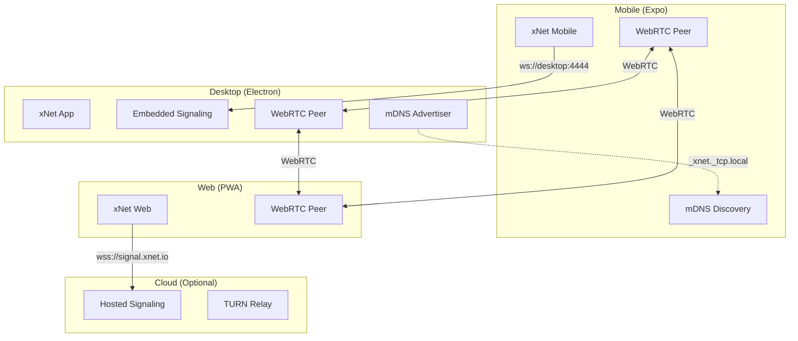

# xNet Implementation Plan - Step 03.2: P2P Signaling & Sync

> Peer discovery and real-time sync across all platforms

## Executive Summary

This plan enables P2P sync across xNet's three deployment targets (Desktop, Mobile, Web) while maintaining local-first principles. The key insight is that **signaling is just coordination** - actual data transfer happens peer-to-peer via WebRTC.

```typescript
// All platforms use the same sync API
const { doc, syncStatus, peerCount } = useDocument(PageSchema, pageId)

// syncStatus: 'offline' | 'connecting' | 'connected'
// peerCount: number of connected peers
```

## Design Principles

| Principle                      | Implementation                            |
| ------------------------------ | ----------------------------------------- |
| **Local-first**                | Works offline, syncs when peers available |
| **No central server required** | LAN sync works without internet           |
| **Progressive enhancement**    | mDNS → signaling → DHT fallback chain     |
| **Platform-appropriate**       | Desktop can host, mobile/web connect      |

## Architecture Overview



## Current State

### What Works Now

| Component           | Status          | Location                                      |
| ------------------- | --------------- | --------------------------------------------- |
| Signaling Server    | **Implemented** | `infrastructure/signaling/` (temporary)       |
| y-webrtc Provider   | **Implemented** | `packages/network/src/providers/`             |
| useDocument sync    | **Implemented** | `packages/react/src/hooks/useDocument.ts`     |
| Electron dev script | **Implemented** | `apps/electron/package.json` (runs signaling) |

### Quick Start (Desktop Development)

```bash
# In apps/electron - starts signaling server + electron together
pnpm dev

# Signaling server runs on ws://localhost:4444
# Health check: http://localhost:4444/health
```

### Directory Structure Note

The signaling server currently lives in `infrastructure/signaling/`. However, since xNet is designed as local-first P2P software, **all runtime code should be embeddable in client apps**.

**Current structure (temporary):**

```
infrastructure/
  signaling/     # Standalone server for dev/testing
```

**Target structure (after Phase 2):**

```
packages/
  signaling/     # @xnetjs/signaling - embeddable in Electron main process
```

The `infrastructure/` directory should only contain things that **cannot** run on user devices:

- Hosted signaling servers for WAN sync (enterprise/cloud deployment)
- TURN relay servers for NAT traversal
- Admin dashboards and monitoring

**Action item:** After completing Phase 2 (Embedded Signaling), move the signaling code to `packages/signaling/` and delete `infrastructure/signaling/`. The same code can then be:

1. Embedded in Electron's main process (default)
2. Run standalone for development/testing
3. Deployed to cloud for enterprise WAN sync

## Implementation Phases

### Phase 1: Desktop P2P (Current)

| Task | Status   | Description                          |
| ---- | -------- | ------------------------------------ |
| 1.1  | **Done** | Signaling server on port 4444        |
| 1.2  | **Done** | `pnpm dev` runs signaling + electron |
| 1.3  | **Done** | useNode connects to signaling        |
| 1.4  | **Done** | Multi-window sync (dev:both script)  |

**Validation Gate:**

- [x] Signaling server starts with electron dev
- [x] useNode connects without errors
- [x] Two electron windows sync changes (`pnpm dev:both`)
- [x] Sync indicator shows peer count

### Phase 2: Embedded Signaling (Week 1)

| Task | Document                                                 | Description                            |
| ---- | -------------------------------------------------------- | -------------------------------------- |
| 2.1  | [01-embedded-signaling.md](./01-embedded-signaling.md)   | Run signaling in Electron main process |
| 2.2  | [02-signaling-lifecycle.md](./02-signaling-lifecycle.md) | Start/stop with app, port management   |
| 2.3  | [03-connection-status.md](./03-connection-status.md)     | UI for sync status and peer list       |

**Validation Gate:**

- [ ] Signaling runs inside Electron (no separate process)
- [ ] Port conflict handling works
- [ ] App shows connected peers

### Phase 3: LAN Discovery (Week 2)

| Task | Document                                       | Description                               |
| ---- | ---------------------------------------------- | ----------------------------------------- |
| 3.1  | [04-mdns-advertise.md](./04-mdns-advertise.md) | Desktop advertises `_xnet._tcp.local`     |
| 3.2  | [05-mdns-discover.md](./05-mdns-discover.md)   | All platforms discover LAN peers          |
| 3.3  | [06-auto-connect.md](./06-auto-connect.md)     | Automatically connect to discovered peers |

**Validation Gate:**

- [ ] Desktop visible via mDNS on LAN
- [ ] Mobile discovers desktop without manual config
- [ ] Connection established automatically

### Phase 4: Mobile Support (Week 3)

| Task | Document                                     | Description                       |
| ---- | -------------------------------------------- | --------------------------------- |
| 4.1  | [07-mobile-webrtc.md](./07-mobile-webrtc.md) | WebRTC in React Native            |
| 4.2  | [08-mobile-mdns.md](./08-mobile-mdns.md)     | react-native-zeroconf integration |
| 4.3  | [09-mobile-sync.md](./09-mobile-sync.md)     | useDocument sync on mobile        |

**Validation Gate:**

- [ ] Mobile connects to desktop signaling
- [ ] Mobile discovers peers via mDNS
- [ ] Changes sync between mobile and desktop

### Phase 5: Web PWA Support (Week 4)

| Task | Document                                       | Description                          |
| ---- | ---------------------------------------------- | ------------------------------------ |
| 5.1  | [10-web-signaling.md](./10-web-signaling.md)   | Connect to hosted or local signaling |
| 5.2  | [11-manual-connect.md](./11-manual-connect.md) | QR code / link for peer connection   |
| 5.3  | [12-web-sync.md](./12-web-sync.md)             | Full sync in browser                 |

**Validation Gate:**

- [ ] Web connects to signaling server
- [ ] Manual peer connection works (QR/link)
- [ ] Changes sync between web and other platforms

### Phase 6: Production Infrastructure (Week 5-6)

| Task | Document                                           | Description                      |
| ---- | -------------------------------------------------- | -------------------------------- |
| 6.1  | [13-hosted-signaling.md](./13-hosted-signaling.md) | Deploy signaling to cloud        |
| 6.2  | [14-turn-relay.md](./14-turn-relay.md)             | TURN servers for NAT traversal   |
| 6.3  | [15-failover.md](./15-failover.md)                 | Multi-region, automatic failover |

**Validation Gate:**

- [ ] Signaling deployed to 2+ regions
- [ ] TURN relay works for symmetric NAT
- [ ] Clients failover on server issues

## Platform Capabilities Matrix

| Capability            | Desktop | Mobile | Web       |
| --------------------- | ------- | ------ | --------- |
| Run signaling server  | Yes     | No     | No        |
| mDNS advertise        | Yes     | No     | No        |
| mDNS discover         | Yes     | Yes\*  | No        |
| WebRTC peer           | Yes     | Yes    | Yes       |
| Connect to signaling  | Yes     | Yes    | Yes       |
| Offline-first storage | SQLite  | SQLite | IndexedDB |

\*Mobile mDNS requires `react-native-zeroconf`

## Connection Priority

Clients should try connection methods in this order:

```typescript
const CONNECTION_PRIORITY = [
  // 1. Cached peers from previous sessions (instant)
  { type: 'cached', timeout: 1000 },

  // 2. LAN discovery via mDNS (no internet needed)
  { type: 'mdns', timeout: 3000 },

  // 3. Local signaling server (desktop running)
  { type: 'local-signaling', url: 'ws://localhost:4444', timeout: 2000 },

  // 4. Hosted signaling (internet required)
  { type: 'hosted-signaling', url: 'wss://signal.xnet.io', timeout: 5000 },

  // 5. DHT bootstrap (future, fully decentralized)
  { type: 'dht', timeout: 10000 }
]
```

## Key Types

```typescript
// Sync status exposed by useDocument
type SyncStatus = 'offline' | 'connecting' | 'connected'

// Peer information
interface Peer {
  id: string
  name?: string
  platform: 'desktop' | 'mobile' | 'web'
  connectionType: 'mdns' | 'signaling' | 'direct'
}

// Signaling server config
interface SignalingConfig {
  port: number // Default: 4444
  advertise: boolean // mDNS advertisement
  serviceName: string // Default: '_xnet._tcp.local'
}

// Connection config for useDocument
interface SyncOptions {
  signalingServers?: string[] // Default: ['ws://localhost:4444']
  disableSync?: boolean // For testing
  enableMdns?: boolean // LAN discovery
  cachedPeers?: string[] // Bootstrap from cache
}
```

## Signaling Protocol

The signaling server uses y-webrtc's pub/sub protocol:

```typescript
// Subscribe to a document's sync room
{ type: 'subscribe', topics: ['xnet-doc-abc123'] }

// Publish WebRTC signaling data
{ type: 'publish', topic: 'xnet-doc-abc123', data: { sdp: '...' } }

// Keepalive
{ type: 'ping' } → { type: 'pong' }
```

Room naming convention: `xnet-doc-{documentId}`

## Success Criteria

After completing this plan:

1. **Desktop works** - Two electron windows sync via embedded signaling
2. **LAN sync works** - Devices on same network sync without internet
3. **Mobile works** - iOS/Android sync with desktop
4. **Web works** - PWA syncs via hosted signaling
5. **Offline-first** - All platforms work offline, sync when available
6. **No config needed** - mDNS discovery makes it "just work" on LAN

## What's NOT in This Plan

Deferred to future work:

- **DHT signaling** - Fully decentralized peer discovery
- **Peer-to-peer relay** - Route through connected peers
- **End-to-end encryption** - Already in data layer, not signaling
- **Large file sync** - Chunked transfer optimization
- **Conflict UI** - Visual merge conflict resolution

## Dependencies

| Component          | Depends On                                |
| ------------------ | ----------------------------------------- |
| Embedded signaling | `ws` (WebSocket server)                   |
| mDNS advertise     | `@xnetjs/network`, native mDNS            |
| mDNS discover      | `@libp2p/mdns` or `react-native-zeroconf` |
| WebRTC             | `y-webrtc`, browser WebRTC APIs           |
| Mobile WebRTC      | `react-native-webrtc`                     |

## Quick Reference

```bash
# Start desktop with signaling
cd apps/electron && pnpm dev

# Check signaling health
curl http://localhost:4444/health

# View metrics
curl http://localhost:4444/metrics
```

---

## Reference Documents

- [y-webrtc](https://github.com/yjs/y-webrtc) - WebRTC provider for Yjs
- [libp2p mDNS](https://github.com/libp2p/js-libp2p/tree/main/packages/peer-discovery-mdns) - LAN peer discovery
- [WebRTC NAT Traversal](https://webrtc.org/getting-started/turn-server) - TURN/STUN basics

---

[Back to Main Plan](../plan00Setup/README.md) | [Start Phase 2](./01-embedded-signaling.md)
