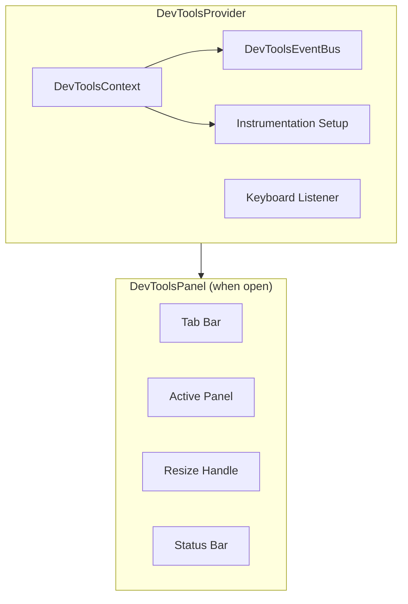

# 03 - DevTools Provider & Panel Shell

> React integration, keyboard shortcuts, panel layout, and tab navigation

## Overview

The `DevToolsProvider` is the single entry point for consumers. It wraps the app, sets up instrumentation, manages panel visibility, and provides context to all devtools panels. The panel shell handles tab navigation, resizing, and positioning.

## Provider Architecture



## DevToolsContext

```typescript
// provider/DevToolsContext.ts

import { createContext } from 'react'
import type { DevToolsEventBus } from '../core/event-bus'
import type { NodeStore } from '@xnetjs/data'

export interface DevToolsContextValue {
  // State
  isOpen: boolean
  activePanel: PanelId
  position: PanelPosition
  height: number

  // Controls
  toggle: () => void
  setActivePanel: (panel: PanelId) => void
  setPosition: (pos: PanelPosition) => void
  setHeight: (height: number) => void

  // Core
  eventBus: DevToolsEventBus
  store: NodeStore | null

  // Instrumentation cleanup refs (internal)
  cleanups: Array<() => void>
}

export type PanelId = 'nodes' | 'changes' | 'sync' | 'yjs' | 'queries' | 'telemetry' | 'schemas'

export type PanelPosition = 'bottom' | 'right' | 'floating'

export const DevToolsContext = createContext<DevToolsContextValue | null>(null)
```

## DevToolsProvider Implementation

```typescript
// provider/DevToolsProvider.tsx

import { useState, useEffect, useCallback, useRef, type ReactNode } from 'react'
import { DevToolsContext, type PanelId, type PanelPosition } from './DevToolsContext'
import { DevToolsEventBus } from '../core/event-bus'
import { DEFAULTS } from '../core/constants'
import { instrumentStore } from '../instrumentation/store'
import { useNodeStore } from '@xnetjs/react'
import { DevToolsPanel } from '../panels/Shell'

export interface DevToolsProviderProps {
  children: ReactNode
  defaultOpen?: boolean
  defaultPanel?: PanelId
  position?: PanelPosition
  height?: number
  maxEvents?: number
}

export function DevToolsProvider({
  children,
  defaultOpen = false,
  defaultPanel = 'nodes',
  position: initialPosition = 'bottom',
  height: initialHeight = DEFAULTS.PANEL_HEIGHT,
  maxEvents = DEFAULTS.MAX_EVENTS,
}: DevToolsProviderProps) {
  const [isOpen, setIsOpen] = useState(defaultOpen)
  const [activePanel, setActivePanel] = useState<PanelId>(defaultPanel)
  const [position, setPosition] = useState<PanelPosition>(initialPosition)
  const [height, setHeight] = useState(initialHeight)

  const busRef = useRef<DevToolsEventBus>(new DevToolsEventBus({ maxEvents }))
  const cleanupsRef = useRef<Array<() => void>>([])

  // Get store from NodeStoreProvider context
  const { store } = useNodeStore()

  // Set up store instrumentation when store becomes available
  useEffect(() => {
    if (!store) return

    const cleanup = instrumentStore(store, busRef.current)
    cleanupsRef.current.push(cleanup)

    return () => {
      cleanup()
      cleanupsRef.current = cleanupsRef.current.filter(fn => fn !== cleanup)
    }
  }, [store])

  // Keyboard shortcut: Ctrl/Cmd + Shift + D
  useEffect(() => {
    const handler = (e: KeyboardEvent) => {
      const { key, ctrl, shift } = DEFAULTS.KEYBOARD_SHORTCUT
      if ((e.ctrlKey || e.metaKey) === ctrl && e.shiftKey === shift && e.key === key) {
        e.preventDefault()
        setIsOpen(prev => !prev)
      }
    }
    window.addEventListener('keydown', handler)
    return () => window.removeEventListener('keydown', handler)
  }, [])

  // Mobile: 4-finger tap
  useEffect(() => {
    const handler = (e: TouchEvent) => {
      if (e.touches.length === 4) {
        e.preventDefault()
        setIsOpen(prev => !prev)
      }
    }
    window.addEventListener('touchstart', handler, { passive: false })
    return () => window.removeEventListener('touchstart', handler)
  }, [])

  const toggle = useCallback(() => setIsOpen(prev => !prev), [])

  const contextValue: DevToolsContextValue = {
    isOpen,
    activePanel,
    position,
    height,
    toggle,
    setActivePanel,
    setPosition,
    setHeight,
    eventBus: busRef.current,
    store,
    cleanups: cleanupsRef.current,
  }

  return (
    <DevToolsContext.Provider value={contextValue}>
      <div className={isOpen && position !== 'floating' ? getLayoutClass(position, height) : undefined}>
        {children}
      </div>
      {isOpen && <DevToolsPanel />}
    </DevToolsContext.Provider>
  )
}

function getLayoutClass(position: PanelPosition, height: number): string {
  if (position === 'bottom') {
    return `pb-[${height}px]`  // Reserve space at bottom
  }
  if (position === 'right') {
    return `pr-[${height}px]`  // Reserve space at right
  }
  return ''
}
```

## Panel Shell

```typescript
// panels/Shell.tsx

import { useDevTools } from '../provider/useDevTools'
import type { PanelId } from '../provider/DevToolsContext'

const PANELS: Array<{ id: PanelId; label: string; shortLabel: string }> = [
  { id: 'nodes', label: 'Nodes', shortLabel: 'N' },
  { id: 'changes', label: 'Changes', shortLabel: 'C' },
  { id: 'sync', label: 'Sync', shortLabel: 'S' },
  { id: 'yjs', label: 'Yjs', shortLabel: 'Y' },
  { id: 'queries', label: 'Queries', shortLabel: 'Q' },
  { id: 'telemetry', label: 'Telemetry', shortLabel: 'T' },
  { id: 'schemas', label: 'Schemas', shortLabel: 'Sc' },
]

export function DevToolsPanel() {
  const { position, height, activePanel, setActivePanel, toggle, eventBus } = useDevTools()

  return (
    <div
      className={getContainerClass(position, height)}
      role="complementary"
      aria-label="xNet DevTools"
    >
      {/* Resize Handle */}
      <ResizeHandle position={position} />

      {/* Tab Bar */}
      <div className="flex items-center border-b border-zinc-700 bg-zinc-900 px-2">
        <span className="text-xs font-bold text-zinc-400 mr-3">xNet</span>

        {PANELS.map(panel => (
          <button
            key={panel.id}
            onClick={() => setActivePanel(panel.id)}
            className={`
              px-3 py-1.5 text-xs font-medium border-b-2 transition-colors
              ${activePanel === panel.id
                ? 'border-blue-400 text-blue-400'
                : 'border-transparent text-zinc-400 hover:text-zinc-200'
              }
            `}
          >
            {panel.label}
          </button>
        ))}

        {/* Right-side controls */}
        <div className="ml-auto flex items-center gap-2">
          <EventCounter bus={eventBus} />
          <PauseButton bus={eventBus} />
          <ClearButton bus={eventBus} />
          <PositionToggle />
          <button onClick={toggle} className="text-zinc-400 hover:text-white p-1" title="Close">
            x
          </button>
        </div>
      </div>

      {/* Active Panel Content */}
      <div className="flex-1 overflow-hidden">
        <ActivePanelContent panel={activePanel} />
      </div>

      {/* Status Bar */}
      <StatusBar />
    </div>
  )
}

function getContainerClass(position: PanelPosition, height: number): string {
  const base = 'flex flex-col bg-zinc-950 text-zinc-200 font-mono text-xs border-zinc-700 z-[9999]'

  switch (position) {
    case 'bottom':
      return `${base} fixed bottom-0 left-0 right-0 border-t`
        + ` h-[${height}px]`
    case 'right':
      return `${base} fixed top-0 right-0 bottom-0 border-l`
        + ` w-[${height}px]`
    case 'floating':
      return `${base} fixed bottom-4 right-4 rounded-lg border shadow-2xl`
        + ` w-[600px] h-[${height}px]`
  }
}

function ResizeHandle({ position }: { position: PanelPosition }) {
  const { setHeight } = useDevTools()

  // Drag-to-resize logic
  const handleMouseDown = (e: React.MouseEvent) => {
    e.preventDefault()
    const startY = e.clientY
    const startHeight = /* get current height */

    const onMove = (e: MouseEvent) => {
      const delta = position === 'bottom'
        ? startY - e.clientY    // drag up = larger
        : e.clientX - startY    // drag right = larger
      setHeight(Math.max(DEFAULTS.PANEL_MIN_HEIGHT,
        Math.min(DEFAULTS.PANEL_MAX_HEIGHT, startHeight + delta)))
    }

    const onUp = () => {
      document.removeEventListener('mousemove', onMove)
      document.removeEventListener('mouseup', onUp)
    }

    document.addEventListener('mousemove', onMove)
    document.addEventListener('mouseup', onUp)
  }

  const cursorClass = position === 'bottom' ? 'cursor-ns-resize' : 'cursor-ew-resize'

  return (
    <div
      onMouseDown={handleMouseDown}
      className={`${cursorClass} h-1 w-full bg-zinc-800 hover:bg-blue-500 transition-colors`}
    />
  )
}

function StatusBar() {
  const { eventBus, store } = useDevTools()

  return (
    <div className="flex items-center px-3 py-1 border-t border-zinc-800 text-[10px] text-zinc-500">
      <span>Events: {eventBus.size}/{eventBus.capacity}</span>
      <span className="mx-2">|</span>
      <span>Store: {store ? 'connected' : 'disconnected'}</span>
      <span className="ml-auto">Ctrl+Shift+D to toggle</span>
    </div>
  )
}
```

## useDevTools Hook

```typescript
// provider/useDevTools.ts

import { useContext } from 'react'
import { DevToolsContext, type DevToolsContextValue } from './DevToolsContext'

export function useDevTools(): DevToolsContextValue {
  const ctx = useContext(DevToolsContext)
  if (!ctx) {
    throw new Error('useDevTools must be used within a DevToolsProvider')
  }
  return ctx
}
```

## Styling Approach

All panel UI uses Tailwind classes from the host app. The devtools do NOT bundle their own Tailwind or CSS. This means:

1. The host app must have Tailwind configured (which xNet apps already do)
2. The devtools content config must include `node_modules/@xnetjs/devtools/**/*.{tsx,ts}`
3. All devtools use a dark theme (zinc-900/950 backgrounds) to distinguish from app content

## Checklist

- [ ] Implement `DevToolsContext` with all state
- [ ] Implement `DevToolsProvider` with instrumentation setup
- [ ] Implement keyboard shortcut handler (Ctrl+Shift+D)
- [ ] Implement mobile 4-finger tap gesture
- [ ] Implement `DevToolsPanel` shell with tabs
- [ ] Implement resize handle with drag
- [ ] Implement position toggle (bottom/right/floating)
- [ ] Implement status bar
- [ ] Implement pause/clear/event-count controls
- [ ] Write tests for provider mounting/unmounting
- [ ] Write tests for keyboard shortcut

---

[Previous: Event Bus](./02-event-bus.md) | [Next: Node Explorer](./04-node-explorer.md)
