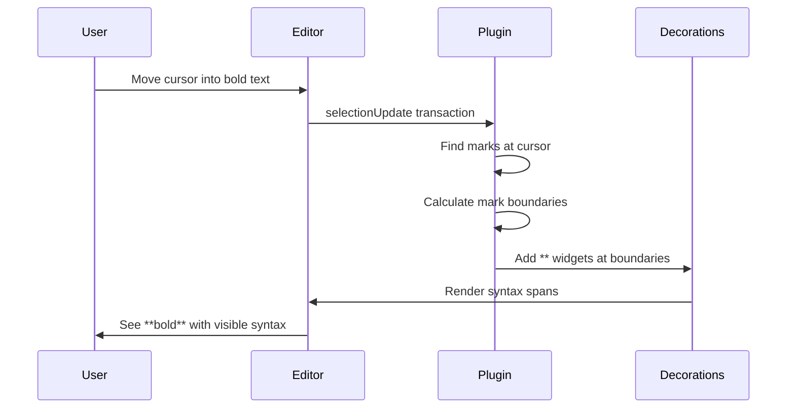

# 04: Inline Marks Plugin

> ProseMirror plugin for showing markdown syntax when cursor is adjacent to formatted text

**Duration:** 1 day  
**Dependencies:** [01-tailwind-setup.md](./01-tailwind-setup.md)

## Overview

The inline marks plugin is the core of live preview for text formatting. It:

1. Detects when cursor is inside or adjacent to a mark (bold, italic, etc.)
2. Adds decoration widgets for opening/closing syntax (`**`, `*`, etc.)
3. Updates decorations on every selection change
4. Works with nested marks (e.g., bold inside italic)



## Implementation

### 1. Syntax Configuration

```typescript
// packages/editor/src/extensions/live-preview/syntax.ts

/**
 * Mapping of mark types to their markdown syntax.
 */
export interface MarkSyntax {
  /** Opening syntax characters */
  open: string
  /** Closing syntax characters */
  close: string
  /** Priority for nested marks (higher = render first) */
  priority: number
}

export const MARK_SYNTAX: Record<string, MarkSyntax> = {
  bold: { open: '**', close: '**', priority: 10 },
  italic: { open: '*', close: '*', priority: 20 },
  strike: { open: '~~', close: '~~', priority: 30 },
  code: { open: '`', close: '`', priority: 40 }
}

/**
 * Get syntax for a mark type.
 */
export function getSyntax(markType: string): MarkSyntax | null {
  return MARK_SYNTAX[markType] ?? null
}

/**
 * Get all enabled mark types.
 */
export function getEnabledMarks(options?: { marks?: string[] }): string[] {
  if (options?.marks) {
    return options.marks.filter((m) => m in MARK_SYNTAX)
  }
  return Object.keys(MARK_SYNTAX)
}
```

### 2. Mark Range Finder

```typescript
// packages/editor/src/extensions/live-preview/mark-range.ts

import type { Node as ProseMirrorNode, Mark, ResolvedPos } from '@tiptap/pm/model'

export interface MarkRange {
  from: number
  to: number
  mark: Mark
}

/**
 * Find the continuous range of a mark around a position.
 *
 * Given a position inside marked text, finds where the mark starts and ends.
 * Handles cases where the same mark type spans multiple text nodes.
 */
export function findMarkRange(
  doc: ProseMirrorNode,
  pos: number,
  markType: string
): MarkRange | null {
  const $pos = doc.resolve(pos)

  // Get the mark at this position
  const marks = $pos.marks()
  const targetMark = marks.find((m) => m.type.name === markType)

  if (!targetMark) return null

  // Scan the parent block to find the extent of this mark
  const parent = $pos.parent
  const parentStart = $pos.start()
  const parentEnd = $pos.end()

  let markStart = -1
  let markEnd = -1
  let foundPos = false

  // Walk through all children of the parent
  doc.nodesBetween(parentStart, parentEnd, (node, nodePos) => {
    if (!node.isText) return true // Continue into non-text nodes

    const nodeEnd = nodePos + node.nodeSize
    const hasMark = node.marks.some((m) => m.eq(targetMark))
    const containsPos = pos >= nodePos && pos <= nodeEnd

    if (hasMark) {
      // Extend the range
      if (markStart === -1 || (foundPos && nodePos > markEnd)) {
        // New range, or gap after we found the position
        if (foundPos) return false // Stop if we've moved past our range
        markStart = nodePos
      }
      markEnd = nodeEnd

      if (containsPos) {
        foundPos = true
      }
    } else if (foundPos) {
      // Gap in the mark after finding our position - stop
      return false
    } else {
      // Reset if we haven't found our position yet
      markStart = -1
      markEnd = -1
    }

    return true
  })

  if (markStart === -1 || markEnd === -1 || !foundPos) {
    return null
  }

  return { from: markStart, to: markEnd, mark: targetMark }
}

/**
 * Find all mark ranges in a text range.
 * Used for showing syntax for all marks, not just at cursor.
 */
export function findAllMarkRanges(
  doc: ProseMirrorNode,
  from: number,
  to: number,
  markTypes: string[]
): MarkRange[] {
  const ranges: MarkRange[] = []
  const seenRanges = new Map<string, Set<string>>()

  doc.nodesBetween(from, to, (node, pos) => {
    if (!node.isText) return true

    for (const mark of node.marks) {
      if (!markTypes.includes(mark.type.name)) continue

      // Find full range for this mark
      const range = findMarkRange(doc, pos, mark.type.name)
      if (!range) continue

      // Dedupe using position key
      const key = mark.type.name
      const rangeKey = `${range.from}-${range.to}`

      if (!seenRanges.has(key)) {
        seenRanges.set(key, new Set())
      }

      if (!seenRanges.get(key)!.has(rangeKey)) {
        seenRanges.get(key)!.add(rangeKey)
        ranges.push(range)
      }
    }

    return true
  })

  return ranges
}
```

### 3. Inline Marks Plugin

```typescript
// packages/editor/src/extensions/live-preview/inline-marks.ts

import { Plugin, PluginKey } from '@tiptap/pm/state'
import { Decoration, DecorationSet } from '@tiptap/pm/view'
import type { EditorState, Transaction } from '@tiptap/pm/state'
import { getSyntax, getEnabledMarks } from './syntax'
import { findMarkRange } from './mark-range'

export const inlineMarksPluginKey = new PluginKey('inlineMarks')

export interface InlineMarksPluginOptions {
  /** Which mark types to show syntax for */
  marks?: string[]
  /** CSS class for syntax spans */
  syntaxClass?: string
}

/**
 * Create the inline marks decoration plugin.
 */
export function createInlineMarksPlugin(options: InlineMarksPluginOptions = {}) {
  const enabledMarks = getEnabledMarks(options)
  const syntaxClass = options.syntaxClass ?? 'md-syntax'

  return new Plugin({
    key: inlineMarksPluginKey,

    state: {
      init(_, state) {
        return computeDecorations(state, enabledMarks, syntaxClass)
      },

      apply(tr, oldDecorations, oldState, newState) {
        // Only recompute if selection changed or document changed
        if (!tr.selectionSet && !tr.docChanged) {
          return oldDecorations
        }

        return computeDecorations(newState, enabledMarks, syntaxClass)
      }
    },

    props: {
      decorations(state) {
        return this.getState(state)
      }
    }
  })
}

/**
 * Compute decorations for the current selection.
 */
function computeDecorations(
  state: EditorState,
  enabledMarks: string[],
  syntaxClass: string
): DecorationSet {
  const { doc, selection } = state
  const { $from, empty } = selection

  // Only show syntax when cursor is collapsed (not range selection)
  if (!empty) {
    return DecorationSet.empty
  }

  const decorations: Decoration[] = []
  const processedTypes = new Set<string>()

  // Get marks at cursor position
  const marks = $from.marks()

  for (const mark of marks) {
    const markType = mark.type.name

    // Skip if not enabled or already processed
    if (!enabledMarks.includes(markType)) continue
    if (processedTypes.has(markType)) continue

    processedTypes.add(markType)

    // Get syntax for this mark type
    const syntax = getSyntax(markType)
    if (!syntax) continue

    // Find the full range of this mark
    const range = findMarkRange(doc, $from.pos, markType)
    if (!range) continue

    // Create opening syntax widget
    const openWidget = Decoration.widget(
      range.from,
      () => createSyntaxSpan(syntax.open, markType, 'open', syntaxClass),
      {
        side: -1, // Before the content
        key: `${markType}-open-${range.from}`
      }
    )

    // Create closing syntax widget
    const closeWidget = Decoration.widget(
      range.to,
      () => createSyntaxSpan(syntax.close, markType, 'close', syntaxClass),
      {
        side: 1, // After the content
        key: `${markType}-close-${range.to}`
      }
    )

    decorations.push(openWidget, closeWidget)
  }

  return DecorationSet.create(doc, decorations)
}

/**
 * Create a DOM element for syntax characters.
 */
function createSyntaxSpan(
  text: string,
  markType: string,
  position: 'open' | 'close',
  className: string
): HTMLElement {
  const span = document.createElement('span')

  // Apply classes
  span.className = `${className} ${className}-${position}`

  // Data attributes for styling/debugging
  span.setAttribute('data-mark', markType)
  span.setAttribute('data-position', position)

  // Accessibility: hide from screen readers (decorative)
  span.setAttribute('aria-hidden', 'true')

  // The syntax text
  span.textContent = text

  return span
}
```

### 4. LivePreview Extension Integration

````typescript
// packages/editor/src/extensions/live-preview/index.ts

import { Extension } from '@tiptap/core'
import { createInlineMarksPlugin, type InlineMarksPluginOptions } from './inline-marks'

export interface LivePreviewOptions extends InlineMarksPluginOptions {
  /** Enable block-level syntax (headings, code blocks) via NodeViews */
  blocks?: boolean
}

/**
 * LivePreview extension for Obsidian-style markdown editing.
 *
 * Shows markdown syntax (like ** for bold) when the cursor is inside
 * or adjacent to formatted text. Hides syntax when cursor moves away.
 *
 * @example
 * ```ts
 * import { LivePreview } from '@xnetjs/editor/extensions'
 *
 * const editor = useEditor({
 *   extensions: [
 *     StarterKit,
 *     LivePreview.configure({
 *       marks: ['bold', 'italic', 'code'],
 *       blocks: true,
 *     }),
 *   ]
 * })
 * ```
 */
export const LivePreview = Extension.create<LivePreviewOptions>({
  name: 'livePreview',

  addOptions() {
    return {
      marks: ['bold', 'italic', 'strike', 'code'],
      blocks: true,
      syntaxClass: 'md-syntax'
    }
  },

  addProseMirrorPlugins() {
    return [
      createInlineMarksPlugin({
        marks: this.options.marks,
        syntaxClass: this.options.syntaxClass
      })
    ]
  }
})

// Re-exports
export { MARK_SYNTAX, getSyntax, getEnabledMarks } from './syntax'
export { findMarkRange, findAllMarkRanges } from './mark-range'
export { createInlineMarksPlugin, inlineMarksPluginKey } from './inline-marks'
export type { InlineMarksPluginOptions }
````

### 5. CSS Styling (Tailwind)

```css
/* packages/editor/src/styles/editor.css */

/* Markdown syntax characters */
.md-syntax {
  @apply font-mono font-normal select-none pointer-events-none;
  color: hsl(var(--muted-foreground));
  opacity: var(--syntax-opacity, 0.5);

  /* Smooth appearance */
  animation: syntax-appear 150ms ease-out forwards;
}

/* Opening vs closing syntax (for potential different styling) */
.md-syntax-open {
  /* margin-right: 0; */ /* No extra space */
}

.md-syntax-close {
  /* margin-left: 0; */
}

/* Mark-specific styling */
.md-syntax[data-mark='bold'] {
  /* Bold syntax slightly more visible */
  opacity: calc(var(--syntax-opacity, 0.5) + 0.1);
}

.md-syntax[data-mark='code'] {
  @apply bg-muted/50 rounded-sm px-0.5;
}

/* Animation keyframes defined in tailwind.config.js */
@keyframes syntax-appear {
  from {
    opacity: 0;
  }
  to {
    opacity: var(--syntax-opacity, 0.5);
  }
}
```

## Tests

```typescript
// packages/editor/src/extensions/live-preview/inline-marks.test.ts

import { describe, it, expect, beforeEach } from 'vitest'
import { Editor } from '@tiptap/core'
import StarterKit from '@tiptap/starter-kit'
import { LivePreview } from './index'

describe('InlineMarksPlugin', () => {
  let editor: Editor

  beforeEach(() => {
    editor = new Editor({
      extensions: [
        StarterKit,
        LivePreview.configure({
          marks: ['bold', 'italic', 'code']
        })
      ],
      content: '<p>Hello <strong>bold</strong> world</p>'
    })
  })

  afterEach(() => {
    editor.destroy()
  })

  describe('decoration creation', () => {
    it('should not show syntax when cursor is outside mark', () => {
      // Position cursor at start of document
      editor.commands.setTextSelection(1)

      const decorations = getDecorations(editor)
      expect(decorations.length).toBe(0)
    })

    it('should show syntax when cursor is inside bold', () => {
      // Position cursor inside "bold"
      editor.commands.setTextSelection(9) // Inside the bold text

      const decorations = getDecorations(editor)
      expect(decorations.length).toBe(2) // Open and close

      const classes = decorations.map((d) => d.type.attrs?.class)
      expect(classes).toContain('md-syntax md-syntax-open')
      expect(classes).toContain('md-syntax md-syntax-close')
    })

    it('should not show syntax on range selection', () => {
      // Select the bold text
      editor.commands.setTextSelection({ from: 7, to: 11 })

      const decorations = getDecorations(editor)
      expect(decorations.length).toBe(0)
    })
  })

  describe('nested marks', () => {
    beforeEach(() => {
      editor.commands.setContent('<p><strong><em>bold italic</em></strong></p>')
    })

    it('should show syntax for both marks when cursor inside', () => {
      editor.commands.setTextSelection(5)

      const decorations = getDecorations(editor)
      // Should have 4 decorations: ** and * for open, * and ** for close
      expect(decorations.length).toBe(4)
    })
  })

  describe('mark boundaries', () => {
    it('should find correct boundaries for split text nodes', () => {
      editor.commands.setContent('<p>Start <strong>bold </strong><strong>text</strong> end</p>')

      // Cursor inside first bold section
      editor.commands.setTextSelection(10)

      const decorations = getDecorations(editor)
      expect(decorations.length).toBe(2)

      // Verify the range spans both bold nodes
      // This test ensures we handle adjacent same-type marks correctly
    })
  })
})

// Helper to extract decorations from editor state
function getDecorations(editor: Editor) {
  const plugin = editor.view.state.plugins.find((p) => p.spec.key?.key === 'inlineMarks')
  if (!plugin) return []

  const decorationSet = plugin.getState(editor.view.state)
  const decorations: any[] = []

  decorationSet?.find().forEach((d: any) => {
    decorations.push(d)
  })

  return decorations
}
```

```typescript
// packages/editor/src/extensions/live-preview/mark-range.test.ts

import { describe, it, expect } from 'vitest'
import { Node } from '@tiptap/pm/model'
import { schema } from '@tiptap/pm/schema-basic'
import { findMarkRange, findAllMarkRanges } from './mark-range'

describe('findMarkRange', () => {
  it('should find range for simple mark', () => {
    const doc = createDoc('<p>Hello <strong>world</strong>!</p>')

    // Position inside "world"
    const range = findMarkRange(doc, 9, 'bold')

    expect(range).not.toBeNull()
    expect(range!.from).toBe(7)
    expect(range!.to).toBe(12)
  })

  it('should return null when no mark at position', () => {
    const doc = createDoc('<p>Hello <strong>world</strong>!</p>')

    const range = findMarkRange(doc, 3, 'bold')

    expect(range).toBeNull()
  })

  it('should handle adjacent same-type marks', () => {
    const doc = createDoc('<p><strong>one</strong><strong>two</strong></p>')

    // Position in "one"
    const range1 = findMarkRange(doc, 2, 'bold')
    expect(range1!.from).toBe(1)
    expect(range1!.to).toBe(4)

    // Position in "two"
    const range2 = findMarkRange(doc, 5, 'bold')
    expect(range2!.from).toBe(4)
    expect(range2!.to).toBe(7)
  })
})

// Helper to create a test document
function createDoc(html: string): Node {
  const element = document.createElement('div')
  element.innerHTML = html
  return Node.fromJSON(schema, {
    type: 'doc',
    content: [
      /* parse html */
    ]
  })
}
```

## Edge Cases

| Scenario                               | Expected Behavior                           |
| -------------------------------------- | ------------------------------------------- |
| Cursor at mark boundary                | Show syntax (cursor is "touching" the mark) |
| Multiple marks on same text            | Show all syntaxes, sorted by priority       |
| Mark across multiple nodes             | Find full contiguous range                  |
| Empty mark (e.g., `<strong></strong>`) | Don't show syntax (no content)              |
| Mark at start/end of paragraph         | Correctly position widgets                  |
| Range selection                        | Hide all syntax (not editing)               |
| Cursor after mark but touching         | Don't show (strict inside check)            |

## Performance Considerations

1. **Only recompute on selection change** - The plugin checks `tr.selectionSet` before recomputing
2. **Limit to current block** - Only scan the parent block, not the whole document
3. **Early exit** - Stop scanning once we've found the mark boundaries
4. **Memoize syntax lookups** - `getSyntax()` uses a simple object lookup

## Checklist

- [ ] Create syntax.ts with mark definitions
- [ ] Create mark-range.ts with boundary finder
- [ ] Create inline-marks.ts plugin
- [ ] Integrate into LivePreview extension
- [ ] Add CSS for .md-syntax class
- [ ] Handle nested marks
- [ ] Handle edge cases (boundaries, empty marks)
- [ ] Write comprehensive tests
- [ ] Tests pass

---

[Back to README](./README.md) | [Previous: Toolbar Polish](./03-toolbar-polish.md) | [Next: Syntax Styling](./05-syntax-styling.md)
