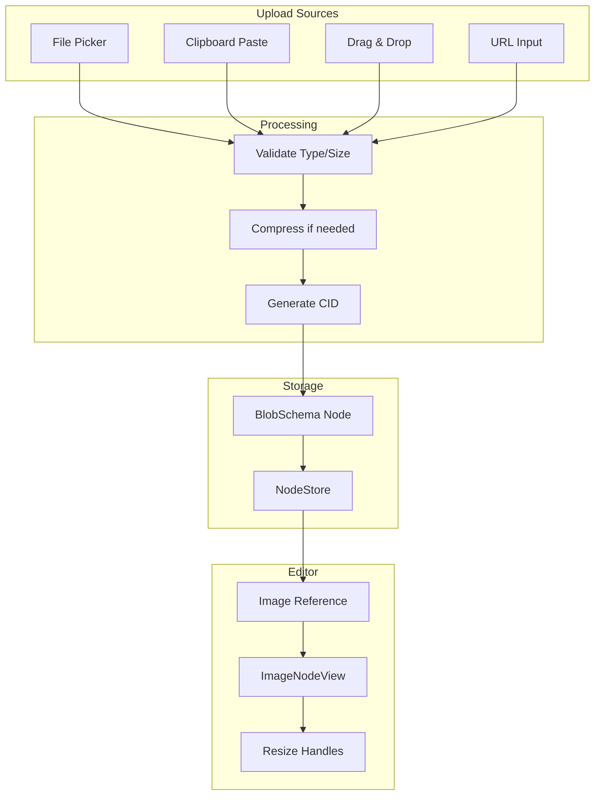

# 22: Image Upload

> Image handling with BlobService, paste, drag-drop, and resize

**Duration:** 1.5 days  
**Dependencies:** [21-blob-infrastructure.md](./21-blob-infrastructure.md)

## Overview

Images in xNet are stored as separate **Blob nodes** with content-addressed storage (CIDs). The editor embeds images by reference, keeping documents lightweight while enabling rich media. This document covers upload flows, the Image NodeView with resize handles, and alignment options.



## Implementation

### 1. Blob Schema Definition

```typescript
// packages/data/src/schema/schemas/blob.ts

import { defineSchema } from '../define'
import { text, number, select } from '../properties'
import type { InferNode } from '../types'

/**
 * BlobSchema - Content-addressed binary data storage.
 *
 * Blobs store binary data (images, files, etc.) with content addressing.
 * The actual binary data is stored separately, referenced by CID.
 */
export const BlobSchema = defineSchema({
  name: 'Blob',
  namespace: 'xnet://xnet.dev/',
  properties: {
    /** Content ID (hash of binary data) */
    cid: text({ required: true }),

    /** Original filename */
    filename: text({ required: true }),

    /** MIME type */
    mimeType: text({ required: true }),

    /** File size in bytes */
    size: number({ required: true, min: 0 }),

    /** Image dimensions (if applicable) */
    width: number({}),
    height: number({}),

    /** Thumbnail CID for preview (images/videos) */
    thumbnailCid: text({}),

    /** Alt text for accessibility */
    alt: text({}),

    /** Processing status */
    status: select({
      options: ['uploading', 'processing', 'ready', 'error'] as const,
      default: 'uploading'
    })
  }
})

export type Blob = InferNode<(typeof BlobSchema)['_properties']>
```

### 2. Image Upload Service

```typescript
// packages/editor/src/services/image-upload.ts

import { BlobSchema, type Blob } from '@xnetjs/data'
import type { NodeStore } from '@xnetjs/data'

export interface ImageUploadOptions {
  /** Maximum file size in bytes (default: 10MB) */
  maxSize?: number
  /** Maximum dimension (width or height) for compression */
  maxDimension?: number
  /** JPEG quality for compression (0-1) */
  quality?: number
  /** Generate thumbnail */
  generateThumbnail?: boolean
  /** Thumbnail max dimension */
  thumbnailSize?: number
}

export interface ImageUploadResult {
  blobId: string
  cid: string
  width: number
  height: number
  thumbnailCid?: string
}

const DEFAULT_OPTIONS: Required<ImageUploadOptions> = {
  maxSize: 10 * 1024 * 1024, // 10MB
  maxDimension: 2048,
  quality: 0.85,
  generateThumbnail: true,
  thumbnailSize: 200
}

/**
 * Upload an image file and create a Blob node
 */
export async function uploadImage(
  file: File,
  store: NodeStore,
  authorDID: string,
  options: ImageUploadOptions = {}
): Promise<ImageUploadResult> {
  const opts = { ...DEFAULT_OPTIONS, ...options }

  // Validate file type
  if (!file.type.startsWith('image/')) {
    throw new Error(`Invalid file type: ${file.type}. Expected image/*`)
  }

  // Validate file size
  if (file.size > opts.maxSize) {
    throw new Error(`File too large: ${file.size} bytes. Maximum: ${opts.maxSize}`)
  }

  // Load image to get dimensions
  const img = await loadImage(file)
  let { width, height } = img

  // Compress if needed
  let processedBlob: Blob
  if (width > opts.maxDimension || height > opts.maxDimension) {
    const scale = opts.maxDimension / Math.max(width, height)
    width = Math.round(width * scale)
    height = Math.round(height * scale)
    processedBlob = await compressImage(img, width, height, opts.quality)
  } else {
    processedBlob = file
  }

  // Generate CID from content
  const arrayBuffer = await processedBlob.arrayBuffer()
  const cid = await generateCID(new Uint8Array(arrayBuffer))

  // Store binary data (implementation depends on storage backend)
  await storeBinaryData(cid, new Uint8Array(arrayBuffer))

  // Generate thumbnail
  let thumbnailCid: string | undefined
  if (opts.generateThumbnail) {
    const thumbScale = opts.thumbnailSize / Math.max(width, height)
    const thumbWidth = Math.round(width * thumbScale)
    const thumbHeight = Math.round(height * thumbScale)
    const thumbBlob = await compressImage(img, thumbWidth, thumbHeight, 0.7)
    const thumbBuffer = await thumbBlob.arrayBuffer()
    thumbnailCid = await generateCID(new Uint8Array(thumbBuffer))
    await storeBinaryData(thumbnailCid, new Uint8Array(thumbBuffer))
  }

  // Create Blob node
  const blobNode = BlobSchema.create(
    {
      cid,
      filename: file.name,
      mimeType: processedBlob.type,
      size: processedBlob.size,
      width,
      height,
      thumbnailCid,
      status: 'ready'
    },
    { createdBy: authorDID }
  )

  await store.create(blobNode)

  return {
    blobId: blobNode.id,
    cid,
    width,
    height,
    thumbnailCid
  }
}

/**
 * Load an image from a File
 */
function loadImage(file: File): Promise<HTMLImageElement> {
  return new Promise((resolve, reject) => {
    const img = new Image()
    img.onload = () => resolve(img)
    img.onerror = reject
    img.src = URL.createObjectURL(file)
  })
}

/**
 * Compress/resize an image
 */
async function compressImage(
  img: HTMLImageElement,
  width: number,
  height: number,
  quality: number
): Promise<Blob> {
  const canvas = document.createElement('canvas')
  canvas.width = width
  canvas.height = height

  const ctx = canvas.getContext('2d')!
  ctx.drawImage(img, 0, 0, width, height)

  return new Promise((resolve, reject) => {
    canvas.toBlob(
      (blob) => {
        if (blob) resolve(blob)
        else reject(new Error('Failed to compress image'))
      },
      'image/jpeg',
      quality
    )
  })
}

/**
 * Generate content ID (CID) from data
 * Uses BLAKE3 hash from @xnetjs/crypto
 */
async function generateCID(data: Uint8Array): Promise<string> {
  const { blake3 } = await import('@xnetjs/crypto')
  const hash = blake3(data)
  // Return as base58 or similar URL-safe encoding
  return `bafk${base58Encode(hash)}`
}

/**
 * Store binary data (to be implemented by storage layer)
 */
async function storeBinaryData(cid: string, data: Uint8Array): Promise<void> {
  // This will be implemented by the storage adapter
  // Could be IndexedDB, filesystem, or remote storage
  console.log(`Storing ${data.byteLength} bytes with CID: ${cid}`)
}

// Placeholder for base58 encoding
function base58Encode(data: Uint8Array): string {
  // Implementation would use a base58 library
  return Array.from(data)
    .map((b) => b.toString(16).padStart(2, '0'))
    .join('')
    .slice(0, 32)
}
```

### 3. Image TipTap Extension

```typescript
// packages/editor/src/extensions/image/ImageExtension.ts

import { Node, mergeAttributes } from '@tiptap/core'
import { ReactNodeViewRenderer } from '@tiptap/react'
import { ImageNodeView } from './ImageNodeView'

export interface ImageOptions {
  /** Allowed MIME types */
  allowedMimeTypes: string[]
  /** Maximum file size in bytes */
  maxSize: number
  /** Enable inline images (vs block) */
  inline: boolean
  /** Custom upload handler */
  onUpload?: (file: File) => Promise<{ blobId: string; src: string }>
}

declare module '@tiptap/core' {
  interface Commands<ReturnType> {
    image: {
      /**
       * Insert an image by blob ID
       */
      setImage: (options: {
        blobId: string
        src: string
        alt?: string
        title?: string
        width?: number
        height?: number
        alignment?: 'left' | 'center' | 'right' | 'full'
      }) => ReturnType
      /**
       * Update image attributes
       */
      updateImage: (
        options: Partial<{
          alt: string
          title: string
          width: number
          height: number
          alignment: 'left' | 'center' | 'right' | 'full'
        }>
      ) => ReturnType
    }
  }
}

export const ImageExtension = Node.create<ImageOptions>({
  name: 'image',

  addOptions() {
    return {
      allowedMimeTypes: ['image/jpeg', 'image/png', 'image/gif', 'image/webp', 'image/svg+xml'],
      maxSize: 10 * 1024 * 1024, // 10MB
      inline: false,
      onUpload: undefined
    }
  },

  group() {
    return this.options.inline ? 'inline' : 'block'
  },

  inline() {
    return this.options.inline
  },

  draggable: true,

  addAttributes() {
    return {
      // Reference to xNet Blob node
      blobId: {
        default: null
      },
      // Resolved URL for display
      src: {
        default: null
      },
      alt: {
        default: null
      },
      title: {
        default: null
      },
      width: {
        default: null
      },
      height: {
        default: null
      },
      alignment: {
        default: 'center'
      },
      // Upload progress (0-100)
      uploadProgress: {
        default: null
      }
    }
  },

  parseHTML() {
    return [
      {
        tag: 'img[data-blob-id]'
      }
    ]
  },

  renderHTML({ HTMLAttributes }) {
    return [
      'img',
      mergeAttributes(this.options.HTMLAttributes, HTMLAttributes, {
        'data-blob-id': HTMLAttributes.blobId
      })
    ]
  },

  addNodeView() {
    return ReactNodeViewRenderer(ImageNodeView)
  },

  addCommands() {
    return {
      setImage:
        (options) =>
        ({ commands }) => {
          return commands.insertContent({
            type: this.name,
            attrs: options
          })
        },

      updateImage:
        (options) =>
        ({ commands }) => {
          return commands.updateAttributes(this.name, options)
        }
    }
  }
})
```

### 4. Image NodeView with Resize

```tsx
// packages/editor/src/extensions/image/ImageNodeView.tsx

import * as React from 'react'
import { NodeViewWrapper, type NodeViewProps } from '@tiptap/react'
import { cn } from '@xnetjs/ui/lib/utils'

const ALIGNMENTS = {
  left: 'mr-auto',
  center: 'mx-auto',
  right: 'ml-auto',
  full: 'w-full'
}

export function ImageNodeView({ node, updateAttributes, selected }: NodeViewProps) {
  const { src, alt, title, width, height, alignment, uploadProgress, blobId } = node.attrs
  const containerRef = React.useRef<HTMLDivElement>(null)
  const [isResizing, setIsResizing] = React.useState(false)
  const [resizeWidth, setResizeWidth] = React.useState(width)

  // Handle resize
  const handleResizeStart = React.useCallback(
    (e: React.MouseEvent, direction: 'left' | 'right') => {
      e.preventDefault()
      e.stopPropagation()

      const startX = e.clientX
      const startWidth = containerRef.current?.offsetWidth || width || 400

      setIsResizing(true)

      const handleMouseMove = (moveEvent: MouseEvent) => {
        const delta =
          direction === 'right' ? moveEvent.clientX - startX : startX - moveEvent.clientX

        const newWidth = Math.max(100, Math.min(startWidth + delta * 2, 1200))
        setResizeWidth(newWidth)
      }

      const handleMouseUp = () => {
        setIsResizing(false)
        updateAttributes({ width: resizeWidth })

        document.removeEventListener('mousemove', handleMouseMove)
        document.removeEventListener('mouseup', handleMouseUp)
      }

      document.addEventListener('mousemove', handleMouseMove)
      document.addEventListener('mouseup', handleMouseUp)
    },
    [width, resizeWidth, updateAttributes]
  )

  // Loading/uploading state
  if (uploadProgress !== null && uploadProgress < 100) {
    return (
      <NodeViewWrapper>
        <div
          className={cn(
            'relative bg-gray-100 dark:bg-gray-800 rounded-lg',
            'flex items-center justify-center',
            ALIGNMENTS[alignment as keyof typeof ALIGNMENTS]
          )}
          style={{ width: width || 400, height: height || 300 }}
        >
          <div className="text-center">
            <div className="w-16 h-16 mx-auto mb-2">
              <svg className="animate-spin" viewBox="0 0 24 24">
                <circle
                  className="opacity-25"
                  cx="12"
                  cy="12"
                  r="10"
                  stroke="currentColor"
                  strokeWidth="4"
                  fill="none"
                />
                <path
                  className="opacity-75"
                  fill="currentColor"
                  d="M4 12a8 8 0 018-8V0C5.373 0 0 5.373 0 12h4z"
                />
              </svg>
            </div>
            <p className="text-sm text-gray-500">{uploadProgress}%</p>
          </div>
        </div>
      </NodeViewWrapper>
    )
  }

  return (
    <NodeViewWrapper>
      <div
        ref={containerRef}
        className={cn(
          'relative group',
          ALIGNMENTS[alignment as keyof typeof ALIGNMENTS],
          selected && 'ring-2 ring-blue-500 ring-offset-2'
        )}
        style={{ width: isResizing ? resizeWidth : width || 'auto' }}
        data-drag-handle
      >
        {/* Image */}
        

        {/* Resize handles (visible on selection) */}
        {selected && alignment !== 'full' && (
          <>
            {/* Left handle */}
            <div
              className={cn(
                'absolute left-0 top-1/2 -translate-x-1/2 -translate-y-1/2',
                'w-3 h-12 bg-blue-500 rounded-full cursor-ew-resize',
                'opacity-0 group-hover:opacity-100 transition-opacity'
              )}
              onMouseDown={(e) => handleResizeStart(e, 'left')}
            />
            {/* Right handle */}
            <div
              className={cn(
                'absolute right-0 top-1/2 translate-x-1/2 -translate-y-1/2',
                'w-3 h-12 bg-blue-500 rounded-full cursor-ew-resize',
                'opacity-0 group-hover:opacity-100 transition-opacity'
              )}
              onMouseDown={(e) => handleResizeStart(e, 'right')}
            />
          </>
        )}

        {/* Alignment toolbar (visible on selection) */}
        {selected && (
          <div
            className={cn(
              'absolute -top-10 left-1/2 -translate-x-1/2',
              'flex items-center gap-1 p-1',
              'bg-white dark:bg-gray-800 rounded-lg shadow-lg',
              'border border-gray-200 dark:border-gray-700'
            )}
          >
            {(['left', 'center', 'right', 'full'] as const).map((align) => (
              <button
                key={align}
                type="button"
                onClick={() => updateAttributes({ alignment: align })}
                className={cn(
                  'p-1.5 rounded',
                  alignment === align
                    ? 'bg-blue-100 text-blue-600 dark:bg-blue-900 dark:text-blue-400'
                    : 'text-gray-500 hover:bg-gray-100 dark:hover:bg-gray-700'
                )}
              >
                <AlignIcon type={align} />
              </button>
            ))}
          </div>
        )}
      </div>
    </NodeViewWrapper>
  )
}

function AlignIcon({ type }: { type: 'left' | 'center' | 'right' | 'full' }) {
  const paths = {
    left: 'M3 6h18M3 12h12M3 18h18',
    center: 'M3 6h18M6 12h12M3 18h18',
    right: 'M3 6h18M9 12h12M3 18h18',
    full: 'M3 6h18M3 12h18M3 18h18'
  }

  return (
    <svg className="w-4 h-4" fill="none" stroke="currentColor" viewBox="0 0 24 24">
      <path strokeLinecap="round" strokeWidth={2} d={paths[type]} />
    </svg>
  )
}
```

### 5. Paste and Drop Handler Plugin

```typescript
// packages/editor/src/extensions/image/ImagePastePlugin.ts

import { Plugin, PluginKey } from '@tiptap/pm/state'
import { EditorView } from '@tiptap/pm/view'

export const ImagePastePluginKey = new PluginKey('imagePaste')

export interface ImagePastePluginOptions {
  allowedMimeTypes: string[]
  maxSize: number
  onUpload: (
    file: File
  ) => Promise<{ blobId: string; src: string; width?: number; height?: number }>
}

export function createImagePastePlugin(options: ImagePastePluginOptions) {
  return new Plugin({
    key: ImagePastePluginKey,

    props: {
      handlePaste(view: EditorView, event: ClipboardEvent) {
        const items = event.clipboardData?.items
        if (!items) return false

        for (const item of items) {
          if (options.allowedMimeTypes.some((type) => item.type.match(type))) {
            const file = item.getAsFile()
            if (!file) continue

            if (file.size > options.maxSize) {
              console.warn(`Image too large: ${file.size} bytes`)
              continue
            }

            event.preventDefault()
            handleImageUpload(view, file, options.onUpload)
            return true
          }
        }

        return false
      },

      handleDrop(view: EditorView, event: DragEvent, slice, moved) {
        if (moved) return false

        const files = event.dataTransfer?.files
        if (!files?.length) return false

        const images = Array.from(files).filter((file) =>
          options.allowedMimeTypes.some((type) => file.type.match(type))
        )

        if (images.length === 0) return false

        event.preventDefault()

        // Get drop position
        const pos = view.posAtCoords({
          left: event.clientX,
          top: event.clientY
        })

        for (const file of images) {
          if (file.size <= options.maxSize) {
            handleImageUpload(view, file, options.onUpload, pos?.pos)
          }
        }

        return true
      }
    }
  })
}

async function handleImageUpload(
  view: EditorView,
  file: File,
  onUpload: ImagePastePluginOptions['onUpload'],
  pos?: number
) {
  const { state, dispatch } = view
  const insertPos = pos ?? state.selection.from

  // Insert placeholder with upload progress
  const placeholderNode = state.schema.nodes.image.create({
    uploadProgress: 0,
    alt: file.name
  })

  let tr = state.tr.insert(insertPos, placeholderNode)
  dispatch(tr)

  try {
    // Simulate progress updates
    const progressInterval = setInterval(() => {
      const currentTr = view.state.tr
      // Find the placeholder node and update progress
      view.state.doc.descendants((node, pos) => {
        if (node.type.name === 'image' && node.attrs.uploadProgress !== null) {
          const newProgress = Math.min((node.attrs.uploadProgress || 0) + 10, 90)
          dispatch(
            currentTr.setNodeMarkup(pos, undefined, {
              ...node.attrs,
              uploadProgress: newProgress
            })
          )
          return false
        }
      })
    }, 100)

    // Upload
    const result = await onUpload(file)

    clearInterval(progressInterval)

    // Update with final result
    view.state.doc.descendants((node, nodePos) => {
      if (node.type.name === 'image' && node.attrs.uploadProgress !== null) {
        const finalTr = view.state.tr.setNodeMarkup(nodePos, undefined, {
          blobId: result.blobId,
          src: result.src,
          width: result.width,
          height: result.height,
          alt: file.name,
          uploadProgress: null
        })
        dispatch(finalTr)
        return false
      }
    })
  } catch (error) {
    console.error('Image upload failed:', error)

    // Remove placeholder on error
    view.state.doc.descendants((node, nodePos) => {
      if (node.type.name === 'image' && node.attrs.uploadProgress !== null) {
        const deleteTr = view.state.tr.delete(nodePos, nodePos + node.nodeSize)
        dispatch(deleteTr)
        return false
      }
    })
  }
}
```

### 6. Image Slash Command

```typescript
// packages/editor/src/extensions/slash-command/items.ts (addition)

// Add to COMMAND_GROUPS:
{
  name: 'Media',
  items: [
    {
      id: 'image',
      title: 'Image',
      description: 'Upload or embed an image',
      icon: '🖼️',
      searchTerms: ['img', 'picture', 'photo', 'upload'],
      command: ({ editor, range }) => {
        editor.chain().focus().deleteRange(range).run()

        // Open file picker
        const input = document.createElement('input')
        input.type = 'file'
        input.accept = 'image/*'
        input.onchange = async (e) => {
          const file = (e.target as HTMLInputElement).files?.[0]
          if (file) {
            // This would be connected to the upload service
            const { onUpload } = editor.extensionManager.extensions.find(
              (ext) => ext.name === 'image'
            )?.options || {}

            if (onUpload) {
              const result = await onUpload(file)
              editor.commands.setImage({
                blobId: result.blobId,
                src: result.src,
                width: result.width,
                height: result.height
              })
            }
          }
        }
        input.click()
      }
    }
  ]
}
```

## Tests

```typescript
// packages/editor/src/extensions/image/ImageExtension.test.ts

import { describe, it, expect, vi, beforeEach } from 'vitest'
import { Editor } from '@tiptap/core'
import StarterKit from '@tiptap/starter-kit'
import { ImageExtension } from './ImageExtension'

describe('ImageExtension', () => {
  let editor: Editor

  beforeEach(() => {
    editor = new Editor({
      extensions: [StarterKit, ImageExtension],
      content: '<p>Hello world</p>'
    })
  })

  afterEach(() => {
    editor.destroy()
  })

  describe('setImage command', () => {
    it('should insert an image', () => {
      editor.commands.setImage({
        blobId: 'blob-123',
        src: 'https://example.com/image.jpg',
        alt: 'Test image'
      })

      const html = editor.getHTML()
      expect(html).toContain('data-blob-id="blob-123"')
    })

    it('should set default alignment to center', () => {
      editor.commands.setImage({
        blobId: 'blob-123',
        src: 'https://example.com/image.jpg'
      })

      const json = editor.getJSON()
      const imageNode = json.content?.find((n) => n.type === 'image')
      expect(imageNode?.attrs?.alignment).toBe('center')
    })
  })

  describe('updateImage command', () => {
    it('should update image attributes', () => {
      editor.commands.setImage({
        blobId: 'blob-123',
        src: 'https://example.com/image.jpg'
      })

      editor.commands.updateImage({
        alt: 'Updated alt text',
        alignment: 'left'
      })

      const json = editor.getJSON()
      const imageNode = json.content?.find((n) => n.type === 'image')
      expect(imageNode?.attrs?.alt).toBe('Updated alt text')
      expect(imageNode?.attrs?.alignment).toBe('left')
    })
  })
})
```

```typescript
// packages/editor/src/services/image-upload.test.ts

import { describe, it, expect, vi, beforeEach } from 'vitest'
import { uploadImage } from './image-upload'

describe('uploadImage', () => {
  const mockStore = {
    create: vi.fn()
  }

  const mockFile = new File(['test'], 'test.jpg', { type: 'image/jpeg' })

  beforeEach(() => {
    vi.clearAllMocks()
  })

  it('should reject non-image files', async () => {
    const textFile = new File(['test'], 'test.txt', { type: 'text/plain' })

    await expect(uploadImage(textFile, mockStore as any, 'did:key:test')).rejects.toThrow(
      'Invalid file type'
    )
  })

  it('should reject files that are too large', async () => {
    const largeFile = new File([new ArrayBuffer(20 * 1024 * 1024)], 'large.jpg', {
      type: 'image/jpeg'
    })

    await expect(
      uploadImage(largeFile, mockStore as any, 'did:key:test', { maxSize: 10 * 1024 * 1024 })
    ).rejects.toThrow('File too large')
  })
})
```

## Checklist

- [ ] Create BlobSchema for storing image metadata
- [ ] Implement image upload service with compression
- [ ] Create ImageExtension TipTap node
- [ ] Build ImageNodeView with resize handles
- [ ] Add alignment toolbar (left/center/right/full)
- [ ] Implement paste handler for clipboard images
- [ ] Implement drag-and-drop upload
- [ ] Add upload progress indicator
- [ ] Add image to slash commands
- [ ] Support alt text for accessibility
- [ ] Generate thumbnails for previews
- [ ] Write tests
- [ ] Tests pass

---

[Back to README](./README.md) | [Previous: Blob Infrastructure](./21-blob-infrastructure.md) | [Next: File Attachments](./23-file-attachments.md)
