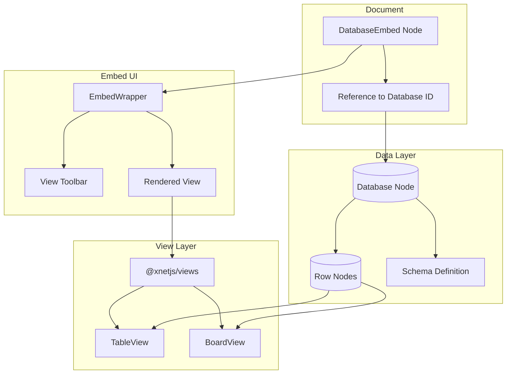

# 25: Database Embed

> Inline xNet database views within documents

**Duration:** 1.5 days  
**Dependencies:** [11-slash-extension.md](./11-slash-extension.md), `@xnetjs/views` package

## Overview

Database embeds allow users to include xNet database views directly within documents. Unlike traditional tables that store data inline, database embeds reference an existing xNet Database node and render it using the shared table/board view components from `@xnetjs/views`. This enables:

- Live data that updates when the source database changes
- Multiple views of the same data across different documents
- Full filtering, sorting, and view customization



## Implementation

### 1. Database Embed Extension

```typescript
// packages/editor/src/extensions/database-embed/DatabaseEmbedExtension.ts

import { Node, mergeAttributes } from '@tiptap/core'
import { ReactNodeViewRenderer } from '@tiptap/react'
import { DatabaseEmbedNodeView } from './DatabaseEmbedNodeView'

export interface DatabaseEmbedOptions {
  /** Callback to list available databases */
  onListDatabases?: () => Promise<Array<{ id: string; title: string; icon?: string }>>
  /** Callback when database selection requested */
  onSelectDatabase?: () => Promise<string | null>
}

declare module '@tiptap/core' {
  interface Commands<ReturnType> {
    databaseEmbed: {
      /** Insert a database embed */
      setDatabaseEmbed: (options: {
        databaseId: string
        viewType?: 'table' | 'board' | 'list' | 'calendar'
        viewConfig?: Record<string, unknown>
      }) => ReturnType
      /** Update database embed view */
      updateDatabaseEmbed: (options: {
        viewType?: 'table' | 'board' | 'list' | 'calendar'
        viewConfig?: Record<string, unknown>
      }) => ReturnType
    }
  }
}

export const DatabaseEmbedExtension = Node.create<DatabaseEmbedOptions>({
  name: 'databaseEmbed',

  addOptions() {
    return {
      onListDatabases: undefined,
      onSelectDatabase: undefined
    }
  },

  group: 'block',

  draggable: true,

  addAttributes() {
    return {
      // Reference to xNet Database node
      databaseId: { default: null },
      // View configuration
      viewType: { default: 'table' },
      viewConfig: { default: {} },
      // Display options
      showTitle: { default: true },
      maxHeight: { default: 400 }
    }
  },

  parseHTML() {
    return [
      {
        tag: 'div[data-database-id]'
      }
    ]
  },

  renderHTML({ HTMLAttributes }) {
    return [
      'div',
      mergeAttributes(HTMLAttributes, {
        'data-database-id': HTMLAttributes.databaseId,
        'data-type': 'database-embed'
      })
    ]
  },

  addNodeView() {
    return ReactNodeViewRenderer(DatabaseEmbedNodeView)
  },

  addCommands() {
    return {
      setDatabaseEmbed:
        (options) =>
        ({ commands }) => {
          return commands.insertContent({
            type: this.name,
            attrs: {
              databaseId: options.databaseId,
              viewType: options.viewType ?? 'table',
              viewConfig: options.viewConfig ?? {}
            }
          })
        },

      updateDatabaseEmbed:
        (options) =>
        ({ commands }) => {
          return commands.updateAttributes(this.name, options)
        }
    }
  }
})
```

### 2. Database Embed NodeView

```tsx
// packages/editor/src/extensions/database-embed/DatabaseEmbedNodeView.tsx

import * as React from 'react'
import { NodeViewWrapper, type NodeViewProps } from '@tiptap/react'
import { cn } from '@xnetjs/ui/lib/utils'
import { useNode } from '@xnetjs/react'
import { DatabaseSchema, type Database } from '@xnetjs/data'
// Import from @xnetjs/views - the shared view components
// import { TableView, BoardView, ViewToolbar } from '@xnetjs/views'
import {
  Table2,
  LayoutGrid,
  List,
  Calendar,
  ExternalLink,
  Settings,
  ChevronDown
} from 'lucide-react'

type ViewType = 'table' | 'board' | 'list' | 'calendar'

const VIEW_ICONS: Record<ViewType, React.ComponentType<{ className?: string }>> = {
  table: Table2,
  board: LayoutGrid,
  list: List,
  calendar: Calendar
}

const VIEW_LABELS: Record<ViewType, string> = {
  table: 'Table',
  board: 'Board',
  list: 'List',
  calendar: 'Calendar'
}

export function DatabaseEmbedNodeView({ node, selected, updateAttributes }: NodeViewProps) {
  const { databaseId, viewType, viewConfig, showTitle, maxHeight } = node.attrs
  const [showViewPicker, setShowViewPicker] = React.useState(false)

  // Fetch the database node
  const { node: database, loading, error } = useNode<Database>(databaseId)

  // View type icon
  const ViewIcon = VIEW_ICONS[viewType as ViewType] || Table2

  if (loading) {
    return (
      <NodeViewWrapper>
        <div
          className={cn(
            'rounded-lg border border-gray-200 dark:border-gray-700',
            'bg-gray-50 dark:bg-gray-800',
            'p-8 text-center'
          )}
        >
          <div className="animate-pulse text-gray-400">Loading database...</div>
        </div>
      </NodeViewWrapper>
    )
  }

  if (error || !database) {
    return (
      <NodeViewWrapper>
        <div
          className={cn(
            'rounded-lg border border-red-200 dark:border-red-800',
            'bg-red-50 dark:bg-red-900/20',
            'p-4 text-center text-red-600 dark:text-red-400'
          )}
        >
          <p className="font-medium">Database not found</p>
          <p className="text-sm mt-1">The linked database may have been deleted.</p>
        </div>
      </NodeViewWrapper>
    )
  }

  return (
    <NodeViewWrapper>
      <div
        className={cn(
          'rounded-lg border border-gray-200 dark:border-gray-700',
          'bg-white dark:bg-gray-900',
          'overflow-hidden',
          selected && 'ring-2 ring-blue-500 ring-offset-2'
        )}
        data-drag-handle
      >
        {/* Header */}
        <div
          className={cn(
            'flex items-center justify-between px-3 py-2',
            'border-b border-gray-200 dark:border-gray-700',
            'bg-gray-50 dark:bg-gray-800'
          )}
        >
          <div className="flex items-center gap-2">
            {/* Database title */}
            {showTitle && (
              <div className="flex items-center gap-2">
                {database.icon && <span>{database.icon}</span>}
                <span className="font-medium text-sm">{database.title}</span>
              </div>
            )}

            {/* View type picker */}
            <div className="relative">
              <button
                type="button"
                onClick={() => setShowViewPicker(!showViewPicker)}
                className={cn(
                  'flex items-center gap-1 px-2 py-1 rounded',
                  'text-xs text-gray-600 dark:text-gray-400',
                  'hover:bg-gray-200 dark:hover:bg-gray-700'
                )}
              >
                <ViewIcon className="w-3.5 h-3.5" />
                <span>{VIEW_LABELS[viewType as ViewType]}</span>
                <ChevronDown className="w-3 h-3" />
              </button>

              {showViewPicker && (
                <div
                  className={cn(
                    'absolute top-full left-0 mt-1 z-10',
                    'bg-white dark:bg-gray-800 rounded-lg shadow-lg',
                    'border border-gray-200 dark:border-gray-700',
                    'py-1 min-w-[120px]'
                  )}
                >
                  {(Object.keys(VIEW_ICONS) as ViewType[]).map((type) => {
                    const Icon = VIEW_ICONS[type]
                    return (
                      <button
                        key={type}
                        type="button"
                        onClick={() => {
                          updateAttributes({ viewType: type })
                          setShowViewPicker(false)
                        }}
                        className={cn(
                          'w-full flex items-center gap-2 px-3 py-1.5',
                          'text-sm text-left',
                          'hover:bg-gray-100 dark:hover:bg-gray-700',
                          viewType === type && 'bg-blue-50 dark:bg-blue-900/30 text-blue-600'
                        )}
                      >
                        <Icon className="w-4 h-4" />
                        <span>{VIEW_LABELS[type]}</span>
                      </button>
                    )
                  })}
                </div>
              )}
            </div>
          </div>

          {/* Actions */}
          <div className="flex items-center gap-1">
            <button
              type="button"
              onClick={() => {
                // Open database in full view
                window.open(`/database/${databaseId}`, '_blank')
              }}
              className={cn(
                'p-1.5 rounded',
                'text-gray-500 hover:text-gray-700',
                'dark:text-gray-400 dark:hover:text-gray-300',
                'hover:bg-gray-200 dark:hover:bg-gray-700'
              )}
              title="Open database"
            >
              <ExternalLink className="w-4 h-4" />
            </button>
            <button
              type="button"
              onClick={() => {
                // Open view settings
              }}
              className={cn(
                'p-1.5 rounded',
                'text-gray-500 hover:text-gray-700',
                'dark:text-gray-400 dark:hover:text-gray-300',
                'hover:bg-gray-200 dark:hover:bg-gray-700'
              )}
              title="View settings"
            >
              <Settings className="w-4 h-4" />
            </button>
          </div>
        </div>

        {/* Database view */}
        <div className="overflow-auto" style={{ maxHeight: maxHeight || 400 }}>
          <DatabaseViewRenderer
            databaseId={databaseId}
            viewType={viewType as ViewType}
            viewConfig={viewConfig}
          />
        </div>
      </div>
    </NodeViewWrapper>
  )
}

/**
 * Renders the appropriate view component based on viewType.
 * This delegates to @xnetjs/views components.
 */
function DatabaseViewRenderer({
  databaseId,
  viewType,
  viewConfig
}: {
  databaseId: string
  viewType: ViewType
  viewConfig: Record<string, unknown>
}) {
  // TODO: Import and use actual view components from @xnetjs/views
  // For now, render a placeholder

  return (
    <div className="p-4 text-center text-gray-500">
      <p className="text-sm">
        Database view: <code>{viewType}</code>
      </p>
      <p className="text-xs mt-1">View components from @xnetjs/views will be rendered here</p>
      {/* 
      Actual implementation would be:
      
      switch (viewType) {
        case 'table':
          return <TableView databaseId={databaseId} config={viewConfig} embedded />
        case 'board':
          return <BoardView databaseId={databaseId} config={viewConfig} embedded />
        case 'list':
          return <ListView databaseId={databaseId} config={viewConfig} embedded />
        case 'calendar':
          return <CalendarView databaseId={databaseId} config={viewConfig} embedded />
      }
      */}
    </div>
  )
}
```

### 3. Database Picker Component

```tsx
// packages/editor/src/extensions/database-embed/DatabasePicker.tsx

import * as React from 'react'
import { cn } from '@xnetjs/ui/lib/utils'
import { useNodes } from '@xnetjs/react'
import { DatabaseSchema, type Database } from '@xnetjs/data'
import { Database as DatabaseIcon, Plus, Search } from 'lucide-react'

interface DatabasePickerProps {
  onSelect: (databaseId: string) => void
  onCreateNew?: () => void
  onClose: () => void
}

export function DatabasePicker({ onSelect, onCreateNew, onClose }: DatabasePickerProps) {
  const [search, setSearch] = React.useState('')

  // Fetch all databases
  const { nodes: databases, loading } = useNodes<Database>({
    schemaId: DatabaseSchema._schemaId
  })

  // Filter by search
  const filtered = React.useMemo(() => {
    if (!search) return databases
    const lower = search.toLowerCase()
    return databases.filter((db) => db.title.toLowerCase().includes(lower))
  }, [databases, search])

  return (
    <div
      className={cn(
        'bg-white dark:bg-gray-800 rounded-lg shadow-xl',
        'border border-gray-200 dark:border-gray-700',
        'w-80 max-h-96 overflow-hidden'
      )}
    >
      {/* Search */}
      <div className="p-2 border-b border-gray-200 dark:border-gray-700">
        <div className="relative">
          <Search className="absolute left-2.5 top-1/2 -translate-y-1/2 w-4 h-4 text-gray-400" />
          <input
            type="text"
            value={search}
            onChange={(e) => setSearch(e.target.value)}
            placeholder="Search databases..."
            className={cn(
              'w-full pl-8 pr-3 py-1.5 rounded',
              'text-sm bg-gray-100 dark:bg-gray-700',
              'border-none outline-none',
              'placeholder:text-gray-400'
            )}
            autoFocus
          />
        </div>
      </div>

      {/* Database list */}
      <div className="overflow-y-auto max-h-64">
        {loading ? (
          <div className="p-4 text-center text-gray-400">Loading...</div>
        ) : filtered.length === 0 ? (
          <div className="p-4 text-center text-gray-400">
            {search ? 'No databases found' : 'No databases yet'}
          </div>
        ) : (
          <ul className="py-1">
            {filtered.map((db) => (
              <li key={db.id}>
                <button
                  type="button"
                  onClick={() => onSelect(db.id)}
                  className={cn(
                    'w-full flex items-center gap-3 px-3 py-2',
                    'text-left text-sm',
                    'hover:bg-gray-100 dark:hover:bg-gray-700'
                  )}
                >
                  <span className="text-lg">{db.icon || '📊'}</span>
                  <span className="flex-1 truncate">{db.title}</span>
                </button>
              </li>
            ))}
          </ul>
        )}
      </div>

      {/* Create new */}
      {onCreateNew && (
        <div className="p-2 border-t border-gray-200 dark:border-gray-700">
          <button
            type="button"
            onClick={onCreateNew}
            className={cn(
              'w-full flex items-center gap-2 px-3 py-2 rounded',
              'text-sm text-blue-600 dark:text-blue-400',
              'hover:bg-blue-50 dark:hover:bg-blue-900/30'
            )}
          >
            <Plus className="w-4 h-4" />
            <span>Create new database</span>
          </button>
        </div>
      )}
    </div>
  )
}
```

### 4. Slash Command

```typescript
// Add to COMMAND_GROUPS in slash-command/items.ts:

{
  id: 'database',
  title: 'Database',
  description: 'Embed a linked database view',
  icon: '📊',
  searchTerms: ['database', 'table', 'board', 'view', 'data'],
  command: ({ editor, range }) => {
    editor.chain().focus().deleteRange(range).run()

    // Get the onSelectDatabase callback from extension options
    const { onSelectDatabase } = editor.extensionManager.extensions.find(
      (ext) => ext.name === 'databaseEmbed'
    )?.options || {}

    if (onSelectDatabase) {
      onSelectDatabase().then((databaseId: string | null) => {
        if (databaseId) {
          editor.commands.setDatabaseEmbed({ databaseId })
        }
      })
    } else {
      // Fallback: prompt for database ID
      const databaseId = window.prompt('Database ID:')
      if (databaseId) {
        editor.commands.setDatabaseEmbed({ databaseId })
      }
    }
  }
},
{
  id: 'table-view',
  title: 'Table View',
  description: 'Embed a database as a table',
  icon: '📋',
  searchTerms: ['table', 'spreadsheet', 'grid'],
  command: ({ editor, range }) => {
    // Same as above but with viewType: 'table'
  }
},
{
  id: 'board-view',
  title: 'Board View',
  description: 'Embed a database as a kanban board',
  icon: '📌',
  searchTerms: ['board', 'kanban', 'cards'],
  command: ({ editor, range }) => {
    // Same as above but with viewType: 'board'
  }
}
```

### 5. Integration with Editor

```tsx
// packages/editor/src/components/RichTextEditor.tsx (database embed integration)

import * as React from 'react'
import { useEditor, EditorContent } from '@tiptap/react'
import { DatabaseEmbedExtension } from '../extensions/database-embed/DatabaseEmbedExtension'
import { DatabasePicker } from '../extensions/database-embed/DatabasePicker'

interface RichTextEditorProps {
  // ... other props
  onSelectDatabase?: () => Promise<string | null>
}

export function RichTextEditor({ onSelectDatabase, ...props }: RichTextEditorProps) {
  const [showDatabasePicker, setShowDatabasePicker] = React.useState(false)
  const [pickerResolve, setPickerResolve] = React.useState<((id: string | null) => void) | null>(
    null
  )

  const editor = useEditor({
    extensions: [
      // ... other extensions
      DatabaseEmbedExtension.configure({
        onSelectDatabase: async () => {
          return new Promise((resolve) => {
            setPickerResolve(() => resolve)
            setShowDatabasePicker(true)
          })
        }
      })
    ]
  })

  const handleDatabaseSelect = (databaseId: string) => {
    pickerResolve?.(databaseId)
    setShowDatabasePicker(false)
    setPickerResolve(null)
  }

  const handlePickerClose = () => {
    pickerResolve?.(null)
    setShowDatabasePicker(false)
    setPickerResolve(null)
  }

  return (
    <div className="relative">
      <EditorContent editor={editor} />

      {/* Database picker modal */}
      {showDatabasePicker && (
        <div className="fixed inset-0 z-50 flex items-center justify-center bg-black/50">
          <DatabasePicker onSelect={handleDatabaseSelect} onClose={handlePickerClose} />
        </div>
      )}
    </div>
  )
}
```

## Tests

```typescript
// packages/editor/src/extensions/database-embed/DatabaseEmbedExtension.test.ts

import { describe, it, expect, beforeEach, afterEach } from 'vitest'
import { Editor } from '@tiptap/core'
import StarterKit from '@tiptap/starter-kit'
import { DatabaseEmbedExtension } from './DatabaseEmbedExtension'

describe('DatabaseEmbedExtension', () => {
  let editor: Editor

  beforeEach(() => {
    editor = new Editor({
      extensions: [StarterKit, DatabaseEmbedExtension],
      content: '<p>Hello world</p>'
    })
  })

  afterEach(() => {
    editor.destroy()
  })

  describe('setDatabaseEmbed command', () => {
    it('should insert a database embed', () => {
      editor.commands.setDatabaseEmbed({
        databaseId: 'db-123'
      })

      const html = editor.getHTML()
      expect(html).toContain('data-database-id="db-123"')
    })

    it('should set default view type to table', () => {
      editor.commands.setDatabaseEmbed({
        databaseId: 'db-123'
      })

      const json = editor.getJSON()
      const embedNode = json.content?.find((n) => n.type === 'databaseEmbed')
      expect(embedNode?.attrs?.viewType).toBe('table')
    })

    it('should accept custom view type', () => {
      editor.commands.setDatabaseEmbed({
        databaseId: 'db-123',
        viewType: 'board'
      })

      const json = editor.getJSON()
      const embedNode = json.content?.find((n) => n.type === 'databaseEmbed')
      expect(embedNode?.attrs?.viewType).toBe('board')
    })
  })

  describe('updateDatabaseEmbed command', () => {
    it('should update view type', () => {
      editor.commands.setDatabaseEmbed({ databaseId: 'db-123' })
      editor.commands.updateDatabaseEmbed({ viewType: 'calendar' })

      const json = editor.getJSON()
      const embedNode = json.content?.find((n) => n.type === 'databaseEmbed')
      expect(embedNode?.attrs?.viewType).toBe('calendar')
    })
  })
})
```

## Checklist

- [ ] Create DatabaseEmbedExtension
- [ ] Build DatabaseEmbedNodeView
- [ ] Implement view type switching
- [ ] Create DatabasePicker component
- [ ] Integrate with @xnetjs/views components
- [ ] Add database to slash commands
- [ ] Handle missing/deleted databases
- [ ] Support embedded view configuration
- [ ] Add external link to full database
- [ ] Write tests
- [ ] Tests pass

---

[Back to README](./README.md) | [Previous: Media Embeds](./24-media-embeds.md) | [Next: Callouts](./26-callouts.md)
