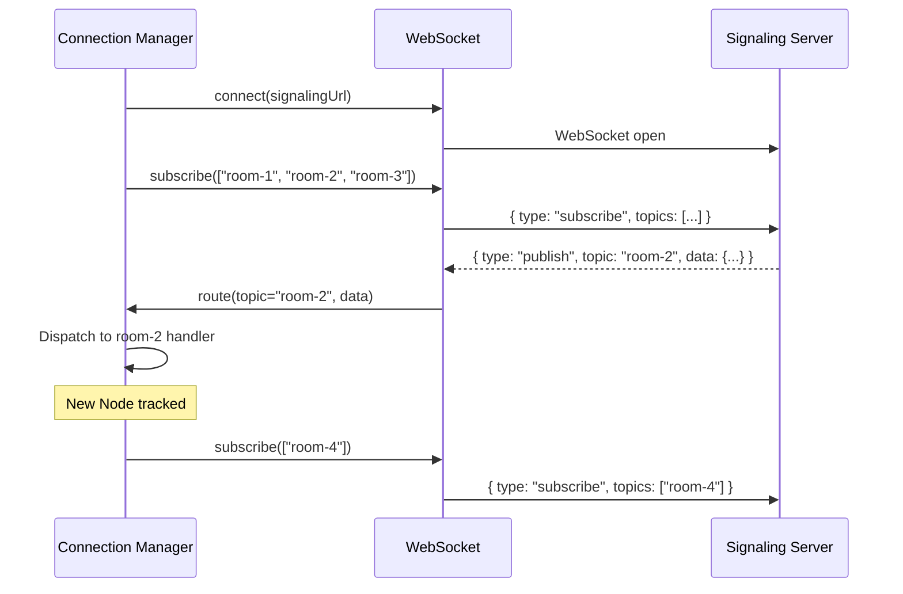

# 04: Connection Manager

> Multiplexed WebSocket connection for all tracked Nodes

**Dependencies:** None (standalone, used by SyncManager)
**Modifies:** new `packages/react/src/sync/connection-manager.ts`

## Overview

Instead of one WebSocket per Node (current `WebSocketSyncProvider` approach), the Connection Manager maintains a single WebSocket subscribed to multiple rooms. This reduces connection count from O(N) to O(1).

The signaling protocol already supports multi-room subscriptions:

```json
{ "type": "subscribe", "topics": ["xnet-doc-abc", "xnet-doc-def", "xnet-doc-ghi"] }
```



## Implementation

```typescript
// packages/react/src/sync/connection-manager.ts

import * as Y from 'yjs'

export type ConnectionStatus = 'disconnected' | 'connecting' | 'connected' | 'error'

export interface ConnectionManagerConfig {
  /** Signaling/hub WebSocket URL */
  url: string
  /** Reconnect delay in ms (default: 2000) */
  reconnectDelay?: number
  /** Max reconnect attempts (default: Infinity) */
  maxReconnects?: number

  // --- Hub auth (optional, see plan03_8) ---
  /** Static UCAN token (appended as ?token= on connect) */
  ucanToken?: string
  /** Dynamic UCAN generator (called on each connect/reconnect) */
  getUCANToken?: () => Promise<string>
}

type RoomHandler = (data: Record<string, unknown>) => void
type StatusHandler = (status: ConnectionStatus) => void

export interface ConnectionManager {
  /** Current connection status */
  readonly status: ConnectionStatus

  /** Connect to the signaling server */
  connect(): void
  /** Disconnect and cleanup */
  disconnect(): void

  /** Subscribe to a room (returns unsubscribe function) */
  joinRoom(room: string, handler: RoomHandler): () => void
  /** Leave a room */
  leaveRoom(room: string): void

  /** Publish a message to a room */
  publish(room: string, data: object): void

  /** Listen for status changes */
  onStatus(handler: StatusHandler): () => void

  /** Number of active room subscriptions */
  readonly roomCount: number
}

export function createConnectionManager(config: ConnectionManagerConfig): ConnectionManager {
  let ws: WebSocket | null = null
  let status: ConnectionStatus = 'disconnected'
  let reconnectAttempts = 0
  let reconnectTimer: ReturnType<typeof setTimeout> | null = null
  let destroyed = false

  const reconnectDelay = config.reconnectDelay ?? 2000
  const maxReconnects = config.maxReconnects ?? Infinity

  const rooms = new Map<string, Set<RoomHandler>>()
  const statusListeners = new Set<StatusHandler>()

  function setStatus(s: ConnectionStatus): void {
    status = s
    for (const handler of statusListeners) {
      handler(s)
    }
  }

  function send(msg: object): void {
    if (ws?.readyState === WebSocket.OPEN) {
      ws.send(JSON.stringify(msg))
    }
  }

  function handleMessage(event: MessageEvent): void {
    try {
      const msg = JSON.parse(event.data as string)
      if (msg.type === 'publish' && msg.topic) {
        const handlers = rooms.get(msg.topic)
        if (handlers) {
          for (const handler of handlers) {
            handler(msg.data)
          }
        }
      }
    } catch {
      // Ignore parse errors
    }
  }

  async function doConnect(): Promise<void> {
    if (destroyed) return

    setStatus('connecting')

    try {
      // Append UCAN token if configured (hub auth, see plan03_8)
      let url = config.url
      const token = config.ucanToken ?? (config.getUCANToken ? await config.getUCANToken() : null)
      if (token) {
        const parsed = new URL(url)
        parsed.searchParams.set('token', token)
        url = parsed.toString()
      }

      ws = new WebSocket(url)

      ws.onopen = () => {
        setStatus('connected')
        reconnectAttempts = 0

        // Re-subscribe to all rooms
        if (rooms.size > 0) {
          send({ type: 'subscribe', topics: Array.from(rooms.keys()) })
        }
      }

      ws.onmessage = handleMessage

      ws.onclose = () => {
        ws = null
        setStatus('disconnected')
        scheduleReconnect()
      }

      ws.onerror = () => {
        setStatus('error')
      }
    } catch {
      setStatus('error')
      scheduleReconnect()
    }
  }

  function scheduleReconnect(): void {
    if (destroyed || reconnectAttempts >= maxReconnects) return
    if (reconnectTimer) return

    reconnectAttempts++
    reconnectTimer = setTimeout(() => {
      reconnectTimer = null
      doConnect()
    }, reconnectDelay)
  }

  return {
    get status() {
      return status
    },
    get roomCount() {
      return rooms.size
    },

    connect() {
      destroyed = false
      doConnect()
    },

    disconnect() {
      destroyed = true
      if (reconnectTimer) {
        clearTimeout(reconnectTimer)
        reconnectTimer = null
      }
      if (ws) {
        // Unsubscribe from all rooms before closing
        if (rooms.size > 0) {
          send({ type: 'unsubscribe', topics: Array.from(rooms.keys()) })
        }
        ws.close(1000, 'Client disconnect')
        ws = null
      }
      setStatus('disconnected')
    },

    joinRoom(room: string, handler: RoomHandler): () => void {
      let handlers = rooms.get(room)
      if (!handlers) {
        handlers = new Set()
        rooms.set(room, handlers)
        // Subscribe on the wire if connected
        send({ type: 'subscribe', topics: [room] })
      }
      handlers.add(handler)

      return () => {
        handlers!.delete(handler)
        if (handlers!.size === 0) {
          rooms.delete(room)
          send({ type: 'unsubscribe', topics: [room] })
        }
      }
    },

    leaveRoom(room: string): void {
      rooms.delete(room)
      send({ type: 'unsubscribe', topics: [room] })
    },

    publish(room: string, data: object): void {
      send({ type: 'publish', topic: room, data })
    },

    onStatus(handler: StatusHandler): () => void {
      statusListeners.add(handler)
      return () => statusListeners.delete(handler)
    }
  }
}
```

## Checklist

- [ ] Create `packages/react/src/sync/connection-manager.ts`
- [ ] Implement multi-room subscribe/unsubscribe
- [ ] Implement auto-reconnect with room re-subscription
- [ ] Route incoming messages to room handlers
- [ ] Write unit tests (mock WebSocket)
- [ ] Export from package

---

[← Previous: Registry](./03-registry.md) | [Next: Sync Manager →](./05-sync-manager.md)
