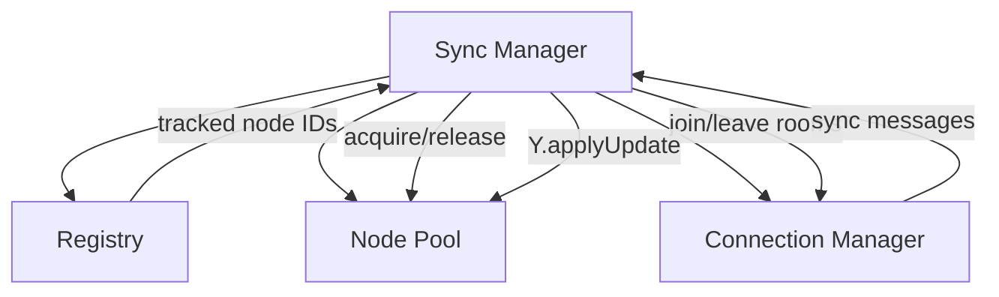

# 05: Sync Manager

> Orchestrator tying Node Pool + Registry + Connection Manager together

**Dependencies:** `01-meta-bridge.md`, `02-node-pool.md`, `03-registry.md`, `04-connection-manager.md`
**Modifies:** new `packages/react/src/sync/sync-manager.ts`

## Overview

The Sync Manager is the top-level orchestrator. It wires together the Node Pool, Registry, and Connection Manager into a cohesive sync service. It handles the Yjs sync protocol (state vectors, diffs, incremental updates) for each tracked Node.



## Implementation

```typescript
// packages/react/src/sync/sync-manager.ts

import * as Y from 'yjs'
import { Awareness } from 'y-protocols/awareness'
import type { NodeStore, NodeStorageAdapter } from '@xnet/data'
import { createMetaBridge, type MetaBridge } from './meta-bridge'
import { createNodePool, type NodePool } from './node-pool'
import { createRegistry, type Registry } from './registry'
import {
  createConnectionManager,
  type ConnectionManager,
  type ConnectionStatus
} from './connection-manager'

export type SyncStatus = ConnectionStatus

export interface SyncManagerConfig {
  /** NodeStore for meta bridge */
  nodeStore: NodeStore
  /** Storage adapter for pool persistence + registry */
  storage: NodeStorageAdapter
  /** Signaling/hub WebSocket URL */
  signalingUrl: string
  /** Max Y.Docs in memory (default: 50) */
  poolSize?: number
  /** TTL for tracked Nodes (default: 7 days) */
  trackTTL?: number
  /** Author DID for awareness */
  authorDID?: string

  // --- Hub-specific (optional, see plan03_8) ---
  /** UCAN token generator for hub auth */
  getUCANToken?: () => Promise<string>
  /** Enable NodeStore sync relay (structured data through hub) */
  enableNodeSync?: boolean
  /** Room/workspace for NodeStore sync */
  nodesSyncRoom?: string
}

export interface SyncManager {
  /** Start the sync manager (connect, load registry, sync tracked Nodes) */
  start(): Promise<void>
  /** Stop (disconnect, flush, save registry) */
  stop(): Promise<void>

  /** Track a Node for background sync */
  track(nodeId: string, schemaId: string): void
  /** Stop tracking a Node */
  untrack(nodeId: string): void

  /** Acquire a Y.Doc (used by useNode) */
  acquire(nodeId: string): Promise<Y.Doc>
  /** Release a Y.Doc (component unmounted) */
  release(nodeId: string): void

  /** Get awareness for a Node (for cursor presence) */
  getAwareness(nodeId: string): Awareness | null

  /** Connection status */
  readonly status: SyncStatus
  /** Pool stats */
  readonly poolSize: number
  /** Tracked count */
  readonly trackedCount: number

  /** Listen for events */
  on(event: 'status', handler: (status: SyncStatus) => void): () => void
}

export function createSyncManager(config: SyncManagerConfig): SyncManager {
  const metaBridge = createMetaBridge(config.nodeStore)
  const pool = createNodePool({
    storage: config.storage,
    metaBridge,
    maxWarm: config.poolSize ?? 50
  })
  const registry = createRegistry({
    storage: config.storage,
    trackTTL: config.trackTTL
  })
  const connection = createConnectionManager({
    url: config.signalingUrl
  })

  // Room cleanup functions per nodeId
  const roomCleanups = new Map<string, () => void>()
  // Awareness instances per nodeId
  const awarenessMap = new Map<string, Awareness>()
  // Peer IDs for deduplication
  const peerId = Math.random().toString(36).slice(2, 10)

  function toBase64(data: Uint8Array): string {
    let binary = ''
    for (let i = 0; i < data.length; i++) {
      binary += String.fromCharCode(data[i])
    }
    return btoa(binary)
  }

  function fromBase64(str: string): Uint8Array {
    const binary = atob(str)
    const bytes = new Uint8Array(binary.length)
    for (let i = 0; i < binary.length; i++) {
      bytes[i] = binary.charCodeAt(i)
    }
    return bytes
  }

  function joinNodeRoom(nodeId: string): void {
    if (roomCleanups.has(nodeId)) return

    const room = `xnet-doc-${nodeId}`

    const cleanup = connection.joinRoom(room, (data) => {
      handleSyncMessage(nodeId, data)
    })

    roomCleanups.set(nodeId, cleanup)

    // Send initial sync-step1 if we have a doc
    if (pool.has(nodeId)) {
      pool.acquire(nodeId).then((doc) => {
        const sv = Y.encodeStateVector(doc)
        connection.publish(room, {
          type: 'sync-step1',
          from: peerId,
          sv: toBase64(sv)
        })
        pool.release(nodeId)
      })
    }
  }

  function leaveNodeRoom(nodeId: string): void {
    const cleanup = roomCleanups.get(nodeId)
    if (cleanup) {
      cleanup()
      roomCleanups.delete(nodeId)
    }
    awarenessMap.delete(nodeId)
  }

  async function handleSyncMessage(nodeId: string, data: Record<string, unknown>): Promise<void> {
    if (data.from === peerId) return // Ignore own messages

    const doc = await pool.acquire(nodeId)
    const room = `xnet-doc-${nodeId}`

    try {
      switch (data.type) {
        case 'sync-step1': {
          const remoteSV = fromBase64(data.sv as string)
          const diff = Y.encodeStateAsUpdate(doc, remoteSV)
          connection.publish(room, {
            type: 'sync-step2',
            from: peerId,
            to: data.from,
            update: toBase64(diff)
          })
          break
        }

        case 'sync-step2': {
          if (data.to && data.to !== peerId) break
          const update = fromBase64(data.update as string)
          Y.applyUpdate(doc, update, 'remote')
          registry.markSynced(nodeId)
          break
        }

        case 'sync-update': {
          const update = fromBase64(data.update as string)
          Y.applyUpdate(doc, update, 'remote')
          break
        }
      }
    } finally {
      pool.release(nodeId)
    }
  }

  // Forward local Y.Doc updates to the network
  function setupDocBroadcast(nodeId: string, doc: Y.Doc): void {
    const room = `xnet-doc-${nodeId}`
    doc.on('update', (update: Uint8Array, origin: unknown) => {
      if (origin === 'remote') return // Don't re-broadcast remote updates
      if (connection.status === 'connected') {
        connection.publish(room, {
          type: 'sync-update',
          from: peerId,
          update: toBase64(update)
        })
      }
    })
  }

  return {
    async start() {
      await registry.load()
      connection.connect()

      // Join rooms for all tracked Nodes
      const tracked = registry.getTracked()
      for (const entry of tracked) {
        joinNodeRoom(entry.nodeId)
      }
    },

    async stop() {
      // Leave all rooms
      for (const nodeId of roomCleanups.keys()) {
        leaveNodeRoom(nodeId)
      }

      connection.disconnect()
      await pool.flushAll()
      registry.prune()
      await registry.save()
      await pool.destroy()
    },

    track(nodeId, schemaId) {
      registry.track(nodeId, schemaId)
      joinNodeRoom(nodeId)
    },

    untrack(nodeId) {
      registry.untrack(nodeId)
      leaveNodeRoom(nodeId)
    },

    async acquire(nodeId) {
      registry.touch(nodeId)

      const doc = await pool.acquire(nodeId)

      // Set up broadcast if not already done
      setupDocBroadcast(nodeId, doc)

      // Join room if not already joined
      if (!roomCleanups.has(nodeId)) {
        joinNodeRoom(nodeId)
      }

      return doc
    },

    release(nodeId) {
      pool.release(nodeId)
      // Note: don't leave the room — keep syncing in background
    },

    getAwareness(nodeId) {
      return awarenessMap.get(nodeId) ?? null
    },

    get status() {
      return connection.status
    },
    get poolSize() {
      return pool.size
    },
    get trackedCount() {
      return registry.getTracked().length
    },

    on(event, handler) {
      if (event === 'status') {
        return connection.onStatus(handler)
      }
      return () => {}
    }
  }
}
```

## Checklist

- [ ] Create `packages/react/src/sync/sync-manager.ts`
- [ ] Wire together pool + registry + connection
- [ ] Implement Yjs sync protocol routing (step1/step2/update)
- [ ] Broadcast local updates to network
- [ ] Join/leave rooms based on registry changes
- [ ] Write integration tests
- [ ] Export from package

---

[← Previous: Connection Manager](./04-connection-manager.md) | [Next: useNode Integration →](./06-usenode-integration.md)
