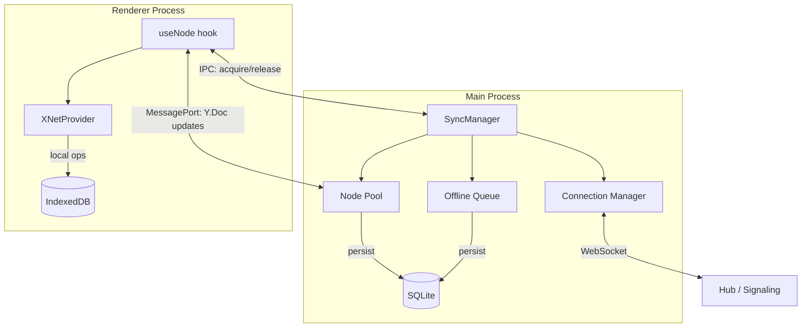
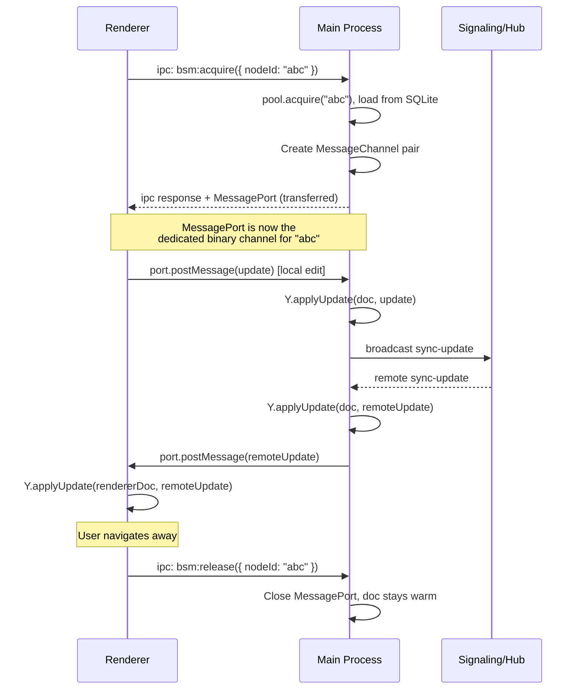
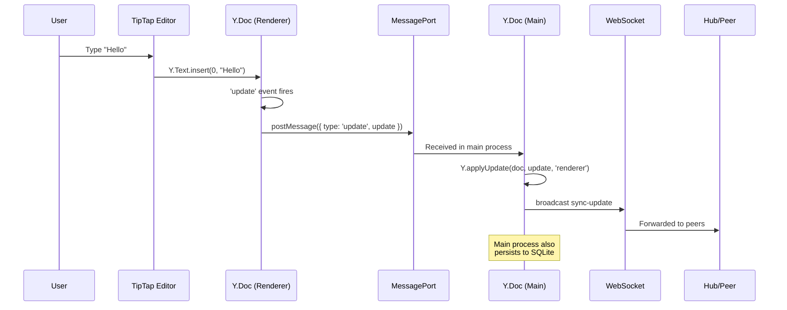
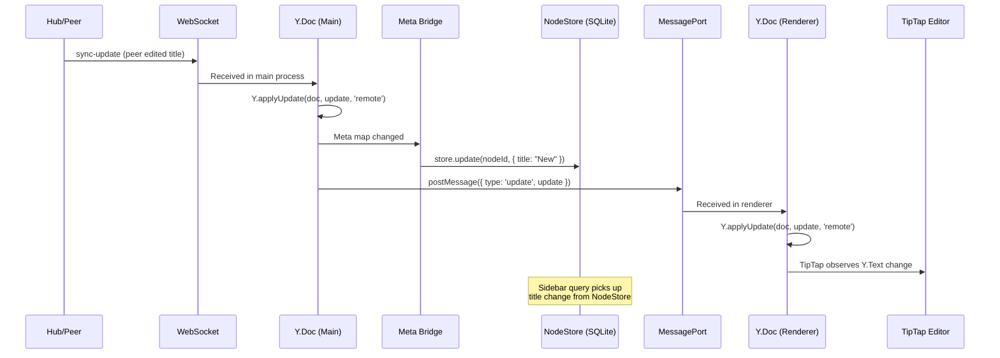

# 08: Desktop Main Process

> Move BSM to Electron main process for always-on background sync

**Dependencies:** `05-sync-manager.md`, `06-usenode-integration.md`, `07-offline-queue.md`
**Modifies:** `apps/electron/src/main/`, `apps/electron/src/preload/`, `apps/electron/src/renderer/`

## Overview

On desktop, the BSM should run in the Electron **main process** — not the renderer. This provides true always-on sync: the BSM survives renderer crashes, page reloads, and can keep syncing even when all windows are closed (future dock/tray mode).

The renderer communicates with the main-process BSM via IPC to acquire/release Y.Docs, with binary Y.Doc updates flowing through `MessagePort` channels for zero-copy performance.



## IPC Protocol Design

### Channel Registry

New IPC channels following the existing `xnet:` namespace convention:

| Channel                  | Direction       | Payload                       | Response                                        |
| ------------------------ | --------------- | ----------------------------- | ----------------------------------------------- |
| `xnet:bsm:start`         | renderer → main | `{ signalingUrl, authorDID }` | `void`                                          |
| `xnet:bsm:stop`          | renderer → main | —                             | `void`                                          |
| `xnet:bsm:acquire`       | renderer → main | `{ nodeId, schemaId }`        | `{ port: MessagePort }`                         |
| `xnet:bsm:release`       | renderer → main | `{ nodeId }`                  | `void`                                          |
| `xnet:bsm:track`         | renderer → main | `{ nodeId, schemaId }`        | `void`                                          |
| `xnet:bsm:untrack`       | renderer → main | `{ nodeId }`                  | `void`                                          |
| `xnet:bsm:status`        | renderer → main | —                             | `{ status, poolSize, trackedCount, queueSize }` |
| `xnet:bsm:status-change` | main → renderer | `{ status }`                  | —                                               |

### MessagePort for Y.Doc Updates

IPC is fine for control messages (acquire, release, track) but too slow for streaming Y.Doc updates. We use Electron's `MessagePort` API (transferable, binary-friendly) for the data channel:



## Implementation

### 1. Main Process: BSM Service (`apps/electron/src/main/bsm.ts`)

```typescript
// apps/electron/src/main/bsm.ts

import { ipcMain, MessageChannelMain } from 'electron'
import * as Y from 'yjs'
import { createSyncManager, type SyncManager } from '@xnetjs/react/sync'
import type { SQLiteAdapter } from './storage'

interface BSMServiceConfig {
  storage: SQLiteAdapter
  getMainWindow: () => Electron.BrowserWindow | null
}

export function setupBSM(config: BSMServiceConfig) {
  let syncManager: SyncManager | null = null

  // Map of nodeId → active MessagePort pairs
  const activePorts = new Map<string, Electron.MessagePortMain>()
  // Map of nodeId → Y.Doc update listener cleanup
  const docListeners = new Map<string, () => void>()

  ipcMain.handle(
    'xnet:bsm:start',
    async (
      _event,
      opts: {
        signalingUrl: string
        authorDID?: string
      }
    ) => {
      if (syncManager) return // Already running

      syncManager = createSyncManager({
        nodeStore: config.storage.asNodeStore(),
        storage: config.storage.asNodeStorageAdapter(),
        signalingUrl: opts.signalingUrl,
        authorDID: opts.authorDID
      })

      syncManager.on('status', (status) => {
        const win = config.getMainWindow()
        if (win && !win.isDestroyed()) {
          win.webContents.send('xnet:bsm:status-change', { status })
        }
      })

      await syncManager.start()
    }
  )

  ipcMain.handle('xnet:bsm:stop', async () => {
    if (!syncManager) return

    // Close all active ports
    for (const [nodeId, port] of activePorts) {
      port.close()
      const cleanup = docListeners.get(nodeId)
      if (cleanup) cleanup()
    }
    activePorts.clear()
    docListeners.clear()

    await syncManager.stop()
    syncManager = null
  })

  ipcMain.handle(
    'xnet:bsm:acquire',
    async (
      event,
      opts: {
        nodeId: string
        schemaId: string
      }
    ) => {
      if (!syncManager) throw new Error('BSM not started')

      const { nodeId, schemaId } = opts

      // Track the node
      syncManager.track(nodeId, schemaId)

      // Acquire Y.Doc from pool
      const doc = await syncManager.acquire(nodeId)

      // Create a MessageChannel for binary Y.Doc updates
      const { port1, port2 } = new MessageChannelMain()

      // Send full initial state to renderer
      const initialState = Y.encodeStateAsUpdate(doc)
      port1.postMessage({ type: 'init', update: initialState }, [initialState.buffer])

      // Forward remote updates from main→renderer
      const updateHandler = (update: Uint8Array, origin: unknown) => {
        if (origin === 'renderer') return // Don't echo back
        port1.postMessage({ type: 'update', update }, [update.buffer])
      }
      doc.on('update', updateHandler)
      docListeners.set(nodeId, () => doc.off('update', updateHandler))

      // Receive local updates from renderer→main
      port1.on('message', (event) => {
        const { type, update } = event.data
        if (type === 'update' && update) {
          Y.applyUpdate(doc, new Uint8Array(update), 'renderer')
        }
      })
      port1.start()

      activePorts.set(nodeId, port1)

      // Transfer port2 to the renderer
      event.sender.postMessage('xnet:bsm:port', { nodeId }, [port2])
    }
  )

  ipcMain.handle('xnet:bsm:release', async (_event, opts: { nodeId: string }) => {
    if (!syncManager) return

    const { nodeId } = opts

    // Close the MessagePort
    const port = activePorts.get(nodeId)
    if (port) {
      port.close()
      activePorts.delete(nodeId)
    }

    // Remove doc listener
    const cleanup = docListeners.get(nodeId)
    if (cleanup) {
      cleanup()
      docListeners.delete(nodeId)
    }

    // Release back to pool (stays warm)
    syncManager.release(nodeId)
  })

  ipcMain.handle(
    'xnet:bsm:track',
    async (
      _event,
      opts: {
        nodeId: string
        schemaId: string
      }
    ) => {
      if (!syncManager) return
      syncManager.track(opts.nodeId, opts.schemaId)
    }
  )

  ipcMain.handle('xnet:bsm:untrack', async (_event, opts: { nodeId: string }) => {
    if (!syncManager) return
    syncManager.untrack(opts.nodeId)
  })

  ipcMain.handle('xnet:bsm:status', async () => {
    if (!syncManager) return { status: 'stopped', poolSize: 0, trackedCount: 0, queueSize: 0 }
    return {
      status: syncManager.status,
      poolSize: syncManager.poolSize,
      trackedCount: syncManager.trackedCount,
      queueSize: 0 // TODO: expose from offline queue
    }
  })

  return {
    stop: async () => {
      if (syncManager) {
        await syncManager.stop()
        syncManager = null
      }
    }
  }
}
```

### 2. Wire into Main Entry (`apps/electron/src/main/index.ts`)

```typescript
// In apps/electron/src/main/index.ts, add after setupIPC():

import { setupBSM } from './bsm'

// In app.whenReady():
const bsm = setupBSM({
  storage: sqliteAdapter, // existing SQLiteAdapter instance
  getMainWindow: () => mainWindow
})

// In app quit handler:
app.on('before-quit', async () => {
  await bsm.stop()
})
```

### 3. Preload: Expose BSM Bridge (`apps/electron/src/preload/index.ts`)

```typescript
// Add to preload/index.ts

// BSM port receiver (main sends MessagePort via postMessage)
const bsmPorts = new Map<string, MessagePort>()
const bsmPortListeners = new Map<string, Set<(port: MessagePort) => void>>()

ipcRenderer.on('xnet:bsm:port', (event, { nodeId }) => {
  const [port] = event.ports
  bsmPorts.set(nodeId, port)

  // Notify any waiting listeners
  const listeners = bsmPortListeners.get(nodeId)
  if (listeners) {
    for (const cb of listeners) cb(port)
    bsmPortListeners.delete(nodeId)
  }
})

contextBridge.exposeInMainWorld('xnetBSM', {
  start: (opts: { signalingUrl: string; authorDID?: string }) =>
    ipcRenderer.invoke('xnet:bsm:start', opts),
  stop: () => ipcRenderer.invoke('xnet:bsm:stop'),
  acquire: (nodeId: string, schemaId: string): Promise<MessagePort> => {
    return new Promise(async (resolve) => {
      // Register listener for incoming port BEFORE invoking
      const listeners = bsmPortListeners.get(nodeId) ?? new Set()
      listeners.add(resolve)
      bsmPortListeners.set(nodeId, listeners)

      await ipcRenderer.invoke('xnet:bsm:acquire', { nodeId, schemaId })
    })
  },
  release: (nodeId: string) => ipcRenderer.invoke('xnet:bsm:release', { nodeId }),
  track: (nodeId: string, schemaId: string) =>
    ipcRenderer.invoke('xnet:bsm:track', { nodeId, schemaId }),
  untrack: (nodeId: string) => ipcRenderer.invoke('xnet:bsm:untrack', { nodeId }),
  getStatus: () => ipcRenderer.invoke('xnet:bsm:status'),
  onStatusChange: (callback: (status: string) => void) => {
    const handler = (_: unknown, data: { status: string }) => callback(data.status)
    ipcRenderer.on('xnet:bsm:status-change', handler)
    return () => ipcRenderer.removeListener('xnet:bsm:status-change', handler)
  }
})
```

### 4. Renderer: BSM-Aware SyncManager Adapter

The renderer needs a `SyncManager`-compatible adapter that routes through IPC instead of managing its own connections:

```typescript
// apps/electron/src/renderer/lib/ipc-sync-manager.ts

import * as Y from 'yjs'

interface IPCSyncManager {
  acquire(nodeId: string, schemaId: string): Promise<{ doc: Y.Doc; cleanup: () => void }>
  release(nodeId: string): void
  track(nodeId: string, schemaId: string): void
  untrack(nodeId: string): void
  status: string
  start(opts: { signalingUrl: string; authorDID?: string }): Promise<void>
  stop(): Promise<void>
}

export function createIPCSyncManager(): IPCSyncManager {
  const docs = new Map<string, Y.Doc>()
  let currentStatus = 'stopped'

  // Listen for status changes
  window.xnetBSM.onStatusChange((status) => {
    currentStatus = status
  })

  return {
    async start(opts) {
      await window.xnetBSM.start(opts)
      currentStatus = 'connecting'
    },

    async stop() {
      await window.xnetBSM.stop()
      currentStatus = 'stopped'
    },

    async acquire(nodeId, schemaId) {
      // Get MessagePort from main process
      const port = await window.xnetBSM.acquire(nodeId, schemaId)

      // Create a renderer-side Y.Doc that mirrors the main-process doc
      const doc = new Y.Doc({ guid: nodeId })
      docs.set(nodeId, doc)

      // Handle messages from main process
      port.onmessage = (event) => {
        const { type, update } = event.data
        if (type === 'init' || type === 'update') {
          Y.applyUpdate(doc, new Uint8Array(update), 'remote')
        }
      }
      port.start()

      // Forward local edits to main process
      const updateHandler = (update: Uint8Array, origin: unknown) => {
        if (origin === 'remote') return // Don't echo back
        port.postMessage({ type: 'update', update }, [update.buffer])
      }
      doc.on('update', updateHandler)

      const cleanup = () => {
        doc.off('update', updateHandler)
        port.close()
      }

      return { doc, cleanup }
    },

    release(nodeId) {
      const doc = docs.get(nodeId)
      if (doc) {
        docs.delete(nodeId)
        // Don't destroy — main process keeps it alive
      }
      window.xnetBSM.release(nodeId)
    },

    track(nodeId, schemaId) {
      window.xnetBSM.track(nodeId, schemaId)
    },

    untrack(nodeId) {
      window.xnetBSM.untrack(nodeId)
    },

    get status() {
      return currentStatus
    }
  }
}
```

### 5. Integrate with useNode

When running in Electron, `useNode` detects the IPC sync manager (via context) and uses it instead of creating a direct WebSocket connection:

```typescript
// In XNetProvider (renderer):
const syncManager = useMemo(() => {
  if (window.xnetBSM) {
    // Desktop: use IPC-based sync manager (BSM in main process)
    return createIPCSyncManager()
  }
  // Web: use in-process sync manager (existing behavior)
  return createSyncManager({ ... })
}, [])
```

## Data Flow: Local Edit Round-Trip



## Data Flow: Remote Update



## Lifecycle & Edge Cases

### Renderer Crash/Reload

When the renderer crashes or the user reloads:

1. All `MessagePort` connections are severed
2. Main process detects port closure, marks those docs as "no active renderer"
3. Docs stay warm in pool, keep syncing
4. On renderer restart, `useNode` re-acquires — gets current state instantly

### Window Close (Future Tray Mode)

When all windows close but the app stays in dock:

1. BSM continues running in main process
2. WebSocket stays connected
3. Docs keep syncing
4. On window re-open, state is immediately available

### App Quit

On `before-quit`:

1. BSM flushes all dirty docs to SQLite
2. Offline queue is persisted
3. WebSocket gracefully disconnected
4. On next launch, BSM resumes from persisted state

## Storage: SQLite as BSM Backend

The main process already has a `SQLiteAdapter`. The BSM uses it for:

| Data            | Table              | Format                                     |
| --------------- | ------------------ | ------------------------------------------ |
| Y.Doc snapshots | `documents`        | Full `Y.encodeStateAsUpdate()` BLOB        |
| Tracked set     | New: `bsm_tracked` | `nodeId, schemaId, lastOpened, lastSynced` |
| Offline queue   | New: `bsm_queue`   | `nodeId, update (BLOB), queuedAt`          |

```sql
-- New tables for BSM
CREATE TABLE IF NOT EXISTS bsm_tracked (
  node_id TEXT PRIMARY KEY,
  schema_id TEXT NOT NULL,
  last_opened INTEGER NOT NULL,
  last_synced INTEGER DEFAULT 0,
  pinned INTEGER DEFAULT 0
);

CREATE TABLE IF NOT EXISTS bsm_queue (
  id INTEGER PRIMARY KEY AUTOINCREMENT,
  node_id TEXT NOT NULL,
  update BLOB NOT NULL,
  queued_at INTEGER NOT NULL
);
CREATE INDEX idx_bsm_queue_node ON bsm_queue(node_id);
```

## Type Declarations

```typescript
// apps/electron/src/renderer/lib/types.ts (additions)

interface XNetBSMAPI {
  start(opts: { signalingUrl: string; authorDID?: string }): Promise<void>
  stop(): Promise<void>
  acquire(nodeId: string, schemaId: string): Promise<MessagePort>
  release(nodeId: string): Promise<void>
  track(nodeId: string, schemaId: string): Promise<void>
  untrack(nodeId: string): Promise<void>
  getStatus(): Promise<{
    status: string
    poolSize: number
    trackedCount: number
    queueSize: number
  }>
  onStatusChange(callback: (status: string) => void): () => void
}

declare global {
  interface Window {
    xnetBSM: XNetBSMAPI
  }
}
```

## Checklist

- [ ] Create `apps/electron/src/main/bsm.ts` with IPC handlers
- [ ] Add BSM SQLite tables (`bsm_tracked`, `bsm_queue`) to `SQLiteAdapter`
- [ ] Wire `setupBSM()` into `apps/electron/src/main/index.ts`
- [ ] Add BSM preload bridge to `apps/electron/src/preload/index.ts`
- [ ] Create `apps/electron/src/renderer/lib/ipc-sync-manager.ts`
- [ ] Add `XNetBSMAPI` type declarations
- [ ] Integrate IPC sync manager into renderer's `XNetProvider`
- [ ] Handle renderer crash (port closure detection in main)
- [ ] Handle app quit (flush + persist)
- [ ] Integration test: edit in renderer, verify sync via main process WebSocket

---

[← Previous: Offline Queue](./07-offline-queue.md)
