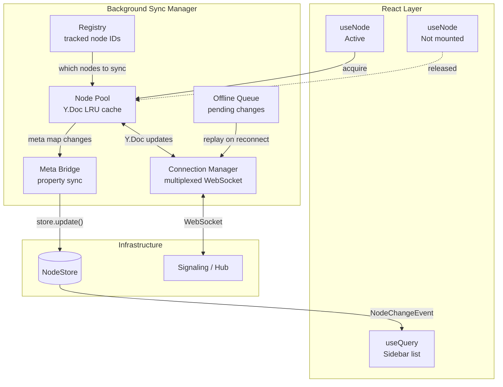
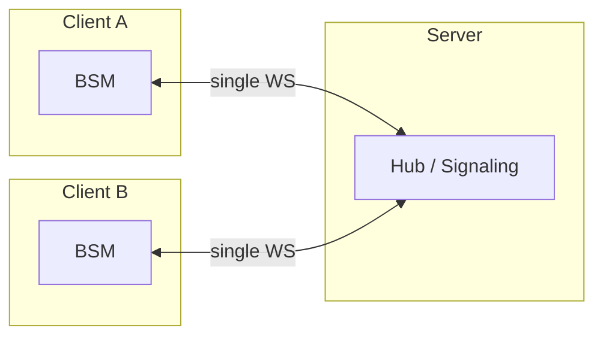

# xNet Implementation Plan - Step 03.3.1: Background Sync Manager

> Client-side sync orchestrator that keeps Nodes synced independently of UI component lifecycle

## Executive Summary

Currently, sync is component-scoped: `useNode` creates a WebSocket provider per open Node, and destroys it on unmount. This means property changes (titles, etc.) from peers only reach the local store while the Node is actively rendered.

The Background Sync Manager (BSM) decouples sync lifetime from React component lifetime. It owns a pool of Y.Doc instances, manages a single multiplexed WebSocket connection, and bridges remote meta changes to the NodeStore — even for Nodes not currently viewed.

```typescript
// Before: sync dies when component unmounts
const { doc } = useNode(PageSchema, docId) // creates provider, destroys on unmount

// After: sync continues in background
const { doc } = useNode(PageSchema, docId) // borrows from BSM pool, releases on unmount
```

## Design Principles

| Principle                | Implementation                                                                  |
| ------------------------ | ------------------------------------------------------------------------------- |
| **Node is unit of sync** | BSM tracks Nodes, not Y.Docs. A Node's sync state = properties + optional Y.Doc |
| **Borrow, don't own**    | React components borrow Y.Docs from the pool; BSM owns lifecycle                |
| **Single connection**    | One multiplexed WebSocket for all tracked Nodes (not N connections)             |
| **Priority-based**       | Active > Hot > Warm > Cold. Bandwidth allocated by priority tier                |
| **Platform-aware**       | Desktop: main process always-on. Mobile: foreground + wake. Web: tab lifetime   |

## Architecture



## Implementation Steps

| Step | File                                                       | Description                                     | Effort | Status  |
| ---- | ---------------------------------------------------------- | ----------------------------------------------- | ------ | ------- |
| 1    | [01-meta-bridge.md](./01-meta-bridge.md)                   | Extract meta sync into reusable utility         | 1 day  | ✅ Done |
| 2    | [02-node-pool.md](./02-node-pool.md)                       | LRU Y.Doc pool with acquire/release semantics   | 2 days | ✅ Done |
| 3    | [03-registry.md](./03-registry.md)                         | Tracked Node set with persistence               | 1 day  | ✅ Done |
| 4    | [04-connection-manager.md](./04-connection-manager.md)     | Multiplexed WebSocket with multi-room subscribe | 2 days | ✅ Done |
| 5    | [05-sync-manager.md](./05-sync-manager.md)                 | Orchestrator tying pool + registry + connection | 2 days | ✅ Done |
| 6    | [06-usenode-integration.md](./06-usenode-integration.md)   | Modify `useNode` to borrow from BSM             | 1 day  | ✅ Done |
| 7    | [07-offline-queue.md](./07-offline-queue.md)               | Persistent queue for offline changes            | 2 days | ✅ Done |
| 8    | [08-desktop-main-process.md](./08-desktop-main-process.md) | Move BSM to Electron main process               | 2 days | ✅ Done |

**Total: ~2 weeks** | **All steps complete**

## Dependencies

- `plan03_2Signaling` — BSM uses the signaling protocol (multi-room subscribe)
- `plan02_2UnifiedNodeDocument` — `useNode` hook that BSM modifies

## Dependents

- `plan03_8HubPhase1VPS` — Hub client integration layers on BSM's ConnectionManager (auth, backup, search, node sync)

## What This Enables

| Before (current)                            | After (with BSM)                                    |
| ------------------------------------------- | --------------------------------------------------- |
| Sidebar shows stale titles for shared Nodes | Titles update in real-time even when Node is closed |
| Opening a shared Node requires full sync    | Node pre-synced in background, instant open         |
| Closing a Node may lose unsynced changes    | Offline queue persists changes across sessions      |
| N WebSocket connections for N open Nodes    | 1 multiplexed connection for all tracked Nodes      |
| No awareness for non-viewed Nodes           | Can show "X is editing Y" in sidebar                |

## Package Location

New code lives in `packages/react/src/sync/` (extends existing sync infrastructure):

```
packages/react/src/sync/
  WebSocketSyncProvider.ts   # existing - per-Node provider
  meta-bridge.ts             # NEW - extracted meta sync utility
  node-pool.ts               # NEW - LRU Y.Doc pool
  registry.ts                # NEW - tracked Node set
  connection-manager.ts      # NEW - multiplexed WebSocket
  sync-manager.ts            # NEW - orchestrator
  offline-queue.ts           # NEW - persistent change queue
```

## Relationship to Hub

The BSM and Hub are complementary. The BSM is the **client-side** orchestrator; the Hub is the **server-side** always-on peer. The BSM connects to the Hub (or signaling server) as its sync target.



Without a hub, the BSM syncs P2P via the signaling server (peers must be online simultaneously). With a hub, the BSM syncs through it for offline-resilient operation.

### Hub Features Layer on Top of BSM

When `hubUrl` is configured, the Hub's client features (auth, backup, search, node sync) attach to the BSM's `ConnectionManager` — they don't create a separate connection. See [Hub Client Integration](../plan03_8HubPhase1VPS/08-client-integration.md#integration-with-background-sync-manager-bsm) for the unified architecture.

| BSM Component       | Without Hub                  | With Hub                                    |
| ------------------- | ---------------------------- | ------------------------------------------- |
| `ConnectionManager` | Connects to signaling server | Connects to hub (same protocol + UCAN auth) |
| `NodePool`          | Local acquire/release        | Also triggers hub Yjs sync                  |
| `OfflineQueue`      | Publishes to signaling rooms | Same — hub persists for offline peers       |
| `MetaBridge`        | Updates NodeStore            | Also sends `index-update` for hub search    |

The BSM is **hub-ready by design**: building it first against the signaling server means zero refactoring when the hub replaces it.

---

[Exploration: Background Sync Manager](../explorations/0024_BACKGROUND_SYNC_MANAGER.md)
