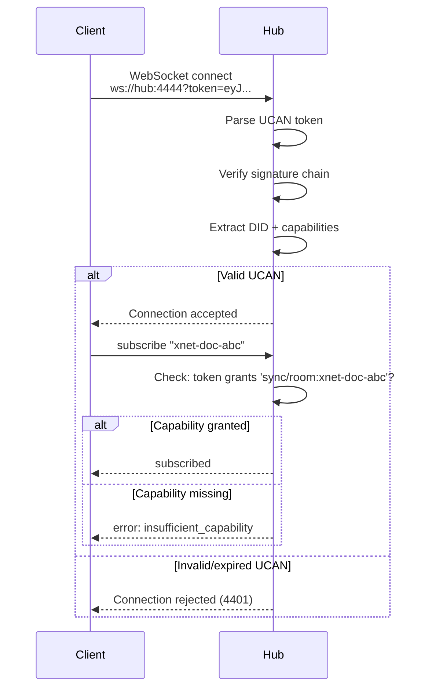

# 02: UCAN WebSocket Auth

> Authenticate WebSocket connections and gate room subscriptions with UCAN tokens

**Duration:** 1-2 days  
**Dependencies:** `@xnetjs/identity` (UCAN verification), Step 01 (envelope types)

## Overview

WebSocket connections to the hub must present a valid UCAN token. Room subscriptions are checked against the token's capabilities. This prevents unauthorized peers from joining rooms entirely — the first line of defense before envelope verification.



## UCAN Capabilities for Sync

```typescript
// Hub-specific UCAN capability types

interface SyncCapability {
  /** The resource being accessed */
  with: string // 'sync/room:<roomId>' or 'sync/room:*'

  /** What the holder can do */
  can: 'sync/read' | 'sync/write' | 'sync/admin'
}

// Examples:
// Read-only access to a specific doc:
{ with: 'sync/room:xnet-doc-abc', can: 'sync/read' }

// Read+write to all docs (owner):
{ with: 'sync/room:*', can: 'sync/write' }

// Admin (can evict peers, force-persist):
{ with: 'sync/room:*', can: 'sync/admin' }
```

## Implementation

### Client-Side: Token on Connect

```typescript
// packages/react/src/sync/WebSocketSyncProvider.ts — changes

interface SyncProviderOptions {
  // ... existing
  /** UCAN token for hub authentication */
  ucanToken?: string
}

private _connect() {
  const url = new URL(this.url)

  // Attach UCAN token as query param
  if (this.ucanToken) {
    url.searchParams.set('token', this.ucanToken)
  }

  this.ws = new WebSocket(url.toString())
  this.ws.binaryType = 'arraybuffer'

  this.ws.onclose = (event) => {
    if (event.code === 4401) {
      console.error('Hub rejected connection: invalid UCAN token')
      this._emit('auth-error', { code: 4401, reason: event.reason })
      return // Don't reconnect on auth failure
    }
    this._scheduleReconnect()
  }
}
```

### Hub-Side: Connection Authentication

```typescript
// packages/hub/src/auth/ws-auth.ts

import { verifyUCAN, type UCAN } from '@xnetjs/identity'

export interface AuthenticatedConnection {
  did: DID
  capabilities: SyncCapability[]
  token: UCAN
}

export async function authenticateWebSocket(
  request: IncomingMessage,
  config: { anonymousMode: boolean }
): Promise<AuthenticatedConnection | null> {
  const url = new URL(request.url!, `http://${request.headers.host}`)
  const token = url.searchParams.get('token')

  if (!token) {
    if (config.anonymousMode) {
      // Anonymous mode: allow without auth, grant wildcard
      return {
        did: 'did:key:anonymous' as DID,
        capabilities: [{ with: 'sync/room:*', can: 'sync/write' }],
        token: null as any
      }
    }
    return null // Reject
  }

  try {
    const ucan = await verifyUCAN(token)
    const capabilities = extractSyncCapabilities(ucan)

    return {
      did: ucan.payload.iss,
      capabilities,
      token: ucan
    }
  } catch (err) {
    return null // Invalid token
  }
}

function extractSyncCapabilities(ucan: UCAN): SyncCapability[] {
  return (ucan.payload.att ?? [])
    .filter((att: any) => att.with?.startsWith('sync/'))
    .map((att: any) => ({
      with: att.with,
      can: att.can
    }))
}
```

### Hub-Side: Room Subscription Check

```typescript
// packages/hub/src/auth/capability-check.ts

export function canAccessRoom(
  auth: AuthenticatedConnection,
  room: string,
  action: 'sync/read' | 'sync/write'
): boolean {
  return auth.capabilities.some((cap) => {
    // Check resource match
    const resourceMatch = cap.with === `sync/room:${room}` || cap.with === 'sync/room:*'

    // Check action hierarchy: admin > write > read
    const actionMatch =
      cap.can === 'sync/admin' ||
      cap.can === action ||
      (cap.can === 'sync/write' && action === 'sync/read')

    return resourceMatch && actionMatch
  })
}
```

### Hub-Side: WebSocket Upgrade Handler

```typescript
// packages/hub/src/server.ts — WebSocket upgrade

wss.on('connection', async (ws, request) => {
  const auth = await authenticateWebSocket(request, this.config)

  if (!auth) {
    ws.close(4401, 'Invalid or missing UCAN token')
    return
  }

  // Store auth context on the connection
  (ws as any).__auth = auth

  ws.on('message', (data) => {
    const msg = decode(data)
    this.handleMessage(ws, msg, auth)
  })
})

handleMessage(ws: WebSocket, msg: any, auth: AuthenticatedConnection) {
  switch (msg.type) {
    case 'subscribe': {
      if (!canAccessRoom(auth, msg.room, 'sync/read')) {
        ws.send(encode({
          type: 'error',
          error: 'insufficient_capability',
          room: msg.room,
        }))
        return
      }
      this.signaling.subscribe(ws, msg.room)
      break
    }

    case 'sync-update': {
      if (!canAccessRoom(auth, msg.room, 'sync/write')) {
        ws.send(encode({
          type: 'error',
          error: 'insufficient_capability',
          room: msg.room,
        }))
        return
      }
      this.relay.handleSyncUpdate(ws, msg)
      break
    }
  }
}
```

## Configuration

```typescript
interface HubAuthConfig {
  /** Allow connections without UCAN (for local dev) */
  anonymousMode: boolean // default: false in production

  /** UCAN audience DID (this hub's identity) */
  hubDID?: DID

  /** Token expiry tolerance in seconds */
  clockSkewSeconds?: number // default: 60
}
```

## Error Codes

| WebSocket Close Code | Meaning                   | Client Action      |
| -------------------- | ------------------------- | ------------------ |
| 4401                 | Invalid/missing UCAN      | Re-authenticate    |
| 4403                 | Insufficient capabilities | Request new token  |
| Normal (1000)        | Clean disconnect          | Reconnect normally |

## Testing

```typescript
describe('authenticateWebSocket', () => {
  it('accepts valid UCAN token', async () => {
    const token = await mintUCAN({ ... })
    const auth = await authenticateWebSocket(
      mockRequest(`ws://hub?token=${token}`),
      { anonymousMode: false }
    )
    expect(auth).not.toBeNull()
    expect(auth!.did).toBe(issuerDID)
  })

  it('rejects missing token (non-anonymous)', async () => {
    const auth = await authenticateWebSocket(
      mockRequest('ws://hub'),
      { anonymousMode: false }
    )
    expect(auth).toBeNull()
  })

  it('allows missing token in anonymous mode', async () => {
    const auth = await authenticateWebSocket(
      mockRequest('ws://hub'),
      { anonymousMode: true }
    )
    expect(auth).not.toBeNull()
    expect(auth!.capabilities[0].with).toBe('sync/room:*')
  })

  it('rejects expired UCAN', async () => {
    const token = await mintUCAN({ exp: Math.floor(Date.now() / 1000) - 3600 })
    const auth = await authenticateWebSocket(
      mockRequest(`ws://hub?token=${token}`),
      { anonymousMode: false }
    )
    expect(auth).toBeNull()
  })
})

describe('canAccessRoom', () => {
  it('grants access with exact room match', () => {
    const auth = mockAuth([{ with: 'sync/room:doc-123', can: 'sync/write' }])
    expect(canAccessRoom(auth, 'doc-123', 'sync/write')).toBe(true)
  })

  it('grants access with wildcard', () => {
    const auth = mockAuth([{ with: 'sync/room:*', can: 'sync/write' }])
    expect(canAccessRoom(auth, 'any-room', 'sync/write')).toBe(true)
  })

  it('denies read-only user from writing', () => {
    const auth = mockAuth([{ with: 'sync/room:doc-123', can: 'sync/read' }])
    expect(canAccessRoom(auth, 'doc-123', 'sync/write')).toBe(false)
  })

  it('denies access to unscoped room', () => {
    const auth = mockAuth([{ with: 'sync/room:doc-456', can: 'sync/write' }])
    expect(canAccessRoom(auth, 'doc-123', 'sync/write')).toBe(false)
  })

  it('admin can do everything', () => {
    const auth = mockAuth([{ with: 'sync/room:*', can: 'sync/admin' }])
    expect(canAccessRoom(auth, 'any', 'sync/read')).toBe(true)
    expect(canAccessRoom(auth, 'any', 'sync/write')).toBe(true)
  })
})
```

## Validation Gate

- [ ] WebSocket connections without UCAN rejected with close code 4401
- [ ] Valid UCAN grants connection with extracted capabilities
- [ ] Room subscriptions checked against token capabilities
- [ ] `sync/write` required for `sync-update` messages
- [ ] `sync/read` sufficient for subscribe-only
- [ ] Anonymous mode allows all operations without token
- [ ] Expired tokens rejected
- [ ] Client `WebSocketSyncProvider` attaches token and handles 4401
