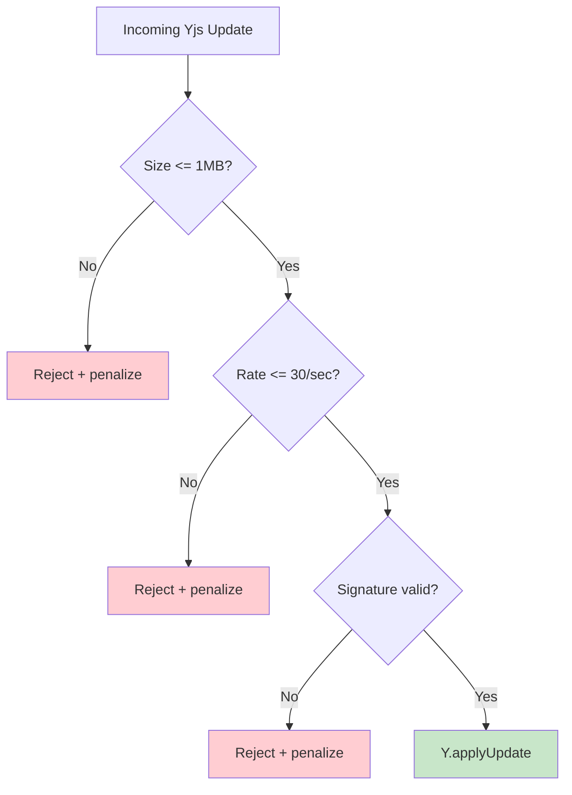

# 03: Update Size Limits

> Prevent DoS via oversized or high-frequency Yjs updates

**Duration:** 1-2 days  
**Dependencies:** Step 01 (envelope verification)

## Overview

Legitimate Yjs edits are small (typically <10KB per keystroke batch). An attacker can send valid Yjs-formatted updates of arbitrary size, blocking the event loop on `Y.applyUpdate()` which is synchronous. This step adds size limits and rate limiting at both the client and hub, plus chunking for legitimate large syncs.



## Constants

```typescript
// packages/sync/src/yjs-limits.ts

/** Maximum size of a single Yjs update (1MB) */
export const MAX_YJS_UPDATE_SIZE = 1_048_576

/** Maximum updates per second per connection */
export const MAX_YJS_UPDATES_PER_SECOND = 30

/** Maximum document size (full state, 50MB) */
export const MAX_YJS_DOC_SIZE = 52_428_800

/** Chunk size for large initial syncs (256KB) */
export const YJS_SYNC_CHUNK_SIZE = 262_144
```

## Implementation

### Hub-Side Rate Limiter

```typescript
// packages/hub/src/middleware/yjs-rate-limiter.ts

interface RateLimiterConfig {
  maxPerSecond: number
  maxPerMinute: number
  burstAllowance: number // short burst above maxPerSecond
}

export class YjsRateLimiter {
  private windows = new Map<string, { count: number; resetAt: number }>()
  private minuteWindows = new Map<string, { count: number; resetAt: number }>()

  constructor(
    private config: RateLimiterConfig = {
      maxPerSecond: 30,
      maxPerMinute: 600,
      burstAllowance: 10
    }
  ) {}

  /**
   * Check if this peer can send another update.
   * Returns true if allowed, false if rate-limited.
   */
  allow(peerId: string): boolean {
    const now = Date.now()

    // Per-second window
    const sec = this.windows.get(peerId)
    if (!sec || now >= sec.resetAt) {
      this.windows.set(peerId, { count: 1, resetAt: now + 1000 })
    } else {
      sec.count++
      if (sec.count > this.config.maxPerSecond + this.config.burstAllowance) {
        return false
      }
    }

    // Per-minute window (sustained rate)
    const min = this.minuteWindows.get(peerId)
    if (!min || now >= min.resetAt) {
      this.minuteWindows.set(peerId, { count: 1, resetAt: now + 60_000 })
    } else {
      min.count++
      if (min.count > this.config.maxPerMinute) {
        return false
      }
    }

    return true
  }

  /** Reset state for a disconnected peer */
  remove(peerId: string): void {
    this.windows.delete(peerId)
    this.minuteWindows.delete(peerId)
  }
}
```

### Hub-Side Size Check

```typescript
// In YjsSecurityService.verifyIncoming() (from step 01):

async verifyIncoming(msg: SyncUpdateMessage, peerId: string): Promise<VerifyResult> {
  const update = 'envelope' in msg ? msg.envelope.update : msg.data

  // 1. Size check (fast path, before any crypto)
  if (update.length > this.config.maxUpdateSize) {
    return { ok: false, rejectReason: 'update_too_large' }
  }

  // 2. Rate limit check
  if (!this.rateLimiter.allow(peerId)) {
    return { ok: false, rejectReason: 'rate_exceeded' }
  }

  // 3. Signature verification (from step 01)
  // ...
}
```

### Client-Side Size Check

```typescript
// packages/react/src/sync/WebSocketSyncProvider.ts

import { MAX_YJS_UPDATE_SIZE, YJS_SYNC_CHUNK_SIZE } from '@xnetjs/sync'

private async _handleLocalUpdate(update: Uint8Array) {
  if (!this.ws || this.ws.readyState !== WebSocket.OPEN) return

  if (update.length > MAX_YJS_UPDATE_SIZE) {
    // Large update: chunk it (typically only happens on initial sync)
    await this._sendChunked(update)
    return
  }

  // Normal path: sign and send (from step 01)
  // ...
}
```

### Chunked Sync for Large Documents

Large initial syncs (sync-step2 responses) can exceed 1MB for documents with significant history. These are chunked:

```typescript
// packages/react/src/sync/WebSocketSyncProvider.ts

private async _sendChunked(fullUpdate: Uint8Array) {
  const totalChunks = Math.ceil(fullUpdate.length / YJS_SYNC_CHUNK_SIZE)

  for (let i = 0; i < totalChunks; i++) {
    const start = i * YJS_SYNC_CHUNK_SIZE
    const end = Math.min(start + YJS_SYNC_CHUNK_SIZE, fullUpdate.length)
    const chunk = fullUpdate.slice(start, end)

    const envelope = this.identity
      ? await signYjsUpdate(chunk, this.identity.did, this.identity.privateKey, this.doc.clientID)
      : undefined

    this.ws!.send(encodeMessage({
      type: 'sync-chunk',
      room: this.room,
      envelope,
      data: this.identity ? undefined : chunk,
      chunkIndex: i,
      totalChunks,
      // Receiver reassembles and applies as single update
    }))

    // Small delay between chunks to avoid flooding
    if (i < totalChunks - 1) {
      await new Promise(r => setTimeout(r, 10))
    }
  }
}
```

### Hub-Side Chunk Reassembly

```typescript
// packages/hub/src/services/relay.ts

private pendingChunks = new Map<string, {
  chunks: (Uint8Array | null)[]
  totalChunks: number
  receivedAt: number
}>()

handleSyncChunk(ws: WebSocket, msg: SyncChunkMessage, auth: AuthenticatedConnection) {
  const key = `${auth.did}:${msg.room}`
  let pending = this.pendingChunks.get(key)

  if (!pending || pending.totalChunks !== msg.totalChunks) {
    pending = {
      chunks: new Array(msg.totalChunks).fill(null),
      totalChunks: msg.totalChunks,
      receivedAt: Date.now(),
    }
    this.pendingChunks.set(key, pending)
  }

  // Verify individual chunk signature if present
  if (msg.envelope) {
    const result = await verifyYjsEnvelope(msg.envelope)
    if (!result.valid) {
      this.pendingChunks.delete(key)
      this.peerScorer.penalize(ws, result.reason!)
      return
    }
    pending.chunks[msg.chunkIndex] = msg.envelope.update
  } else {
    pending.chunks[msg.chunkIndex] = msg.data
  }

  // Check if all chunks received
  if (pending.chunks.every(c => c !== null)) {
    // Reassemble
    const totalSize = pending.chunks.reduce((sum, c) => sum + c!.length, 0)
    if (totalSize > MAX_YJS_DOC_SIZE) {
      this.pendingChunks.delete(key)
      this.peerScorer.penalize(ws, 'reassembled_too_large')
      return
    }

    const fullUpdate = concatUint8Arrays(pending.chunks as Uint8Array[])
    this.pendingChunks.delete(key)

    // Apply as single update
    const doc = await this.pool.getOrLoad(msg.room)
    Y.applyUpdate(doc, fullUpdate, auth.did)
    this.pool.markDirty(msg.room)
  }
}

// Cleanup stale pending chunks (TTL: 30 seconds)
private _cleanupPendingChunks() {
  const now = Date.now()
  for (const [key, pending] of this.pendingChunks) {
    if (now - pending.receivedAt > 30_000) {
      this.pendingChunks.delete(key)
    }
  }
}
```

## Document Size Monitoring

The hub tracks total document sizes and warns/rejects when approaching limits:

```typescript
// After applying an update:
const stateSize = Y.encodeStateAsUpdate(doc).length
if (stateSize > MAX_YJS_DOC_SIZE * 0.8) {
  console.warn(`Document ${room} approaching size limit: ${stateSize} bytes`)
}
if (stateSize > MAX_YJS_DOC_SIZE) {
  // Don't accept more updates for this doc
  this.pool.markFrozen(room)
}
```

## Testing

```typescript
describe('YjsRateLimiter', () => {
  it('allows updates within rate limit', () => {
    const limiter = new YjsRateLimiter({ maxPerSecond: 30, maxPerMinute: 600, burstAllowance: 10 })
    for (let i = 0; i < 30; i++) {
      expect(limiter.allow('peer-1')).toBe(true)
    }
  })

  it('rejects updates exceeding burst allowance', () => {
    const limiter = new YjsRateLimiter({ maxPerSecond: 5, maxPerMinute: 600, burstAllowance: 2 })
    for (let i = 0; i < 7; i++) limiter.allow('peer-1')
    expect(limiter.allow('peer-1')).toBe(false)
  })

  it('resets after window expires', async () => {
    const limiter = new YjsRateLimiter({ maxPerSecond: 2, maxPerMinute: 600, burstAllowance: 0 })
    limiter.allow('peer-1')
    limiter.allow('peer-1')
    expect(limiter.allow('peer-1')).toBe(false)
    await new Promise(r => setTimeout(r, 1100))
    expect(limiter.allow('peer-1')).toBe(true)
  })

  it('enforces per-minute sustained limit', () => {
    const limiter = new YjsRateLimiter({ maxPerSecond: 100, maxPerMinute: 10, burstAllowance: 0 })
    for (let i = 0; i < 10; i++) limiter.allow('peer-1')
    expect(limiter.allow('peer-1')).toBe(false)
  })
})

describe('Size limits', () => {
  it('rejects updates exceeding MAX_YJS_UPDATE_SIZE', async () => {
    const bigUpdate = new Uint8Array(MAX_YJS_UPDATE_SIZE + 1)
    const result = await service.verifyIncoming(
      { type: 'sync-update', room: 'r', envelope: { update: bigUpdate, ... } },
      'peer-1'
    )
    expect(result.ok).toBe(false)
    expect(result.rejectReason).toBe('update_too_large')
  })

  it('accepts updates within size limit', async () => {
    const okUpdate = new Uint8Array(1024)
    const result = await service.verifyIncoming(
      { type: 'sync-update', room: 'r', envelope: validEnvelope(okUpdate) },
      'peer-1'
    )
    expect(result.ok).toBe(true)
  })
})

describe('Chunked sync', () => {
  it('chunks large updates into YJS_SYNC_CHUNK_SIZE pieces', async () => {
    const provider = createProvider({ identity: mockIdentity })
    const bigUpdate = new Uint8Array(YJS_SYNC_CHUNK_SIZE * 3 + 100)
    await provider._sendChunked(bigUpdate)
    expect(sentMessages).toHaveLength(4) // 3 full chunks + 1 partial
    expect(sentMessages[0].type).toBe('sync-chunk')
    expect(sentMessages[0].totalChunks).toBe(4)
  })

  it('hub reassembles chunks into single update', async () => {
    // Send 3 chunks, verify doc gets single Y.applyUpdate
  })

  it('hub rejects if reassembled size exceeds MAX_YJS_DOC_SIZE', async () => {
    // Send chunks that would exceed 50MB total
  })

  it('hub cleans up stale pending chunks after 30s', async () => {
    // Send 2 of 3 chunks, wait 31s, verify cleanup
  })
})
```

## Validation Gate

- [x] Updates >1MB rejected at hub with `update_too_large` (isUpdateTooLarge utility)
- [x] Updates >30/sec rate-limited with `rate_exceeded` (YjsRateLimiter)
- [x] Client chunks updates >1MB into 256KB pieces (chunkUpdate utility)
- [x] Hub reassembles chunks and applies as single update (reassembleChunks utility)
- [x] Reassembled total >50MB rejected (isDocumentTooLarge utility)
- [ ] Stale pending chunks cleaned up after 30s TTL
- [ ] Document size monitoring warns at 80% of limit
- [ ] All rejections trigger peer score penalty
