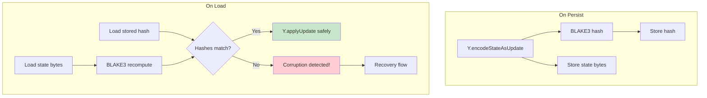

# 05: Hash-at-Rest

> Detect storage-level corruption of persisted Yjs document state

**Duration:** 1-2 days  
**Dependencies:** `@xnetjs/crypto` (BLAKE3), existing storage adapters

## Overview

Yjs document state is persisted as a raw `Uint8Array` in IndexedDB (client) and SQLite (hub). There is currently no integrity check on load — if the bytes are corrupted (disk error, database tampering, partial write), the corrupted state is silently loaded and becomes the authoritative document.

This step adds a BLAKE3 hash stored alongside the Yjs state, verified on every load. If the hash mismatches, the system detects corruption before it propagates.



## Data Structures

### Storage Schema (SQLite — Hub)

```sql
-- Extend existing crdt_state table
ALTER TABLE crdt_state ADD COLUMN state_hash TEXT;
ALTER TABLE crdt_state ADD COLUMN persisted_at INTEGER;
ALTER TABLE crdt_state ADD COLUMN update_count INTEGER DEFAULT 0;
```

### Storage Schema (IndexedDB — Client)

```typescript
// Extend existing documentContent store

interface PersistedDocState {
  /** The raw Yjs state (Y.encodeStateAsUpdate) */
  state: Uint8Array
  /** BLAKE3 hex hash of state bytes */
  hash: string
  /** When this was persisted */
  persistedAt: number
  /** Number of updates merged since last snapshot */
  updateCount: number
}
```

## Implementation

### Hash Utility

```typescript
// packages/sync/src/yjs-integrity.ts

import { blake3Hex } from '@xnetjs/crypto'

export function hashYjsState(state: Uint8Array): string {
  return blake3Hex(state)
}

export function verifyYjsStateIntegrity(state: Uint8Array, expectedHash: string): boolean {
  return blake3Hex(state) === expectedHash
}

export class YjsIntegrityError extends Error {
  constructor(
    public docId: string,
    public expectedHash: string,
    public actualHash: string
  ) {
    super(`Yjs state corrupted for doc ${docId}: expected ${expectedHash}, got ${actualHash}`)
    this.name = 'YjsIntegrityError'
  }
}
```

### Hub Storage Adapter

```typescript
// packages/hub/src/storage/sqlite.ts — extend existing

async setDocState(docId: string, state: Uint8Array): Promise<void> {
  const hash = hashYjsState(state)
  this.db.prepare(`
    INSERT OR REPLACE INTO crdt_state (doc_id, state, state_hash, persisted_at, update_count)
    VALUES (?, ?, ?, ?, 0)
  `).run(docId, Buffer.from(state), hash, Date.now())
}

async getDocState(docId: string): Promise<Uint8Array | null> {
  const row = this.db.prepare(
    'SELECT state, state_hash FROM crdt_state WHERE doc_id = ?'
  ).get(docId) as { state: Buffer; state_hash: string | null } | undefined

  if (!row) return null

  const state = new Uint8Array(row.state)

  // Verify integrity if hash exists
  if (row.state_hash) {
    if (!verifyYjsStateIntegrity(state, row.state_hash)) {
      throw new YjsIntegrityError(
        docId,
        row.state_hash,
        hashYjsState(state)
      )
    }
  }

  return state
}

async incrementUpdateCount(docId: string): Promise<void> {
  this.db.prepare(
    'UPDATE crdt_state SET update_count = update_count + 1 WHERE doc_id = ?'
  ).run(docId)
}
```

### Client Storage Adapter

```typescript
// packages/storage/src/indexeddb.ts — extend existing

async setDocumentContent(nodeId: string, state: Uint8Array): Promise<void> {
  const hash = hashYjsState(state)
  const record: PersistedDocState = {
    state,
    hash,
    persistedAt: Date.now(),
    updateCount: 0,
  }
  await this.db.put('documentContent', record, nodeId)
}

async getDocumentContent(nodeId: string): Promise<Uint8Array | null> {
  const record = await this.db.get('documentContent', nodeId) as PersistedDocState | undefined
  if (!record) return null

  // Legacy records without hash: return as-is (will get hash on next persist)
  if (!record.hash) return record.state

  if (!verifyYjsStateIntegrity(record.state, record.hash)) {
    throw new YjsIntegrityError(nodeId, record.hash, hashYjsState(record.state))
  }

  return record.state
}
```

### Recovery Flow

When corruption is detected:

```typescript
// packages/react/src/sync/document-loader.ts

async function loadDocument(nodeId: string, storage: StorageAdapter): Promise<Y.Doc> {
  const doc = new Y.Doc()

  try {
    const state = await storage.getDocumentContent(nodeId)
    if (state) {
      Y.applyUpdate(doc, state)
    }
  } catch (err) {
    if (err instanceof YjsIntegrityError) {
      console.error('Document state corrupted:', err.message)

      // Recovery strategy:
      // 1. Try loading from hub backup
      const backupState = await tryLoadFromHub(nodeId)
      if (backupState) {
        Y.applyUpdate(doc, backupState)
        // Re-persist with correct hash
        await storage.setDocumentContent(nodeId, Y.encodeStateAsUpdate(doc))
        return doc
      }

      // 2. Start with empty doc (existing content lost)
      console.warn(`Starting fresh document for ${nodeId} due to corruption`)
      // The next sync with peers will repopulate from their state
    } else {
      throw err
    }
  }

  return doc
}
```

### Periodic Re-Hash (Compaction)

After many incremental updates, the full state should be re-encoded and re-hashed:

```typescript
// In the hub's DocPool:

async maybeCompact(docId: string, doc: Y.Doc): Promise<void> {
  const meta = await this.storage.getDocMeta(docId)
  if (!meta || meta.updateCount < 100) return // Compact every 100 updates

  const freshState = Y.encodeStateAsUpdate(doc)
  await this.storage.setDocState(docId, freshState)
  // This resets updateCount to 0 and stores new hash
}
```

## Testing

```typescript
describe('hashYjsState', () => {
  it('produces consistent BLAKE3 hash for same state', () => {
    const state = new Uint8Array([1, 2, 3, 4, 5])
    expect(hashYjsState(state)).toBe(hashYjsState(state))
  })

  it('produces different hash for different state', () => {
    const state1 = new Uint8Array([1, 2, 3])
    const state2 = new Uint8Array([1, 2, 4])
    expect(hashYjsState(state1)).not.toBe(hashYjsState(state2))
  })
})

describe('verifyYjsStateIntegrity', () => {
  it('returns true for matching hash', () => {
    const state = new Uint8Array([10, 20, 30])
    const hash = hashYjsState(state)
    expect(verifyYjsStateIntegrity(state, hash)).toBe(true)
  })

  it('returns false for mismatching hash', () => {
    const state = new Uint8Array([10, 20, 30])
    expect(verifyYjsStateIntegrity(state, 'deadbeef')).toBe(false)
  })
})

describe('Storage with hash-at-rest', () => {
  it('stores hash alongside state', async () => {
    const storage = createTestStorage()
    const state = Y.encodeStateAsUpdate(createTestDoc())
    await storage.setDocState('doc-1', state)

    const row = storage.getRaw('doc-1')
    expect(row.state_hash).toBe(hashYjsState(state))
  })

  it('loads successfully when hash matches', async () => {
    const storage = createTestStorage()
    const state = Y.encodeStateAsUpdate(createTestDoc())
    await storage.setDocState('doc-1', state)

    const loaded = await storage.getDocState('doc-1')
    expect(loaded).toEqual(state)
  })

  it('throws YjsIntegrityError when corrupted', async () => {
    const storage = createTestStorage()
    const state = Y.encodeStateAsUpdate(createTestDoc())
    await storage.setDocState('doc-1', state)

    // Simulate corruption
    storage.corruptBytes('doc-1')

    await expect(storage.getDocState('doc-1')).rejects.toThrow(YjsIntegrityError)
  })

  it('handles legacy records without hash', async () => {
    const storage = createTestStorage()
    // Simulate old record without hash
    storage.setRaw('doc-1', { state: new Uint8Array([1, 2, 3]), hash: null })

    const loaded = await storage.getDocState('doc-1')
    expect(loaded).toEqual(new Uint8Array([1, 2, 3]))
  })
})

describe('Recovery flow', () => {
  it('recovers from hub backup on corruption', async () => {
    // Setup: doc with known content, then corrupt local
    // Verify: loadDocument recovers from hub backup
  })

  it('starts fresh when no backup available', async () => {
    // Setup: corrupted state, no hub backup
    // Verify: returns empty doc, no crash
  })
})

describe('Compaction', () => {
  it('re-encodes and re-hashes after 100 updates', async () => {
    // Apply 101 updates, verify compaction triggers
  })

  it('resets update count after compaction', async () => {
    // Verify updateCount goes back to 0
  })
})
```

## Validation Gate

- [x] BLAKE3 hash stored alongside every persisted Yjs state (hashYjsState, createPersistedDocState)
- [x] Hash verified on every load (both client and hub) (verifyYjsStateIntegrity, loadVerifiedState)
- [x] `YjsIntegrityError` thrown when hash mismatches
- [ ] Recovery attempts hub backup before starting fresh
- [x] Legacy records without hash load normally (backward compat) (loadVerifiedState)
- [x] Compaction re-hashes after 100 incremental updates (shouldCompact utility)
- [x] Corruption detected before reaching `Y.applyUpdate()` (verifyPersistedDocState)
