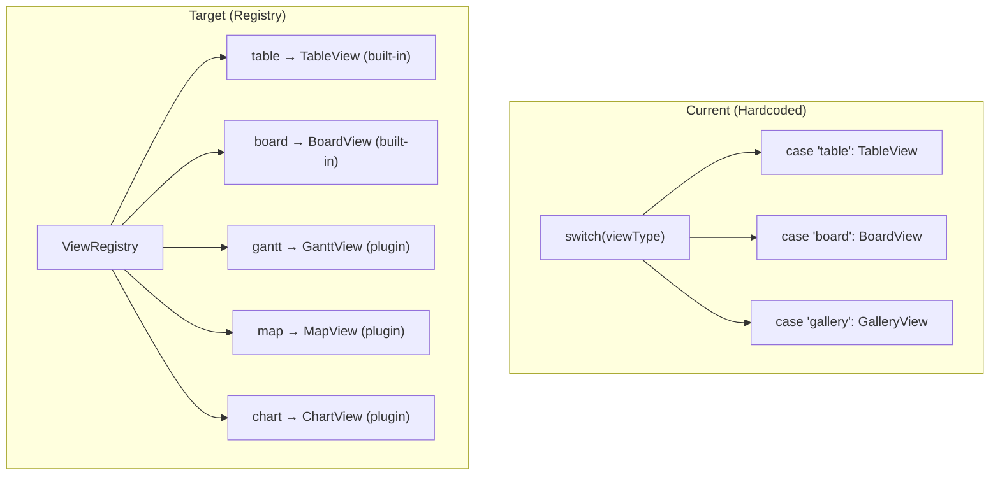

# 03: View Registry

> Dynamic view type registration replacing hardcoded view type mappings in apps.

**Dependencies:** Step 01 (ContributionRegistry), Step 02 (PropertyHandler registry)

## Overview

Currently, apps hardcode a switch statement mapping view types to components (e.g., `case 'table': return <TableView />`). This step creates a `ViewRegistry` that plugins can add views to at runtime.



## Implementation

### 1. View Registration Types

```typescript
// packages/views/src/registry.ts

export interface ViewRegistration {
  type: string // unique identifier
  name: string // display name
  icon: string | React.ComponentType<{}> // icon for view switcher
  component: React.ComponentType<ViewProps> // the view component
  configFields?: ViewConfigField[] // view-specific settings
  supportedSchemas?: SchemaIRI[] | '*' // which schemas work (default: all)
  platforms?: Platform[] // default: all
}

export interface ViewProps {
  nodes: FlatNode[]
  schema: DefinedSchema
  viewConfig: ViewConfig
  onUpdateNode: (id: NodeId, updates: Partial<NodePayload>) => void
  onDeleteNode: (id: NodeId) => void
  onCreateNode: (properties: Partial<NodePayload>) => void
  onNavigate: (nodeId: NodeId) => void
  onUpdateViewConfig: (updates: Partial<ViewConfig>) => void
  isLoading?: boolean
}

export interface ViewConfigField {
  key: string
  label: string
  type: 'property-select' | 'select' | 'number' | 'checkbox' | 'text'
  options?: { label: string; value: string }[]
  required?: boolean
  description?: string
}
```

### 2. ViewRegistry Class

```typescript
// packages/views/src/registry.ts

export class ViewRegistry {
  private views = new Map<string, ViewRegistration>()
  private listeners = new Set<() => void>()

  register(view: ViewRegistration): Disposable {
    if (this.views.has(view.type)) {
      console.warn(`ViewRegistry: overriding existing view type '${view.type}'`)
    }
    this.views.set(view.type, view)
    this.notify()
    return {
      dispose: () => {
        this.views.delete(view.type)
        this.notify()
      }
    }
  }

  get(type: string): ViewRegistration | undefined {
    return this.views.get(type)
  }

  getAll(): ViewRegistration[] {
    return [...this.views.values()]
  }

  getForSchema(schemaIRI: SchemaIRI): ViewRegistration[] {
    return this.getAll().filter(
      (v) =>
        !v.supportedSchemas || v.supportedSchemas === '*' || v.supportedSchemas.includes(schemaIRI)
    )
  }

  onChange(listener: () => void): () => void {
    this.listeners.add(listener)
    return () => this.listeners.delete(listener)
  }

  private notify(): void {
    for (const l of this.listeners) l()
  }
}

// Global instance with built-in views pre-registered
export const viewRegistry = new ViewRegistry()
```

### 3. Register Built-in Views

```typescript
// packages/views/src/builtins.ts

import { TableView } from './table/TableView'
import { BoardView } from './board/BoardView'
import { GalleryView } from './gallery/GalleryView'
import { TimelineView } from './timeline/TimelineView'
import { CalendarView } from './calendar/CalendarView'
import { viewRegistry } from './registry'

export function registerBuiltinViews(): void {
  viewRegistry.register({
    type: 'table',
    name: 'Table',
    icon: 'table',
    component: TableView,
    configFields: [
      {
        key: 'rowHeight',
        label: 'Row Height',
        type: 'select',
        options: [
          { label: 'Compact', value: 'compact' },
          { label: 'Normal', value: 'normal' }
        ]
      }
    ]
  })

  viewRegistry.register({
    type: 'board',
    name: 'Board',
    icon: 'columns',
    component: BoardView,
    configFields: [
      { key: 'groupByProperty', label: 'Group By', type: 'property-select', required: true }
    ]
  })

  viewRegistry.register({
    type: 'gallery',
    name: 'Gallery',
    icon: 'grid',
    component: GalleryView,
    configFields: [
      { key: 'coverProperty', label: 'Cover Image', type: 'property-select' },
      {
        key: 'galleryCardSize',
        label: 'Card Size',
        type: 'select',
        options: [
          { label: 'Small', value: 'small' },
          { label: 'Medium', value: 'medium' },
          { label: 'Large', value: 'large' }
        ]
      }
    ]
  })

  viewRegistry.register({
    type: 'timeline',
    name: 'Timeline',
    icon: 'gantt-chart',
    component: TimelineView,
    configFields: [
      { key: 'dateProperty', label: 'Start Date', type: 'property-select', required: true },
      { key: 'endDateProperty', label: 'End Date', type: 'property-select' }
    ]
  })

  viewRegistry.register({
    type: 'calendar',
    name: 'Calendar',
    icon: 'calendar',
    component: CalendarView,
    configFields: [
      { key: 'dateProperty', label: 'Date Field', type: 'property-select', required: true }
    ]
  })
}
```

### 4. React Hook for Views

```typescript
// packages/views/src/hooks/useViewRegistry.ts

export function useViewRegistry(): {
  views: ViewRegistration[]
  getView: (type: string) => ViewRegistration | undefined
  getViewsForSchema: (schemaIRI: SchemaIRI) => ViewRegistration[]
} {
  const [views, setViews] = useState(viewRegistry.getAll())

  useEffect(() => {
    return viewRegistry.onChange(() => setViews(viewRegistry.getAll()))
  }, [])

  return {
    views,
    getView: (type) => viewRegistry.get(type),
    getViewsForSchema: (iri) => viewRegistry.getForSchema(iri)
  }
}
```

### 5. ViewRenderer Component

Replaces the hardcoded switch statement in apps:

```typescript
// packages/views/src/ViewRenderer.tsx

export function ViewRenderer({
  viewType,
  nodes,
  schema,
  viewConfig,
  ...handlers
}: { viewType: string } & ViewProps) {
  const { getView } = useViewRegistry()
  const registration = getView(viewType)

  if (!registration) {
    return <div className="p-4 text-muted">Unknown view type: {viewType}</div>
  }

  const Component = registration.component
  return <Component nodes={nodes} schema={schema} viewConfig={viewConfig} {...handlers} />
}
```

### 6. View Switcher Component

A UI component that shows available views:

```typescript
// packages/views/src/ViewSwitcher.tsx

export function ViewSwitcher({
  currentType,
  schemaIRI,
  onChange,
}: {
  currentType: string
  schemaIRI?: SchemaIRI
  onChange: (type: string) => void
}) {
  const { getViewsForSchema } = useViewRegistry()
  const available = schemaIRI
    ? getViewsForSchema(schemaIRI)
    : viewRegistry.getAll()

  return (
    <div className="flex gap-1">
      {available.map(view => (
        <button
          key={view.type}
          onClick={() => onChange(view.type)}
          className={currentType === view.type ? 'active' : ''}
          title={view.name}
        >
          {typeof view.icon === 'string' ? <Icon name={view.icon} /> : <view.icon />}
        </button>
      ))}
    </div>
  )
}
```

### 7. App Migration

Replace hardcoded view switching in apps:

```typescript
// apps/electron/src/renderer/components/DatabaseView.tsx
// BEFORE:
switch (viewType) {
  case 'table': return <TableView {...props} />
  case 'board': return <BoardView {...props} />
}

// AFTER:
import { ViewRenderer } from '@xnetjs/views'
return <ViewRenderer viewType={viewType} {...props} />
```

## Example: Plugin Adding a Gantt View

```typescript
// Example plugin: gantt-view
import { defineExtension } from '@xnetjs/plugins'
import { GanttChart } from './components/GanttChart'

export default defineExtension({
  id: 'com.xnet.gantt-view',
  name: 'Gantt Chart View',
  version: '1.0.0',
  contributes: {
    views: [
      {
        type: 'gantt',
        name: 'Gantt Chart',
        icon: 'bar-chart-horizontal',
        component: GanttChart,
        configFields: [
          {
            key: 'startDateProperty',
            label: 'Start Date',
            type: 'property-select',
            required: true
          },
          { key: 'endDateProperty', label: 'End Date', type: 'property-select', required: true },
          { key: 'progressProperty', label: 'Progress (%)', type: 'property-select' },
          { key: 'groupByProperty', label: 'Group By', type: 'property-select' }
        ]
      }
    ]
  }
})
```

## Checklist

- [ ] Implement `ViewRegistry` class with register/get/getAll/getForSchema
- [ ] Define `ViewRegistration`, `ViewProps`, `ViewConfigField` types
- [ ] Extract built-in views into `registerBuiltinViews()` function
- [ ] Create `useViewRegistry` hook
- [ ] Create `ViewRenderer` component
- [ ] Create `ViewSwitcher` component
- [ ] Migrate `apps/electron` DatabaseView to use `ViewRenderer`
- [ ] Migrate `apps/web` to use `ViewRenderer`
- [ ] Export registry and hooks from `@xnetjs/views`
- [ ] Write unit tests for ViewRegistry
- [ ] Update ViewConfig type to allow arbitrary string types (not just union)

---

[Back to README](./README.md) | [Previous: Extension Points](./02-extension-points.md) | [Next: Editor Extensions](./04-editor-extensions.md)
