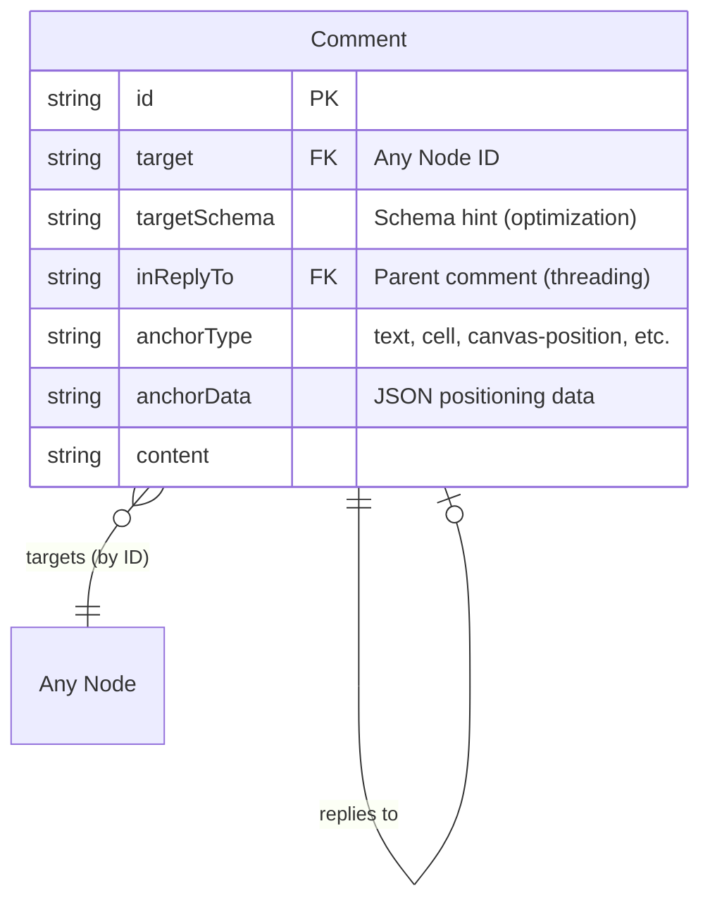

# 01: Comment Schemas

> Universal Comment schema that works on any Node, following the Universal Social Primitives pattern

**Duration:** 1-2 days  
**Dependencies:** `@xnet/data` (defineSchema, NodeStore)  
**Reference:** [Universal Social Primitives](../../explorations/0030_[_]_UNIVERSAL_SOCIAL_PRIMITIVES.md)

## Overview

Comments follow the Universal Social Primitives pattern: a single `Comment` schema that can target **any Node** by ID, regardless of that Node's schema. This enables "comment on anything" with a unified data model.

The key insight from the exploration:

> Node IDs are globally unique (nanoid, 21 chars, schema-independent). Social primitives only need to know _the target Node ID_ -- not what kind of Node it is.



## Design Decision: Merged Thread + Comment

The original plan had separate `CommentThread` and `Comment` schemas. After reviewing the Universal Social Primitives pattern, we're merging them:

| Approach                               | Pros                                                                    | Cons                                                            |
| -------------------------------------- | ----------------------------------------------------------------------- | --------------------------------------------------------------- |
| **Separate Thread + Comment**          | Thread holds anchor, clear separation                                   | Extra Node per thread, more complex queries                     |
| **Merged (Universal Primitive style)** | Simpler data model, one Node per comment, aligns with social primitives | First comment carries anchor data, `inReplyTo: null` means root |

We're adopting the **merged approach** because:

1. It aligns with the universal `useComments(nodeId)` hook pattern
2. Fewer Nodes = simpler sync, less storage
3. Threading via `inReplyTo` is a proven pattern (ActivityPub, Twitter, etc.)

## Implementation

### Comment Schema

```typescript
// packages/data/src/schema/schemas/comment.ts

import {
  defineSchema,
  relation,
  select,
  text,
  checkbox,
  person,
  date,
  created,
  createdBy,
  file
} from '../properties'

export const CommentSchema = defineSchema({
  name: 'Comment',
  namespace: 'xnet://xnet.dev/',

  properties: {
    // Universal targeting (schema-agnostic relation)
    target: relation({
      required: true,
      description: 'The Node this comment is on (any schema)'
    }),

    // Optimization hint for queries/UI (see Universal Social Primitives 2.2)
    targetSchema: text({
      description: 'Schema IRI of the target Node (optimization only, not enforced)'
    }),

    // Reply threading (flat - all replies point to root, not nested)
    inReplyTo: relation({
      description:
        'Root comment ID for threading (null = this IS the root). All replies point directly to root, not to each other - this keeps deletion simple.'
    }),

    // Positioning anchor (polymorphic)
    anchorType: select({
      options: [
        'text', // Text selection in rich text editor
        'cell', // Database cell
        'row', // Database row
        'column', // Database column
        'canvas-position', // Fixed canvas coordinates
        'canvas-object', // Attached to a canvas object
        'node' // Whole-node comment (no specific position)
      ] as const,
      required: true,
      description: 'Type of anchor point'
    }),

    // Anchor-specific positioning data (JSON-encoded)
    anchorData: text({
      required: true,
      description: 'JSON-encoded anchor position data'
    }),

    // Content (GitHub-style markdown - plain text, rendered at display time)
    content: text({
      required: true,
      maxLength: 2000,
      description:
        'Comment body in GitHub-flavored markdown (stored as plain text, rendered at display)'
    }),

    // Attachments
    attachments: file({
      multiple: true,
      description: 'Optional file attachments'
    }),

    // Pseudo reply-to (for "replying to @user" UI without structural nesting)
    replyToUser: text({
      description: 'DID of user being replied to (UI hint, not structural threading)'
    }),
    replyToCommentId: text({
      description: 'Comment ID being referenced (UI hint for "in reply to" display)'
    }),

    // Thread state (on root comment only)
    resolved: checkbox({
      default: false,
      description: 'Whether the thread has been resolved (root comment only)'
    }),
    resolvedBy: person({
      description: 'Who resolved the thread'
    }),
    resolvedAt: date({
      description: 'When the thread was resolved'
    }),

    // Metadata
    createdAt: created(),
    createdBy: createdBy()
  },

  hasContent: false,
  icon: 'message-square'
})

export type Comment = InferNode<typeof CommentSchema>
// IRI: xnet://xnet.dev/Comment
```

### Anchor Data Types

```typescript
// packages/data/src/schema/schemas/commentAnchors.ts

/**
 * Anchor type definitions.
 * The anchorData field on Comment is JSON-encoded using these types.
 */

/** Text selection in the rich text editor */
export interface TextAnchor {
  /** Yjs relative position for selection start (survives concurrent edits) */
  startRelative: string // Base64-encoded Uint8Array from Y.encodeRelativePosition
  /** Yjs relative position for selection end */
  endRelative: string
  /** The quoted text at time of comment (fallback for orphaned anchors) */
  quotedText: string
}

/** Database cell */
export interface CellAnchor {
  rowId: string // Node ID of the database row
  propertyKey: string // Schema property key of the column
}

/** Database row */
export interface RowAnchor {
  rowId: string
}

/** Database column */
export interface ColumnAnchor {
  propertyKey: string
}

/** Fixed canvas position (Figma-style pin) */
export interface CanvasPositionAnchor {
  x: number // Canvas-space X coordinate
  y: number // Canvas-space Y coordinate
}

/** Canvas object attachment (follows object movement) */
export interface CanvasObjectAnchor {
  objectId: string // ID of the canvas object
  offsetX?: number // Optional offset from object origin
  offsetY?: number
}

/** Whole-node comment (no additional positioning needed) */
export interface NodeAnchor {
  // Empty -- target on Comment is sufficient
}

/** Union type for all anchor data */
export type AnchorData =
  | TextAnchor
  | CellAnchor
  | RowAnchor
  | ColumnAnchor
  | CanvasPositionAnchor
  | CanvasObjectAnchor
  | NodeAnchor

/** Encode anchor data for storage */
export function encodeAnchor(data: AnchorData): string {
  return JSON.stringify(data)
}

/** Decode anchor data from storage */
export function decodeAnchor<T extends AnchorData>(json: string): T {
  return JSON.parse(json) as T
}
```

### Schema Registration

```typescript
// packages/data/src/schema/schemas/index.ts (additions)

export { CommentSchema, type Comment } from './comment'
export {
  type TextAnchor,
  type CellAnchor,
  type RowAnchor,
  type ColumnAnchor,
  type CanvasPositionAnchor,
  type CanvasObjectAnchor,
  type NodeAnchor,
  type AnchorData,
  encodeAnchor,
  decodeAnchor
} from './commentAnchors'
```

### Threading Model: Flat (Not Nested)

We use **flat threading** where all replies point directly to the root comment, not to each other:

```
Root (anchor holder, inReplyTo: null)
  ├── Reply A (inReplyTo: root.id)
  ├── Reply B (inReplyTo: root.id)
  └── Reply C (inReplyTo: root.id)
```

**Why flat, not nested?**

With nested threading (`A → B → C`), deleting any comment breaks the chain - B's children would point to a deleted node. Even with soft-delete, query logic becomes complex (must walk up chain to find deleted ancestors).

Flat threading means:

- Deleting a reply never orphans other replies
- Only the root is special (holds anchor + resolved state)
- Simpler queries: just filter by `inReplyTo = rootId`
- Matches Notion, Google Docs, GitHub PR comments

If you need to show "Alice replied to Bob", store that as metadata in the reply, not as a structural `inReplyTo` chain.

### Helper: Get Thread Comments

```typescript
// packages/data/src/comments/thread-utils.ts

import { Comment } from '../schema/schemas/comment'
import { NodeStore } from '../store/types'

/**
 * Get all comments in a thread (root + all replies), sorted by creation time.
 * With flat threading, this is a simple query.
 */
export async function getThreadComments(
  store: NodeStore,
  rootCommentId: string
): Promise<{ root: Comment; replies: Comment[] } | null> {
  const root = await store.get(rootCommentId) as Comment | null
  if (!root) return null

  // All replies point directly to root
  const replies = await store.list({
    schemaId: 'xnet://xnet.dev/Comment',
    where: { inReplyTo: rootCommentId }
  }) as Comment[]

  // Sort replies by creation time
  replies.sort((a, b) =>
    (a.properties.createdAt as number) - (b.properties.createdAt as number)
  )

  return { root, replies }
}

  return current
}

/**
 * Get all comments in a thread (root + all replies), sorted by creation time.
 */
export async function getThreadComments(
  store: NodeStore,
  targetNodeId: string,
  rootCommentId: string
): Promise<Comment[]> {
  // Get all comments on this target
  const allComments = (await store.list({
    schemaId: 'xnet://xnet.dev/Comment',
    where: { target: targetNodeId }
  })) as Comment[]

  // Find the root and all descendants
  const thread: Comment[] = []
  const queue = [rootCommentId]
  const seen = new Set<string>()

  while (queue.length > 0) {
    const id = queue.shift()!
    if (seen.has(id)) continue
    seen.add(id)

    const comment = allComments.find((c) => c.id === id)
    if (comment) {
      thread.push(comment)
      // Find replies to this comment
      for (const c of allComments) {
        if (c.properties.inReplyTo === id) {
          queue.push(c.id)
        }
      }
    }
  }

  // Sort by creation time
  return thread.sort(
    (a, b) => (a.properties.createdAt as number) - (b.properties.createdAt as number)
  )
}
```

## Content Format: GitHub-Flavored Markdown

Comments use **plain text with GitHub-flavored markdown**, not rich text editing:

```typescript
// Stored as plain text
const comment = await store.create({
  schemaId: 'xnet://xnet.dev/Comment',
  properties: {
    content: `
Great catch! This relates to #42.

\`\`\`ts
if (value === null) return defaultValue
\`\`\`

cc @alice @bob
    `.trim()
  }
})

// Rendered at display time using a markdown renderer
```

**Why plain text + markdown?**

| Approach              | Pros                                        | Cons                                      |
| --------------------- | ------------------------------------------- | ----------------------------------------- |
| Rich text (Yjs)       | WYSIWYG editing                             | Heavy (Yjs doc per comment), complex sync |
| Plain text + markdown | Simple storage, fast sync, familiar to devs | No WYSIWYG, learning curve for non-devs   |

GitHub, Slack, Discord all use plain text + markdown for comments. It's proven at scale.

### Supported Markdown Features

- **Basic formatting**: `**bold**`, `*italic*`, `~~strikethrough~~`, `` `code` ``
- **Code blocks**: Triple backticks with language hints
- **Links**: `[text](url)` and autolinks
- **Lists**: Ordered and unordered
- **Blockquotes**: `> quoted text`
- **@mentions**: `@username` or `@did:key:z6Mk...`
- **Comment references**: `#commentId` links to another comment
- **Node references**: `[[nodeId]]` links to any Node
- **Task lists**: `- [ ] todo` and `- [x] done`
- **Emoji**: `:emoji_name:` shortcodes

### @Mentions and Comment References

```typescript
// In content:
// "@alice what do you think?"           → mention user
// "As I said in #abc123..."             → reference another comment
// "See [[page-xyz]] for context"        → reference any Node

// Parsed at render time, not stored structurally
```

## Comment Ordering

Comments have two timestamps from the Node system:

| Field          | Source        | Purpose                                 |
| -------------- | ------------- | --------------------------------------- |
| `lampiortTime` | Lamport clock | Consistent causal ordering across peers |
| `wallTime`     | Wall clock    | Human-readable "2 minutes ago" display  |

### Ordering Strategy

```typescript
// Sort replies by Lamport time for consistent ordering across all peers
thread.replies.sort((a, b) => a.lamportTime - b.lamportTime)

// Display wall time to users
<span className="comment-time">
  {formatRelativeTime(comment.wallTime)} // "2 min ago"
</span>
```

**Why Lamport time for ordering?**

When Alice and Bob both reply at the "same" wall-clock time from different devices, their wall times might differ due to clock skew. Lamport time provides a consistent total order:

1. If A happened-before B, then `A.lamportTime < B.lamportTime`
2. All peers see the same order regardless of when they sync
3. No "jumping" comments when a late sync arrives

**Wall time for display**: Users see human-friendly relative times ("2 min ago"), but the order is determined by Lamport time.

## Deduplication

Per the Universal Social Primitives spec, Comments are **not deduplicated** -- users can create multiple comment threads on the same Node. This matches the behavior of all major commenting systems.

## Tests

```typescript
// packages/data/test/schemas/comment.test.ts

import { describe, it, expect } from 'vitest'
import { CommentSchema } from '../src/schema/schemas'
import {
  encodeAnchor,
  decodeAnchor,
  TextAnchor,
  CellAnchor
} from '../src/schema/schemas/commentAnchors'

describe('CommentSchema', () => {
  it('should have correct IRI', () => {
    expect(CommentSchema.schema['@id']).toBe('xnet://xnet.dev/Comment')
  })

  it('should require target, anchorType, anchorData, and content', () => {
    const props = CommentSchema.schema.properties
    const targetProp = props.find((p) => p.name === 'target')
    const anchorTypeProp = props.find((p) => p.name === 'anchorType')
    const anchorDataProp = props.find((p) => p.name === 'anchorData')
    const contentProp = props.find((p) => p.name === 'content')

    expect(targetProp?.required).toBe(true)
    expect(anchorTypeProp?.required).toBe(true)
    expect(anchorDataProp?.required).toBe(true)
    expect(contentProp?.required).toBe(true)
  })

  it('should not require inReplyTo (optional for threading)', () => {
    const props = CommentSchema.schema.properties
    const inReplyToProp = props.find((p) => p.name === 'inReplyTo')
    expect(inReplyToProp?.required).toBeFalsy()
  })

  it('should have all anchor type options', () => {
    const props = CommentSchema.schema.properties
    const anchorProp = props.find((p) => p.name === 'anchorType')
    expect(anchorProp?.options).toContain('text')
    expect(anchorProp?.options).toContain('cell')
    expect(anchorProp?.options).toContain('canvas-position')
    expect(anchorProp?.options).toContain('canvas-object')
    expect(anchorProp?.options).toContain('node')
  })

  it('should default resolved to false', () => {
    const props = CommentSchema.schema.properties
    const resolvedProp = props.find((p) => p.name === 'resolved')
    expect(resolvedProp?.default).toBe(false)
  })

  it('should have optional targetSchema for optimization', () => {
    const props = CommentSchema.schema.properties
    const targetSchemaProp = props.find((p) => p.name === 'targetSchema')
    expect(targetSchemaProp).toBeDefined()
    expect(targetSchemaProp?.required).toBeFalsy()
  })
})

describe('Anchor encoding', () => {
  it('should round-trip text anchors', () => {
    const anchor: TextAnchor = {
      startRelative: 'base64start...',
      endRelative: 'base64end...',
      quotedText: 'the quick brown fox'
    }
    const encoded = encodeAnchor(anchor)
    const decoded = decodeAnchor<TextAnchor>(encoded)
    expect(decoded.quotedText).toBe('the quick brown fox')
    expect(decoded.startRelative).toBe('base64start...')
  })

  it('should round-trip cell anchors', () => {
    const anchor: CellAnchor = {
      rowId: 'row-123',
      propertyKey: 'status'
    }
    const encoded = encodeAnchor(anchor)
    const decoded = decodeAnchor<CellAnchor>(encoded)
    expect(decoded.rowId).toBe('row-123')
    expect(decoded.propertyKey).toBe('status')
  })
})
```

## Checklist

- [x] Create CommentSchema with universal `target` relation (schema-agnostic) - `packages/data/src/schema/schemas/comment.ts`
- [x] Add `targetSchema` optimization field
- [x] Add `inReplyTo` for reply threading
- [x] Include anchor data fields (anchorType, anchorData)
- [x] Create anchor type definitions and encode/decode utilities - `packages/data/src/schema/schemas/commentAnchors.ts`
- [x] Create thread utility functions (getThreadRoot, getThreadComments) - via `useComments` hook
- [x] Register schema in schema index - `packages/data/src/schema/schemas/index.ts`
- [x] Verify schema passes validation
- [x] Write schema tests - `comment.test.ts`, `commentAnchors.test.ts` (57 tests)
- [x] Tests pass

---

[Back to README](./README.md) | [Next: Comment Mark](./02-comment-mark.md)
