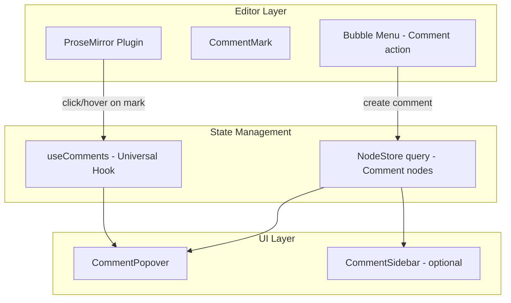

# 05: Editor Integration

> ProseMirror plugin for comment interactions + universal useComments hook

**Duration:** 2-3 days  
**Dependencies:** [02-comment-mark.md](./02-comment-mark.md), [03-anchoring.md](./03-anchoring.md), [04-comment-popover.md](./04-comment-popover.md)

## Overview

The editor integration connects the CommentMark, anchoring logic, and popover UI into a cohesive experience. A ProseMirror plugin handles click/hover events on comment marks, and the popover appears inline.

This follows the **Universal Social Primitives** pattern with the `useComments(nodeId)` hook.



## Implementation

### Universal useComments Hook

Following the [Universal Social Primitives](../../explorations/0030_[_]_UNIVERSAL_SOCIAL_PRIMITIVES.md) pattern:

```typescript
// packages/react/src/hooks/useComments.ts

import { useMemo, useCallback } from 'react'
import { useNodes, useNodeStore } from './useNodes'
import { Comment, decodeAnchor, TextAnchor, encodeAnchor } from '@xnetjs/data'

interface UseCommentsOptions {
  /** The Node ID to get comments for (any schema) */
  nodeId: string
  /** Optional: filter to specific anchor type */
  anchorType?: string
}

interface CommentThread {
  root: Comment
  replies: Comment[]
}

/**
 * Universal hook for comments on any Node.
 * Works on Pages, Posts, Tasks, Database records, Canvas objects, etc.
 */
export function useComments({ nodeId, anchorType }: UseCommentsOptions) {
  const store = useNodeStore()

  // Query all comments targeting this Node
  const comments = useNodes<Comment>({
    schemaId: 'xnet://xnet.dev/Comment',
    where: anchorType ? { target: nodeId, anchorType } : { target: nodeId }
  })

  // Group into threads (root + replies)
  // With flat threading, all replies point directly to root (not nested)
  const threads = useMemo(() => {
    const threadMap = new Map<string, CommentThread>()

    // First pass: find all root comments (inReplyTo is null/undefined)
    for (const comment of comments) {
      if (!comment.properties.inReplyTo) {
        threadMap.set(comment.id, { root: comment, replies: [] })
      }
    }

    // Second pass: attach replies to their root (flat - no chain walking needed)
    for (const comment of comments) {
      const rootId = comment.properties.inReplyTo as string | undefined
      if (rootId) {
        const thread = threadMap.get(rootId)
        if (thread) {
          thread.replies.push(comment)
        }
        // Note: if thread not found, reply is orphaned (root was deleted)
      }
    }

    // Sort replies by Lamport time for consistent ordering across peers
    for (const thread of threadMap.values()) {
      thread.replies.sort((a, b) => a.lamportTime - b.lamportTime)
    }

    return Array.from(threadMap.values())
  }, [comments])

  // Count of unresolved threads
  const unresolvedCount = useMemo(() => {
    return threads.filter((t) => !t.root.properties.resolved).length
  }, [threads])

  // Add a new root comment
  const addComment = useCallback(
    async (options: {
      content: string
      anchorType: string
      anchorData: string
      targetSchema?: string
    }) => {
      const comment = await store.create({
        schemaId: 'xnet://xnet.dev/Comment',
        properties: {
          target: nodeId,
          targetSchema: options.targetSchema,
          anchorType: options.anchorType,
          anchorData: options.anchorData,
          content: options.content,
          resolved: false
        }
      })
      return comment.id
    },
    [store, nodeId]
  )

  // Reply to a thread (adds to flat thread structure)
  const replyTo = useCallback(
    async (
      rootCommentId: string,
      content: string,
      replyContext?: {
        replyToUser?: string // DID of user being replied to
        replyToCommentId?: string // Comment ID being referenced (for "in reply to X" UI)
      }
    ) => {
      // Get the root to copy its target info
      const root = threads.find((t) => t.root.id === rootCommentId)?.root
      if (!root) throw new Error('Thread root not found')

      const reply = await store.create({
        schemaId: 'xnet://xnet.dev/Comment',
        properties: {
          target: nodeId,
          targetSchema: root.properties.targetSchema,
          inReplyTo: rootCommentId, // Always points to root (flat threading)
          anchorType: 'node', // Replies don't need positional anchors
          anchorData: '{}',
          content,
          // Pseudo reply-to for UI display (not structural)
          replyToUser: replyContext?.replyToUser,
          replyToCommentId: replyContext?.replyToCommentId
        }
      })
      return reply.id
    },
    [store, nodeId, threads]
  )

  // Resolve a thread (marks the root comment as resolved)
  const resolveThread = useCallback(
    async (rootCommentId: string) => {
      await store.update(rootCommentId, {
        properties: { resolved: true, resolvedAt: Date.now() }
      })
    },
    [store]
  )

  // Reopen a resolved thread
  const reopenThread = useCallback(
    async (rootCommentId: string) => {
      await store.update(rootCommentId, {
        properties: { resolved: false, resolvedBy: null, resolvedAt: null }
      })
    },
    [store]
  )

  // Delete a comment
  const deleteComment = useCallback(
    async (commentId: string) => {
      await store.delete(commentId)
    },
    [store]
  )

  // Edit a comment
  const editComment = useCallback(
    async (commentId: string, content: string) => {
      await store.update(commentId, {
        properties: { content, edited: true, editedAt: Date.now() }
      })
    },
    [store]
  )

  return {
    // Data
    comments,
    threads,
    count: comments.length,
    unresolvedCount,

    // Actions
    addComment,
    replyTo,
    resolveThread,
    reopenThread,
    deleteComment,
    editComment
  }
}
```

### Comment Plugin (ProseMirror)

```typescript
// packages/editor/src/extensions/comment-plugin.ts

import { Plugin, PluginKey } from '@tiptap/pm/state'
import { Decoration, DecorationSet } from '@tiptap/pm/view'
import { Extension } from '@tiptap/core'

export interface CommentPluginOptions {
  onClickComment: (commentId: string, anchorEl: HTMLElement) => void
  onHoverComment: (commentId: string, anchorEl: HTMLElement) => void
  onLeaveComment: () => void
  onCreateComment: (from: number, to: number) => void
}

export const CommentPlugin = Extension.create<CommentPluginOptions>({
  name: 'commentPlugin',

  addOptions() {
    return {
      onClickComment: () => {},
      onHoverComment: () => {},
      onLeaveComment: () => {},
      onCreateComment: () => {}
    }
  },

  addProseMirrorPlugins() {
    const options = this.options

    return [
      new Plugin({
        key: new PluginKey('commentInteractions'),

        props: {
          handleClick(view, pos, event) {
            const target = event.target as HTMLElement
            const commentSpan = target.closest('[data-comment]') as HTMLElement

            if (commentSpan) {
              const commentId = commentSpan.getAttribute('data-comment-id')
              if (commentId) {
                options.onClickComment(commentId, commentSpan)
                return true
              }
            }
            return false
          },

          handleDOMEvents: {
            mouseover(view, event) {
              const target = event.target as HTMLElement
              const commentSpan = target.closest('[data-comment]') as HTMLElement

              if (commentSpan) {
                const commentId = commentSpan.getAttribute('data-comment-id')
                if (commentId) {
                  options.onHoverComment(commentId, commentSpan)
                }
              }
              return false
            },

            mouseout(view, event) {
              const target = event.target as HTMLElement
              const relatedTarget = event.relatedTarget as HTMLElement | null

              // Only fire leave if we're leaving comment spans entirely
              if (target.closest('[data-comment]') && !relatedTarget?.closest('[data-comment]')) {
                options.onLeaveComment()
              }
              return false
            }
          },

          // Add selected class to the active comment mark
          decorations(state) {
            // This would be populated by the plugin state when a comment is focused
            return DecorationSet.empty
          }
        }
      })
    ]
  }
})
```

### Comment Creation Flow

```typescript
// packages/editor/src/comments/create-comment.ts

import { Editor } from '@tiptap/core'
import { NodeStore } from '@xnetjs/data'
import { captureTextAnchor } from './text-anchor'
import { encodeAnchor } from '@xnetjs/data'

export interface CreateCommentOptions {
  editor: Editor
  store: NodeStore
  targetNodeId: string // The Page/Document node this editor is editing
  targetSchema?: string // Schema IRI of the target (optimization)
  content: string // Initial comment text
}

/**
 * Create a comment on the current text selection.
 * 1. Captures Yjs RelativePosition anchor
 * 2. Creates Comment node with anchor data
 * 3. Applies CommentMark to selection
 */
export async function createTextComment({
  editor,
  store,
  targetNodeId,
  targetSchema,
  content
}: CreateCommentOptions): Promise<string | null> {
  // 1. Capture anchor from current selection
  const anchor = captureTextAnchor(editor)
  if (!anchor) return null

  // 2. Create comment
  const comment = await store.create({
    schemaId: 'xnet://xnet.dev/Comment',
    properties: {
      target: targetNodeId,
      targetSchema,
      anchorType: 'text',
      anchorData: encodeAnchor(anchor),
      content,
      resolved: false
    }
  })

  // 3. Apply mark to selection
  editor.chain().focus().setComment(comment.id).run()

  return comment.id
}
```

### Bubble Menu "Comment" Action

Add a "Comment" button to the existing bubble menu that appears on text selection:

```typescript
// packages/editor/src/components/BubbleMenuCommentAction.tsx

import React, { useState } from 'react'
import { Editor } from '@tiptap/core'
import { NodeStore } from '@xnetjs/data'
import { createTextComment } from '../comments/create-comment'

interface Props {
  editor: Editor
  targetNodeId: string
  targetSchema?: string
  store: NodeStore
}

export function BubbleMenuCommentAction({ editor, targetNodeId, targetSchema, store }: Props) {
  const [isCreating, setIsCreating] = useState(false)
  const [commentText, setCommentText] = useState('')

  const handleCreate = async () => {
    if (!commentText.trim()) return

    await createTextComment({
      editor,
      store,
      targetNodeId,
      targetSchema,
      content: commentText.trim()
    })

    setCommentText('')
    setIsCreating(false)
  }

  if (isCreating) {
    return (
      <div className="bubble-menu-comment-input">
        <textarea
          value={commentText}
          onChange={(e) => setCommentText(e.target.value)}
          placeholder="Add a comment..."
          autoFocus
          onKeyDown={(e) => {
            if (e.key === 'Enter' && (e.metaKey || e.ctrlKey)) handleCreate()
            if (e.key === 'Escape') setIsCreating(false)
          }}
        />
        <button onClick={handleCreate} disabled={!commentText.trim()}>
          Comment
        </button>
      </div>
    )
  }

  return (
    <button
      className="bubble-menu-action"
      onClick={() => setIsCreating(true)}
      title="Add comment"
    >
      Comment
    </button>
  )
}
```

### Document Comments Integration

```typescript
// packages/editor/src/components/DocumentComments.tsx

import React from 'react'
import { Editor } from '@tiptap/core'
import { useComments } from '@xnetjs/react'
import { CommentPopover } from '@xnetjs/ui'
import { useCommentPopover } from '@xnetjs/react'
import { resolveTextAnchor } from '../comments/text-anchor'
import { decodeAnchor, TextAnchor } from '@xnetjs/data'

interface DocumentCommentsProps {
  editor: Editor
  documentId: string
  documentSchema?: string
}

export function DocumentComments({
  editor,
  documentId,
  documentSchema
}: DocumentCommentsProps) {
  const {
    threads,
    addComment,
    replyTo,
    resolveThread,
    reopenThread,
    deleteComment,
    editComment,
    unresolvedCount
  } = useComments({ nodeId: documentId, anchorType: 'text' })

  const { state, showPreview, showFull, dismiss, cancelPreview, upgradeToFull } =
    useCommentPopover()

  // Resolve thread positions for popover positioning
  const getCommentPosition = (commentId: string) => {
    const comment = threads.find((t) => t.root.id === commentId)?.root
    if (!comment || comment.properties.anchorType !== 'text') return null

    const anchor = decodeAnchor<TextAnchor>(comment.properties.anchorData as string)
    return resolveTextAnchor(editor, anchor)
  }

  return (
    <>
      {/* Popover */}
      {state.visible && state.thread && (
        <CommentPopover
          thread={state.thread}
          comments={[state.thread.root, ...state.thread.replies]}
          anchor={state.anchor!}
          mode={state.mode}
          side="right"
          onReply={(content) => replyTo(state.thread!.root.id, content)}
          onResolve={() => resolveThread(state.thread!.root.id)}
          onReopen={() => reopenThread(state.thread!.root.id)}
          onDelete={(id) => deleteComment(id)}
          onEdit={(id, content) => editComment(id, content)}
          onDismiss={dismiss}
          onUpgradeToFull={upgradeToFull}
        />
      )}

      {/* Optional: Comment count indicator */}
      {unresolvedCount > 0 && (
        <div className="document-comment-count">
          {unresolvedCount} unresolved comment{unresolvedCount > 1 ? 's' : ''}
        </div>
      )}
    </>
  )
}
```

### Optional Sidebar

The sidebar is a secondary navigation tool for reviewing all threads at once:

```typescript
// packages/editor/src/components/CommentSidebar.tsx

import React from 'react'
import { useComments } from '@xnetjs/react'
import { decodeAnchor, TextAnchor } from '@xnetjs/data'

interface CommentSidebarProps {
  nodeId: string
  onSelectThread: (commentId: string) => void
  showResolved?: boolean
}

export function CommentSidebar({
  nodeId,
  onSelectThread,
  showResolved = false
}: CommentSidebarProps) {
  const { threads } = useComments({ nodeId })

  const filteredThreads = threads.filter(
    (t) => showResolved || !t.root.properties.resolved
  )

  return (
    <div className="comment-sidebar">
      <div className="comment-sidebar__header">
        <h3>Comments ({filteredThreads.length})</h3>
      </div>
      <div className="comment-sidebar__list">
        {filteredThreads.map((thread) => {
          const anchor =
            thread.root.properties.anchorType === 'text'
              ? decodeAnchor<TextAnchor>(thread.root.properties.anchorData as string)
              : null

          return (
            <div
              key={thread.root.id}
              className="comment-sidebar__item"
              onClick={() => onSelectThread(thread.root.id)}
            >
              {anchor?.quotedText && (
                <div className="comment-sidebar__quote">"{anchor.quotedText}"</div>
              )}
              <div className="comment-sidebar__preview">
                {thread.root.properties.content as string}
              </div>
              <div className="comment-sidebar__meta">
                {thread.replies.length + 1} comment{thread.replies.length > 0 ? 's' : ''}
                {thread.root.properties.resolved && ' - Resolved'}
              </div>
            </div>
          )
        })}
      </div>
    </div>
  )
}
```

## Keyboard Shortcuts

| Shortcut           | Action                                     |
| ------------------ | ------------------------------------------ |
| `Cmd+Shift+M`      | Create comment on selection                |
| `Escape`           | Dismiss popover                            |
| `Cmd+Enter`        | Submit reply                               |
| `Tab` (in popover) | Move focus between reply input and actions |

## Checklist

- [x] Create universal `useComments(nodeId)` hook - `packages/react/src/hooks/useComments.ts`
- [x] Create CommentPlugin extension (click/hover handlers) - `packages/editor/src/extensions/comment/CommentPlugin.ts`
- [x] Implement createTextComment flow (anchor -> comment -> mark) - in `PageView.tsx`
- [x] Add "Comment" action to toolbar - `packages/editor/src/components/FloatingToolbar.tsx`
- [x] Create CommentSidebar component (using OrphanedThreadList for detached) - `packages/ui/src/composed/comments/OrphanedThreadList.tsx`
- [x] Wire up editor -> popover -> store - in `PageView.tsx`
- [x] Add keyboard shortcuts (Cmd+Enter to submit replies)
- [x] Handle mark restoration on document open - `restoreCommentMarks` in `PageView.tsx`
- [x] Tests pass

---

[Back to README](./README.md) | [Previous: Comment Popover](./04-comment-popover.md) | [Next: Database Comments](./06-database-comments.md)
