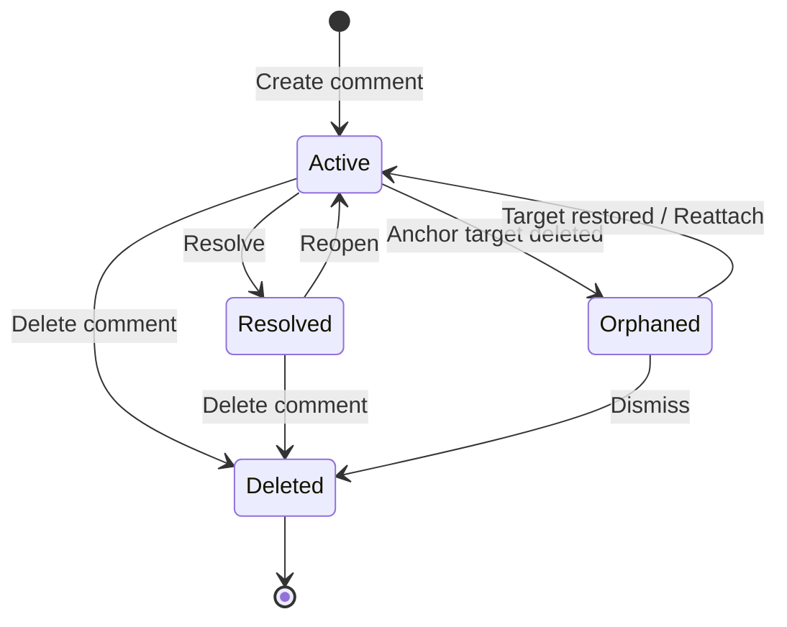
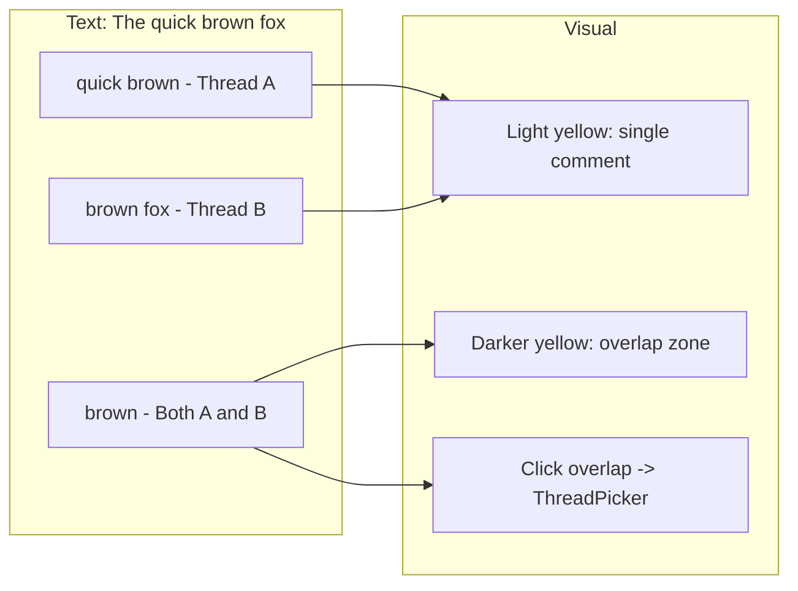

# 08: Thread Lifecycle

> Orphaned anchors, overlapping comments, notifications, and thread management

**Duration:** 2 days  
**Dependencies:** [03-anchoring.md](./03-anchoring.md), [05-editor-integration.md](./05-editor-integration.md)

## Overview

This step handles the edge cases and polish for the commenting system: what happens when commented content is deleted, how overlapping comments behave, and how comment counts/notifications work.

With the **Universal Social Primitives** pattern, a "thread" is a root Comment (with `inReplyTo: null`) plus all Comments that reply to it. The root Comment holds the anchor data and resolved state.



## Orphaned Anchors

### Detection

An anchor is orphaned when its target no longer exists or can't be resolved:

```typescript
// packages/data/src/comments/orphan-detection.ts

import { Comment, TextAnchor, CellAnchor, CanvasObjectAnchor, decodeAnchor } from '@xnetjs/data'

export type OrphanReason = 'text-deleted' | 'row-deleted' | 'object-deleted' | 'node-deleted'

export interface OrphanedComment {
  comment: Comment
  reason: OrphanReason
  context: string // Human-readable context (quoted text, row title, etc.)
}

/**
 * Check if a comment's anchor is orphaned.
 * Returns the orphan reason if orphaned, null if still valid.
 */
export function checkOrphanStatus(
  comment: Comment,
  resolvers: {
    resolveTextAnchor: (anchor: TextAnchor) => { from: number; to: number } | null
    rowExists: (rowId: string) => boolean
    objectExists: (objectId: string) => boolean
    nodeExists: (nodeId: string) => boolean
  }
): OrphanReason | null {
  const anchorType = comment.properties.anchorType as string
  const anchorData = comment.properties.anchorData as string

  switch (anchorType) {
    case 'text': {
      const anchor = decodeAnchor<TextAnchor>(anchorData)
      const resolved = resolvers.resolveTextAnchor(anchor)
      return resolved === null ? 'text-deleted' : null
    }

    case 'cell':
    case 'row': {
      const anchor = decodeAnchor<CellAnchor>(anchorData)
      return resolvers.rowExists(anchor.rowId) ? null : 'row-deleted'
    }

    case 'canvas-object': {
      const anchor = decodeAnchor<CanvasObjectAnchor>(anchorData)
      return resolvers.objectExists(anchor.objectId) ? null : 'object-deleted'
    }

    case 'node': {
      const targetId = comment.properties.target as string
      return resolvers.nodeExists(targetId) ? null : 'node-deleted'
    }

    default:
      return null // canvas-position and column anchors can't orphan
  }
}
```

### Orphaned Thread UI

Orphaned threads appear in a "Detached Comments" section, showing the original context:

```typescript
// packages/ui/src/components/OrphanedThreadList.tsx

import React from 'react'
import { OrphanedComment } from '@xnetjs/data'
import { Comment } from '@xnetjs/data'

interface OrphanedThreadListProps {
  orphanedComments: OrphanedComment[]
  onDismiss: (commentId: string) => void
  onReattach: (commentId: string) => void
}

export function OrphanedThreadList({
  orphanedComments,
  onDismiss,
  onReattach
}: OrphanedThreadListProps) {
  if (orphanedComments.length === 0) return null

  return (
    <div className="orphaned-threads">
      <h4 className="orphaned-threads__header">
        Detached Comments ({orphanedComments.length})
      </h4>
      <p className="orphaned-threads__description">
        These comments were on content that has been removed.
      </p>

      {orphanedComments.map(({ comment, reason, context }) => (
        <div key={comment.id} className="orphaned-thread">
          <div className="orphaned-thread__context">Originally on: "{context}"</div>
          <div className="orphaned-thread__preview">
            {comment.properties.content as string}
          </div>
          <div className="orphaned-thread__actions">
            <button onClick={() => onReattach(comment.id)}>Reattach</button>
            <button onClick={() => onDismiss(comment.id)}>Dismiss</button>
          </div>
        </div>
      ))}
    </div>
  )
}
```

### Auto-Reattachment

If an undo operation restores deleted text, orphaned text anchors automatically resolve again:

```typescript
// On each document change, re-check orphaned threads
function recheckOrphanedAnchors(editor: Editor, orphanedCommentIds: string[], store: NodeStore) {
  for (const commentId of orphanedCommentIds) {
    const comment = store.get(commentId) as Comment | null
    if (!comment || comment.properties.anchorType !== 'text') continue

    const anchor = decodeAnchor<TextAnchor>(comment.properties.anchorData as string)
    const resolved = resolveTextAnchor(editor, anchor)

    if (resolved) {
      // Anchor is valid again -- restore the mark
      const markType = editor.schema.marks.comment
      const { tr } = editor.state
      tr.addMark(
        resolved.from,
        resolved.to,
        markType.create({ commentId, resolved: comment.properties.resolved })
      )
      editor.view.dispatch(tr)

      // Remove from orphaned list
      orphanedCommentIds.splice(orphanedCommentIds.indexOf(commentId), 1)
    }
  }
}
```

## Overlapping Comments

### Detection

```typescript
// packages/editor/src/comments/overlap-detection.ts

/**
 * Find all comment IDs at a given document position.
 */
export function getCommentsAtPosition(editor: Editor, pos: number): string[] {
  const resolvedPos = editor.state.doc.resolve(pos)
  const marks = resolvedPos.marks()

  return marks.filter((m) => m.type.name === 'comment').map((m) => m.attrs.commentId as string)
}
```

### Thread Picker (for overlapping regions)

When clicking on text with multiple comment marks, show a small picker:

```typescript
// packages/ui/src/components/ThreadPicker.tsx

import React from 'react'
import { Comment } from '@xnetjs/data'

interface CommentThread {
  root: Comment
  replies: Comment[]
}

interface ThreadPickerProps {
  threads: CommentThread[]
  anchor: HTMLElement
  onSelect: (commentId: string) => void
  onDismiss: () => void
}

export function ThreadPicker({ threads, anchor, onSelect, onDismiss }: ThreadPickerProps) {
  return (
    <Popover anchor={anchor} side="bottom" onClose={onDismiss}>
      <div className="thread-picker">
        <div className="thread-picker__header">{threads.length} comments on this text</div>
        {threads.map((thread) => (
          <button
            key={thread.root.id}
            className="thread-picker__item"
            onClick={() => onSelect(thread.root.id)}
          >
            <span className="thread-picker__author">
              {thread.root.properties.createdBy as string}
            </span>
            <span className="thread-picker__preview">
              {(thread.root.properties.content as string)?.slice(0, 50)}
            </span>
          </button>
        ))}
      </div>
    </Popover>
  )
}
```

### Overlap Visual Treatment



## Comment Count Badges

Show comment counts on Nodes in the navigation/sidebar using the universal hook:

```typescript
// packages/react/src/hooks/useCommentCount.ts

import { useMemo } from 'react'
import { useComments } from './useComments'

/**
 * Get the unresolved comment count for a Node.
 * Useful for showing badges in navigation.
 */
export function useCommentCount(nodeId: string): number {
  const { threads } = useComments({ nodeId })

  return useMemo(() => {
    return threads.filter((t) => !t.root.properties.resolved).length
  }, [threads])
}

// Usage in navigation
function NavItem({ node }) {
  const count = useCommentCount(node.id)

  return (
    <div className="nav-item">
      {node.title}
      {count > 0 && <span className="comment-badge">{count}</span>}
    </div>
  )
}
```

## @Mentions, Comment References, and Node Links

Comments support GitHub-style references parsed at render time:

```typescript
// packages/data/src/comments/references.ts

export interface Mention {
  type: 'user'
  raw: string // '@alice' or '@did:key:z6Mk...'
  did?: string // Resolved DID
  displayName?: string // Display name if not a DID
  index: number // Position in content
}

export interface CommentRef {
  type: 'comment'
  raw: string // '#abc123'
  commentId: string
  index: number
}

export interface NodeRef {
  type: 'node'
  raw: string // '[[page-xyz]]'
  nodeId: string
  index: number
}

export type Reference = Mention | CommentRef | NodeRef

// Regex patterns
const MENTION_REGEX = /@([a-zA-Z_][\w]*|did:key:z[a-zA-Z0-9]+)/g
const COMMENT_REF_REGEX = /#([a-zA-Z0-9_-]{21})/g // nanoid format
const NODE_REF_REGEX = /\[\[([a-zA-Z0-9_-]{21})\]\]/g

/**
 * Extract all references from comment content.
 */
export function extractReferences(content: string): Reference[] {
  const refs: Reference[] = []

  // @mentions
  let match: RegExpExecArray | null
  while ((match = MENTION_REGEX.exec(content)) !== null) {
    refs.push({
      type: 'user',
      raw: match[0],
      did: match[1].startsWith('did:') ? match[1] : undefined,
      displayName: match[1].startsWith('did:') ? undefined : match[1],
      index: match.index
    })
  }

  // #comment references
  while ((match = COMMENT_REF_REGEX.exec(content)) !== null) {
    refs.push({
      type: 'comment',
      raw: match[0],
      commentId: match[1],
      index: match.index
    })
  }

  // [[node]] references
  while ((match = NODE_REF_REGEX.exec(content)) !== null) {
    refs.push({
      type: 'node',
      raw: match[0],
      nodeId: match[1],
      index: match.index
    })
  }

  return refs.sort((a, b) => a.index - b.index)
}

/**
 * Check if a DID is mentioned in a comment.
 */
export function isMentioned(content: string, did: string): boolean {
  return content.includes(`@${did}`)
}

/**
 * Get all users mentioned in a comment (for notifications).
 */
export function getMentionedUsers(content: string): string[] {
  return extractReferences(content)
    .filter((r): r is Mention => r.type === 'user')
    .map((m) => m.did ?? m.displayName!)
    .filter(Boolean)
}
```

### Rendering References

```typescript
// packages/ui/src/utils/markdown.ts

import { marked } from 'marked'
import { extractReferences } from '@xnetjs/data'

/**
 * Render GitHub-flavored markdown with xNet-specific extensions.
 */
export function renderGitHubMarkdown(content: string): string {
  // First, convert xNet references to markdown links
  let processed = content

  const refs = extractReferences(content)
  // Process in reverse order to preserve indices
  for (const ref of refs.reverse()) {
    switch (ref.type) {
      case 'user':
        processed = replaceAt(
          processed,
          ref.index,
          ref.raw.length,
          `<a href="/user/${ref.did ?? ref.displayName}" class="mention">@${ref.displayName ?? ref.did?.slice(-8)}</a>`
        )
        break
      case 'comment':
        processed = replaceAt(
          processed,
          ref.index,
          ref.raw.length,
          `<a href="#comment-${ref.commentId}" class="comment-ref">#${ref.commentId.slice(0, 8)}</a>`
        )
        break
      case 'node':
        processed = replaceAt(
          processed,
          ref.index,
          ref.raw.length,
          `<a href="/node/${ref.nodeId}" class="node-ref">[[${ref.nodeId.slice(0, 8)}]]</a>`
        )
        break
    }
  }

  // Then render markdown
  return marked.parse(processed, {
    gfm: true, // GitHub-flavored markdown
    breaks: true // Convert \n to <br>
  })
}

function replaceAt(str: string, index: number, length: number, replacement: string): string {
  return str.slice(0, index) + replacement + str.slice(index + length)
}
```

### Autocomplete Support

The comment input should provide autocomplete for:

- `@` - user mentions (search contacts/team members)
- `#` - comment references (recent comments in thread)
- `[[` - node references (search pages/nodes)

## Thread Resolution

With the merged schema, resolution state is on the root Comment:

```typescript
// packages/react/src/hooks/useComments.ts (already implemented)

const resolveThread = useCallback(
  async (rootCommentId: string) => {
    await store.update(rootCommentId, {
      properties: { resolved: true, resolvedAt: Date.now() }
    })
  },
  [store]
)

const reopenThread = useCallback(
  async (rootCommentId: string) => {
    await store.update(rootCommentId, {
      properties: { resolved: false, resolvedBy: null, resolvedAt: null }
    })
  },
  [store]
)
```

## Thread and Comment Deletion

### Flat Threading Makes Deletion Safe

We use **flat threading** where all replies point directly to the root comment (not to each other). This means:

```
Root (anchor holder)
  ├── Reply A (inReplyTo: root.id)
  ├── Reply B (inReplyTo: root.id)  ← deleting A doesn't affect B
  └── Reply C (inReplyTo: root.id)
```

Deleting any **reply** is safe - it doesn't orphan other replies since they all point to root, not to each other.

Only the **root** is special - it holds the anchor data and thread state.

### Deletion Rules

```typescript
// packages/react/src/hooks/useComments.ts

/**
 * Delete a comment.
 * - Replies: soft-delete normally (safe - doesn't break threading)
 * - Root with replies: tombstone (preserve structure for existing replies)
 * - Root without replies: soft-delete (thread is fully removed)
 */
const deleteComment = useCallback(
  async (commentId: string) => {
    const thread = threads.find((t) => t.root.id === commentId)
    const isRoot = thread !== undefined

    if (isRoot) {
      if (thread.replies.length > 0) {
        // Root has replies: tombstone to preserve thread structure
        await store.update(commentId, {
          properties: { content: '[deleted]' }
          // Keep: target, targetSchema, anchorType, anchorData, resolved, etc.
        })
      } else {
        // Root has no replies: safe to fully delete
        await store.delete(commentId)
      }
    } else {
      // Reply: normal soft-delete (never breaks other replies)
      await store.delete(commentId)
    }
  },
  [store, threads]
)

/**
 * Delete an entire thread (root + all replies).
 */
const deleteThread = useCallback(
  async (rootCommentId: string) => {
    const thread = threads.find((t) => t.root.id === rootCommentId)
    if (!thread) return

    // Soft-delete all replies, then root
    for (const reply of thread.replies) {
      await store.delete(reply.id)
    }
    await store.delete(rootCommentId)
  },
  [store, threads]
)
```

### UI Display for Tombstoned Comments

```typescript
function CommentBubble({ comment }: { comment: Comment }) {
  const isDeleted = comment.properties.content === '[deleted]'

  if (isDeleted) {
    return (
      <div className="comment-bubble comment-bubble--deleted">
        <span className="comment-bubble__deleted-label">[deleted]</span>
      </div>
    )
  }

  // Normal render...
}
```

### Behavior Summary

| Scenario                    | Action                            |
| --------------------------- | --------------------------------- |
| Delete reply                | Soft-delete (safe, no orphans)    |
| Delete root with replies    | Tombstone (content = "[deleted]") |
| Delete root without replies | Soft-delete                       |
| Delete entire thread        | Soft-delete all replies + root    |

### Why Flat Threading?

With nested threading (`A → B → C`), deleting A would orphan B (and transitively C). You'd need complex query logic to walk up the `inReplyTo` chain and include deleted ancestors.

Flat threading avoids this entirely. If you need to show "Alice replied to Bob's point", store that as display metadata, not structural `inReplyTo` nesting.

````

## Edit History (Event-Sourced)

Comment edit history is free via the existing change log. No additional implementation needed -- when we expose change log queries, comment history is automatically available:

```typescript
// Future API (when change log queries are exposed):
const history = await store.getPropertyHistory(commentId, 'content')
// Returns all previous values with timestamps and authors
````

For now, just show the `edited` flag and `editedAt` timestamp in the UI.

## Checklist

- [x] Implement orphan detection (checkOrphanStatus) - `packages/data/src/schema/schemas/commentOrphans.ts`
- [x] Create OrphanedThreadList component - `packages/ui/src/composed/comments/OrphanedThreadList.tsx`
- [x] Implement auto-reattachment on undo - `packages/editor/src/extensions/comment/useOrphanReattachment.ts`
- [x] Implement overlap detection (getCommentsAtPosition) - `packages/editor/src/extensions/comment/CommentPlugin.ts`
- [x] Create ThreadPicker component - `packages/ui/src/composed/comments/ThreadPicker.tsx`
- [x] Implement useCommentCount hook - `packages/react/src/hooks/useCommentCount.ts`
- [x] Implement @mention extraction - `packages/data/src/schema/schemas/commentReferences.ts`
- [x] Implement deleteThread with cascade - `packages/react/src/hooks/useComments.ts`
- [x] Handle thread deletion (soft-delete, remove marks) - `packages/react/src/hooks/useComments.ts`
- [x] Add "Detached Comments" section to PageView - `apps/electron/src/renderer/components/PageView.tsx`
- [x] Tests pass (158+ comment-related tests)

---

[Back to README](./README.md) | [Previous: Canvas Comments](./07-canvas-comments.md)
