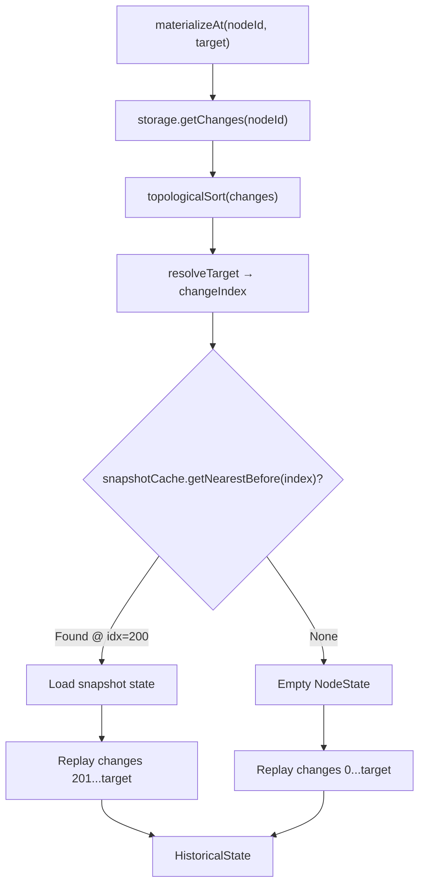

# 01: History Engine

> Core point-in-time reconstruction: materialize any node's state at any historical point.

**Dependencies:** `@xnetjs/data` (NodeStore, NodeStorageAdapter), `@xnetjs/sync` (topologicalSort, LamportTimestamp)
**New Package:** `packages/history/`

## Overview

The HistoryEngine replays changes from the log to reconstruct a node's state at any point in time. It uses snapshot checkpoints for performance and supports multiple targeting strategies (by Lamport time, wall clock, hash, or index).



## Implementation

### 1. Types

```typescript
// packages/history/src/types.ts

/** How to specify a point in time */
export type HistoryTarget =
  | { type: 'lamport'; time: number } // by Lamport time
  | { type: 'wall'; timestamp: number } // by wall clock (nearest)
  | { type: 'hash'; hash: ContentId } // by specific change
  | { type: 'index'; index: number } // by change count (0-based)
  | { type: 'relative'; offset: number } // -1 = previous change
  | { type: 'latest' } // current (head)

/** Result of point-in-time reconstruction */
export interface HistoricalState {
  node: NodeState // reconstructed state
  target: HistoryTarget // which point was requested
  changeIndex: number // how many changes were applied
  totalChanges: number // total changes available
  timestamp: number // wall time at this point
  author: DID // who made the change at this point
  changeHash: ContentId // hash of the change at this index
}

/** A single entry in the timeline */
export interface TimelineEntry {
  index: number
  change: NodeChange
  properties: string[] // which properties changed
  operation: 'create' | 'update' | 'delete' | 'restore'
  author: DID
  wallTime: number
  lamport: LamportTimestamp
  batchId?: string
  batchSize?: number
}

/** Diff between two states */
export interface PropertyDiff {
  property: string
  before: unknown
  after: unknown
  changedAt: number // wall time of the change
  changedBy: DID
}
```

### 2. HistoryEngine Class

```typescript
// packages/history/src/engine.ts

import { topologicalSort, compareLamportTimestamps } from '@xnetjs/sync'
import type {
  NodeChange,
  NodeState,
  NodeStorageAdapter,
  NodeId,
  PropertyTimestamp
} from '@xnetjs/data'
import type { SnapshotCache } from './snapshot-cache'
import type { HistoryTarget, HistoricalState, TimelineEntry, PropertyDiff } from './types'

export class HistoryEngine {
  constructor(
    private storage: NodeStorageAdapter,
    private snapshots: SnapshotCache
  ) {}

  /** Reconstruct a node's state at a specific point in history */
  async materializeAt(nodeId: NodeId, target: HistoryTarget): Promise<HistoricalState> {
    const allChanges = await this.storage.getChanges(nodeId)
    if (allChanges.length === 0) {
      throw new Error(`No changes found for node ${nodeId}`)
    }

    const sorted = topologicalSort(allChanges)
    const targetIndex = this.resolveTarget(target, sorted)

    if (targetIndex < 0 || targetIndex >= sorted.length) {
      throw new Error(`Target index ${targetIndex} out of range [0, ${sorted.length - 1}]`)
    }

    // Find nearest snapshot before target
    const snapshot = await this.snapshots.getNearestBefore(nodeId, targetIndex)
    let state: NodeState
    let startIndex: number

    if (snapshot) {
      state = structuredClone(snapshot.state)
      startIndex = snapshot.changeIndex + 1
    } else {
      state = this.createEmptyState(nodeId, sorted[0])
      startIndex = 0
    }

    // Replay changes from startIndex to targetIndex
    for (let i = startIndex; i <= targetIndex; i++) {
      state = this.applyChangeToState(state, sorted[i])
    }

    const targetChange = sorted[targetIndex]
    return {
      node: state,
      target,
      changeIndex: targetIndex,
      totalChanges: sorted.length,
      timestamp: targetChange.wallTime,
      author: targetChange.authorDID,
      changeHash: targetChange.hash
    }
  }

  /** Reconstruct multiple nodes at the same point (for database views) */
  async materializeMultipleAt(
    nodeIds: NodeId[],
    target: HistoryTarget
  ): Promise<Map<NodeId, HistoricalState>> {
    const results = new Map<NodeId, HistoricalState>()
    // Parallel reconstruction
    await Promise.all(
      nodeIds.map(async (id) => {
        try {
          const state = await this.materializeAt(id, target)
          results.set(id, state)
        } catch {
          // Node may not exist at this point — skip
        }
      })
    )
    return results
  }

  /** Get the full timeline for a node */
  async getTimeline(nodeId: NodeId): Promise<TimelineEntry[]> {
    const changes = await this.storage.getChanges(nodeId)
    const sorted = topologicalSort(changes)

    return sorted.map((change, index) => ({
      index,
      change,
      properties: Object.keys(change.payload.properties ?? {}),
      operation: this.inferOperation(change, index),
      author: change.authorDID,
      wallTime: change.wallTime,
      lamport: change.lamport,
      batchId: change.batchId,
      batchSize: change.batchSize
    }))
  }

  /** Get timeline entries within a range */
  async getTimelineRange(
    nodeId: NodeId,
    from: HistoryTarget,
    to: HistoryTarget
  ): Promise<TimelineEntry[]> {
    const timeline = await this.getTimeline(nodeId)
    const fromIndex = this.resolveTarget(
      from,
      timeline.map((t) => t.change)
    )
    const toIndex = this.resolveTarget(
      to,
      timeline.map((t) => t.change)
    )
    return timeline.slice(fromIndex, toIndex + 1)
  }

  /** Compute diff between two points in time */
  async diff(nodeId: NodeId, from: HistoryTarget, to: HistoryTarget): Promise<PropertyDiff[]> {
    const [stateFrom, stateTo] = await Promise.all([
      this.materializeAt(nodeId, from),
      this.materializeAt(nodeId, to)
    ])

    const diffs: PropertyDiff[] = []
    const allKeys = new Set([
      ...Object.keys(stateFrom.node.properties),
      ...Object.keys(stateTo.node.properties)
    ])

    for (const key of allKeys) {
      const before = stateFrom.node.properties[key]
      const after = stateTo.node.properties[key]
      if (!deepEqual(before, after)) {
        const ts = stateTo.node.timestamps?.[key]
        diffs.push({
          property: key,
          before,
          after,
          changedAt: ts?.wallTime ?? stateTo.timestamp,
          changedBy: stateTo.author
        })
      }
    }

    return diffs
  }

  /** Revert a node to a historical state (creates compensating change) */
  async createRevertPayload(
    nodeId: NodeId,
    target: HistoryTarget,
    currentState: NodeState
  ): Promise<Record<string, unknown>> {
    const historical = await this.materializeAt(nodeId, target)
    const updates: Record<string, unknown> = {}

    const allKeys = new Set([
      ...Object.keys(currentState.properties),
      ...Object.keys(historical.node.properties)
    ])

    for (const key of allKeys) {
      const current = currentState.properties[key]
      const historicalVal = historical.node.properties[key]
      if (!deepEqual(current, historicalVal)) {
        updates[key] = historicalVal ?? undefined // undefined = delete property
      }
    }

    return updates
  }

  /** Get the total number of changes for a node */
  async getChangeCount(nodeId: NodeId): Promise<number> {
    const changes = await this.storage.getChanges(nodeId)
    return changes.length
  }

  // --- Private helpers ---

  private resolveTarget(target: HistoryTarget, sorted: NodeChange[]): number {
    switch (target.type) {
      case 'index':
        return Math.max(0, Math.min(target.index, sorted.length - 1))

      case 'latest':
        return sorted.length - 1

      case 'lamport':
        // Find last change with lamport.time <= target
        for (let i = sorted.length - 1; i >= 0; i--) {
          if (sorted[i].lamport.time <= target.time) return i
        }
        return 0

      case 'wall':
        // Find last change with wallTime <= target
        for (let i = sorted.length - 1; i >= 0; i--) {
          if (sorted[i].wallTime <= target.timestamp) return i
        }
        return 0

      case 'hash':
        const idx = sorted.findIndex((c) => c.hash === target.hash)
        if (idx === -1) throw new Error(`Change hash ${target.hash} not found`)
        return idx

      case 'relative':
        return Math.max(0, Math.min(sorted.length - 1 + target.offset, sorted.length - 1))
    }
  }

  private createEmptyState(nodeId: NodeId, firstChange: NodeChange): NodeState {
    return {
      id: nodeId,
      schemaId: firstChange.payload.schemaId ?? '',
      properties: {},
      timestamps: {},
      deleted: false,
      createdAt: firstChange.wallTime,
      createdBy: firstChange.authorDID,
      updatedAt: firstChange.wallTime,
      updatedBy: firstChange.authorDID
    }
  }

  private applyChangeToState(state: NodeState, change: NodeChange): NodeState {
    const newState: NodeState = {
      ...state,
      properties: { ...state.properties },
      timestamps: { ...state.timestamps }
    }

    // Apply property changes with LWW
    for (const [key, value] of Object.entries(change.payload.properties ?? {})) {
      const incoming: PropertyTimestamp = {
        lamport: change.lamport,
        wallTime: change.wallTime
      }
      const existing = newState.timestamps[key]

      if (!existing || compareLamportTimestamps(incoming.lamport, existing.lamport) > 0) {
        if (value === undefined) {
          delete newState.properties[key]
          delete newState.timestamps[key]
        } else {
          newState.properties[key] = value
          newState.timestamps[key] = incoming
        }
      }
    }

    // Handle deleted flag
    if (change.payload.deleted !== undefined) {
      newState.deleted = change.payload.deleted
      if (change.payload.deleted) {
        newState.deletedAt = { lamport: change.lamport, wallTime: change.wallTime }
      }
    }

    newState.updatedAt = Math.max(newState.updatedAt, change.wallTime)
    newState.updatedBy = change.authorDID

    return newState
  }

  private inferOperation(change: NodeChange, index: number): TimelineEntry['operation'] {
    if (index === 0) return 'create'
    if (change.payload.deleted === true) return 'delete'
    if (change.payload.deleted === false) return 'restore'
    return 'update'
  }
}

function deepEqual(a: unknown, b: unknown): boolean {
  if (a === b) return true
  if (a == null || b == null) return false
  if (typeof a !== typeof b) return false
  if (typeof a !== 'object') return false
  const keysA = Object.keys(a as object)
  const keysB = Object.keys(b as object)
  if (keysA.length !== keysB.length) return false
  return keysA.every((k) => deepEqual((a as any)[k], (b as any)[k]))
}
```

### 3. React Hook

```typescript
// packages/history/src/hooks.ts

export function useHistory(nodeId: NodeId) {
  const history = useHistoryEngine()
  const [timeline, setTimeline] = useState<TimelineEntry[]>([])
  const [loading, setLoading] = useState(true)

  useEffect(() => {
    setLoading(true)
    history
      .getTimeline(nodeId)
      .then(setTimeline)
      .finally(() => setLoading(false))
  }, [nodeId])

  const materializeAt = useCallback(
    (target: HistoryTarget) => history.materializeAt(nodeId, target),
    [nodeId]
  )

  const revertTo = useCallback(
    async (target: HistoryTarget) => {
      const store = useNodeStore()
      const current = await store.get(nodeId)
      if (!current) return
      const payload = await history.createRevertPayload(nodeId, target, current)
      if (Object.keys(payload).length > 0) {
        await store.update(nodeId, payload)
      }
    },
    [nodeId]
  )

  return { timeline, loading, materializeAt, revertTo, totalChanges: timeline.length }
}
```

## Tests

```typescript
describe('HistoryEngine', () => {
  it('materializes at index 0 (creation state)', async () => {
    const store = await createStoreWithChanges([
      { properties: { title: 'Hello', count: 1 } },
      { properties: { count: 2 } },
      { properties: { count: 3 } }
    ])
    const engine = new HistoryEngine(store.storage, new SnapshotCache(store.storage))

    const state = await engine.materializeAt(nodeId, { type: 'index', index: 0 })
    expect(state.node.properties.title).toBe('Hello')
    expect(state.node.properties.count).toBe(1)
    expect(state.changeIndex).toBe(0)
    expect(state.totalChanges).toBe(3)
  })

  it('materializes at intermediate index', async () => {
    // ... count should be 2 at index 1
  })

  it('materializes at latest', async () => {
    // ... count should be 3
  })

  it('resolves wall time target to nearest change', async () => {
    // ... finds the change with wallTime closest to but not exceeding target
  })

  it('resolves lamport target correctly', async () => {
    // ...
  })

  it('diffs between two points', async () => {
    const diffs = await engine.diff(
      nodeId,
      { type: 'index', index: 0 },
      { type: 'index', index: 2 }
    )
    expect(diffs).toContainEqual(
      expect.objectContaining({
        property: 'count',
        before: 1,
        after: 3
      })
    )
  })

  it('creates correct revert payload', async () => {
    // Should produce { count: 1 } to revert from count=3 back to index 0
  })

  it('handles deleted nodes in timeline', async () => {
    // ...
  })

  it('handles concurrent changes (forks) with LWW', async () => {
    // Two changes at same lamport time, higher DID wins
  })
})
```

## Package Setup

```json
// packages/history/package.json
{
  "name": "@xnetjs/history",
  "version": "0.1.0",
  "type": "module",
  "main": "src/index.ts",
  "dependencies": {
    "@xnetjs/data": "workspace:*",
    "@xnetjs/sync": "workspace:*",
    "@xnetjs/core": "workspace:*"
  },
  "devDependencies": {
    "vitest": "^3.0.0"
  }
}
```

## Checklist

- [x] Create `packages/history/` with package.json and tsconfig
- [x] Implement `HistoryTarget` type with all targeting strategies
- [x] Implement `HistoryEngine.materializeAt()` with LWW replay
- [x] Implement `materializeMultipleAt()` for database views
- [x] Implement `getTimeline()` and `getTimelineRange()`
- [x] Implement `diff()` between two targets
- [x] Implement `createRevertPayload()` for revert-to-point
- [x] Implement `resolveTarget()` for all target types
- [x] Create `useHistory()` React hook
- [x] Write unit tests (target: 25+ tests covering all target types, LWW, diffs)
- [ ] Verify performance: 1000-change node reconstructs in < 50ms without snapshots

---

[Back to README](./README.md) | [Next: Snapshot Cache](./02-snapshot-cache.md)
