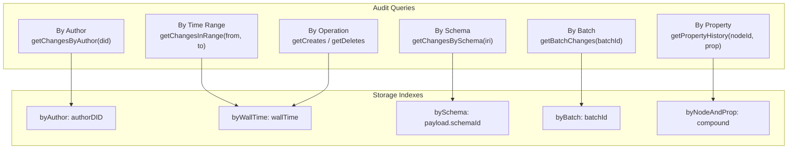

# 03: Audit Index

> Queryable change metadata: filter by author, time range, schema, operation, and property.

**Dependencies:** Step 01 (HistoryEngine types), `@xnetjs/data` (NodeStorageAdapter)

## Overview

The current IndexedDB adapter stores changes with indexes `byNodeId` and `byLamport`, but can't answer questions like "show me all changes by Alice in the last 24 hours" or "what changed in the Invoice schema this week." The AuditIndex adds the necessary indexes and query API.



## Implementation

### 1. Enhanced Storage Adapter

```typescript
// packages/data/src/store/types.ts (additions)

export interface AuditQuery {
  nodeId?: NodeId
  nodeIds?: NodeId[]
  schemaIRI?: SchemaIRI
  author?: DID
  authors?: DID[]
  fromWallTime?: number
  toWallTime?: number
  fromLamport?: number
  toLamport?: number
  operations?: ('create' | 'update' | 'delete' | 'restore')[]
  batchId?: string
  properties?: string[] // only changes touching these properties
  limit?: number // default: 100
  offset?: number // default: 0
  order?: 'asc' | 'desc' // default: 'desc' (newest first)
}

export interface AuditResult {
  changes: NodeChange[]
  total: number // total matching (before limit/offset)
  hasMore: boolean
}

export interface EnhancedNodeStorageAdapter extends NodeStorageAdapter {
  queryChanges(query: AuditQuery): Promise<AuditResult>
  countChanges(query: AuditQuery): Promise<number>
  getChangesByAuthor(author: DID, limit?: number): Promise<NodeChange[]>
  getChangesInTimeRange(from: number, to: number, limit?: number): Promise<NodeChange[]>
  getChangesBySchema(schemaIRI: SchemaIRI, limit?: number): Promise<NodeChange[]>
  getBatchChanges(batchId: string): Promise<NodeChange[]>
}
```

### 2. IndexedDB Adapter Upgrades

```typescript
// packages/data/src/store/indexeddb-adapter.ts (modifications)

// Database version bump: 1 → 2
// New indexes on the 'changes' object store:

request.onupgradeneeded = (event) => {
  const db = request.result
  const oldVersion = event.oldVersion

  if (oldVersion < 1) {
    // ... existing stores and indexes ...
  }

  if (oldVersion < 2) {
    const changesStore = tx.objectStore('changes')

    // Author index
    changesStore.createIndex('byAuthor', 'authorDID')

    // Wall time index (for time-range queries)
    changesStore.createIndex('byWallTime', 'wallTime')

    // Batch ID index (for transaction grouping)
    changesStore.createIndex('byBatch', 'batchId')

    // Compound index: schema + time (for "all Invoice changes this week")
    // Note: IDB compound keys require the values to exist on the object directly
    // payload.schemaId is nested, so we need a workaround:
    // Option A: Denormalize schemaId to top level on write
    // Option B: Maintain a separate index store
    // Going with Option A: add schemaId field at top level during appendChange
  }
}

// Modified appendChange to denormalize for indexing:
async appendChange(change: NodeChange): Promise<void> {
  const indexed = {
    ...change,
    // Denormalized fields for indexing
    _schemaId: change.payload.schemaId ?? this.getSchemaForNode(change.payload.nodeId),
    _operation: this.inferOperation(change),
  }
  // ... store indexed version
}
```

### 3. AuditIndex Class

```typescript
// packages/history/src/audit-index.ts

export interface AuditEntry {
  change: NodeChange
  operation: 'create' | 'update' | 'delete' | 'restore'
  author: DID
  wallTime: number
  lamport: LamportTimestamp
  nodeId: NodeId
  schemaIRI: SchemaIRI
  properties: string[] // which properties changed
  batchId?: string
  batchSize?: number
}

export interface ActivitySummary {
  totalChanges: number
  creates: number
  updates: number
  deletes: number
  restores: number
  authors: DID[]
  firstChange: number
  lastChange: number
  topProperties: { property: string; count: number }[]
}

export class AuditIndex {
  constructor(private storage: EnhancedNodeStorageAdapter) {}

  /** Query changes with full filtering */
  async query(q: AuditQuery): Promise<AuditEntry[]> {
    const result = await this.storage.queryChanges(q)
    return result.changes.map((change) => this.toAuditEntry(change))
  }

  /** Count matching changes (without loading them) */
  async count(q: AuditQuery): Promise<number> {
    return this.storage.countChanges(q)
  }

  /** Get activity summary for a node */
  async getNodeActivity(nodeId: NodeId): Promise<ActivitySummary> {
    const changes = await this.storage.getChanges(nodeId)
    return this.summarize(changes)
  }

  /** Get activity summary for a schema */
  async getSchemaActivity(
    schemaIRI: SchemaIRI,
    timeRange?: [number, number]
  ): Promise<ActivitySummary> {
    const changes = await this.storage.getChangesBySchema(schemaIRI)
    const filtered = timeRange
      ? changes.filter((c) => c.wallTime >= timeRange[0] && c.wallTime <= timeRange[1])
      : changes
    return this.summarize(filtered)
  }

  /** Get activity summary for an author */
  async getAuthorActivity(author: DID, timeRange?: [number, number]): Promise<ActivitySummary> {
    const changes = await this.storage.getChangesByAuthor(author)
    const filtered = timeRange
      ? changes.filter((c) => c.wallTime >= timeRange[0] && c.wallTime <= timeRange[1])
      : changes
    return this.summarize(filtered)
  }

  /** Get changes since a timestamp (for "what's new" badges) */
  async getChangesSince(nodeId: NodeId, since: number): Promise<AuditEntry[]> {
    const result = await this.storage.queryChanges({
      nodeId,
      fromWallTime: since,
      order: 'asc'
    })
    return result.changes.map((c) => this.toAuditEntry(c))
  }

  /** Subscribe to changes matching a query (real-time) */
  subscribe(q: AuditQuery, store: NodeStore, callback: (entry: AuditEntry) => void): () => void {
    return store.subscribe((event) => {
      const entry = this.toAuditEntry(event.change)
      if (this.matchesQuery(entry, q)) {
        callback(entry)
      }
    })
  }

  // --- Private ---

  private toAuditEntry(change: NodeChange): AuditEntry {
    return {
      change,
      operation: this.inferOperation(change),
      author: change.authorDID,
      wallTime: change.wallTime,
      lamport: change.lamport,
      nodeId: change.payload.nodeId,
      schemaIRI: change.payload.schemaId ?? '',
      properties: Object.keys(change.payload.properties ?? {}),
      batchId: change.batchId,
      batchSize: change.batchSize
    }
  }

  private inferOperation(change: NodeChange): AuditEntry['operation'] {
    if (change.payload.deleted === true) return 'delete'
    if (change.payload.deleted === false) return 'restore'
    if (!change.parentHash) return 'create'
    return 'update'
  }

  private matchesQuery(entry: AuditEntry, q: AuditQuery): boolean {
    if (q.nodeId && entry.nodeId !== q.nodeId) return false
    if (q.nodeIds && !q.nodeIds.includes(entry.nodeId)) return false
    if (q.schemaIRI && entry.schemaIRI !== q.schemaIRI) return false
    if (q.author && entry.author !== q.author) return false
    if (q.authors && !q.authors.includes(entry.author)) return false
    if (q.fromWallTime && entry.wallTime < q.fromWallTime) return false
    if (q.toWallTime && entry.wallTime > q.toWallTime) return false
    if (q.operations && !q.operations.includes(entry.operation)) return false
    if (q.batchId && entry.batchId !== q.batchId) return false
    if (q.properties && !q.properties.some((p) => entry.properties.includes(p))) return false
    return true
  }

  private summarize(changes: NodeChange[]): ActivitySummary {
    const propCounts = new Map<string, number>()
    let creates = 0,
      updates = 0,
      deletes = 0,
      restores = 0

    for (const c of changes) {
      const op = this.inferOperation(c)
      if (op === 'create') creates++
      else if (op === 'update') updates++
      else if (op === 'delete') deletes++
      else if (op === 'restore') restores++

      for (const prop of Object.keys(c.payload.properties ?? {})) {
        propCounts.set(prop, (propCounts.get(prop) ?? 0) + 1)
      }
    }

    return {
      totalChanges: changes.length,
      creates,
      updates,
      deletes,
      restores,
      authors: [...new Set(changes.map((c) => c.authorDID))],
      firstChange: changes[0]?.wallTime ?? 0,
      lastChange: changes[changes.length - 1]?.wallTime ?? 0,
      topProperties: [...propCounts.entries()]
        .sort((a, b) => b[1] - a[1])
        .slice(0, 10)
        .map(([property, count]) => ({ property, count }))
    }
  }
}
```

### 4. React Hooks

```typescript
// packages/history/src/hooks.ts (additions)

export function useAudit(query: AuditQuery) {
  const audit = useAuditIndex()
  const [entries, setEntries] = useState<AuditEntry[]>([])
  const [loading, setLoading] = useState(true)
  const [total, setTotal] = useState(0)

  useEffect(() => {
    setLoading(true)
    audit.query(query).then((results) => {
      setEntries(results)
      setTotal(results.length)
      setLoading(false)
    })
  }, [JSON.stringify(query)])

  return { entries, loading, total }
}

export function useNodeActivity(nodeId: NodeId) {
  const audit = useAuditIndex()
  const [activity, setActivity] = useState<ActivitySummary | null>(null)

  useEffect(() => {
    audit.getNodeActivity(nodeId).then(setActivity)
  }, [nodeId])

  return activity
}

export function useChangesSince(nodeId: NodeId, since: number) {
  const audit = useAuditIndex()
  const store = useNodeStore()
  const [changes, setChanges] = useState<AuditEntry[]>([])

  useEffect(() => {
    audit.getChangesSince(nodeId, since).then(setChanges)
    // Also subscribe to new changes
    return audit.subscribe({ nodeId, fromWallTime: since }, store, (entry) => {
      setChanges((prev) => [...prev, entry])
    })
  }, [nodeId, since])

  return changes
}
```

## Checklist

- [x] Define `AuditQuery`, `AuditEntry`, `ActivitySummary` types
- [ ] Add `byAuthor`, `byWallTime`, `byBatch` indexes to IndexedDB adapter
- [ ] Denormalize `schemaId` and `operation` on write for indexing
- [ ] Implement `queryChanges()` on IndexedDB adapter with index-based lookups
- [x] Implement `AuditIndex` class with query, count, summaries
- [x] Implement `matchesQuery()` for real-time subscription filtering
- [x] Implement `subscribe()` for live audit feeds
- [ ] Handle DB version migration (v1 → v2) for existing data
- [x] Create `useAudit`, `useNodeActivity`, `useChangesSince` hooks
- [x] Write tests for all query combinations
- [ ] Benchmark: 10k changes query by author+timeRange < 100ms

---

[Back to README](./README.md) | [Previous: Snapshot Cache](./02-snapshot-cache.md) | [Next: Undo/Redo](./04-undo-redo.md)
