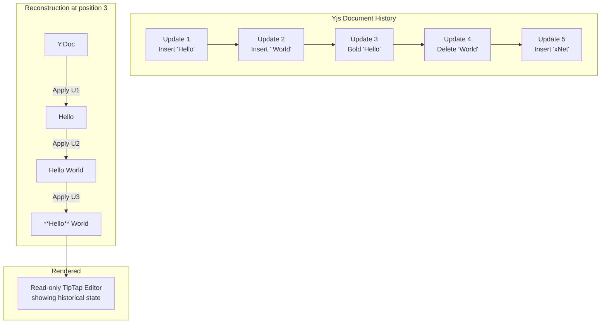

# 06: Document Time Machine

> Scrub through rich text document history: watch text appear, disappear, and change in real time.

**Dependencies:** Step 05 (TimelineScrubber), `@xnetjs/editor` (RichTextEditor), Yjs

## Overview

Documents use Yjs CRDTs for collaborative editing. Yjs stores updates as a binary log that can be replayed. Combined with Yjs snapshots, we can reconstruct the document at any point and render it in a read-only TipTap editor.



## Implementation

### 1. Document History Engine

```typescript
// packages/history/src/document-history.ts

export interface DocumentTimelineEntry {
  index: number
  timestamp: number
  author?: DID
  updateSize: number // bytes in this update
  cumulativeSize: number // total doc size at this point
}

export class DocumentHistoryEngine {
  constructor(private storage: NodeStorageAdapter) {}

  /** Get all Yjs updates for a document, ordered chronologically */
  async getUpdates(nodeId: NodeId): Promise<Uint8Array[]> {
    // Yjs updates are stored as document content
    // We need the individual updates, not the merged state
    const content = await this.storage.getDocumentContent(nodeId)
    if (!content) return []
    // Decode the update log (stored as concatenated updates with length prefixes)
    return this.decodeUpdateLog(content)
  }

  /** Reconstruct a Y.Doc at a specific update index */
  async getDocumentAt(nodeId: NodeId, targetIndex: number): Promise<Y.Doc> {
    const updates = await this.getUpdates(nodeId)
    const doc = new Y.Doc()

    // Apply updates up to targetIndex
    const limit = Math.min(targetIndex + 1, updates.length)
    for (let i = 0; i < limit; i++) {
      Y.applyUpdate(doc, updates[i])
    }

    return doc
  }

  /** Get timeline metadata for all updates */
  async getDocumentTimeline(nodeId: NodeId): Promise<DocumentTimelineEntry[]> {
    const updates = await this.getUpdates(nodeId)
    let cumulativeSize = 0

    return updates.map((update, index) => {
      cumulativeSize += update.byteLength
      return {
        index,
        timestamp: this.extractTimestamp(update),
        author: this.extractAuthor(update),
        updateSize: update.byteLength,
        cumulativeSize
      }
    })
  }

  /** Get total number of updates */
  async getUpdateCount(nodeId: NodeId): Promise<number> {
    const updates = await this.getUpdates(nodeId)
    return updates.length
  }

  // --- Private ---

  private decodeUpdateLog(content: Uint8Array): Uint8Array[] {
    // The update log format: [4-byte length][update bytes][4-byte length][update bytes]...
    const updates: Uint8Array[] = []
    let offset = 0
    const view = new DataView(content.buffer, content.byteOffset, content.byteLength)

    while (offset < content.length) {
      if (offset + 4 > content.length) break
      const length = view.getUint32(offset, true)
      offset += 4
      if (offset + length > content.length) break
      updates.push(content.slice(offset, offset + length))
      offset += length
    }

    return updates
  }

  private extractTimestamp(update: Uint8Array): number {
    // Yjs updates don't natively store timestamps
    // We store them as metadata in our update log format
    // Fallback: use creation order
    return 0
  }

  private extractAuthor(update: Uint8Array): DID | undefined {
    // Same as timestamp — stored in our wrapper format
    return undefined
  }
}
```

### 2. Document ScrubCache

```typescript
// packages/history/src/document-scrub-cache.ts

export class DocumentScrubCache {
  private snapshots = new Map<number, Uint8Array>() // index → Y.Doc encoded state
  private updates: Uint8Array[] = []
  private resolution: number

  constructor(resolution = 20) {
    this.resolution = resolution
  }

  async precompute(nodeId: NodeId, docHistory: DocumentHistoryEngine): Promise<void> {
    this.updates = await docHistory.getUpdates(nodeId)
    if (this.updates.length === 0) return

    const doc = new Y.Doc()
    for (let i = 0; i < this.updates.length; i++) {
      Y.applyUpdate(doc, this.updates[i])
      if (i % this.resolution === 0 || i === this.updates.length - 1) {
        this.snapshots.set(i, Y.encodeStateAsUpdate(doc))
      }
    }
  }

  /** Fast seek: load nearest snapshot, replay few updates */
  getDocAt(index: number): Y.Doc {
    const clamped = Math.max(0, Math.min(index, this.updates.length - 1))
    const nearestSnap = Math.floor(clamped / this.resolution) * this.resolution
    const doc = new Y.Doc()

    // Load snapshot
    const snapData = this.snapshots.get(nearestSnap)
    if (snapData) {
      Y.applyUpdate(doc, snapData)
    }

    // Replay remainder
    for (let i = nearestSnap + 1; i <= clamped; i++) {
      Y.applyUpdate(doc, this.updates[i])
    }

    return doc
  }

  get totalUpdates(): number {
    return this.updates.length
  }
}
```

### 3. HistoricalDocumentView Component

```typescript
// packages/editor/src/components/HistoricalDocumentView.tsx

export interface HistoricalDocumentViewProps {
  nodeId: NodeId
  position: number                   // which update to show
  totalUpdates: number
  showDiff?: boolean                 // highlight what changed at this position
}

export function HistoricalDocumentView({
  nodeId,
  position,
  totalUpdates,
  showDiff = true,
}: HistoricalDocumentViewProps) {
  const scrubCache = useRef<DocumentScrubCache | null>(null)
  const [doc, setDoc] = useState<Y.Doc | null>(null)
  const [loading, setLoading] = useState(true)

  // Pre-compute on mount
  useEffect(() => {
    const cache = new DocumentScrubCache(20)
    const docHistory = new DocumentHistoryEngine(storage)
    setLoading(true)
    cache.precompute(nodeId, docHistory).then(() => {
      scrubCache.current = cache
      setDoc(cache.getDocAt(position))
      setLoading(false)
    })
    return () => { scrubCache.current = null }
  }, [nodeId])

  // Update doc on position change
  useEffect(() => {
    if (!scrubCache.current) return
    const newDoc = scrubCache.current.getDocAt(position)
    setDoc(newDoc)
  }, [position])

  if (loading || !doc) return <div className="loading">Loading history...</div>

  const fragment = doc.getXmlFragment('content')

  return (
    <div className="historical-document-view">
      <div className="historical-badge">
        Viewing update {position + 1} of {totalUpdates}
      </div>
      <RichTextEditor
        fragment={fragment}
        editable={false}
        placeholder=""
      />
    </div>
  )
}
```

### 4. Full Document Time Machine

```typescript
// packages/editor/src/components/DocumentTimeMachine.tsx

export function DocumentTimeMachine({ nodeId }: { nodeId: NodeId }) {
  const [enabled, setEnabled] = useState(false)
  const [position, setPosition] = useState(0)
  const [timeline, setTimeline] = useState<DocumentTimelineEntry[]>([])
  const docHistory = useMemo(() => new DocumentHistoryEngine(storage), [])

  useEffect(() => {
    if (!enabled) return
    docHistory.getDocumentTimeline(nodeId).then(tl => {
      setTimeline(tl)
      setPosition(tl.length - 1)
    })
  }, [enabled, nodeId])

  if (!enabled) {
    return (
      <button className="time-machine-btn" onClick={() => setEnabled(true)}>
        History
      </button>
    )
  }

  const isLive = position === timeline.length - 1

  return (
    <div className="document-time-machine">
      {/* Historical or live editor */}
      {isLive ? (
        <LiveDocumentEditor nodeId={nodeId} />
      ) : (
        <HistoricalDocumentView
          nodeId={nodeId}
          position={position}
          totalUpdates={timeline.length}
        />
      )}

      {/* Scrubber */}
      <div className="document-time-machine-controls">
        <TimelineScrubber
          timeline={timeline.map((t, i) => ({
            index: i,
            change: {} as any,  // simplified for doc updates
            properties: [],
            operation: 'update',
            author: t.author ?? '',
            wallTime: t.timestamp,
            lamport: { time: i, author: '' },
          }))}
          position={position}
          onPositionChange={setPosition}
          onRestoreClick={(idx) => {
            // Restore: replace current doc content with historical
            restoreDocumentAt(nodeId, idx, docHistory)
            setEnabled(false)
          }}
        />
      </div>
    </div>
  )
}

async function restoreDocumentAt(
  nodeId: NodeId,
  targetIndex: number,
  docHistory: DocumentHistoryEngine
): Promise<void> {
  const historicalDoc = await docHistory.getDocumentAt(nodeId, targetIndex)
  const currentDoc = getCurrentYDoc(nodeId)

  // Replace current content with historical content
  currentDoc.transact(() => {
    const fragment = currentDoc.getXmlFragment('content')
    fragment.delete(0, fragment.length)
    const historicalFragment = historicalDoc.getXmlFragment('content')
    // Copy historical content to current doc
    // This creates a new change that syncs to peers
    fragment.insert(0, historicalFragment.toArray())
  })
}
```

## Update Log Format

Currently Yjs documents are stored as a single merged state vector. For time travel, we need individual updates preserved:

```typescript
// Enhanced document content storage format:

interface DocumentUpdateLog {
  version: 1
  updates: DocumentUpdate[]
}

interface DocumentUpdate {
  data: Uint8Array // raw Yjs update
  timestamp: number // when this update was applied
  author?: DID // who made it
  size: number // byte size
}

// Binary format for efficient storage:
// [1 byte: version]
// [4 bytes: update count]
// For each update:
//   [4 bytes: data length]
//   [8 bytes: timestamp (float64)]
//   [data bytes]
```

This requires modifying how `useDocument` stores Yjs updates — instead of merging into one state, append individual updates to a log.

## Checklist

- [ ] Implement `DocumentHistoryEngine` with update log decoding
- [ ] Implement `DocumentScrubCache` with Yjs snapshot pre-computation
- [ ] Build `HistoricalDocumentView` component (read-only editor at historical state)
- [ ] Build `DocumentTimeMachine` component with scrubber integration
- [ ] Modify document content storage to preserve individual updates (update log format)
- [ ] Implement document restore (historical -> current via Yjs transaction)
- [ ] Handle edge cases: empty doc, very large docs, concurrent CRDT updates
- [ ] Style the historical view with appropriate badge/overlay
- [ ] Performance: ensure scrubbing a 1000-update doc is smooth
- [ ] Test with collaborative scenario (multiple authors' updates interleaved)

> Note: Document-specific history (Yjs update log) and UI components are deferred to UI integration phase. The core HistoryEngine supports structured node history which covers database/property-level time travel.

---

[Back to README](./README.md) | [Previous: Timeline Scrubber](./05-timeline-scrubber.md) | [Next: Database Time Machine](./07-database-time-machine.md)
