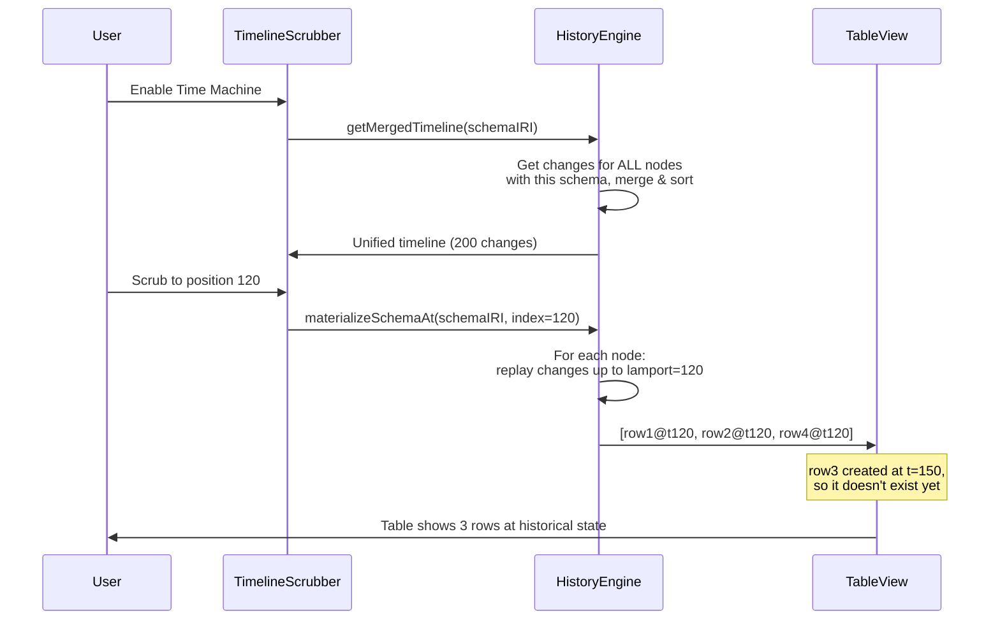

# 07: Database Time Machine

> Scrub through database history: watch rows appear, values change, and records come and go.

**Dependencies:** Step 05 (TimelineScrubber, ScrubCache), Step 01 (HistoryEngine), `@xnetjs/views` (TableView, BoardView)

## Overview

Each database row is a Node with its own change log. The Database Time Machine merges all row timelines into a single unified timeline, then reconstructs all rows at any point. Rows that haven't been created yet at the scrubbed position are hidden.



## Implementation

### 1. Schema Timeline (Merged Multi-Node Timeline)

```typescript
// packages/history/src/schema-timeline.ts

export interface SchemaTimelineEntry extends TimelineEntry {
  nodeId: NodeId // which row/node this change belongs to
  nodeName?: string // display name (e.g., title property)
}

export class SchemaTimeline {
  constructor(
    private storage: NodeStorageAdapter,
    private engine: HistoryEngine
  ) {}

  /** Get a merged timeline of all changes across all nodes of a schema */
  async getMergedTimeline(schemaIRI: SchemaIRI): Promise<SchemaTimelineEntry[]> {
    // Get all nodes of this schema
    const nodes = await this.storage.listNodes({ schemaIRI })

    // Get all changes for all these nodes
    const allChanges: { change: NodeChange; nodeId: NodeId }[] = []
    await Promise.all(
      nodes.map(async (node) => {
        const changes = await this.storage.getChanges(node.id)
        for (const change of changes) {
          allChanges.push({ change, nodeId: node.id })
        }
      })
    )

    // Sort by Lamport time (global causal order)
    allChanges.sort((a, b) => compareLamportTimestamps(a.change.lamport, b.change.lamport))

    // Convert to timeline entries
    return allChanges.map(({ change, nodeId }, index) => ({
      index,
      change,
      nodeId,
      properties: Object.keys(change.payload.properties ?? {}),
      operation: this.inferOperation(change),
      author: change.authorDID,
      wallTime: change.wallTime,
      lamport: change.lamport,
      batchId: change.batchId,
      batchSize: change.batchSize
    }))
  }

  /** Reconstruct all nodes of a schema at a specific timeline position */
  async materializeSchemaAt(
    schemaIRI: SchemaIRI,
    timeline: SchemaTimelineEntry[],
    targetIndex: number
  ): Promise<FlatNode[]> {
    if (targetIndex < 0 || targetIndex >= timeline.length) return []

    // Get the Lamport time at the target position
    const targetLamport = timeline[targetIndex].change.lamport.time

    // Group changes by nodeId, filtered to <= targetLamport
    const changesByNode = new Map<NodeId, NodeChange[]>()
    for (let i = 0; i <= targetIndex; i++) {
      const entry = timeline[i]
      if (!changesByNode.has(entry.nodeId)) {
        changesByNode.set(entry.nodeId, [])
      }
      changesByNode.get(entry.nodeId)!.push(entry.change)
    }

    // Reconstruct each node
    const results: FlatNode[] = []
    for (const [nodeId, changes] of changesByNode) {
      const sorted = topologicalSort(changes)
      let state = this.createEmptyState(nodeId, sorted[0])
      for (const change of sorted) {
        state = applyChangeToState(state, change)
      }
      // Skip deleted nodes
      if (!state.deleted) {
        results.push(flattenNode(state))
      }
    }

    return results
  }

  private inferOperation(change: NodeChange): TimelineEntry['operation'] {
    if (change.payload.deleted === true) return 'delete'
    if (change.payload.deleted === false) return 'restore'
    if (!change.parentHash) return 'create'
    return 'update'
  }

  private createEmptyState(nodeId: NodeId, firstChange: NodeChange): NodeState {
    return {
      id: nodeId,
      schemaId: firstChange.payload.schemaId ?? '',
      properties: {},
      timestamps: {},
      deleted: false,
      createdAt: firstChange.wallTime,
      createdBy: firstChange.authorDID,
      updatedAt: firstChange.wallTime,
      updatedBy: firstChange.authorDID
    }
  }
}
```

### 2. Database ScrubCache (Multi-Node)

```typescript
// packages/history/src/schema-scrub-cache.ts

export class SchemaScrubCache {
  private cache = new Map<number, FlatNode[]>() // position → all rows at that point
  private timeline: SchemaTimelineEntry[] = []
  private resolution: number

  constructor(resolution = 20) {
    this.resolution = resolution
  }

  async precompute(schemaIRI: SchemaIRI, schemaTimeline: SchemaTimeline): Promise<void> {
    this.timeline = await schemaTimeline.getMergedTimeline(schemaIRI)
    if (this.timeline.length === 0) return

    // Pre-compute states at intervals
    for (let i = 0; i < this.timeline.length; i += this.resolution) {
      const rows = await schemaTimeline.materializeSchemaAt(schemaIRI, this.timeline, i)
      this.cache.set(i, rows)
    }
    // Always cache the final state
    const lastIdx = this.timeline.length - 1
    if (!this.cache.has(lastIdx)) {
      const rows = await schemaTimeline.materializeSchemaAt(schemaIRI, this.timeline, lastIdx)
      this.cache.set(lastIdx, rows)
    }
  }

  /** Get rows at a position (uses nearest cache + incremental) */
  async getRowsAt(
    position: number,
    schemaTimeline: SchemaTimeline,
    schemaIRI: SchemaIRI
  ): Promise<FlatNode[]> {
    const clamped = Math.max(0, Math.min(position, this.timeline.length - 1))

    // Check exact cache hit
    if (this.cache.has(clamped)) return this.cache.get(clamped)!

    // Find nearest cached position before target
    const nearestCacheIndex = Math.floor(clamped / this.resolution) * this.resolution
    if (this.cache.has(nearestCacheIndex) && clamped - nearestCacheIndex < this.resolution) {
      // Close enough — just reconstruct from scratch for this small range
      return schemaTimeline.materializeSchemaAt(schemaIRI, this.timeline, clamped)
    }

    // Fallback: full reconstruction
    return schemaTimeline.materializeSchemaAt(schemaIRI, this.timeline, clamped)
  }

  get totalChanges(): number {
    return this.timeline.length
  }

  getTimeline(): SchemaTimelineEntry[] {
    return this.timeline
  }
}
```

### 3. DatabaseTimeMachine Component

```typescript
// packages/views/src/timeline/DatabaseTimeMachine.tsx

export interface DatabaseTimeMachineProps {
  schemaIRI: SchemaIRI
  schema: DefinedSchema
  viewConfig: ViewConfig
  liveNodes: FlatNode[]              // current (live) nodes
}

export function DatabaseTimeMachine({
  schemaIRI,
  schema,
  viewConfig,
  liveNodes,
}: DatabaseTimeMachineProps) {
  const [enabled, setEnabled] = useState(false)
  const [position, setPosition] = useState(0)
  const [timeline, setTimeline] = useState<SchemaTimelineEntry[]>([])
  const [historicalRows, setHistoricalRows] = useState<FlatNode[]>([])
  const [highlights, setHighlights] = useState<CellHighlight[]>([])
  const [loading, setLoading] = useState(false)

  const schemaTimeline = useMemo(() => new SchemaTimeline(storage, historyEngine), [])

  // Load timeline when enabled
  useEffect(() => {
    if (!enabled) return
    setLoading(true)
    schemaTimeline.getMergedTimeline(schemaIRI).then(tl => {
      setTimeline(tl)
      setPosition(tl.length - 1)
      setHistoricalRows(liveNodes)
      setLoading(false)
    })
  }, [enabled, schemaIRI])

  // Reconstruct on position change
  useEffect(() => {
    if (!enabled || timeline.length === 0) return
    schemaTimeline.materializeSchemaAt(schemaIRI, timeline, position)
      .then(rows => {
        setHistoricalRows(rows)
        // Compute highlights (what changed at this position)
        const entry = timeline[position]
        if (entry) {
          setHighlights(entry.properties.map(prop => ({
            nodeId: entry.nodeId,
            property: prop,
            type: entry.operation === 'create' ? 'added' : 'modified',
          })))
        }
      })
  }, [position, enabled])

  const isLive = !enabled || position === timeline.length - 1
  const displayNodes = isLive ? liveNodes : historicalRows

  return (
    <div className="database-time-machine">
      {/* Toggle button */}
      <button
        className={`time-machine-toggle ${enabled ? 'active' : ''}`}
        onClick={() => setEnabled(!enabled)}
      >
        History {enabled && `(${timeline.length} changes)`}
      </button>

      {/* Banner when viewing historical state */}
      {enabled && !isLive && (
        <div className="time-machine-banner">
          <span>
            Viewing state at {formatDate(timeline[position]?.wallTime)}
            {' — '}{historicalRows.length} rows
          </span>
          <button onClick={() => setPosition(timeline.length - 1)}>Return to Present</button>
          <button onClick={() => restoreSchemaAt(schemaIRI, timeline, position, schemaTimeline)}>
            Restore This State
          </button>
        </div>
      )}

      {/* The actual view (table/board/etc) with historical data */}
      <ViewRenderer
        viewType={viewConfig.type}
        nodes={displayNodes}
        schema={schema}
        viewConfig={viewConfig}
        onUpdateNode={isLive ? handleUpdate : () => {}}  // read-only when historical
        onDeleteNode={isLive ? handleDelete : () => {}}
        onCreateNode={isLive ? handleCreate : () => {}}
        onNavigate={handleNavigate}
        isLoading={loading}
        highlights={enabled ? highlights : undefined}
      />

      {/* Timeline scrubber */}
      {enabled && (
        <TimelineScrubber
          timeline={timeline}
          position={position}
          onPositionChange={setPosition}
          showAuthors={true}
        />
      )}
    </div>
  )
}

interface CellHighlight {
  nodeId: NodeId
  property: string
  type: 'added' | 'modified' | 'removed'
}
```

### 4. Restoring Database State

```typescript
// Restore all rows to a historical point

async function restoreSchemaAt(
  schemaIRI: SchemaIRI,
  timeline: SchemaTimelineEntry[],
  targetIndex: number,
  schemaTimeline: SchemaTimeline
): Promise<void> {
  const store = getNodeStore()

  // Get historical state
  const historicalRows = await schemaTimeline.materializeSchemaAt(schemaIRI, timeline, targetIndex)
  const historicalMap = new Map(historicalRows.map((r) => [r.id, r]))

  // Get current state
  const currentRows = await store.list({ schemaIRI })
  const currentMap = new Map(currentRows.map((r) => [r.id, r]))

  // Compute operations needed
  const operations: TransactionOperation[] = []

  // Rows that exist now but didn't exist then → delete
  for (const [id] of currentMap) {
    if (!historicalMap.has(id)) {
      operations.push({ type: 'delete', nodeId: id })
    }
  }

  // Rows that existed then → update to historical values
  for (const [id, historicalNode] of historicalMap) {
    const current = currentMap.get(id)
    if (!current) {
      // Row was deleted since then → restore (if it exists in change log)
      operations.push({ type: 'restore', nodeId: id })
      operations.push({ type: 'update', nodeId: id, payload: historicalNode.properties })
    } else {
      // Diff and update
      const updates: Record<string, unknown> = {}
      for (const [key, value] of Object.entries(historicalNode.properties)) {
        if (!deepEqual(current.properties[key], value)) {
          updates[key] = value
        }
      }
      if (Object.keys(updates).length > 0) {
        operations.push({ type: 'update', nodeId: id, payload: updates })
      }
    }
  }

  if (operations.length > 0) {
    await store.transaction(operations)
  }
}
```

### 5. Cell Highlighting in Table View

Add visual indicators for which cells changed at the current scrubber position:

```typescript
// Addition to TableView: highlight cells that changed

interface TableViewProps {
  // ... existing props ...
  highlights?: CellHighlight[]
}

// In cell rendering:
function getCellClassName(nodeId: NodeId, property: string, highlights?: CellHighlight[]): string {
  if (!highlights) return ''
  const highlight = highlights.find((h) => h.nodeId === nodeId && h.property === property)
  if (!highlight) return ''
  return `cell-highlight-${highlight.type}` // 'cell-highlight-added', 'cell-highlight-modified'
}
```

## Checklist

- [x] Implement `SchemaTimeline` with merged multi-node timeline
- [x] Implement `materializeMultipleAt()` reconstructing multiple rows (in HistoryEngine)
- [x] Implement `SchemaScrubCache` for smooth database scrubbing
- [ ] Build `DatabaseTimeMachine` component with enable/disable toggle
- [ ] Add historical state banner with "Return to Present" and "Restore" buttons
- [ ] Implement cell highlighting for changed values
- [x] Handle row creation/deletion in timeline (rows appear/disappear)
- [x] Implement `restoreSchemaAt()` using transactions
- [ ] Pass `readOnly` flag to view when showing historical state
- [ ] Performance: test with 100 rows, 1000 total changes
- [x] Handle the case where a schema has no history yet (empty state)

> Note: Database Time Machine UI components are deferred to UI integration phase. The core `HistoryEngine.materializeMultipleAt()` provides the reconstruction foundation.

---

[Back to README](./README.md) | [Previous: Document Time Machine](./06-document-time-machine.md) | [Next: Diff & Blame](./08-diff-blame.md)
