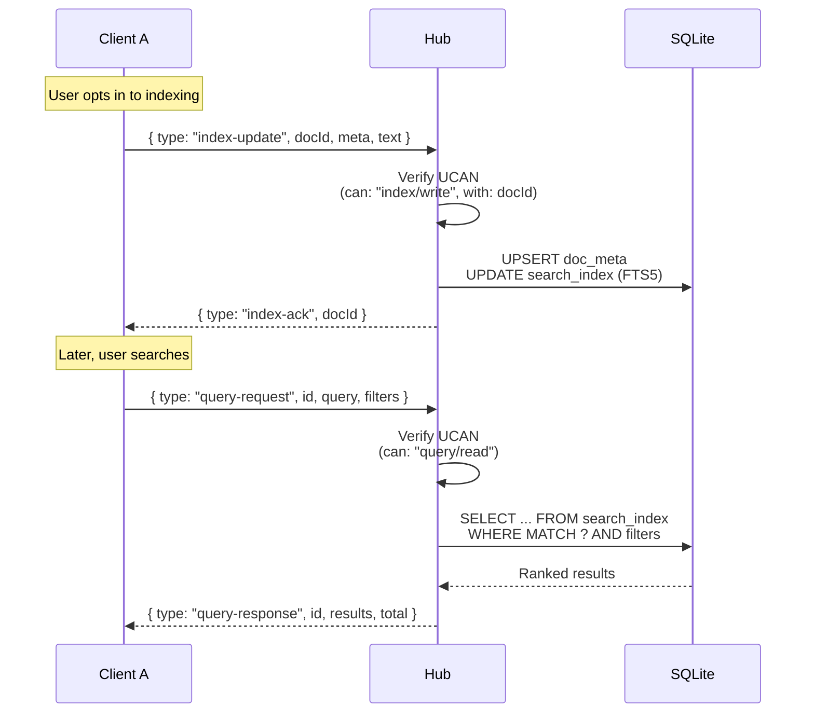

# 06: Query Engine

> Server-side full-text search and metadata queries over WebSocket

**Dependencies:** `01-package-scaffold.md`, `02-ucan-auth.md`, `04-sqlite-storage.md`
**Modifies:** `packages/hub/src/services/query.ts`, `packages/hub/src/services/signaling.ts`

## Codebase Status (Feb 2026)

| Existing Asset          | Location                    | Relevance                                                                                   |
| ----------------------- | --------------------------- | ------------------------------------------------------------------------------------------- |
| `useQuery` hook         | `packages/react/src/hooks/` | Currently does full table scan + client-side JS filtering. No comparison operators, no FTS. |
| NodeStore queries       | `packages/data/src/store/`  | `listNodes()`, `countNodes()` — basic iteration only                                        |
| `@xnetjs/query` package | `packages/query/`           | Exists but unclear scope — may contain query primitives                                     |

### Alignment with Exploration 0042 (Unified Query API)

> The query protocol sent over WebSocket should use the **JSON-serializable query descriptor** format from [Exploration 0042](../../explorations/0042_[_]_UNIFIED_QUERY_API.md). This means the same `useQuery()` call can execute locally (full table scan) or be offloaded to the hub (FTS5 + indexes) transparently. The hub query engine is the server-side complement to the client-side query engine.
>
> Key design from 0042:
>
> - Filter operators as functions: `eq()`, `gt()`, `contains()`, `search()`
> - Results include `completeness: 'full' | 'partial'` + `stubs[]`
> - Hub-side FTS5, compound property indexes, and vector indexes complement lightweight client indexes

> **No server-side query engine exists yet.** This is entirely new code.

## Overview

The query engine enables clients to search documents stored on the hub using full-text search (SQLite FTS5) and metadata filters. Queries are sent over the existing WebSocket connection using a new message type (`query-request` / `query-response`). Documents are only searchable if the owner explicitly opts in by sending an `index-update` message with metadata and text content.



## Implementation

### 1. Query Service

```typescript
// packages/hub/src/services/query.ts

import type { HubStorage, SearchOptions, SearchResult, DocMeta } from '../storage/interface'

export interface QueryRequest {
  type: 'query-request'
  /** Client-generated request ID for correlation */
  id: string
  /** FTS5 query string (supports AND, OR, NOT, prefix*) */
  query: string
  /** Optional filters */
  filters?: {
    schemaIri?: string
    ownerDid?: string
  }
  /** Pagination */
  limit?: number
  offset?: number
}

export interface QueryResponse {
  type: 'query-response'
  /** Matches the request ID */
  id: string
  results: SearchResult[]
  total: number
  /** Time taken in ms */
  took: number
}

export interface IndexUpdate {
  type: 'index-update'
  docId: string
  meta: {
    schemaIri: string
    title: string
    properties?: Record<string, unknown>
  }
  /** Plaintext content for full-text indexing (client decides what to share) */
  text?: string
}

export interface IndexAck {
  type: 'index-ack'
  docId: string
  indexed: boolean
}

/**
 * Query service handles full-text search and metadata queries.
 * All indexing is opt-in: clients explicitly send index-update messages.
 */
export class QueryService {
  constructor(private storage: HubStorage) {}

  /**
   * Handle a query request and return results.
   */
  async handleQuery(request: QueryRequest): Promise<QueryResponse> {
    const start = Date.now()

    const options: SearchOptions = {
      schemaIri: request.filters?.schemaIri,
      ownerDid: request.filters?.ownerDid,
      limit: Math.min(request.limit ?? 20, 100), // Cap at 100
      offset: request.offset ?? 0
    }

    // Sanitize FTS5 query (basic injection prevention)
    const safeQuery = sanitizeFtsQuery(request.query)

    const results = await this.storage.search(safeQuery, options)

    return {
      type: 'query-response',
      id: request.id,
      results,
      total: results.length, // TODO: separate COUNT query for true total
      took: Date.now() - start
    }
  }

  /**
   * Handle an index update from a client.
   * Stores metadata and optionally indexes text content for FTS.
   */
  async handleIndexUpdate(docId: string, ownerDid: string, update: IndexUpdate): Promise<IndexAck> {
    const now = Date.now()
    const existing = await this.storage.getDocMeta(docId)

    const meta: DocMeta = {
      docId,
      ownerDid,
      schemaIri: update.meta.schemaIri,
      title: update.meta.title,
      properties: update.meta.properties,
      createdAt: existing?.createdAt ?? now,
      updatedAt: now
    }

    await this.storage.setDocMeta(docId, meta)

    // If text content provided, update the FTS body
    // The FTS trigger handles title via doc_meta, but body needs explicit update
    if (update.text !== undefined) {
      await this.updateSearchBody(docId, update.text)
    }

    return {
      type: 'index-ack',
      docId,
      indexed: true
    }
  }

  /**
   * Remove a document from the search index.
   */
  async removeFromIndex(docId: string): Promise<void> {
    // Deleting doc_meta triggers the FTS delete trigger
    // For now, we update with empty content
    const existing = await this.storage.getDocMeta(docId)
    if (existing) {
      await this.storage.setDocMeta(docId, {
        ...existing,
        title: '',
        updatedAt: Date.now()
      })
    }
  }

  private async updateSearchBody(docId: string, text: string): Promise<void> {
    // This requires a direct FTS update that the storage interface
    // doesn't expose generically. Use the storage's search body update
    // if available, otherwise skip.
    //
    // For SQLite: UPDATE search_index SET body = ? WHERE doc_id = ?
    // The SQLite adapter exposes this via a custom method.
    if ('updateSearchBody' in this.storage) {
      await (this.storage as any).updateSearchBody(docId, text)
    }
  }
}

/**
 * Sanitize an FTS5 query to prevent injection.
 * Allows: words, AND, OR, NOT, quotes, prefix*
 * Removes: special FTS5 operators that could cause errors
 */
function sanitizeFtsQuery(query: string): string {
  // Remove problematic characters but keep FTS5 operators
  return query
    .replace(/[;{}[\]\\]/g, '') // Remove shell/SQL-like chars
    .replace(/\b(NEAR|COLUMN)\b/gi, '') // Remove advanced operators
    .trim()
    .slice(0, 500) // Cap query length
}
```

### 2. WebSocket Message Handling

```typescript
// Addition to packages/hub/src/services/signaling.ts (message handler)

import type { QueryService, QueryRequest, IndexUpdate } from './query'
import type { AuthContext } from '../auth/ucan'

/**
 * Extended message types for query protocol.
 * Added to the existing signaling message handler.
 */
export function handleQueryMessages(queryService: QueryService, auth: AuthContext) {
  return {
    async handleMessage(data: any): Promise<object | null> {
      switch (data.type) {
        case 'query-request': {
          if (!auth.can('query/read', '*')) {
            return { type: 'query-error', id: data.id, error: 'Unauthorized' }
          }
          return queryService.handleQuery(data as QueryRequest)
        }

        case 'index-update': {
          const update = data as IndexUpdate
          if (!auth.can('index/write', update.docId)) {
            return { type: 'index-error', docId: update.docId, error: 'Unauthorized' }
          }
          return queryService.handleIndexUpdate(update.docId, auth.did, update)
        }

        case 'index-remove': {
          if (!auth.can('index/write', data.docId)) {
            return { type: 'index-error', docId: data.docId, error: 'Unauthorized' }
          }
          await queryService.removeFromIndex(data.docId)
          return { type: 'index-ack', docId: data.docId, indexed: false }
        }

        default:
          return null // Not a query message, pass through
      }
    }
  }
}
```

### 3. Client-Side Query Helper

```typescript
// packages/hub/src/client/query-client.ts
// (Reference implementation — actual client code lives in @xnetjs/react)

/**
 * Helper for sending query requests over an existing WebSocket.
 * This shows the protocol from the client perspective.
 */
export class QueryClient {
  private pending = new Map<
    string,
    {
      resolve: (value: any) => void
      reject: (error: Error) => void
      timeout: ReturnType<typeof setTimeout>
    }
  >()

  constructor(private ws: WebSocket) {
    this.ws.addEventListener('message', (event) => {
      const msg = JSON.parse(event.data)
      if (msg.type === 'query-response' || msg.type === 'query-error') {
        const pending = this.pending.get(msg.id)
        if (pending) {
          clearTimeout(pending.timeout)
          this.pending.delete(msg.id)
          if (msg.type === 'query-error') {
            pending.reject(new Error(msg.error))
          } else {
            pending.resolve(msg)
          }
        }
      }
    })
  }

  /**
   * Send a search query and wait for results.
   */
  search(
    query: string,
    options?: {
      schemaIri?: string
      ownerDid?: string
      limit?: number
      offset?: number
      timeoutMs?: number
    }
  ): Promise<{ results: any[]; total: number; took: number }> {
    const id = crypto.randomUUID()
    const timeoutMs = options?.timeoutMs ?? 5000

    return new Promise((resolve, reject) => {
      const timeout = setTimeout(() => {
        this.pending.delete(id)
        reject(new Error('Query timeout'))
      }, timeoutMs)

      this.pending.set(id, { resolve, reject, timeout })

      this.ws.send(
        JSON.stringify({
          type: 'query-request',
          id,
          query,
          filters: {
            schemaIri: options?.schemaIri,
            ownerDid: options?.ownerDid
          },
          limit: options?.limit,
          offset: options?.offset
        })
      )
    })
  }

  /**
   * Send a document's metadata + text for indexing.
   */
  index(docId: string, meta: { schemaIri: string; title: string }, text?: string): void {
    this.ws.send(
      JSON.stringify({
        type: 'index-update',
        docId,
        meta,
        text
      })
    )
  }

  /**
   * Remove a document from the search index.
   */
  removeFromIndex(docId: string): void {
    this.ws.send(
      JSON.stringify({
        type: 'index-remove',
        docId
      })
    )
  }

  destroy(): void {
    for (const { timeout } of this.pending.values()) {
      clearTimeout(timeout)
    }
    this.pending.clear()
  }
}
```

### 4. SQLite FTS5 Body Update Extension

```typescript
// Addition to packages/hub/src/storage/sqlite.ts

// Add to the prepared statements:
const stmts = {
  // ... existing stmts ...
  updateSearchBody: db.prepare(`
    INSERT INTO search_index(search_index, rowid, doc_id, title, body, schema_iri, owner_did)
    SELECT 'delete', rowid, doc_id, title, body, schema_iri, owner_did
    FROM search_index WHERE doc_id = ?;
  `),
  insertSearchBody: db.prepare(`
    INSERT INTO search_index(doc_id, title, body, schema_iri, owner_did)
    SELECT doc_id, title, ?, schema_iri, owner_did FROM doc_meta WHERE doc_id = ?
  `)
}

// Add method to storage object:
const storage = {
  // ... existing methods ...

  /**
   * Update the full-text search body for a document.
   * Called when client sends index-update with text content.
   */
  async updateSearchBody(docId: string, text: string): Promise<void> {
    const updateFn = db.transaction(() => {
      stmts.updateSearchBody.run(docId)
      stmts.insertSearchBody.run(text, docId)
    })
    updateFn()
  }
}
```

## Tests

```typescript
// packages/hub/test/query.test.ts

import { describe, it, expect, beforeAll, afterAll } from 'vitest'
import { WebSocket } from 'ws'
import { createHub, type HubInstance } from '../src'

describe('Query Engine', () => {
  let hub: HubInstance
  const PORT = 14448

  beforeAll(async () => {
    hub = await createHub({ port: PORT, auth: false, storage: 'memory' })
    await hub.start()
  })

  afterAll(async () => {
    await hub.stop()
  })

  function connect(): Promise<WebSocket> {
    return new Promise((resolve) => {
      const ws = new WebSocket(`ws://localhost:${PORT}`)
      ws.on('open', () => resolve(ws))
    })
  }

  function sendAndWait(ws: WebSocket, msg: object, matchType: string): Promise<any> {
    return new Promise((resolve) => {
      const handler = (raw: Buffer) => {
        const data = JSON.parse(raw.toString())
        if (data.type === matchType) {
          ws.off('message', handler)
          resolve(data)
        }
      }
      ws.on('message', handler)
      ws.send(JSON.stringify(msg))
    })
  }

  it('indexes a document and searches for it', async () => {
    const ws = await connect()

    // Index a document
    const ack = await sendAndWait(
      ws,
      {
        type: 'index-update',
        docId: 'search-doc-1',
        meta: {
          schemaIri: 'xnet://xnet.dev/Page',
          title: 'Quarterly Budget Review'
        },
        text: 'We reviewed the Q4 budget and found significant savings in infrastructure costs.'
      },
      'index-ack'
    )

    expect(ack.indexed).toBe(true)

    // Search for it
    const response = await sendAndWait(
      ws,
      {
        type: 'query-request',
        id: 'q-1',
        query: 'budget'
      },
      'query-response'
    )

    expect(response.id).toBe('q-1')
    expect(response.results.length).toBeGreaterThanOrEqual(1)
    expect(response.results[0].docId).toBe('search-doc-1')

    ws.close()
  })

  it('filters by schema IRI', async () => {
    const ws = await connect()

    // Index two docs with different schemas
    await sendAndWait(
      ws,
      {
        type: 'index-update',
        docId: 'page-1',
        meta: { schemaIri: 'xnet://xnet.dev/Page', title: 'Design Notes' }
      },
      'index-ack'
    )

    await sendAndWait(
      ws,
      {
        type: 'index-update',
        docId: 'task-1',
        meta: { schemaIri: 'xnet://xnet.dev/Task', title: 'Design Review Task' }
      },
      'index-ack'
    )

    // Search with schema filter
    const response = await sendAndWait(
      ws,
      {
        type: 'query-request',
        id: 'q-2',
        query: 'Design',
        filters: { schemaIri: 'xnet://xnet.dev/Task' }
      },
      'query-response'
    )

    expect(response.results.every((r: any) => r.schemaIri === 'xnet://xnet.dev/Task')).toBe(true)

    ws.close()
  })

  it('removes document from index', async () => {
    const ws = await connect()

    await sendAndWait(
      ws,
      {
        type: 'index-update',
        docId: 'remove-me',
        meta: { schemaIri: 'xnet://xnet.dev/Page', title: 'Temporary Document' }
      },
      'index-ack'
    )

    const ack = await sendAndWait(
      ws,
      {
        type: 'index-remove',
        docId: 'remove-me'
      },
      'index-ack'
    )

    expect(ack.indexed).toBe(false)

    // Search should not find it
    const response = await sendAndWait(
      ws,
      {
        type: 'query-request',
        id: 'q-3',
        query: 'Temporary'
      },
      'query-response'
    )

    expect(response.results.find((r: any) => r.docId === 'remove-me')).toBeUndefined()

    ws.close()
  })

  it('handles empty query gracefully', async () => {
    const ws = await connect()

    const response = await sendAndWait(
      ws,
      {
        type: 'query-request',
        id: 'q-empty',
        query: ''
      },
      'query-response'
    )

    expect(response.results).toEqual([])
    ws.close()
  })

  it('respects pagination', async () => {
    const ws = await connect()

    // Index 5 documents
    for (let i = 0; i < 5; i++) {
      await sendAndWait(
        ws,
        {
          type: 'index-update',
          docId: `page-${i}`,
          meta: { schemaIri: 'xnet://xnet.dev/Page', title: `Alpha Document ${i}` }
        },
        'index-ack'
      )
    }

    const response = await sendAndWait(
      ws,
      {
        type: 'query-request',
        id: 'q-page',
        query: 'Alpha',
        limit: 2,
        offset: 0
      },
      'query-response'
    )

    expect(response.results.length).toBeLessThanOrEqual(2)

    ws.close()
  })
})
```

## Checklist

- [x] Implement `QueryService` with handleQuery and handleIndexUpdate
- [x] Add `query-request` / `query-response` message types to signaling
- [x] Add `index-update` / `index-ack` message types
- [x] Implement FTS5 query sanitization
- [x] Add `updateSearchBody` to SQLite storage adapter
- [x] Create `QueryClient` reference implementation
- [x] Add UCAN capability checks (query/read, index/write)
- [x] Write query engine tests (search, filter, paginate, remove)
- [x] Cap query length and result limit to prevent abuse
- [ ] Document FTS5 query syntax for client developers

---

[← Previous: Backup API](./05-backup-api.md) | [Back to README](./README.md) | [Next: Docker Deploy →](./07-docker-deploy.md)
