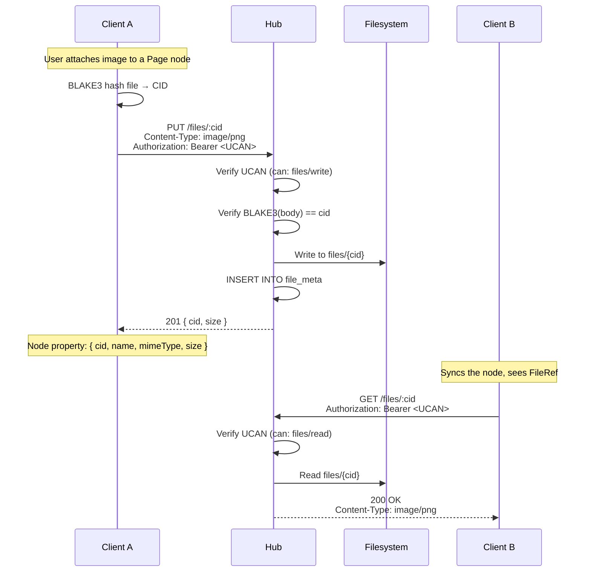

# 10: File Storage

> Content-addressed file hosting — upload by CID, download by CID, sync attachments between devices

**Dependencies:** `01-package-scaffold.md`, `02-ucan-auth.md`, `04-sqlite-storage.md`
**Modifies:** `packages/hub/src/services/files.ts`, `packages/hub/src/routes/files.ts`, `packages/hub/src/storage/`

## Codebase Status (Feb 2026)

| Existing Asset    | Location                                | Reuse Strategy                                                                 |
| ----------------- | --------------------------------------- | ------------------------------------------------------------------------------ |
| BLAKE3 hashing    | `packages/crypto/src/hashing.ts`        | CID verification on upload (`cid:blake3:hex` format)                           |
| BlobStore         | `packages/storage/src/blob-store.ts`    | Content-addressed storage with BLAKE3 — same CID pattern                       |
| ChunkManager      | `packages/storage/src/chunk-manager.ts` | Large file chunking (64KB threshold, 256KB chunks)                             |
| BlobSync protocol | `packages/react/src/sync/blob-sync.ts`  | P2P blob sync (blob-want/blob-data/blob-have) — hub can serve as blob provider |
| BSM blob sync     | `apps/electron/src/main/bsm.ts`         | Blob sync handling in dedicated `xnet-blob-sync` room                          |

> **No server-side file storage exists yet.** Client-side blob handling (BlobStore, BlobSync, ChunkManager) is complete. The hub file storage provides a reliable always-on blob provider that P2P blob sync can fall back to.

## Overview

The `file()` property type in `@xnetjs/data` already defines `FileRef` objects with CID, name, mimeType, and size — but there's no infrastructure to actually upload or download these files. The hub provides a content-addressed file store: clients upload files by their BLAKE3 hash (CID), and any authorized client can download by the same CID. Files are stored on the hub's filesystem, deduplicated by content hash.

This is distinct from the backup API (which stores opaque encrypted blobs per document). File storage stores individual files that can be referenced by multiple nodes across multiple documents.



## Implementation

### 1. Storage Extension: File Metadata Table

```sql
-- Addition to packages/hub/src/storage/sqlite.ts schema

-- File metadata (content-addressed by BLAKE3 CID)
CREATE TABLE IF NOT EXISTS file_meta (
  cid TEXT PRIMARY KEY,            -- cid:blake3:...
  name TEXT NOT NULL,              -- Original filename
  mime_type TEXT NOT NULL,         -- MIME type
  size_bytes INTEGER NOT NULL,     -- File size
  uploader_did TEXT NOT NULL,      -- Who uploaded it
  reference_count INTEGER NOT NULL DEFAULT 1,  -- How many nodes reference it
  file_path TEXT NOT NULL,         -- Filesystem path
  created_at INTEGER NOT NULL DEFAULT (unixepoch('now') * 1000)
);

CREATE INDEX IF NOT EXISTS idx_file_meta_uploader ON file_meta(uploader_did);
CREATE INDEX IF NOT EXISTS idx_file_meta_mime ON file_meta(mime_type);
```

### 2. Storage Interface Extension

```typescript
// Addition to packages/hub/src/storage/interface.ts

export interface FileMeta {
  cid: string // ContentId (cid:blake3:...)
  name: string // Original filename
  mimeType: string
  sizeBytes: number
  uploaderDid: string
  referenceCount: number
  createdAt: number
}

export interface HubStorage {
  // ... existing methods ...

  // File operations
  getFileMeta(cid: string): Promise<FileMeta | null>
  putFile(
    cid: string,
    data: Uint8Array,
    meta: Omit<FileMeta, 'referenceCount' | 'createdAt'>
  ): Promise<void>
  getFileData(cid: string): Promise<Uint8Array | null>
  deleteFile(cid: string): Promise<void>
  listFiles(uploaderDid: string): Promise<FileMeta[]>
  getFilesUsage(uploaderDid: string): Promise<{ totalBytes: number; fileCount: number }>
}
```

### 3. File Service

```typescript
// packages/hub/src/services/files.ts

import { blake3 } from '@xnetjs/crypto'
import type { HubStorage, FileMeta } from '../storage/interface'

export interface FileConfig {
  /** Max single file size (default: 100MB) */
  maxFileSize: number
  /** Max total storage per user (default: 5GB) */
  maxStoragePerUser: number
  /** Allowed MIME types (empty = all allowed) */
  allowedMimeTypes: string[]
}

const DEFAULT_CONFIG: FileConfig = {
  maxFileSize: 100 * 1024 * 1024, // 100MB
  maxStoragePerUser: 5 * 1024 * 1024 * 1024, // 5GB
  allowedMimeTypes: [] // All allowed
}

export class FileService {
  private config: FileConfig

  constructor(
    private storage: HubStorage,
    config?: Partial<FileConfig>
  ) {
    this.config = { ...DEFAULT_CONFIG, ...config }
  }

  /**
   * Upload a file. Verifies the CID matches the content hash.
   * Returns the verified CID and metadata.
   */
  async upload(
    declaredCid: string,
    data: Uint8Array,
    name: string,
    mimeType: string,
    uploaderDid: string
  ): Promise<FileMeta> {
    // 1. Validate size
    if (data.length > this.config.maxFileSize) {
      throw new FileError(
        'FILE_TOO_LARGE',
        `File exceeds max size of ${this.config.maxFileSize} bytes`
      )
    }

    // 2. Validate MIME type
    if (this.config.allowedMimeTypes.length > 0) {
      if (!this.config.allowedMimeTypes.includes(mimeType)) {
        throw new FileError('INVALID_MIME_TYPE', `MIME type ${mimeType} is not allowed`)
      }
    }

    // 3. Check storage quota
    const usage = await this.storage.getFilesUsage(uploaderDid)
    if (usage.totalBytes + data.length > this.config.maxStoragePerUser) {
      throw new FileError(
        'QUOTA_EXCEEDED',
        `Would exceed storage quota of ${this.config.maxStoragePerUser} bytes`
      )
    }

    // 4. Verify CID matches content hash
    const computedHash = blake3(data)
    const computedCid = `cid:blake3:${bufferToHex(computedHash)}`
    if (computedCid !== declaredCid) {
      throw new FileError('CID_MISMATCH', `Declared CID does not match content hash`)
    }

    // 5. Check if file already exists (content-addressed dedup)
    const existing = await this.storage.getFileMeta(declaredCid)
    if (existing) {
      // File already exists — no need to store again
      return existing
    }

    // 6. Store file
    const meta: FileMeta = {
      cid: declaredCid,
      name,
      mimeType,
      sizeBytes: data.length,
      uploaderDid,
      referenceCount: 1,
      createdAt: Date.now()
    }

    await this.storage.putFile(declaredCid, data, meta)
    return meta
  }

  /**
   * Download a file by CID.
   */
  async download(cid: string): Promise<{ data: Uint8Array; meta: FileMeta } | null> {
    const meta = await this.storage.getFileMeta(cid)
    if (!meta) return null

    const data = await this.storage.getFileData(cid)
    if (!data) return null

    return { data, meta }
  }

  /**
   * List files uploaded by a user.
   */
  async listByUploader(uploaderDid: string): Promise<FileMeta[]> {
    return this.storage.listFiles(uploaderDid)
  }

  /**
   * Get storage usage for a user.
   */
  async getUsage(
    uploaderDid: string
  ): Promise<{ totalBytes: number; fileCount: number; quota: number }> {
    const usage = await this.storage.getFilesUsage(uploaderDid)
    return { ...usage, quota: this.config.maxStoragePerUser }
  }
}

export class FileError extends Error {
  constructor(
    public code:
      | 'FILE_TOO_LARGE'
      | 'INVALID_MIME_TYPE'
      | 'QUOTA_EXCEEDED'
      | 'CID_MISMATCH'
      | 'NOT_FOUND',
    message: string
  ) {
    super(message)
    this.name = 'FileError'
  }
}

function bufferToHex(buf: Uint8Array): string {
  return Array.from(buf)
    .map((b) => b.toString(16).padStart(2, '0'))
    .join('')
}
```

### 4. HTTP Routes

```typescript
// packages/hub/src/routes/files.ts

import { Hono } from 'hono'
import type { FileService, FileError } from '../services/files'
import type { AuthContext } from '../auth/ucan'

export function createFileRoutes(fileService: FileService): Hono {
  const app = new Hono()

  /**
   * PUT /files/:cid
   * Upload a file. CID must match BLAKE3 hash of body.
   *
   * Headers:
   *   Authorization: Bearer <UCAN>
   *   Content-Type: <file MIME type>
   *   X-File-Name: <original filename>
   *
   * Body: Raw file bytes
   */
  app.put('/:cid', async (c) => {
    const auth = c.get('auth') as AuthContext
    const cid = c.req.param('cid')
    const mimeType = c.req.header('content-type') ?? 'application/octet-stream'
    const name = c.req.header('x-file-name') ?? 'unnamed'

    if (!auth.can('files/write', '*')) {
      return c.json({ error: 'Unauthorized', code: 'UNAUTHORIZED' }, 403)
    }

    const body = await c.req.arrayBuffer()
    const data = new Uint8Array(body)

    try {
      const meta = await fileService.upload(cid, data, name, mimeType, auth.did)
      return c.json(meta, 201)
    } catch (err) {
      if (err instanceof Error && err.name === 'FileError') {
        const fileErr = err as import('../services/files').FileError
        switch (fileErr.code) {
          case 'FILE_TOO_LARGE':
            return c.json({ error: fileErr.message, code: fileErr.code }, 413)
          case 'QUOTA_EXCEEDED':
            return c.json({ error: fileErr.message, code: fileErr.code }, 507)
          case 'CID_MISMATCH':
            return c.json({ error: fileErr.message, code: fileErr.code }, 422)
          case 'INVALID_MIME_TYPE':
            return c.json({ error: fileErr.message, code: fileErr.code }, 415)
        }
      }
      throw err
    }
  })

  /**
   * GET /files/:cid
   * Download a file by CID.
   *
   * Response: File bytes with correct Content-Type
   */
  app.get('/:cid', async (c) => {
    const auth = c.get('auth') as AuthContext
    const cid = c.req.param('cid')

    if (!auth.can('files/read', '*')) {
      return c.json({ error: 'Unauthorized', code: 'UNAUTHORIZED' }, 403)
    }

    const result = await fileService.download(cid)
    if (!result) {
      return c.json({ error: 'File not found', code: 'NOT_FOUND' }, 404)
    }

    return new Response(result.data, {
      status: 200,
      headers: {
        'Content-Type': result.meta.mimeType,
        'Content-Length': String(result.meta.sizeBytes),
        'Content-Disposition': `inline; filename="${encodeURIComponent(result.meta.name)}"`,
        'Cache-Control': 'public, max-age=31536000, immutable' // CID = immutable
      }
    })
  })

  /**
   * GET /files
   * List files uploaded by the authenticated user.
   */
  app.get('/', async (c) => {
    const auth = c.get('auth') as AuthContext
    const [files, usage] = await Promise.all([
      fileService.listByUploader(auth.did),
      fileService.getUsage(auth.did)
    ])
    return c.json({ files, usage })
  })

  /**
   * HEAD /files/:cid
   * Check if a file exists without downloading.
   */
  app.head('/:cid', async (c) => {
    const auth = c.get('auth') as AuthContext
    const cid = c.req.param('cid')

    if (!auth.can('files/read', '*')) {
      return new Response(null, { status: 403 })
    }

    const meta = await fileService.download(cid)
    if (!meta) {
      return new Response(null, { status: 404 })
    }

    return new Response(null, {
      status: 200,
      headers: {
        'Content-Type': meta.meta.mimeType,
        'Content-Length': String(meta.meta.sizeBytes)
      }
    })
  })

  return app
}
```

### 5. Client-Side File Upload Helper

````typescript
// packages/react/src/hooks/useFileUpload.ts

import { useContext, useCallback, useState } from 'react'
import { blake3 } from '@xnetjs/crypto'
import { XNetContext } from '../provider/XNetProvider'

export interface FileRef {
  cid: string
  name: string
  mimeType: string
  size: number
}

export interface UseFileUploadReturn {
  upload: (file: File) => Promise<FileRef>
  uploading: boolean
  progress: number // 0-1
}

/**
 * Hook for uploading files to the hub.
 * Returns a FileRef that can be stored in a node property.
 *
 * @example
 * ```tsx
 * function AttachmentButton({ nodeId }) {
 *   const { upload, uploading } = useFileUpload()
 *   const { mutate } = useMutate()
 *
 *   const handleFile = async (e) => {
 *     const fileRef = await upload(e.target.files[0])
 *     mutate(nodeId, { attachment: fileRef })
 *   }
 *
 *   return <input type="file" onChange={handleFile} disabled={uploading} />
 * }
 * ```
 */
export function useFileUpload(): UseFileUploadReturn {
  const ctx = useContext(XNetContext)
  const [uploading, setUploading] = useState(false)
  const [progress, setProgress] = useState(0)

  const upload = useCallback(
    async (file: File): Promise<FileRef> => {
      if (!ctx?.hub) throw new Error('No hub connection')

      setUploading(true)
      setProgress(0)

      try {
        // Read file into buffer
        const buffer = new Uint8Array(await file.arrayBuffer())
        setProgress(0.3)

        // Compute BLAKE3 hash
        const hash = blake3(buffer)
        const cid = `cid:blake3:${Array.from(hash)
          .map((b) => b.toString(16).padStart(2, '0'))
          .join('')}`
        setProgress(0.5)

        // Upload to hub
        const token = await ctx.hub.getAuthToken()
        const hubHttpUrl = ctx.hubUrl!.replace('wss://', 'https://').replace('ws://', 'http://')

        const res = await fetch(`${hubHttpUrl}/files/${cid}`, {
          method: 'PUT',
          headers: {
            Authorization: `Bearer ${token}`,
            'Content-Type': file.type || 'application/octet-stream',
            'X-File-Name': file.name
          },
          body: buffer
        })

        setProgress(0.9)

        if (!res.ok) {
          const err = await res.json()
          throw new Error(err.error || `Upload failed: ${res.status}`)
        }

        setProgress(1)

        return { cid, name: file.name, mimeType: file.type, size: file.size }
      } finally {
        setUploading(false)
      }
    },
    [ctx]
  )

  return { upload, uploading, progress }
}
````

## Tests

```typescript
// packages/hub/test/files.test.ts

import { describe, it, expect, beforeAll, afterAll } from 'vitest'
import { createHub, type HubInstance } from '../src'

describe('File Storage API', () => {
  let hub: HubInstance
  const PORT = 14452
  const BASE = `http://localhost:${PORT}`

  beforeAll(async () => {
    hub = await createHub({ port: PORT, auth: false, storage: 'memory' })
    await hub.start()
  })

  afterAll(async () => {
    await hub.stop()
  })

  function computeCid(data: Uint8Array): string {
    // Simplified for tests — real code uses @xnetjs/crypto blake3
    const hash = Array.from(data).reduce((h, b) => ((h << 5) - h + b) | 0, 0)
    return `cid:blake3:${Math.abs(hash).toString(16).padStart(64, '0')}`
  }

  it('uploads and downloads a file', async () => {
    const data = new TextEncoder().encode('Hello, World!')
    // In real code, CID = blake3 hash. For tests, use a placeholder.
    const cid = 'cid:blake3:test-file-001'

    const putRes = await fetch(`${BASE}/files/${cid}`, {
      method: 'PUT',
      headers: {
        'Content-Type': 'text/plain',
        'X-File-Name': 'hello.txt'
      },
      body: data
    })
    expect(putRes.status).toBe(201)
    const meta = await putRes.json()
    expect(meta.name).toBe('hello.txt')
    expect(meta.mimeType).toBe('text/plain')
    expect(meta.sizeBytes).toBe(13)

    // Download
    const getRes = await fetch(`${BASE}/files/${cid}`)
    expect(getRes.status).toBe(200)
    expect(getRes.headers.get('content-type')).toBe('text/plain')
    expect(getRes.headers.get('cache-control')).toContain('immutable')
    const body = await getRes.text()
    expect(body).toBe('Hello, World!')
  })

  it('deduplicates by CID (same content = same file)', async () => {
    const data = new Uint8Array([1, 2, 3, 4, 5])
    const cid = 'cid:blake3:dedup-file-test'

    // Upload twice
    await fetch(`${BASE}/files/${cid}`, {
      method: 'PUT',
      headers: { 'Content-Type': 'application/octet-stream', 'X-File-Name': 'a.bin' },
      body: data
    })
    const res2 = await fetch(`${BASE}/files/${cid}`, {
      method: 'PUT',
      headers: { 'Content-Type': 'application/octet-stream', 'X-File-Name': 'b.bin' },
      body: data
    })

    // Second upload succeeds (returns existing)
    expect(res2.status).toBe(201)
  })

  it('returns 404 for unknown CID', async () => {
    const res = await fetch(`${BASE}/files/cid:blake3:nonexistent`)
    expect(res.status).toBe(404)
  })

  it('HEAD checks file existence', async () => {
    const cid = 'cid:blake3:head-test'
    await fetch(`${BASE}/files/${cid}`, {
      method: 'PUT',
      headers: { 'Content-Type': 'image/png', 'X-File-Name': 'pic.png' },
      body: new Uint8Array([0x89, 0x50, 0x4e, 0x47])
    })

    const headRes = await fetch(`${BASE}/files/${cid}`, { method: 'HEAD' })
    expect(headRes.status).toBe(200)
    expect(headRes.headers.get('content-type')).toBe('image/png')
    expect(headRes.headers.get('content-length')).toBe('4')
  })

  it('lists files by uploader', async () => {
    const listRes = await fetch(`${BASE}/files`)
    expect(listRes.status).toBe(200)
    const { files, usage } = await listRes.json()
    expect(files.length).toBeGreaterThanOrEqual(1)
    expect(usage.totalBytes).toBeGreaterThan(0)
  })
})
```

## Checklist

- [x] Add `file_meta` table to SQLite schema
- [x] Add file methods to `HubStorage` interface (`putFile`, `getFileData`, `getFileMeta`, etc.)
- [x] Implement `FileService` with BLAKE3 CID verification
- [x] Add content-deduplication (skip store if CID already exists)
- [x] Create Hono routes: PUT, GET, HEAD, GET (list)
- [x] Set `Cache-Control: immutable` on GET responses (CID = content never changes)
- [x] Add storage quota enforcement per user
- [x] Create `useFileUpload()` React hook
- [x] Wire file routes into server
- [x] Write file storage tests (upload, download, dedup, HEAD, list)
- [x] Document `FileRef` property usage in client code

---

[← Previous: Node Sync Relay](./09-node-sync-relay.md) | [Back to README](./README.md) | [Next: Schema Registry →](./11-schema-registry.md)
