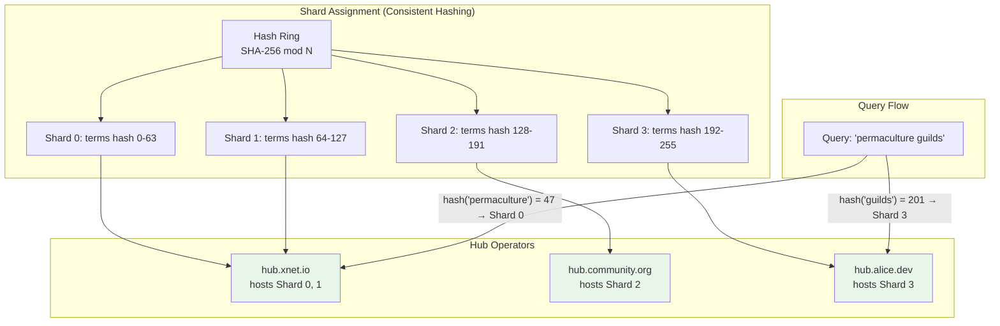
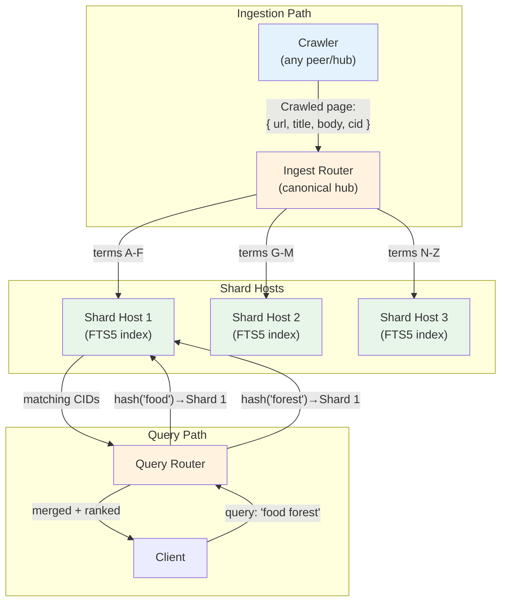

# 15: Global Index Shards

> Distribute the global search index across multiple hubs for web-scale search

**Dependencies:** `06-query-engine.md`, `14-hub-federation-search.md`
**Modifies:** `packages/hub/src/services/index-shards.ts`, `packages/hub/src/services/shard-router.ts`, `packages/hub/src/storage/`

## Codebase Status (Feb 2026)

> **Global index sharding is entirely speculative — no code exists.** This is a web-scale feature that depends on federation (Phase 13) and multiple production hubs.
>
> Relevant existing work:
>
> - [Exploration 0023](../../explorations/0023_[_]_DECENTRALIZED_SEARCH.md) — Term-partitioned sharding with BM25 scoring design
> - `@xnetjs/crypto` BLAKE3 — consistent hash function for shard assignment
> - The canonical hub (`hub.xnet.io`) would host ALL shards initially and distribute as hubs join the network

## Overview

Hub Federation (step 14) enables cross-hub queries, but each hub still maintains its own independent index. For a truly global search index (the "decentralized Google" from VISION.md), we need to split a shared global index across multiple hubs, with each hub responsible for a shard of the term space.

This step defines how hubs coordinate shard assignment, how documents are routed to the correct shard host, and how queries are distributed to the relevant shards.



## Design Decisions

| Decision          | Choice                                                               | Rationale                                                                                         |
| ----------------- | -------------------------------------------------------------------- | ------------------------------------------------------------------------------------------------- |
| Sharding strategy | Term-partitioned (not doc-partitioned)                               | Enables single-term queries to hit one shard. Multi-term queries hit multiple shards in parallel. |
| Shard assignment  | Consistent hashing (virtual nodes)                                   | Handles hub joins/leaves gracefully. Minimal rebalancing.                                         |
| Replication       | Each shard replicated to 2 hubs                                      | Availability: if one hub goes down, the other serves the shard.                                   |
| Shard registry    | Canonical hub maintains authoritative registry                       | Single source of truth for "who hosts what." Gossipped to other hubs.                             |
| Index format      | Tantivy segments (on server) or FTS5 tables                          | Tantivy for performance at scale; FTS5 for simplicity in early phase.                             |
| Ingestion         | Hub receives documents, extracts terms, routes to correct shard host | Separation of crawling (anyone) from indexing (shard hosts).                                      |

## Architecture



## Implementation

### 1. Shard Registry

```typescript
// packages/hub/src/services/index-shards.ts

/**
 * A shard is a portion of the global term space.
 * Each shard is hosted by one primary hub and optionally replicated.
 */
export interface ShardAssignment {
  /** Shard ID (0-based) */
  shardId: number
  /** Hash range start (0-255 for 256-shard config) */
  rangeStart: number
  /** Hash range end (inclusive) */
  rangeEnd: number
  /** Primary host hub */
  primaryHub: {
    url: string
    hubDid: string
  }
  /** Replica hub (for availability) */
  replicaHub?: {
    url: string
    hubDid: string
  }
  /** Current document count in this shard */
  docCount: number
  /** Last updated timestamp */
  updatedAt: number
}

export interface ShardConfig {
  /** Total number of shards (power of 2, default 64) */
  totalShards: number
  /** Shards this hub hosts (may be multiple) */
  hostedShards: number[]
  /** Replication factor (default 2) */
  replicationFactor: number
  /** Registry URL (canonical hub) */
  registryUrl: string
  /** Max documents per shard before rebalancing alert */
  maxDocsPerShard: number
}

/**
 * The shard registry is the authoritative mapping of
 * shard ID → hub URL. Maintained by the canonical hub,
 * fetched and cached by all other hubs.
 */
export class ShardRegistry {
  private assignments: ShardAssignment[] = []
  private refreshInterval: ReturnType<typeof setInterval> | null = null

  constructor(
    private config: ShardConfig,
    private storage: HubStorage
  ) {}

  /**
   * Initialize: load from storage or fetch from canonical hub.
   */
  async init(): Promise<void> {
    // Try to load cached assignments
    const cached = await this.storage.getMeta('shard_assignments')
    if (cached) {
      this.assignments = JSON.parse(cached)
    }

    // Refresh from registry
    await this.refresh()

    // Periodic refresh (every 5 minutes)
    this.refreshInterval = setInterval(() => this.refresh(), 5 * 60_000)
  }

  /**
   * Fetch current shard assignments from the registry hub.
   */
  async refresh(): Promise<void> {
    try {
      const response = await fetch(`${this.config.registryUrl}/shards/assignments`)
      if (response.ok) {
        this.assignments = await response.json()
        await this.storage.setMeta('shard_assignments', JSON.stringify(this.assignments))
      }
    } catch {
      // Use cached assignments if registry unreachable
    }
  }

  /**
   * Determine which shard a term belongs to.
   */
  getShardForTerm(term: string): ShardAssignment | null {
    const hash = this.hashTerm(term)
    const shardId = hash % this.config.totalShards
    return this.assignments.find((a) => a.shardId === shardId) ?? null
  }

  /**
   * Get all shards needed for a multi-term query.
   * Returns unique shard assignments (no duplicates if terms share a shard).
   */
  getShardsForQuery(terms: string[]): ShardAssignment[] {
    const shardIds = new Set<number>()
    const shards: ShardAssignment[] = []

    for (const term of terms) {
      const shard = this.getShardForTerm(term)
      if (shard && !shardIds.has(shard.shardId)) {
        shardIds.add(shard.shardId)
        shards.push(shard)
      }
    }

    return shards
  }

  /**
   * Get shards hosted by this hub.
   */
  getLocalShards(): ShardAssignment[] {
    return this.assignments.filter((a) => this.config.hostedShards.includes(a.shardId))
  }

  /**
   * Hash a term to a shard bucket.
   * Uses first byte of BLAKE3 hash for uniform distribution.
   */
  private hashTerm(term: string): number {
    // Simplified: use charCode sum mod totalShards
    // In production: use BLAKE3 hash
    let hash = 0
    const normalized = term.toLowerCase().trim()
    for (let i = 0; i < normalized.length; i++) {
      hash = ((hash << 5) - hash + normalized.charCodeAt(i)) | 0
    }
    return Math.abs(hash)
  }

  stop(): void {
    if (this.refreshInterval) {
      clearInterval(this.refreshInterval)
    }
  }
}
```

### 2. Shard Ingestion

```typescript
// packages/hub/src/services/shard-ingest.ts

/**
 * A document to be added to the global index.
 * Crawlers or users submit these to the canonical hub.
 */
export interface IndexableDocument {
  /** Content ID (BLAKE3 hash of content) */
  cid: string
  /** Source URL (for web crawl results) */
  url?: string
  /** Document title */
  title: string
  /** Full text body */
  body: string
  /** Schema IRI (for xNet native content) */
  schema?: string
  /** Author DID */
  author?: string
  /** Language (ISO 639-1) */
  language?: string
  /** Tags */
  tags?: string[]
  /** Timestamp */
  indexedAt: number
}

/**
 * The ingest router receives documents and routes their terms
 * to the correct shard hosts.
 */
export class ShardIngestRouter {
  constructor(
    private registry: ShardRegistry,
    private config: ShardConfig
  ) {}

  /**
   * Ingest a document: extract terms, route to shard hosts.
   * Each shard host receives only the terms that belong to it,
   * along with the document metadata for result display.
   */
  async ingest(doc: IndexableDocument): Promise<IngestResult> {
    // 1. Tokenize and normalize
    const terms = this.extractTerms(doc.title + ' ' + doc.body)
    const uniqueTerms = [...new Set(terms)]

    // 2. Group terms by shard
    const termsByShardId = new Map<number, string[]>()
    for (const term of uniqueTerms) {
      const shard = this.registry.getShardForTerm(term)
      if (!shard) continue
      const list = termsByShardId.get(shard.shardId) ?? []
      list.push(term)
      termsByShardId.set(shard.shardId, list)
    }

    // 3. Send term postings to each shard host
    const results = await Promise.allSettled(
      [...termsByShardId.entries()].map(([shardId, shardTerms]) =>
        this.sendToShard(shardId, doc, shardTerms)
      )
    )

    const succeeded = results.filter((r) => r.status === 'fulfilled').length
    return {
      cid: doc.cid,
      termsExtracted: uniqueTerms.length,
      shardsUpdated: succeeded,
      shardsTotal: termsByShardId.size
    }
  }

  /**
   * Send a document's terms to the hosting shard.
   */
  private async sendToShard(
    shardId: number,
    doc: IndexableDocument,
    terms: string[]
  ): Promise<void> {
    const assignments = this.registry.getLocalShards()
    const shard = assignments.find((a) => a.shardId === shardId)

    if (!shard) {
      // Shard is hosted by another hub — forward via HTTP
      const assignment = this.registry.getShardsForQuery(terms).find((a) => a.shardId === shardId)
      if (!assignment) throw new Error(`No host for shard ${shardId}`)

      await fetch(`${assignment.primaryHub.url}/shards/ingest`, {
        method: 'POST',
        headers: { 'Content-Type': 'application/json' },
        body: JSON.stringify({
          shardId,
          doc: {
            cid: doc.cid,
            url: doc.url,
            title: doc.title,
            schema: doc.schema,
            author: doc.author,
            language: doc.language,
            indexedAt: doc.indexedAt
          },
          terms,
          // Term frequencies for this document (for BM25)
          termFreqs: this.computeTermFreqs(terms, doc.body)
        })
      })
    } else {
      // This hub hosts this shard — index locally
      await this.indexLocally(shardId, doc, terms)
    }
  }

  /**
   * Index terms into a locally-hosted shard.
   */
  private async indexLocally(
    shardId: number,
    doc: IndexableDocument,
    terms: string[]
  ): Promise<void> {
    // Store in shard-specific FTS5 table
    // Implementation depends on storage adapter
    const termFreqs = this.computeTermFreqs(terms, doc.body)

    for (const term of terms) {
      await this.storage.insertPosting({
        shardId,
        term,
        cid: doc.cid,
        tf: termFreqs.get(term) ?? 1,
        title: doc.title,
        url: doc.url,
        schema: doc.schema,
        indexedAt: doc.indexedAt
      })
    }
  }

  /**
   * Extract and normalize terms from text.
   */
  private extractTerms(text: string): string[] {
    return text
      .toLowerCase()
      .replace(/[^\w\s]/g, ' ')
      .split(/\s+/)
      .filter((t) => t.length >= 2 && t.length <= 50)
      .filter((t) => !STOP_WORDS.has(t))
  }

  private computeTermFreqs(terms: string[], body: string): Map<string, number> {
    const freqs = new Map<string, number>()
    const bodyTerms = this.extractTerms(body)
    for (const t of bodyTerms) {
      freqs.set(t, (freqs.get(t) ?? 0) + 1)
    }
    return freqs
  }
}

interface IngestResult {
  cid: string
  termsExtracted: number
  shardsUpdated: number
  shardsTotal: number
}

const STOP_WORDS = new Set([
  'the',
  'is',
  'at',
  'which',
  'on',
  'a',
  'an',
  'and',
  'or',
  'but',
  'in',
  'with',
  'to',
  'for',
  'of',
  'not',
  'no',
  'be',
  'was',
  'were',
  'been',
  'being',
  'have',
  'has',
  'had',
  'do',
  'does',
  'did',
  'will',
  'would',
  'could',
  'should',
  'may',
  'might',
  'shall',
  'can',
  'this',
  'that',
  'these',
  'those',
  'am',
  'are',
  'it',
  'its',
  'he',
  'she',
  'they',
  'them',
  'we',
  'you',
  'my',
  'your',
  'his',
  'her',
  'our'
])
```

### 3. Shard Query Router

```typescript
// packages/hub/src/services/shard-router.ts

/**
 * Routes search queries to the correct shard hosts,
 * collects results, and merges them.
 */
export class ShardQueryRouter {
  constructor(
    private registry: ShardRegistry,
    private config: ShardConfig
  ) {}

  /**
   * Execute a global search query across shards.
   *
   * 1. Tokenize query into terms
   * 2. Determine which shards to query
   * 3. Query each shard in parallel
   * 4. Intersect/union results depending on query type
   * 5. Rank by BM25 across shards
   */
  async search(query: GlobalSearchRequest): Promise<GlobalSearchResponse> {
    const start = Date.now()
    const terms = this.tokenize(query.text)

    if (terms.length === 0) {
      return { queryId: query.queryId, results: [], took: 0 }
    }

    // Determine which shards to query
    const shards = this.registry.getShardsForQuery(terms)

    // Query each shard in parallel
    const shardResults = await Promise.allSettled(
      shards.map((shard) => this.queryShardHost(shard, terms, query.limit))
    )

    // Collect all postings
    const allPostings: ShardPosting[] = shardResults
      .filter((r) => r.status === 'fulfilled')
      .flatMap((r) => (r as PromiseFulfilledResult<ShardPosting[]>).value)

    // Score and rank
    const scored = this.scoreBM25(allPostings, terms, query)

    // Deduplicate by CID (same content on multiple shards)
    const deduped = this.deduplicateByCid(scored)

    return {
      queryId: query.queryId,
      results: deduped.slice(0, query.limit),
      took: Date.now() - start
    }
  }

  /**
   * Query a single shard host for matching documents.
   */
  private async queryShardHost(
    shard: ShardAssignment,
    terms: string[],
    limit: number
  ): Promise<ShardPosting[]> {
    // Check if this is a locally-hosted shard
    if (this.config.hostedShards.includes(shard.shardId)) {
      return this.queryLocalShard(shard.shardId, terms, limit)
    }

    // Remote shard — query via HTTP
    const controller = new AbortController()
    const timeout = setTimeout(() => controller.abort(), 2000)

    try {
      const response = await fetch(`${shard.primaryHub.url}/shards/query`, {
        method: 'POST',
        headers: { 'Content-Type': 'application/json' },
        body: JSON.stringify({ shardId: shard.shardId, terms, limit }),
        signal: controller.signal
      })
      clearTimeout(timeout)

      if (!response.ok) {
        // Try replica
        if (shard.replicaHub) {
          return this.queryReplicaShard(shard, terms, limit)
        }
        return []
      }

      return await response.json()
    } catch {
      clearTimeout(timeout)
      // Try replica on failure
      if (shard.replicaHub) {
        return this.queryReplicaShard(shard, terms, limit)
      }
      return []
    }
  }

  private async queryReplicaShard(
    shard: ShardAssignment,
    terms: string[],
    limit: number
  ): Promise<ShardPosting[]> {
    if (!shard.replicaHub) return []

    try {
      const response = await fetch(`${shard.replicaHub.url}/shards/query`, {
        method: 'POST',
        headers: { 'Content-Type': 'application/json' },
        body: JSON.stringify({ shardId: shard.shardId, terms, limit })
      })
      if (response.ok) return await response.json()
    } catch {
      /* fall through */
    }
    return []
  }

  private async queryLocalShard(
    shardId: number,
    terms: string[],
    limit: number
  ): Promise<ShardPosting[]> {
    // Query the local shard's posting lists
    // Return all documents that contain any of the query terms
    // with their term frequencies
    return this.storage.queryPostings(shardId, terms, limit)
  }

  /**
   * BM25 scoring across shard results.
   */
  private scoreBM25(
    postings: ShardPosting[],
    queryTerms: string[],
    query: GlobalSearchRequest
  ): ScoredShardResult[] {
    const k1 = 1.2
    const b = 0.75

    // Group postings by CID
    const byCid = new Map<string, ShardPosting[]>()
    for (const p of postings) {
      const list = byCid.get(p.cid) ?? []
      list.push(p)
      byCid.set(p.cid, list)
    }

    // Estimate corpus size from shard registry
    const N = this.estimateCorpusSize()
    const avgDl = 500 // Estimated average document length in terms

    const results: ScoredShardResult[] = []

    for (const [cid, docPostings] of byCid) {
      let score = 0
      const dl = docPostings.reduce((sum, p) => sum + p.docLength, 0) / docPostings.length || avgDl

      for (const term of queryTerms) {
        const posting = docPostings.find((p) => p.term === term)
        if (!posting) continue

        const tf = posting.tf
        const df = posting.df ?? 1
        const idf = Math.log((N - df + 0.5) / (df + 0.5) + 1)
        const tfNorm = (tf * (k1 + 1)) / (tf + k1 * (1 - b + b * (dl / avgDl)))
        score += idf * tfNorm
      }

      // Title boost: if query terms appear in title, boost score
      const titleTerms = this.tokenize(docPostings[0]?.title ?? '')
      const titleOverlap = queryTerms.filter((t) => titleTerms.includes(t)).length
      if (titleOverlap > 0) {
        score *= 1 + (titleOverlap / queryTerms.length) * 0.5
      }

      results.push({
        cid,
        score,
        title: docPostings[0]?.title ?? '',
        url: docPostings[0]?.url,
        schema: docPostings[0]?.schema,
        author: docPostings[0]?.author,
        indexedAt: docPostings[0]?.indexedAt ?? 0
      })
    }

    return results.sort((a, b) => b.score - a.score)
  }

  private deduplicateByCid(results: ScoredShardResult[]): ScoredShardResult[] {
    const seen = new Set<string>()
    return results.filter((r) => {
      if (seen.has(r.cid)) return false
      seen.add(r.cid)
      return true
    })
  }

  private estimateCorpusSize(): number {
    // Sum docCount across all shards
    return (
      this.registry.getLocalShards().reduce((sum, s) => sum + s.docCount, 0) *
      this.config.totalShards
    )
  }

  private tokenize(text: string): string[] {
    return text
      .toLowerCase()
      .replace(/[^\w\s]/g, ' ')
      .split(/\s+/)
      .filter((t) => t.length >= 2 && !STOP_WORDS.has(t))
  }
}

/** A posting from a shard: term → document mapping with frequency */
export interface ShardPosting {
  term: string
  cid: string
  tf: number // Term frequency in this document
  df?: number // Document frequency (how many docs contain this term)
  docLength?: number // Total terms in document
  title: string
  url?: string
  schema?: string
  author?: string
  indexedAt: number
}

export interface ScoredShardResult {
  cid: string
  score: number
  title: string
  url?: string
  schema?: string
  author?: string
  indexedAt: number
}

export interface GlobalSearchRequest {
  queryId: string
  text: string
  limit: number
  schema?: string // Filter by schema IRI
  language?: string // Filter by language
}

export interface GlobalSearchResponse {
  queryId: string
  results: ScoredShardResult[]
  took: number
}
```

### 4. HTTP Routes

```typescript
// packages/hub/src/routes/shards.ts

import { Hono } from 'hono'
import type { ShardRegistry, ShardIngestRouter, ShardQueryRouter } from '../services'

export function createShardRoutes(
  registry: ShardRegistry,
  ingest: ShardIngestRouter,
  router: ShardQueryRouter
) {
  const app = new Hono()

  /**
   * GET /shards/assignments
   * Return current shard assignment table.
   * Used by other hubs to discover shard topology.
   */
  app.get('/shards/assignments', (c) => {
    return c.json(registry.getAllAssignments())
  })

  /**
   * POST /shards/ingest
   * Receive term postings for a locally-hosted shard.
   * Called by the ingest router when routing to this hub.
   */
  app.post('/shards/ingest', async (c) => {
    const { shardId, doc, terms, termFreqs } = await c.req.json()

    // Verify this hub hosts this shard
    if (!registry.isLocalShard(shardId)) {
      return c.json({ error: 'This hub does not host shard ' + shardId }, 400)
    }

    await ingest.indexLocally(shardId, doc, terms)
    return c.json({ indexed: true, shardId, cid: doc.cid })
  })

  /**
   * POST /shards/query
   * Query a locally-hosted shard for matching postings.
   * Called by query routers on other hubs.
   */
  app.post('/shards/query', async (c) => {
    const { shardId, terms, limit } = await c.req.json()

    if (!registry.isLocalShard(shardId)) {
      return c.json({ error: 'This hub does not host shard ' + shardId }, 400)
    }

    const postings = await router.queryLocalShard(shardId, terms, limit)
    return c.json(postings)
  })

  /**
   * POST /shards/search
   * Full global search: routes to relevant shards, merges results.
   * This is the user-facing endpoint.
   */
  app.post('/shards/search', async (c) => {
    const request = await c.req.json()
    const response = await router.search(request)
    return c.json(response)
  })

  /**
   * POST /shards/register
   * Register this hub as a shard host (admin only).
   */
  app.post('/shards/register', async (c) => {
    const { hubUrl, hubDid, shardIds } = await c.req.json()
    // TODO: Verify admin UCAN
    // TODO: Validate hub is reachable
    await registry.registerShardHost(hubUrl, hubDid, shardIds)
    return c.json({ registered: true, shards: shardIds })
  })

  return app
}
```

### 5. Storage: Shard Posting Tables

```sql
-- Addition to packages/hub/src/storage/sqlite.ts schema

-- Posting lists for globally-indexed documents (per shard)
CREATE TABLE IF NOT EXISTS shard_postings (
  id INTEGER PRIMARY KEY AUTOINCREMENT,
  shard_id INTEGER NOT NULL,
  term TEXT NOT NULL,
  cid TEXT NOT NULL,                    -- Content ID of indexed document
  tf INTEGER NOT NULL DEFAULT 1,        -- Term frequency
  title TEXT,
  url TEXT,
  schema_iri TEXT,
  author_did TEXT,
  language TEXT DEFAULT 'en',
  indexed_at INTEGER NOT NULL
);

CREATE INDEX idx_shard_term ON shard_postings(shard_id, term);
CREATE INDEX idx_shard_cid ON shard_postings(cid);

-- Document frequency cache (how many docs contain each term)
CREATE TABLE IF NOT EXISTS shard_term_stats (
  shard_id INTEGER NOT NULL,
  term TEXT NOT NULL,
  doc_freq INTEGER NOT NULL DEFAULT 0,
  last_updated INTEGER NOT NULL,
  PRIMARY KEY (shard_id, term)
);

-- Shard assignment registry (cached from canonical hub)
CREATE TABLE IF NOT EXISTS shard_assignments (
  shard_id INTEGER PRIMARY KEY,
  range_start INTEGER NOT NULL,
  range_end INTEGER NOT NULL,
  primary_hub_url TEXT NOT NULL,
  primary_hub_did TEXT NOT NULL,
  replica_hub_url TEXT,
  replica_hub_did TEXT,
  doc_count INTEGER DEFAULT 0,
  updated_at INTEGER NOT NULL
);
```

### 6. Shard Rebalancing

```typescript
// packages/hub/src/services/shard-rebalance.ts

/**
 * Handles shard rebalancing when hubs join or leave the network.
 * Only runs on the canonical hub (registry owner).
 */
export class ShardRebalancer {
  constructor(
    private registry: ShardRegistry,
    private config: ShardConfig
  ) {}

  /**
   * When a new hub joins, reassign some shards to it.
   * Uses consistent hashing to minimize data movement.
   */
  async onHubJoin(hubUrl: string, hubDid: string, capacity: number): Promise<void> {
    // Capacity = how many shards this hub can host
    const currentLoad = this.getHubLoadDistribution()
    const overloadedHubs = currentLoad
      .filter((h) => h.shardCount > this.idealShardsPerHub())
      .sort((a, b) => b.shardCount - a.shardCount)

    // Take shards from the most loaded hubs
    let toAssign = Math.min(capacity, this.idealShardsPerHub())
    for (const hub of overloadedHubs) {
      if (toAssign <= 0) break
      const shardsToMove = Math.min(hub.shardCount - this.idealShardsPerHub(), toAssign)
      // Reassign shards
      for (let i = 0; i < shardsToMove; i++) {
        const shard = hub.shards.pop()
        if (shard) {
          await this.registry.reassignShard(shard, hubUrl, hubDid)
          toAssign--
        }
      }
    }
  }

  /**
   * When a hub leaves, reassign its shards to remaining hubs.
   */
  async onHubLeave(hubDid: string): Promise<void> {
    const orphanedShards = this.registry.getShardsForHub(hubDid)
    const availableHubs = this.getHubLoadDistribution()
      .filter((h) => h.hubDid !== hubDid)
      .sort((a, b) => a.shardCount - b.shardCount)

    for (const shard of orphanedShards) {
      // Assign to least-loaded hub
      const target = availableHubs[0]
      if (target) {
        await this.registry.reassignShard(shard.shardId, target.hubUrl, target.hubDid)
        target.shardCount++
        // Re-sort
        availableHubs.sort((a, b) => a.shardCount - b.shardCount)
      }
    }
  }

  private idealShardsPerHub(): number {
    const hubCount = this.registry.getUniqueHubCount()
    return Math.ceil(this.config.totalShards / Math.max(hubCount, 1))
  }

  private getHubLoadDistribution(): HubLoad[] {
    // Group shards by hosting hub
    const byHub = new Map<string, { hubUrl: string; hubDid: string; shards: number[] }>()
    for (const assignment of this.registry.getAllAssignments()) {
      const key = assignment.primaryHub.hubDid
      const entry = byHub.get(key) ?? {
        hubUrl: assignment.primaryHub.url,
        hubDid: key,
        shards: []
      }
      entry.shards.push(assignment.shardId)
      byHub.set(key, entry)
    }
    return [...byHub.values()].map((h) => ({
      ...h,
      shardCount: h.shards.length
    }))
  }
}

interface HubLoad {
  hubUrl: string
  hubDid: string
  shards: number[]
  shardCount: number
}
```

## Canonical Hub: Registry Owner

The canonical hub (`hub.xnet.io`) has special responsibilities for global index shards:

1. **Authoritative registry**: Maintains the shard assignment table. Other hubs fetch it via `GET /shards/assignments`.
2. **Ingest coordinator**: Receives documents from crawlers, routes terms to correct shard hosts.
3. **Rebalancing**: Handles hub join/leave events, reassigns shards to maintain balance.
4. **Initial bootstrap**: When the network starts, the canonical hub hosts ALL shards. As community hubs join and register, shards are distributed.

```typescript
// Bootstrap: canonical hub starts with all shards
const bootstrapConfig: ShardConfig = {
  totalShards: 64,
  hostedShards: Array.from({ length: 64 }, (_, i) => i), // All shards
  replicationFactor: 1, // No replication until 2+ hubs
  registryUrl: 'https://hub.xnet.io',
  maxDocsPerShard: 1_000_000
}

// After community hubs join:
// hub.xnet.io: shards 0-31 (32 shards)
// hub.community.org: shards 32-47 (16 shards)
// hub.alice.dev: shards 48-63 (16 shards)
```

## Tests

```typescript
// packages/hub/test/shards.test.ts

import { describe, it, expect } from 'vitest'
import { ShardRegistry, ShardIngestRouter, ShardQueryRouter } from '../src/services'

describe('Global Index Shards', () => {
  it('assigns terms to correct shards deterministically', () => {
    const registry = new ShardRegistry({
      totalShards: 4,
      hostedShards: [0, 1, 2, 3],
      replicationFactor: 1,
      registryUrl: 'http://localhost',
      maxDocsPerShard: 1000
    })

    // Same term always goes to same shard
    const shard1 = registry.getShardForTerm('permaculture')
    const shard2 = registry.getShardForTerm('permaculture')
    expect(shard1?.shardId).toBe(shard2?.shardId)
  })

  it('distributes terms uniformly across shards', () => {
    const registry = new ShardRegistry(/* 64 shards */)
    const shardHits = new Map<number, number>()

    // Hash 1000 random terms, check distribution
    for (let i = 0; i < 1000; i++) {
      const term = `term${Math.random().toString(36).slice(2)}`
      const shard = registry.getShardForTerm(term)
      if (shard) {
        shardHits.set(shard.shardId, (shardHits.get(shard.shardId) ?? 0) + 1)
      }
    }

    // No shard should have more than 3x the average
    const avg = 1000 / 64
    for (const count of shardHits.values()) {
      expect(count).toBeLessThan(avg * 3)
    }
  })

  it('routes multi-term query to multiple shards', () => {
    const registry = new ShardRegistry(/* ... */)
    const shards = registry.getShardsForQuery(['food', 'forest', 'design'])

    // At least 1 shard, at most 3 (if all terms hash differently)
    expect(shards.length).toBeGreaterThanOrEqual(1)
    expect(shards.length).toBeLessThanOrEqual(3)
  })

  it('ingests document and queries it back', async () => {
    const router = new ShardQueryRouter(/* ... */)
    const ingest = new ShardIngestRouter(/* ... */)

    await ingest.ingest({
      cid: 'cid:blake3:test123',
      title: 'Food Forest Design Guide',
      body: 'A comprehensive guide to designing seven-layer food forests for temperate climates.',
      schema: 'xnet://farming/Page',
      indexedAt: Date.now()
    })

    const results = await router.search({
      queryId: 'q-1',
      text: 'food forest temperate',
      limit: 10
    })

    expect(results.results.length).toBeGreaterThanOrEqual(1)
    expect(results.results[0].cid).toBe('cid:blake3:test123')
  })

  it('handles shard host failure with replica fallback', async () => {
    // Configure shard 0 with a dead primary and live replica
    const registry = new ShardRegistry(/* primary: dead, replica: alive */)
    const router = new ShardQueryRouter(registry /* ... */)

    const results = await router.search({
      queryId: 'q-failover',
      text: 'resilience',
      limit: 10
    })

    // Should succeed via replica
    expect(results).toBeDefined()
  })
})
```

## Community Hub Hosting Requirements

Community hubs hosting shards should meet these baseline requirements:

- **Stable URL + DID**: Set `hubUrl` and `hubDid` in shard config so other hubs can route and verify.
- **Storage headroom**: Reserve disk for shard postings (start with 10GB for small shards).
- **Compute budget**: BM25 scoring is CPU-bound; plan for steady query load.
- **Availability**: Target >99% uptime or ensure replica coverage via `replicationFactor`.
- **Registration**: Register with the canonical registry via `POST /shards/register`.

Example configuration:

```typescript
const hub = await createHub({
  shards: {
    enabled: true,
    totalShards: 64,
    hostedShards: [0, 1, 2, 3],
    replicationFactor: 2,
    registryUrl: 'https://hub.xnet.io',
    maxDocsPerShard: 1_000_000,
    hubDid: 'did:key:z6MkCommunityHub',
    hubUrl: 'https://hub.community.org'
  }
})
```

## Checklist

- [x] Implement `ShardRegistry` with consistent hashing and shard lookup
- [x] Implement `ShardIngestRouter` with term extraction and shard routing
- [x] Implement `ShardQueryRouter` with parallel shard queries and BM25 scoring
- [x] Add `shard_postings`, `shard_term_stats`, and `shard_assignments` tables
- [x] Add `/shards/assignments`, `/shards/ingest`, `/shards/query`, `/shards/search` endpoints
- [x] Add `/shards/register` for new hub operators
- [x] Implement replica fallback for shard queries
- [x] Implement `ShardRebalancer` for hub join/leave events
- [x] Add BM25 scoring with IDF across shards
- [x] Add term extraction with stop-word filtering
- [x] Add CID-based deduplication for multi-shard results
- [x] Write shard distribution and query tests
- [x] Document shard hosting requirements for community hub operators

---

[← Previous: Hub Federation Search](./14-hub-federation-search.md) | [Back to README](./README.md) | [Next: Crawl Coordination →](./16-crawl-coordination.md)
