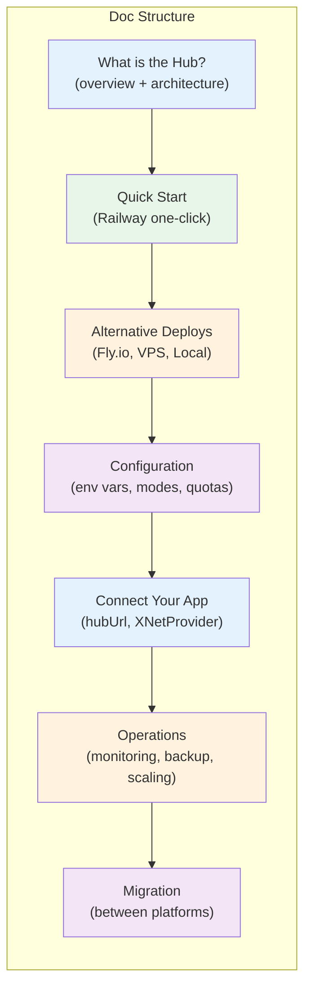

# 19: Hub Documentation

> Comprehensive setup guide in the docs site — from one-click deploy to client integration

**Dependencies:** `17-railway-deploy.md`, `18-flyio-deploy.md`, `08-client-integration.md`
**Modifies:** `site/src/content/docs/docs/guides/hub.mdx`, `site/src/components/sections/Hubs.astro`

## Codebase Status (Feb 2026)

> **A Hub docs page already exists** at `site/src/content/docs/docs/guides/hub.mdx` (156 LOC). It covers the current signaling server, self-hosting instructions, and a high-level Hub roadmap. It does NOT document:
>
> - Railway or Fly.io deployment
> - The full Hub (once implemented)
> - SQLite configuration, backup API, query API
> - Client-side `hubUrl` configuration
> - Cost comparison or deployment decision guide
>
> Relevant existing work:
>
> - `site/src/content/docs/docs/guides/hub.mdx` — Current Hub docs page (signaling-focused)
> - `site/src/components/sections/Hubs.astro` — Landing page section with architecture diagram + deploy snippet
> - `17-railway-deploy.md` — Railway one-click deploy
> - `18-flyio-deploy.md` — Fly.io multi-region deploy
> - `07-docker-deploy.md` — Docker + VPS deploy
> - [Exploration 0049](../../explorations/0049_[x]_HUB_RAILWAY_DEPLOYMENT.md) — Railway analysis with cost comparison

## Overview

The Hub docs page needs to evolve from a signaling-focused guide into a comprehensive deployment and configuration reference. It should:

1. **Start with the simplest path** — Railway one-click deploy
2. **Offer alternatives** — Fly.io, VPS/Docker, local binary
3. **Document configuration** — environment variables, CLI flags, operational modes
4. **Guide client integration** — how to point your app at a Hub
5. **Cover operational topics** — monitoring, backup, scaling, migration



## Design Decisions

| Decision              | Choice                              | Rationale                                                                     |
| --------------------- | ----------------------------------- | ----------------------------------------------------------------------------- |
| Default deploy method | Railway                             | Simplest, cheapest, GitHub-integrated. Lowest barrier to entry.               |
| Doc structure         | Progressive disclosure              | Start simple (one-click), add complexity (Fly.io, VPS) as the reader needs it |
| Code examples         | Working snippets                    | Every code block should be copy-pasteable and functional                      |
| Landing page update   | Add Railway mention to Hubs section | Current landing page only shows `docker run` — add Railway as primary         |
| Platform comparison   | Table in docs, not landing page     | Keep landing page simple; detailed comparison in docs                         |

## Implementation

### 1. Rewrite Hub Docs Page

The full rewrite of `site/src/content/docs/docs/guides/hub.mdx`:

````mdx
---
title: 'Hub Setup'
draft: false
description: 'Deploy a Hub for always-on sync, encrypted backup, and team access.'
sidebar:
  order: 8
---

import { Tabs, TabItem } from '@astrojs/starlight/components'

:::note[You will learn]

- What the Hub does and why you might want one
- How to deploy a Hub in under 2 minutes
- How to connect your app to a Hub
- How to monitor and manage your Hub
  :::

## What is the Hub?

xNet works fully peer-to-peer — no server required. But a Hub improves your experience:

| Without Hub                          | With Hub                           |
| ------------------------------------ | ---------------------------------- |
| Sync only when both peers are online | Sync anytime — Hub bridges the gap |
| No backup                            | Encrypted backup (zero-knowledge)  |
| No full-text search across devices   | Server-side FTS5 search            |
| P2P only                             | P2P when possible, Hub when not    |

The Hub never sees your plaintext data. It stores encrypted updates and relays them to your devices.

## Quick Start: Deploy on Railway

The fastest way to get a Hub running. No Docker, no SSH, no TLS setup.

[](https://railway.app/template/xnet-hub)

**What happens:**

1. Railway clones the xNet repo
2. Builds the Hub from its Dockerfile
3. Creates a persistent volume for SQLite + blobs
4. Gives you a URL: `hub-xyz.up.railway.app`

**Cost:** $0-2/month for a personal Hub (covered by Railway's $5 Hobby credit).

### After Deploying

Your Hub is live. Copy the URL and configure your app:

```ts
<XNetProvider config={{
  hubUrl: 'wss://hub-xyz.up.railway.app',
}}>
```
````

That's it. Your devices will sync through the Hub when direct P2P isn't available.

## Alternative Deployments

<Tabs>
  <TabItem label="Fly.io">
    Best for multi-region deployments or if you want auto-start/stop.

    ```bash
    # Install Fly CLI
    curl -L https://fly.io/install.sh | sh
    fly auth login

    # Deploy
    cd packages/hub
    fly launch --no-deploy
    fly volumes create xnet_hub_data --size 1 --region sjc
    fly deploy
    ```

    Cost: ~$2-6/month depending on usage. Machines can auto-suspend when idle.

  </TabItem>

  <TabItem label="VPS (Docker)">
    Best for full control, predictable cost, or existing infrastructure.

    ```bash
    docker run -d \
      --name xnet-hub \
      -p 4444:4444 \
      -v xnet-hub-data:/data \
      --restart unless-stopped \
      ghcr.io/crs48/xnet-hub:latest
    ```

    You'll need to configure TLS yourself (e.g., Caddy, nginx, Cloudflare Tunnel).

    Cost: $4-5/month for a basic VPS (Hetzner, DigitalOcean).

  </TabItem>

  <TabItem label="Local (no Docker)">
    Best for development and testing.

    ```bash
    npx @xnetjs/hub --port 4444 --data ~/.xnet-hub
    ```

    No TLS, no persistence guarantees. Use for local development only.

  </TabItem>
</Tabs>

## Configuration

### Environment Variables

| Variable                    | Default           | Description                                   |
| --------------------------- | ----------------- | --------------------------------------------- |
| `PORT`                      | `4444`            | Listen port (Railway injects this)            |
| `HUB_DATA_DIR`              | `./xnet-hub-data` | SQLite + blob storage directory               |
| `HUB_LOG_LEVEL`             | `info`            | Log verbosity: debug, info, warn, error       |
| `RAILWAY_VOLUME_MOUNT_PATH` | —                 | Auto-set by Railway when a volume is attached |

### CLI Flags

| Flag                | Default           | Description                          |
| ------------------- | ----------------- | ------------------------------------ |
| `--port, -p`        | `4444`            | Listen port                          |
| `--data, -d`        | `./xnet-hub-data` | Data directory                       |
| `--no-auth`         | auth enabled      | Disable UCAN authentication          |
| `--storage`         | `sqlite`          | Storage backend: sqlite or memory    |
| `--max-connections` | `1000`            | Max concurrent WebSocket connections |
| `--log-level`       | `info`            | Log verbosity                        |

Environment variables take precedence over CLI flags.

### Endpoints

| Endpoint         | Method  | Description                                             |
| ---------------- | ------- | ------------------------------------------------------- |
| `ws://`          | WS      | WebSocket connection (signaling + sync)                 |
| `/health`        | GET     | JSON health check (status, uptime, connections, memory) |
| `/metrics`       | GET     | Prometheus-format metrics                               |
| `/backup/:docId` | PUT/GET | Encrypted backup upload/download                        |
| `/files/:cid`    | PUT/GET | Content-addressed file storage                          |

## Connect Your App

### Electron

In Settings, enter your Hub URL. The Background Sync Manager (BSM) handles connection, authentication, and reconnection automatically.

### React (Web/Custom)

```ts
import { XNetProvider } from '@xnetjs/react'

function App() {
  return (
    <XNetProvider config={{
      hubUrl: 'wss://hub-xyz.up.railway.app',
      // Optional: disable auth for local dev
      // hubAuth: false,
    }}>
      {/* Your app */}
    </XNetProvider>
  )
}
```

## Monitoring

### Health Check

```bash
curl https://your-hub.up.railway.app/health
```

```json
{
  "status": "ok",
  "uptime": 86400,
  "platform": "railway",
  "connections": { "active": 3, "max": 1000 },
  "docs": { "hot": 5, "warm": 12, "total": 17 },
  "memory": { "rss": 52428800, "heapUsed": 31457280 }
}
```

### Prometheus Metrics

```bash
curl https://your-hub.up.railway.app/metrics
```

Exposes: `hub_ws_connections_active`, `hub_ws_messages_received_total`, `hub_sync_docs_hot`, `hub_backup_bytes_stored`, and more.

## Platform Comparison

|                  |  Railway   |      Fly.io      |     VPS      |  Local   |
| ---------------- | :--------: | :--------------: | :----------: | :------: |
| **Setup time**   |   ~2 min   |     ~10 min      |   ~30 min    |  ~1 min  |
| **TLS**          | Automatic  |    Automatic     |    Manual    |   None   |
| **Cost (solo)**  |  $0-2/mo   |     $2-4/mo      |   $4-5/mo    |   Free   |
| **Cost (team)**  |  $3-5/mo   |     $4-6/mo      |   $4-5/mo    |   Free   |
| **Git deploy**   |    Yes     |       Yes        |    Manual    |   N/A    |
| **Multi-region** |  Pro only  |     Built-in     |    Manual    |   N/A    |
| **Best for**     | Most users | Latency-critical | Full control | Dev only |

## Further Reading

- [Sync Guide](/docs/guides/sync/) — How P2P sync works
- [Sync Architecture](/docs/concepts/sync-architecture/) — The full sync stack
- [Identity Guide](/docs/guides/identity/) — UCAN tokens and authentication

````

### 2. Update Landing Page Hubs Section

Update the deploy snippet in `site/src/components/sections/Hubs.astro` to show Railway as the primary deployment method, with Docker as secondary:

```astro
<!-- Replace the current deploy snippet with: -->
<div class="mx-auto mt-12 max-w-xl animate-on-scroll">
  <div class="flex gap-2 mb-3 justify-center">
    <button class="deploy-tab active ..." data-target="railway">Railway</button>
    <button class="deploy-tab ..." data-target="docker">Docker</button>
    <button class="deploy-tab ..." data-target="flyio">Fly.io</button>
  </div>

  <!-- Railway tab (default) -->
  <div id="railway" class="deploy-panel">
    <a href="https://railway.app/template/xnet-hub">
      
    </a>
    <p>One click. Automatic HTTPS. $0-2/month.</p>
  </div>

  <!-- Docker tab -->
  <div id="docker" class="deploy-panel hidden">
    <CodeBlock filename="terminal" code={deployCode} />
  </div>

  <!-- Fly.io tab -->
  <div id="flyio" class="deploy-panel hidden">
    <CodeBlock filename="terminal" code={flyDeployCode} />
  </div>
</div>
````

### 3. Hub Docs Structure (Full Page Outline)

The rewritten page should follow this information architecture:

```
Hub Setup
├── What is the Hub? (3 paragraphs + table)
├── Quick Start: Deploy on Railway (button + 4 steps + code)
├── Alternative Deployments (tabs: Fly.io | VPS | Local)
├── Configuration
│   ├── Environment Variables (table)
│   ├── CLI Flags (table)
│   └── Endpoints (table)
├── Connect Your App
│   ├── Electron (prose)
│   └── React (code)
├── Monitoring
│   ├── Health Check (curl + JSON)
│   └── Prometheus Metrics (curl)
├── Platform Comparison (table)
└── Further Reading (links)
```

## Tests

No automated tests for documentation. Validation is:

- [ ] `cd site && pnpm build` succeeds (no broken MDX)
- [ ] All internal links resolve (no 404s)
- [ ] Code blocks are copy-pasteable
- [ ] Tabs component renders correctly in Starlight
- [ ] Deploy button links to correct Railway template URL
- [ ] Platform comparison table is accurate per exploration 0049

## Checklist

- [x] Rewrite `site/src/content/docs/docs/guides/hub.mdx` with full deployment guide
- [x] Add Railway as the primary (first-shown) deployment method
- [x] Add Fly.io deployment tab with `fly launch` + `fly deploy` commands
- [x] Keep VPS/Docker deployment tab with existing `docker run` command
- [x] Add local development deployment option (`npx @xnetjs/hub`)
- [x] Add configuration reference (env vars + CLI flags + endpoints)
- [x] Add client integration examples (Electron + React)
- [x] Add monitoring section (health check + Prometheus)
- [x] Add platform comparison table
- [x] Update landing page Hubs section to show Railway as default deploy
- [ ] Verify `pnpm build` succeeds in `site/`
- [ ] Verify all internal doc links resolve

---

[← Previous: Fly.io Deployment](./18-flyio-deploy.md) | [Back to README](./README.md)
