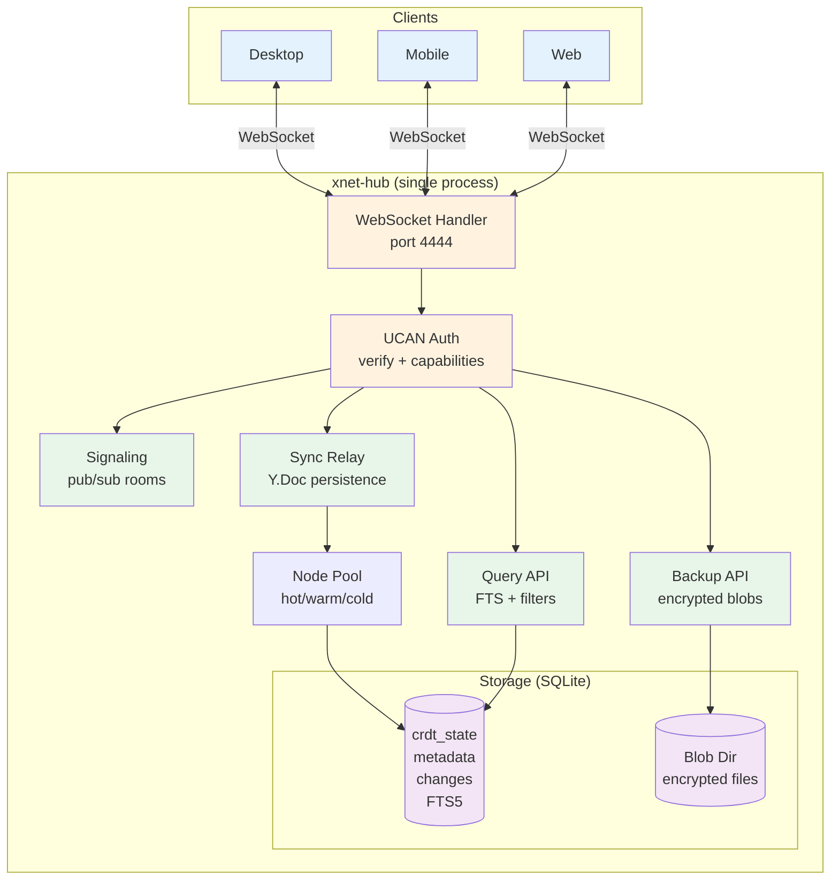

# xNet Implementation Plan - Step 03.8: Hub Phase 1 (VPS / Local Binary)

> Always-on relay, encrypted backup, and server-side queries in a single deployable process

## Executive Summary

The xNet Hub is a server that acts as an always-on sync peer for both rich text (Yjs) and structured data (NodeStore). It persists document state, provides encrypted backup, content-addressed file hosting, a schema registry, awareness persistence, peer discovery, and handles queries too large for mobile devices. It runs as a single process with embedded SQLite -- deployable via Docker or a local binary (`npx @xnetjs/hub`).

```typescript
// Start a hub (CLI or programmatic)
import { createHub } from '@xnetjs/hub'

const hub = await createHub({
  port: 4444,
  dataDir: './data',
  storage: 'sqlite' // or 'postgres' in Phase 2
})

await hub.start()
// Hub is now:
// - Signaling server (y-webrtc pub/sub)
// - Yjs sync relay (persists Y.Doc state)
// - Backup store (encrypted blobs)
// - Query endpoint (full-text search)
```

```bash
# Deploy to VPS
docker run -p 4444:4444 -v xnet-data:/data xnet/hub

# Or run locally (no Docker needed)
npx @xnetjs/hub --port 4444 --data ~/.xnet-hub
```

## Architecture Overview



## Architecture Decisions

| Decision                 | Choice                                    | Rationale                                                                             |
| ------------------------ | ----------------------------------------- | ------------------------------------------------------------------------------------- |
| Single process           | Node.js monolith                          | Simplest deploy, $5 VPS is enough                                                     |
| Database                 | SQLite (better-sqlite3)                   | Zero-config, single-file backup, fast. Already used in Electron main process.         |
| Blob storage             | Filesystem                                | Simple; S3 adapter is Phase 2                                                         |
| Auth                     | UCAN tokens (existing `@xnetjs/identity`) | No new auth system, stateless. **Needs bug fixes first** (see Expl. 0040).            |
| Transport                | WebSocket (existing protocol)             | Zero client changes for signaling+relay. BSM/SyncManager already speak this protocol. |
| HTTP framework           | Hono                                      | Lightweight, typed, works on edge runtimes                                            |
| CLI                      | Commander.js                              | Standard, minimal deps                                                                |
| Hub is a Yjs peer        | Participates in sync-step1/2/update       | No protocol changes needed. Mirrors BSM's Yjs handling.                               |
| Hub is a NodeChange peer | Append-only log, delta sync by Lamport    | Mirrors `@xnetjs/data` Change\<T\> architecture.                                      |
| Backup is opaque blobs   | Server can't read content                 | Zero-knowledge by default. XChaCha20-Poly1305 from `@xnetjs/crypto`.                  |
| Yjs security             | Signed envelopes verified on hub          | `@xnetjs/sync` already implements sign/verify. BSM already uses them.                 |

### Decisions Informed by Explorations

| Exploration                                                                                      | Impact on Hub                                                                                                                                                                   |
| ------------------------------------------------------------------------------------------------ | ------------------------------------------------------------------------------------------------------------------------------------------------------------------------------- |
| [0035 Minimal Signaling-Only Hub](../../explorations/0035_[x]_MINIMAL_SIGNALING_ONLY_HUB.md)     | Hub should support **3 modes**: signaling-only, signaling+relay, full hub — selectable via CLI flag.                                                                            |
| [0040 First-Class Relations](../../explorations/0040_[_]_FIRST_CLASS_RELATIONS.md)               | UCAN has known bugs that must be fixed before hub auth. Relation index on hub enables graph queries.                                                                            |
| [0041 Database Data Model](../../explorations/0041_[x]_DATABASE_DATA_MODEL.md)                   | Database rows as Nodes requires `getChangesSince(lamport)` + pagination on NodeStorageAdapter.                                                                                  |
| [0042 Unified Query API](../../explorations/0042_[_]_UNIFIED_QUERY_API.md)                       | Hub query engine should align with the unified query descriptor format (JSON-serializable, sent over WS). Hub-side FTS5/compound indexes complement lightweight client indexes. |
| [0043 Off-Main-Thread Architecture](../../explorations/0043_[x]_OFF_MAIN_THREAD_ARCHITECTURE.md) | Hub's architecture mirrors the DataBridge/DataWorker pattern. SQLite adapter should be extracted from Electron into a shared package.                                           |
| [0044 AI-Collaborative Editing](../../explorations/0044_[_]_AI_COLLABORATIVE_EDITING.md)         | MCP server connects via Local API (port 31415) or hub HTTP API. Hub enables remote AI agents.                                                                                   |
| [0025 Yjs Security Analysis](../../explorations/0025_[x]_YJS_SECURITY_ANALYSIS.md)               | Hub MUST verify signed Yjs envelopes before applying updates. MetaBridge must be write-only (NodeStore→Yjs, never Yjs→NodeStore).                                               |
| [0026 Node Change Architecture](../../explorations/0026_[x]_NODE_CHANGE_ARCHITECTURE.md)         | Hub node relay = append-only `node_changes` table. Hub does NOT need materialized state or LWW resolution — clients do that.                                                    |
| [0024 Background Sync Manager](../../explorations/0024_[x]_BACKGROUND_SYNC_MANAGER.md)           | BSM's ConnectionManager is the client-side counterpart. Hub auth, backup, search, node sync all share BSM's single connection.                                                  |
| [0023 Decentralized Search](../../explorations/0023_[_]_DECENTRALIZED_SEARCH.md)                 | Three-tier search (local→hub→federated). Hub provides always-available Tier 2 FTS5 index.                                                                                       |
| [0011 Server Infrastructure](../../explorations/0011_[x]_SERVER_INFRASTRUCTURE.md)               | Hybrid Proposal C: start with Node.js monolith + SQLite → swap to Postgres/S3 → scale to multi-worker only if needed.                                                           |

## Current State (as of Feb 2026)

> **`packages/hub/` now exists with Phase 1 scaffolding (CLI + signaling).** All items below are existing building blocks that the hub will compose.

| Component                 | Status                              | Location                                        | Notes                                                                                                                                                           |
| ------------------------- | ----------------------------------- | ----------------------------------------------- | --------------------------------------------------------------------------------------------------------------------------------------------------------------- |
| Signaling server          | **Production** — deployed to Fly.io | `infrastructure/signaling/` (271 LOC)           | Stateless pub/sub relay, Dockerfile + fly.toml. Port 4000. No auth, no persistence.                                                                             |
| WebSocketSyncProvider     | **Complete** (411 LOC)              | `packages/react/src/sync/`                      | Full Yjs sync protocol (step1/step2/update/awareness), reconnection. Clients relay through server.                                                              |
| SyncManager (BSM)         | **Complete** (576 LOC)              | `packages/react/src/sync/sync-manager.ts`       | Top-level sync orchestrator: NodePool, Registry, ConnectionManager, OfflineQueue, BlobSync.                                                                     |
| ConnectionManager         | **Complete** (241 LOC)              | `packages/react/src/sync/connection-manager.ts` | Single multiplexed WebSocket for all rooms. Subscribe/publish/reconnect.                                                                                        |
| BSM (Electron)            | **Complete** (1131 LOC)             | `apps/electron/src/main/bsm.ts`                 | Full sync in main process: signed Yjs envelopes, YjsRateLimiter, YjsPeerScorer, blob sync, MessagePort IPC.                                                     |
| UCAN tokens               | **Complete** (163 LOC)              | `packages/identity/src/ucan.ts`                 | create/verify/capabilities/expiry. **Not wired into signaling or sync** — primitives only.                                                                      |
| UCAN bugs                 | **Fixed** (Feb 2026)                | `packages/identity/`                            | Signature now signs base64url payload; proof chain validation + attenuation enforced.                                                                           |
| NodeStorageAdapter        | **Complete** (291 LOC interface)    | `packages/data/src/store/types.ts`              | IndexedDB + Memory adapters. **No `getChangesSince(lamport)` method** — needed for hub delta sync.                                                              |
| NodeStore                 | **Complete** (683 LOC)              | `packages/data/src/store/`                      | Full CRUD, LWW conflict resolution, transactions, batch changes, remote change apply.                                                                           |
| SQLite adapter (Electron) | **Complete** (149 LOC)              | `apps/electron/src/main/storage.ts`             | `better-sqlite3`, WAL mode. App-level — NOT in a shared package.                                                                                                |
| Security layer            | **Complete** (6 files)              | `packages/network/security/`                    | ConnectionTracker, ConnectionGater, TokenBucket, PeerScorer, AutoBlocker, PeerAccessControl. Operates at libp2p level — **not wired into WebSocket sync path**. |
| Yjs signed envelopes      | **Complete**                        | `packages/sync/yjs-envelope.ts`                 | signYjsUpdate / verifyYjsEnvelope. **Wired into BSM** (Electron), not into web SyncManager.                                                                     |
| Yjs rate limiting         | **Complete**                        | `packages/sync/yjs-limits.ts`                   | MAX_YJS_UPDATE_SIZE, YjsRateLimiter. Wired into BSM.                                                                                                            |
| Yjs peer scoring          | **Complete**                        | `packages/sync/yjs-peer-scoring.ts`             | YjsPeerScorer with penalty/recovery. Wired into BSM.                                                                                                            |
| ClientID attestation      | **Complete**                        | `packages/sync/clientid-attestation.ts`         | create/verify attestations binding clientID to DID.                                                                                                             |
| Crypto primitives         | **Complete**                        | `packages/crypto/`                              | BLAKE3, Ed25519, XChaCha20-Poly1305, X25519. Used throughout.                                                                                                   |
| Local API                 | **Complete** (279 LOC)              | `apps/electron/src/main/local-api.ts`           | HTTP on port 31415. CRUD proxy to renderer NodeStore.                                                                                                           |
| libp2p bootstrap          | **Complete**                        | `infrastructure/bootstrap/`                     | Kademlia DHT bootstrap node with Dockerfile. Currently unused (app uses WS).                                                                                    |
| XNetProvider              | **Complete** (322 LOC)              | `packages/react/src/context.ts`                 | Accepts `signalingServers` config. No `hubUrl` prop yet.                                                                                                        |

### Key Architectural Insight

The current architecture is **fully P2P with a dumb relay**. All intelligence (sync protocol, signing, verification, rate limiting, peer scoring) lives in clients. The hub needs to become a **smart relay** that:

1. Authenticates connections (UCAN primitives exist but are unwired)
2. Persists Y.Doc state server-side (SQLite adapter exists in Electron, needs extraction)
3. Persists NodeChanges server-side (append-only log with delta sync)
4. Acts as an always-online sync peer (the BSM logic can be adapted)
5. Manages workspace access (PeerAccessControl exists but at libp2p level)

### What Can Be Reused vs What Must Be Built

| Reusable                                                           | Must be built                                    |
| ------------------------------------------------------------------ | ------------------------------------------------ |
| Signaling pub/sub protocol (port from `infrastructure/signaling/`) | `packages/hub/` package scaffold                 |
| Yjs sync protocol (adapt from BSM's WS handling)                   | Hub-side Y.Doc persistence + LRU pool            |
| `@xnetjs/identity` UCAN create/verify                              | UCAN integration into WS connect + room auth     |
| `@xnetjs/sync` signed envelopes + rate limiting                    | Server-side NodeChange relay + delta sync        |
| `@xnetjs/crypto` BLAKE3/Ed25519                                    | HubStorage interface + SQLite adapter            |
| `apps/electron/src/main/storage.ts` SQLite patterns                | Query engine (FTS5)                              |
| `packages/data/` NodeStorageAdapter interface                      | HTTP routes (backup, files, schemas)             |
|                                                                    | `getChangesSince(lamport)` on NodeStorageAdapter |

## Implementation Phases

> **Prerequisite:** Fix UCAN signature bug in `@xnetjs/identity` (signs raw JSON, should sign base64url — see Exploration 0040). This blocks Phase 2 auth.

### Phase 1: Package Scaffold + Signaling (Day 1)

| Task | Document                                           | Description                                     | Existing Code                                                    |
| ---- | -------------------------------------------------- | ----------------------------------------------- | ---------------------------------------------------------------- |
| 1.1  | [01-package-scaffold.md](./01-package-scaffold.md) | Create `packages/hub` with deps, tsconfig       | —                                                                |
| 1.2  | [01-package-scaffold.md](./01-package-scaffold.md) | CLI entry point with Commander.js               | —                                                                |
| 1.3  | [01-package-scaffold.md](./01-package-scaffold.md) | Port signaling from `infrastructure/signaling/` | `infrastructure/signaling/src/server.ts` (271 LOC) — direct port |

**Validation Gate:**

- [ ] `npx @xnetjs/hub` starts and shows "Hub listening on port 4444"
- [ ] Existing `WebSocketSyncProvider` connects without changes
- [ ] Existing BSM (Electron) connects without changes
- [ ] `/health` endpoint returns JSON status
- [ ] `infrastructure/signaling/` tests pass against new hub

### Phase 2: UCAN Authentication (Day 2)

| Task | Document                             | Description                                         | Existing Code                                                  |
| ---- | ------------------------------------ | --------------------------------------------------- | -------------------------------------------------------------- |
| 2.0  | —                                    | Fix UCAN signature format bug in `@xnetjs/identity` | `packages/identity/src/ucan.ts` — fix signing to use base64url |
| 2.1  | [02-ucan-auth.md](./02-ucan-auth.md) | UCAN verification on WebSocket connect              | `@xnetjs/identity` verifyUCAN exists                           |
| 2.2  | [02-ucan-auth.md](./02-ucan-auth.md) | Room-level capability checks                        | —                                                              |
| 2.3  | [02-ucan-auth.md](./02-ucan-auth.md) | Anonymous mode for dev/local use                    | —                                                              |

**Validation Gate:**

- [ ] UCAN signature format fixed and tests pass
- [ ] Connections without valid UCAN are rejected (unless anonymous mode)
- [ ] Room subscriptions require matching capability
- [ ] `--no-auth` flag disables auth (for local dev)

### Phase 3: Sync Relay (Days 3-4)

| Task | Document                                       | Description                                      | Existing Code                                                    |
| ---- | ---------------------------------------------- | ------------------------------------------------ | ---------------------------------------------------------------- |
| 3.1  | [03-sync-relay.md](./03-sync-relay.md)         | Hub as a Yjs peer (sync-step1/2/update handling) | BSM already does this (1131 LOC) — adapt server-side             |
| 3.2  | [03-sync-relay.md](./03-sync-relay.md)         | Verify signed Yjs envelopes before applying      | `@xnetjs/sync` signYjsUpdate/verifyYjsEnvelope exist             |
| 3.3  | [03-sync-relay.md](./03-sync-relay.md)         | Node Pool with LRU eviction (hot/warm/cold)      | `packages/react/src/sync/node-pool.ts` — similar pattern         |
| 3.4  | [04-sqlite-storage.md](./04-sqlite-storage.md) | SQLite storage adapter for Y.Doc state           | `apps/electron/src/main/storage.ts` (149 LOC) — extract + extend |
| 3.5  | [04-sqlite-storage.md](./04-sqlite-storage.md) | Debounced persistence (1s after last update)     | —                                                                |

**Validation Gate:**

- [ ] Hub responds to sync-step1 with its persisted state
- [ ] Hub verifies signed Yjs envelopes (rejects unsigned in auth mode)
- [ ] Client disconnects, reconnects, gets latest state from hub
- [ ] Two clients sync through hub even when not online simultaneously
- [ ] Idle docs evicted from memory, reloaded on next access
- [ ] SQLite database contains CRDT state after hub restart

### Phase 4: Encrypted Backup (Day 5)

| Task | Document                               | Description                                        | Existing Code                                               |
| ---- | -------------------------------------- | -------------------------------------------------- | ----------------------------------------------------------- |
| 4.1  | [05-backup-api.md](./05-backup-api.md) | HTTP endpoints for blob upload/download/list       | —                                                           |
| 4.2  | [05-backup-api.md](./05-backup-api.md) | UCAN-gated per-doc backup access                   | —                                                           |
| 4.3  | [05-backup-api.md](./05-backup-api.md) | Storage quota enforcement                          | —                                                           |
| 4.4  | [05-backup-api.md](./05-backup-api.md) | Filesystem blob store with content-addressed paths | `@xnetjs/storage` BlobStore uses BLAKE3 CIDs — same pattern |

**Validation Gate:**

- [ ] `PUT /backup/:docId` stores encrypted blob
- [ ] `GET /backup/:docId` retrieves it
- [ ] `GET /backup` lists all backups for authenticated DID
- [ ] Uploads exceeding quota are rejected with 413
- [ ] Blobs are opaque on disk (not readable without client key)

### Phase 5: Query Engine (Day 6)

| Task | Document                                   | Description                               | Existing Code                                   |
| ---- | ------------------------------------------ | ----------------------------------------- | ----------------------------------------------- |
| 5.1  | [06-query-engine.md](./06-query-engine.md) | SQLite FTS5 index for searchable metadata | —                                               |
| 5.2  | [06-query-engine.md](./06-query-engine.md) | Query protocol over WebSocket             | Align with Expl. 0042 unified query descriptors |
| 5.3  | [06-query-engine.md](./06-query-engine.md) | Schema + property filter queries          | —                                               |
| 5.4  | [06-query-engine.md](./06-query-engine.md) | User-controlled indexing opt-in           | —                                               |

> **Query API alignment:** The query protocol should use the JSON-serializable query descriptor format from [Exploration 0042](../../explorations/0042_[_]_UNIFIED_QUERY_API.md). This ensures the same `useQuery()` calls work locally and can be offloaded to the hub for heavy queries.

**Validation Gate:**

- [ ] Client sends query message, receives filtered results
- [ ] Full-text search returns ranked matches
- [ ] Only explicitly indexed data is searchable
- [ ] Queries without index permission return empty results

### Phase 6: Docker + Deploy (Day 7)

| Task | Document                                     | Description                                         | Existing Code                                              |
| ---- | -------------------------------------------- | --------------------------------------------------- | ---------------------------------------------------------- |
| 6.1  | [07-docker-deploy.md](./07-docker-deploy.md) | Multi-stage Dockerfile (build + runtime)            | `infrastructure/signaling/Dockerfile` — similar pattern    |
| 6.2  | [07-docker-deploy.md](./07-docker-deploy.md) | Health checks + Prometheus metrics                  | Signaling already has `/health` + `/metrics`               |
| 6.3  | [07-docker-deploy.md](./07-docker-deploy.md) | fly.toml for Fly.io deployment                      | `infrastructure/signaling/fly.toml` — adapt                |
| 6.4  | [07-docker-deploy.md](./07-docker-deploy.md) | Graceful shutdown (persist docs, close connections) | —                                                          |
| 6.5  | [07-docker-deploy.md](./07-docker-deploy.md) | Rate limiting + message size limits                 | `@xnetjs/sync` YjsRateLimiter exists for per-update limits |

**Validation Gate:**

- [ ] `docker build` produces working image under 150MB
- [ ] Container starts, serves health check, accepts WebSocket connections
- [ ] `fly deploy` succeeds and hub is reachable via wss://
- [ ] SIGTERM triggers graceful shutdown (all docs persisted)
- [ ] Oversized messages (>5MB) are rejected

### Phase 7: Client Integration (Days 8-9)

| Task | Document                                               | Description                                     | Existing Code                                                          |
| ---- | ------------------------------------------------------ | ----------------------------------------------- | ---------------------------------------------------------------------- |
| 7.1  | [08-client-integration.md](./08-client-integration.md) | Hub URL config in XNetProvider                  | `XNetProvider` already accepts `signalingServers` — extend to `hubUrl` |
| 7.2  | [08-client-integration.md](./08-client-integration.md) | UCAN token on BSM ConnectionManager             | `ConnectionManager` (241 LOC) already connects via WS — add `?token=`  |
| 7.3  | [08-client-integration.md](./08-client-integration.md) | AutoBackup attached to BSM NodePool             | `node-pool.ts` exists with dirty/evict events                          |
| 7.4  | [08-client-integration.md](./08-client-integration.md) | Hub search + status via BSM's single connection | —                                                                      |

> **BSM Integration:** Hub client features layer onto the existing `SyncManager`'s `ConnectionManager` (already implemented in `packages/react/src/sync/`). No separate WebSocket — auth, backup, search, and node sync all share BSM's single connection. The Electron BSM (`apps/electron/src/main/bsm.ts`) already implements signed envelope handling that the hub will verify.

**Validation Gate:**

- [x] `XNetProvider` accepts `hubUrl` option (passed to SyncManager/BSM ConnectionManager)
- [x] ConnectionManager appends UCAN token to hub WebSocket URL
- [x] AutoBackup watches NodePool dirty/evict events
- [x] UI shows hub connection status (reads SyncManager connection state)

### Phase 8: Node Sync Relay (Days 10-11)

| Task | Document                                         | Description                                            | Existing Code                                                  |
| ---- | ------------------------------------------------ | ------------------------------------------------------ | -------------------------------------------------------------- |
| 8.1  | [09-node-sync-relay.md](./09-node-sync-relay.md) | NodeChange persistence (append-only log)               | `@xnetjs/data` Change\<T\> type, NodeStore event-sourced model |
| 8.2  | [09-node-sync-relay.md](./09-node-sync-relay.md) | Delta sync protocol (since Lamport time)               | `@xnetjs/sync` LamportClock exists                             |
| 8.3  | [09-node-sync-relay.md](./09-node-sync-relay.md) | Broadcast + deduplication by hash                      | BLAKE3 hashing in `@xnetjs/crypto`                             |
| 8.4  | [09-node-sync-relay.md](./09-node-sync-relay.md) | Add `getChangesSince(lamport)` to NodeStorageAdapter   | **Gap**: not on current interface (291 LOC)                    |
| 8.5  | [09-node-sync-relay.md](./09-node-sync-relay.md) | Client-side NodeStoreSyncProvider on ConnectionManager | —                                                              |

**Validation Gate:**

- [x] Structured data (tasks, properties) syncs through hub
- [x] Two devices sync NodeChanges without being online simultaneously
- [x] Duplicate changes (same hash) are not stored twice
- [x] Delta sync returns only changes since requested Lamport time
- [x] `getChangesSince(lamport)` added to `NodeStorageAdapter` interface + IndexedDB adapter

### Phase 9: File Storage (Day 12)

| Task | Document                                   | Description                                | Existing Code                                                   |
| ---- | ------------------------------------------ | ------------------------------------------ | --------------------------------------------------------------- |
| 9.1  | [10-file-storage.md](./10-file-storage.md) | Content-addressed upload (PUT /files/:cid) | `@xnetjs/storage` BlobStore + ChunkManager use same CID pattern |
| 9.2  | [10-file-storage.md](./10-file-storage.md) | BLAKE3 CID verification on upload          | `@xnetjs/crypto` blake3                                         |
| 9.3  | [10-file-storage.md](./10-file-storage.md) | Download with immutable cache headers      | —                                                               |
| 9.4  | [10-file-storage.md](./10-file-storage.md) | Client-side useFileUpload hook             | —                                                               |

**Validation Gate:**

- [x] `PUT /files/:cid` stores file, verifies hash matches
- [x] `GET /files/:cid` returns file with correct Content-Type
- [x] Duplicate uploads (same CID) are deduplicated
- [x] Cache-Control: immutable set on responses
- [x] Storage quota enforcement per user

### Phase 10: Schema Registry (Day 13)

| Task | Document                                         | Description                              | Existing Code                               |
| ---- | ------------------------------------------------ | ---------------------------------------- | ------------------------------------------- |
| 10.1 | [11-schema-registry.md](./11-schema-registry.md) | Publish schemas (POST /schemas)          | `@xnetjs/data` SchemaRegistry class exists  |
| 10.2 | [11-schema-registry.md](./11-schema-registry.md) | Resolve by IRI (GET /schemas/resolve/)   | —                                           |
| 10.3 | [11-schema-registry.md](./11-schema-registry.md) | Search/discover schemas                  | —                                           |
| 10.4 | [11-schema-registry.md](./11-schema-registry.md) | Remote resolver fallback in @xnetjs/data | Add `setRemoteResolver()` to SchemaRegistry |

**Validation Gate:**

- [x] Schema author can publish to their DID namespace
- [x] Other users can resolve schemas by IRI
- [x] Search finds schemas by keyword
- [x] Namespace ownership enforced (can't publish to others' DIDs)
- [x] `SchemaRegistry.setRemoteResolver()` queries hub as fallback

### Phase 11: Awareness Persistence (Day 14)

| Task | Document                                                     | Description                           | Existing Code                                                 |
| ---- | ------------------------------------------------------------ | ------------------------------------- | ------------------------------------------------------------- |
| 11.1 | [12-awareness-persistence.md](./12-awareness-persistence.md) | Persist last-known awareness per user | `@xnetjs/data` awareness.ts has UserPresence type             |
| 11.2 | [12-awareness-persistence.md](./12-awareness-persistence.md) | Send awareness-snapshot on room join  | —                                                             |
| 11.3 | [12-awareness-persistence.md](./12-awareness-persistence.md) | TTL-based cleanup of stale entries    | —                                                             |
| 11.4 | [12-awareness-persistence.md](./12-awareness-persistence.md) | Enhanced usePresence hook             | Currently embedded in useNode's `presence` — needs extraction |

**Validation Gate:**

- [x] New subscriber gets awareness-snapshot with recent users
- [x] Snapshot includes last-seen timestamps
- [x] Stale entries cleaned up after TTL
- [x] UI shows "Alice · last edited 2 hours ago"
- [x] Empty rooms don't send snapshots

### Phase 12: Peer Discovery (Day 15)

| Task | Document                                       | Description                               | Existing Code                                            |
| ---- | ---------------------------------------------- | ----------------------------------------- | -------------------------------------------------------- |
| 12.1 | [13-peer-discovery.md](./13-peer-discovery.md) | Peer registry (POST /dids/register)       | —                                                        |
| 12.2 | [13-peer-discovery.md](./13-peer-discovery.md) | DID resolution (GET /dids/:did)           | `@xnetjs/network` DIDResolver exists (needs replacement) |
| 12.3 | [13-peer-discovery.md](./13-peer-discovery.md) | Auto-register on WebSocket connect        | —                                                        |
| 12.4 | [13-peer-discovery.md](./13-peer-discovery.md) | DIDResolver implementation (replace stub) | —                                                        |

**Validation Gate:**

- [x] Peers can register endpoints by DID
- [x] Other peers can resolve DIDs to endpoints
- [x] Auto-registration on authenticated WS connect
- [x] `DIDResolver.resolve()` returns hub-registered endpoints (not null)
- [x] Stale peers cleaned up after 7 days

### Phase 13: Hub Federation Search (Days 16-18)

> **Note:** Phases 13-15 are advanced distributed systems features. They are architecturally sound but should only be implemented after Phases 1-12 are stable and in production use. See [Exploration 0023](../../explorations/0023_[_]_DECENTRALIZED_SEARCH.md) for the full three-tier search design.

| Task | Document                                                     | Description                               |
| ---- | ------------------------------------------------------------ | ----------------------------------------- |
| 13.1 | [14-hub-federation-search.md](./14-hub-federation-search.md) | FederationService with peer query routing |
| 13.2 | [14-hub-federation-search.md](./14-hub-federation-search.md) | /federation/query HTTP endpoint           |
| 13.3 | [14-hub-federation-search.md](./14-hub-federation-search.md) | Reciprocal Rank Fusion + CID dedup        |
| 13.4 | [14-hub-federation-search.md](./14-hub-federation-search.md) | Peer health checks + rate limiting        |
| 13.5 | [14-hub-federation-search.md](./14-hub-federation-search.md) | `federate: true` option in query-request  |

**Validation Gate:**

- [x] Hub A queries Hub B and returns merged results
- [x] Duplicate content (same CID) is deduplicated across hubs
- [x] Schema filter routes to hubs that serve that schema
- [x] Unresponsive hubs timeout gracefully (partial results returned)
- [x] `/federation/status` shows hub capabilities and peer count
- [x] Rate limiting prevents abuse between hubs

### Phase 14: Global Index Shards (Days 19-22)

| Task | Document                                                 | Description                                 |
| ---- | -------------------------------------------------------- | ------------------------------------------- |
| 14.1 | [15-global-index-shards.md](./15-global-index-shards.md) | ShardRegistry with consistent hashing       |
| 14.2 | [15-global-index-shards.md](./15-global-index-shards.md) | ShardIngestRouter (term extraction + route) |
| 14.3 | [15-global-index-shards.md](./15-global-index-shards.md) | ShardQueryRouter (parallel shard queries)   |
| 14.4 | [15-global-index-shards.md](./15-global-index-shards.md) | BM25 scoring across shards                  |
| 14.5 | [15-global-index-shards.md](./15-global-index-shards.md) | Shard rebalancing on hub join/leave         |

**Validation Gate:**

- [x] Terms hash deterministically to the same shard
- [x] Documents ingested to correct shard based on term hashing
- [x] Multi-term queries route to multiple shards in parallel
- [x] BM25 scoring produces relevant rankings across shards
- [x] Replica fallback works when primary shard host is down
- [x] `/shards/assignments` returns current shard topology

### Phase 15: Crawl Coordination (Days 23-26)

| Task | Document                                               | Description                                 |
| ---- | ------------------------------------------------------ | ------------------------------------------- |
| 15.1 | [16-crawl-coordination.md](./16-crawl-coordination.md) | CrawlCoordinator with URL queue             |
| 15.2 | [16-crawl-coordination.md](./16-crawl-coordination.md) | Crawler registration + task assignment      |
| 15.3 | [16-crawl-coordination.md](./16-crawl-coordination.md) | Result submission + shard ingestion         |
| 15.4 | [16-crawl-coordination.md](./16-crawl-coordination.md) | Robots.txt compliance                       |
| 15.5 | [16-crawl-coordination.md](./16-crawl-coordination.md) | Crawler reputation + domain rate limiting   |
| 15.6 | [16-crawl-coordination.md](./16-crawl-coordination.md) | XNetCrawler client reference implementation |

**Validation Gate:**

- [x] Crawlers register and receive URL assignments
- [x] Domain rate limiting prevents abuse (1 page/2s/domain)
- [x] Robots.txt is fetched, parsed, and respected
- [x] CID-based deduplication skips unchanged content
- [x] Outlinks are extracted and added to queue
- [x] Dead tasks expire and are reassigned
- [x] Crawler reputation tracks quality over time

### Phase 16: Yjs Security

> **Moved to standalone plan:** [plan03_4_1YjsSecurity](../plan03_4_1YjsSecurity/README.md)
>
> Yjs security is a cross-cutting concern affecting both hub and client packages. The full 8-step implementation plan (signed envelopes, UCAN auth, size limits, MetaBridge isolation, hash-at-rest, peer scoring, clientID binding, hash chain integration) lives in its own plan step.

### Phase 17: Railway Deployment — Default (Day 27)

| Task | Document                                       | Description                                          |
| ---- | ---------------------------------------------- | ---------------------------------------------------- |
| 17.1 | [17-railway-deploy.md](./17-railway-deploy.md) | `resolveConfig()` with env var → CLI → default chain |
| 17.2 | [17-railway-deploy.md](./17-railway-deploy.md) | `railway.toml` config as code                        |
| 17.3 | [17-railway-deploy.md](./17-railway-deploy.md) | Dockerfile adjustments for Railway volumes           |
| 17.4 | [17-railway-deploy.md](./17-railway-deploy.md) | Railway template + "Deploy on Railway" button        |
| 17.5 | [17-railway-deploy.md](./17-railway-deploy.md) | Graceful shutdown within Railway grace period        |

**Validation Gate:**

- [x] Hub reads `PORT` and `RAILWAY_VOLUME_MOUNT_PATH` env vars
- [ ] `railway.toml` deploys successfully from GitHub
- [ ] One-click "Deploy on Railway" button works
- [ ] Health check passes on Railway
- [x] Graceful shutdown completes within 10s grace period
- [ ] Config resolution tests pass (env > CLI > defaults)

### Phase 18: Fly.io Deployment (Day 28)

| Task | Document                                   | Description                                    |
| ---- | ------------------------------------------ | ---------------------------------------------- |
| 18.1 | [18-flyio-deploy.md](./18-flyio-deploy.md) | `fly.toml` with suspend/resume config          |
| 18.2 | [18-flyio-deploy.md](./18-flyio-deploy.md) | Fly.io platform detection (`FLY_REGION`, etc.) |
| 18.3 | [18-flyio-deploy.md](./18-flyio-deploy.md) | Enhanced `/health` with platform/region info   |
| 18.4 | [18-flyio-deploy.md](./18-flyio-deploy.md) | Suspend-aware shutdown grace period            |
| 18.5 | [18-flyio-deploy.md](./18-flyio-deploy.md) | Multi-region deployment guide (future)         |

**Validation Gate:**

- [ ] `fly deploy` succeeds from `packages/hub/`
- [ ] Machine suspends when idle and resumes on request
- [x] Health check includes `platform: "fly"` and `region`
- [ ] WebSocket clients reconnect after Machine wake
- [ ] SQLite WAL flushes correctly on suspend

### Phase 19: Hub Documentation (Day 29)

| Task | Document                           | Description                                        |
| ---- | ---------------------------------- | -------------------------------------------------- |
| 19.1 | [19-hub-docs.md](./19-hub-docs.md) | Rewrite Hub docs page with deployment guide        |
| 19.2 | [19-hub-docs.md](./19-hub-docs.md) | Railway as default, Fly.io + VPS + Local as tabs   |
| 19.3 | [19-hub-docs.md](./19-hub-docs.md) | Configuration reference (env vars, CLI, endpoints) |
| 19.4 | [19-hub-docs.md](./19-hub-docs.md) | Client integration examples (Electron + React)     |
| 19.5 | [19-hub-docs.md](./19-hub-docs.md) | Update landing page Hubs section                   |

**Validation Gate:**

- [x] Hub docs page covers Railway, Fly.io, VPS, and local deployment
- [ ] `cd site && pnpm build` succeeds
- [ ] All internal doc links resolve
- [x] Landing page Hubs section shows Railway as primary deploy option
- [x] Platform comparison table is accurate

## Package Structure (Target)

```
packages/
  hub/
    src/
      index.ts                  # Programmatic API: createHub()
      cli.ts                    # CLI entry: npx @xnetjs/hub
      config.ts                 # resolveConfig() — env var → CLI → default resolution
      server.ts                 # Hono HTTP + WebSocket server
      services/
        signaling.ts            # Room pub/sub (ported from infrastructure/)
        relay.ts                # Yjs sync relay (hub as peer)
        node-relay.ts           # NodeChange event-sourced relay
        backup.ts               # Encrypted blob store
        files.ts                # Content-addressed file hosting
        query.ts                # FTS5 query engine
        schemas.ts              # Schema registry
        awareness.ts            # Presence persistence
        discovery.ts            # DID resolution + peer registry
        federation.ts           # Hub-to-hub federated search
        index-shards.ts         # Global index shard management
        shard-router.ts         # Query routing across shards
        shard-ingest.ts         # Document ingestion to shards
        crawl.ts                # Crawl coordination
        crawl-robots.ts         # Robots.txt compliance
        yjs-security.ts         # Signed envelope verification (see plan03_4_1YjsSecurity)
        yjs-peer-scoring.ts     # Yjs-specific peer scoring (see plan03_4_1YjsSecurity)
      routes/
        backup.ts               # /backup HTTP endpoints
        files.ts                # /files HTTP endpoints
        schemas.ts              # /schemas HTTP endpoints
        dids.ts                 # /dids HTTP endpoints
        federation.ts           # /federation HTTP endpoints
        shards.ts               # /shards HTTP endpoints
        crawl.ts                # /crawl HTTP endpoints
      storage/
        interface.ts            # HubStorage interface
        sqlite.ts               # SQLite adapter (better-sqlite3)
        memory.ts               # In-memory adapter (tests)
      auth/
        ucan.ts                 # UCAN verification middleware
        capabilities.ts         # Hub-specific capabilities
      pool/
        node-pool.ts            # Y.Doc memory management (LRU)
      client/
        crawler-client.ts       # Reference crawler implementation
      middleware/
        rate-limit.ts           # Per-connection rate limiting
        metrics.ts              # Prometheus metrics
      lifecycle/
        shutdown.ts             # Graceful shutdown handler
    bin/
      xnet-hub.ts               # CLI binary entry point
    test/
      signaling.test.ts         # Protocol tests
      relay.test.ts             # Sync relay tests
      node-relay.test.ts        # Node sync tests
      backup.test.ts            # Backup API tests
      files.test.ts             # File storage tests
      query.test.ts             # Query engine tests
      schemas.test.ts           # Schema registry tests
      awareness.test.ts         # Awareness persistence tests
      discovery.test.ts         # Peer discovery tests
      federation.test.ts        # Hub federation tests
      shards.test.ts            # Index shard tests
      crawl.test.ts             # Crawl coordination tests
      auth.test.ts              # UCAN auth tests
      config.test.ts            # Config resolution tests (env vars, CLI, defaults)
      deploy.test.ts            # Production readiness tests
      railway-deploy.test.ts    # Railway deployment compatibility tests
      flyio-deploy.test.ts      # Fly.io deployment compatibility tests
      storage.test.ts           # Storage adapter tests
    Dockerfile
    fly.toml
    railway.toml
    package.json
    tsconfig.json
```

## Platform Considerations

| Feature            | Local Binary                  | Docker                | Railway (Default)         | Fly.io                 |
| ------------------ | ----------------------------- | --------------------- | ------------------------- | ---------------------- |
| TLS                | User provides (reverse proxy) | User provides (Caddy) | Automatic                 | Automatic              |
| Persistent storage | `--data` flag (filesystem)    | Volume mount          | Volume mount              | Fly volume             |
| Blob storage       | Filesystem                    | Volume mount          | Volume mount              | Fly volume / Tigris S3 |
| Auto-restart       | User manages (systemd)        | `--restart always`    | Built-in                  | Built-in               |
| Git deploy         | —                             | Manual CI/CD          | Automatic on push         | `fly deploy`           |
| Metrics            | `/metrics` endpoint           | Same                  | Same + built-in dashboard | Same + Prometheus      |
| Cost (solo)        | Free (own hardware)           | Free (own hardware)   | ~$0-2/mo                  | ~$2-4/mo               |
| Cost (team)        | Free (own hardware)           | Free (own hardware)   | ~$3-5/mo                  | ~$4-6/mo               |

## Dependencies

| Dependency          | Package   | Purpose                                                                         | Status                                           |
| ------------------- | --------- | ------------------------------------------------------------------------------- | ------------------------------------------------ |
| `hono`              | External  | HTTP server + routing                                                           | Not yet in monorepo                              |
| `@hono/node-server` | External  | Node.js adapter for Hono                                                        | Not yet in monorepo                              |
| `ws`                | External  | WebSocket server                                                                | Already used by signaling + BSM                  |
| `better-sqlite3`    | External  | SQLite database                                                                 | Already used by Electron main process            |
| `commander`         | External  | CLI argument parsing                                                            | Not yet in monorepo                              |
| `yjs`               | External  | Y.Doc instances on server                                                       | Already used throughout                          |
| `y-protocols`       | External  | Yjs sync protocol encoding                                                      | Already used by WebSocketSyncProvider + BSM      |
| `@xnetjs/identity`  | Workspace | UCAN verification (create/verify/capabilities)                                  | **Complete** — needs sig format bug fix          |
| `@xnetjs/crypto`    | Workspace | BLAKE3 hashing, Ed25519 signing, XChaCha20                                      | **Complete**                                     |
| `@xnetjs/core`      | Workspace | ContentId, DID, types                                                           | **Complete**                                     |
| `@xnetjs/sync`      | Workspace | Change verification, Lamport clocks, Yjs envelopes, rate limiting, peer scoring | **Complete** — all used by BSM                   |
| `@xnetjs/data`      | Workspace | NodeChange types, schema types, NodeStorageAdapter                              | **Complete** — needs `getChangesSince` extension |

## Success Criteria

1. **`npx @xnetjs/hub` starts a working hub** with zero configuration
2. **Existing clients sync through hub** without code changes (same WebSocket protocol)
3. **Hub persists Y.Doc state** across restarts (SQLite)
4. **Two clients sync without being online simultaneously** (hub bridges the gap)
5. **Encrypted backup** stores and retrieves opaque blobs
6. **Full-text search** returns results for indexed documents
7. **Docker image under 150MB**, starts in under 3 seconds
8. **Fly.io deploys** with `fly deploy` and serves wss:// connections
9. **Auth is optional** (anonymous mode for local dev, UCAN for production)
10. **Graceful shutdown** persists all in-memory state before exit
11. **Structured data (NodeChanges) syncs through hub** — not just rich text
12. **File attachments upload/download** by content-addressed CID
13. **Schema registry** resolves shared schemas by IRI from the network
14. **Awareness persistence** shows "who was here" after they disconnect
15. **DID resolution** finds peers by identity (replaces stub resolver)
16. **Hub federation** queries peer hubs and returns merged, deduplicated results
17. **Global index shards** distribute search across multiple hubs with BM25 scoring
18. **Crawl coordination** assigns URLs to volunteer crawlers and indexes results
19. **Yjs security** — see [plan03_4_1YjsSecurity](../plan03_4_1YjsSecurity/README.md)
20. **Railway deploys** with one click and serves wss:// connections at $0-2/mo
21. **Fly.io deploys** with `fly deploy`, supports suspend/resume and multi-region
22. **Hub docs** provide comprehensive setup guide from one-click deploy to monitoring

## Reference Documents

### Plans

- [Background Sync Manager Plan](../plan03_3_1BgSync/README.md) — Client-side sync orchestrator (BSM subsumes HubConnection)
- [P2P Signaling Plan](../plan03_2Signaling/README.md) — Current signaling architecture
- [Telemetry & Network Security](../plan03_1TelemetryAndNetworkSecurity/README.md) — Security layer design
- [Yjs Security Plan](../plan03_4_1YjsSecurity/README.md) — Signed envelopes, UCAN, size limits, peer scoring

### Explorations (Architecture)

- [0011 Server Infrastructure](../../explorations/0011_[x]_SERVER_INFRASTRUCTURE.md) — Full research with 3 proposals → Hybrid Proposal C chosen
- [0016 Persistence Architecture](../../explorations/0016_[x]_PERSISTENCE_ARCHITECTURE.md) — Storage durability tiers
- [0024 Background Sync Manager](../../explorations/0024_[x]_BACKGROUND_SYNC_MANAGER.md) — BSM design decisions, platform considerations
- [0035 Minimal Signaling-Only Hub](../../explorations/0035_[x]_MINIMAL_SIGNALING_ONLY_HUB.md) — 3 hub modes (signaling-only → full hub), HybridSyncProvider
- [0043 Off-Main-Thread Architecture](../../explorations/0043_[x]_OFF_MAIN_THREAD_ARCHITECTURE.md) — DataBridge pattern, hub mirrors utility process model

### Explorations (Security & Sync)

- [0025 Yjs Security Analysis](../../explorations/0025_[x]_YJS_SECURITY_ANALYSIS.md) — Threat model for unsigned rich text updates
- [0026 Node Change Architecture](../../explorations/0026_[x]_NODE_CHANGE_ARCHITECTURE.md) — Event-sourced structured data, hub relay = append-only log
- [0040 First-Class Relations](../../explorations/0040_[_]_FIRST_CLASS_RELATIONS.md) — UCAN bugs identified (now fixed), relation index for graph queries

### Explorations (Data & Query)

- [0041 Database Data Model](../../explorations/0041_[x]_DATABASE_DATA_MODEL.md) — Rows as Nodes, pagination needed on NodeStorageAdapter
- [0042 Unified Query API](../../explorations/0042_[_]_UNIFIED_QUERY_API.md) — JSON-serializable query descriptors, hub-side FTS5/compound indexes
- [0023 Decentralized Search](../../explorations/0023_[_]_DECENTRALIZED_SEARCH.md) — Three-tier search (local → hub → federated), BM25 + social trust

### Explorations (Deployment)

- [0049 Hub Railway Deployment](../../explorations/0049_[x]_HUB_RAILWAY_DEPLOYMENT.md) — Railway platform analysis, cost comparison, architecture compatibility

### Explorations (AI & Integration)

- [0044 AI-Collaborative Editing](../../explorations/0044_[_]_AI_COLLABORATIVE_EDITING.md) — MCP server via Local API or hub HTTP, Markdown ↔ Yjs conversion

---

[Back to Main Plan](../plan00Setup/README.md) | [Start Implementation →](./01-package-scaffold.md)
