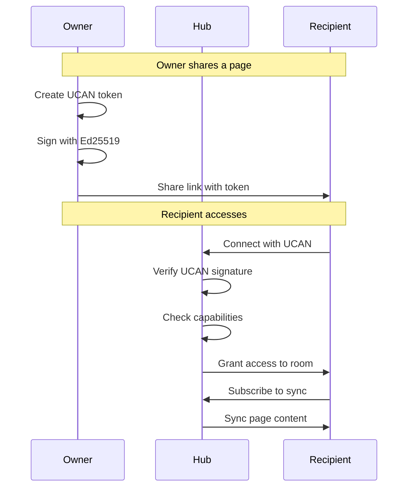

# 04: Sharing & Permissions

> Share content with others and control access with UCAN tokens

**Duration:** 3 days
**Dependencies:** Hub infrastructure, UCAN tokens from `@xnetjs/identity`

## Overview

Sharing in xNet uses UCAN (User-Controlled Authorization Network) tokens. When you share a page, you create a cryptographically signed token that grants specific permissions. The recipient presents this token to the hub to prove access.



## Share Link Format

```
https://xnet.fyi/s/[encoded-share-data]

Share data (base64url encoded):
{
  "v": 1,                                    // Version
  "r": "xnet://did:key:z.../workspace/abc",  // Resource
  "u": "eyJ...",                             // UCAN token
  "h": "wss://hub.xnet.fyi"                  // Hub URL (optional)
}
```

## Implementation

### 1. Share Token Creation

```typescript
// packages/identity/src/sharing/create-share.ts

import { createUcan } from '../ucan'
import type { Identity, DID } from '../types'

export interface ShareOptions {
  /** Resource to share (page, database, workspace) */
  resource: string

  /** Permission level */
  permission: 'read' | 'write' | 'admin'

  /** Token expiration (default: 30 days) */
  expiresIn?: number

  /** Specific recipient DID (optional - for private shares) */
  audience?: DID
}

export interface ShareToken {
  /** The UCAN token */
  token: string

  /** Resource being shared */
  resource: string

  /** Permission granted */
  permission: ShareOptions['permission']

  /** When the share expires */
  expiresAt: number

  /** Shareable link */
  shareLink: string
}

export async function createShareToken(
  identity: Identity,
  options: ShareOptions
): Promise<ShareToken> {
  const {
    resource,
    permission,
    expiresIn = 30 * 24 * 60 * 60 * 1000, // 30 days
    audience
  } = options

  const expiresAt = Date.now() + expiresIn

  // Create UCAN with appropriate capabilities
  const capabilities = buildCapabilities(resource, permission)

  const token = await createUcan({
    issuer: identity,
    audience: audience ?? 'did:web:xnet.fyi', // Public share if no specific audience
    capabilities,
    expiration: Math.floor(expiresAt / 1000),
    facts: [
      {
        shareType: audience ? 'private' : 'public',
        createdAt: Date.now()
      }
    ]
  })

  // Build share link
  const shareData = {
    v: 1,
    r: resource,
    u: token
  }
  const encoded = base64urlEncode(JSON.stringify(shareData))
  const shareLink = `https://xnet.fyi/s/${encoded}`

  return {
    token,
    resource,
    permission,
    expiresAt,
    shareLink
  }
}

function buildCapabilities(
  resource: string,
  permission: ShareOptions['permission']
): UcanCapability[] {
  const capabilities: UcanCapability[] = []

  // Read is always included
  capabilities.push({
    with: resource,
    can: 'xnet/read'
  })

  if (permission === 'write' || permission === 'admin') {
    capabilities.push({
      with: resource,
      can: 'xnet/write'
    })
  }

  if (permission === 'admin') {
    capabilities.push({
      with: resource,
      can: 'xnet/admin'
    })
  }

  return capabilities
}
```

### 2. Share Dialog Component

```typescript
// packages/react/src/sharing/ShareDialog.tsx

import { useState } from 'react'
import { createShareToken } from '@xnetjs/identity'
import { useIdentity } from '../hooks/useIdentity'

interface ShareDialogProps {
  resource: string
  resourceTitle: string
  onClose: () => void
}

export function ShareDialog({ resource, resourceTitle, onClose }: ShareDialogProps) {
  const { identity } = useIdentity()
  const [permission, setPermission] = useState<'read' | 'write'>('read')
  const [shareToken, setShareToken] = useState<ShareToken | null>(null)
  const [copied, setCopied] = useState(false)
  const [loading, setLoading] = useState(false)

  const createLink = async () => {
    if (!identity) return

    setLoading(true)
    try {
      const token = await createShareToken(identity, { resource, permission })
      setShareToken(token)
    } finally {
      setLoading(false)
    }
  }

  const copyLink = async () => {
    if (!shareToken) return

    await navigator.clipboard.writeText(shareToken.shareLink)
    setCopied(true)
    setTimeout(() => setCopied(false), 2000)
  }

  return (
    <Dialog open onClose={onClose}>
      <DialogTitle>Share "{resourceTitle}"</DialogTitle>

      <DialogContent>
        {!shareToken ? (
          <>
            <p>Anyone with the link can access this content.</p>

            <div className="permission-select">
              <label>Permission level</label>
              <select
                value={permission}
                onChange={(e) => setPermission(e.target.value as 'read' | 'write')}
              >
                <option value="read">Can view</option>
                <option value="write">Can edit</option>
              </select>
            </div>

            <div className="expiry-info">
              <InfoIcon size={16} />
              <span>Link expires in 30 days</span>
            </div>

            <button
              className="primary-button"
              onClick={createLink}
              disabled={loading}
            >
              {loading ? <Spinner /> : 'Create share link'}
            </button>
          </>
        ) : (
          <>
            <div className="share-link-container">
              <input
                type="text"
                value={shareToken.shareLink}
                readOnly
                className="share-link-input"
              />
              <button onClick={copyLink} className="copy-button">
                {copied ? <CheckIcon /> : <CopyIcon />}
              </button>
            </div>

            <div className="share-info">
              <div className="info-row">
                <span>Permission:</span>
                <span>{permission === 'read' ? 'View only' : 'Can edit'}</span>
              </div>
              <div className="info-row">
                <span>Expires:</span>
                <span>{formatDate(shareToken.expiresAt)}</span>
              </div>
            </div>

            <button onClick={createLink} className="secondary-button">
              Create new link
            </button>
          </>
        )}
      </DialogContent>

      <DialogActions>
        <button onClick={onClose}>Done</button>
      </DialogActions>
    </Dialog>
  )
}
```

### 3. Access Share Link (Recipient)

```typescript
// packages/react/src/sharing/ShareLinkHandler.tsx

import { useEffect, useState } from 'react'
import { useNavigate, useParams } from 'react-router-dom'
import { verifyUcan, parseShareLink } from '@xnetjs/identity'
import { useHub } from '../hooks/useHub'

export function ShareLinkHandler() {
  const { shareData } = useParams<{ shareData: string }>()
  const navigate = useNavigate()
  const hub = useHub()

  const [status, setStatus] = useState<'verifying' | 'connecting' | 'ready' | 'error'>('verifying')
  const [error, setError] = useState<string | null>(null)

  useEffect(() => {
    if (!shareData) {
      setError('Invalid share link')
      setStatus('error')
      return
    }

    handleShare()
  }, [shareData])

  const handleShare = async () => {
    try {
      // Parse share data
      const { resource, token, hubUrl } = parseShareLink(shareData!)

      // Verify UCAN is valid (not expired, properly signed)
      setStatus('verifying')
      const verification = await verifyUcan(token)

      if (!verification.valid) {
        throw new Error(verification.reason ?? 'Invalid share token')
      }

      // Connect to hub with the share token
      setStatus('connecting')
      await hub.connectWithToken(hubUrl ?? getDefaultHubUrl(), token)

      // Extract page/database ID from resource
      const resourceId = extractResourceId(resource)

      // Navigate to the shared content
      setStatus('ready')
      navigate(`/shared/${resourceId}`, { state: { shareToken: token } })
    } catch (err) {
      setError(err instanceof Error ? err.message : 'Failed to access shared content')
      setStatus('error')
    }
  }

  if (status === 'verifying') {
    return (
      <div className="share-handler-screen">
        <Spinner />
        <p>Verifying share link...</p>
      </div>
    )
  }

  if (status === 'connecting') {
    return (
      <div className="share-handler-screen">
        <Spinner />
        <p>Connecting to shared content...</p>
      </div>
    )
  }

  if (status === 'error') {
    return (
      <div className="share-handler-screen error">
        <AlertCircleIcon size={48} />
        <h2>Cannot access share</h2>
        <p>{error}</p>
        <button onClick={() => navigate('/')}>Go to home</button>
      </div>
    )
  }

  return null
}
```

### 4. Permission Revocation

```typescript
// packages/identity/src/sharing/revocation.ts

export interface Revocation {
  /** The UCAN being revoked */
  ucan: string

  /** CID of the UCAN (for identification) */
  ucanCid: string

  /** When revoked */
  revokedAt: number

  /** Signature from issuer */
  signature: Uint8Array
}

export async function revokeShare(identity: Identity, shareToken: ShareToken): Promise<Revocation> {
  const ucanCid = await computeUcanCid(shareToken.token)

  const revocationPayload = {
    type: 'revocation',
    ucanCid,
    revokedAt: Date.now()
  }

  const signature = await sign(JSON.stringify(revocationPayload), identity.privateKey)

  const revocation: Revocation = {
    ucan: shareToken.token,
    ucanCid,
    revokedAt: Date.now(),
    signature
  }

  return revocation
}

// Store revocations
export class RevocationStore {
  private revocations = new Map<string, Revocation>()

  async revoke(revocation: Revocation): Promise<void> {
    // Verify signature
    const payload = {
      type: 'revocation',
      ucanCid: revocation.ucanCid,
      revokedAt: revocation.revokedAt
    }

    const ucan = decodeUcan(revocation.ucan)
    const valid = await verify(
      JSON.stringify(payload),
      revocation.signature,
      resolveDidKey(ucan.iss)
    )

    if (!valid) {
      throw new Error('Invalid revocation signature')
    }

    this.revocations.set(revocation.ucanCid, revocation)
  }

  isRevoked(ucanCid: string): boolean {
    return this.revocations.has(ucanCid)
  }

  getRevocation(ucanCid: string): Revocation | undefined {
    return this.revocations.get(ucanCid)
  }
}
```

### 5. Hub-Side Access Control

```typescript
// packages/hub/src/services/access-control.ts

export class AccessControlService {
  constructor(private revocationStore: RevocationStore) {}

  async verifyAccess(
    ucan: string,
    resource: string,
    action: 'read' | 'write' | 'admin'
  ): Promise<{ allowed: boolean; reason?: string }> {
    try {
      // Decode UCAN
      const decoded = decodeUcan(ucan)

      // Check expiration
      if (decoded.exp && decoded.exp * 1000 < Date.now()) {
        return { allowed: false, reason: 'Token expired' }
      }

      // Check revocation
      const ucanCid = await computeUcanCid(ucan)
      if (this.revocationStore.isRevoked(ucanCid)) {
        return { allowed: false, reason: 'Token revoked' }
      }

      // Verify signature
      const valid = await verifyUcanSignature(ucan)
      if (!valid) {
        return { allowed: false, reason: 'Invalid signature' }
      }

      // Check capabilities
      const hasCapability = decoded.att.some((cap) => {
        const resourceMatch = cap.with === resource || cap.with === '*'
        const actionMatch = this.actionMatches(cap.can, action)
        return resourceMatch && actionMatch
      })

      if (!hasCapability) {
        return { allowed: false, reason: 'Insufficient permissions' }
      }

      return { allowed: true }
    } catch (err) {
      return { allowed: false, reason: 'Invalid token format' }
    }
  }

  private actionMatches(capability: string, requested: string): boolean {
    const hierarchy = ['xnet/read', 'xnet/write', 'xnet/admin']
    const capIndex = hierarchy.indexOf(capability)
    const reqIndex = hierarchy.indexOf(`xnet/${requested}`)

    if (capIndex === -1 || reqIndex === -1) return false
    return capIndex >= reqIndex
  }
}
```

### 6. Manage Shares UI

```typescript
// packages/react/src/sharing/ManageShares.tsx

interface ActiveShare {
  id: string
  resource: string
  resourceTitle: string
  permission: string
  createdAt: number
  expiresAt: number
  accessCount: number
  lastAccessAt?: number
}

export function ManageShares({ resource }: { resource: string }) {
  const [shares, setShares] = useState<ActiveShare[]>([])
  const [loading, setLoading] = useState(true)

  useEffect(() => {
    loadShares()
  }, [resource])

  const loadShares = async () => {
    const stored = await getSharesForResource(resource)
    setShares(stored)
    setLoading(false)
  }

  const handleRevoke = async (share: ActiveShare) => {
    if (!confirm('Revoke this share? Anyone with the link will lose access.')) {
      return
    }

    await revokeShareById(share.id)
    setShares(shares.filter((s) => s.id !== share.id))
  }

  if (loading) {
    return <Spinner />
  }

  if (shares.length === 0) {
    return (
      <div className="no-shares">
        <p>No active shares</p>
      </div>
    )
  }

  return (
    <div className="manage-shares">
      <h3>Active Shares</h3>

      <div className="shares-list">
        {shares.map((share) => (
          <div key={share.id} className="share-item">
            <div className="share-info">
              <span className="permission-badge">
                {share.permission === 'read' ? 'View' : 'Edit'}
              </span>
              <span className="created">
                Created {formatRelativeTime(share.createdAt)}
              </span>
              <span className="expires">
                {share.expiresAt > Date.now()
                  ? `Expires ${formatRelativeTime(share.expiresAt)}`
                  : 'Expired'}
              </span>
            </div>

            <div className="share-stats">
              <span>{share.accessCount} views</span>
              {share.lastAccessAt && (
                <span>Last accessed {formatRelativeTime(share.lastAccessAt)}</span>
              )}
            </div>

            <button
              className="revoke-button"
              onClick={() => handleRevoke(share)}
            >
              Revoke
            </button>
          </div>
        ))}
      </div>
    </div>
  )
}
```

### 7. Collaborator Presence

```typescript
// packages/react/src/presence/PresenceIndicator.tsx

import { usePresence } from '../hooks/usePresence'

interface Collaborator {
  did: string
  name?: string
  avatar?: string
  cursor?: { x: number; y: number }
  selection?: { start: number; end: number }
  lastSeen: number
}

export function PresenceIndicator({ roomId }: { roomId: string }) {
  const { collaborators } = usePresence(roomId)

  const activeCollaborators = collaborators.filter(
    (c) => Date.now() - c.lastSeen < 30000 // Active in last 30 seconds
  )

  if (activeCollaborators.length === 0) {
    return null
  }

  return (
    <div className="presence-indicator">
      <div className="avatars">
        {activeCollaborators.slice(0, 5).map((collab) => (
          <Avatar
            key={collab.did}
            name={collab.name ?? truncateDid(collab.did)}
            src={collab.avatar}
            size={28}
          />
        ))}
        {activeCollaborators.length > 5 && (
          <span className="more-count">+{activeCollaborators.length - 5}</span>
        )}
      </div>

      <Tooltip>
        <div className="collaborator-list">
          {activeCollaborators.map((collab) => (
            <div key={collab.did} className="collaborator">
              <Avatar name={collab.name} src={collab.avatar} size={20} />
              <span>{collab.name ?? truncateDid(collab.did)}</span>
              <span className="status">
                {Date.now() - collab.lastSeen < 5000 ? 'Active now' : 'Active recently'}
              </span>
            </div>
          ))}
        </div>
      </Tooltip>
    </div>
  )
}
```

## Testing

```typescript
describe('Sharing', () => {
  describe('createShareToken', () => {
    it('creates valid read-only share', async () => {
      const identity = await createTestIdentity()
      const share = await createShareToken(identity, {
        resource: 'xnet://did:key:z.../workspace/abc/page/123',
        permission: 'read'
      })

      expect(share.permission).toBe('read')
      expect(share.shareLink).toMatch(/^https:\/\/xnet\.dev\/s\//)
      expect(share.expiresAt).toBeGreaterThan(Date.now())
    })

    it('creates share with write permission', async () => {
      const identity = await createTestIdentity()
      const share = await createShareToken(identity, {
        resource: 'xnet://did:key:z.../page/123',
        permission: 'write'
      })

      const decoded = decodeUcan(share.token)
      expect(decoded.att).toContainEqual({ with: share.resource, can: 'xnet/write' })
    })
  })

  describe('verifyAccess', () => {
    it('allows valid token', async () => {
      const identity = await createTestIdentity()
      const share = await createShareToken(identity, {
        resource: 'xnet://did:key:z.../page/123',
        permission: 'read'
      })

      const result = await accessControl.verifyAccess(share.token, share.resource, 'read')

      expect(result.allowed).toBe(true)
    })

    it('rejects expired token', async () => {
      const identity = await createTestIdentity()
      const share = await createShareToken(identity, {
        resource: 'xnet://did:key:z.../page/123',
        permission: 'read',
        expiresIn: -1000 // Already expired
      })

      const result = await accessControl.verifyAccess(share.token, share.resource, 'read')

      expect(result.allowed).toBe(false)
      expect(result.reason).toBe('Token expired')
    })

    it('rejects revoked token', async () => {
      const identity = await createTestIdentity()
      const share = await createShareToken(identity, {
        resource: 'xnet://test',
        permission: 'read'
      })

      const revocation = await revokeShare(identity, share)
      await revocationStore.revoke(revocation)

      const result = await accessControl.verifyAccess(share.token, share.resource, 'read')

      expect(result.allowed).toBe(false)
      expect(result.reason).toBe('Token revoked')
    })
  })
})
```

## Validation Gate

- [x] Share dialog creates working share links
- [ ] Recipients can access shared content via link
- [x] Read-only shares prevent editing
- [x] Write shares allow editing
- [x] Expired shares are rejected
- [x] Revoked shares stop working immediately
- [ ] Collaborator presence shows active users
- [ ] Share management UI lists all active shares

---

[Back to README](./README.md) | [Next: Electron CD Pipeline ->](./05-electron-cd.md)
