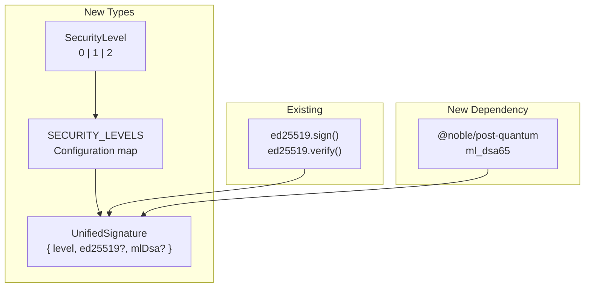

# 01: Core Crypto Types

> Security level definitions and unified signature types for multi-level cryptography.

**Duration:** 3 days
**Dependencies:** `@xnet/crypto` (existing)
**Package:** `packages/crypto/`

## Overview

This step establishes the foundational types for multi-level cryptography: `SecurityLevel`, `UnifiedSignature`, and the configuration constants. These types are the building blocks for all subsequent steps.

We also add the `@noble/post-quantum` dependency which provides ML-DSA (Dilithium) and ML-KEM (Kyber) implementations in pure TypeScript, matching the API style of the existing `@noble/curves` library.



## Implementation

### 1. Add @noble/post-quantum Dependency

```bash
# In packages/crypto
pnpm add @noble/post-quantum
```

```json
// packages/crypto/package.json
{
  "name": "@xnet/crypto",
  "version": "0.2.0",
  "dependencies": {
    "@noble/ciphers": "^2.1.1",
    "@noble/curves": "^2.0.1",
    "@noble/hashes": "^2.0.1",
    "@noble/post-quantum": "^0.2.0"
  }
}
```

### 2. Security Level Type

```typescript
// packages/crypto/src/types.ts

/**
 * Security levels for cryptographic operations.
 * - Level 0 (Fast): Ed25519 only - for high-frequency, low-value operations
 * - Level 1 (Hybrid): Ed25519 + ML-DSA - DEFAULT for most operations
 * - Level 2 (PQ-Only): ML-DSA only - maximum quantum security
 */
export type SecurityLevel = 0 | 1 | 2

/**
 * Configuration for each security level.
 */
export interface SecurityLevelConfig {
  /** Numeric level identifier */
  level: SecurityLevel

  /** Human-readable name */
  name: string

  /** Description of use case */
  description: string

  /** Algorithms used at this level */
  algorithms: {
    signing: readonly ('ed25519' | 'ml-dsa-65')[]
    keyExchange: readonly ('x25519' | 'ml-kem-768')[]
  }

  /** Approximate signature size in bytes */
  signatureSize: number

  /** Verification policy */
  verificationRequired: 'any' | 'all'
}

/**
 * Configuration map for all security levels.
 */
export const SECURITY_LEVELS: Readonly<Record<SecurityLevel, SecurityLevelConfig>> = {
  0: {
    level: 0,
    name: 'Fast',
    description: 'Ed25519 only - for high-frequency, low-value operations',
    algorithms: {
      signing: ['ed25519'] as const,
      keyExchange: ['x25519'] as const
    },
    signatureSize: 64,
    verificationRequired: 'all'
  },
  1: {
    level: 1,
    name: 'Hybrid',
    description: 'Ed25519 + ML-DSA - DEFAULT for most operations',
    algorithms: {
      signing: ['ed25519', 'ml-dsa-65'] as const,
      keyExchange: ['x25519', 'ml-kem-768'] as const
    },
    signatureSize: 64 + 3293, // ~3.4KB
    verificationRequired: 'all'
  },
  2: {
    level: 2,
    name: 'Post-Quantum',
    description: 'ML-DSA only - maximum quantum security, no classical fallback',
    algorithms: {
      signing: ['ml-dsa-65'] as const,
      keyExchange: ['ml-kem-768'] as const
    },
    signatureSize: 3293,
    verificationRequired: 'all'
  }
} as const

/**
 * Default security level for new operations.
 * Level 1 (Hybrid) provides both classical and quantum security.
 */
export const DEFAULT_SECURITY_LEVEL: SecurityLevel = 1
```

### 3. Unified Signature Type

```typescript
// packages/crypto/src/signature.ts

import type { SecurityLevel } from './types'

/**
 * A signature that can contain Ed25519 and/or ML-DSA signatures
 * depending on the security level used.
 */
export interface UnifiedSignature {
  /**
   * Security level this signature was created at.
   * - 0: Only ed25519 is present
   * - 1: Both ed25519 and mlDsa are present
   * - 2: Only mlDsa is present
   */
  level: SecurityLevel

  /**
   * Ed25519 signature (64 bytes).
   * Present at Level 0 and Level 1.
   */
  ed25519?: Uint8Array

  /**
   * ML-DSA-65 signature (~3,293 bytes).
   * Present at Level 1 and Level 2.
   */
  mlDsa?: Uint8Array
}

/**
 * Options for signing operations.
 */
export interface SignatureOptions {
  /**
   * Security level to sign at.
   * Defaults to the global security context level.
   */
  level?: SecurityLevel
}

/**
 * Result of a verification operation.
 */
export interface VerificationResult {
  /** Overall validity based on level and policy */
  valid: boolean

  /** Security level of the signature */
  level: SecurityLevel

  /** Detailed results for each algorithm */
  details: {
    ed25519?: {
      verified: boolean
      error?: string
    }
    mlDsa?: {
      verified: boolean
      error?: string
    }
  }
}

/**
 * Options for verification operations.
 */
export interface VerificationOptions {
  /**
   * Minimum acceptable security level.
   * Signatures below this level will fail verification.
   * Default: 0 (accept any level)
   */
  minLevel?: SecurityLevel

  /**
   * Verification policy.
   * - 'strict': All present signatures must verify (default)
   * - 'permissive': At least one signature must verify
   */
  policy?: 'strict' | 'permissive'
}

// ─── Signature Validation ────────────────────────────────────────

/**
 * Validate that a UnifiedSignature has the correct components for its level.
 */
export function validateSignature(signature: UnifiedSignature): {
  valid: boolean
  errors: string[]
} {
  const errors: string[] = []

  switch (signature.level) {
    case 0:
      if (!signature.ed25519) {
        errors.push('Level 0 signature must have ed25519 component')
      }
      if (signature.ed25519 && signature.ed25519.length !== 64) {
        errors.push(`Ed25519 signature must be 64 bytes, got ${signature.ed25519.length}`)
      }
      if (signature.mlDsa) {
        errors.push('Level 0 signature should not have mlDsa component')
      }
      break

    case 1:
      if (!signature.ed25519) {
        errors.push('Level 1 signature must have ed25519 component')
      }
      if (signature.ed25519 && signature.ed25519.length !== 64) {
        errors.push(`Ed25519 signature must be 64 bytes, got ${signature.ed25519.length}`)
      }
      if (!signature.mlDsa) {
        errors.push('Level 1 signature must have mlDsa component')
      }
      if (signature.mlDsa && (signature.mlDsa.length < 3200 || signature.mlDsa.length > 3400)) {
        errors.push(`ML-DSA signature should be ~3293 bytes, got ${signature.mlDsa.length}`)
      }
      break

    case 2:
      if (signature.ed25519) {
        errors.push('Level 2 signature should not have ed25519 component')
      }
      if (!signature.mlDsa) {
        errors.push('Level 2 signature must have mlDsa component')
      }
      if (signature.mlDsa && (signature.mlDsa.length < 3200 || signature.mlDsa.length > 3400)) {
        errors.push(`ML-DSA signature should be ~3293 bytes, got ${signature.mlDsa.length}`)
      }
      break

    default:
      errors.push(`Invalid security level: ${signature.level}`)
  }

  return { valid: errors.length === 0, errors }
}

/**
 * Calculate the byte size of a UnifiedSignature.
 */
export function signatureSize(signature: UnifiedSignature): number {
  let size = 1 // level byte
  if (signature.ed25519) size += signature.ed25519.length
  if (signature.mlDsa) size += signature.mlDsa.length
  return size
}
```

### 4. Signature Serialization

```typescript
// packages/crypto/src/signature-codec.ts

import type { UnifiedSignature, SecurityLevel } from './types'
import { encodeBase64, decodeBase64 } from './encoding'

/**
 * Wire format for UnifiedSignature.
 * Used in Change<T> and UCAN tokens.
 */
export interface SignatureWire {
  /** Security level */
  l: SecurityLevel
  /** Ed25519 signature (base64) */
  e?: string
  /** ML-DSA signature (base64) */
  p?: string
}

/**
 * Encode a UnifiedSignature to wire format.
 */
export function encodeSignature(signature: UnifiedSignature): SignatureWire {
  const wire: SignatureWire = { l: signature.level }

  if (signature.ed25519) {
    wire.e = encodeBase64(signature.ed25519)
  }
  if (signature.mlDsa) {
    wire.p = encodeBase64(signature.mlDsa)
  }

  return wire
}

/**
 * Decode a UnifiedSignature from wire format.
 */
export function decodeSignature(wire: SignatureWire): UnifiedSignature {
  const signature: UnifiedSignature = { level: wire.l }

  if (wire.e) {
    signature.ed25519 = decodeBase64(wire.e)
  }
  if (wire.p) {
    signature.mlDsa = decodeBase64(wire.p)
  }

  return signature
}

/**
 * Encode a UnifiedSignature to compact binary format.
 * Format: [level:1][ed25519:64?][mlDsa:~3293?]
 */
export function encodeSignatureBinary(signature: UnifiedSignature): Uint8Array {
  const parts: Uint8Array[] = [new Uint8Array([signature.level])]

  if (signature.ed25519) {
    parts.push(signature.ed25519)
  }
  if (signature.mlDsa) {
    parts.push(signature.mlDsa)
  }

  const totalLength = parts.reduce((sum, p) => sum + p.length, 0)
  const result = new Uint8Array(totalLength)

  let offset = 0
  for (const part of parts) {
    result.set(part, offset)
    offset += part.length
  }

  return result
}

/**
 * Decode a UnifiedSignature from compact binary format.
 */
export function decodeSignatureBinary(data: Uint8Array): UnifiedSignature {
  if (data.length < 1) {
    throw new Error('Signature data too short')
  }

  const level = data[0] as SecurityLevel
  const signature: UnifiedSignature = { level }

  let offset = 1

  switch (level) {
    case 0:
      if (data.length < 65) throw new Error('Level 0 signature too short')
      signature.ed25519 = data.slice(offset, offset + 64)
      break

    case 1:
      if (data.length < 65) throw new Error('Level 1 signature too short')
      signature.ed25519 = data.slice(offset, offset + 64)
      offset += 64
      signature.mlDsa = data.slice(offset)
      break

    case 2:
      signature.mlDsa = data.slice(offset)
      break

    default:
      throw new Error(`Invalid security level: ${level}`)
  }

  return signature
}
```

### 5. Algorithm Size Constants

```typescript
// packages/crypto/src/constants.ts

// ─── Ed25519 Sizes ───────────────────────────────────────────────

export const ED25519_PUBLIC_KEY_SIZE = 32
export const ED25519_PRIVATE_KEY_SIZE = 32
export const ED25519_SIGNATURE_SIZE = 64

// ─── ML-DSA-65 (Dilithium3) Sizes ────────────────────────────────

export const ML_DSA_65_PUBLIC_KEY_SIZE = 1952
export const ML_DSA_65_PRIVATE_KEY_SIZE = 4032
export const ML_DSA_65_SIGNATURE_SIZE = 3293

// ─── ML-KEM-768 (Kyber768) Sizes ─────────────────────────────────

export const ML_KEM_768_PUBLIC_KEY_SIZE = 1184
export const ML_KEM_768_PRIVATE_KEY_SIZE = 2400
export const ML_KEM_768_CIPHERTEXT_SIZE = 1088
export const ML_KEM_768_SHARED_SECRET_SIZE = 32

// ─── X25519 Sizes ────────────────────────────────────────────────

export const X25519_PUBLIC_KEY_SIZE = 32
export const X25519_PRIVATE_KEY_SIZE = 32
export const X25519_SHARED_SECRET_SIZE = 32

// ─── Hybrid Sizes ────────────────────────────────────────────────

export const HYBRID_SIGNATURE_SIZE_LEVEL_0 = ED25519_SIGNATURE_SIZE // 64
export const HYBRID_SIGNATURE_SIZE_LEVEL_1 = ED25519_SIGNATURE_SIZE + ML_DSA_65_SIGNATURE_SIZE // 3357
export const HYBRID_SIGNATURE_SIZE_LEVEL_2 = ML_DSA_65_SIGNATURE_SIZE // 3293
```

### 6. Type Guards

```typescript
// packages/crypto/src/guards.ts

import type { SecurityLevel, UnifiedSignature } from './types'

/**
 * Type guard for SecurityLevel.
 */
export function isSecurityLevel(value: unknown): value is SecurityLevel {
  return value === 0 || value === 1 || value === 2
}

/**
 * Type guard for UnifiedSignature.
 */
export function isUnifiedSignature(value: unknown): value is UnifiedSignature {
  if (typeof value !== 'object' || value === null) return false

  const obj = value as Record<string, unknown>

  if (!isSecurityLevel(obj.level)) return false

  // Check ed25519 if present
  if (obj.ed25519 !== undefined) {
    if (!(obj.ed25519 instanceof Uint8Array)) return false
    if (obj.ed25519.length !== 64) return false
  }

  // Check mlDsa if present
  if (obj.mlDsa !== undefined) {
    if (!(obj.mlDsa instanceof Uint8Array)) return false
    // ML-DSA-65 signatures are ~3293 bytes
    if (obj.mlDsa.length < 3200 || obj.mlDsa.length > 3400) return false
  }

  // Validate presence based on level
  switch (obj.level) {
    case 0:
      return obj.ed25519 !== undefined && obj.mlDsa === undefined
    case 1:
      return obj.ed25519 !== undefined && obj.mlDsa !== undefined
    case 2:
      return obj.ed25519 === undefined && obj.mlDsa !== undefined
    default:
      return false
  }
}
```

### 7. Update Package Exports

```typescript
// packages/crypto/src/index.ts

// Existing exports
export { sign, verify, generateSigningKeyPair } from './signing'
export { encrypt, decrypt, generateEncryptionKeyPair } from './encryption'
export { hash, hkdf } from './hashing'
export { randomBytes } from './random'
export { encodeBase64, decodeBase64 } from './encoding'

// New exports for multi-level crypto
export type {
  SecurityLevel,
  SecurityLevelConfig,
  UnifiedSignature,
  SignatureOptions,
  VerificationResult,
  VerificationOptions
} from './types'

export { SECURITY_LEVELS, DEFAULT_SECURITY_LEVEL } from './types'

export { validateSignature, signatureSize } from './signature'

export type { SignatureWire } from './signature-codec'
export {
  encodeSignature,
  decodeSignature,
  encodeSignatureBinary,
  decodeSignatureBinary
} from './signature-codec'

export {
  ED25519_PUBLIC_KEY_SIZE,
  ED25519_PRIVATE_KEY_SIZE,
  ED25519_SIGNATURE_SIZE,
  ML_DSA_65_PUBLIC_KEY_SIZE,
  ML_DSA_65_PRIVATE_KEY_SIZE,
  ML_DSA_65_SIGNATURE_SIZE,
  ML_KEM_768_PUBLIC_KEY_SIZE,
  ML_KEM_768_PRIVATE_KEY_SIZE,
  HYBRID_SIGNATURE_SIZE_LEVEL_0,
  HYBRID_SIGNATURE_SIZE_LEVEL_1,
  HYBRID_SIGNATURE_SIZE_LEVEL_2
} from './constants'

export { isSecurityLevel, isUnifiedSignature } from './guards'
```

## Tests

```typescript
// packages/crypto/src/types.test.ts

import { describe, it, expect } from 'vitest'
import {
  SECURITY_LEVELS,
  DEFAULT_SECURITY_LEVEL,
  validateSignature,
  signatureSize,
  encodeSignature,
  decodeSignature,
  encodeSignatureBinary,
  decodeSignatureBinary,
  isSecurityLevel,
  isUnifiedSignature
} from './index'

describe('SecurityLevel', () => {
  it('has three levels defined', () => {
    expect(Object.keys(SECURITY_LEVELS)).toHaveLength(3)
    expect(SECURITY_LEVELS[0]).toBeDefined()
    expect(SECURITY_LEVELS[1]).toBeDefined()
    expect(SECURITY_LEVELS[2]).toBeDefined()
  })

  it('defaults to Level 1 (Hybrid)', () => {
    expect(DEFAULT_SECURITY_LEVEL).toBe(1)
  })

  it('Level 0 uses Ed25519 only', () => {
    const config = SECURITY_LEVELS[0]
    expect(config.algorithms.signing).toEqual(['ed25519'])
    expect(config.signatureSize).toBe(64)
  })

  it('Level 1 uses both Ed25519 and ML-DSA', () => {
    const config = SECURITY_LEVELS[1]
    expect(config.algorithms.signing).toEqual(['ed25519', 'ml-dsa-65'])
    expect(config.signatureSize).toBe(64 + 3293)
  })

  it('Level 2 uses ML-DSA only', () => {
    const config = SECURITY_LEVELS[2]
    expect(config.algorithms.signing).toEqual(['ml-dsa-65'])
    expect(config.signatureSize).toBe(3293)
  })
})

describe('isSecurityLevel', () => {
  it('returns true for valid levels', () => {
    expect(isSecurityLevel(0)).toBe(true)
    expect(isSecurityLevel(1)).toBe(true)
    expect(isSecurityLevel(2)).toBe(true)
  })

  it('returns false for invalid values', () => {
    expect(isSecurityLevel(-1)).toBe(false)
    expect(isSecurityLevel(3)).toBe(false)
    expect(isSecurityLevel('1')).toBe(false)
    expect(isSecurityLevel(null)).toBe(false)
  })
})

describe('validateSignature', () => {
  it('validates Level 0 signature', () => {
    const sig = {
      level: 0 as const,
      ed25519: new Uint8Array(64)
    }
    const result = validateSignature(sig)
    expect(result.valid).toBe(true)
    expect(result.errors).toHaveLength(0)
  })

  it('rejects Level 0 without ed25519', () => {
    const sig = { level: 0 as const }
    const result = validateSignature(sig)
    expect(result.valid).toBe(false)
    expect(result.errors).toContain('Level 0 signature must have ed25519 component')
  })

  it('validates Level 1 signature', () => {
    const sig = {
      level: 1 as const,
      ed25519: new Uint8Array(64),
      mlDsa: new Uint8Array(3293)
    }
    const result = validateSignature(sig)
    expect(result.valid).toBe(true)
  })

  it('rejects Level 1 without both components', () => {
    const sig = {
      level: 1 as const,
      ed25519: new Uint8Array(64)
    }
    const result = validateSignature(sig)
    expect(result.valid).toBe(false)
    expect(result.errors).toContain('Level 1 signature must have mlDsa component')
  })

  it('validates Level 2 signature', () => {
    const sig = {
      level: 2 as const,
      mlDsa: new Uint8Array(3293)
    }
    const result = validateSignature(sig)
    expect(result.valid).toBe(true)
  })

  it('rejects wrong ed25519 size', () => {
    const sig = {
      level: 0 as const,
      ed25519: new Uint8Array(32) // wrong size
    }
    const result = validateSignature(sig)
    expect(result.valid).toBe(false)
    expect(result.errors[0]).toContain('must be 64 bytes')
  })
})

describe('signatureSize', () => {
  it('calculates Level 0 size', () => {
    const sig = { level: 0 as const, ed25519: new Uint8Array(64) }
    expect(signatureSize(sig)).toBe(65) // 1 + 64
  })

  it('calculates Level 1 size', () => {
    const sig = {
      level: 1 as const,
      ed25519: new Uint8Array(64),
      mlDsa: new Uint8Array(3293)
    }
    expect(signatureSize(sig)).toBe(3358) // 1 + 64 + 3293
  })

  it('calculates Level 2 size', () => {
    const sig = { level: 2 as const, mlDsa: new Uint8Array(3293) }
    expect(signatureSize(sig)).toBe(3294) // 1 + 3293
  })
})

describe('Signature encoding', () => {
  describe('JSON wire format', () => {
    it('round-trips Level 0 signature', () => {
      const original = {
        level: 0 as const,
        ed25519: new Uint8Array([1, 2, 3, ...Array(61).fill(0)])
      }
      const wire = encodeSignature(original)
      const decoded = decodeSignature(wire)

      expect(decoded.level).toBe(0)
      expect(decoded.ed25519).toEqual(original.ed25519)
      expect(decoded.mlDsa).toBeUndefined()
    })

    it('round-trips Level 1 signature', () => {
      const original = {
        level: 1 as const,
        ed25519: new Uint8Array(64).fill(1),
        mlDsa: new Uint8Array(3293).fill(2)
      }
      const wire = encodeSignature(original)
      const decoded = decodeSignature(wire)

      expect(decoded.level).toBe(1)
      expect(decoded.ed25519).toEqual(original.ed25519)
      expect(decoded.mlDsa).toEqual(original.mlDsa)
    })

    it('round-trips Level 2 signature', () => {
      const original = {
        level: 2 as const,
        mlDsa: new Uint8Array(3293).fill(3)
      }
      const wire = encodeSignature(original)
      const decoded = decodeSignature(wire)

      expect(decoded.level).toBe(2)
      expect(decoded.ed25519).toBeUndefined()
      expect(decoded.mlDsa).toEqual(original.mlDsa)
    })
  })

  describe('Binary format', () => {
    it('round-trips Level 0 signature', () => {
      const original = {
        level: 0 as const,
        ed25519: new Uint8Array(64).fill(42)
      }
      const binary = encodeSignatureBinary(original)
      const decoded = decodeSignatureBinary(binary)

      expect(binary.length).toBe(65)
      expect(decoded.level).toBe(0)
      expect(decoded.ed25519).toEqual(original.ed25519)
    })

    it('round-trips Level 1 signature', () => {
      const original = {
        level: 1 as const,
        ed25519: new Uint8Array(64).fill(1),
        mlDsa: new Uint8Array(3293).fill(2)
      }
      const binary = encodeSignatureBinary(original)
      const decoded = decodeSignatureBinary(binary)

      expect(binary.length).toBe(3358)
      expect(decoded.level).toBe(1)
      expect(decoded.ed25519).toEqual(original.ed25519)
      expect(decoded.mlDsa).toEqual(original.mlDsa)
    })

    it('round-trips Level 2 signature', () => {
      const original = {
        level: 2 as const,
        mlDsa: new Uint8Array(3293).fill(3)
      }
      const binary = encodeSignatureBinary(original)
      const decoded = decodeSignatureBinary(binary)

      expect(binary.length).toBe(3294)
      expect(decoded.level).toBe(2)
      expect(decoded.mlDsa).toEqual(original.mlDsa)
    })
  })
})

describe('isUnifiedSignature', () => {
  it('accepts valid Level 0 signature', () => {
    const sig = { level: 0, ed25519: new Uint8Array(64) }
    expect(isUnifiedSignature(sig)).toBe(true)
  })

  it('accepts valid Level 1 signature', () => {
    const sig = {
      level: 1,
      ed25519: new Uint8Array(64),
      mlDsa: new Uint8Array(3293)
    }
    expect(isUnifiedSignature(sig)).toBe(true)
  })

  it('accepts valid Level 2 signature', () => {
    const sig = { level: 2, mlDsa: new Uint8Array(3293) }
    expect(isUnifiedSignature(sig)).toBe(true)
  })

  it('rejects non-objects', () => {
    expect(isUnifiedSignature(null)).toBe(false)
    expect(isUnifiedSignature('string')).toBe(false)
    expect(isUnifiedSignature(123)).toBe(false)
  })

  it('rejects invalid level', () => {
    expect(isUnifiedSignature({ level: 5 })).toBe(false)
  })

  it('rejects wrong component presence for Level 0', () => {
    expect(isUnifiedSignature({ level: 0 })).toBe(false)
    expect(isUnifiedSignature({ level: 0, mlDsa: new Uint8Array(3293) })).toBe(false)
  })

  it('rejects wrong ed25519 size', () => {
    expect(isUnifiedSignature({ level: 0, ed25519: new Uint8Array(32) })).toBe(false)
  })
})
```

## Environment Verification

```typescript
// packages/crypto/src/pq-support.test.ts

import { describe, it, expect } from 'vitest'
import { ml_dsa65 } from '@noble/post-quantum/ml-dsa'

describe('@noble/post-quantum', () => {
  it('can import ML-DSA-65', () => {
    expect(ml_dsa65).toBeDefined()
    expect(ml_dsa65.keygen).toBeDefined()
    expect(ml_dsa65.sign).toBeDefined()
    expect(ml_dsa65.verify).toBeDefined()
  })

  it('generates valid keypair', () => {
    const keys = ml_dsa65.keygen()

    expect(keys.publicKey).toBeInstanceOf(Uint8Array)
    expect(keys.secretKey).toBeInstanceOf(Uint8Array)
    expect(keys.publicKey.length).toBe(1952) // ML-DSA-65 public key size
    expect(keys.secretKey.length).toBe(4032) // ML-DSA-65 secret key size
  })

  it('signs and verifies message', () => {
    const keys = ml_dsa65.keygen()
    const message = new TextEncoder().encode('test message')

    const signature = ml_dsa65.sign(keys.secretKey, message)
    expect(signature.length).toBe(3293)

    const valid = ml_dsa65.verify(keys.publicKey, message, signature)
    expect(valid).toBe(true)
  })

  it('rejects tampered signature', () => {
    const keys = ml_dsa65.keygen()
    const message = new TextEncoder().encode('test message')

    const signature = ml_dsa65.sign(keys.secretKey, message)
    signature[0] ^= 0xff // tamper

    const valid = ml_dsa65.verify(keys.publicKey, message, signature)
    expect(valid).toBe(false)
  })

  it('rejects wrong public key', () => {
    const keys1 = ml_dsa65.keygen()
    const keys2 = ml_dsa65.keygen()
    const message = new TextEncoder().encode('test message')

    const signature = ml_dsa65.sign(keys1.secretKey, message)
    const valid = ml_dsa65.verify(keys2.publicKey, message, signature)
    expect(valid).toBe(false)
  })
})
```

## Checklist

- [x] Add `@noble/post-quantum` to packages/crypto/package.json
- [ ] Verify @noble/post-quantum works in Web (Chrome, Safari, Firefox)
- [ ] Verify @noble/post-quantum works in Electron (main + renderer)
- [ ] Verify @noble/post-quantum works in Expo (iOS + Android)
- [x] Implement `SecurityLevel` type and `SECURITY_LEVELS` config
- [x] Implement `UnifiedSignature` type
- [x] Implement `validateSignature()` function
- [x] Implement `signatureSize()` function
- [x] Implement JSON wire format encoding/decoding
- [x] Implement binary format encoding/decoding
- [x] Implement type guards (`isSecurityLevel`, `isUnifiedSignature`)
- [x] Add size constants for all algorithms
- [x] Update package exports in index.ts
- [x] Write unit tests (target: 30+ tests) - 66 tests written
- [ ] Verify bundle size impact (< 200KB gzipped)

---

[Back to README](./README.md) | [Next: Hybrid Signing ->](./02-hybrid-signing.md)
