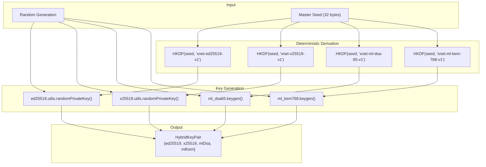
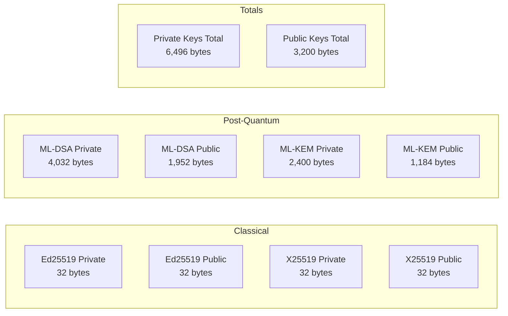

# 03: Hybrid Key Generation

> Generate and derive hybrid keypairs containing both Ed25519 and ML-DSA keys.

**Duration:** 3 days
**Dependencies:** [01-core-crypto-types.md](./01-core-crypto-types.md), [02-hybrid-signing.md](./02-hybrid-signing.md)
**Package:** `packages/crypto/`

## Overview

This step implements hybrid key generation, producing keypairs that contain both classical (Ed25519/X25519) and post-quantum (ML-DSA/ML-KEM) keys. Keys can be generated randomly or derived deterministically from a master seed.



## Implementation

### 1. Hybrid Key Pair Types

```typescript
// packages/crypto/src/hybrid-keygen.ts

import { ed25519 } from '@noble/curves/ed25519'
import { x25519 } from '@noble/curves/ed25519'
import { ml_dsa65 } from '@noble/post-quantum/ml-dsa'
import { ml_kem768 } from '@noble/post-quantum/ml-kem'
import { hkdf } from '@noble/hashes/hkdf'
import { sha256 } from '@noble/hashes/sha256'
import { randomBytes } from './random'
import type { SecurityLevel } from './types'

/**
 * Complete hybrid key pair containing classical and post-quantum keys.
 */
export interface HybridKeyPair {
  /** Ed25519 signing keys */
  ed25519: {
    publicKey: Uint8Array // 32 bytes
    privateKey: Uint8Array // 32 bytes
  }

  /** X25519 key exchange keys */
  x25519: {
    publicKey: Uint8Array // 32 bytes
    privateKey: Uint8Array // 32 bytes
  }

  /** ML-DSA-65 signing keys (optional, for PQ support) */
  mlDsa?: {
    publicKey: Uint8Array // 1,952 bytes
    privateKey: Uint8Array // 4,032 bytes
  }

  /** ML-KEM-768 key encapsulation keys (optional, for PQ support) */
  mlKem?: {
    publicKey: Uint8Array // 1,184 bytes
    privateKey: Uint8Array // 2,400 bytes
  }
}

/**
 * Options for key generation.
 */
export interface KeyGenOptions {
  /**
   * Whether to include post-quantum keys.
   * Default: true (always generate PQ keys since we're prerelease)
   */
  includePQ?: boolean

  /**
   * Whether to include key exchange keys (X25519/ML-KEM).
   * Default: true
   */
  includeKeyExchange?: boolean
}

/**
 * Options for deterministic key derivation.
 */
export interface KeyDerivationOptions extends KeyGenOptions {
  /**
   * Version string for key derivation.
   * Changing this will produce different keys from the same seed.
   * Default: 'v1'
   */
  version?: string
}
```

### 2. Random Key Generation

````typescript
// packages/crypto/src/hybrid-keygen.ts (continued)

/**
 * Generate a random hybrid key pair.
 *
 * By default, includes post-quantum keys (ML-DSA and ML-KEM).
 * This is the preferred method for xNet since we're prerelease
 * and want quantum security by default.
 *
 * @example
 * ```typescript
 * // Full hybrid keys (default)
 * const keys = generateHybridKeyPair()
 *
 * // Ed25519/X25519 only (opt-out of PQ)
 * const classicalKeys = generateHybridKeyPair({ includePQ: false })
 *
 * // Signing keys only (no key exchange)
 * const signingKeys = generateHybridKeyPair({ includeKeyExchange: false })
 * ```
 */
export function generateHybridKeyPair(options: KeyGenOptions = {}): HybridKeyPair {
  const { includePQ = true, includeKeyExchange = true } = options

  // Ed25519 - always generated
  const ed25519PrivateKey = ed25519.utils.randomPrivateKey()
  const ed25519PublicKey = ed25519.getPublicKey(ed25519PrivateKey)

  const keyPair: HybridKeyPair = {
    ed25519: {
      privateKey: ed25519PrivateKey,
      publicKey: ed25519PublicKey
    },
    x25519: { privateKey: new Uint8Array(32), publicKey: new Uint8Array(32) }
  }

  // X25519 - for key exchange
  if (includeKeyExchange) {
    const x25519PrivateKey = x25519.utils.randomPrivateKey()
    const x25519PublicKey = x25519.getPublicKey(x25519PrivateKey)
    keyPair.x25519 = {
      privateKey: x25519PrivateKey,
      publicKey: x25519PublicKey
    }
  }

  // Post-quantum keys
  if (includePQ) {
    // ML-DSA-65 for signing
    const mlDsaKeys = ml_dsa65.keygen()
    keyPair.mlDsa = {
      publicKey: mlDsaKeys.publicKey,
      privateKey: mlDsaKeys.secretKey
    }

    // ML-KEM-768 for key exchange
    if (includeKeyExchange) {
      const mlKemKeys = ml_kem768.keygen()
      keyPair.mlKem = {
        publicKey: mlKemKeys.publicKey,
        privateKey: mlKemKeys.secretKey
      }
    }
  }

  return keyPair
}
````

### 3. Deterministic Key Derivation

````typescript
// packages/crypto/src/hybrid-keygen.ts (continued)

// Domain separation strings for HKDF
const DOMAIN_ED25519 = 'xnet-ed25519'
const DOMAIN_X25519 = 'xnet-x25519'
const DOMAIN_ML_DSA = 'xnet-ml-dsa-65'
const DOMAIN_ML_KEM = 'xnet-ml-kem-768'

/**
 * Derive a hybrid key pair deterministically from a master seed.
 *
 * This produces the same keys given the same seed, which is essential
 * for passkey-based key derivation where we need to recreate keys
 * from a PRF output.
 *
 * @param seed - 32-byte master seed (e.g., from passkey PRF)
 * @param options - Derivation options
 * @returns Deterministic HybridKeyPair
 *
 * @example
 * ```typescript
 * const seed = crypto.getRandomValues(new Uint8Array(32))
 *
 * // Full derivation (default)
 * const keys1 = deriveHybridKeyPair(seed)
 * const keys2 = deriveHybridKeyPair(seed)
 * // keys1 and keys2 are identical
 *
 * // Version change produces different keys
 * const keys3 = deriveHybridKeyPair(seed, { version: 'v2' })
 * // keys3 is different from keys1/keys2
 * ```
 */
export function deriveHybridKeyPair(
  seed: Uint8Array,
  options: KeyDerivationOptions = {}
): HybridKeyPair {
  const { includePQ = true, includeKeyExchange = true, version = 'v1' } = options

  if (seed.length !== 32) {
    throw new Error(`Seed must be 32 bytes, got ${seed.length}`)
  }

  // Derive Ed25519 key
  const ed25519Seed = deriveKeySeed(seed, `${DOMAIN_ED25519}-${version}`, 32)
  const ed25519PublicKey = ed25519.getPublicKey(ed25519Seed)

  const keyPair: HybridKeyPair = {
    ed25519: {
      privateKey: ed25519Seed,
      publicKey: ed25519PublicKey
    },
    x25519: { privateKey: new Uint8Array(32), publicKey: new Uint8Array(32) }
  }

  // Derive X25519 key
  if (includeKeyExchange) {
    const x25519Seed = deriveKeySeed(seed, `${DOMAIN_X25519}-${version}`, 32)
    const x25519PublicKey = x25519.getPublicKey(x25519Seed)
    keyPair.x25519 = {
      privateKey: x25519Seed,
      publicKey: x25519PublicKey
    }
  }

  // Derive post-quantum keys
  if (includePQ) {
    // ML-DSA uses a 32-byte seed for deterministic key generation
    const mlDsaSeed = deriveKeySeed(seed, `${DOMAIN_ML_DSA}-${version}`, 32)
    const mlDsaKeys = ml_dsa65.keygen(mlDsaSeed)
    keyPair.mlDsa = {
      publicKey: mlDsaKeys.publicKey,
      privateKey: mlDsaKeys.secretKey
    }

    // ML-KEM uses a 64-byte seed for deterministic key generation
    if (includeKeyExchange) {
      const mlKemSeed = deriveKeySeed(seed, `${DOMAIN_ML_KEM}-${version}`, 64)
      const mlKemKeys = ml_kem768.keygen(mlKemSeed)
      keyPair.mlKem = {
        publicKey: mlKemKeys.publicKey,
        privateKey: mlKemKeys.secretKey
      }
    }
  }

  return keyPair
}

/**
 * Derive a key seed using HKDF.
 */
function deriveKeySeed(masterSeed: Uint8Array, info: string, length: number): Uint8Array {
  return hkdf(sha256, masterSeed, undefined, info, length)
}
````

### 4. Key Pair Utilities

```typescript
// packages/crypto/src/hybrid-keygen.ts (continued)

/**
 * Extract signing keys from a HybridKeyPair for use with hybridSign().
 */
export function extractSigningKeys(
  keyPair: HybridKeyPair
): import('./hybrid-signing').HybridSigningKey {
  return {
    ed25519: keyPair.ed25519.privateKey,
    mlDsa: keyPair.mlDsa?.privateKey
  }
}

/**
 * Extract public keys from a HybridKeyPair for use with hybridVerify().
 */
export function extractPublicKeys(
  keyPair: HybridKeyPair
): import('./hybrid-signing').HybridPublicKey {
  return {
    ed25519: keyPair.ed25519.publicKey,
    mlDsa: keyPair.mlDsa?.publicKey
  }
}

/**
 * Get the maximum security level this key pair supports.
 */
export function keyPairSecurityLevel(keyPair: HybridKeyPair): SecurityLevel {
  if (keyPair.mlDsa) return 2
  return 0
}

/**
 * Check if a key pair can sign at a given security level.
 */
export function keyPairCanSignAt(keyPair: HybridKeyPair, level: SecurityLevel): boolean {
  switch (level) {
    case 0:
      return true // Always have Ed25519
    case 1:
    case 2:
      return keyPair.mlDsa !== undefined
    default:
      return false
  }
}

/**
 * Calculate the total size of a key pair in bytes.
 */
export function keyPairSize(keyPair: HybridKeyPair): {
  privateKeys: number
  publicKeys: number
  total: number
} {
  let privateKeys = 32 // Ed25519
  let publicKeys = 32 // Ed25519

  if (keyPair.x25519.privateKey.length > 0) {
    privateKeys += 32 // X25519
    publicKeys += 32 // X25519
  }

  if (keyPair.mlDsa) {
    privateKeys += 4032 // ML-DSA-65
    publicKeys += 1952 // ML-DSA-65
  }

  if (keyPair.mlKem) {
    privateKeys += 2400 // ML-KEM-768
    publicKeys += 1184 // ML-KEM-768
  }

  return {
    privateKeys,
    publicKeys,
    total: privateKeys + publicKeys
  }
}

/**
 * Serialize public keys for storage or transmission.
 */
export interface SerializedPublicKeys {
  ed25519: string // base64
  x25519?: string // base64
  mlDsa?: string // base64
  mlKem?: string // base64
}

export function serializePublicKeys(keyPair: HybridKeyPair): SerializedPublicKeys {
  const result: SerializedPublicKeys = {
    ed25519: encodeBase64(keyPair.ed25519.publicKey)
  }

  if (keyPair.x25519.publicKey.length > 0) {
    result.x25519 = encodeBase64(keyPair.x25519.publicKey)
  }

  if (keyPair.mlDsa) {
    result.mlDsa = encodeBase64(keyPair.mlDsa.publicKey)
  }

  if (keyPair.mlKem) {
    result.mlKem = encodeBase64(keyPair.mlKem.publicKey)
  }

  return result
}

// Import encoding utilities
import { encodeBase64, decodeBase64 } from './encoding'

export function deserializePublicKeys(serialized: SerializedPublicKeys): {
  ed25519: Uint8Array
  x25519?: Uint8Array
  mlDsa?: Uint8Array
  mlKem?: Uint8Array
} {
  return {
    ed25519: decodeBase64(serialized.ed25519),
    x25519: serialized.x25519 ? decodeBase64(serialized.x25519) : undefined,
    mlDsa: serialized.mlDsa ? decodeBase64(serialized.mlDsa) : undefined,
    mlKem: serialized.mlKem ? decodeBase64(serialized.mlKem) : undefined
  }
}
```

### 5. Secure Key Comparison

```typescript
// packages/crypto/src/hybrid-keygen.ts (continued)

/**
 * Compare two public keys for equality (constant-time for Ed25519).
 */
export function publicKeysEqual(a: HybridKeyPair, b: HybridKeyPair): boolean {
  // Ed25519 comparison
  if (!constantTimeEqual(a.ed25519.publicKey, b.ed25519.publicKey)) {
    return false
  }

  // ML-DSA comparison (if both have it)
  if (a.mlDsa && b.mlDsa) {
    if (!constantTimeEqual(a.mlDsa.publicKey, b.mlDsa.publicKey)) {
      return false
    }
  } else if (a.mlDsa || b.mlDsa) {
    return false // One has PQ, other doesn't
  }

  return true
}

/**
 * Constant-time comparison of byte arrays.
 */
function constantTimeEqual(a: Uint8Array, b: Uint8Array): boolean {
  if (a.length !== b.length) return false

  let diff = 0
  for (let i = 0; i < a.length; i++) {
    diff |= a[i] ^ b[i]
  }

  return diff === 0
}
```

### 6. Update Package Exports

```typescript
// packages/crypto/src/index.ts (add to exports)

export type {
  HybridKeyPair,
  KeyGenOptions,
  KeyDerivationOptions,
  SerializedPublicKeys
} from './hybrid-keygen'

export {
  generateHybridKeyPair,
  deriveHybridKeyPair,
  extractSigningKeys,
  extractPublicKeys,
  keyPairSecurityLevel,
  keyPairCanSignAt,
  keyPairSize,
  serializePublicKeys,
  deserializePublicKeys,
  publicKeysEqual
} from './hybrid-keygen'
```

## Key Size Summary



## Tests

```typescript
// packages/crypto/src/hybrid-keygen.test.ts

import { describe, it, expect } from 'vitest'
import {
  generateHybridKeyPair,
  deriveHybridKeyPair,
  extractSigningKeys,
  extractPublicKeys,
  keyPairSecurityLevel,
  keyPairCanSignAt,
  keyPairSize,
  serializePublicKeys,
  deserializePublicKeys,
  publicKeysEqual
} from './hybrid-keygen'
import { hybridSign, hybridVerify } from './hybrid-signing'

describe('generateHybridKeyPair', () => {
  it('generates full hybrid keys by default', () => {
    const keys = generateHybridKeyPair()

    // Ed25519
    expect(keys.ed25519.privateKey).toBeInstanceOf(Uint8Array)
    expect(keys.ed25519.privateKey.length).toBe(32)
    expect(keys.ed25519.publicKey.length).toBe(32)

    // X25519
    expect(keys.x25519.privateKey.length).toBe(32)
    expect(keys.x25519.publicKey.length).toBe(32)

    // ML-DSA
    expect(keys.mlDsa).toBeDefined()
    expect(keys.mlDsa!.privateKey.length).toBe(4032)
    expect(keys.mlDsa!.publicKey.length).toBe(1952)

    // ML-KEM
    expect(keys.mlKem).toBeDefined()
    expect(keys.mlKem!.privateKey.length).toBe(2400)
    expect(keys.mlKem!.publicKey.length).toBe(1184)
  })

  it('generates classical-only keys when includePQ is false', () => {
    const keys = generateHybridKeyPair({ includePQ: false })

    expect(keys.ed25519.privateKey.length).toBe(32)
    expect(keys.x25519.privateKey.length).toBe(32)
    expect(keys.mlDsa).toBeUndefined()
    expect(keys.mlKem).toBeUndefined()
  })

  it('generates signing-only keys when includeKeyExchange is false', () => {
    const keys = generateHybridKeyPair({ includeKeyExchange: false })

    expect(keys.ed25519.privateKey.length).toBe(32)
    expect(keys.x25519.privateKey.length).toBe(0)
    expect(keys.mlDsa).toBeDefined()
    expect(keys.mlKem).toBeUndefined()
  })

  it('generates different keys each time', () => {
    const keys1 = generateHybridKeyPair()
    const keys2 = generateHybridKeyPair()

    expect(keys1.ed25519.privateKey).not.toEqual(keys2.ed25519.privateKey)
    expect(keys1.mlDsa!.privateKey).not.toEqual(keys2.mlDsa!.privateKey)
  })
})

describe('deriveHybridKeyPair', () => {
  const seed = new Uint8Array(32).fill(42)

  it('derives deterministic keys from seed', () => {
    const keys1 = deriveHybridKeyPair(seed)
    const keys2 = deriveHybridKeyPair(seed)

    expect(keys1.ed25519.privateKey).toEqual(keys2.ed25519.privateKey)
    expect(keys1.ed25519.publicKey).toEqual(keys2.ed25519.publicKey)
    expect(keys1.mlDsa!.privateKey).toEqual(keys2.mlDsa!.privateKey)
    expect(keys1.mlDsa!.publicKey).toEqual(keys2.mlDsa!.publicKey)
  })

  it('derives different keys from different seeds', () => {
    const seed1 = new Uint8Array(32).fill(1)
    const seed2 = new Uint8Array(32).fill(2)

    const keys1 = deriveHybridKeyPair(seed1)
    const keys2 = deriveHybridKeyPair(seed2)

    expect(keys1.ed25519.privateKey).not.toEqual(keys2.ed25519.privateKey)
  })

  it('derives different keys with different versions', () => {
    const keys1 = deriveHybridKeyPair(seed, { version: 'v1' })
    const keys2 = deriveHybridKeyPair(seed, { version: 'v2' })

    expect(keys1.ed25519.privateKey).not.toEqual(keys2.ed25519.privateKey)
  })

  it('throws for wrong seed length', () => {
    const shortSeed = new Uint8Array(16)
    expect(() => deriveHybridKeyPair(shortSeed)).toThrow('Seed must be 32 bytes')
  })

  it('derived keys work for signing', () => {
    const keys = deriveHybridKeyPair(seed)
    const message = new TextEncoder().encode('test message')

    const sig = hybridSign(message, extractSigningKeys(keys), 1)
    const result = hybridVerify(message, sig, extractPublicKeys(keys))

    expect(result.valid).toBe(true)
  })
})

describe('extractSigningKeys', () => {
  it('extracts Ed25519 key', () => {
    const keyPair = generateHybridKeyPair({ includePQ: false })
    const signingKeys = extractSigningKeys(keyPair)

    expect(signingKeys.ed25519).toBe(keyPair.ed25519.privateKey)
    expect(signingKeys.mlDsa).toBeUndefined()
  })

  it('extracts both keys when available', () => {
    const keyPair = generateHybridKeyPair()
    const signingKeys = extractSigningKeys(keyPair)

    expect(signingKeys.ed25519).toBe(keyPair.ed25519.privateKey)
    expect(signingKeys.mlDsa).toBe(keyPair.mlDsa!.privateKey)
  })
})

describe('extractPublicKeys', () => {
  it('extracts public keys', () => {
    const keyPair = generateHybridKeyPair()
    const publicKeys = extractPublicKeys(keyPair)

    expect(publicKeys.ed25519).toBe(keyPair.ed25519.publicKey)
    expect(publicKeys.mlDsa).toBe(keyPair.mlDsa!.publicKey)
  })
})

describe('keyPairSecurityLevel', () => {
  it('returns 0 for classical-only keys', () => {
    const keys = generateHybridKeyPair({ includePQ: false })
    expect(keyPairSecurityLevel(keys)).toBe(0)
  })

  it('returns 2 for hybrid keys', () => {
    const keys = generateHybridKeyPair()
    expect(keyPairSecurityLevel(keys)).toBe(2)
  })
})

describe('keyPairCanSignAt', () => {
  it('classical keys can only sign at Level 0', () => {
    const keys = generateHybridKeyPair({ includePQ: false })

    expect(keyPairCanSignAt(keys, 0)).toBe(true)
    expect(keyPairCanSignAt(keys, 1)).toBe(false)
    expect(keyPairCanSignAt(keys, 2)).toBe(false)
  })

  it('hybrid keys can sign at all levels', () => {
    const keys = generateHybridKeyPair()

    expect(keyPairCanSignAt(keys, 0)).toBe(true)
    expect(keyPairCanSignAt(keys, 1)).toBe(true)
    expect(keyPairCanSignAt(keys, 2)).toBe(true)
  })
})

describe('keyPairSize', () => {
  it('calculates classical-only size', () => {
    const keys = generateHybridKeyPair({ includePQ: false })
    const size = keyPairSize(keys)

    expect(size.privateKeys).toBe(64) // Ed25519 + X25519
    expect(size.publicKeys).toBe(64)
    expect(size.total).toBe(128)
  })

  it('calculates full hybrid size', () => {
    const keys = generateHybridKeyPair()
    const size = keyPairSize(keys)

    expect(size.privateKeys).toBe(32 + 32 + 4032 + 2400) // 6496
    expect(size.publicKeys).toBe(32 + 32 + 1952 + 1184) // 3200
    expect(size.total).toBe(9696)
  })
})

describe('Serialization', () => {
  it('round-trips public keys', () => {
    const keys = generateHybridKeyPair()
    const serialized = serializePublicKeys(keys)
    const deserialized = deserializePublicKeys(serialized)

    expect(deserialized.ed25519).toEqual(keys.ed25519.publicKey)
    expect(deserialized.mlDsa).toEqual(keys.mlDsa!.publicKey)
    expect(deserialized.mlKem).toEqual(keys.mlKem!.publicKey)
  })

  it('serializes classical-only keys', () => {
    const keys = generateHybridKeyPair({ includePQ: false })
    const serialized = serializePublicKeys(keys)

    expect(serialized.ed25519).toBeDefined()
    expect(serialized.mlDsa).toBeUndefined()
  })
})

describe('publicKeysEqual', () => {
  it('returns true for identical keys', () => {
    const seed = new Uint8Array(32).fill(1)
    const keys1 = deriveHybridKeyPair(seed)
    const keys2 = deriveHybridKeyPair(seed)

    expect(publicKeysEqual(keys1, keys2)).toBe(true)
  })

  it('returns false for different keys', () => {
    const keys1 = generateHybridKeyPair()
    const keys2 = generateHybridKeyPair()

    expect(publicKeysEqual(keys1, keys2)).toBe(false)
  })

  it('returns false when PQ presence differs', () => {
    const keys1 = generateHybridKeyPair()
    const keys2 = generateHybridKeyPair({ includePQ: false })

    expect(publicKeysEqual(keys1, keys2)).toBe(false)
  })
})

describe('Integration: sign and verify', () => {
  it('derived keys sign and verify at all levels', () => {
    const seed = new Uint8Array(32).fill(123)
    const keys = deriveHybridKeyPair(seed)
    const message = new TextEncoder().encode('test message')

    // Level 0
    const sig0 = hybridSign(message, extractSigningKeys(keys), 0)
    expect(hybridVerify(message, sig0, extractPublicKeys(keys)).valid).toBe(true)

    // Level 1
    const sig1 = hybridSign(message, extractSigningKeys(keys), 1)
    expect(hybridVerify(message, sig1, extractPublicKeys(keys)).valid).toBe(true)

    // Level 2
    const sig2 = hybridSign(message, extractSigningKeys(keys), 2)
    expect(hybridVerify(message, sig2, extractPublicKeys(keys)).valid).toBe(true)
  })

  it('random keys sign and verify', () => {
    const keys = generateHybridKeyPair()
    const message = new TextEncoder().encode('random key test')

    const sig = hybridSign(message, extractSigningKeys(keys), 1)
    const result = hybridVerify(message, sig, extractPublicKeys(keys))

    expect(result.valid).toBe(true)
    expect(result.level).toBe(1)
  })
})
```

## Checklist

- [ ] Implement `HybridKeyPair` type with all key components
- [ ] Implement `generateHybridKeyPair()` with random generation
- [ ] Implement `deriveHybridKeyPair()` with deterministic derivation
- [ ] Implement `extractSigningKeys()` helper
- [ ] Implement `extractPublicKeys()` helper
- [ ] Implement `keyPairSecurityLevel()` helper
- [ ] Implement `keyPairCanSignAt()` helper
- [ ] Implement `keyPairSize()` calculator
- [ ] Implement public key serialization/deserialization
- [ ] Implement `publicKeysEqual()` with constant-time comparison
- [ ] Test deterministic derivation produces same keys
- [ ] Test integration with hybridSign/hybridVerify
- [ ] Update package exports
- [ ] Write unit tests (target: 30+ tests)
- [ ] Verify ML-DSA/ML-KEM deterministic keygen works correctly

---

[Back to README](./README.md) | [Previous: Hybrid Signing](./02-hybrid-signing.md) | [Next: PQ Key Registry ->](./04-pq-key-registry.md)
