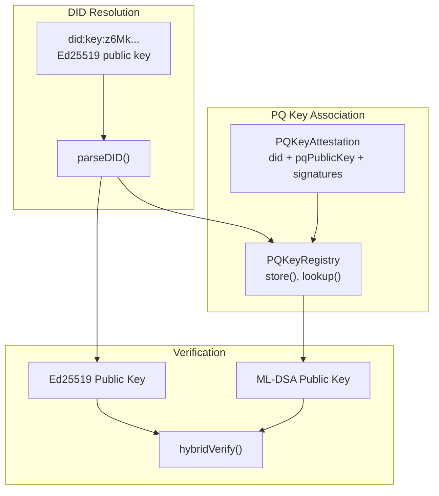
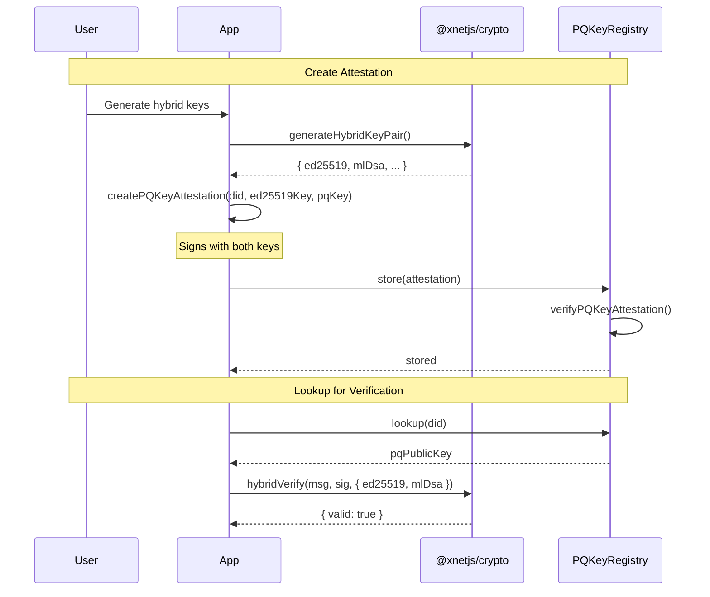

# 04: PQ Key Registry

> Associate post-quantum public keys with DIDs via attestations and a queryable registry.

**Duration:** 3 days
**Dependencies:** [03-hybrid-keygen.md](./03-hybrid-keygen.md)
**Package:** `packages/identity/`

## Overview

The DID:key format remains Ed25519-based for compactness (did:key:z6Mk...). To support Level 1/2 verification, we need a way to look up the ML-DSA public key for a given DID. This step implements:

1. **PQKeyAttestation** - A self-signed attestation binding a PQ public key to a DID
2. **PQKeyRegistry** - Interface for storing and querying PQ key associations
3. **MemoryPQKeyRegistry** - In-memory implementation
4. **IndexedDBPQKeyRegistry** - Persistent browser storage



## Implementation

### 1. PQ Key Attestation Type

```typescript
// packages/identity/src/pq-attestation.ts

import { ed25519 } from '@noble/curves/ed25519'
import { ml_dsa65 } from '@noble/post-quantum/ml-dsa'
import { hash } from '@xnetjs/crypto'
import type { DID } from './types'

/**
 * Algorithm identifier for post-quantum signing.
 * Currently only ML-DSA-65 is supported.
 */
export type PQAlgorithm = 'ml-dsa-65'

/**
 * A self-signed attestation that binds a post-quantum public key to a DID.
 *
 * The attestation is signed by both:
 * - The Ed25519 key (proves DID ownership)
 * - The ML-DSA key (proves PQ key possession)
 *
 * This creates a cryptographic binding between the DID and PQ key.
 */
export interface PQKeyAttestation {
  /** The Ed25519-based DID (did:key:z6Mk...) */
  did: DID

  /** ML-DSA-65 public key (1,952 bytes) */
  pqPublicKey: Uint8Array

  /** Post-quantum algorithm identifier */
  algorithm: PQAlgorithm

  /** When this attestation was created (Unix timestamp ms) */
  timestamp: number

  /** Optional expiration (Unix timestamp ms) */
  expiresAt?: number

  /** Ed25519 signature over the attestation payload (proves DID ownership) */
  ed25519Signature: Uint8Array

  /** ML-DSA signature over the attestation payload (proves PQ key possession) */
  pqSignature: Uint8Array
}

/**
 * Wire format for PQKeyAttestation (JSON-serializable).
 */
export interface PQKeyAttestationWire {
  did: string
  pqPublicKey: string // base64
  algorithm: PQAlgorithm
  timestamp: number
  expiresAt?: number
  ed25519Signature: string // base64
  pqSignature: string // base64
}

/**
 * Payload that gets signed in an attestation.
 * This is canonically encoded before signing.
 */
interface AttestationPayload {
  did: string
  pqPublicKey: Uint8Array
  algorithm: PQAlgorithm
  timestamp: number
  expiresAt?: number
}
```

### 2. Attestation Creation

````typescript
// packages/identity/src/pq-attestation.ts (continued)

import { encodeBase64, decodeBase64 } from '@xnetjs/crypto'
import { parseDID } from './did'

/**
 * Canonical encoding for attestation payload.
 * Uses a stable byte representation for signing.
 */
function canonicalEncode(payload: AttestationPayload): Uint8Array {
  // Sort keys and encode as JSON, then hash for consistent size
  const json = JSON.stringify({
    algorithm: payload.algorithm,
    did: payload.did,
    expiresAt: payload.expiresAt,
    pqPublicKey: encodeBase64(payload.pqPublicKey),
    timestamp: payload.timestamp
  })
  return new TextEncoder().encode(json)
}

/**
 * Create a new PQ key attestation.
 *
 * @param did - The Ed25519-based DID
 * @param ed25519PrivateKey - Ed25519 private key (32 bytes)
 * @param pqPublicKey - ML-DSA-65 public key (1,952 bytes)
 * @param pqPrivateKey - ML-DSA-65 private key (4,032 bytes)
 * @param options - Additional options
 *
 * @example
 * ```typescript
 * const attestation = createPQKeyAttestation(
 *   'did:key:z6Mk...',
 *   keyBundle.signingKey,
 *   keyBundle.pqPublicKey,
 *   keyBundle.pqSigningKey,
 *   { expiresInDays: 365 }
 * )
 * ```
 */
export function createPQKeyAttestation(
  did: DID,
  ed25519PrivateKey: Uint8Array,
  pqPublicKey: Uint8Array,
  pqPrivateKey: Uint8Array,
  options: {
    expiresInDays?: number
    timestamp?: number
  } = {}
): PQKeyAttestation {
  const timestamp = options.timestamp ?? Date.now()
  const expiresAt = options.expiresInDays
    ? timestamp + options.expiresInDays * 24 * 60 * 60 * 1000
    : undefined

  const payload: AttestationPayload = {
    did,
    pqPublicKey,
    algorithm: 'ml-dsa-65',
    timestamp,
    expiresAt
  }

  const payloadBytes = canonicalEncode(payload)
  const payloadHash = hash(payloadBytes, 'blake3')

  // Sign with Ed25519 (proves DID ownership)
  const ed25519Signature = ed25519.sign(payloadHash, ed25519PrivateKey)

  // Sign with ML-DSA (proves PQ key possession)
  const pqSignature = ml_dsa65.sign(pqPrivateKey, payloadHash)

  return {
    did,
    pqPublicKey,
    algorithm: 'ml-dsa-65',
    timestamp,
    expiresAt,
    ed25519Signature,
    pqSignature
  }
}
````

### 3. Attestation Verification

```typescript
// packages/identity/src/pq-attestation.ts (continued)

/**
 * Result of attestation verification.
 */
export interface AttestationVerificationResult {
  valid: boolean
  errors: string[]
  expired: boolean
}

/**
 * Verify a PQ key attestation.
 *
 * Checks:
 * 1. Ed25519 signature (proves DID ownership)
 * 2. ML-DSA signature (proves PQ key possession)
 * 3. Expiration (if set)
 *
 * @param attestation - The attestation to verify
 * @returns Verification result with validity and any errors
 */
export function verifyPQKeyAttestation(
  attestation: PQKeyAttestation
): AttestationVerificationResult {
  const errors: string[] = []
  let expired = false

  // Check expiration
  if (attestation.expiresAt && Date.now() > attestation.expiresAt) {
    errors.push('Attestation has expired')
    expired = true
  }

  // Reconstruct payload hash
  const payload: AttestationPayload = {
    did: attestation.did,
    pqPublicKey: attestation.pqPublicKey,
    algorithm: attestation.algorithm,
    timestamp: attestation.timestamp,
    expiresAt: attestation.expiresAt
  }
  const payloadBytes = canonicalEncode(payload)
  const payloadHash = hash(payloadBytes, 'blake3')

  // Verify Ed25519 signature
  try {
    const ed25519PublicKey = parseDID(attestation.did)
    const ed25519Valid = ed25519.verify(attestation.ed25519Signature, payloadHash, ed25519PublicKey)
    if (!ed25519Valid) {
      errors.push('Ed25519 signature is invalid')
    }
  } catch (err) {
    errors.push(
      `Failed to verify Ed25519 signature: ${err instanceof Error ? err.message : 'unknown error'}`
    )
  }

  // Verify ML-DSA signature
  try {
    const pqValid = ml_dsa65.verify(attestation.pqPublicKey, payloadHash, attestation.pqSignature)
    if (!pqValid) {
      errors.push('ML-DSA signature is invalid')
    }
  } catch (err) {
    errors.push(
      `Failed to verify ML-DSA signature: ${err instanceof Error ? err.message : 'unknown error'}`
    )
  }

  return {
    valid: errors.length === 0,
    errors,
    expired
  }
}
```

### 4. Attestation Serialization

```typescript
// packages/identity/src/pq-attestation.ts (continued)

/**
 * Serialize attestation to wire format.
 */
export function serializeAttestation(attestation: PQKeyAttestation): PQKeyAttestationWire {
  return {
    did: attestation.did,
    pqPublicKey: encodeBase64(attestation.pqPublicKey),
    algorithm: attestation.algorithm,
    timestamp: attestation.timestamp,
    expiresAt: attestation.expiresAt,
    ed25519Signature: encodeBase64(attestation.ed25519Signature),
    pqSignature: encodeBase64(attestation.pqSignature)
  }
}

/**
 * Deserialize attestation from wire format.
 */
export function deserializeAttestation(wire: PQKeyAttestationWire): PQKeyAttestation {
  return {
    did: wire.did as DID,
    pqPublicKey: decodeBase64(wire.pqPublicKey),
    algorithm: wire.algorithm,
    timestamp: wire.timestamp,
    expiresAt: wire.expiresAt,
    ed25519Signature: decodeBase64(wire.ed25519Signature),
    pqSignature: decodeBase64(wire.pqSignature)
  }
}
```

### 5. PQ Key Registry Interface

```typescript
// packages/identity/src/pq-registry.ts

import type { DID } from './types'
import type { PQKeyAttestation } from './pq-attestation'

/**
 * Interface for storing and retrieving PQ key associations.
 *
 * Implementations can use in-memory storage, IndexedDB, or remote services.
 */
export interface PQKeyRegistry {
  /**
   * Store a PQ key attestation.
   * Verifies the attestation before storing.
   * @throws If attestation is invalid
   */
  store(attestation: PQKeyAttestation): Promise<void>

  /**
   * Lookup PQ public key for a DID.
   * Returns null if no attestation exists.
   */
  lookup(did: DID): Promise<Uint8Array | null>

  /**
   * Get the full attestation for a DID.
   * Useful for re-verification or inspection.
   */
  getAttestation(did: DID): Promise<PQKeyAttestation | null>

  /**
   * Remove an attestation for a DID.
   */
  remove(did: DID): Promise<void>

  /**
   * Check if a DID has a registered PQ key.
   */
  has(did: DID): Promise<boolean>

  /**
   * Get all registered DIDs.
   */
  list(): Promise<DID[]>

  /**
   * Subscribe to registry updates.
   * Returns unsubscribe function.
   */
  subscribe(callback: (did: DID, pqPublicKey: Uint8Array | null) => void): () => void

  /**
   * Clear all attestations (useful for testing).
   */
  clear(): Promise<void>
}
```

### 6. In-Memory Registry Implementation

```typescript
// packages/identity/src/pq-registry.ts (continued)

import { verifyPQKeyAttestation } from './pq-attestation'

/**
 * In-memory PQ key registry.
 * Useful for short-lived sessions and testing.
 */
export class MemoryPQKeyRegistry implements PQKeyRegistry {
  private attestations = new Map<DID, PQKeyAttestation>()
  private listeners = new Set<(did: DID, key: Uint8Array | null) => void>()

  async store(attestation: PQKeyAttestation): Promise<void> {
    // Verify before storing
    const result = verifyPQKeyAttestation(attestation)
    if (!result.valid) {
      throw new Error(`Invalid attestation: ${result.errors.join(', ')}`)
    }

    this.attestations.set(attestation.did, attestation)
    this.notify(attestation.did, attestation.pqPublicKey)
  }

  async lookup(did: DID): Promise<Uint8Array | null> {
    const attestation = this.attestations.get(did)
    if (!attestation) return null

    // Check expiration on lookup
    if (attestation.expiresAt && Date.now() > attestation.expiresAt) {
      this.attestations.delete(did)
      this.notify(did, null)
      return null
    }

    return attestation.pqPublicKey
  }

  async getAttestation(did: DID): Promise<PQKeyAttestation | null> {
    return this.attestations.get(did) ?? null
  }

  async remove(did: DID): Promise<void> {
    this.attestations.delete(did)
    this.notify(did, null)
  }

  async has(did: DID): Promise<boolean> {
    return this.attestations.has(did)
  }

  async list(): Promise<DID[]> {
    return Array.from(this.attestations.keys())
  }

  subscribe(callback: (did: DID, key: Uint8Array | null) => void): () => void {
    this.listeners.add(callback)
    return () => this.listeners.delete(callback)
  }

  async clear(): Promise<void> {
    this.attestations.clear()
  }

  private notify(did: DID, key: Uint8Array | null): void {
    for (const listener of this.listeners) {
      try {
        listener(did, key)
      } catch {
        // Ignore listener errors
      }
    }
  }
}
```

### 7. IndexedDB Registry Implementation

```typescript
// packages/identity/src/pq-registry-idb.ts

import type { DID } from './types'
import type { PQKeyAttestation, PQKeyAttestationWire } from './pq-attestation'
import type { PQKeyRegistry } from './pq-registry'
import {
  verifyPQKeyAttestation,
  serializeAttestation,
  deserializeAttestation
} from './pq-attestation'

const DB_NAME = 'xnet-pq-keys'
const STORE_NAME = 'attestations'
const DB_VERSION = 1

/**
 * IndexedDB-backed PQ key registry for persistent storage.
 */
export class IndexedDBPQKeyRegistry implements PQKeyRegistry {
  private db: IDBDatabase | null = null
  private listeners = new Set<(did: DID, key: Uint8Array | null) => void>()
  private initPromise: Promise<void>

  constructor() {
    this.initPromise = this.init()
  }

  private async init(): Promise<void> {
    return new Promise((resolve, reject) => {
      const request = indexedDB.open(DB_NAME, DB_VERSION)

      request.onerror = () => reject(request.error)

      request.onupgradeneeded = (event) => {
        const db = (event.target as IDBOpenDBRequest).result
        if (!db.objectStoreNames.contains(STORE_NAME)) {
          const store = db.createObjectStore(STORE_NAME, { keyPath: 'did' })
          store.createIndex('timestamp', 'timestamp', { unique: false })
          store.createIndex('expiresAt', 'expiresAt', { unique: false })
        }
      }

      request.onsuccess = () => {
        this.db = request.result
        resolve()
      }
    })
  }

  private async getDB(): Promise<IDBDatabase> {
    await this.initPromise
    if (!this.db) throw new Error('Database not initialized')
    return this.db
  }

  async store(attestation: PQKeyAttestation): Promise<void> {
    const result = verifyPQKeyAttestation(attestation)
    if (!result.valid) {
      throw new Error(`Invalid attestation: ${result.errors.join(', ')}`)
    }

    const db = await this.getDB()
    const wire = serializeAttestation(attestation)

    return new Promise((resolve, reject) => {
      const tx = db.transaction(STORE_NAME, 'readwrite')
      const store = tx.objectStore(STORE_NAME)
      const request = store.put(wire)

      request.onerror = () => reject(request.error)
      request.onsuccess = () => {
        this.notify(attestation.did, attestation.pqPublicKey)
        resolve()
      }
    })
  }

  async lookup(did: DID): Promise<Uint8Array | null> {
    const attestation = await this.getAttestation(did)
    if (!attestation) return null

    // Check expiration
    if (attestation.expiresAt && Date.now() > attestation.expiresAt) {
      await this.remove(did)
      return null
    }

    return attestation.pqPublicKey
  }

  async getAttestation(did: DID): Promise<PQKeyAttestation | null> {
    const db = await this.getDB()

    return new Promise((resolve, reject) => {
      const tx = db.transaction(STORE_NAME, 'readonly')
      const store = tx.objectStore(STORE_NAME)
      const request = store.get(did)

      request.onerror = () => reject(request.error)
      request.onsuccess = () => {
        const wire = request.result as PQKeyAttestationWire | undefined
        resolve(wire ? deserializeAttestation(wire) : null)
      }
    })
  }

  async remove(did: DID): Promise<void> {
    const db = await this.getDB()

    return new Promise((resolve, reject) => {
      const tx = db.transaction(STORE_NAME, 'readwrite')
      const store = tx.objectStore(STORE_NAME)
      const request = store.delete(did)

      request.onerror = () => reject(request.error)
      request.onsuccess = () => {
        this.notify(did, null)
        resolve()
      }
    })
  }

  async has(did: DID): Promise<boolean> {
    const attestation = await this.getAttestation(did)
    return attestation !== null
  }

  async list(): Promise<DID[]> {
    const db = await this.getDB()

    return new Promise((resolve, reject) => {
      const tx = db.transaction(STORE_NAME, 'readonly')
      const store = tx.objectStore(STORE_NAME)
      const request = store.getAllKeys()

      request.onerror = () => reject(request.error)
      request.onsuccess = () => {
        resolve(request.result as DID[])
      }
    })
  }

  subscribe(callback: (did: DID, key: Uint8Array | null) => void): () => void {
    this.listeners.add(callback)
    return () => this.listeners.delete(callback)
  }

  async clear(): Promise<void> {
    const db = await this.getDB()

    return new Promise((resolve, reject) => {
      const tx = db.transaction(STORE_NAME, 'readwrite')
      const store = tx.objectStore(STORE_NAME)
      const request = store.clear()

      request.onerror = () => reject(request.error)
      request.onsuccess = () => resolve()
    })
  }

  private notify(did: DID, key: Uint8Array | null): void {
    for (const listener of this.listeners) {
      try {
        listener(did, key)
      } catch {
        // Ignore listener errors
      }
    }
  }
}
```

### 8. Registry Factory

```typescript
// packages/identity/src/pq-registry.ts (continued)

/**
 * Create a PQ key registry appropriate for the current environment.
 */
export function createPQKeyRegistry(): PQKeyRegistry {
  // Browser environment with IndexedDB
  if (typeof indexedDB !== 'undefined') {
    const { IndexedDBPQKeyRegistry } = require('./pq-registry-idb')
    return new IndexedDBPQKeyRegistry()
  }

  // Fallback to memory
  return new MemoryPQKeyRegistry()
}
```

### 9. Update Package Exports

```typescript
// packages/identity/src/index.ts (add to exports)

export type {
  PQAlgorithm,
  PQKeyAttestation,
  PQKeyAttestationWire,
  AttestationVerificationResult
} from './pq-attestation'

export {
  createPQKeyAttestation,
  verifyPQKeyAttestation,
  serializeAttestation,
  deserializeAttestation
} from './pq-attestation'

export type { PQKeyRegistry } from './pq-registry'
export { MemoryPQKeyRegistry, createPQKeyRegistry } from './pq-registry'
export { IndexedDBPQKeyRegistry } from './pq-registry-idb'
```

## Attestation Flow Diagram



## Tests

```typescript
// packages/identity/src/pq-attestation.test.ts

import { describe, it, expect, beforeEach } from 'vitest'
import { ed25519 } from '@noble/curves/ed25519'
import { ml_dsa65 } from '@noble/post-quantum/ml-dsa'
import {
  createPQKeyAttestation,
  verifyPQKeyAttestation,
  serializeAttestation,
  deserializeAttestation
} from './pq-attestation'
import { MemoryPQKeyRegistry } from './pq-registry'
import { createDID } from './did'

describe('PQKeyAttestation', () => {
  let ed25519Keys: { publicKey: Uint8Array; privateKey: Uint8Array }
  let mlDsaKeys: { publicKey: Uint8Array; secretKey: Uint8Array }
  let did: string

  beforeEach(() => {
    const privateKey = new Uint8Array(32).fill(42)
    ed25519Keys = {
      privateKey,
      publicKey: ed25519.getPublicKey(privateKey)
    }
    mlDsaKeys = ml_dsa65.keygen()
    did = createDID(ed25519Keys.publicKey)
  })

  describe('createPQKeyAttestation', () => {
    it('creates valid attestation', () => {
      const attestation = createPQKeyAttestation(
        did,
        ed25519Keys.privateKey,
        mlDsaKeys.publicKey,
        mlDsaKeys.secretKey
      )

      expect(attestation.did).toBe(did)
      expect(attestation.pqPublicKey).toEqual(mlDsaKeys.publicKey)
      expect(attestation.algorithm).toBe('ml-dsa-65')
      expect(attestation.timestamp).toBeLessThanOrEqual(Date.now())
      expect(attestation.ed25519Signature.length).toBe(64)
      expect(attestation.pqSignature.length).toBe(3293)
    })

    it('sets expiration when specified', () => {
      const attestation = createPQKeyAttestation(
        did,
        ed25519Keys.privateKey,
        mlDsaKeys.publicKey,
        mlDsaKeys.secretKey,
        { expiresInDays: 30 }
      )

      expect(attestation.expiresAt).toBeDefined()
      expect(attestation.expiresAt! - attestation.timestamp).toBe(30 * 24 * 60 * 60 * 1000)
    })
  })

  describe('verifyPQKeyAttestation', () => {
    it('verifies valid attestation', () => {
      const attestation = createPQKeyAttestation(
        did,
        ed25519Keys.privateKey,
        mlDsaKeys.publicKey,
        mlDsaKeys.secretKey
      )

      const result = verifyPQKeyAttestation(attestation)

      expect(result.valid).toBe(true)
      expect(result.errors).toHaveLength(0)
      expect(result.expired).toBe(false)
    })

    it('rejects tampered Ed25519 signature', () => {
      const attestation = createPQKeyAttestation(
        did,
        ed25519Keys.privateKey,
        mlDsaKeys.publicKey,
        mlDsaKeys.secretKey
      )

      attestation.ed25519Signature[0] ^= 0xff

      const result = verifyPQKeyAttestation(attestation)

      expect(result.valid).toBe(false)
      expect(result.errors).toContain('Ed25519 signature is invalid')
    })

    it('rejects tampered ML-DSA signature', () => {
      const attestation = createPQKeyAttestation(
        did,
        ed25519Keys.privateKey,
        mlDsaKeys.publicKey,
        mlDsaKeys.secretKey
      )

      attestation.pqSignature[0] ^= 0xff

      const result = verifyPQKeyAttestation(attestation)

      expect(result.valid).toBe(false)
      expect(result.errors).toContain('ML-DSA signature is invalid')
    })

    it('rejects expired attestation', () => {
      const attestation = createPQKeyAttestation(
        did,
        ed25519Keys.privateKey,
        mlDsaKeys.publicKey,
        mlDsaKeys.secretKey,
        { timestamp: Date.now() - 1000, expiresInDays: 0 }
      )

      // Force expiration
      attestation.expiresAt = Date.now() - 1

      const result = verifyPQKeyAttestation(attestation)

      expect(result.expired).toBe(true)
      expect(result.errors).toContain('Attestation has expired')
    })
  })

  describe('Serialization', () => {
    it('round-trips attestation', () => {
      const original = createPQKeyAttestation(
        did,
        ed25519Keys.privateKey,
        mlDsaKeys.publicKey,
        mlDsaKeys.secretKey,
        { expiresInDays: 365 }
      )

      const wire = serializeAttestation(original)
      const restored = deserializeAttestation(wire)

      expect(restored.did).toBe(original.did)
      expect(restored.pqPublicKey).toEqual(original.pqPublicKey)
      expect(restored.algorithm).toBe(original.algorithm)
      expect(restored.timestamp).toBe(original.timestamp)
      expect(restored.expiresAt).toBe(original.expiresAt)
      expect(restored.ed25519Signature).toEqual(original.ed25519Signature)
      expect(restored.pqSignature).toEqual(original.pqSignature)

      // Verify restored attestation is still valid
      const result = verifyPQKeyAttestation(restored)
      expect(result.valid).toBe(true)
    })
  })
})

describe('MemoryPQKeyRegistry', () => {
  let registry: MemoryPQKeyRegistry
  let ed25519Keys: { publicKey: Uint8Array; privateKey: Uint8Array }
  let mlDsaKeys: { publicKey: Uint8Array; secretKey: Uint8Array }
  let did: string
  let attestation: PQKeyAttestation

  beforeEach(() => {
    registry = new MemoryPQKeyRegistry()

    const privateKey = new Uint8Array(32).fill(42)
    ed25519Keys = {
      privateKey,
      publicKey: ed25519.getPublicKey(privateKey)
    }
    mlDsaKeys = ml_dsa65.keygen()
    did = createDID(ed25519Keys.publicKey)

    attestation = createPQKeyAttestation(
      did,
      ed25519Keys.privateKey,
      mlDsaKeys.publicKey,
      mlDsaKeys.secretKey
    )
  })

  it('stores and retrieves attestation', async () => {
    await registry.store(attestation)

    const key = await registry.lookup(did)
    expect(key).toEqual(mlDsaKeys.publicKey)
  })

  it('returns null for unknown DID', async () => {
    const key = await registry.lookup('did:key:unknown')
    expect(key).toBeNull()
  })

  it('rejects invalid attestation', async () => {
    attestation.ed25519Signature[0] ^= 0xff

    await expect(registry.store(attestation)).rejects.toThrow('Invalid attestation')
  })

  it('removes attestation', async () => {
    await registry.store(attestation)
    expect(await registry.has(did)).toBe(true)

    await registry.remove(did)
    expect(await registry.has(did)).toBe(false)
  })

  it('lists all DIDs', async () => {
    await registry.store(attestation)

    const privateKey2 = new Uint8Array(32).fill(99)
    const ed25519Keys2 = {
      privateKey: privateKey2,
      publicKey: ed25519.getPublicKey(privateKey2)
    }
    const mlDsaKeys2 = ml_dsa65.keygen()
    const did2 = createDID(ed25519Keys2.publicKey)
    const attestation2 = createPQKeyAttestation(
      did2,
      ed25519Keys2.privateKey,
      mlDsaKeys2.publicKey,
      mlDsaKeys2.secretKey
    )
    await registry.store(attestation2)

    const dids = await registry.list()
    expect(dids).toHaveLength(2)
    expect(dids).toContain(did)
    expect(dids).toContain(did2)
  })

  it('notifies subscribers on store', async () => {
    const events: Array<{ did: string; key: Uint8Array | null }> = []
    registry.subscribe((d, k) => events.push({ did: d, key: k }))

    await registry.store(attestation)

    expect(events).toHaveLength(1)
    expect(events[0].did).toBe(did)
    expect(events[0].key).toEqual(mlDsaKeys.publicKey)
  })

  it('notifies subscribers on remove', async () => {
    await registry.store(attestation)

    const events: Array<{ did: string; key: Uint8Array | null }> = []
    registry.subscribe((d, k) => events.push({ did: d, key: k }))

    await registry.remove(did)

    expect(events).toHaveLength(1)
    expect(events[0].did).toBe(did)
    expect(events[0].key).toBeNull()
  })

  it('clears all attestations', async () => {
    await registry.store(attestation)
    await registry.clear()

    expect(await registry.list()).toHaveLength(0)
  })
})
```

## Checklist

- [x] Implement `PQKeyAttestation` type
- [x] Implement `createPQKeyAttestation()` with dual signatures
- [x] Implement `verifyPQKeyAttestation()` with expiration check
- [x] Implement `serializeAttestation()` / `deserializeAttestation()`
- [x] Implement `PQKeyRegistry` interface
- [x] Implement `MemoryPQKeyRegistry`
- [ ] Implement `IndexedDBPQKeyRegistry` (deferred - MemoryPQKeyRegistry sufficient for now)
- [x] Implement `createPQKeyRegistry()` factory
- [x] Add subscription support for real-time updates
- [x] Handle attestation expiration on lookup
- [x] Update package exports
- [x] Write unit tests (target: 30+ tests) - 30 tests implemented
- [ ] Test IndexedDB implementation in browser environment (deferred)

---

[Back to README](./README.md) | [Previous: Hybrid Key Generation](./03-hybrid-keygen.md) | [Next: Identity Upgrade ->](./05-identity-upgrade.md)
