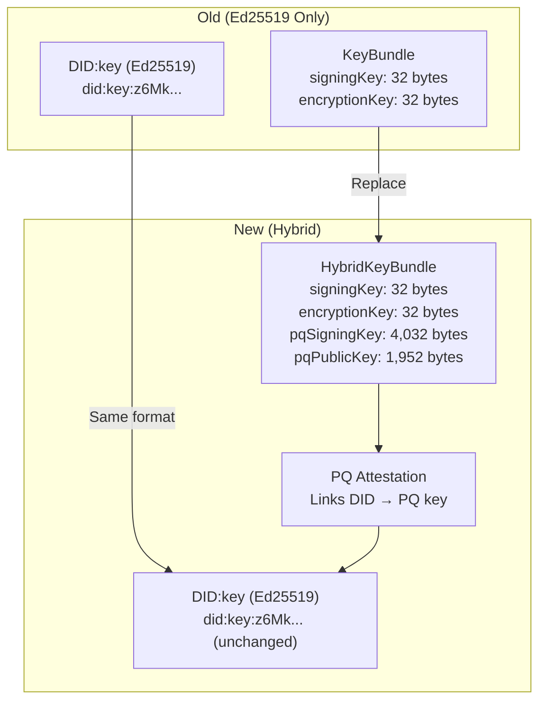
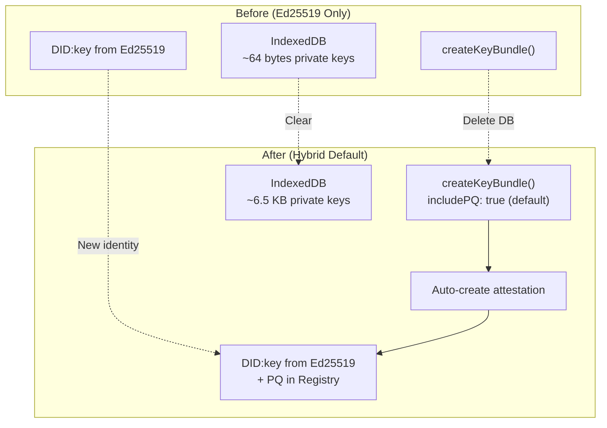

# 05: Identity Upgrade

> Replace KeyBundle with HybridKeyBundle and update identity derivation for post-quantum support.

**Duration:** 4 days
**Dependencies:** [04-pq-key-registry.md](./04-pq-key-registry.md)
**Package:** `packages/identity/`

## Overview

This step replaces the existing Ed25519-only `KeyBundle` with `HybridKeyBundle` that includes ML-DSA keys by default. Since xNet is prerelease, this is a clean replacement - not a migration.



## Implementation

### 1. HybridKeyBundle Type

```typescript
// packages/identity/src/types.ts

import type { SecurityLevel } from '@xnetjs/crypto'

/**
 * Ed25519-based DID (did:key:z6Mk...)
 */
export type DID = `did:key:${string}`

/**
 * Identity with public key information.
 */
export interface Identity {
  /** The DID derived from Ed25519 public key */
  did: DID

  /** Ed25519 public key (32 bytes) */
  publicKey: Uint8Array

  /** When this identity was created */
  created: number
}

/**
 * Complete key bundle with hybrid cryptographic keys.
 *
 * This replaces the old KeyBundle type. New identities always
 * have post-quantum keys by default (since we're prerelease).
 */
export interface HybridKeyBundle {
  // ─── Classical Keys (Always Present) ───────────────────────

  /** Ed25519 private key for signing (32 bytes) */
  signingKey: Uint8Array

  /** X25519 private key for encryption/key exchange (32 bytes) */
  encryptionKey: Uint8Array

  // ─── Post-Quantum Keys (Present by Default) ────────────────

  /** ML-DSA-65 private key for signing (4,032 bytes) */
  pqSigningKey?: Uint8Array

  /** ML-DSA-65 public key (1,952 bytes) - cached for convenience */
  pqPublicKey?: Uint8Array

  /** ML-KEM-768 private key for key exchange (2,400 bytes) */
  pqEncryptionKey?: Uint8Array

  /** ML-KEM-768 public key (1,184 bytes) - cached for convenience */
  pqEncryptionPublicKey?: Uint8Array

  // ─── Identity ──────────────────────────────────────────────

  /** Identity derived from Ed25519 public key */
  identity: Identity

  /** Maximum security level this bundle supports */
  maxSecurityLevel: SecurityLevel
}

/**
 * Options for creating a new key bundle.
 */
export interface CreateKeyBundleOptions {
  /**
   * Whether to include post-quantum keys.
   * Default: true (we're prerelease, always include PQ)
   */
  includePQ?: boolean

  /**
   * Seed for deterministic derivation.
   * If not provided, random keys are generated.
   */
  seed?: Uint8Array
}
```

### 2. Key Bundle Creation

````typescript
// packages/identity/src/key-bundle.ts

import { generateHybridKeyPair, deriveHybridKeyPair, type HybridKeyPair } from '@xnetjs/crypto'
import { createDID, parseDID } from './did'
import type { HybridKeyBundle, CreateKeyBundleOptions, Identity } from './types'
import { createPQKeyAttestation, type PQKeyAttestation } from './pq-attestation'
import type { PQKeyRegistry } from './pq-registry'

/**
 * Create a new hybrid key bundle.
 *
 * By default, this generates post-quantum keys (ML-DSA and ML-KEM)
 * in addition to classical Ed25519/X25519 keys.
 *
 * @example
 * ```typescript
 * // Random generation (default: includes PQ keys)
 * const bundle = await createKeyBundle()
 *
 * // Deterministic from seed (e.g., from passkey PRF)
 * const bundle = await createKeyBundle({ seed: prfOutput })
 *
 * // Classical only (opt-out of PQ for specific use case)
 * const bundle = await createKeyBundle({ includePQ: false })
 * ```
 */
export function createKeyBundle(options: CreateKeyBundleOptions = {}): HybridKeyBundle {
  const { includePQ = true, seed } = options

  // Generate or derive keys
  const keyPair: HybridKeyPair = seed
    ? deriveHybridKeyPair(seed, { includePQ })
    : generateHybridKeyPair({ includePQ })

  // Create identity from Ed25519 public key
  const did = createDID(keyPair.ed25519.publicKey)
  const identity: Identity = {
    did,
    publicKey: keyPair.ed25519.publicKey,
    created: Date.now()
  }

  const bundle: HybridKeyBundle = {
    signingKey: keyPair.ed25519.privateKey,
    encryptionKey: keyPair.x25519.privateKey,
    identity,
    maxSecurityLevel: keyPair.mlDsa ? 2 : 0
  }

  // Add PQ keys if generated
  if (keyPair.mlDsa) {
    bundle.pqSigningKey = keyPair.mlDsa.privateKey
    bundle.pqPublicKey = keyPair.mlDsa.publicKey
  }

  if (keyPair.mlKem) {
    bundle.pqEncryptionKey = keyPair.mlKem.privateKey
    bundle.pqEncryptionPublicKey = keyPair.mlKem.publicKey
  }

  return bundle
}

/**
 * Create a key bundle and register its PQ attestation.
 *
 * This is the preferred method for creating identities, as it
 * automatically creates the attestation linking the DID to the PQ key.
 */
export async function createKeyBundleWithAttestation(
  registry: PQKeyRegistry,
  options: CreateKeyBundleOptions & { expiresInDays?: number } = {}
): Promise<{ bundle: HybridKeyBundle; attestation: PQKeyAttestation | null }> {
  const bundle = createKeyBundle(options)

  let attestation: PQKeyAttestation | null = null

  // Create and store attestation if PQ keys are present
  if (bundle.pqSigningKey && bundle.pqPublicKey) {
    attestation = createPQKeyAttestation(
      bundle.identity.did,
      bundle.signingKey,
      bundle.pqPublicKey,
      bundle.pqSigningKey,
      { expiresInDays: options.expiresInDays }
    )

    await registry.store(attestation)
  }

  return { bundle, attestation }
}
````

### 3. Passkey Integration

```typescript
// packages/identity/src/passkey/create.ts (updated)

import { deriveHybridKeyPair } from '@xnetjs/crypto'
import { createDID } from '../did'
import type { HybridKeyBundle, Identity } from '../types'
import type { PasskeyIdentity, PasskeyUnlockResult } from './types'

const XNET_SALT = new TextEncoder().encode('xnet-identity-v1')

/**
 * Derive a HybridKeyBundle from passkey PRF output.
 *
 * The PRF output is used as a master seed to derive all keys:
 * - Ed25519 for signing
 * - X25519 for encryption
 * - ML-DSA for post-quantum signing
 * - ML-KEM for post-quantum key exchange
 */
async function deriveHybridKeyBundleFromPRF(prfOutput: Uint8Array): Promise<HybridKeyBundle> {
  // Use Web Crypto HKDF to derive master seed
  const keyMaterial = await crypto.subtle.importKey('raw', prfOutput, 'HKDF', false, ['deriveBits'])

  const bits = await crypto.subtle.deriveBits(
    {
      name: 'HKDF',
      hash: 'SHA-256',
      salt: XNET_SALT,
      info: new TextEncoder().encode('hybrid-key-seed')
    },
    keyMaterial,
    256 // 32 bytes
  )

  const seed = new Uint8Array(bits)

  // Derive hybrid keys from seed
  const keyPair = deriveHybridKeyPair(seed, { includePQ: true })

  // Create identity
  const did = createDID(keyPair.ed25519.publicKey)
  const identity: Identity = {
    did,
    publicKey: keyPair.ed25519.publicKey,
    created: Date.now()
  }

  return {
    signingKey: keyPair.ed25519.privateKey,
    encryptionKey: keyPair.x25519.privateKey,
    pqSigningKey: keyPair.mlDsa?.privateKey,
    pqPublicKey: keyPair.mlDsa?.publicKey,
    pqEncryptionKey: keyPair.mlKem?.privateKey,
    pqEncryptionPublicKey: keyPair.mlKem?.publicKey,
    identity,
    maxSecurityLevel: 2
  }
}

/**
 * Create a new identity using passkey with PRF extension.
 * Derives hybrid keys (Ed25519 + ML-DSA) from the passkey.
 */
export async function createPasskeyIdentity(
  options: PasskeyCreateOptions = {}
): Promise<PasskeyUnlockResult> {
  const {
    displayName = 'xNet Identity',
    rpId = window.location.hostname,
    userVerification = 'required'
  } = options

  const userId = crypto.getRandomValues(new Uint8Array(32))
  const prfInput = new TextEncoder().encode('xnet-identity-key')

  const credential = (await navigator.credentials.create({
    publicKey: {
      challenge: crypto.getRandomValues(new Uint8Array(32)),
      rp: { id: rpId, name: 'xNet' },
      user: { id: userId, name: displayName, displayName },
      pubKeyCredParams: [
        { alg: -7, type: 'public-key' },
        { alg: -257, type: 'public-key' }
      ],
      authenticatorSelection: {
        authenticatorAttachment: 'platform',
        residentKey: 'required',
        userVerification
      },
      extensions: {
        // @ts-expect-error - PRF extension
        prf: { eval: { first: prfInput } }
      }
    }
  })) as PublicKeyCredential | null

  if (!credential) {
    throw new Error('Passkey creation cancelled')
  }

  const extensions = credential.getClientExtensionResults() as {
    prf?: { results?: { first?: ArrayBuffer } }
  }

  if (!extensions.prf?.results?.first) {
    throw new Error('PRF extension not supported by this authenticator')
  }

  const prfOutput = new Uint8Array(extensions.prf.results.first)

  // Derive hybrid key bundle
  const bundle = await deriveHybridKeyBundleFromPRF(prfOutput)

  const passkeyIdentity: PasskeyIdentity = {
    did: bundle.identity.did,
    publicKey: bundle.identity.publicKey,
    pqPublicKey: bundle.pqPublicKey, // Store PQ public key for reference
    credentialId: new Uint8Array(credential.rawId),
    createdAt: Date.now(),
    rpId
  }

  return {
    bundle,
    passkey: passkeyIdentity
  }
}
```

### 4. Key Bundle Utilities

```typescript
// packages/identity/src/key-bundle.ts (continued)

import { hybridSign, hybridVerify, type SecurityLevel, type UnifiedSignature } from '@xnetjs/crypto'

/**
 * Sign a message using the key bundle.
 *
 * @param bundle - The key bundle to sign with
 * @param message - Message to sign
 * @param level - Security level (default: bundle's max or 1)
 */
export function signWithBundle(
  bundle: HybridKeyBundle,
  message: Uint8Array,
  level?: SecurityLevel
): UnifiedSignature {
  const effectiveLevel = level ?? (Math.min(bundle.maxSecurityLevel, 1) as SecurityLevel)

  return hybridSign(
    message,
    {
      ed25519: bundle.signingKey,
      mlDsa: bundle.pqSigningKey
    },
    effectiveLevel
  )
}

/**
 * Verify a signature against a key bundle's public keys.
 *
 * @param bundle - The key bundle to verify against
 * @param message - Original message
 * @param signature - Signature to verify
 */
export function verifyWithBundle(
  bundle: HybridKeyBundle,
  message: Uint8Array,
  signature: UnifiedSignature
): boolean {
  const result = hybridVerify(message, signature, {
    ed25519: bundle.identity.publicKey,
    mlDsa: bundle.pqPublicKey
  })

  return result.valid
}

/**
 * Get the maximum security level supported by a bundle.
 */
export function bundleSecurityLevel(bundle: HybridKeyBundle): SecurityLevel {
  return bundle.maxSecurityLevel
}

/**
 * Check if bundle can sign at a given level.
 */
export function bundleCanSignAt(bundle: HybridKeyBundle, level: SecurityLevel): boolean {
  switch (level) {
    case 0:
      return true
    case 1:
    case 2:
      return bundle.pqSigningKey !== undefined
    default:
      return false
  }
}

/**
 * Calculate the storage size of a key bundle in bytes.
 */
export function bundleSize(bundle: HybridKeyBundle): number {
  let size = 0

  // Classical keys
  size += bundle.signingKey.length // 32
  size += bundle.encryptionKey.length // 32

  // PQ signing keys
  if (bundle.pqSigningKey) size += bundle.pqSigningKey.length // 4032
  if (bundle.pqPublicKey) size += bundle.pqPublicKey.length // 1952

  // PQ encryption keys
  if (bundle.pqEncryptionKey) size += bundle.pqEncryptionKey.length // 2400
  if (bundle.pqEncryptionPublicKey) size += bundle.pqEncryptionPublicKey.length // 1184

  // Identity (approximate)
  size += bundle.identity.publicKey.length // 32

  return size
}
```

### 5. Key Bundle Serialization

```typescript
// packages/identity/src/key-bundle-storage.ts

import { encodeBase64, decodeBase64 } from '@xnetjs/crypto'
import { createDID } from './did'
import type { HybridKeyBundle } from './types'

/**
 * Serialized key bundle for storage.
 * Private keys are stored - this should only be in secure storage!
 */
export interface SerializedKeyBundle {
  v: 2 // Version for future compatibility
  signingKey: string // base64
  encryptionKey: string // base64
  pqSigningKey?: string // base64
  pqPublicKey?: string // base64
  pqEncryptionKey?: string // base64
  pqEncryptionPublicKey?: string // base64
  created: number
}

/**
 * Serialize a key bundle for storage.
 * WARNING: Contains private keys - use secure storage only!
 */
export function serializeKeyBundle(bundle: HybridKeyBundle): SerializedKeyBundle {
  return {
    v: 2,
    signingKey: encodeBase64(bundle.signingKey),
    encryptionKey: encodeBase64(bundle.encryptionKey),
    pqSigningKey: bundle.pqSigningKey ? encodeBase64(bundle.pqSigningKey) : undefined,
    pqPublicKey: bundle.pqPublicKey ? encodeBase64(bundle.pqPublicKey) : undefined,
    pqEncryptionKey: bundle.pqEncryptionKey ? encodeBase64(bundle.pqEncryptionKey) : undefined,
    pqEncryptionPublicKey: bundle.pqEncryptionPublicKey
      ? encodeBase64(bundle.pqEncryptionPublicKey)
      : undefined,
    created: bundle.identity.created
  }
}

/**
 * Deserialize a key bundle from storage.
 */
export function deserializeKeyBundle(data: SerializedKeyBundle): HybridKeyBundle {
  const signingKey = decodeBase64(data.signingKey)
  const encryptionKey = decodeBase64(data.encryptionKey)

  // Derive public key and DID from signing key
  const { ed25519 } = require('@noble/curves/ed25519')
  const publicKey = ed25519.getPublicKey(signingKey)
  const did = createDID(publicKey)

  const bundle: HybridKeyBundle = {
    signingKey,
    encryptionKey,
    identity: {
      did,
      publicKey,
      created: data.created
    },
    maxSecurityLevel: 0
  }

  // Add PQ keys if present
  if (data.pqSigningKey) {
    bundle.pqSigningKey = decodeBase64(data.pqSigningKey)
    bundle.maxSecurityLevel = 2
  }
  if (data.pqPublicKey) {
    bundle.pqPublicKey = decodeBase64(data.pqPublicKey)
  }
  if (data.pqEncryptionKey) {
    bundle.pqEncryptionKey = decodeBase64(data.pqEncryptionKey)
  }
  if (data.pqEncryptionPublicKey) {
    bundle.pqEncryptionPublicKey = decodeBase64(data.pqEncryptionPublicKey)
  }

  return bundle
}
```

### 6. Update Package Exports

```typescript
// packages/identity/src/index.ts

// Types
export type { DID, Identity, HybridKeyBundle, CreateKeyBundleOptions } from './types'

// Key bundle creation
export {
  createKeyBundle,
  createKeyBundleWithAttestation,
  signWithBundle,
  verifyWithBundle,
  bundleSecurityLevel,
  bundleCanSignAt,
  bundleSize
} from './key-bundle'

// Serialization
export type { SerializedKeyBundle } from './key-bundle-storage'
export { serializeKeyBundle, deserializeKeyBundle } from './key-bundle-storage'

// DID utilities
export { createDID, parseDID } from './did'

// PQ attestation (from previous step)
export type {
  PQKeyAttestation,
  PQKeyAttestationWire,
  AttestationVerificationResult
} from './pq-attestation'
export {
  createPQKeyAttestation,
  verifyPQKeyAttestation,
  serializeAttestation,
  deserializeAttestation
} from './pq-attestation'

// PQ registry (from previous step)
export type { PQKeyRegistry } from './pq-registry'
export { MemoryPQKeyRegistry, createPQKeyRegistry } from './pq-registry'

// Passkey (if applicable)
export type { PasskeyIdentity, PasskeyUnlockResult, PasskeyCreateOptions } from './passkey/types'
export { createPasskeyIdentity, unlockPasskeyIdentity } from './passkey'
```

## Migration Diagram



## Tests

```typescript
// packages/identity/src/key-bundle.test.ts

import { describe, it, expect, beforeEach } from 'vitest'
import {
  createKeyBundle,
  createKeyBundleWithAttestation,
  signWithBundle,
  verifyWithBundle,
  bundleSecurityLevel,
  bundleCanSignAt,
  bundleSize
} from './key-bundle'
import { serializeKeyBundle, deserializeKeyBundle } from './key-bundle-storage'
import { MemoryPQKeyRegistry } from './pq-registry'
import { hybridVerify } from '@xnetjs/crypto'

describe('createKeyBundle', () => {
  it('creates hybrid bundle by default', () => {
    const bundle = createKeyBundle()

    // Classical keys
    expect(bundle.signingKey.length).toBe(32)
    expect(bundle.encryptionKey.length).toBe(32)

    // PQ keys
    expect(bundle.pqSigningKey).toBeDefined()
    expect(bundle.pqSigningKey!.length).toBe(4032)
    expect(bundle.pqPublicKey).toBeDefined()
    expect(bundle.pqPublicKey!.length).toBe(1952)

    // Identity
    expect(bundle.identity.did).toMatch(/^did:key:z/)
    expect(bundle.identity.publicKey.length).toBe(32)

    // Max level
    expect(bundle.maxSecurityLevel).toBe(2)
  })

  it('creates classical-only bundle when requested', () => {
    const bundle = createKeyBundle({ includePQ: false })

    expect(bundle.signingKey.length).toBe(32)
    expect(bundle.pqSigningKey).toBeUndefined()
    expect(bundle.maxSecurityLevel).toBe(0)
  })

  it('creates deterministic bundle from seed', () => {
    const seed = new Uint8Array(32).fill(42)

    const bundle1 = createKeyBundle({ seed })
    const bundle2 = createKeyBundle({ seed })

    expect(bundle1.signingKey).toEqual(bundle2.signingKey)
    expect(bundle1.pqSigningKey).toEqual(bundle2.pqSigningKey)
    expect(bundle1.identity.did).toBe(bundle2.identity.did)
  })

  it('creates different bundles from different seeds', () => {
    const bundle1 = createKeyBundle({ seed: new Uint8Array(32).fill(1) })
    const bundle2 = createKeyBundle({ seed: new Uint8Array(32).fill(2) })

    expect(bundle1.identity.did).not.toBe(bundle2.identity.did)
  })
})

describe('createKeyBundleWithAttestation', () => {
  it('creates bundle and registers attestation', async () => {
    const registry = new MemoryPQKeyRegistry()

    const { bundle, attestation } = await createKeyBundleWithAttestation(registry)

    expect(attestation).not.toBeNull()
    expect(attestation!.did).toBe(bundle.identity.did)

    // Verify attestation is in registry
    const pqKey = await registry.lookup(bundle.identity.did)
    expect(pqKey).toEqual(bundle.pqPublicKey)
  })
})

describe('signWithBundle / verifyWithBundle', () => {
  it('signs and verifies at Level 0', () => {
    const bundle = createKeyBundle()
    const message = new TextEncoder().encode('test message')

    const sig = signWithBundle(bundle, message, 0)
    expect(sig.level).toBe(0)

    const valid = verifyWithBundle(bundle, message, sig)
    expect(valid).toBe(true)
  })

  it('signs and verifies at Level 1', () => {
    const bundle = createKeyBundle()
    const message = new TextEncoder().encode('test message')

    const sig = signWithBundle(bundle, message, 1)
    expect(sig.level).toBe(1)
    expect(sig.ed25519).toBeDefined()
    expect(sig.mlDsa).toBeDefined()

    const valid = verifyWithBundle(bundle, message, sig)
    expect(valid).toBe(true)
  })

  it('signs and verifies at Level 2', () => {
    const bundle = createKeyBundle()
    const message = new TextEncoder().encode('test message')

    const sig = signWithBundle(bundle, message, 2)
    expect(sig.level).toBe(2)

    const valid = verifyWithBundle(bundle, message, sig)
    expect(valid).toBe(true)
  })

  it('defaults to Level 1 for hybrid bundles', () => {
    const bundle = createKeyBundle()
    const message = new TextEncoder().encode('test message')

    const sig = signWithBundle(bundle, message)
    expect(sig.level).toBe(1)
  })

  it('defaults to Level 0 for classical bundles', () => {
    const bundle = createKeyBundle({ includePQ: false })
    const message = new TextEncoder().encode('test message')

    const sig = signWithBundle(bundle, message)
    expect(sig.level).toBe(0)
  })
})

describe('bundleSecurityLevel / bundleCanSignAt', () => {
  it('returns correct level for hybrid bundle', () => {
    const bundle = createKeyBundle()
    expect(bundleSecurityLevel(bundle)).toBe(2)
    expect(bundleCanSignAt(bundle, 0)).toBe(true)
    expect(bundleCanSignAt(bundle, 1)).toBe(true)
    expect(bundleCanSignAt(bundle, 2)).toBe(true)
  })

  it('returns correct level for classical bundle', () => {
    const bundle = createKeyBundle({ includePQ: false })
    expect(bundleSecurityLevel(bundle)).toBe(0)
    expect(bundleCanSignAt(bundle, 0)).toBe(true)
    expect(bundleCanSignAt(bundle, 1)).toBe(false)
    expect(bundleCanSignAt(bundle, 2)).toBe(false)
  })
})

describe('bundleSize', () => {
  it('calculates classical bundle size', () => {
    const bundle = createKeyBundle({ includePQ: false })
    const size = bundleSize(bundle)
    expect(size).toBe(32 + 32 + 32) // signing + encryption + identity pubkey
  })

  it('calculates hybrid bundle size', () => {
    const bundle = createKeyBundle()
    const size = bundleSize(bundle)
    expect(size).toBeGreaterThan(6000) // Includes ~6KB of PQ keys
  })
})

describe('Serialization', () => {
  it('round-trips hybrid bundle', () => {
    const original = createKeyBundle()
    const serialized = serializeKeyBundle(original)
    const restored = deserializeKeyBundle(serialized)

    expect(restored.signingKey).toEqual(original.signingKey)
    expect(restored.encryptionKey).toEqual(original.encryptionKey)
    expect(restored.pqSigningKey).toEqual(original.pqSigningKey)
    expect(restored.pqPublicKey).toEqual(original.pqPublicKey)
    expect(restored.identity.did).toBe(original.identity.did)
    expect(restored.maxSecurityLevel).toBe(original.maxSecurityLevel)
  })

  it('round-trips classical bundle', () => {
    const original = createKeyBundle({ includePQ: false })
    const serialized = serializeKeyBundle(original)
    const restored = deserializeKeyBundle(serialized)

    expect(restored.signingKey).toEqual(original.signingKey)
    expect(restored.pqSigningKey).toBeUndefined()
    expect(restored.maxSecurityLevel).toBe(0)
  })

  it('restored bundle can sign and verify', () => {
    const original = createKeyBundle()
    const serialized = serializeKeyBundle(original)
    const restored = deserializeKeyBundle(serialized)

    const message = new TextEncoder().encode('test')
    const sig = signWithBundle(restored, message, 1)
    const valid = verifyWithBundle(restored, message, sig)

    expect(valid).toBe(true)
  })
})
```

## Checklist

- [x] Define `HybridKeyBundle` type with all key components
- [x] Implement `createKeyBundle()` with PQ keys by default
- [x] Implement `createKeyBundleWithAttestation()` for registry integration
- [x] Update passkey creation to derive hybrid keys
- [x] Update passkey unlock to derive hybrid keys
- [x] Implement `signWithBundle()` helper
- [x] Implement `verifyWithBundle()` helper
- [x] Implement `bundleSecurityLevel()` / `bundleCanSignAt()` helpers
- [x] Implement `bundleSize()` calculator
- [x] Implement `serializeKeyBundle()` / `deserializeKeyBundle()` (JSON + binary formats)
- [x] Update all consumers of old `KeyBundle` to use `HybridKeyBundle`
- [x] Update package exports
- [x] Write unit tests (42 tests achieved)
- [x] Test passkey PRF → hybrid key derivation (via create/unlock functions)

---

[Back to README](./README.md) | [Previous: PQ Key Registry](./04-pq-key-registry.md) | [Next: Wire Format ->](./06-wire-format.md)
