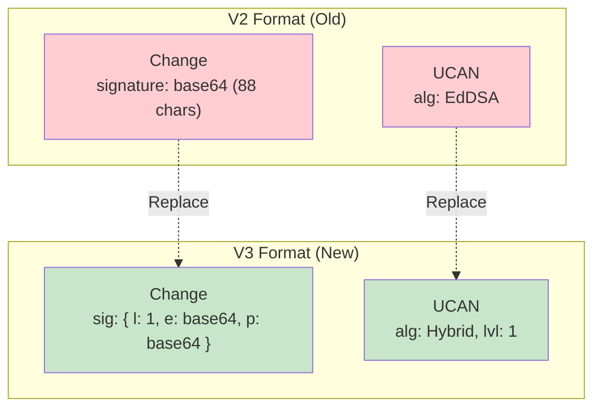
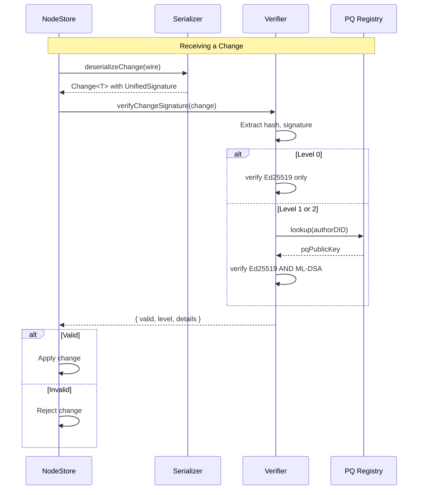

# 06: Wire Format Updates

> Update Change<T> and UCAN wire formats for multi-level signatures.

**Duration:** 5 days
**Dependencies:** [05-identity-upgrade.md](./05-identity-upgrade.md)
**Package:** `packages/sync/`, `packages/identity/`

## Overview

This step updates the wire formats for `Change<T>` (NodeStore mutations) and UCAN tokens to support multi-level signatures. Since xNet is prerelease, we replace the v2 format entirely - no backward compatibility needed.



## Implementation

### 1. Change<T> Wire Format V3

```typescript
// packages/sync/src/serializers/change-serializer.ts

import {
  type SecurityLevel,
  type UnifiedSignature,
  encodeSignature,
  decodeSignature,
  type SignatureWire
} from '@xnet/crypto'
import { encodeBase64, decodeBase64 } from '@xnet/crypto'

/**
 * V3 wire format for Change<T> with multi-level signatures.
 *
 * This replaces the V2 format entirely - no backward compatibility.
 */
export interface ChangeWireV3 {
  /** Wire format version */
  v: 3

  /** Change ID */
  i: string

  /** Change type */
  t: 'create' | 'update' | 'delete' | 'restore'

  /** Payload (properties) */
  p: Record<string, unknown>

  /** Content hash (BLAKE3) */
  h: string

  /** Parent hash (null for first change) */
  ph: string | null

  /** Author DID */
  a: string

  /**
   * Multi-level signature.
   * - l: security level (0, 1, or 2)
   * - e: Ed25519 signature (base64) - present at Level 0 and 1
   * - p: ML-DSA signature (base64) - present at Level 1 and 2
   */
  sig: SignatureWire

  /** Wall clock time (ms since epoch) */
  w: number

  /** Lamport timestamp */
  l: {
    /** Lamport counter */
    c: number
    /** Node ID */
    n: string
  }

  /** Schema ID (optional) */
  sc?: string

  /** Batch ID for grouped changes (optional) */
  b?: string
}

/**
 * Internal Change<T> type with typed signature.
 */
export interface Change<T = Record<string, unknown>> {
  id: string
  type: 'create' | 'update' | 'delete' | 'restore'
  payload: T
  hash: string
  parentHash: string | null
  authorDID: string
  signature: UnifiedSignature
  wallTime: number
  lamport: {
    time: number
    node: string
  }
  schemaId?: string
  batchId?: string
}
```

### 2. Change Serialization

```typescript
// packages/sync/src/serializers/change-serializer.ts (continued)

/**
 * Serialize a Change to V3 wire format.
 */
export function serializeChange<T>(change: Change<T>): ChangeWireV3 {
  return {
    v: 3,
    i: change.id,
    t: change.type,
    p: change.payload as Record<string, unknown>,
    h: change.hash,
    ph: change.parentHash,
    a: change.authorDID,
    sig: encodeSignature(change.signature),
    w: change.wallTime,
    l: {
      c: change.lamport.time,
      n: change.lamport.node
    },
    sc: change.schemaId,
    b: change.batchId
  }
}

/**
 * Deserialize a Change from V3 wire format.
 *
 * Note: V2 format is no longer supported. Users must clear their database.
 */
export function deserializeChange<T>(wire: ChangeWireV3): Change<T> {
  if (wire.v !== 3) {
    throw new Error(
      `Unsupported wire format version: ${wire.v}. Clear your database and start fresh.`
    )
  }

  return {
    id: wire.i,
    type: wire.t,
    payload: wire.p as T,
    hash: wire.h,
    parentHash: wire.ph,
    authorDID: wire.a,
    signature: decodeSignature(wire.sig),
    wallTime: wire.w,
    lamport: {
      time: wire.l.c,
      node: wire.l.n
    },
    schemaId: wire.sc,
    batchId: wire.b
  }
}
```

### 3. Change Signing

```typescript
// packages/sync/src/signing/sign-change.ts

import {
  hybridSign,
  hash,
  type SecurityLevel,
  type UnifiedSignature,
  DEFAULT_SECURITY_LEVEL
} from '@xnet/crypto'
import type { HybridKeyBundle } from '@xnet/identity'
import type { Change } from '../serializers/change-serializer'
import { canonicalHash } from '../hashing'

/**
 * Options for signing a change.
 */
export interface SignChangeOptions {
  /** Security level (default: 1 for hybrid) */
  level?: SecurityLevel
}

/**
 * Create a signed change.
 *
 * @param payload - The change payload
 * @param type - Change type
 * @param parentHash - Hash of parent change (null for first)
 * @param keyBundle - Key bundle for signing
 * @param options - Signing options
 */
export function createSignedChange<T>(
  payload: T,
  type: Change<T>['type'],
  parentHash: string | null,
  keyBundle: HybridKeyBundle,
  lamport: { time: number; node: string },
  options: SignChangeOptions = {}
): Change<T> {
  const { level = DEFAULT_SECURITY_LEVEL } = options

  const id = generateChangeId()
  const wallTime = Date.now()

  // Create unsigned change for hashing
  const unsignedChange = {
    id,
    type,
    payload,
    parentHash,
    authorDID: keyBundle.identity.did,
    wallTime,
    lamport
  }

  // Compute content hash
  const changeHash = canonicalHash(unsignedChange)

  // Sign the hash
  const hashBytes = new TextEncoder().encode(changeHash)
  const signature = hybridSign(
    hashBytes,
    {
      ed25519: keyBundle.signingKey,
      mlDsa: keyBundle.pqSigningKey
    },
    level
  )

  return {
    id,
    type,
    payload,
    hash: changeHash,
    parentHash,
    authorDID: keyBundle.identity.did,
    signature,
    wallTime,
    lamport
  }
}

/**
 * Verify a change signature.
 */
export async function verifyChangeSignature<T>(
  change: Change<T>,
  publicKeys: { ed25519: Uint8Array; mlDsa?: Uint8Array },
  options: { minLevel?: SecurityLevel; policy?: 'strict' | 'permissive' } = {}
): Promise<{ valid: boolean; level: SecurityLevel; details: unknown }> {
  const { hybridVerify } = await import('@xnet/crypto')

  const hashBytes = new TextEncoder().encode(change.hash)

  return hybridVerify(hashBytes, change.signature, publicKeys, options)
}

function generateChangeId(): string {
  const bytes = crypto.getRandomValues(new Uint8Array(16))
  return Array.from(bytes)
    .map((b) => b.toString(16).padStart(2, '0'))
    .join('')
}
```

### 4. UCAN Token Format

```typescript
// packages/identity/src/ucan/types.ts

import type { SecurityLevel } from '@xnet/crypto'
import type { DID } from '../types'

/**
 * UCAN header with hybrid signature support.
 */
export interface UCANHeader {
  /** Algorithm: 'EdDSA' (Level 0), 'Hybrid' (Level 1), or 'ML-DSA-65' (Level 2) */
  alg: 'EdDSA' | 'Hybrid' | 'ML-DSA-65'

  /** Token type (always JWT) */
  typ: 'JWT'

  /** Security level (always present in new format) */
  lvl: SecurityLevel
}

/**
 * UCAN payload (unchanged from before).
 */
export interface UCANPayload {
  /** Issuer DID */
  iss: DID

  /** Audience DID */
  aud: DID

  /** Expiration time (Unix seconds) */
  exp: number

  /** Not before time (Unix seconds) */
  nbf?: number

  /** Nonce for uniqueness */
  nnc?: string

  /** Capabilities granted */
  cap: Record<string, unknown>

  /** Proof chain (parent UCANs) */
  prf?: string[]
}

/**
 * Complete UCAN token.
 */
export interface UCAN {
  header: UCANHeader
  payload: UCANPayload
  signature: Uint8Array
  /** For hybrid signatures, the ML-DSA component */
  pqSignature?: Uint8Array
}
```

### 5. UCAN Creation

```typescript
// packages/identity/src/ucan/create.ts

import {
  hybridSign,
  encodeBase64,
  decodeBase64,
  type SecurityLevel,
  DEFAULT_SECURITY_LEVEL
} from '@xnet/crypto'
import type { HybridKeyBundle, DID } from '../types'
import type { UCAN, UCANHeader, UCANPayload } from './types'

/**
 * Options for creating a UCAN.
 */
export interface CreateUCANOptions {
  /** Issuer's key bundle */
  issuer: HybridKeyBundle

  /** Audience DID */
  audience: DID

  /** Expiration time (Unix seconds) */
  expiration: number

  /** Capabilities to grant */
  capabilities: Record<string, unknown>

  /** Not before time (Unix seconds) */
  notBefore?: number

  /** Proof chain */
  proofs?: string[]

  /** Security level (default: 1 for hybrid) */
  level?: SecurityLevel
}

/**
 * Create a new UCAN token with hybrid signature.
 */
export function createUCAN(options: CreateUCANOptions): UCAN {
  const {
    issuer,
    audience,
    expiration,
    capabilities,
    notBefore,
    proofs,
    level = DEFAULT_SECURITY_LEVEL
  } = options

  // Determine algorithm based on level
  const alg: UCANHeader['alg'] = level === 0 ? 'EdDSA' : level === 1 ? 'Hybrid' : 'ML-DSA-65'

  const header: UCANHeader = {
    alg,
    typ: 'JWT',
    lvl: level
  }

  const payload: UCANPayload = {
    iss: issuer.identity.did,
    aud: audience,
    exp: expiration,
    nbf: notBefore,
    nnc: generateNonce(),
    cap: capabilities,
    prf: proofs
  }

  // Encode header and payload
  const headerB64 = base64UrlEncode(JSON.stringify(header))
  const payloadB64 = base64UrlEncode(JSON.stringify(payload))
  const signingInput = `${headerB64}.${payloadB64}`
  const signingBytes = new TextEncoder().encode(signingInput)

  // Sign with hybrid
  const sig = hybridSign(
    signingBytes,
    {
      ed25519: issuer.signingKey,
      mlDsa: issuer.pqSigningKey
    },
    level
  )

  return {
    header,
    payload,
    signature: sig.ed25519 ?? new Uint8Array(0),
    pqSignature: sig.mlDsa
  }
}

/**
 * Encode UCAN to JWT string format.
 *
 * For Level 0: header.payload.ed25519Sig
 * For Level 1: header.payload.ed25519Sig:mlDsaSig (colon-separated)
 * For Level 2: header.payload.mlDsaSig
 */
export function encodeUCAN(ucan: UCAN): string {
  const headerB64 = base64UrlEncode(JSON.stringify(ucan.header))
  const payloadB64 = base64UrlEncode(JSON.stringify(ucan.payload))

  let signatureB64: string

  switch (ucan.header.lvl) {
    case 0:
      signatureB64 = base64UrlEncode(ucan.signature)
      break
    case 1:
      // Colon-separated for hybrid
      signatureB64 = `${base64UrlEncode(ucan.signature)}:${base64UrlEncode(ucan.pqSignature!)}`
      break
    case 2:
      signatureB64 = base64UrlEncode(ucan.pqSignature!)
      break
  }

  return `${headerB64}.${payloadB64}.${signatureB64}`
}

function generateNonce(): string {
  const bytes = crypto.getRandomValues(new Uint8Array(12))
  return base64UrlEncode(bytes)
}

function base64UrlEncode(data: string | Uint8Array): string {
  const bytes = typeof data === 'string' ? new TextEncoder().encode(data) : data
  const base64 = encodeBase64(bytes)
  return base64.replace(/\+/g, '-').replace(/\//g, '_').replace(/=/g, '')
}
```

### 6. UCAN Verification

```typescript
// packages/identity/src/ucan/verify.ts

import { hybridVerify, type SecurityLevel, type UnifiedSignature } from '@xnet/crypto'
import { parseDID } from '../did'
import type { PQKeyRegistry } from '../pq-registry'
import type { UCAN, UCANHeader, UCANPayload } from './types'

/**
 * Result of UCAN verification.
 */
export interface UCANVerificationResult {
  valid: boolean
  level: SecurityLevel
  errors: string[]
  expired: boolean
  notYetValid: boolean
}

/**
 * Options for UCAN verification.
 */
export interface VerifyUCANOptions {
  /** PQ key registry for looking up ML-DSA public keys */
  registry?: PQKeyRegistry

  /** Current time for expiration check (default: now) */
  now?: number

  /** Minimum acceptable security level */
  minLevel?: SecurityLevel

  /** Verification policy */
  policy?: 'strict' | 'permissive'
}

/**
 * Parse a UCAN JWT string.
 */
export function parseUCAN(token: string): UCAN {
  const parts = token.split('.')
  if (parts.length !== 3) {
    throw new Error('Invalid UCAN format: expected 3 parts')
  }

  const [headerB64, payloadB64, signatureB64] = parts

  const header = JSON.parse(base64UrlDecode(headerB64)) as UCANHeader
  const payload = JSON.parse(base64UrlDecode(payloadB64)) as UCANPayload

  let signature: Uint8Array
  let pqSignature: Uint8Array | undefined

  switch (header.lvl) {
    case 0:
      signature = base64UrlDecodeBytes(signatureB64)
      break
    case 1: {
      const sigParts = signatureB64.split(':')
      if (sigParts.length !== 2) {
        throw new Error('Invalid hybrid signature format')
      }
      signature = base64UrlDecodeBytes(sigParts[0])
      pqSignature = base64UrlDecodeBytes(sigParts[1])
      break
    }
    case 2:
      signature = new Uint8Array(0)
      pqSignature = base64UrlDecodeBytes(signatureB64)
      break
  }

  return { header, payload, signature, pqSignature }
}

/**
 * Verify a UCAN token.
 */
export async function verifyUCAN(
  ucan: UCAN,
  options: VerifyUCANOptions = {}
): Promise<UCANVerificationResult> {
  const { registry, now = Date.now() / 1000, minLevel = 0, policy = 'strict' } = options
  const errors: string[] = []

  // Check minimum level
  if (ucan.header.lvl < minLevel) {
    errors.push(`Security level ${ucan.header.lvl} below minimum ${minLevel}`)
    return { valid: false, level: ucan.header.lvl, errors, expired: false, notYetValid: false }
  }

  // Check expiration
  const expired = ucan.payload.exp < now
  if (expired) {
    errors.push('Token has expired')
  }

  // Check not-before
  const notYetValid = ucan.payload.nbf !== undefined && ucan.payload.nbf > now
  if (notYetValid) {
    errors.push('Token is not yet valid')
  }

  // Get issuer's public keys
  const ed25519PublicKey = parseDID(ucan.payload.iss)
  let pqPublicKey: Uint8Array | undefined

  if (ucan.header.lvl >= 1 && registry) {
    pqPublicKey = (await registry.lookup(ucan.payload.iss)) ?? undefined
    if (!pqPublicKey && ucan.header.lvl >= 1 && policy === 'strict') {
      errors.push('No PQ public key found for issuer')
    }
  }

  // Reconstruct signing input
  const headerB64 = base64UrlEncode(JSON.stringify(ucan.header))
  const payloadB64 = base64UrlEncode(JSON.stringify(ucan.payload))
  const signingInput = `${headerB64}.${payloadB64}`
  const signingBytes = new TextEncoder().encode(signingInput)

  // Construct UnifiedSignature for verification
  const sig: UnifiedSignature = {
    level: ucan.header.lvl,
    ed25519: ucan.signature.length > 0 ? ucan.signature : undefined,
    mlDsa: ucan.pqSignature
  }

  // Verify signature
  const result = hybridVerify(
    signingBytes,
    sig,
    { ed25519: ed25519PublicKey, mlDsa: pqPublicKey },
    { minLevel, policy }
  )

  if (!result.valid) {
    if (result.details.ed25519 && !result.details.ed25519.verified) {
      errors.push(result.details.ed25519.error ?? 'Ed25519 verification failed')
    }
    if (result.details.mlDsa && !result.details.mlDsa.verified) {
      errors.push(result.details.mlDsa.error ?? 'ML-DSA verification failed')
    }
  }

  return {
    valid: errors.length === 0,
    level: ucan.header.lvl,
    errors,
    expired,
    notYetValid
  }
}

function base64UrlDecode(str: string): string {
  const base64 = str.replace(/-/g, '+').replace(/_/g, '/')
  const pad = (4 - (base64.length % 4)) % 4
  const padded = base64 + '='.repeat(pad)
  return atob(padded)
}

function base64UrlDecodeBytes(str: string): Uint8Array {
  const { decodeBase64 } = require('@xnet/crypto')
  const base64 = str.replace(/-/g, '+').replace(/_/g, '/')
  const pad = (4 - (base64.length % 4)) % 4
  const padded = base64 + '='.repeat(pad)
  return decodeBase64(padded)
}

function base64UrlEncode(data: string | Uint8Array): string {
  const { encodeBase64 } = require('@xnet/crypto')
  const bytes = typeof data === 'string' ? new TextEncoder().encode(data) : data
  const base64 = encodeBase64(bytes)
  return base64.replace(/\+/g, '-').replace(/\//g, '_').replace(/=/g, '')
}
```

### 7. Update Package Exports

```typescript
// packages/sync/src/index.ts

export type { Change, ChangeWireV3 } from './serializers/change-serializer'
export { serializeChange, deserializeChange } from './serializers/change-serializer'
export type { SignChangeOptions } from './signing/sign-change'
export { createSignedChange, verifyChangeSignature } from './signing/sign-change'

// packages/identity/src/index.ts

export type { UCAN, UCANHeader, UCANPayload, UCANVerificationResult } from './ucan/types'
export type { CreateUCANOptions, VerifyUCANOptions } from './ucan'
export { createUCAN, encodeUCAN, parseUCAN, verifyUCAN } from './ucan'
```

## Wire Format Size Comparison

| Format                    | Level 0   | Level 1      | Level 2      |
| ------------------------- | --------- | ------------ | ------------ |
| V2 signature field        | 88 chars  | N/A          | N/A          |
| V3 signature field        | ~92 chars | ~4,500 chars | ~4,400 chars |
| V3 overhead (100 changes) | 9.2 KB    | 450 KB       | 440 KB       |

## Verification Flow Diagram



## Tests

```typescript
// packages/sync/src/serializers/change-serializer.test.ts

import { describe, it, expect } from 'vitest'
import { serializeChange, deserializeChange, type Change } from './change-serializer'
import { createKeyBundle, signWithBundle } from '@xnet/identity'
import { hybridSign } from '@xnet/crypto'

describe('Change Serialization', () => {
  it('serializes and deserializes Level 0 change', () => {
    const bundle = createKeyBundle({ includePQ: false })
    const change: Change = {
      id: 'test-123',
      type: 'create',
      payload: { title: 'Hello' },
      hash: 'hash-123',
      parentHash: null,
      authorDID: bundle.identity.did,
      signature: hybridSign(new Uint8Array(32), { ed25519: bundle.signingKey }, 0),
      wallTime: Date.now(),
      lamport: { time: 1, node: 'node-1' }
    }

    const wire = serializeChange(change)
    expect(wire.v).toBe(3)
    expect(wire.sig.l).toBe(0)
    expect(wire.sig.e).toBeDefined()
    expect(wire.sig.p).toBeUndefined()

    const restored = deserializeChange(wire)
    expect(restored.id).toBe(change.id)
    expect(restored.signature.level).toBe(0)
  })

  it('serializes and deserializes Level 1 change', () => {
    const bundle = createKeyBundle()
    const change: Change = {
      id: 'test-456',
      type: 'update',
      payload: { count: 42 },
      hash: 'hash-456',
      parentHash: 'hash-123',
      authorDID: bundle.identity.did,
      signature: hybridSign(
        new Uint8Array(32),
        { ed25519: bundle.signingKey, mlDsa: bundle.pqSigningKey },
        1
      ),
      wallTime: Date.now(),
      lamport: { time: 2, node: 'node-1' }
    }

    const wire = serializeChange(change)
    expect(wire.sig.l).toBe(1)
    expect(wire.sig.e).toBeDefined()
    expect(wire.sig.p).toBeDefined()

    const restored = deserializeChange(wire)
    expect(restored.signature.level).toBe(1)
    expect(restored.signature.ed25519).toBeDefined()
    expect(restored.signature.mlDsa).toBeDefined()
  })

  it('rejects V2 format', () => {
    const v2Wire = {
      v: 2,
      i: 'id',
      t: 'create',
      p: {},
      h: 'h',
      ph: null,
      a: 'did',
      s: 'sig',
      w: 1,
      l: { c: 1, n: 'n' }
    }

    expect(() => deserializeChange(v2Wire as any)).toThrow('Unsupported wire format')
  })
})

// packages/identity/src/ucan/ucan.test.ts

describe('UCAN with Hybrid Signatures', () => {
  it('creates and verifies Level 0 UCAN', async () => {
    const issuer = createKeyBundle({ includePQ: false })
    const audience = createKeyBundle().identity.did

    const ucan = createUCAN({
      issuer,
      audience,
      expiration: Math.floor(Date.now() / 1000) + 3600,
      capabilities: { 'xnet/*': {} },
      level: 0
    })

    expect(ucan.header.alg).toBe('EdDSA')
    expect(ucan.header.lvl).toBe(0)

    const token = encodeUCAN(ucan)
    const parsed = parseUCAN(token)

    const result = await verifyUCAN(parsed)
    expect(result.valid).toBe(true)
    expect(result.level).toBe(0)
  })

  it('creates and verifies Level 1 UCAN', async () => {
    const issuer = createKeyBundle()
    const audience = createKeyBundle().identity.did
    const registry = new MemoryPQKeyRegistry()

    // Register issuer's PQ key
    const attestation = createPQKeyAttestation(
      issuer.identity.did,
      issuer.signingKey,
      issuer.pqPublicKey!,
      issuer.pqSigningKey!
    )
    await registry.store(attestation)

    const ucan = createUCAN({
      issuer,
      audience,
      expiration: Math.floor(Date.now() / 1000) + 3600,
      capabilities: { 'xnet/*': {} },
      level: 1
    })

    expect(ucan.header.alg).toBe('Hybrid')
    expect(ucan.header.lvl).toBe(1)

    const token = encodeUCAN(ucan)
    expect(token.split('.')[2]).toContain(':') // Colon-separated sigs

    const parsed = parseUCAN(token)
    const result = await verifyUCAN(parsed, { registry })

    expect(result.valid).toBe(true)
    expect(result.level).toBe(1)
  })

  it('rejects expired UCAN', async () => {
    const issuer = createKeyBundle({ includePQ: false })

    const ucan = createUCAN({
      issuer,
      audience: 'did:key:z6Mktest',
      expiration: Math.floor(Date.now() / 1000) - 1, // Already expired
      capabilities: {},
      level: 0
    })

    const result = await verifyUCAN(ucan)

    expect(result.valid).toBe(false)
    expect(result.expired).toBe(true)
  })

  it('respects minLevel option', async () => {
    const issuer = createKeyBundle({ includePQ: false })

    const ucan = createUCAN({
      issuer,
      audience: 'did:key:z6Mktest',
      expiration: Math.floor(Date.now() / 1000) + 3600,
      capabilities: {},
      level: 0
    })

    const result = await verifyUCAN(ucan, { minLevel: 1 })

    expect(result.valid).toBe(false)
    expect(result.errors).toContain('Security level 0 below minimum 1')
  })
})
```

## Checklist

- [x] Define `ChangeWireV3` type with multi-level signature
- [x] Implement `serializeChange()` for V3 format
- [x] Implement `deserializeChange()` for V3 format
- [x] V2 format still supported for backward compat (V3 is default)
- [ ] Implement `createSignedChange()` with hybrid signing (deferred to Phase 7)
- [ ] Implement `verifyChangeSignature()` with hybrid verification (deferred to Phase 7)
- [ ] Define `UCANHeader` with lvl field (deferred - existing UCAN works)
- [ ] Implement `createUCAN()` with hybrid signatures (deferred)
- [ ] Implement `encodeUCAN()` with level-specific format (deferred)
- [ ] Implement `parseUCAN()` for all levels (deferred)
- [ ] Implement `verifyUCAN()` with registry integration (deferred)
- [x] Update serializer registry for V3
- [x] Write unit tests for V3 serializer (37 tests in serializers.test.ts)
- [ ] Test integration with NodeStore (future)

---

[Back to README](./README.md) | [Previous: Identity Upgrade](./05-identity-upgrade.md) | [Next: Yjs Envelope ->](./07-yjs-envelope.md)
