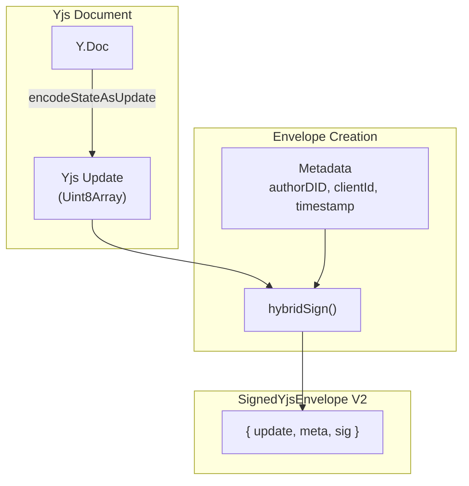

# 07: Yjs Envelope Updates

> Update SignedYjsEnvelope for multi-level signatures in rich text sync.

**Duration:** 3 days
**Dependencies:** [06-wire-format.md](./06-wire-format.md)
**Package:** `packages/sync/`

## Overview

The `SignedYjsEnvelope` wraps Yjs CRDT updates with signatures for authentication and anti-tampering. This step updates the envelope to use multi-level signatures, matching the Change<T> format.



## Implementation

### 1. Envelope Types

```typescript
// packages/sync/src/yjs/envelope.ts

import type { SecurityLevel, UnifiedSignature, SignatureWire } from '@xnet/crypto'
import type { DID } from '@xnet/identity'

/**
 * Signed envelope for Yjs updates.
 *
 * This wraps a Yjs update with:
 * - Author identity (DID)
 * - Client ID binding (prevents replay attacks)
 * - Timestamp for ordering
 * - Multi-level signature
 */
export interface SignedYjsEnvelope {
  /** Wire format version */
  v: 2

  /** The Yjs update bytes */
  update: Uint8Array

  /** Envelope metadata */
  meta: {
    /** Author's DID */
    authorDID: DID

    /** Yjs client ID (bound to this session) */
    clientId: number

    /** Wall clock timestamp (ms since epoch) */
    timestamp: number

    /** Document ID this update applies to */
    docId: string
  }

  /** Multi-level signature over (update + meta) */
  signature: UnifiedSignature
}

/**
 * Wire format for SignedYjsEnvelope.
 */
export interface SignedYjsEnvelopeWire {
  v: 2
  u: string // base64-encoded update
  m: {
    a: string // authorDID
    c: number // clientId
    t: number // timestamp
    d: string // docId
  }
  s: SignatureWire
}
```

### 2. Envelope Creation

```typescript
// packages/sync/src/yjs/envelope.ts (continued)

import {
  hybridSign,
  encodeBase64,
  decodeBase64,
  encodeSignature,
  decodeSignature,
  hash,
  type SecurityLevel,
  DEFAULT_SECURITY_LEVEL
} from '@xnet/crypto'
import type { HybridKeyBundle } from '@xnet/identity'

/**
 * Options for creating a signed envelope.
 */
export interface CreateEnvelopeOptions {
  /** Security level (default: 1 for hybrid) */
  level?: SecurityLevel
}

/**
 * Create a signed Yjs envelope.
 *
 * @param update - The Yjs update bytes
 * @param docId - Document ID this update applies to
 * @param clientId - Yjs client ID for this session
 * @param keyBundle - Key bundle for signing
 * @param options - Signing options
 */
export function signYjsUpdate(
  update: Uint8Array,
  docId: string,
  clientId: number,
  keyBundle: HybridKeyBundle,
  options: CreateEnvelopeOptions = {}
): SignedYjsEnvelope {
  const { level = DEFAULT_SECURITY_LEVEL } = options

  const meta = {
    authorDID: keyBundle.identity.did,
    clientId,
    timestamp: Date.now(),
    docId
  }

  // Create signing input: hash of (update + canonical meta)
  const metaBytes = new TextEncoder().encode(JSON.stringify(meta))
  const combined = new Uint8Array(update.length + metaBytes.length)
  combined.set(update, 0)
  combined.set(metaBytes, update.length)
  const signingHash = hash(combined, 'blake3')

  // Sign with hybrid
  const signature = hybridSign(
    signingHash,
    {
      ed25519: keyBundle.signingKey,
      mlDsa: keyBundle.pqSigningKey
    },
    level
  )

  return {
    v: 2,
    update,
    meta,
    signature
  }
}

/**
 * Sign multiple updates in a batch.
 */
export function signYjsUpdateBatch(
  updates: Uint8Array[],
  docId: string,
  clientId: number,
  keyBundle: HybridKeyBundle,
  options: CreateEnvelopeOptions = {}
): SignedYjsEnvelope[] {
  return updates.map((update) => signYjsUpdate(update, docId, clientId, keyBundle, options))
}
```

### 3. Envelope Verification

```typescript
// packages/sync/src/yjs/envelope.ts (continued)

import { hybridVerify, type VerificationResult, type VerificationOptions } from '@xnet/crypto'
import { parseDID, type PQKeyRegistry } from '@xnet/identity'

/**
 * Result of envelope verification.
 */
export interface EnvelopeVerificationResult {
  valid: boolean
  level: SecurityLevel
  errors: string[]
  authorDID: DID
  clientId: number
}

/**
 * Options for envelope verification.
 */
export interface VerifyEnvelopeOptions extends VerificationOptions {
  /** PQ key registry for Level 1/2 verification */
  registry?: PQKeyRegistry

  /** Expected document ID (optional, for extra validation) */
  expectedDocId?: string

  /** Maximum age in ms (optional, for freshness check) */
  maxAge?: number
}

/**
 * Verify a signed Yjs envelope.
 */
export async function verifyYjsEnvelope(
  envelope: SignedYjsEnvelope,
  options: VerifyEnvelopeOptions = {}
): Promise<EnvelopeVerificationResult> {
  const { registry, expectedDocId, maxAge, minLevel = 0, policy = 'strict' } = options
  const errors: string[] = []

  // Check document ID if specified
  if (expectedDocId && envelope.meta.docId !== expectedDocId) {
    errors.push(`Document ID mismatch: expected ${expectedDocId}, got ${envelope.meta.docId}`)
  }

  // Check freshness if specified
  if (maxAge) {
    const age = Date.now() - envelope.meta.timestamp
    if (age > maxAge) {
      errors.push(`Envelope too old: ${age}ms > ${maxAge}ms`)
    }
  }

  // Get public keys
  const ed25519PublicKey = parseDID(envelope.meta.authorDID)
  let pqPublicKey: Uint8Array | undefined

  if (envelope.signature.level >= 1 && registry) {
    pqPublicKey = (await registry.lookup(envelope.meta.authorDID)) ?? undefined
  }

  // Reconstruct signing input
  const metaBytes = new TextEncoder().encode(JSON.stringify(envelope.meta))
  const combined = new Uint8Array(envelope.update.length + metaBytes.length)
  combined.set(envelope.update, 0)
  combined.set(metaBytes, envelope.update.length)
  const signingHash = hash(combined, 'blake3')

  // Verify signature
  const result = hybridVerify(
    signingHash,
    envelope.signature,
    { ed25519: ed25519PublicKey, mlDsa: pqPublicKey },
    { minLevel, policy }
  )

  if (!result.valid) {
    if (result.details.ed25519?.error) errors.push(result.details.ed25519.error)
    if (result.details.mlDsa?.error) errors.push(result.details.mlDsa.error)
  }

  return {
    valid: errors.length === 0,
    level: envelope.signature.level,
    errors,
    authorDID: envelope.meta.authorDID,
    clientId: envelope.meta.clientId
  }
}

/**
 * Quick verification returning just boolean.
 */
export async function verifyYjsEnvelopeQuick(
  envelope: SignedYjsEnvelope,
  options: VerifyEnvelopeOptions = {}
): Promise<boolean> {
  const result = await verifyYjsEnvelope(envelope, options)
  return result.valid
}
```

### 4. Envelope Serialization

```typescript
// packages/sync/src/yjs/envelope.ts (continued)

/**
 * Serialize envelope to wire format.
 */
export function serializeYjsEnvelope(envelope: SignedYjsEnvelope): SignedYjsEnvelopeWire {
  return {
    v: 2,
    u: encodeBase64(envelope.update),
    m: {
      a: envelope.meta.authorDID,
      c: envelope.meta.clientId,
      t: envelope.meta.timestamp,
      d: envelope.meta.docId
    },
    s: encodeSignature(envelope.signature)
  }
}

/**
 * Deserialize envelope from wire format.
 */
export function deserializeYjsEnvelope(wire: SignedYjsEnvelopeWire): SignedYjsEnvelope {
  if (wire.v !== 2) {
    throw new Error(`Unsupported envelope version: ${wire.v}. Clear your database and start fresh.`)
  }

  return {
    v: 2,
    update: decodeBase64(wire.u),
    meta: {
      authorDID: wire.m.a as DID,
      clientId: wire.m.c,
      timestamp: wire.m.t,
      docId: wire.m.d
    },
    signature: decodeSignature(wire.s)
  }
}

/**
 * Calculate envelope size in bytes.
 */
export function envelopeSize(envelope: SignedYjsEnvelope): number {
  let size = envelope.update.length
  size += JSON.stringify(envelope.meta).length
  if (envelope.signature.ed25519) size += envelope.signature.ed25519.length
  if (envelope.signature.mlDsa) size += envelope.signature.mlDsa.length
  return size
}
```

### 5. Client ID Attestation

```typescript
// packages/sync/src/yjs/client-attestation.ts

import { hybridSign, hybridVerify, type SecurityLevel, DEFAULT_SECURITY_LEVEL } from '@xnet/crypto'
import { parseDID, type HybridKeyBundle, type DID, type PQKeyRegistry } from '@xnet/identity'

/**
 * Attestation binding a Yjs client ID to a DID.
 *
 * This prevents an attacker from claiming updates with a different client ID.
 */
export interface ClientIdAttestation {
  /** The DID */
  did: DID

  /** The Yjs client ID */
  clientId: number

  /** When this binding was created */
  timestamp: number

  /** Expiration (optional) */
  expiresAt?: number

  /** Multi-level signature */
  signature: UnifiedSignature
}

/**
 * Create a client ID attestation.
 */
export function createClientIdAttestation(
  clientId: number,
  keyBundle: HybridKeyBundle,
  options: { expiresInMs?: number; level?: SecurityLevel } = {}
): ClientIdAttestation {
  const { expiresInMs, level = DEFAULT_SECURITY_LEVEL } = options

  const timestamp = Date.now()
  const expiresAt = expiresInMs ? timestamp + expiresInMs : undefined

  const payload = { did: keyBundle.identity.did, clientId, timestamp, expiresAt }
  const payloadBytes = new TextEncoder().encode(JSON.stringify(payload))

  const signature = hybridSign(
    payloadBytes,
    {
      ed25519: keyBundle.signingKey,
      mlDsa: keyBundle.pqSigningKey
    },
    level
  )

  return {
    did: keyBundle.identity.did,
    clientId,
    timestamp,
    expiresAt,
    signature
  }
}

/**
 * Verify a client ID attestation.
 */
export async function verifyClientIdAttestation(
  attestation: ClientIdAttestation,
  registry?: PQKeyRegistry
): Promise<{ valid: boolean; expired: boolean; errors: string[] }> {
  const errors: string[] = []

  // Check expiration
  const expired = attestation.expiresAt !== undefined && Date.now() > attestation.expiresAt
  if (expired) {
    errors.push('Attestation has expired')
  }

  // Get public keys
  const ed25519PublicKey = parseDID(attestation.did)
  let pqPublicKey: Uint8Array | undefined

  if (attestation.signature.level >= 1 && registry) {
    pqPublicKey = (await registry.lookup(attestation.did)) ?? undefined
  }

  // Verify signature
  const payload = {
    did: attestation.did,
    clientId: attestation.clientId,
    timestamp: attestation.timestamp,
    expiresAt: attestation.expiresAt
  }
  const payloadBytes = new TextEncoder().encode(JSON.stringify(payload))

  const result = hybridVerify(payloadBytes, attestation.signature, {
    ed25519: ed25519PublicKey,
    mlDsa: pqPublicKey
  })

  if (!result.valid) {
    errors.push('Signature verification failed')
  }

  return { valid: errors.length === 0, expired, errors }
}
```

### 6. Update Package Exports

```typescript
// packages/sync/src/index.ts

export type {
  SignedYjsEnvelope,
  SignedYjsEnvelopeWire,
  CreateEnvelopeOptions,
  EnvelopeVerificationResult,
  VerifyEnvelopeOptions
} from './yjs/envelope'

export {
  signYjsUpdate,
  signYjsUpdateBatch,
  verifyYjsEnvelope,
  verifyYjsEnvelopeQuick,
  serializeYjsEnvelope,
  deserializeYjsEnvelope,
  envelopeSize
} from './yjs/envelope'

export type { ClientIdAttestation } from './yjs/client-attestation'
export { createClientIdAttestation, verifyClientIdAttestation } from './yjs/client-attestation'
```

## Size Impact

| Component                 | Level 0 | Level 1 | Level 2 |
| ------------------------- | ------- | ------- | ------- |
| Signature                 | 64 B    | ~3.4 KB | ~3.3 KB |
| Typical update (50 chars) | ~150 B  | ~3.5 KB | ~3.4 KB |
| Batch of 10 updates       | ~1.5 KB | ~35 KB  | ~34 KB  |

For high-frequency text editing, consider using Level 0 for real-time updates and Level 1 for periodic snapshots.

## Tests

```typescript
// packages/sync/src/yjs/envelope.test.ts

import { describe, it, expect } from 'vitest'
import * as Y from 'yjs'
import {
  signYjsUpdate,
  verifyYjsEnvelope,
  serializeYjsEnvelope,
  deserializeYjsEnvelope
} from './envelope'
import { createKeyBundle } from '@xnet/identity'
import { MemoryPQKeyRegistry, createPQKeyAttestation } from '@xnet/identity'

describe('SignedYjsEnvelope', () => {
  it('signs and verifies Level 0 update', async () => {
    const bundle = createKeyBundle({ includePQ: false })
    const doc = new Y.Doc()
    doc.getText('content').insert(0, 'Hello')
    const update = Y.encodeStateAsUpdate(doc)

    const envelope = signYjsUpdate(update, 'doc-1', doc.clientID, bundle, { level: 0 })

    expect(envelope.signature.level).toBe(0)
    expect(envelope.signature.ed25519).toBeDefined()
    expect(envelope.signature.mlDsa).toBeUndefined()

    const result = await verifyYjsEnvelope(envelope)
    expect(result.valid).toBe(true)
    expect(result.level).toBe(0)
  })

  it('signs and verifies Level 1 update', async () => {
    const bundle = createKeyBundle()
    const registry = new MemoryPQKeyRegistry()

    // Register PQ key
    const attestation = createPQKeyAttestation(
      bundle.identity.did,
      bundle.signingKey,
      bundle.pqPublicKey!,
      bundle.pqSigningKey!
    )
    await registry.store(attestation)

    const doc = new Y.Doc()
    doc.getText('content').insert(0, 'Hello')
    const update = Y.encodeStateAsUpdate(doc)

    const envelope = signYjsUpdate(update, 'doc-1', doc.clientID, bundle, { level: 1 })

    expect(envelope.signature.level).toBe(1)
    expect(envelope.signature.ed25519).toBeDefined()
    expect(envelope.signature.mlDsa).toBeDefined()

    const result = await verifyYjsEnvelope(envelope, { registry })
    expect(result.valid).toBe(true)
    expect(result.level).toBe(1)
  })

  it('rejects tampered update', async () => {
    const bundle = createKeyBundle({ includePQ: false })
    const doc = new Y.Doc()
    doc.getText('content').insert(0, 'Hello')
    const update = Y.encodeStateAsUpdate(doc)

    const envelope = signYjsUpdate(update, 'doc-1', doc.clientID, bundle, { level: 0 })

    // Tamper with update
    envelope.update[0] ^= 0xff

    const result = await verifyYjsEnvelope(envelope)
    expect(result.valid).toBe(false)
  })

  it('serializes and deserializes envelope', () => {
    const bundle = createKeyBundle()
    const doc = new Y.Doc()
    doc.getText('content').insert(0, 'Test')
    const update = Y.encodeStateAsUpdate(doc)

    const envelope = signYjsUpdate(update, 'doc-1', doc.clientID, bundle)

    const wire = serializeYjsEnvelope(envelope)
    const restored = deserializeYjsEnvelope(wire)

    expect(restored.update).toEqual(envelope.update)
    expect(restored.meta).toEqual(envelope.meta)
    expect(restored.signature.level).toBe(envelope.signature.level)
  })

  it('enforces minLevel', async () => {
    const bundle = createKeyBundle({ includePQ: false })
    const update = new Uint8Array(10)

    const envelope = signYjsUpdate(update, 'doc-1', 123, bundle, { level: 0 })

    const result = await verifyYjsEnvelope(envelope, { minLevel: 1 })
    expect(result.valid).toBe(false)
  })

  it('checks document ID match', async () => {
    const bundle = createKeyBundle({ includePQ: false })
    const update = new Uint8Array(10)

    const envelope = signYjsUpdate(update, 'doc-1', 123, bundle, { level: 0 })

    const result = await verifyYjsEnvelope(envelope, { expectedDocId: 'doc-2' })
    expect(result.valid).toBe(false)
    expect(result.errors).toContain(expect.stringContaining('Document ID mismatch'))
  })

  it('checks freshness', async () => {
    const bundle = createKeyBundle({ includePQ: false })
    const update = new Uint8Array(10)

    const envelope = signYjsUpdate(update, 'doc-1', 123, bundle, { level: 0 })

    // Make envelope appear old
    envelope.meta.timestamp = Date.now() - 10000

    const result = await verifyYjsEnvelope(envelope, { maxAge: 5000 })
    expect(result.valid).toBe(false)
    expect(result.errors[0]).toContain('too old')
  })
})

describe('ClientIdAttestation', () => {
  it('creates and verifies attestation', async () => {
    const bundle = createKeyBundle()
    const registry = new MemoryPQKeyRegistry()

    // Register PQ key
    const pqAttestation = createPQKeyAttestation(
      bundle.identity.did,
      bundle.signingKey,
      bundle.pqPublicKey!,
      bundle.pqSigningKey!
    )
    await registry.store(pqAttestation)

    const attestation = createClientIdAttestation(12345, bundle)

    const result = await verifyClientIdAttestation(attestation, registry)
    expect(result.valid).toBe(true)
    expect(result.expired).toBe(false)
  })

  it('detects expired attestation', async () => {
    const bundle = createKeyBundle({ includePQ: false })

    const attestation = createClientIdAttestation(12345, bundle, {
      expiresInMs: -1000 // Already expired
    })

    const result = await verifyClientIdAttestation(attestation)
    expect(result.expired).toBe(true)
  })
})
```

## Checklist

- [ ] Define `SignedYjsEnvelope` type with UnifiedSignature
- [ ] Define `SignedYjsEnvelopeWire` wire format
- [ ] Implement `signYjsUpdate()` with multi-level signing
- [ ] Implement `signYjsUpdateBatch()` for batch operations
- [ ] Implement `verifyYjsEnvelope()` with registry lookup
- [ ] Implement `verifyYjsEnvelopeQuick()` convenience function
- [ ] Implement `serializeYjsEnvelope()` / `deserializeYjsEnvelope()`
- [ ] Implement `envelopeSize()` calculator
- [ ] Implement `ClientIdAttestation` type
- [ ] Implement `createClientIdAttestation()`
- [ ] Implement `verifyClientIdAttestation()`
- [ ] Add document ID validation option
- [ ] Add freshness (maxAge) validation option
- [ ] Update package exports
- [ ] Write unit tests (target: 25+ tests)
- [ ] Test with real Yjs documents

---

[Back to README](./README.md) | [Previous: Wire Format](./06-wire-format.md) | [Next: React Integration ->](./08-react-integration.md)
