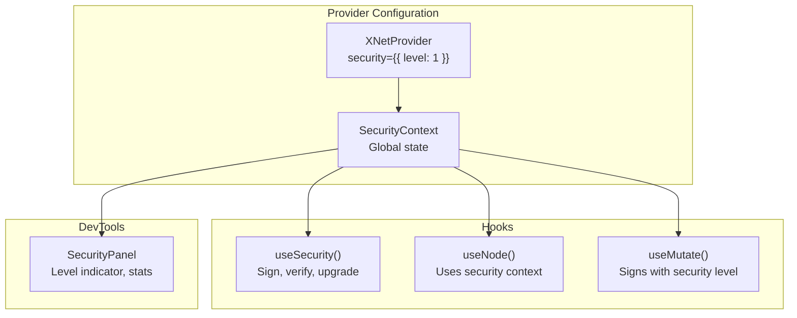

# 08: React Integration

> Add React hooks and provider configuration for security level management.

**Duration:** 3 days
**Dependencies:** [07-yjs-envelope.md](./07-yjs-envelope.md)
**Package:** `packages/react/`

## Overview

This step integrates multi-level cryptography into the React layer, providing:

- `SecurityContext` for global security configuration
- `useSecurity()` hook for security-aware operations
- `XNetProvider` configuration for default security level
- DevTools panel for security inspection



## Implementation

### 1. Security Context

```typescript
// packages/react/src/context/security-context.tsx

import { createContext, useContext, useState, useMemo, type ReactNode } from 'react'
import type { SecurityLevel, VerificationOptions } from '@xnet/crypto'
import type { PQKeyRegistry, HybridKeyBundle } from '@xnet/identity'
import { MemoryPQKeyRegistry } from '@xnet/identity'

/**
 * Security context state.
 */
export interface SecurityContextState {
  /** Current security level for new signatures */
  level: SecurityLevel

  /** Minimum level to accept during verification */
  minVerificationLevel: SecurityLevel

  /** Verification policy */
  verificationPolicy: 'strict' | 'permissive'

  /** PQ key registry */
  registry: PQKeyRegistry

  /** Current key bundle (if available) */
  keyBundle?: HybridKeyBundle
}

/**
 * Security context actions.
 */
export interface SecurityContextActions {
  /** Set the signing security level */
  setLevel: (level: SecurityLevel) => void

  /** Set the minimum verification level */
  setMinVerificationLevel: (level: SecurityLevel) => void

  /** Set the verification policy */
  setVerificationPolicy: (policy: 'strict' | 'permissive') => void

  /** Update the key bundle */
  setKeyBundle: (bundle: HybridKeyBundle | undefined) => void
}

export type SecurityContextValue = SecurityContextState & SecurityContextActions

const SecurityContext = createContext<SecurityContextValue | null>(null)

/**
 * Security provider props.
 */
export interface SecurityProviderProps {
  children: ReactNode

  /** Initial security level (default: 1) */
  level?: SecurityLevel

  /** Initial minimum verification level (default: 0) */
  minVerificationLevel?: SecurityLevel

  /** Initial verification policy (default: 'strict') */
  verificationPolicy?: 'strict' | 'permissive'

  /** PQ key registry (default: MemoryPQKeyRegistry) */
  registry?: PQKeyRegistry

  /** Initial key bundle */
  keyBundle?: HybridKeyBundle
}

/**
 * Security provider component.
 */
export function SecurityProvider({
  children,
  level: initialLevel = 1,
  minVerificationLevel: initialMinLevel = 0,
  verificationPolicy: initialPolicy = 'strict',
  registry: providedRegistry,
  keyBundle: initialBundle
}: SecurityProviderProps) {
  const [level, setLevel] = useState<SecurityLevel>(initialLevel)
  const [minVerificationLevel, setMinVerificationLevel] = useState<SecurityLevel>(initialMinLevel)
  const [verificationPolicy, setVerificationPolicy] = useState<'strict' | 'permissive'>(initialPolicy)
  const [keyBundle, setKeyBundle] = useState<HybridKeyBundle | undefined>(initialBundle)

  const registry = useMemo(
    () => providedRegistry ?? new MemoryPQKeyRegistry(),
    [providedRegistry]
  )

  const value = useMemo<SecurityContextValue>(
    () => ({
      level,
      minVerificationLevel,
      verificationPolicy,
      registry,
      keyBundle,
      setLevel,
      setMinVerificationLevel,
      setVerificationPolicy,
      setKeyBundle
    }),
    [level, minVerificationLevel, verificationPolicy, registry, keyBundle]
  )

  return <SecurityContext.Provider value={value}>{children}</SecurityContext.Provider>
}

/**
 * Hook to access security context.
 */
export function useSecurityContext(): SecurityContextValue {
  const context = useContext(SecurityContext)
  if (!context) {
    throw new Error('useSecurityContext must be used within SecurityProvider')
  }
  return context
}
```

### 2. useSecurity Hook

````typescript
// packages/react/src/hooks/useSecurity.ts

import { useCallback, useMemo } from 'react'
import {
  hybridSign,
  hybridVerify,
  type SecurityLevel,
  type UnifiedSignature,
  type VerificationResult
} from '@xnet/crypto'
import { parseDID, type DID } from '@xnet/identity'
import { useSecurityContext } from '../context/security-context'

/**
 * Options for useSecurity hook.
 */
export interface UseSecurityOptions {
  /** Override default security level */
  level?: SecurityLevel
}

/**
 * Return type for useSecurity hook.
 */
export interface UseSecurityResult {
  /** Current security level */
  level: SecurityLevel

  /** Whether the current key bundle supports PQ */
  hasPQKeys: boolean

  /** Maximum level supported by current keys */
  maxLevel: SecurityLevel

  /** Sign data at current security level */
  sign: (data: Uint8Array) => UnifiedSignature

  /** Verify a signature */
  verify: (data: Uint8Array, signature: UnifiedSignature, did: DID) => Promise<VerificationResult>

  /** Upgrade to a higher security level */
  setLevel: (level: SecurityLevel) => void

  /** Check if a level is supported */
  canSignAt: (level: SecurityLevel) => boolean
}

/**
 * Hook for security-aware operations.
 *
 * @example
 * ```tsx
 * function SignedMessage() {
 *   const { sign, verify, level, hasPQKeys } = useSecurity()
 *
 *   const handleSign = async () => {
 *     const data = new TextEncoder().encode('Hello')
 *     const sig = sign(data)
 *     console.log(`Signed at Level ${sig.level}`)
 *   }
 *
 *   return (
 *     <div>
 *       <p>Security Level: {level}</p>
 *       <p>PQ Keys: {hasPQKeys ? 'Yes' : 'No'}</p>
 *       <button onClick={handleSign}>Sign</button>
 *     </div>
 *   )
 * }
 * ```
 */
export function useSecurity(options: UseSecurityOptions = {}): UseSecurityResult {
  const context = useSecurityContext()

  const effectiveLevel = options.level ?? context.level

  const hasPQKeys = useMemo(
    () => context.keyBundle?.pqSigningKey !== undefined,
    [context.keyBundle]
  )

  const maxLevel: SecurityLevel = useMemo(() => (hasPQKeys ? 2 : 0), [hasPQKeys])

  const canSignAt = useCallback(
    (level: SecurityLevel): boolean => {
      if (level === 0) return true
      return hasPQKeys
    },
    [hasPQKeys]
  )

  const sign = useCallback(
    (data: Uint8Array): UnifiedSignature => {
      if (!context.keyBundle) {
        throw new Error('No key bundle available')
      }

      if (!canSignAt(effectiveLevel)) {
        throw new Error(`Cannot sign at Level ${effectiveLevel}: PQ keys required`)
      }

      return hybridSign(
        data,
        {
          ed25519: context.keyBundle.signingKey,
          mlDsa: context.keyBundle.pqSigningKey
        },
        effectiveLevel
      )
    },
    [context.keyBundle, effectiveLevel, canSignAt]
  )

  const verify = useCallback(
    async (
      data: Uint8Array,
      signature: UnifiedSignature,
      did: DID
    ): Promise<VerificationResult> => {
      const ed25519PublicKey = parseDID(did)
      const pqPublicKey = await context.registry.lookup(did)

      return hybridVerify(
        data,
        signature,
        {
          ed25519: ed25519PublicKey,
          mlDsa: pqPublicKey ?? undefined
        },
        {
          minLevel: context.minVerificationLevel,
          policy: context.verificationPolicy
        }
      )
    },
    [context.registry, context.minVerificationLevel, context.verificationPolicy]
  )

  return {
    level: effectiveLevel,
    hasPQKeys,
    maxLevel,
    sign,
    verify,
    setLevel: context.setLevel,
    canSignAt
  }
}
````

### 3. XNetProvider Integration

```typescript
// packages/react/src/provider/XNetProvider.tsx

import { type ReactNode } from 'react'
import { SecurityProvider, type SecurityProviderProps } from '../context/security-context'
import type { SecurityLevel } from '@xnet/crypto'
import type { PQKeyRegistry, HybridKeyBundle } from '@xnet/identity'

/**
 * XNetProvider props.
 */
export interface XNetProviderProps {
  children: ReactNode

  /** Key bundle for the current user */
  keyBundle?: HybridKeyBundle

  /** Security configuration */
  security?: {
    /** Default security level for new signatures (default: 1) */
    level?: SecurityLevel

    /** Minimum acceptable level for verification (default: 0) */
    minVerificationLevel?: SecurityLevel

    /** Verification policy (default: 'strict') */
    verificationPolicy?: 'strict' | 'permissive'

    /** Custom PQ key registry */
    registry?: PQKeyRegistry
  }

  // ... other xNet configuration
}

/**
 * Main xNet provider with security integration.
 */
export function XNetProvider({
  children,
  keyBundle,
  security = {},
  ...otherProps
}: XNetProviderProps) {
  const {
    level = 1,
    minVerificationLevel = 0,
    verificationPolicy = 'strict',
    registry
  } = security

  return (
    <SecurityProvider
      level={level}
      minVerificationLevel={minVerificationLevel}
      verificationPolicy={verificationPolicy}
      registry={registry}
      keyBundle={keyBundle}
    >
      {/* Other providers would wrap here */}
      {children}
    </SecurityProvider>
  )
}
```

### 4. DevTools Security Panel

```typescript
// packages/devtools/src/panels/SecurityPanel.tsx

import { useSecurity, useSecurityContext } from '@xnet/react'
import type { SecurityLevel } from '@xnet/crypto'

const LEVEL_NAMES: Record<SecurityLevel, string> = {
  0: 'Fast (Ed25519)',
  1: 'Hybrid (Ed25519 + ML-DSA)',
  2: 'PQ-Only (ML-DSA)'
}

const LEVEL_COLORS: Record<SecurityLevel, string> = {
  0: '#ffc107', // Yellow - classical only
  1: '#4caf50', // Green - hybrid (recommended)
  2: '#2196f3' // Blue - maximum security
}

/**
 * DevTools panel for security inspection.
 */
export function SecurityPanel() {
  const { level, hasPQKeys, maxLevel, canSignAt } = useSecurity()
  const context = useSecurityContext()

  return (
    <div className="security-panel">
      <h3>Security Status</h3>

      <div className="security-level">
        <span
          className="level-indicator"
          style={{ backgroundColor: LEVEL_COLORS[level] }}
        />
        <span className="level-name">{LEVEL_NAMES[level]}</span>
      </div>

      <div className="security-details">
        <div className="detail-row">
          <span>Current Level:</span>
          <span>{level}</span>
        </div>
        <div className="detail-row">
          <span>Max Supported:</span>
          <span>{maxLevel}</span>
        </div>
        <div className="detail-row">
          <span>PQ Keys Available:</span>
          <span>{hasPQKeys ? 'Yes' : 'No'}</span>
        </div>
        <div className="detail-row">
          <span>Min Verification:</span>
          <span>{context.minVerificationLevel}</span>
        </div>
        <div className="detail-row">
          <span>Policy:</span>
          <span>{context.verificationPolicy}</span>
        </div>
      </div>

      <div className="level-selector">
        <h4>Change Level</h4>
        {([0, 1, 2] as SecurityLevel[]).map((l) => (
          <button
            key={l}
            onClick={() => context.setLevel(l)}
            disabled={!canSignAt(l)}
            className={level === l ? 'active' : ''}
          >
            Level {l}: {LEVEL_NAMES[l]}
          </button>
        ))}
      </div>

      <div className="signature-stats">
        <h4>Signature Sizes</h4>
        <div className="stat">Level 0: 64 bytes</div>
        <div className="stat">Level 1: ~3.4 KB</div>
        <div className="stat">Level 2: ~3.3 KB</div>
      </div>
    </div>
  )
}
```

### 5. Hook Integration with useMutate

```typescript
// packages/react/src/hooks/useMutate.ts (updated)

import { useCallback } from 'react'
import { useSecurity } from './useSecurity'
import type { SecurityLevel } from '@xnet/crypto'

/**
 * Options for mutations.
 */
export interface MutateOptions {
  /** Override security level for this mutation */
  securityLevel?: SecurityLevel
}

/**
 * Hook for data mutations with security integration.
 */
export function useMutate(nodeId: string) {
  const { sign, level: defaultLevel } = useSecurity()

  const mutate = useCallback(
    async (properties: Record<string, unknown>, options: MutateOptions = {}) => {
      const level = options.securityLevel ?? defaultLevel

      // Create change with signature at specified level
      // Implementation would integrate with NodeStore
      // The signature is created using the useSecurity hook
    },
    [sign, defaultLevel]
  )

  return { mutate }
}
```

### 6. Update Package Exports

```typescript
// packages/react/src/index.ts

// Security context
export type {
  SecurityContextState,
  SecurityContextValue,
  SecurityProviderProps
} from './context/security-context'
export { SecurityProvider, useSecurityContext } from './context/security-context'

// Security hook
export type { UseSecurityOptions, UseSecurityResult } from './hooks/useSecurity'
export { useSecurity } from './hooks/useSecurity'

// Provider
export type { XNetProviderProps } from './provider/XNetProvider'
export { XNetProvider } from './provider/XNetProvider'
```

## Usage Examples

### Basic Usage

```tsx
import { XNetProvider, useSecurity } from '@xnet/react'
import { createKeyBundle } from '@xnet/identity'

function App() {
  const [bundle] = useState(() => createKeyBundle())

  return (
    <XNetProvider
      keyBundle={bundle}
      security={{
        level: 1, // Hybrid by default
        minVerificationLevel: 0, // Accept any level
        verificationPolicy: 'strict'
      }}
    >
      <MyComponent />
    </XNetProvider>
  )
}

function MyComponent() {
  const { level, sign, verify } = useSecurity()

  const handleAction = async () => {
    const data = new TextEncoder().encode('Important data')
    const sig = sign(data) // Signs at Level 1

    // Verify later
    const result = await verify(data, sig, authorDID)
    console.log(result.valid)
  }

  return <button onClick={handleAction}>Sign at Level {level}</button>
}
```

### Per-Operation Level Override

```tsx
function HighSecurityOperation() {
  const { sign } = useSecurity({ level: 2 }) // Force Level 2

  const handleCritical = () => {
    const data = new TextEncoder().encode('Critical operation')
    const sig = sign(data) // Signs at Level 2

    console.log(sig.level) // 2
  }

  return <button onClick={handleCritical}>Critical Action</button>
}
```

### Performance-Sensitive Operations

```tsx
function CursorUpdates() {
  const { sign } = useSecurity({ level: 0 }) // Fast mode

  const handleCursor = (position: number) => {
    const data = new TextEncoder().encode(JSON.stringify({ position }))
    const sig = sign(data) // Fast Ed25519-only

    // Send to peers
  }

  return <canvas onMouseMove={(e) => handleCursor(e.clientX)} />
}
```

## Tests

```typescript
// packages/react/src/hooks/useSecurity.test.tsx

import { describe, it, expect } from 'vitest'
import { renderHook, act } from '@testing-library/react'
import { SecurityProvider, useSecurity, useSecurityContext } from '../'
import { createKeyBundle } from '@xnet/identity'

describe('useSecurity', () => {
  const wrapper = ({ children }: { children: React.ReactNode }) => {
    const bundle = createKeyBundle()
    return (
      <SecurityProvider keyBundle={bundle} level={1}>
        {children}
      </SecurityProvider>
    )
  }

  it('provides security level', () => {
    const { result } = renderHook(() => useSecurity(), { wrapper })

    expect(result.current.level).toBe(1)
    expect(result.current.hasPQKeys).toBe(true)
    expect(result.current.maxLevel).toBe(2)
  })

  it('signs data', () => {
    const { result } = renderHook(() => useSecurity(), { wrapper })

    const data = new TextEncoder().encode('test')
    const sig = result.current.sign(data)

    expect(sig.level).toBe(1)
    expect(sig.ed25519).toBeDefined()
    expect(sig.mlDsa).toBeDefined()
  })

  it('allows level override', () => {
    const { result } = renderHook(() => useSecurity({ level: 0 }), { wrapper })

    expect(result.current.level).toBe(0)

    const data = new TextEncoder().encode('test')
    const sig = result.current.sign(data)

    expect(sig.level).toBe(0)
    expect(sig.mlDsa).toBeUndefined()
  })

  it('changes level via setLevel', () => {
    const { result } = renderHook(() => useSecurity(), { wrapper })

    act(() => {
      result.current.setLevel(2)
    })

    expect(result.current.level).toBe(2)
  })

  it('canSignAt reflects key capabilities', () => {
    const { result } = renderHook(() => useSecurity(), { wrapper })

    expect(result.current.canSignAt(0)).toBe(true)
    expect(result.current.canSignAt(1)).toBe(true)
    expect(result.current.canSignAt(2)).toBe(true)
  })
})

describe('SecurityProvider without PQ keys', () => {
  const wrapper = ({ children }: { children: React.ReactNode }) => {
    const bundle = createKeyBundle({ includePQ: false })
    return (
      <SecurityProvider keyBundle={bundle} level={0}>
        {children}
      </SecurityProvider>
    )
  }

  it('limits to Level 0', () => {
    const { result } = renderHook(() => useSecurity(), { wrapper })

    expect(result.current.hasPQKeys).toBe(false)
    expect(result.current.maxLevel).toBe(0)
    expect(result.current.canSignAt(1)).toBe(false)
  })

  it('throws when trying to sign at Level 1', () => {
    const { result } = renderHook(() => useSecurity({ level: 1 }), { wrapper })

    expect(() => {
      result.current.sign(new Uint8Array(10))
    }).toThrow('PQ keys required')
  })
})
```

## Checklist

- [x] Implement `SecurityContext` with state and actions
- [x] Implement `SecurityProvider` component
- [x] Implement `useSecurityContext()` hook
- [x] Implement `useSecurity()` hook with sign/verify
- [x] Add level override option to useSecurity
- [x] Implement `canSignAt()` capability check
- [x] Integrate security into `XNetProvider`
- [x] Create `SecurityPanel` for DevTools
- [ ] Update `useMutate` to use security context (deferred - NodeStore already handles signing)
- [x] Add security level to DevTools panel
- [x] Update package exports
- [x] Write unit tests (target: 20+ tests) - 21 tests written
- [x] Write integration tests with XNetProvider

---

[Back to README](./README.md) | [Previous: Yjs Envelope](./07-yjs-envelope.md) | [Next: Performance ->](./09-performance.md)
