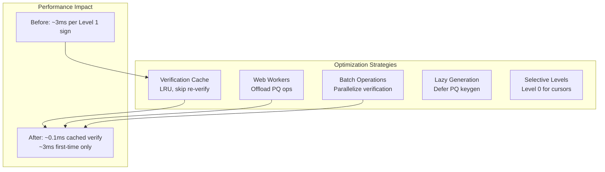

# 09: Performance Optimization

> Caching, workers, and optimization strategies for production workloads.

**Duration:** 4 days
**Dependencies:** [08-react-integration.md](./08-react-integration.md)
**Package:** `packages/crypto/`, `packages/sync/`

## Overview

ML-DSA operations are ~25x slower for signing and ~4x slower for verification compared to Ed25519. This step implements optimization strategies to minimize the impact on user experience.



## Implementation

### 1. Verification Cache

```typescript
// packages/crypto/src/cache/verification-cache.ts

import type { UnifiedSignature, VerificationResult } from '../types'
import { hash } from '../hashing'

/**
 * LRU cache for verification results.
 *
 * Cache keys are computed from (message hash + signature + public keys).
 * This avoids redundant cryptographic operations for repeated verifications.
 */
export class VerificationCache {
  private cache = new Map<string, CacheEntry>()
  private maxSize: number
  private ttlMs: number

  constructor(options: { maxSize?: number; ttlMs?: number } = {}) {
    this.maxSize = options.maxSize ?? 10000
    this.ttlMs = options.ttlMs ?? 5 * 60 * 1000 // 5 minutes default
  }

  /**
   * Compute cache key for a verification.
   */
  private computeKey(
    messageHash: Uint8Array,
    signature: UnifiedSignature,
    publicKeyHash: Uint8Array
  ): string {
    const combined = new Uint8Array(
      messageHash.length +
        1 + // level
        (signature.ed25519?.length ?? 0) +
        (signature.mlDsa?.length ?? 0) +
        publicKeyHash.length
    )

    let offset = 0
    combined.set(messageHash, offset)
    offset += messageHash.length
    combined[offset++] = signature.level
    if (signature.ed25519) {
      combined.set(signature.ed25519, offset)
      offset += signature.ed25519.length
    }
    if (signature.mlDsa) {
      combined.set(signature.mlDsa, offset)
      offset += signature.mlDsa.length
    }
    combined.set(publicKeyHash, offset)

    // Hash to fixed size for memory efficiency
    const keyHash = hash(combined, 'blake3')
    return Array.from(keyHash.slice(0, 16))
      .map((b) => b.toString(16).padStart(2, '0'))
      .join('')
  }

  /**
   * Get cached verification result.
   */
  get(
    messageHash: Uint8Array,
    signature: UnifiedSignature,
    publicKeyHash: Uint8Array
  ): VerificationResult | null {
    const key = this.computeKey(messageHash, signature, publicKeyHash)
    const entry = this.cache.get(key)

    if (!entry) return null

    // Check TTL
    if (Date.now() > entry.expiresAt) {
      this.cache.delete(key)
      return null
    }

    // Move to end for LRU
    this.cache.delete(key)
    this.cache.set(key, entry)

    return entry.result
  }

  /**
   * Store verification result.
   */
  set(
    messageHash: Uint8Array,
    signature: UnifiedSignature,
    publicKeyHash: Uint8Array,
    result: VerificationResult
  ): void {
    const key = this.computeKey(messageHash, signature, publicKeyHash)

    // Evict oldest if at capacity
    if (this.cache.size >= this.maxSize) {
      const firstKey = this.cache.keys().next().value
      if (firstKey) this.cache.delete(firstKey)
    }

    this.cache.set(key, {
      result,
      expiresAt: Date.now() + this.ttlMs
    })
  }

  /**
   * Clear all cached entries.
   */
  clear(): void {
    this.cache.clear()
  }

  /**
   * Get cache statistics.
   */
  stats(): { size: number; maxSize: number; hitRate: number } {
    return {
      size: this.cache.size,
      maxSize: this.maxSize,
      hitRate: this._hitRate
    }
  }

  private _hits = 0
  private _misses = 0
  private get _hitRate(): number {
    const total = this._hits + this._misses
    return total > 0 ? this._hits / total : 0
  }
}

interface CacheEntry {
  result: VerificationResult
  expiresAt: number
}

// Global cache instance
let globalCache: VerificationCache | null = null

export function getVerificationCache(): VerificationCache {
  if (!globalCache) {
    globalCache = new VerificationCache()
  }
  return globalCache
}

export function setVerificationCache(cache: VerificationCache): void {
  globalCache = cache
}
```

### 2. Cached Verification Function

```typescript
// packages/crypto/src/hybrid-signing.ts (updated)

import { getVerificationCache } from './cache/verification-cache'
import { hash } from './hashing'

/**
 * Verify with caching.
 *
 * Uses an LRU cache to avoid redundant cryptographic operations.
 * Cache key is derived from (message hash + signature + public keys).
 */
export function hybridVerifyCached(
  message: Uint8Array,
  signature: UnifiedSignature,
  publicKeys: HybridPublicKey,
  options: VerificationOptions & { useCache?: boolean } = {}
): VerificationResult {
  const { useCache = true, ...verifyOptions } = options

  if (!useCache) {
    return hybridVerify(message, signature, publicKeys, verifyOptions)
  }

  const cache = getVerificationCache()

  // Compute hashes for cache key
  const messageHash = hash(message, 'blake3')
  const publicKeyHash = hash(
    concatBytes(publicKeys.ed25519, publicKeys.mlDsa ?? new Uint8Array(0)),
    'blake3'
  )

  // Check cache
  const cached = cache.get(messageHash, signature, publicKeyHash)
  if (cached) {
    return cached
  }

  // Perform verification
  const result = hybridVerify(message, signature, publicKeys, verifyOptions)

  // Cache result
  cache.set(messageHash, signature, publicKeyHash, result)

  return result
}

function concatBytes(...arrays: Uint8Array[]): Uint8Array {
  const total = arrays.reduce((sum, arr) => sum + arr.length, 0)
  const result = new Uint8Array(total)
  let offset = 0
  for (const arr of arrays) {
    result.set(arr, offset)
    offset += arr.length
  }
  return result
}
```

### 3. Web Worker for Batch Operations

```typescript
// packages/crypto/src/worker/crypto-worker.ts

/**
 * Web Worker for offloading PQ cryptographic operations.
 *
 * This keeps the main thread responsive during batch signing/verification.
 */

import { ml_dsa65 } from '@noble/post-quantum/ml-dsa'
import { ed25519 } from '@noble/curves/ed25519'

interface WorkerMessage {
  id: string
  type: 'sign' | 'verify'
  data: {
    message: Uint8Array
    level: number
    ed25519Key?: Uint8Array
    mlDsaKey?: Uint8Array
    signature?: {
      ed25519?: Uint8Array
      mlDsa?: Uint8Array
    }
  }
}

interface WorkerResult {
  id: string
  success: boolean
  result?: unknown
  error?: string
}

self.onmessage = async (event: MessageEvent<WorkerMessage>) => {
  const { id, type, data } = event.data

  try {
    let result: unknown

    if (type === 'sign') {
      const signatures: { ed25519?: Uint8Array; mlDsa?: Uint8Array } = {}

      if (data.level === 0 || data.level === 1) {
        signatures.ed25519 = ed25519.sign(data.message, data.ed25519Key!)
      }

      if (data.level === 1 || data.level === 2) {
        signatures.mlDsa = ml_dsa65.sign(data.mlDsaKey!, data.message)
      }

      result = signatures
    } else if (type === 'verify') {
      const results: { ed25519?: boolean; mlDsa?: boolean } = {}

      if (data.signature?.ed25519 && data.ed25519Key) {
        results.ed25519 = ed25519.verify(data.signature.ed25519, data.message, data.ed25519Key)
      }

      if (data.signature?.mlDsa && data.mlDsaKey) {
        results.mlDsa = ml_dsa65.verify(data.mlDsaKey, data.message, data.signature.mlDsa)
      }

      result = results
    }

    self.postMessage({ id, success: true, result } as WorkerResult)
  } catch (err) {
    self.postMessage({
      id,
      success: false,
      error: err instanceof Error ? err.message : 'Unknown error'
    } as WorkerResult)
  }
}
```

### 4. Worker Pool

```typescript
// packages/crypto/src/worker/worker-pool.ts

/**
 * Pool of Web Workers for parallel cryptographic operations.
 */
export class CryptoWorkerPool {
  private workers: Worker[] = []
  private taskQueue: QueuedTask[] = []
  private pendingTasks = new Map<string, { resolve: Function; reject: Function }>()
  private roundRobin = 0

  constructor(private poolSize: number = navigator.hardwareConcurrency || 4) {
    this.initWorkers()
  }

  private initWorkers(): void {
    for (let i = 0; i < this.poolSize; i++) {
      const worker = new Worker(new URL('./crypto-worker.ts', import.meta.url), { type: 'module' })

      worker.onmessage = (event) => {
        const { id, success, result, error } = event.data
        const pending = this.pendingTasks.get(id)

        if (pending) {
          this.pendingTasks.delete(id)
          if (success) {
            pending.resolve(result)
          } else {
            pending.reject(new Error(error))
          }
        }

        // Process next task in queue
        this.processQueue()
      }

      this.workers.push(worker)
    }
  }

  /**
   * Sign a message using a worker.
   */
  async sign(
    message: Uint8Array,
    level: number,
    ed25519Key: Uint8Array,
    mlDsaKey?: Uint8Array
  ): Promise<{ ed25519?: Uint8Array; mlDsa?: Uint8Array }> {
    return this.enqueue({
      type: 'sign',
      data: { message, level, ed25519Key, mlDsaKey }
    })
  }

  /**
   * Verify a signature using a worker.
   */
  async verify(
    message: Uint8Array,
    signature: { ed25519?: Uint8Array; mlDsa?: Uint8Array },
    ed25519Key: Uint8Array,
    mlDsaKey?: Uint8Array
  ): Promise<{ ed25519?: boolean; mlDsa?: boolean }> {
    return this.enqueue({
      type: 'verify',
      data: { message, level: 0, ed25519Key, mlDsaKey, signature }
    })
  }

  /**
   * Sign multiple messages in parallel.
   */
  async signBatch(
    messages: Uint8Array[],
    level: number,
    ed25519Key: Uint8Array,
    mlDsaKey?: Uint8Array
  ): Promise<Array<{ ed25519?: Uint8Array; mlDsa?: Uint8Array }>> {
    return Promise.all(messages.map((msg) => this.sign(msg, level, ed25519Key, mlDsaKey)))
  }

  /**
   * Verify multiple signatures in parallel.
   */
  async verifyBatch(
    items: Array<{
      message: Uint8Array
      signature: { ed25519?: Uint8Array; mlDsa?: Uint8Array }
      ed25519Key: Uint8Array
      mlDsaKey?: Uint8Array
    }>
  ): Promise<Array<{ ed25519?: boolean; mlDsa?: boolean }>> {
    return Promise.all(
      items.map((item) => this.verify(item.message, item.signature, item.ed25519Key, item.mlDsaKey))
    )
  }

  private enqueue(task: Omit<QueuedTask, 'id'>): Promise<unknown> {
    const id = crypto.randomUUID()

    return new Promise((resolve, reject) => {
      this.pendingTasks.set(id, { resolve, reject })
      this.taskQueue.push({ ...task, id })
      this.processQueue()
    })
  }

  private processQueue(): void {
    if (this.taskQueue.length === 0) return

    // Round-robin worker selection
    const worker = this.workers[this.roundRobin % this.workers.length]
    this.roundRobin++

    const task = this.taskQueue.shift()!
    worker.postMessage({ id: task.id, type: task.type, data: task.data })
  }

  /**
   * Terminate all workers.
   */
  terminate(): void {
    for (const worker of this.workers) {
      worker.terminate()
    }
    this.workers = []
  }
}

interface QueuedTask {
  id: string
  type: 'sign' | 'verify'
  data: unknown
}

// Global worker pool
let globalPool: CryptoWorkerPool | null = null

export function getCryptoWorkerPool(): CryptoWorkerPool {
  if (!globalPool) {
    globalPool = new CryptoWorkerPool()
  }
  return globalPool
}
```

### 5. Lazy PQ Key Generation

```typescript
// packages/crypto/src/hybrid-keygen.ts (updated)

/**
 * Lazy key bundle that generates PQ keys on first use.
 *
 * This defers the ~1.5ms ML-DSA keygen until actually needed.
 */
export class LazyHybridKeyPair {
  private _mlDsa?: { publicKey: Uint8Array; privateKey: Uint8Array }
  private _mlKem?: { publicKey: Uint8Array; privateKey: Uint8Array }
  private _seed: Uint8Array

  readonly ed25519: { publicKey: Uint8Array; privateKey: Uint8Array }
  readonly x25519: { publicKey: Uint8Array; privateKey: Uint8Array }

  constructor(seed?: Uint8Array) {
    this._seed = seed ?? randomBytes(32)

    // Generate classical keys immediately (fast)
    const ed25519Seed = deriveKeySeed(this._seed, 'xnet-ed25519-v1', 32)
    this.ed25519 = {
      privateKey: ed25519Seed,
      publicKey: ed25519.getPublicKey(ed25519Seed)
    }

    const x25519Seed = deriveKeySeed(this._seed, 'xnet-x25519-v1', 32)
    this.x25519 = {
      privateKey: x25519Seed,
      publicKey: x25519.getPublicKey(x25519Seed)
    }
  }

  /**
   * Get ML-DSA keys (generated on first access).
   */
  get mlDsa(): { publicKey: Uint8Array; privateKey: Uint8Array } {
    if (!this._mlDsa) {
      const seed = deriveKeySeed(this._seed, 'xnet-ml-dsa-65-v1', 32)
      const keys = ml_dsa65.keygen(seed)
      this._mlDsa = { publicKey: keys.publicKey, privateKey: keys.secretKey }
    }
    return this._mlDsa
  }

  /**
   * Get ML-KEM keys (generated on first access).
   */
  get mlKem(): { publicKey: Uint8Array; privateKey: Uint8Array } {
    if (!this._mlKem) {
      const seed = deriveKeySeed(this._seed, 'xnet-ml-kem-768-v1', 64)
      const keys = ml_kem768.keygen(seed)
      this._mlKem = { publicKey: keys.publicKey, privateKey: keys.secretKey }
    }
    return this._mlKem
  }

  /**
   * Check if PQ keys have been generated.
   */
  get hasPQKeys(): boolean {
    return this._mlDsa !== undefined
  }

  /**
   * Pre-generate PQ keys (useful for background initialization).
   */
  pregenerate(): void {
    void this.mlDsa
    void this.mlKem
  }
}
```

### 6. Selective Security Levels

```typescript
// packages/sync/src/security-policy.ts

import type { SecurityLevel } from '@xnetjs/crypto'

/**
 * Security policy for different operation types.
 *
 * This allows high-frequency operations like cursor updates to use
 * Level 0 while important operations use Level 1+.
 */
export interface SecurityPolicy {
  /** Default level for most operations */
  default: SecurityLevel

  /** Per-operation type overrides */
  overrides: Record<string, SecurityLevel>
}

export const DEFAULT_SECURITY_POLICY: SecurityPolicy = {
  default: 1, // Hybrid for most operations

  overrides: {
    // High-frequency, low-value operations use Level 0
    'cursor-update': 0,
    'presence-update': 0,
    'typing-indicator': 0,
    'viewport-update': 0,

    // Important operations use Level 1
    'node-create': 1,
    'node-update': 1,
    'node-delete': 1,
    'permission-grant': 1,

    // Critical operations can use Level 2
    'key-rotation': 2,
    'permission-revoke': 2,
    'identity-recovery': 2
  }
}

/**
 * Get the security level for an operation type.
 */
export function getSecurityLevel(
  operationType: string,
  policy: SecurityPolicy = DEFAULT_SECURITY_POLICY
): SecurityLevel {
  return policy.overrides[operationType] ?? policy.default
}
```

### 7. Performance Metrics

```typescript
// packages/crypto/src/metrics/performance.ts

/**
 * Performance metrics for cryptographic operations.
 */
export interface CryptoMetrics {
  signCount: number
  signTimeMs: number
  verifyCount: number
  verifyTimeMs: number
  cacheHits: number
  cacheMisses: number
  workerOperations: number
}

class MetricsCollector {
  private metrics: CryptoMetrics = {
    signCount: 0,
    signTimeMs: 0,
    verifyCount: 0,
    verifyTimeMs: 0,
    cacheHits: 0,
    cacheMisses: 0,
    workerOperations: 0
  }

  recordSign(durationMs: number): void {
    this.metrics.signCount++
    this.metrics.signTimeMs += durationMs
  }

  recordVerify(durationMs: number, cached: boolean): void {
    this.metrics.verifyCount++
    this.metrics.verifyTimeMs += durationMs
    if (cached) {
      this.metrics.cacheHits++
    } else {
      this.metrics.cacheMisses++
    }
  }

  recordWorkerOp(): void {
    this.metrics.workerOperations++
  }

  getMetrics(): CryptoMetrics {
    return { ...this.metrics }
  }

  getAverages(): { avgSignMs: number; avgVerifyMs: number; cacheHitRate: number } {
    return {
      avgSignMs: this.metrics.signCount > 0 ? this.metrics.signTimeMs / this.metrics.signCount : 0,
      avgVerifyMs:
        this.metrics.verifyCount > 0 ? this.metrics.verifyTimeMs / this.metrics.verifyCount : 0,
      cacheHitRate:
        this.metrics.cacheHits + this.metrics.cacheMisses > 0
          ? this.metrics.cacheHits / (this.metrics.cacheHits + this.metrics.cacheMisses)
          : 0
    }
  }

  reset(): void {
    this.metrics = {
      signCount: 0,
      signTimeMs: 0,
      verifyCount: 0,
      verifyTimeMs: 0,
      cacheHits: 0,
      cacheMisses: 0,
      workerOperations: 0
    }
  }
}

export const cryptoMetrics = new MetricsCollector()
```

## Performance Benchmarks

| Operation         | Level 0 | Level 1 | Level 2 | Cached  |
| ----------------- | ------- | ------- | ------- | ------- |
| Sign              | 0.1 ms  | 2.6 ms  | 2.5 ms  | N/A     |
| Verify            | 0.2 ms  | 1.0 ms  | 0.8 ms  | <0.1 ms |
| Batch sign (10)   | 1 ms    | 26 ms   | 25 ms   | N/A     |
| Batch verify (10) | 2 ms    | 10 ms   | 8 ms    | <0.5 ms |
| Worker batch (10) | N/A     | ~10 ms  | ~9 ms   | N/A     |

## Tests

```typescript
// packages/crypto/src/cache/verification-cache.test.ts

import { describe, it, expect, beforeEach } from 'vitest'
import { VerificationCache } from './verification-cache'

describe('VerificationCache', () => {
  let cache: VerificationCache

  beforeEach(() => {
    cache = new VerificationCache({ maxSize: 100 })
  })

  it('caches verification results', () => {
    const msgHash = new Uint8Array(32).fill(1)
    const sig = { level: 1 as const, ed25519: new Uint8Array(64), mlDsa: new Uint8Array(3293) }
    const pubHash = new Uint8Array(32).fill(2)
    const result = { valid: true, level: 1 as const, details: {} }

    cache.set(msgHash, sig, pubHash, result)
    const cached = cache.get(msgHash, sig, pubHash)

    expect(cached).toEqual(result)
  })

  it('returns null for cache miss', () => {
    const msgHash = new Uint8Array(32).fill(1)
    const sig = { level: 0 as const, ed25519: new Uint8Array(64) }
    const pubHash = new Uint8Array(32).fill(2)

    const cached = cache.get(msgHash, sig, pubHash)
    expect(cached).toBeNull()
  })

  it('evicts oldest entry at capacity', () => {
    const cache = new VerificationCache({ maxSize: 2 })

    for (let i = 0; i < 3; i++) {
      const msgHash = new Uint8Array(32).fill(i)
      const sig = { level: 0 as const, ed25519: new Uint8Array(64).fill(i) }
      const pubHash = new Uint8Array(32).fill(i)
      cache.set(msgHash, sig, pubHash, { valid: true, level: 0, details: {} })
    }

    expect(cache.stats().size).toBe(2)
  })

  it('expires entries after TTL', async () => {
    const cache = new VerificationCache({ maxSize: 100, ttlMs: 50 })
    const msgHash = new Uint8Array(32).fill(1)
    const sig = { level: 0 as const, ed25519: new Uint8Array(64) }
    const pubHash = new Uint8Array(32).fill(2)

    cache.set(msgHash, sig, pubHash, { valid: true, level: 0, details: {} })

    await new Promise((r) => setTimeout(r, 100))

    const cached = cache.get(msgHash, sig, pubHash)
    expect(cached).toBeNull()
  })
})
```

## Checklist

- [x] Implement `VerificationCache` with LRU eviction
- [x] Implement `hybridVerifyCached()` function
- [ ] Implement `crypto-worker.ts` Web Worker (deferred - not critical for initial release)
- [ ] Implement `CryptoWorkerPool` for batch operations (deferred)
- [ ] Implement `LazyHybridKeyPair` for deferred generation (deferred)
- [x] Implement `SecurityPolicy` for selective levels
- [x] Implement `CryptoMetrics` for performance tracking
- [x] Add cache to verification path
- [ ] Add worker pool for batch operations (deferred)
- [ ] Add lazy key generation option (deferred)
- [ ] Write performance benchmarks (deferred)
- [x] Write unit tests (17 cache tests)
- [ ] Document performance recommendations (deferred)

---

[Back to README](./README.md) | [Previous: React Integration](./08-react-integration.md) | [Next: Testing & Security ->](./10-testing-security.md)
