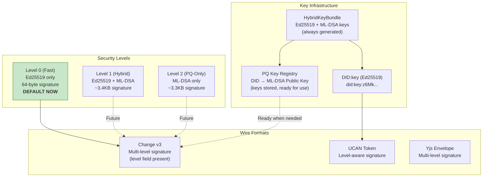
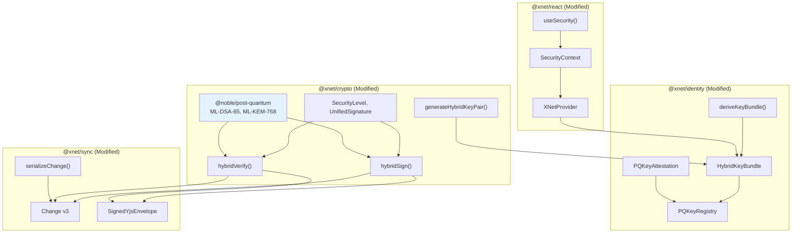
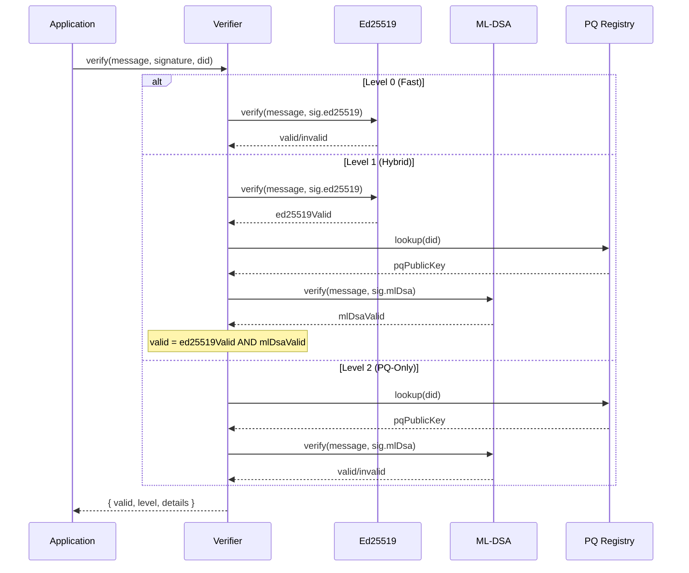

# xNet Implementation Plan - Step 03.92: Multi-Level Cryptography

> Hybrid classical and post-quantum security with configurable security levels for quantum-resistant data protection from day one.

## Executive Summary

Quantum computers capable of breaking Ed25519 and other elliptic curve cryptography may arrive within a decade. NIST finalized post-quantum cryptographic standards in August 2024 (ML-DSA/FIPS 204, ML-KEM/FIPS 203, SLH-DSA/FIPS 205). Since xNet is prerelease software, we can implement hybrid post-quantum security as a **clean replacement** rather than a migration path.

This plan implements a **three-level security architecture**:

| Level | Name         | Algorithms          | Signature Size | Use Case                              |
| ----- | ------------ | ------------------- | -------------- | ------------------------------------- |
| 0     | **Fast**     | Ed25519 only        | 64 bytes       | **DEFAULT NOW** - Zero overhead       |
| 1     | Hybrid       | Ed25519 + ML-DSA-65 | ~3.4 KB        | Future default when PQ threats emerge |
| 2     | Post-Quantum | ML-DSA-65 only      | ~3.3 KB        | Maximum quantum security              |

### Implementation Strategy: Build Now, Default Level 0

**Why implement now?**

- xNet is a distributed P2P system - future migration would require coordinating peers with different versions
- Prerelease = clean slate opportunity without backward compatibility burden
- Infrastructure cost is low; we just generate+store PQ keys and include the wire format fields
- Seamless upgrade path: change one constant (`DEFAULT_SECURITY_LEVEL = 0` → `1`) when ready

**What we're building:**

- Full multi-level crypto infrastructure (types, signing, verification, registry)
- Hybrid keys generated for all new identities (stored but not used for signing by default)
- Wire format v3 with `sig.l` level field (set to 0 by default)
- All APIs accept security level parameter for future flexibility

**What we defer:**

- Actually using Level 1/2 signatures by default (just change the constant later)
- Performance optimization (Level 0 has no overhead, optimization can wait)

The key innovation: **DID:key remains Ed25519-based** (compact, readable) while a **PQ Key Registry** associates each DID with its post-quantum public key. This gives us compact, memorable identifiers with full quantum security when enabled.



## Architecture Decisions

| Decision               | Choice                 | Rationale                                              |
| ---------------------- | ---------------------- | ------------------------------------------------------ |
| Default security level | Level 1 (Hybrid)       | Future-proof from day one, opt-down for performance    |
| PQ algorithm           | ML-DSA-65 (Dilithium3) | NIST primary standard, balanced security/performance   |
| DID format             | Keep Ed25519-based     | Compact, readable, PQ key via registry                 |
| Key exchange           | X25519 + ML-KEM-768    | Hybrid for encryption operations                       |
| PQ library             | @noble/post-quantum    | Same author as @noble/curves, audited, pure TypeScript |
| Migration strategy     | Clean replacement      | Prerelease software, no backward compat needed         |
| Wire format            | New v3 format          | Replace v2 entirely, no migration code                 |

## Current State

| Component      | Status  | Notes                                    |
| -------------- | ------- | ---------------------------------------- |
| @xnet/crypto   | Ed25519 | Needs ML-DSA signing primitives          |
| @xnet/identity | Ed25519 | Needs HybridKeyBundle, PQ registry       |
| @xnet/sync     | V2 wire | Needs V3 with multi-level signatures     |
| @xnet/react    | Basic   | Needs security context, useSecurity hook |
| Yjs envelopes  | Ed25519 | Needs hybrid signature support           |
| UCAN tokens    | EdDSA   | Needs hybrid signature format            |

## Size Impact Analysis

Post-quantum signatures are significantly larger than Ed25519:

| Algorithm | Public Key  | Private Key | Signature   |
| --------- | ----------- | ----------- | ----------- |
| Ed25519   | 32 bytes    | 32 bytes    | 64 bytes    |
| ML-DSA-65 | 1,952 bytes | 4,032 bytes | 3,293 bytes |

**Wire format overhead (per Change):**

| Level | Signature Size | 100 Changes | 1000 Changes |
| ----- | -------------- | ----------- | ------------ |
| 0     | 64 B           | 6.4 KB      | 64 KB        |
| 1     | ~3.4 KB        | 336 KB      | 3.4 MB       |
| 2     | ~3.3 KB        | 329 KB      | 3.3 MB       |

Mitigation strategies: compression, batching, selective levels, verification caching.

## Implementation Phases

### Phase 1: Core Crypto Types (Steps 01-02)

Add post-quantum primitives to `@xnet/crypto`.

| Task | Document                                             | Description                               | Status |
| ---- | ---------------------------------------------------- | ----------------------------------------- | ------ |
| 1.1  | [01-core-crypto-types.md](./01-core-crypto-types.md) | SecurityLevel type, UnifiedSignature type | [x]    |
| 1.2  | [01-core-crypto-types.md](./01-core-crypto-types.md) | Add @noble/post-quantum dependency        | [x]    |
| 1.3  | [02-hybrid-signing.md](./02-hybrid-signing.md)       | hybridSign() implementation               | [x]    |
| 1.4  | [02-hybrid-signing.md](./02-hybrid-signing.md)       | hybridVerify() implementation             | [x]    |

**Validation Gate:**

- [x] Can sign at Level 0, 1, and 2
- [x] Can verify signatures at all levels
- [x] Level 1 requires both signatures to verify (strict mode)
- [ ] @noble/post-quantum works in Web, Electron, and Expo

### Phase 2: Key Generation (Steps 03-04)

Generate and manage hybrid keypairs.

| Task | Document                                         | Description                        | Status |
| ---- | ------------------------------------------------ | ---------------------------------- | ------ |
| 2.1  | [03-hybrid-keygen.md](./03-hybrid-keygen.md)     | generateHybridKeyPair() function   | [ ]    |
| 2.2  | [03-hybrid-keygen.md](./03-hybrid-keygen.md)     | Deterministic derivation from seed | [ ]    |
| 2.3  | [04-pq-key-registry.md](./04-pq-key-registry.md) | PQKeyAttestation type              | [ ]    |
| 2.4  | [04-pq-key-registry.md](./04-pq-key-registry.md) | MemoryPQKeyRegistry implementation | [ ]    |

**Validation Gate:**

- [ ] Hybrid keypair generation includes ML-DSA keys by default
- [ ] Deterministic derivation from seed produces consistent keys
- [ ] PQ attestation links DID to PQ public key
- [ ] Registry lookup returns PQ key for a DID

### Phase 3: Identity Upgrade (Step 05)

Update identity package for hybrid keys.

| Task | Document                                           | Description                            | Status |
| ---- | -------------------------------------------------- | -------------------------------------- | ------ |
| 3.1  | [05-identity-upgrade.md](./05-identity-upgrade.md) | Replace KeyBundle with HybridKeyBundle | [ ]    |
| 3.2  | [05-identity-upgrade.md](./05-identity-upgrade.md) | Update deriveKeyBundle() for PQ keys   | [ ]    |
| 3.3  | [05-identity-upgrade.md](./05-identity-upgrade.md) | Passkey integration with PQ derivation | [ ]    |

**Validation Gate:**

- [ ] New identities have ML-DSA keys by default
- [ ] DID:key format unchanged (still Ed25519-based)
- [ ] Passkey PRF derivation produces hybrid keys

### Phase 4: Wire Format Updates (Steps 06-07)

Update sync formats for multi-level signatures.

| Task | Document                                   | Description                                 | Status |
| ---- | ------------------------------------------ | ------------------------------------------- | ------ |
| 4.1  | [06-wire-format.md](./06-wire-format.md)   | ChangeWire v3 with multi-level sig          | [ ]    |
| 4.2  | [06-wire-format.md](./06-wire-format.md)   | UCAN token hybrid signature format          | [ ]    |
| 4.3  | [07-yjs-envelope.md](./07-yjs-envelope.md) | SignedYjsEnvelope with multi-level sig      | [ ]    |
| 4.4  | [07-yjs-envelope.md](./07-yjs-envelope.md) | Update signYjsUpdate(), verifyYjsEnvelope() | [ ]    |

**Validation Gate:**

- [ ] Change serialization includes multi-level signature
- [ ] UCAN tokens use hybrid signatures by default
- [ ] Yjs envelopes verify at configurable security levels
- [ ] Old v2 format no longer supported (clean break)

### Phase 5: React Integration (Step 08)

Add React hooks and provider configuration.

| Task | Document                                             | Description                         | Status |
| ---- | ---------------------------------------------------- | ----------------------------------- | ------ |
| 5.1  | [08-react-integration.md](./08-react-integration.md) | SecurityContext type                | [ ]    |
| 5.2  | [08-react-integration.md](./08-react-integration.md) | useSecurity() hook                  | [ ]    |
| 5.3  | [08-react-integration.md](./08-react-integration.md) | XNetProvider security configuration | [ ]    |
| 5.4  | [08-react-integration.md](./08-react-integration.md) | DevTools security panel             | [ ]    |

**Validation Gate:**

- [ ] XNetProvider defaults to Level 1
- [ ] useSecurity() allows per-operation level override
- [ ] DevTools shows current security level and signature info

### Phase 6: Performance Optimization (Step 09)

Optimize for production workloads.

| Task | Document                                 | Description                         | Status |
| ---- | ---------------------------------------- | ----------------------------------- | ------ |
| 6.1  | [09-performance.md](./09-performance.md) | Verification caching (LRU)          | [ ]    |
| 6.2  | [09-performance.md](./09-performance.md) | Worker-based PQ signing for batches | [ ]    |
| 6.3  | [09-performance.md](./09-performance.md) | Batch verification API              | [ ]    |
| 6.4  | [09-performance.md](./09-performance.md) | Lazy PQ key generation              | [ ]    |

**Validation Gate:**

- [ ] Verification caching reduces repeated verifications by 90%+
- [ ] Batch signing 100 items in worker < 500ms
- [ ] Level 0 operations show no performance regression

### Phase 7: Testing & Security Audit (Step 10)

Comprehensive testing and security validation.

| Task | Document                                           | Description                        | Status |
| ---- | -------------------------------------------------- | ---------------------------------- | ------ |
| 7.1  | [10-testing-security.md](./10-testing-security.md) | Unit tests for all security levels | [ ]    |
| 7.2  | [10-testing-security.md](./10-testing-security.md) | Integration tests for P2P sync     | [ ]    |
| 7.3  | [10-testing-security.md](./10-testing-security.md) | Security audit checklist           | [ ]    |
| 7.4  | [10-testing-security.md](./10-testing-security.md) | Performance benchmarks             | [ ]    |

**Validation Gate:**

- [ ] 50+ unit tests covering all code paths
- [ ] P2P sync works with mixed security levels
- [ ] No downgrade attacks possible (strict policy)
- [ ] Benchmarks show acceptable performance

## Architecture Overview



## Verification Flow



## Package Structure (Target)

```
packages/
  crypto/                          # MODIFIED
    src/
      types.ts                     # + SecurityLevel, UnifiedSignature
      hybrid-signing.ts            # NEW: hybridSign(), hybridVerify()
      hybrid-keygen.ts             # NEW: generateHybridKeyPair()
      context.ts                   # NEW: SecurityContext globals
      index.ts                     # + re-export new types
    package.json                   # + @noble/post-quantum

  identity/                        # MODIFIED
    src/
      types.ts                     # + HybridKeyBundle
      hybrid-keys.ts               # NEW: deriveHybridKeyBundle()
      pq-attestation.ts            # NEW: PQKeyAttestation
      pq-registry.ts               # NEW: PQKeyRegistry, MemoryPQKeyRegistry
      passkey/
        create.ts                  # MODIFIED: derive PQ keys from PRF
      index.ts

  sync/                            # MODIFIED
    src/
      serializers/
        change-serializer.ts       # MODIFIED: v3 format with multi-level sig
      yjs/
        envelope.ts                # MODIFIED: multi-level signature
      index.ts

  react/                           # MODIFIED
    src/
      hooks/
        useSecurity.ts             # NEW: security level hook
      provider.tsx                 # MODIFIED: security config prop
      index.ts

  devtools/                        # MODIFIED
    src/
      panels/
        SecurityPanel.tsx          # NEW: security level inspector
```

## Dependencies

| Package             | Version | Purpose                        |
| ------------------- | ------- | ------------------------------ |
| @noble/post-quantum | ^0.2.0  | ML-DSA, ML-KEM implementations |
| @noble/curves       | ^2.0.1  | Ed25519, X25519 (existing)     |
| @noble/hashes       | ^2.0.1  | HKDF, SHA-256 (existing)       |

Bundle size impact: ~200KB gzipped for @noble/post-quantum.

## Security Threat Model

| Threat                    | Level 0    | Level 1   | Level 2   |
| ------------------------- | ---------- | --------- | --------- |
| Classical MITM            | Protected  | Protected | Protected |
| Classical forgery         | Protected  | Protected | Protected |
| Quantum MITM              | Vulnerable | Protected | Protected |
| Quantum forgery           | Vulnerable | Protected | Protected |
| Harvest-now-decrypt-later | Vulnerable | Protected | Protected |
| Downgrade attack          | N/A        | Blocked   | Blocked   |

**Hybrid Security Properties (Level 1):**

- Security against classical attacks (via Ed25519)
- Security against quantum attacks (via ML-DSA)
- Both signatures must verify for "strict" policy
- This is the NIST-recommended approach

## Migration Strategy

Since xNet is prerelease with no production users, we implement a **clean replacement**:

1. Add new hybrid crypto primitives alongside existing
2. Replace wire formats (v2 → v3) without backward compat
3. Replace KeyBundle with HybridKeyBundle
4. Update all consumers to use new APIs
5. Remove old Ed25519-only code paths
6. Users delete their database and start fresh

```bash
# Clear local database (browser)
localStorage.clear()
indexedDB.deleteDatabase('xnet')

# Or in Electron
rm -rf ~/Library/Application\ Support/xnet/*.db
```

## Success Criteria

1. **Quantum-ready by default** — All new signatures are hybrid (Level 1)
2. **DID stability** — DID:key format unchanged, still human-readable
3. **Performance opt-out** — Level 0 available for high-frequency ops
4. **No migration debt** — Clean break, no v2 support code
5. **Cross-platform** — Works in Web, Electron, and Expo
6. **P2P compatible** — Mixed security levels work in sync
7. **Auditable** — Clear security level in every signature
8. **Extensible** — Easy to add future algorithms

## Timeline Summary

| Phase              | Duration | Milestone                       |
| ------------------ | -------- | ------------------------------- |
| Core Crypto Types  | 3 days   | SecurityLevel and types defined |
| Hybrid Signing     | 4 days   | Sign/verify at all levels works |
| Key Generation     | 3 days   | Hybrid keypairs generated       |
| PQ Registry        | 3 days   | DID → PQ key association        |
| Identity Upgrade   | 4 days   | HybridKeyBundle in place        |
| Wire Format        | 5 days   | v3 format with multi-level sig  |
| Yjs Envelope       | 3 days   | Yjs updates use hybrid sigs     |
| React Integration  | 3 days   | Hooks and provider config       |
| Performance        | 4 days   | Caching and workers             |
| Testing & Security | 5 days   | Full test coverage              |

**Total: ~37 days (~7.5 weeks)**

## Risk Mitigation

| Risk                    | Mitigation                                                   |
| ----------------------- | ------------------------------------------------------------ |
| Large signature sizes   | Compression, batching, Level 0 for high-frequency ops        |
| PQ algorithm weaknesses | ML-DSA is NIST primary; SLH-DSA as backup if needed          |
| Bundle size increase    | Tree-shaking, lazy loading for Level 2 only                  |
| Performance degradation | Caching, workers, Level 0 opt-out                            |
| Library instability     | @noble/post-quantum is audited, same author as @noble/curves |
| Cross-platform issues   | Pure TypeScript, no WASM dependencies                        |

## Reference Documents

- [Multi-Level Crypto Exploration](../explorations/0069_MULTI_LEVEL_CRYPTO.md) - Full research
- [NIST FIPS 204 (ML-DSA)](https://csrc.nist.gov/pubs/fips/204/final)
- [NIST FIPS 203 (ML-KEM)](https://csrc.nist.gov/pubs/fips/203/final)
- [@noble/post-quantum](https://github.com/paulmillr/noble-post-quantum)
- [Data Model Consolidation](../plan02_1DataModelConsolidation/README.md)
- [Yjs Security Plan](../plan03_4_1YjsSecurity/README.md)

---

[Back to docs/](../) | [Start Implementation](./01-core-crypto-types.md)
