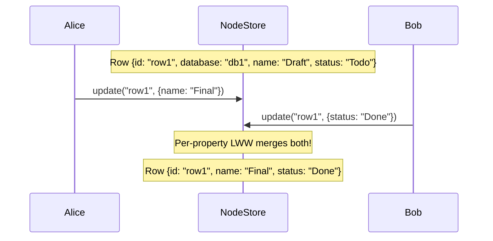
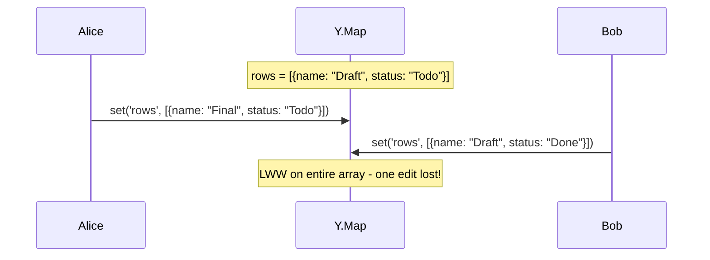
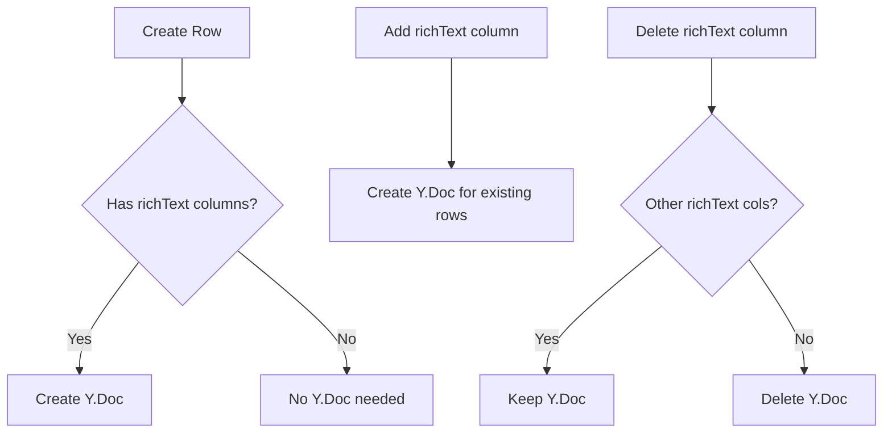
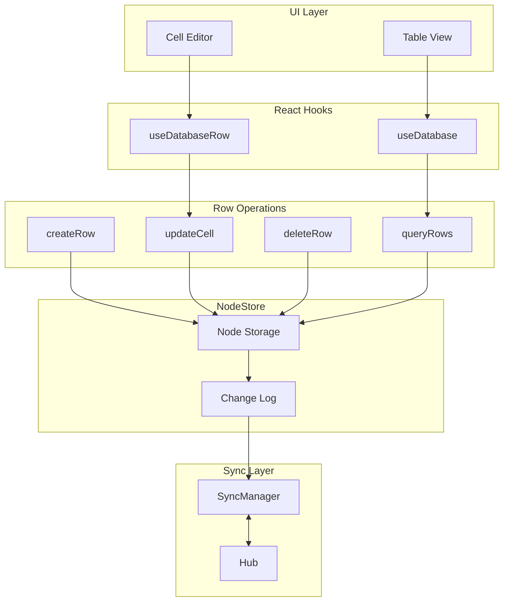

# 01: Database Row Schema

> Every database row as a first-class Node with per-cell conflict resolution

**Duration:** 5-7 days
**Dependencies:** `@xnetjs/data` (NodeStore, schema system), `@xnetjs/sync` (Lamport clocks)

## Overview

The core architectural decision: **every database row is a first-class Node in the NodeStore**. This gives us per-row identity (nanoid, timestamps, author), per-property LWW conflict resolution, and the ability to query rows using the existing NodeStore infrastructure.

Cell values are stored as dynamic properties on the row node. When Alice edits the "name" cell and Bob edits the "status" cell concurrently, both edits merge cleanly because they're different properties with independent Lamport timestamps.



Compare this to the current broken approach:



## Schema Definition

### DatabaseRowSchema

```typescript
// packages/data/src/schema/schemas/database-row.ts

import { defineSchema } from '../define-schema'
import { text, relation, timestamp, did } from '../properties'

/**
 * A row in a database. Cell values are stored as dynamic properties
 * based on the database's column definitions.
 *
 * @example
 * const row = await store.create(DatabaseRowSchema, {
 *   database: 'db_abc123',
 *   sortKey: 'a0',
 *   // Dynamic cell values (column IDs as keys)
 *   col_name: 'John Doe',
 *   col_status: 'active',
 *   col_priority: 3
 * })
 */
export const DatabaseRowSchema = defineSchema({
  name: 'DatabaseRow',
  namespace: 'xnet://xnet.fyi/',

  properties: {
    /** Reference to the parent database */
    database: relation({
      target: 'xnet://xnet.fyi/Database',
      required: true
    }),

    /** Fractional index for row ordering */
    sortKey: text({ required: true })
  },

  // Dynamic properties for cell values are allowed
  allowDynamicProperties: true,

  // Optional Y.Doc for rich text cells
  document: 'yjs'
})

export type DatabaseRow = typeof DatabaseRowSchema
```

### DatabaseSchema Update

```typescript
// packages/data/src/schema/schemas/database.ts

import { defineSchema } from '../define-schema'
import { text, file, select, number } from '../properties'

export const DatabaseSchema = defineSchema({
  name: 'Database',
  namespace: 'xnet://xnet.fyi/',

  properties: {
    title: text({ required: true, maxLength: 500 }),
    icon: text({}),
    cover: file({ accept: ['image/*'] }),
    defaultView: select({
      options: [
        { id: 'table', name: 'Table' },
        { id: 'board', name: 'Board' },
        { id: 'list', name: 'List' },
        { id: 'gallery', name: 'Gallery' },
        { id: 'calendar', name: 'Calendar' },
        { id: 'timeline', name: 'Timeline' }
      ],
      default: 'table'
    }),
    // Cached row count (updated on row add/delete)
    rowCount: number({ default: 0 })
  },

  // Y.Doc stores columns, views, and other collaborative state
  document: 'yjs'
})

export type Database = typeof DatabaseSchema
```

## Dynamic Property Support

The NodeStore needs to support properties not defined in the schema. These are cell values keyed by column ID.

```typescript
// packages/data/src/store/node-store.ts

interface CreateOptions<T extends Schema> {
  /** Standard schema properties */
  properties: InferProperties<T>

  /** Dynamic properties (cell values for DatabaseRow) */
  dynamicProperties?: Record<string, unknown>
}

interface UpdateOptions {
  /** Standard schema properties */
  properties?: Partial<InferProperties<Schema>>

  /** Dynamic properties to add/update */
  dynamicProperties?: Record<string, unknown>

  /** Dynamic property keys to delete */
  deleteDynamicProperties?: string[]
}
```

### Implementation

```typescript
// packages/data/src/store/node-store.ts

export class NodeStore {
  async create<T extends Schema>(schema: T, options: CreateOptions<T>): Promise<string> {
    const id = nanoid()
    const now = Date.now()

    // Validate standard properties against schema
    const validatedProps = this.validateProperties(schema, options.properties)

    // Merge with dynamic properties (no validation needed)
    const allProperties = {
      ...validatedProps,
      ...(options.dynamicProperties ?? {})
    }

    const node: Node = {
      id,
      schema: schema.namespace + schema.name,
      properties: allProperties,
      createdAt: now,
      updatedAt: now,
      createdBy: this.identity.did
    }

    // Create change with all properties
    const change = this.createChange('create', node, allProperties)
    await this.storage.saveNode(node)
    await this.storage.saveChange(change)

    return id
  }

  async update(id: string, options: UpdateOptions): Promise<void> {
    const node = await this.storage.getNode(id)
    if (!node) throw new Error(`Node ${id} not found`)

    const schema = this.registry.get(node.schema)

    // Validate standard properties if provided
    let updatedProps = { ...node.properties }

    if (options.properties) {
      const validated = this.validatePartialProperties(schema, options.properties)
      updatedProps = { ...updatedProps, ...validated }
    }

    // Apply dynamic property updates
    if (options.dynamicProperties) {
      updatedProps = { ...updatedProps, ...options.dynamicProperties }
    }

    // Remove deleted dynamic properties
    if (options.deleteDynamicProperties) {
      for (const key of options.deleteDynamicProperties) {
        delete updatedProps[key]
      }
    }

    // Create per-property changes
    const changedKeys = this.getChangedKeys(node.properties, updatedProps)
    for (const key of changedKeys) {
      const change = this.createPropertyChange(node.id, key, updatedProps[key])
      await this.storage.saveChange(change)
    }

    // Update node
    node.properties = updatedProps
    node.updatedAt = Date.now()
    await this.storage.saveNode(node)
  }
}
```

## Cell Value Storage

Cell values are stored with the column ID as the property key:

```typescript
// Column IDs are prefixed to avoid collisions with schema properties
const CELL_PREFIX = 'cell_'

function cellKey(columnId: string): string {
  return CELL_PREFIX + columnId
}

function isCell(key: string): boolean {
  return key.startsWith(CELL_PREFIX)
}

function columnIdFromKey(key: string): string {
  return key.slice(CELL_PREFIX.length)
}
```

### Cell Value Types

```typescript
// packages/data/src/database/cell-types.ts

/** Cell values by column type */
type CellValue =
  | string // text, url, email, phone
  | number // number
  | boolean // checkbox
  | Date // date
  | DateRange // dateRange
  | string // select (option ID)
  | string[] // multiSelect (option IDs)
  | string // person (DID)
  | string[] // relation (row IDs)
  | FileRef // file
  | null // empty cell

interface DateRange {
  start: Date
  end: Date
}

interface FileRef {
  id: string
  name: string
  size: number
  type: string
  url: string
}
```

## Row CRUD Operations

### Create Row

```typescript
// packages/data/src/database/row-operations.ts

import { DatabaseRowSchema } from '../schema/schemas/database-row'
import { generateSortKey } from './fractional-index'

interface CreateRowOptions {
  /** Parent database ID */
  databaseId: string

  /** Initial cell values (columnId -> value) */
  cells?: Record<string, unknown>

  /** Insert position (before this row's sortKey) */
  before?: string

  /** Insert position (after this row's sortKey) */
  after?: string
}

export async function createRow(store: NodeStore, options: CreateRowOptions): Promise<string> {
  const { databaseId, cells = {}, before, after } = options

  // Generate sort key for position
  const sortKey = generateSortKey(before, after)

  // Prefix cell keys
  const dynamicProperties: Record<string, unknown> = {}
  for (const [columnId, value] of Object.entries(cells)) {
    dynamicProperties[cellKey(columnId)] = value
  }

  const rowId = await store.create(DatabaseRowSchema, {
    properties: {
      database: databaseId,
      sortKey
    },
    dynamicProperties
  })

  // Update database row count
  await incrementRowCount(store, databaseId)

  return rowId
}
```

### Update Cell

```typescript
export async function updateCell(
  store: NodeStore,
  rowId: string,
  columnId: string,
  value: unknown
): Promise<void> {
  await store.update(rowId, {
    dynamicProperties: {
      [cellKey(columnId)]: value
    }
  })
}

export async function updateCells(
  store: NodeStore,
  rowId: string,
  cells: Record<string, unknown>
): Promise<void> {
  const dynamicProperties: Record<string, unknown> = {}
  for (const [columnId, value] of Object.entries(cells)) {
    dynamicProperties[cellKey(columnId)] = value
  }

  await store.update(rowId, { dynamicProperties })
}
```

### Delete Row

```typescript
export async function deleteRow(store: NodeStore, rowId: string): Promise<void> {
  const row = await store.get(rowId)
  if (!row) return

  const databaseId = row.properties.database as string

  await store.delete(rowId)

  // Update database row count
  await decrementRowCount(store, databaseId)
}
```

### Query Rows

```typescript
export async function queryRows(
  store: NodeStore,
  databaseId: string,
  options?: {
    limit?: number
    cursor?: string
    sortBy?: string
    sortDirection?: 'asc' | 'desc'
  }
): Promise<{
  rows: Node[]
  cursor?: string
  hasMore: boolean
}> {
  const { limit = 50, cursor, sortBy = 'sortKey', sortDirection = 'asc' } = options ?? {}

  const results = await store.query({
    schema: 'xnet://xnet.fyi/DatabaseRow',
    where: {
      'properties.database': databaseId,
      ...(cursor ? { 'properties.sortKey': { $gt: cursor } } : {})
    },
    sort: [{ property: sortBy, direction: sortDirection }],
    limit: limit + 1 // Fetch one extra to detect hasMore
  })

  const hasMore = results.length > limit
  const rows = hasMore ? results.slice(0, limit) : results
  const nextCursor = hasMore ? rows[rows.length - 1].properties.sortKey : undefined

  return { rows, cursor: nextCursor, hasMore }
}
```

## Rich Text Cells

Rich text cells use the row's Y.Doc for collaborative editing:

```typescript
// packages/data/src/database/rich-text-cell.ts

import * as Y from 'yjs'

/**
 * Get or create a rich text cell in the row's Y.Doc.
 * The XML fragment supports TipTap/ProseMirror content.
 */
export function getRichTextCell(doc: Y.Doc, columnId: string): Y.XmlFragment {
  return doc.getXmlFragment(`richtext_${columnId}`)
}

/**
 * Check if a row has any rich text content.
 * Used to decide whether to create/sync a Y.Doc.
 */
export function hasRichTextCells(columns: ColumnDefinition[]): boolean {
  return columns.some((col) => col.type === 'richText')
}
```

### Y.Doc Creation Strategy

Not every row needs a Y.Doc. Only rows with rich text columns get one:



```typescript
export async function ensureRowDoc(
  store: NodeStore,
  rowId: string,
  columns: ColumnDefinition[]
): Promise<Y.Doc | null> {
  if (!hasRichTextCells(columns)) {
    return null
  }

  // Get or create the row's Y.Doc
  return store.getOrCreateDoc(rowId)
}
```

## Data Flow



## Testing

```typescript
describe('DatabaseRowSchema', () => {
  describe('createRow', () => {
    it('creates row with cell values', async () => {
      const store = createTestStore()

      const databaseId = await store.create(DatabaseSchema, {
        properties: { title: 'Test DB' }
      })

      const rowId = await createRow(store, {
        databaseId,
        cells: {
          name: 'John Doe',
          age: 30,
          active: true
        }
      })

      const row = await store.get(rowId)
      expect(row.properties.database).toBe(databaseId)
      expect(row.properties[cellKey('name')]).toBe('John Doe')
      expect(row.properties[cellKey('age')]).toBe(30)
      expect(row.properties[cellKey('active')]).toBe(true)
    })

    it('increments database row count', async () => {
      const store = createTestStore()
      const databaseId = await store.create(DatabaseSchema, {
        properties: { title: 'Test DB' }
      })

      await createRow(store, { databaseId })
      await createRow(store, { databaseId })

      const db = await store.get(databaseId)
      expect(db.properties.rowCount).toBe(2)
    })
  })

  describe('updateCell', () => {
    it('updates single cell value', async () => {
      const store = createTestStore()
      const { databaseId, rowId } = await createTestRow(store)

      await updateCell(store, rowId, 'name', 'Jane Doe')

      const row = await store.get(rowId)
      expect(row.properties[cellKey('name')]).toBe('Jane Doe')
    })

    it('creates per-property changes', async () => {
      const store = createTestStore()
      const { rowId } = await createTestRow(store)

      await updateCells(store, rowId, {
        name: 'Jane',
        age: 25
      })

      const changes = await store.getChangesFor(rowId)
      const propChanges = changes.filter((c) => c.type === 'property')
      expect(propChanges).toHaveLength(2)
    })
  })

  describe('conflict resolution', () => {
    it('merges concurrent cell edits', async () => {
      const store1 = createTestStore()
      const store2 = createTestStore()

      // Create row in store1
      const { rowId } = await createTestRow(store1)

      // Sync to store2
      await syncStores(store1, store2)

      // Concurrent edits
      await updateCell(store1, rowId, 'name', 'Alice')
      await updateCell(store2, rowId, 'status', 'active')

      // Sync both ways
      await syncStores(store1, store2)
      await syncStores(store2, store1)

      // Both edits should merge
      const row1 = await store1.get(rowId)
      const row2 = await store2.get(rowId)

      expect(row1.properties[cellKey('name')]).toBe('Alice')
      expect(row1.properties[cellKey('status')]).toBe('active')
      expect(row2.properties[cellKey('name')]).toBe('Alice')
      expect(row2.properties[cellKey('status')]).toBe('active')
    })

    it('uses LWW for same-cell conflicts', async () => {
      const store1 = createTestStore()
      const store2 = createTestStore()

      const { rowId } = await createTestRow(store1)
      await syncStores(store1, store2)

      // Concurrent edits to same cell
      await updateCell(store1, rowId, 'name', 'Alice')
      await sleep(1) // Ensure different Lamport timestamps
      await updateCell(store2, rowId, 'name', 'Bob')

      // Sync both ways
      await syncStores(store1, store2)
      await syncStores(store2, store1)

      // Later timestamp wins
      const row1 = await store1.get(rowId)
      const row2 = await store2.get(rowId)

      expect(row1.properties[cellKey('name')]).toBe('Bob')
      expect(row2.properties[cellKey('name')]).toBe('Bob')
    })
  })

  describe('queryRows', () => {
    it('returns rows for database', async () => {
      const store = createTestStore()
      const databaseId = await createTestDatabase(store)

      await createRow(store, { databaseId, cells: { name: 'A' } })
      await createRow(store, { databaseId, cells: { name: 'B' } })
      await createRow(store, { databaseId, cells: { name: 'C' } })

      const { rows } = await queryRows(store, databaseId)

      expect(rows).toHaveLength(3)
    })

    it('paginates with cursor', async () => {
      const store = createTestStore()
      const databaseId = await createTestDatabase(store)

      for (let i = 0; i < 10; i++) {
        await createRow(store, { databaseId, cells: { num: i } })
      }

      const page1 = await queryRows(store, databaseId, { limit: 3 })
      expect(page1.rows).toHaveLength(3)
      expect(page1.hasMore).toBe(true)

      const page2 = await queryRows(store, databaseId, {
        limit: 3,
        cursor: page1.cursor
      })
      expect(page2.rows).toHaveLength(3)
      expect(page2.hasMore).toBe(true)
    })
  })
})

describe('Rich Text Cells', () => {
  it('creates Y.Doc only for rows with rich text columns', async () => {
    const store = createTestStore()
    const columns = [
      { id: 'name', type: 'text' },
      { id: 'notes', type: 'richText' }
    ]

    const { rowId } = await createTestRow(store)
    const doc = await ensureRowDoc(store, rowId, columns)

    expect(doc).toBeInstanceOf(Y.Doc)
  })

  it('skips Y.Doc for rows without rich text columns', async () => {
    const store = createTestStore()
    const columns = [
      { id: 'name', type: 'text' },
      { id: 'age', type: 'number' }
    ]

    const { rowId } = await createTestRow(store)
    const doc = await ensureRowDoc(store, rowId, columns)

    expect(doc).toBeNull()
  })
})
```

## Validation Gate

- [x] `DatabaseRowSchema` defined with dynamic property support
- [x] `NodeStore.create()` accepts dynamic properties
- [x] `NodeStore.update()` handles dynamic property updates
- [x] Cell values stored with column ID prefix
- [x] `createRow()` generates sort key and stores cells
- [x] `updateCell()` creates per-property change
- [x] `deleteRow()` updates database row count
- [x] `queryRows()` returns paginated results
- [x] Concurrent cell edits merge correctly
- [x] Same-cell conflicts use LWW
- [x] Rich text cells use row Y.Doc
- [x] Y.Doc only created when needed
- [x] All tests pass

---

[Back to README](./README.md) | [Next: Fractional Indexing ->](./02-fractional-indexing.md)
