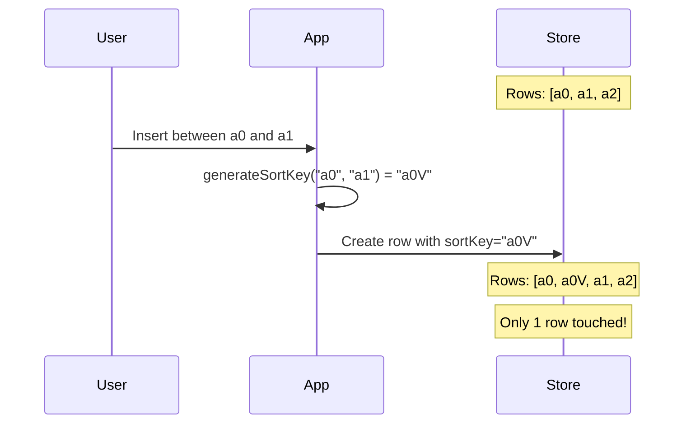
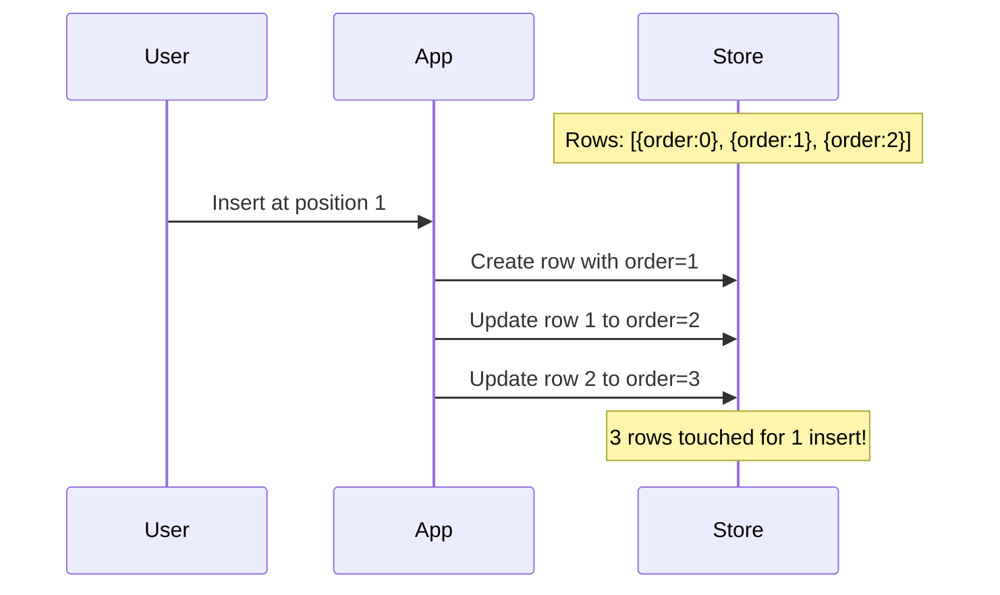

# 02: Fractional Indexing

> O(1) row ordering with lexicographically sortable keys

**Duration:** 2-3 days
**Dependencies:** None (standalone utility)

## Overview

Row order uses **fractional indexing** instead of array positions. Each row has a `sortKey` string that can be sorted lexicographically. Inserting between two rows generates a key that sorts between them, without updating any other rows.

This approach is used by Figma, Linear, and other collaborative apps because it enables O(1) insert/reorder operations and works naturally with database queries (`ORDER BY sort_key`).



Compare to array-based ordering:



## Algorithm

We use a base-62 alphabet (0-9, A-Z, a-z) for compact keys. The algorithm generates keys that:

1. Sort lexicographically in the correct order
2. Have room for many insertions between any two keys
3. Are compact (typically 2-4 characters)

### Key Generation Rules

```typescript
// Generate key between two existing keys
generateSortKey(before?: string, after?: string): string

// Examples:
generateSortKey()                    // "a0" (first key)
generateSortKey("a0")                // "a1" (after a0)
generateSortKey(undefined, "a0")     // "Zz" (before a0)
generateSortKey("a0", "a1")          // "a0V" (between)
generateSortKey("a0", "a0V")         // "a0G" (between)
generateSortKey("a0G", "a0V")        // "a0N" (between)
```

### Lexicographic Ordering

The key insight is that strings sort character-by-character. If we use a consistent alphabet, shorter prefixes sort before longer ones with the same prefix:

```
a0
a0G
a0N
a0V
a1
a2
```

## Implementation

```typescript
// packages/data/src/database/fractional-index.ts

/**
 * Base-62 alphabet for compact keys.
 * Order: 0-9 < A-Z < a-z
 */
const ALPHABET = '0123456789ABCDEFGHIJKLMNOPQRSTUVWXYZabcdefghijklmnopqrstuvwxyz'
const BASE = ALPHABET.length // 62

/**
 * Default starting key and key for "end of list"
 */
const START_KEY = 'a0'
const MIDPOINT = 'V' // Middle of alphabet

/**
 * Generate a sort key that orders between `before` and `after`.
 *
 * @param before - The key to sort after (or undefined for start)
 * @param after - The key to sort before (or undefined for end)
 * @returns A new key that sorts between before and after
 *
 * @example
 * generateSortKey()           // "a0" - first key
 * generateSortKey("a0")       // "a1" - append
 * generateSortKey("a0", "a1") // "a0V" - insert between
 */
export function generateSortKey(before?: string, after?: string): string {
  // No constraints - return starting key
  if (!before && !after) {
    return START_KEY
  }

  // Append after last key
  if (before && !after) {
    return incrementKey(before)
  }

  // Prepend before first key
  if (!before && after) {
    return decrementKey(after)
  }

  // Insert between two keys
  return midpointKey(before!, after!)
}

/**
 * Increment a key to get the next key in sequence.
 * Like adding 1 in base-62.
 */
function incrementKey(key: string): string {
  const chars = key.split('')
  let i = chars.length - 1

  while (i >= 0) {
    const idx = ALPHABET.indexOf(chars[i])
    if (idx < BASE - 1) {
      // Can increment this character
      chars[i] = ALPHABET[idx + 1]
      return chars.join('')
    }
    // Carry over to previous character
    chars[i] = ALPHABET[0]
    i--
  }

  // All characters were max, add a new character
  return ALPHABET[0] + chars.join('')
}

/**
 * Decrement a key to get a key that sorts before it.
 */
function decrementKey(key: string): string {
  const chars = key.split('')
  let i = chars.length - 1

  while (i >= 0) {
    const idx = ALPHABET.indexOf(chars[i])
    if (idx > 0) {
      // Can decrement this character
      chars[i] = ALPHABET[idx - 1]
      // Add suffix to create space
      return chars.join('') + ALPHABET[BASE - 1]
    }
    // Borrow from previous character
    chars[i] = ALPHABET[BASE - 1]
    i--
  }

  // Edge case: key was all zeros, prepend
  return ALPHABET[0] + ALPHABET[BASE - 1].repeat(key.length)
}

/**
 * Generate a key that sorts between two keys.
 */
function midpointKey(before: string, after: string): string {
  // Validate ordering
  if (before >= after) {
    throw new Error(`Invalid key order: "${before}" >= "${after}"`)
  }

  // Pad keys to same length for comparison
  const maxLen = Math.max(before.length, after.length)
  const paddedBefore = before.padEnd(maxLen, ALPHABET[0])
  const paddedAfter = after.padEnd(maxLen, ALPHABET[0])

  // Find first differing position
  let diffPos = 0
  while (diffPos < maxLen && paddedBefore[diffPos] === paddedAfter[diffPos]) {
    diffPos++
  }

  const beforeIdx = ALPHABET.indexOf(paddedBefore[diffPos] || ALPHABET[0])
  const afterIdx = ALPHABET.indexOf(paddedAfter[diffPos] || ALPHABET[0])

  // If there's room between the characters, use midpoint
  if (afterIdx - beforeIdx > 1) {
    const midIdx = Math.floor((beforeIdx + afterIdx) / 2)
    return paddedBefore.slice(0, diffPos) + ALPHABET[midIdx]
  }

  // No room - need to add a suffix
  // Take the before key's prefix and append a midpoint character
  return before + MIDPOINT
}

/**
 * Validate that a key is well-formed.
 */
export function isValidSortKey(key: string): boolean {
  if (!key || key.length === 0) return false
  return key.split('').every((c) => ALPHABET.includes(c))
}

/**
 * Compare two sort keys.
 * Returns negative if a < b, positive if a > b, 0 if equal.
 */
export function compareSortKeys(a: string, b: string): number {
  return a.localeCompare(b)
}
```

## Advanced: Jitter Prevention

Under heavy concurrent inserts, multiple users might generate the same midpoint key. We add random jitter to prevent collisions:

```typescript
/**
 * Generate a sort key with random jitter to prevent collisions.
 */
export function generateSortKeyWithJitter(before?: string, after?: string): string {
  const base = generateSortKey(before, after)

  // Add 2 random characters as suffix
  const jitter = ALPHABET[randomInt(BASE)] + ALPHABET[randomInt(BASE)]
  return base + jitter
}

function randomInt(max: number): number {
  return Math.floor(Math.random() * max)
}
```

## Rebalancing

Over time, keys can get long if many insertions happen in the same spot. We can rebalance by regenerating all keys:

```typescript
/**
 * Rebalance sort keys for a set of rows.
 * Generates evenly-spaced keys for all rows.
 *
 * @param rowIds - Row IDs in current sorted order
 * @returns Map of rowId -> new sortKey
 */
export function rebalanceSortKeys(rowIds: string[]): Map<string, string> {
  const result = new Map<string, string>()

  for (let i = 0; i < rowIds.length; i++) {
    // Generate evenly spaced keys
    const key = indexToKey(i, rowIds.length)
    result.set(rowIds[i], key)
  }

  return result
}

/**
 * Convert an index to a sort key, distributing evenly across the keyspace.
 */
function indexToKey(index: number, total: number): string {
  // Use two-character keys for up to 62^2 = 3844 rows
  // Use three-character keys for up to 62^3 = 238,328 rows
  const charCount = total <= BASE * BASE ? 2 : 3

  const range = Math.pow(BASE, charCount)
  const step = Math.floor(range / (total + 1))
  const value = step * (index + 1)

  return valueToKey(value, charCount)
}

function valueToKey(value: number, length: number): string {
  let result = ''
  let remaining = value

  for (let i = 0; i < length; i++) {
    const idx = remaining % BASE
    result = ALPHABET[idx] + result
    remaining = Math.floor(remaining / BASE)
  }

  return result
}
```

## Usage in Row Operations

```typescript
// packages/data/src/database/row-operations.ts

import { generateSortKey, rebalanceSortKeys } from './fractional-index'

/**
 * Create a row at a specific position.
 */
export async function createRowAt(
  store: NodeStore,
  databaseId: string,
  position: { before?: string; after?: string },
  cells?: Record<string, unknown>
): Promise<string> {
  const sortKey = generateSortKey(position.before, position.after)

  return createRow(store, {
    databaseId,
    sortKey,
    cells
  })
}

/**
 * Move a row to a new position.
 */
export async function moveRow(
  store: NodeStore,
  rowId: string,
  position: { before?: string; after?: string }
): Promise<void> {
  const newSortKey = generateSortKey(position.before, position.after)

  await store.update(rowId, {
    properties: { sortKey: newSortKey }
  })
}

/**
 * Rebalance all rows in a database.
 * Use this when sort keys get too long (> 10 chars).
 */
export async function rebalanceDatabase(store: NodeStore, databaseId: string): Promise<void> {
  // Get all rows in current order
  const { rows } = await queryRows(store, databaseId, { limit: 100000 })
  const rowIds = rows.map((r) => r.id)

  // Generate new balanced keys
  const newKeys = rebalanceSortKeys(rowIds)

  // Update all rows
  for (const [rowId, sortKey] of newKeys) {
    await store.update(rowId, {
      properties: { sortKey }
    })
  }
}

/**
 * Check if a database needs rebalancing.
 */
export async function needsRebalancing(
  store: NodeStore,
  databaseId: string,
  maxKeyLength = 10
): Promise<boolean> {
  const { rows } = await queryRows(store, databaseId, { limit: 100 })

  return rows.some((row) => (row.properties.sortKey as string).length > maxKeyLength)
}
```

## Integration with NodeStore Queries

Sort keys work naturally with database queries:

```typescript
// Query rows in order
const rows = await store.query({
  schema: 'xnet://xnet.fyi/DatabaseRow',
  where: { 'properties.database': databaseId },
  sort: [{ property: 'sortKey', direction: 'asc' }]
})

// Query rows after a cursor (pagination)
const nextPage = await store.query({
  schema: 'xnet://xnet.fyi/DatabaseRow',
  where: {
    'properties.database': databaseId,
    'properties.sortKey': { $gt: lastSortKey }
  },
  sort: [{ property: 'sortKey', direction: 'asc' }],
  limit: 50
})
```

## Testing

```typescript
describe('fractional-index', () => {
  describe('generateSortKey', () => {
    it('returns starting key with no constraints', () => {
      expect(generateSortKey()).toBe('a0')
    })

    it('increments after last key', () => {
      expect(generateSortKey('a0')).toBe('a1')
      expect(generateSortKey('a9')).toBe('aA')
      expect(generateSortKey('aZ')).toBe('aa')
      expect(generateSortKey('az')).toBe('b0')
    })

    it('decrements before first key', () => {
      const key = generateSortKey(undefined, 'a0')
      expect(key < 'a0').toBe(true)
    })

    it('generates midpoint between keys', () => {
      const mid = generateSortKey('a0', 'a2')
      expect(mid > 'a0').toBe(true)
      expect(mid < 'a2').toBe(true)
    })

    it('appends suffix when no room', () => {
      const mid = generateSortKey('a0', 'a1')
      expect(mid.startsWith('a0')).toBe(true)
      expect(mid > 'a0').toBe(true)
      expect(mid < 'a1').toBe(true)
    })

    it('handles deep insertions', () => {
      let prev = 'a0'
      let next = 'a1'

      // Insert 100 times between same keys
      for (let i = 0; i < 100; i++) {
        const mid = generateSortKey(prev, next)
        expect(mid > prev).toBe(true)
        expect(mid < next).toBe(true)
        next = mid
      }
    })

    it('throws on invalid order', () => {
      expect(() => generateSortKey('a1', 'a0')).toThrow()
      expect(() => generateSortKey('a0', 'a0')).toThrow()
    })
  })

  describe('sorting', () => {
    it('sorts keys correctly', () => {
      const keys = ['a2', 'a0', 'a1', 'a0V']
      const sorted = [...keys].sort(compareSortKeys)

      expect(sorted).toEqual(['a0', 'a0V', 'a1', 'a2'])
    })

    it('maintains order through insertions', () => {
      const keys: string[] = []

      // Build a list through various insertions
      keys.push(generateSortKey()) // a0
      keys.push(generateSortKey(keys[0])) // a1 (after a0)
      keys.push(generateSortKey(keys[0], keys[1])) // between a0 and a1
      keys.push(generateSortKey(undefined, keys[0])) // before a0

      const sorted = [...keys].sort(compareSortKeys)

      // Check that original array matches sorted order
      for (let i = 1; i < sorted.length; i++) {
        expect(sorted[i] > sorted[i - 1]).toBe(true)
      }
    })
  })

  describe('rebalanceSortKeys', () => {
    it('generates evenly spaced keys', () => {
      const rowIds = ['row1', 'row2', 'row3', 'row4', 'row5']
      const newKeys = rebalanceSortKeys(rowIds)

      expect(newKeys.size).toBe(5)

      // Check they're in order
      const keyValues = Array.from(newKeys.values())
      for (let i = 1; i < keyValues.length; i++) {
        expect(keyValues[i] > keyValues[i - 1]).toBe(true)
      }
    })

    it('produces consistent length keys', () => {
      const rowIds = Array.from({ length: 100 }, (_, i) => `row${i}`)
      const newKeys = rebalanceSortKeys(rowIds)

      const lengths = new Set(Array.from(newKeys.values()).map((k) => k.length))
      expect(lengths.size).toBe(1) // All same length
    })
  })

  describe('isValidSortKey', () => {
    it('accepts valid keys', () => {
      expect(isValidSortKey('a0')).toBe(true)
      expect(isValidSortKey('a0V')).toBe(true)
      expect(isValidSortKey('ZZZ')).toBe(true)
    })

    it('rejects invalid keys', () => {
      expect(isValidSortKey('')).toBe(false)
      expect(isValidSortKey('a-0')).toBe(false)
      expect(isValidSortKey('a 0')).toBe(false)
    })
  })
})

describe('row ordering', () => {
  it('inserts row at correct position', async () => {
    const store = createTestStore()
    const databaseId = await createTestDatabase(store)

    // Create three rows
    const row1 = await createRowAt(store, databaseId, {})
    const row3 = await createRowAt(store, databaseId, { before: row1 })
    const row2 = await createRowAt(store, databaseId, {
      after: row1,
      before: row3
    })

    const { rows } = await queryRows(store, databaseId)

    expect(rows[0].id).toBe(row1)
    expect(rows[1].id).toBe(row2)
    expect(rows[2].id).toBe(row3)
  })

  it('moves row to new position', async () => {
    const store = createTestStore()
    const databaseId = await createTestDatabase(store)

    const row1 = await createRowAt(store, databaseId, {})
    const row2 = await createRowAt(store, databaseId, { before: row1 })
    const row3 = await createRowAt(store, databaseId, { before: row2 })

    // Move row3 to beginning
    const row1Data = await store.get(row1)
    await moveRow(store, row3, {
      after: undefined,
      before: row1Data.properties.sortKey as string
    })

    const { rows } = await queryRows(store, databaseId)

    expect(rows[0].id).toBe(row3)
    expect(rows[1].id).toBe(row1)
    expect(rows[2].id).toBe(row2)
  })
})
```

## Validation Gate

- [x] `generateSortKey()` produces lexicographically ordered keys
- [x] Keys sort correctly with simple string comparison
- [x] Insertions between any two keys work correctly
- [x] 100+ sequential insertions don't break ordering
- [x] `rebalanceSortKeys()` generates evenly-spaced keys
- [x] `isValidSortKey()` validates key format
- [x] NodeStore queries work with `ORDER BY sortKey`
- [x] `moveRow()` updates position correctly
- [x] All tests pass

---

[Back to README](./README.md) | [Previous: Database Row Schema](./01-database-row-schema.md) | [Next: Column Y.Doc Structure ->](./03-column-ydoc-structure.md)
