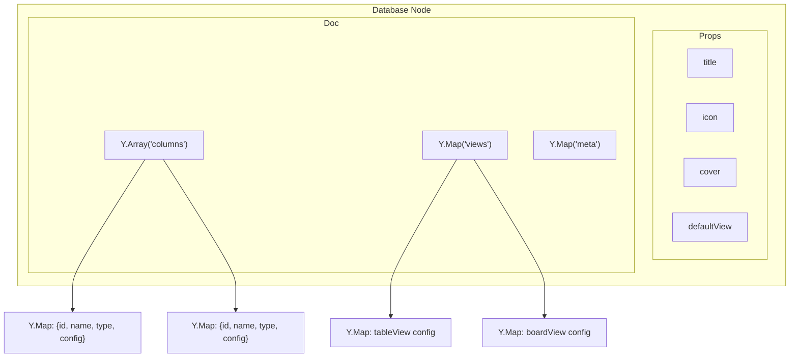

# 03: Column Y.Doc Structure

> CRDT-based column definitions and view configurations

**Duration:** 3-4 days
**Dependencies:** `@xnet/sync` (Yjs integration), `@xnet/data` (Database schema)

## Overview

Column definitions and view configurations are stored in the Database's Y.Doc, not in NodeStore properties. This gives us:

1. **CRDT column ordering** - Concurrent column reorders merge correctly
2. **Real-time schema sync** - Column changes appear instantly on all devices
3. **Collaborative views** - Multiple users can edit filters/sorts simultaneously



## Y.Doc Structure

```typescript
// Database Y.Doc schema

interface DatabaseDoc {
  /** Column definitions as Y.Array for CRDT ordering */
  columns: Y.Array<Y.Map<unknown>>

  /** View configurations keyed by view ID */
  views: Y.Map<Y.Map<unknown>>

  /** Metadata (row count cache, etc.) */
  meta: Y.Map<unknown>
}
```

### Column Definition (Y.Map)

```typescript
// packages/data/src/database/column-types.ts

interface ColumnDefinition {
  /** Unique column ID (nanoid) */
  id: string

  /** Display name */
  name: string

  /** Column type */
  type: ColumnType

  /** Type-specific configuration */
  config: ColumnConfig

  /** Width in pixels (for table view) */
  width?: number

  /** Whether this is the title column */
  isTitle?: boolean
}

type ColumnType =
  // Simple types (stored in NodeStore)
  | 'text'
  | 'number'
  | 'checkbox'
  | 'date'
  | 'dateRange'
  | 'select'
  | 'multiSelect'
  | 'person'
  | 'url'
  | 'email'
  | 'phone'
  | 'file'
  // Relation types
  | 'relation'
  // Computed types
  | 'rollup'
  | 'formula'
  // Rich types (stored in Y.Doc)
  | 'richText'
  // Auto types
  | 'created'
  | 'createdBy'
  | 'updated'
  | 'updatedBy'

type ColumnConfig =
  | TextColumnConfig
  | NumberColumnConfig
  | SelectColumnConfig
  | RelationColumnConfig
  | RollupColumnConfig
  | FormulaColumnConfig
  | DateColumnConfig
  | FileColumnConfig
  | {} // For simple types with no config
```

### Config Types

```typescript
// packages/data/src/database/column-configs.ts

interface TextColumnConfig {
  /** Maximum length (optional) */
  maxLength?: number
}

interface NumberColumnConfig {
  /** Number format */
  format?: 'number' | 'percent' | 'currency'
  /** Currency code (if format is currency) */
  currency?: string
  /** Decimal places */
  precision?: number
}

interface SelectColumnConfig {
  /** Available options */
  options: SelectOption[]
  /** Allow creating new options inline */
  allowCreate?: boolean
}

interface SelectOption {
  id: string
  name: string
  color?: SelectColor
}

type SelectColor =
  | 'gray'
  | 'brown'
  | 'orange'
  | 'yellow'
  | 'green'
  | 'blue'
  | 'purple'
  | 'pink'
  | 'red'

interface RelationColumnConfig {
  /** Target database ID */
  targetDatabase: string
  /** Allow multiple relations */
  allowMultiple?: boolean
}

interface RollupColumnConfig {
  /** Column ID of the relation to aggregate */
  relationColumn: string
  /** Column ID on related rows to aggregate */
  targetColumn: string
  /** Aggregation function */
  aggregation: RollupAggregation
}

type RollupAggregation =
  | 'sum'
  | 'avg'
  | 'count'
  | 'min'
  | 'max'
  | 'concat'
  | 'unique'
  | 'empty'
  | 'notEmpty'
  | 'percentEmpty'
  | 'percentNotEmpty'

interface FormulaColumnConfig {
  /** Formula expression with {{columnId}} references */
  expression: string
  /** Result type */
  resultType: 'text' | 'number' | 'date' | 'checkbox'
}

interface DateColumnConfig {
  /** Include time */
  includeTime?: boolean
  /** Date format */
  format?: 'full' | 'short' | 'relative'
}

interface FileColumnConfig {
  /** Accepted MIME types */
  accept?: string[]
  /** Allow multiple files */
  allowMultiple?: boolean
}
```

## Y.Doc Operations

### Initialize Database Doc

```typescript
// packages/data/src/database/database-doc.ts

import * as Y from 'yjs'
import { nanoid } from 'nanoid'

/**
 * Initialize the Y.Doc structure for a new database.
 */
export function initializeDatabaseDoc(doc: Y.Doc): void {
  doc.transact(() => {
    // Create columns array if not exists
    if (!doc.share.has('columns')) {
      doc.getArray('columns')
    }

    // Create views map if not exists
    if (!doc.share.has('views')) {
      doc.getMap('views')
    }

    // Create meta map if not exists
    if (!doc.share.has('meta')) {
      doc.getMap('meta')
    }
  })
}

/**
 * Add a default title column to a new database.
 */
export function addDefaultTitleColumn(doc: Y.Doc): string {
  const columns = doc.getArray('columns')
  const columnId = nanoid()

  const column = new Y.Map()
  column.set('id', columnId)
  column.set('name', 'Title')
  column.set('type', 'text')
  column.set('config', {})
  column.set('isTitle', true)
  column.set('width', 300)

  columns.push([column])

  return columnId
}

/**
 * Add a default table view to a new database.
 */
export function addDefaultTableView(doc: Y.Doc): string {
  const views = doc.getMap('views')
  const columns = doc.getArray('columns')
  const viewId = nanoid()

  // Get all column IDs for visibility
  const visibleColumns: string[] = []
  columns.forEach((col) => {
    visibleColumns.push(col.get('id') as string)
  })

  const view = new Y.Map()
  view.set('id', viewId)
  view.set('name', 'Default View')
  view.set('type', 'table')
  view.set('visibleColumns', visibleColumns)
  view.set('filters', null)
  view.set('sorts', [])
  view.set('groupBy', null)

  views.set(viewId, view)

  return viewId
}
```

### Column Operations

```typescript
// packages/data/src/database/column-operations.ts

import * as Y from 'yjs'
import { nanoid } from 'nanoid'
import type { ColumnDefinition, ColumnType, ColumnConfig } from './column-types'

/**
 * Get all columns from a database doc.
 */
export function getColumns(doc: Y.Doc): ColumnDefinition[] {
  const columns = doc.getArray('columns')
  const result: ColumnDefinition[] = []

  columns.forEach((col: Y.Map<unknown>) => {
    result.push({
      id: col.get('id') as string,
      name: col.get('name') as string,
      type: col.get('type') as ColumnType,
      config: col.get('config') as ColumnConfig,
      width: col.get('width') as number | undefined,
      isTitle: col.get('isTitle') as boolean | undefined
    })
  })

  return result
}

/**
 * Get a single column by ID.
 */
export function getColumn(doc: Y.Doc, columnId: string): ColumnDefinition | null {
  const columns = doc.getArray('columns')

  for (let i = 0; i < columns.length; i++) {
    const col = columns.get(i) as Y.Map<unknown>
    if (col.get('id') === columnId) {
      return {
        id: col.get('id') as string,
        name: col.get('name') as string,
        type: col.get('type') as ColumnType,
        config: col.get('config') as ColumnConfig,
        width: col.get('width') as number | undefined,
        isTitle: col.get('isTitle') as boolean | undefined
      }
    }
  }

  return null
}

/**
 * Create a new column.
 */
export function createColumn(doc: Y.Doc, definition: Omit<ColumnDefinition, 'id'>): string {
  const columns = doc.getArray('columns')
  const columnId = nanoid()

  doc.transact(() => {
    const column = new Y.Map()
    column.set('id', columnId)
    column.set('name', definition.name)
    column.set('type', definition.type)
    column.set('config', definition.config ?? {})
    if (definition.width) column.set('width', definition.width)
    if (definition.isTitle) column.set('isTitle', definition.isTitle)

    columns.push([column])

    // Add to all views' visible columns
    const views = doc.getMap('views')
    views.forEach((view: Y.Map<unknown>) => {
      const visible = view.get('visibleColumns') as string[]
      if (visible) {
        view.set('visibleColumns', [...visible, columnId])
      }
    })
  })

  return columnId
}

/**
 * Update a column's properties.
 */
export function updateColumn(
  doc: Y.Doc,
  columnId: string,
  updates: Partial<Omit<ColumnDefinition, 'id'>>
): void {
  const columns = doc.getArray('columns')

  doc.transact(() => {
    for (let i = 0; i < columns.length; i++) {
      const col = columns.get(i) as Y.Map<unknown>
      if (col.get('id') === columnId) {
        if (updates.name !== undefined) col.set('name', updates.name)
        if (updates.type !== undefined) col.set('type', updates.type)
        if (updates.config !== undefined) col.set('config', updates.config)
        if (updates.width !== undefined) col.set('width', updates.width)
        if (updates.isTitle !== undefined) col.set('isTitle', updates.isTitle)
        break
      }
    }
  })
}

/**
 * Delete a column.
 */
export function deleteColumn(doc: Y.Doc, columnId: string): void {
  const columns = doc.getArray('columns')

  doc.transact(() => {
    // Find and remove column
    for (let i = 0; i < columns.length; i++) {
      const col = columns.get(i) as Y.Map<unknown>
      if (col.get('id') === columnId) {
        columns.delete(i, 1)
        break
      }
    }

    // Remove from all views' visible columns
    const views = doc.getMap('views')
    views.forEach((view: Y.Map<unknown>) => {
      const visible = view.get('visibleColumns') as string[]
      if (visible) {
        view.set(
          'visibleColumns',
          visible.filter((id) => id !== columnId)
        )
      }
    })
  })
}

/**
 * Reorder a column to a new position.
 */
export function reorderColumn(doc: Y.Doc, columnId: string, newIndex: number): void {
  const columns = doc.getArray('columns')

  doc.transact(() => {
    // Find current index
    let currentIndex = -1
    for (let i = 0; i < columns.length; i++) {
      const col = columns.get(i) as Y.Map<unknown>
      if (col.get('id') === columnId) {
        currentIndex = i
        break
      }
    }

    if (currentIndex === -1 || currentIndex === newIndex) return

    // Remove from current position
    const [column] = columns.toArray().splice(currentIndex, 1)

    // Y.Array doesn't have a move operation, so we rebuild
    // This is safe because we're in a transaction
    const all = columns.toArray()
    columns.delete(0, columns.length)

    all.splice(currentIndex, 1)
    all.splice(newIndex, 0, column)

    columns.push(all)
  })
}
```

### View Operations

```typescript
// packages/data/src/database/view-operations.ts

import * as Y from 'yjs'
import { nanoid } from 'nanoid'
import type { ViewConfig, ViewType, FilterGroup, SortConfig } from './view-types'

/**
 * Get all views from a database doc.
 */
export function getViews(doc: Y.Doc): ViewConfig[] {
  const views = doc.getMap('views')
  const result: ViewConfig[] = []

  views.forEach((view: Y.Map<unknown>, id: string) => {
    result.push(viewMapToConfig(view, id))
  })

  return result
}

/**
 * Get a single view by ID.
 */
export function getView(doc: Y.Doc, viewId: string): ViewConfig | null {
  const views = doc.getMap('views')
  const view = views.get(viewId) as Y.Map<unknown> | undefined

  if (!view) return null
  return viewMapToConfig(view, viewId)
}

function viewMapToConfig(view: Y.Map<unknown>, id: string): ViewConfig {
  return {
    id,
    name: view.get('name') as string,
    type: view.get('type') as ViewType,
    visibleColumns: view.get('visibleColumns') as string[],
    columnWidths: view.get('columnWidths') as Record<string, number> | undefined,
    filters: view.get('filters') as FilterGroup | null,
    sorts: view.get('sorts') as SortConfig[],
    groupBy: view.get('groupBy') as string | null,
    groupSort: view.get('groupSort') as 'asc' | 'desc' | undefined,
    collapsedGroups: view.get('collapsedGroups') as string[] | undefined,
    // View-specific
    coverColumn: view.get('coverColumn') as string | undefined,
    cardSize: view.get('cardSize') as 'small' | 'medium' | 'large' | undefined,
    dateColumn: view.get('dateColumn') as string | undefined,
    endDateColumn: view.get('endDateColumn') as string | undefined
  }
}

/**
 * Create a new view.
 */
export function createView(doc: Y.Doc, config: Omit<ViewConfig, 'id'>): string {
  const views = doc.getMap('views')
  const viewId = nanoid()

  doc.transact(() => {
    const view = new Y.Map()
    view.set('name', config.name)
    view.set('type', config.type)
    view.set('visibleColumns', config.visibleColumns)
    if (config.columnWidths) view.set('columnWidths', config.columnWidths)
    view.set('filters', config.filters ?? null)
    view.set('sorts', config.sorts ?? [])
    view.set('groupBy', config.groupBy ?? null)
    if (config.groupSort) view.set('groupSort', config.groupSort)
    if (config.collapsedGroups) view.set('collapsedGroups', config.collapsedGroups)
    if (config.coverColumn) view.set('coverColumn', config.coverColumn)
    if (config.cardSize) view.set('cardSize', config.cardSize)
    if (config.dateColumn) view.set('dateColumn', config.dateColumn)
    if (config.endDateColumn) view.set('endDateColumn', config.endDateColumn)

    views.set(viewId, view)
  })

  return viewId
}

/**
 * Update a view's properties.
 */
export function updateView(
  doc: Y.Doc,
  viewId: string,
  updates: Partial<Omit<ViewConfig, 'id'>>
): void {
  const views = doc.getMap('views')
  const view = views.get(viewId) as Y.Map<unknown> | undefined

  if (!view) return

  doc.transact(() => {
    for (const [key, value] of Object.entries(updates)) {
      view.set(key, value)
    }
  })
}

/**
 * Delete a view.
 */
export function deleteView(doc: Y.Doc, viewId: string): void {
  const views = doc.getMap('views')
  views.delete(viewId)
}

/**
 * Duplicate a view.
 */
export function duplicateView(doc: Y.Doc, viewId: string, newName?: string): string {
  const existingView = getView(doc, viewId)
  if (!existingView) {
    throw new Error(`View ${viewId} not found`)
  }

  return createView(doc, {
    ...existingView,
    name: newName ?? `${existingView.name} (Copy)`
  })
}
```

## View Types

```typescript
// packages/data/src/database/view-types.ts

type ViewType = 'table' | 'board' | 'list' | 'gallery' | 'calendar' | 'timeline'

interface ViewConfig {
  id: string
  name: string
  type: ViewType

  // Column visibility and order
  visibleColumns: string[]
  columnWidths?: Record<string, number>

  // Filtering
  filters?: FilterGroup | null

  // Sorting
  sorts?: SortConfig[]

  // Grouping
  groupBy?: string | null
  groupSort?: 'asc' | 'desc'
  collapsedGroups?: string[]

  // Gallery/Board specific
  coverColumn?: string
  cardSize?: 'small' | 'medium' | 'large'

  // Calendar/Timeline specific
  dateColumn?: string
  endDateColumn?: string
}

interface FilterGroup {
  operator: 'and' | 'or'
  conditions: Array<FilterCondition | FilterGroup>
}

interface FilterCondition {
  columnId: string
  operator: FilterOperator
  value: unknown
}

type FilterOperator =
  | 'equals'
  | 'notEquals'
  | 'contains'
  | 'notContains'
  | 'startsWith'
  | 'endsWith'
  | 'isEmpty'
  | 'isNotEmpty'
  | 'greaterThan'
  | 'lessThan'
  | 'greaterOrEqual'
  | 'lessOrEqual'
  | 'before'
  | 'after'
  | 'between'
  | 'hasAny'
  | 'hasAll'
  | 'hasNone'

interface SortConfig {
  columnId: string
  direction: 'asc' | 'desc'
}
```

## React Integration

```typescript
// packages/react/src/hooks/useDatabaseDoc.ts

import { useEffect, useState, useCallback } from 'react'
import * as Y from 'yjs'
import { useNode } from './useNode'
import { getColumns, createColumn, updateColumn, deleteColumn, reorderColumn } from '@xnet/data'
import type { ColumnDefinition, ColumnType, ColumnConfig } from '@xnet/data'

export interface UseDatabaseDocResult {
  /** All column definitions */
  columns: ColumnDefinition[]

  /** All view configurations */
  views: ViewConfig[]

  /** Column operations */
  createColumn: (def: Omit<ColumnDefinition, 'id'>) => string
  updateColumn: (id: string, updates: Partial<ColumnDefinition>) => void
  deleteColumn: (id: string) => void
  reorderColumn: (id: string, newIndex: number) => void

  /** View operations */
  createView: (config: Omit<ViewConfig, 'id'>) => string
  updateView: (id: string, updates: Partial<ViewConfig>) => void
  deleteView: (id: string) => void
  duplicateView: (id: string, newName?: string) => string

  /** Y.Doc for direct access */
  doc: Y.Doc | null
}

export function useDatabaseDoc(databaseId: string): UseDatabaseDocResult {
  const { doc } = useNode(DatabaseSchema, databaseId)
  const [columns, setColumns] = useState<ColumnDefinition[]>([])
  const [views, setViews] = useState<ViewConfig[]>([])

  // Subscribe to column changes
  useEffect(() => {
    if (!doc) return

    const columnsArray = doc.getArray('columns')

    const updateColumns = () => {
      setColumns(getColumns(doc))
    }

    columnsArray.observe(updateColumns)
    updateColumns() // Initial load

    return () => {
      columnsArray.unobserve(updateColumns)
    }
  }, [doc])

  // Subscribe to view changes
  useEffect(() => {
    if (!doc) return

    const viewsMap = doc.getMap('views')

    const updateViews = () => {
      setViews(getViews(doc))
    }

    viewsMap.observe(updateViews)
    updateViews() // Initial load

    return () => {
      viewsMap.unobserve(updateViews)
    }
  }, [doc])

  // Column operations
  const handleCreateColumn = useCallback(
    (def: Omit<ColumnDefinition, 'id'>) => {
      if (!doc) throw new Error('Doc not loaded')
      return createColumn(doc, def)
    },
    [doc]
  )

  const handleUpdateColumn = useCallback(
    (id: string, updates: Partial<ColumnDefinition>) => {
      if (!doc) throw new Error('Doc not loaded')
      updateColumn(doc, id, updates)
    },
    [doc]
  )

  const handleDeleteColumn = useCallback(
    (id: string) => {
      if (!doc) throw new Error('Doc not loaded')
      deleteColumn(doc, id)
    },
    [doc]
  )

  const handleReorderColumn = useCallback(
    (id: string, newIndex: number) => {
      if (!doc) throw new Error('Doc not loaded')
      reorderColumn(doc, id, newIndex)
    },
    [doc]
  )

  // View operations
  const handleCreateView = useCallback(
    (config: Omit<ViewConfig, 'id'>) => {
      if (!doc) throw new Error('Doc not loaded')
      return createView(doc, config)
    },
    [doc]
  )

  const handleUpdateView = useCallback(
    (id: string, updates: Partial<ViewConfig>) => {
      if (!doc) throw new Error('Doc not loaded')
      updateView(doc, id, updates)
    },
    [doc]
  )

  const handleDeleteView = useCallback(
    (id: string) => {
      if (!doc) throw new Error('Doc not loaded')
      deleteView(doc, id)
    },
    [doc]
  )

  const handleDuplicateView = useCallback(
    (id: string, newName?: string) => {
      if (!doc) throw new Error('Doc not loaded')
      return duplicateView(doc, id, newName)
    },
    [doc]
  )

  return {
    columns,
    views,
    createColumn: handleCreateColumn,
    updateColumn: handleUpdateColumn,
    deleteColumn: handleDeleteColumn,
    reorderColumn: handleReorderColumn,
    createView: handleCreateView,
    updateView: handleUpdateView,
    deleteView: handleDeleteView,
    duplicateView: handleDuplicateView,
    doc
  }
}
```

## Testing

```typescript
describe('Column Operations', () => {
  let doc: Y.Doc

  beforeEach(() => {
    doc = new Y.Doc()
    initializeDatabaseDoc(doc)
  })

  describe('createColumn', () => {
    it('adds column to array', () => {
      const id = createColumn(doc, {
        name: 'Status',
        type: 'select',
        config: {
          options: [
            { id: 'todo', name: 'To Do', color: 'gray' },
            { id: 'done', name: 'Done', color: 'green' }
          ]
        }
      })

      const columns = getColumns(doc)
      expect(columns).toHaveLength(1)
      expect(columns[0].id).toBe(id)
      expect(columns[0].name).toBe('Status')
      expect(columns[0].type).toBe('select')
    })

    it('adds column to all views', () => {
      addDefaultTableView(doc)

      const id = createColumn(doc, {
        name: 'New Column',
        type: 'text',
        config: {}
      })

      const views = getViews(doc)
      expect(views[0].visibleColumns).toContain(id)
    })
  })

  describe('updateColumn', () => {
    it('updates column properties', () => {
      const id = createColumn(doc, {
        name: 'Status',
        type: 'select',
        config: { options: [] }
      })

      updateColumn(doc, id, { name: 'Project Status' })

      const column = getColumn(doc, id)
      expect(column?.name).toBe('Project Status')
    })
  })

  describe('deleteColumn', () => {
    it('removes column from array', () => {
      const id = createColumn(doc, {
        name: 'Status',
        type: 'text',
        config: {}
      })

      deleteColumn(doc, id)

      const columns = getColumns(doc)
      expect(columns).toHaveLength(0)
    })

    it('removes from view visibility', () => {
      addDefaultTableView(doc)
      const id = createColumn(doc, {
        name: 'Status',
        type: 'text',
        config: {}
      })

      deleteColumn(doc, id)

      const views = getViews(doc)
      expect(views[0].visibleColumns).not.toContain(id)
    })
  })

  describe('reorderColumn', () => {
    it('moves column to new position', () => {
      const id1 = createColumn(doc, { name: 'A', type: 'text', config: {} })
      const id2 = createColumn(doc, { name: 'B', type: 'text', config: {} })
      const id3 = createColumn(doc, { name: 'C', type: 'text', config: {} })

      reorderColumn(doc, id3, 0)

      const columns = getColumns(doc)
      expect(columns.map((c) => c.id)).toEqual([id3, id1, id2])
    })
  })
})

describe('View Operations', () => {
  let doc: Y.Doc

  beforeEach(() => {
    doc = new Y.Doc()
    initializeDatabaseDoc(doc)
    createColumn(doc, { name: 'Title', type: 'text', config: {}, isTitle: true })
  })

  describe('createView', () => {
    it('creates view with config', () => {
      const columns = getColumns(doc)

      const id = createView(doc, {
        name: 'Board View',
        type: 'board',
        visibleColumns: columns.map((c) => c.id),
        groupBy: columns[0].id
      })

      const view = getView(doc, id)
      expect(view?.name).toBe('Board View')
      expect(view?.type).toBe('board')
      expect(view?.groupBy).toBe(columns[0].id)
    })
  })

  describe('updateView', () => {
    it('updates filters', () => {
      const viewId = addDefaultTableView(doc)

      updateView(doc, viewId, {
        filters: {
          operator: 'and',
          conditions: [{ columnId: 'col1', operator: 'isNotEmpty', value: null }]
        }
      })

      const view = getView(doc, viewId)
      expect(view?.filters?.operator).toBe('and')
    })
  })

  describe('duplicateView', () => {
    it('creates copy with new name', () => {
      const viewId = addDefaultTableView(doc)

      const copyId = duplicateView(doc, viewId, 'My Copy')

      const copy = getView(doc, copyId)
      expect(copy?.name).toBe('My Copy')
      expect(copy?.type).toBe('table')
    })
  })
})

describe('CRDT Behavior', () => {
  it('merges concurrent column renames', () => {
    const doc1 = new Y.Doc()
    const doc2 = new Y.Doc()

    initializeDatabaseDoc(doc1)
    const colId = createColumn(doc1, { name: 'Status', type: 'text', config: {} })

    // Sync doc1 -> doc2
    Y.applyUpdate(doc2, Y.encodeStateAsUpdate(doc1))

    // Concurrent updates
    updateColumn(doc1, colId, { name: 'Project Status' })
    updateColumn(doc2, colId, { width: 200 })

    // Sync both ways
    Y.applyUpdate(doc2, Y.encodeStateAsUpdate(doc1))
    Y.applyUpdate(doc1, Y.encodeStateAsUpdate(doc2))

    // Both changes should merge
    const col1 = getColumn(doc1, colId)
    const col2 = getColumn(doc2, colId)

    expect(col1?.name).toBe('Project Status')
    expect(col1?.width).toBe(200)
    expect(col2?.name).toBe('Project Status')
    expect(col2?.width).toBe(200)
  })
})
```

## Validation Gate

- [x] `initializeDatabaseDoc()` creates columns array, views map, meta map
- [x] `createColumn()` adds Y.Map to columns array
- [x] `updateColumn()` modifies column properties
- [x] `deleteColumn()` removes from array and all views
- [x] `reorderColumn()` moves column to new position
- [x] `createView()` adds view to views map
- [x] `updateView()` modifies view config
- [x] `deleteView()` removes from map
- [x] Concurrent column edits merge correctly (CRDT)
- [x] Column order syncs across devices
- [x] `useDatabaseDoc()` hook reactively updates
- [x] All tests pass

---

[Back to README](./README.md) | [Previous: Fractional Indexing](./02-fractional-indexing.md) | [Next: React Hooks ->](./04-react-hooks.md)
