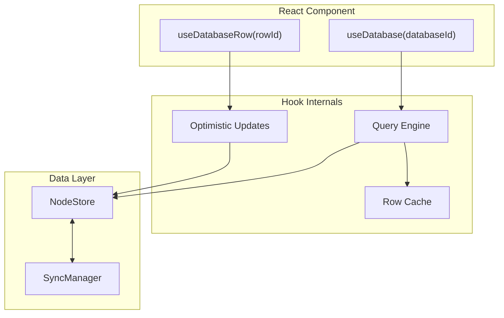

# 04: React Hooks

> useDatabase and useDatabaseRow hooks for database operations

**Duration:** 4-5 days
**Dependencies:** `@xnet/react` (useNode), `@xnet/data` (NodeStore, row operations)

## Overview

The React hooks provide a clean API for database operations, handling pagination, mutations, and real-time updates. The main hooks are:

- **`useDatabase`** — Query rows with filters, sorts, and pagination
- **`useDatabaseRow`** — Single row operations with optimistic updates
- **`useDatabaseDoc`** — Column and view operations (covered in 03)



## useDatabase Hook

```typescript
// packages/react/src/hooks/useDatabase.ts

import { useState, useEffect, useCallback, useMemo, useRef } from 'react'
import { useStore } from './useStore'
import { useDatabaseDoc } from './useDatabaseDoc'
import { queryRows, createRow, updateCell, deleteRow, moveRow } from '@xnet/data'
import type { Node, ColumnDefinition, ViewConfig, FilterGroup, SortConfig } from '@xnet/data'

export interface UseDatabaseOptions {
  /** Active view ID (uses default if not specified) */
  view?: string

  /** Override view filters */
  filters?: FilterGroup

  /** Override view sorts */
  sorts?: SortConfig[]

  /** Search query (full-text search) */
  search?: string

  /** Page size (default: 50) */
  pageSize?: number
}

export interface UseDatabaseResult {
  // Database metadata
  database: Node | null
  columns: ColumnDefinition[]
  views: ViewConfig[]

  // Row data (paginated)
  rows: DatabaseRow[]
  total: number
  hasMore: boolean
  loadMore: () => Promise<void>

  // Current view
  activeView: ViewConfig | null
  setActiveView: (viewId: string) => void

  // Row mutations
  createRow: (values?: Record<string, unknown>) => Promise<string>
  updateRow: (rowId: string, values: Record<string, unknown>) => Promise<void>
  deleteRow: (rowId: string) => Promise<void>
  reorderRow: (rowId: string, before?: string, after?: string) => Promise<void>

  // Batch operations
  deleteRows: (rowIds: string[]) => Promise<void>

  // Query state
  loading: boolean
  loadingMore: boolean
  error: Error | null
  refetch: () => Promise<void>
}

export interface DatabaseRow {
  id: string
  sortKey: string
  cells: Record<string, unknown>
  createdAt: number
  createdBy: string
}

export function useDatabase(
  databaseId: string,
  options: UseDatabaseOptions = {}
): UseDatabaseResult {
  const store = useStore()
  const { columns, views, doc } = useDatabaseDoc(databaseId)

  const [database, setDatabase] = useState<Node | null>(null)
  const [rows, setRows] = useState<DatabaseRow[]>([])
  const [total, setTotal] = useState(0)
  const [cursor, setCursor] = useState<string | undefined>()
  const [hasMore, setHasMore] = useState(false)
  const [loading, setLoading] = useState(true)
  const [loadingMore, setLoadingMore] = useState(false)
  const [error, setError] = useState<Error | null>(null)
  const [activeViewId, setActiveViewId] = useState(options.view)

  const { pageSize = 50, filters, sorts, search } = options

  // Get active view config
  const activeView = useMemo(() => {
    if (activeViewId) {
      return views.find((v) => v.id === activeViewId) ?? null
    }
    return views[0] ?? null
  }, [views, activeViewId])

  // Merge options with view config
  const effectiveFilters = filters ?? activeView?.filters ?? null
  const effectiveSorts = sorts ?? activeView?.sorts ?? []

  // Load database node
  useEffect(() => {
    store.get(databaseId).then(setDatabase).catch(setError)
  }, [store, databaseId])

  // Query rows
  const fetchRows = useCallback(
    async (reset = true) => {
      try {
        if (reset) {
          setLoading(true)
          setCursor(undefined)
        } else {
          setLoadingMore(true)
        }

        const result = await queryRows(store, databaseId, {
          limit: pageSize,
          cursor: reset ? undefined : cursor,
          filters: effectiveFilters,
          sorts: effectiveSorts,
          search
        })

        const parsedRows = result.rows.map((node) => nodeToRow(node, columns))

        if (reset) {
          setRows(parsedRows)
        } else {
          setRows((prev) => [...prev, ...parsedRows])
        }

        setTotal(result.total ?? parsedRows.length)
        setCursor(result.cursor)
        setHasMore(result.hasMore)
        setError(null)
      } catch (err) {
        setError(err instanceof Error ? err : new Error(String(err)))
      } finally {
        setLoading(false)
        setLoadingMore(false)
      }
    },
    [store, databaseId, pageSize, cursor, effectiveFilters, effectiveSorts, search, columns]
  )

  // Initial fetch
  useEffect(() => {
    fetchRows(true)
  }, [databaseId, effectiveFilters, effectiveSorts, search])

  // Subscribe to row changes
  useEffect(() => {
    const unsubscribe = store.subscribe(
      {
        schema: 'xnet://xnet.fyi/DatabaseRow',
        where: { 'properties.database': databaseId }
      },
      () => {
        // Refetch on changes
        fetchRows(true)
      }
    )

    return unsubscribe
  }, [store, databaseId, fetchRows])

  // Load more
  const loadMore = useCallback(async () => {
    if (!hasMore || loadingMore) return
    await fetchRows(false)
  }, [hasMore, loadingMore, fetchRows])

  // Create row
  const handleCreateRow = useCallback(
    async (values?: Record<string, unknown>) => {
      const lastRow = rows[rows.length - 1]

      const rowId = await createRow(store, {
        databaseId,
        cells: values ?? {},
        after: lastRow?.sortKey
      })

      return rowId
    },
    [store, databaseId, rows]
  )

  // Update row
  const handleUpdateRow = useCallback(
    async (rowId: string, values: Record<string, unknown>) => {
      await updateCells(store, rowId, values)
    },
    [store]
  )

  // Delete row
  const handleDeleteRow = useCallback(
    async (rowId: string) => {
      await deleteRow(store, rowId)
    },
    [store]
  )

  // Reorder row
  const handleReorderRow = useCallback(
    async (rowId: string, before?: string, after?: string) => {
      await moveRow(store, rowId, { before, after })
    },
    [store]
  )

  // Delete multiple rows
  const handleDeleteRows = useCallback(
    async (rowIds: string[]) => {
      await Promise.all(rowIds.map((id) => deleteRow(store, id)))
    },
    [store]
  )

  return {
    database,
    columns,
    views,
    rows,
    total,
    hasMore,
    loadMore,
    activeView,
    setActiveView: setActiveViewId,
    createRow: handleCreateRow,
    updateRow: handleUpdateRow,
    deleteRow: handleDeleteRow,
    reorderRow: handleReorderRow,
    deleteRows: handleDeleteRows,
    loading,
    loadingMore,
    error,
    refetch: () => fetchRows(true)
  }
}

/**
 * Convert a Node to a DatabaseRow.
 */
function nodeToRow(node: Node, columns: ColumnDefinition[]): DatabaseRow {
  const cells: Record<string, unknown> = {}

  for (const col of columns) {
    const cellKey = `cell_${col.id}`
    if (cellKey in node.properties) {
      cells[col.id] = node.properties[cellKey]
    }
  }

  return {
    id: node.id,
    sortKey: node.properties.sortKey as string,
    cells,
    createdAt: node.createdAt,
    createdBy: node.createdBy
  }
}
```

## useDatabaseRow Hook

```typescript
// packages/react/src/hooks/useDatabaseRow.ts

import { useState, useEffect, useCallback, useRef } from 'react'
import * as Y from 'yjs'
import { useStore } from './useStore'
import { updateCell, deleteRow } from '@xnet/data'
import type { Node, ColumnDefinition } from '@xnet/data'

export interface UseDatabaseRowResult {
  /** Row data */
  row: DatabaseRow | null

  /** Y.Doc for rich text cells (if any) */
  doc: Y.Doc | null

  /** Update cell values */
  update: (values: Record<string, unknown>) => Promise<void>

  /** Delete this row */
  delete: () => Promise<void>

  /** Get computed value for a column */
  getComputed: (columnId: string) => unknown

  /** Loading state */
  loading: boolean

  /** Error state */
  error: Error | null
}

export function useDatabaseRow(rowId: string): UseDatabaseRowResult {
  const store = useStore()

  const [row, setRow] = useState<DatabaseRow | null>(null)
  const [doc, setDoc] = useState<Y.Doc | null>(null)
  const [loading, setLoading] = useState(true)
  const [error, setError] = useState<Error | null>(null)

  // Optimistic update cache
  const optimisticRef = useRef<Record<string, unknown>>({})

  // Load row
  useEffect(() => {
    let mounted = true

    const load = async () => {
      try {
        setLoading(true)
        const node = await store.get(rowId)

        if (!mounted) return

        if (node) {
          // Get database to get columns
          const databaseId = node.properties.database as string
          const databaseDoc = await store.getDoc(databaseId)
          const columns = getColumns(databaseDoc)

          setRow(nodeToRow(node, columns))

          // Load row doc if exists
          const rowDoc = await store.getDoc(rowId)
          setDoc(rowDoc)
        } else {
          setRow(null)
          setDoc(null)
        }

        setError(null)
      } catch (err) {
        if (!mounted) return
        setError(err instanceof Error ? err : new Error(String(err)))
      } finally {
        if (mounted) setLoading(false)
      }
    }

    load()

    // Subscribe to changes
    const unsubscribe = store.subscribe({ id: rowId }, load)

    return () => {
      mounted = false
      unsubscribe()
    }
  }, [store, rowId])

  // Update with optimistic UI
  const handleUpdate = useCallback(
    async (values: Record<string, unknown>) => {
      // Apply optimistic update
      optimisticRef.current = { ...optimisticRef.current, ...values }
      setRow((prev) =>
        prev
          ? {
              ...prev,
              cells: { ...prev.cells, ...values }
            }
          : null
      )

      try {
        await updateCells(store, rowId, values)
        // Clear optimistic cache on success
        for (const key of Object.keys(values)) {
          delete optimisticRef.current[key]
        }
      } catch (err) {
        // Revert optimistic update on error
        setRow((prev) => {
          if (!prev) return null
          const reverted = { ...prev.cells }
          for (const key of Object.keys(values)) {
            delete reverted[key]
          }
          return { ...prev, cells: reverted }
        })
        throw err
      }
    },
    [store, rowId]
  )

  // Delete
  const handleDelete = useCallback(async () => {
    await deleteRow(store, rowId)
  }, [store, rowId])

  // Get computed value (placeholder for computed column implementation)
  const getComputed = useCallback(
    (columnId: string) => {
      // Will be implemented in computed columns step
      return null
    },
    [row]
  )

  return {
    row,
    doc,
    update: handleUpdate,
    delete: handleDelete,
    getComputed,
    loading,
    error
  }
}
```

## useCell Hook

```typescript
// packages/react/src/hooks/useCell.ts

import { useState, useEffect, useCallback, useRef } from 'react'
import { useStore } from './useStore'
import { updateCell } from '@xnet/data'

export interface UseCellResult<T = unknown> {
  /** Cell value */
  value: T

  /** Update cell value */
  setValue: (value: T) => Promise<void>

  /** Clear cell value */
  clear: () => Promise<void>

  /** Whether cell is being saved */
  saving: boolean

  /** Error from last save */
  error: Error | null
}

export function useCell<T = unknown>(
  rowId: string,
  columnId: string,
  defaultValue?: T
): UseCellResult<T> {
  const store = useStore()

  const [value, setValue] = useState<T>(defaultValue as T)
  const [saving, setSaving] = useState(false)
  const [error, setError] = useState<Error | null>(null)

  // Debounce timer for auto-save
  const debounceRef = useRef<ReturnType<typeof setTimeout>>()

  // Load initial value
  useEffect(() => {
    store.get(rowId).then((node) => {
      if (node) {
        const cellKey = `cell_${columnId}`
        setValue((node.properties[cellKey] as T) ?? (defaultValue as T))
      }
    })
  }, [store, rowId, columnId, defaultValue])

  // Subscribe to changes
  useEffect(() => {
    const unsubscribe = store.subscribe({ id: rowId }, async () => {
      const node = await store.get(rowId)
      if (node) {
        const cellKey = `cell_${columnId}`
        setValue((node.properties[cellKey] as T) ?? (defaultValue as T))
      }
    })

    return unsubscribe
  }, [store, rowId, columnId, defaultValue])

  // Set value with debounced save
  const handleSetValue = useCallback(
    async (newValue: T) => {
      // Optimistic update
      setValue(newValue)
      setError(null)

      // Cancel pending save
      if (debounceRef.current) {
        clearTimeout(debounceRef.current)
      }

      // Debounce save
      debounceRef.current = setTimeout(async () => {
        try {
          setSaving(true)
          await updateCell(store, rowId, columnId, newValue)
        } catch (err) {
          setError(err instanceof Error ? err : new Error(String(err)))
        } finally {
          setSaving(false)
        }
      }, 300)
    },
    [store, rowId, columnId]
  )

  // Clear value
  const clear = useCallback(async () => {
    await handleSetValue(null as T)
  }, [handleSetValue])

  // Cleanup
  useEffect(() => {
    return () => {
      if (debounceRef.current) {
        clearTimeout(debounceRef.current)
      }
    }
  }, [])

  return {
    value,
    setValue: handleSetValue,
    clear,
    saving,
    error
  }
}
```

## Usage Examples

### Basic Database View

```tsx
function DatabaseView({ databaseId }: { databaseId: string }) {
  const { columns, rows, loading, hasMore, loadMore, createRow, activeView } =
    useDatabase(databaseId)

  if (loading) return <Skeleton />

  return (
    <div>
      <ViewTabs views={views} activeView={activeView} />

      <Table>
        <TableHeader>
          {columns.map((col) => (
            <TableHead key={col.id}>{col.name}</TableHead>
          ))}
        </TableHeader>
        <TableBody>
          {rows.map((row) => (
            <DatabaseRowComponent key={row.id} row={row} columns={columns} />
          ))}
        </TableBody>
      </Table>

      {hasMore && <Button onClick={loadMore}>Load More</Button>}

      <Button onClick={() => createRow()}>Add Row</Button>
    </div>
  )
}
```

### Cell Editor

```tsx
function CellEditor({ rowId, column }: { rowId: string; column: ColumnDefinition }) {
  const { value, setValue, saving } = useCell(rowId, column.id)

  switch (column.type) {
    case 'text':
      return (
        <Input
          value={(value as string) ?? ''}
          onChange={(e) => setValue(e.target.value)}
          className={saving ? 'opacity-50' : ''}
        />
      )

    case 'number':
      return (
        <Input
          type="number"
          value={(value as number) ?? ''}
          onChange={(e) => setValue(parseFloat(e.target.value))}
        />
      )

    case 'checkbox':
      return (
        <Checkbox
          checked={(value as boolean) ?? false}
          onCheckedChange={(checked) => setValue(checked)}
        />
      )

    case 'select':
      const config = column.config as SelectColumnConfig
      return (
        <Select value={value as string} onValueChange={setValue}>
          {config.options.map((opt) => (
            <SelectItem key={opt.id} value={opt.id}>
              {opt.name}
            </SelectItem>
          ))}
        </Select>
      )

    // ... other types
  }
}
```

### Row Detail Panel

```tsx
function RowDetailPanel({ rowId }: { rowId: string }) {
  const { row, doc, update, delete: deleteRow, loading } = useDatabaseRow(rowId)

  if (loading) return <Skeleton />
  if (!row) return <div>Row not found</div>

  return (
    <div>
      <div className="flex justify-between">
        <h2>{row.cells.title as string}</h2>
        <Button variant="destructive" onClick={deleteRow}>
          Delete
        </Button>
      </div>

      {/* Rich text editor if doc exists */}
      {doc && <TipTapEditor doc={doc} fragment="richtext_notes" />}

      <div className="grid grid-cols-2 gap-4">
        {Object.entries(row.cells).map(([key, value]) => (
          <div key={key}>
            <label>{key}</label>
            <span>{String(value)}</span>
          </div>
        ))}
      </div>
    </div>
  )
}
```

## Testing

```typescript
describe('useDatabase', () => {
  it('loads rows on mount', async () => {
    const store = createTestStore()
    const databaseId = await createTestDatabase(store)
    await createRow(store, { databaseId, cells: { name: 'A' } })
    await createRow(store, { databaseId, cells: { name: 'B' } })

    const { result } = renderHook(() => useDatabase(databaseId), {
      wrapper: createWrapper(store)
    })

    await waitFor(() => {
      expect(result.current.loading).toBe(false)
    })

    expect(result.current.rows).toHaveLength(2)
  })

  it('paginates with loadMore', async () => {
    const store = createTestStore()
    const databaseId = await createTestDatabase(store)

    // Create 60 rows
    for (let i = 0; i < 60; i++) {
      await createRow(store, { databaseId, cells: { num: i } })
    }

    const { result } = renderHook(() => useDatabase(databaseId, { pageSize: 20 }), {
      wrapper: createWrapper(store)
    })

    await waitFor(() => {
      expect(result.current.loading).toBe(false)
    })

    expect(result.current.rows).toHaveLength(20)
    expect(result.current.hasMore).toBe(true)

    // Load more
    await act(async () => {
      await result.current.loadMore()
    })

    expect(result.current.rows).toHaveLength(40)
    expect(result.current.hasMore).toBe(true)
  })

  it('filters rows', async () => {
    const store = createTestStore()
    const databaseId = await createTestDatabase(store)

    await createRow(store, { databaseId, cells: { status: 'active' } })
    await createRow(store, { databaseId, cells: { status: 'inactive' } })
    await createRow(store, { databaseId, cells: { status: 'active' } })

    const { result } = renderHook(
      () =>
        useDatabase(databaseId, {
          filters: {
            operator: 'and',
            conditions: [{ columnId: 'status', operator: 'equals', value: 'active' }]
          }
        }),
      { wrapper: createWrapper(store) }
    )

    await waitFor(() => {
      expect(result.current.loading).toBe(false)
    })

    expect(result.current.rows).toHaveLength(2)
  })

  it('creates row at end', async () => {
    const store = createTestStore()
    const databaseId = await createTestDatabase(store)

    const { result } = renderHook(() => useDatabase(databaseId), {
      wrapper: createWrapper(store)
    })

    await waitFor(() => !result.current.loading)

    let rowId: string
    await act(async () => {
      rowId = await result.current.createRow({ name: 'New Row' })
    })

    await waitFor(() => {
      expect(result.current.rows).toHaveLength(1)
    })

    expect(result.current.rows[0].cells.name).toBe('New Row')
  })
})

describe('useDatabaseRow', () => {
  it('loads row data', async () => {
    const store = createTestStore()
    const databaseId = await createTestDatabase(store)
    const rowId = await createRow(store, {
      databaseId,
      cells: { name: 'Test' }
    })

    const { result } = renderHook(() => useDatabaseRow(rowId), {
      wrapper: createWrapper(store)
    })

    await waitFor(() => {
      expect(result.current.loading).toBe(false)
    })

    expect(result.current.row?.cells.name).toBe('Test')
  })

  it('updates with optimistic UI', async () => {
    const store = createTestStore()
    const databaseId = await createTestDatabase(store)
    const rowId = await createRow(store, { databaseId, cells: { name: 'A' } })

    const { result } = renderHook(() => useDatabaseRow(rowId), {
      wrapper: createWrapper(store)
    })

    await waitFor(() => !result.current.loading)

    // Update without waiting
    act(() => {
      result.current.update({ name: 'B' })
    })

    // Optimistic update should apply immediately
    expect(result.current.row?.cells.name).toBe('B')
  })
})

describe('useCell', () => {
  it('debounces saves', async () => {
    vi.useFakeTimers()

    const store = createTestStore()
    const updateSpy = vi.spyOn(store, 'update')

    const databaseId = await createTestDatabase(store)
    const rowId = await createRow(store, { databaseId, cells: { name: '' } })

    const { result } = renderHook(() => useCell(rowId, 'name'), { wrapper: createWrapper(store) })

    // Type quickly
    act(() => {
      result.current.setValue('H')
    })
    act(() => {
      result.current.setValue('He')
    })
    act(() => {
      result.current.setValue('Hel')
    })
    act(() => {
      result.current.setValue('Hell')
    })
    act(() => {
      result.current.setValue('Hello')
    })

    // No saves yet (debounced)
    expect(updateSpy).not.toHaveBeenCalled()

    // Advance timer
    await act(async () => {
      vi.advanceTimersByTime(300)
    })

    // Only one save with final value
    expect(updateSpy).toHaveBeenCalledTimes(1)

    vi.useRealTimers()
  })
})
```

## Validation Gate

- [x] `useDatabase` loads rows with pagination
- [x] `useDatabase` applies view filters and sorts (client-side via filterRows/sortRows)
- [x] `useDatabase` refetches on row changes
- [x] `useDatabase.createRow` creates at correct position
- [x] `useDatabase.updateRow` updates cell values
- [x] `useDatabase.deleteRow` removes row
- [x] `useDatabase.reorderRow` changes position
- [x] `useDatabaseRow` loads row with cells
- [x] `useDatabaseRow.update` applies optimistic updates
- [x] `useCell` debounces saves
- [x] All hooks unsubscribe on unmount
- [x] All tests pass (data package tests)

---

[Back to README](./README.md) | [Previous: Column Y.Doc Structure](./03-column-ydoc-structure.md) | [Next: View System ->](./05-view-system.md)
