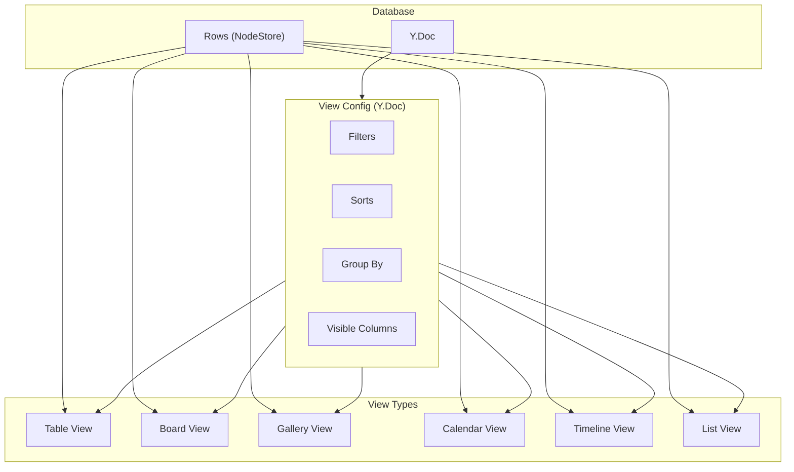
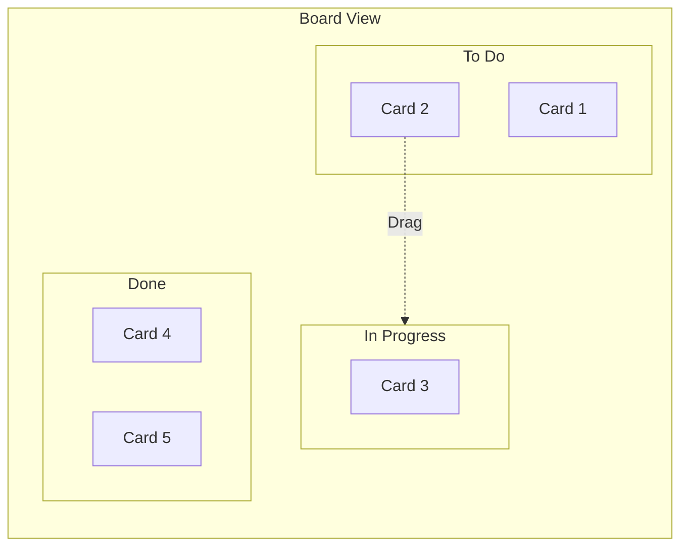

# 05: View System

> Six view types: Table, Board, List, Gallery, Calendar, Timeline

**Duration:** 6-8 days
**Dependencies:** `@xnet/react` (useDatabase), `@tanstack/react-virtual`, `@dnd-kit/core`, `date-fns`

## Overview

Each database can have multiple views, each showing the same data in different layouts. Views share the underlying rows but have independent filters, sorts, grouping, and display settings.



## View Types

| View         | Best For                 | Key Features                             |
| ------------ | ------------------------ | ---------------------------------------- |
| **Table**    | Data grids, spreadsheets | Inline editing, sorting, virtualization  |
| **Board**    | Kanban, pipelines        | Drag-and-drop between columns, swimlanes |
| **Gallery**  | Media, products          | Cover images, card layout                |
| **Calendar** | Events, deadlines        | Month/week/day views, drag to reschedule |
| **Timeline** | Projects, Gantt          | Date ranges, zoom levels                 |
| **List**     | Simple lists, todos      | Compact rows, quick actions              |

## Base View Component

```typescript
// packages/react/src/views/DatabaseView.tsx

import { useDatabase } from '../hooks/useDatabase'
import { TableView } from './TableView'
import { BoardView } from './BoardView'
import { GalleryView } from './GalleryView'
import { CalendarView } from './CalendarView'
import { TimelineView } from './TimelineView'
import { ListView } from './ListView'

interface DatabaseViewProps {
  databaseId: string
  viewId?: string
  onRowClick?: (rowId: string) => void
  onRowDoubleClick?: (rowId: string) => void
}

export function DatabaseView({
  databaseId,
  viewId,
  onRowClick,
  onRowDoubleClick
}: DatabaseViewProps) {
  const database = useDatabase(databaseId, { view: viewId })

  if (database.loading) {
    return <ViewSkeleton />
  }

  if (database.error) {
    return <ViewError error={database.error} />
  }

  const viewType = database.activeView?.type ?? 'table'

  const commonProps = {
    database,
    onRowClick,
    onRowDoubleClick
  }

  switch (viewType) {
    case 'table':
      return <TableView {...commonProps} />
    case 'board':
      return <BoardView {...commonProps} />
    case 'gallery':
      return <GalleryView {...commonProps} />
    case 'calendar':
      return <CalendarView {...commonProps} />
    case 'timeline':
      return <TimelineView {...commonProps} />
    case 'list':
      return <ListView {...commonProps} />
    default:
      return <TableView {...commonProps} />
  }
}
```

## Table View

The most complex view with X+Y virtualization (covered in detail in 07-virtualized-table.md).

```typescript
// packages/react/src/views/TableView.tsx

import { useVirtualizer } from '@tanstack/react-virtual'
import { useRef } from 'react'
import type { UseDatabaseResult } from '../hooks/useDatabase'

interface TableViewProps {
  database: UseDatabaseResult
  onRowClick?: (rowId: string) => void
  onRowDoubleClick?: (rowId: string) => void
}

export function TableView({ database, onRowClick, onRowDoubleClick }: TableViewProps) {
  const containerRef = useRef<HTMLDivElement>(null)

  const { rows, columns, activeView, hasMore, loadMore } = database

  // Get visible columns from view
  const visibleColumns = activeView?.visibleColumns
    .map(id => columns.find(c => c.id === id))
    .filter(Boolean) ?? columns

  // Row virtualization
  const rowVirtualizer = useVirtualizer({
    count: rows.length + (hasMore ? 1 : 0), // Extra for load more
    getScrollElement: () => containerRef.current,
    estimateSize: () => 36,
    overscan: 10
  })

  // Column virtualization
  const columnVirtualizer = useVirtualizer({
    horizontal: true,
    count: visibleColumns.length,
    getScrollElement: () => containerRef.current,
    estimateSize: (i) => activeView?.columnWidths?.[visibleColumns[i].id] ?? 200,
    overscan: 2
  })

  // Load more when scrolling near bottom
  useEffect(() => {
    const items = rowVirtualizer.getVirtualItems()
    const lastItem = items[items.length - 1]

    if (lastItem && lastItem.index >= rows.length - 5 && hasMore) {
      loadMore()
    }
  }, [rowVirtualizer.getVirtualItems(), rows.length, hasMore, loadMore])

  return (
    <div className="flex flex-col h-full">
      {/* Header */}
      <div className="flex border-b bg-muted/50">
        {columnVirtualizer.getVirtualItems().map(virtualCol => {
          const column = visibleColumns[virtualCol.index]
          return (
            <TableHeader
              key={column.id}
              column={column}
              width={virtualCol.size}
              style={{ transform: `translateX(${virtualCol.start}px)` }}
              onResize={(width) => database.updateView(activeView.id, {
                columnWidths: { ...activeView.columnWidths, [column.id]: width }
              })}
            />
          )
        })}
      </div>

      {/* Body */}
      <div ref={containerRef} className="flex-1 overflow-auto">
        <div style={{
          height: rowVirtualizer.getTotalSize(),
          width: columnVirtualizer.getTotalSize(),
          position: 'relative'
        }}>
          {rowVirtualizer.getVirtualItems().map(virtualRow => {
            const row = rows[virtualRow.index]

            // Load more trigger
            if (!row) {
              return (
                <div
                  key="load-more"
                  className="flex items-center justify-center h-9"
                  style={{ transform: `translateY(${virtualRow.start}px)` }}
                >
                  <Spinner size="sm" />
                </div>
              )
            }

            return (
              <TableRow
                key={row.id}
                row={row}
                columns={visibleColumns}
                columnVirtualizer={columnVirtualizer}
                style={{ transform: `translateY(${virtualRow.start}px)` }}
                onClick={() => onRowClick?.(row.id)}
                onDoubleClick={() => onRowDoubleClick?.(row.id)}
              />
            )
          })}
        </div>
      </div>

      {/* Footer */}
      <TableFooter
        rowCount={rows.length}
        onAddRow={() => database.createRow()}
      />
    </div>
  )
}
```

## Board View

Kanban-style board with drag-and-drop between columns.



```typescript
// packages/react/src/views/BoardView.tsx

import {
  DndContext,
  DragOverlay,
  closestCorners,
  useSensor,
  useSensors,
  PointerSensor,
  type DragEndEvent,
  type DragStartEvent
} from '@dnd-kit/core'
import {
  SortableContext,
  verticalListSortingStrategy
} from '@dnd-kit/sortable'
import { useMemo, useState } from 'react'
import type { UseDatabaseResult } from '../hooks/useDatabase'

interface BoardViewProps {
  database: UseDatabaseResult
  onRowClick?: (rowId: string) => void
}

export function BoardView({ database, onRowClick }: BoardViewProps) {
  const { rows, columns, activeView, updateRow } = database
  const [activeCard, setActiveCard] = useState<DatabaseRow | null>(null)

  // Get groupBy column
  const groupByColumnId = activeView?.groupBy
  const groupByColumn = columns.find(c => c.id === groupByColumnId)

  // Group rows by column value
  const groups = useMemo(() => {
    if (!groupByColumn || groupByColumn.type !== 'select') {
      return new Map<string, DatabaseRow[]>([['All', rows]])
    }

    const config = groupByColumn.config as SelectColumnConfig
    const grouped = new Map<string, DatabaseRow[]>()

    // Initialize groups with column options
    for (const option of config.options) {
      grouped.set(option.id, [])
    }
    grouped.set('_none', []) // Uncategorized

    // Sort rows into groups
    for (const row of rows) {
      const value = row.cells[groupByColumnId] as string
      const group = grouped.get(value) ?? grouped.get('_none')!
      group.push(row)
    }

    return grouped
  }, [rows, groupByColumn, groupByColumnId])

  // DnD sensors
  const sensors = useSensors(
    useSensor(PointerSensor, {
      activationConstraint: { distance: 8 }
    })
  )

  // Handle drag end
  const handleDragEnd = async (event: DragEndEvent) => {
    const { active, over } = event

    if (!over) {
      setActiveCard(null)
      return
    }

    const cardId = active.id as string
    const targetGroup = over.data.current?.groupId as string

    if (targetGroup && groupByColumnId) {
      // Update the row's group value
      await updateRow(cardId, {
        [groupByColumnId]: targetGroup === '_none' ? null : targetGroup
      })
    }

    setActiveCard(null)
  }

  const handleDragStart = (event: DragStartEvent) => {
    const card = rows.find(r => r.id === event.active.id)
    setActiveCard(card ?? null)
  }

  return (
    <DndContext
      sensors={sensors}
      collisionDetection={closestCorners}
      onDragStart={handleDragStart}
      onDragEnd={handleDragEnd}
    >
      <div className="flex gap-4 p-4 overflow-x-auto h-full">
        {Array.from(groups.entries()).map(([groupId, groupRows]) => {
          const option = (groupByColumn?.config as SelectColumnConfig)
            ?.options.find(o => o.id === groupId)

          return (
            <BoardColumn
              key={groupId}
              groupId={groupId}
              title={option?.name ?? 'Uncategorized'}
              color={option?.color}
              rows={groupRows}
              onRowClick={onRowClick}
              onAddRow={() => database.createRow({
                [groupByColumnId!]: groupId === '_none' ? null : groupId
              })}
            />
          )
        })}
      </div>

      <DragOverlay>
        {activeCard && <BoardCard row={activeCard} isDragging />}
      </DragOverlay>
    </DndContext>
  )
}

function BoardColumn({
  groupId,
  title,
  color,
  rows,
  onRowClick,
  onAddRow
}: BoardColumnProps) {
  return (
    <div className="flex flex-col w-72 shrink-0 bg-muted/30 rounded-lg">
      <div className="flex items-center gap-2 p-3 font-medium">
        {color && <div className={`w-2 h-2 rounded-full bg-${color}-500`} />}
        <span>{title}</span>
        <span className="text-muted-foreground">({rows.length})</span>
      </div>

      <SortableContext
        items={rows.map(r => r.id)}
        strategy={verticalListSortingStrategy}
      >
        <div className="flex-1 p-2 space-y-2 overflow-y-auto">
          {rows.map(row => (
            <BoardCard
              key={row.id}
              row={row}
              onClick={() => onRowClick?.(row.id)}
            />
          ))}
        </div>
      </SortableContext>

      <button
        className="p-2 text-muted-foreground hover:text-foreground"
        onClick={onAddRow}
      >
        + Add card
      </button>
    </div>
  )
}
```

## Gallery View

Grid of cards with cover images.

```typescript
// packages/react/src/views/GalleryView.tsx

import type { UseDatabaseResult } from '../hooks/useDatabase'

interface GalleryViewProps {
  database: UseDatabaseResult
  onRowClick?: (rowId: string) => void
}

export function GalleryView({ database, onRowClick }: GalleryViewProps) {
  const { rows, columns, activeView } = database

  const cardSize = activeView?.cardSize ?? 'medium'
  const coverColumnId = activeView?.coverColumn
  const coverColumn = columns.find(c => c.id === coverColumnId)

  // Get title column
  const titleColumn = columns.find(c => c.isTitle)

  const sizeClasses = {
    small: 'grid-cols-4 lg:grid-cols-6',
    medium: 'grid-cols-3 lg:grid-cols-4',
    large: 'grid-cols-2 lg:grid-cols-3'
  }

  return (
    <div className={`grid gap-4 p-4 ${sizeClasses[cardSize]}`}>
      {rows.map(row => {
        const coverValue = coverColumnId
          ? row.cells[coverColumnId] as FileRef | null
          : null
        const titleValue = titleColumn
          ? row.cells[titleColumn.id] as string
          : row.id

        return (
          <GalleryCard
            key={row.id}
            title={titleValue}
            cover={coverValue?.url}
            onClick={() => onRowClick?.(row.id)}
          />
        )
      })}

      <AddCard onClick={() => database.createRow()} />
    </div>
  )
}

function GalleryCard({ title, cover, onClick }: GalleryCardProps) {
  return (
    <div
      className="group cursor-pointer rounded-lg border bg-card overflow-hidden hover:shadow-md transition-shadow"
      onClick={onClick}
    >
      <div className="aspect-video bg-muted">
        {cover ? (
          
        ) : (
          <div className="w-full h-full flex items-center justify-center text-muted-foreground">
            No cover
          </div>
        )}
      </div>
      <div className="p-3">
        <h3 className="font-medium truncate">{title || 'Untitled'}</h3>
      </div>
    </div>
  )
}
```

## Calendar View

Month/week/day calendar with events.

```typescript
// packages/react/src/views/CalendarView.tsx

import {
  startOfMonth,
  endOfMonth,
  eachDayOfInterval,
  format,
  isSameDay,
  isSameMonth,
  addMonths,
  subMonths
} from 'date-fns'
import { useMemo, useState } from 'react'
import type { UseDatabaseResult } from '../hooks/useDatabase'

interface CalendarViewProps {
  database: UseDatabaseResult
  onRowClick?: (rowId: string) => void
}

export function CalendarView({ database, onRowClick }: CalendarViewProps) {
  const { rows, columns, activeView, updateRow } = database
  const [currentDate, setCurrentDate] = useState(new Date())
  const [viewMode, setViewMode] = useState<'month' | 'week' | 'day'>('month')

  const dateColumnId = activeView?.dateColumn
  const dateColumn = columns.find(c => c.id === dateColumnId)

  // Get days for current month
  const days = useMemo(() => {
    const start = startOfMonth(currentDate)
    const end = endOfMonth(currentDate)
    return eachDayOfInterval({ start, end })
  }, [currentDate])

  // Group rows by date
  const rowsByDate = useMemo(() => {
    const map = new Map<string, DatabaseRow[]>()

    if (!dateColumnId) return map

    for (const row of rows) {
      const dateValue = row.cells[dateColumnId] as string | null
      if (!dateValue) continue

      const dateKey = format(new Date(dateValue), 'yyyy-MM-dd')
      if (!map.has(dateKey)) map.set(dateKey, [])
      map.get(dateKey)!.push(row)
    }

    return map
  }, [rows, dateColumnId])

  return (
    <div className="flex flex-col h-full">
      {/* Header */}
      <div className="flex items-center justify-between p-4 border-b">
        <div className="flex items-center gap-2">
          <Button variant="ghost" onClick={() => setCurrentDate(subMonths(currentDate, 1))}>
            <ChevronLeft />
          </Button>
          <h2 className="text-lg font-semibold">
            {format(currentDate, 'MMMM yyyy')}
          </h2>
          <Button variant="ghost" onClick={() => setCurrentDate(addMonths(currentDate, 1))}>
            <ChevronRight />
          </Button>
        </div>

        <div className="flex gap-1">
          {(['month', 'week', 'day'] as const).map(mode => (
            <Button
              key={mode}
              variant={viewMode === mode ? 'default' : 'ghost'}
              size="sm"
              onClick={() => setViewMode(mode)}
            >
              {mode}
            </Button>
          ))}
        </div>
      </div>

      {/* Days header */}
      <div className="grid grid-cols-7 border-b">
        {['Sun', 'Mon', 'Tue', 'Wed', 'Thu', 'Fri', 'Sat'].map(day => (
          <div key={day} className="p-2 text-center text-sm font-medium text-muted-foreground">
            {day}
          </div>
        ))}
      </div>

      {/* Calendar grid */}
      <div className="flex-1 grid grid-cols-7 auto-rows-fr">
        {days.map(day => {
          const dateKey = format(day, 'yyyy-MM-dd')
          const dayRows = rowsByDate.get(dateKey) ?? []
          const isToday = isSameDay(day, new Date())

          return (
            <CalendarDay
              key={dateKey}
              date={day}
              rows={dayRows}
              isToday={isToday}
              onRowClick={onRowClick}
              onAddRow={() => database.createRow({
                [dateColumnId!]: day.toISOString()
              })}
            />
          )
        })}
      </div>
    </div>
  )
}

function CalendarDay({ date, rows, isToday, onRowClick, onAddRow }: CalendarDayProps) {
  return (
    <div className={cn(
      "border-r border-b p-1 min-h-24",
      isToday && "bg-primary/5"
    )}>
      <div className={cn(
        "text-sm mb-1",
        isToday && "font-bold text-primary"
      )}>
        {format(date, 'd')}
      </div>

      <div className="space-y-0.5">
        {rows.slice(0, 3).map(row => (
          <CalendarEvent
            key={row.id}
            row={row}
            onClick={() => onRowClick?.(row.id)}
          />
        ))}

        {rows.length > 3 && (
          <div className="text-xs text-muted-foreground">
            +{rows.length - 3} more
          </div>
        )}
      </div>

      <button
        className="text-xs text-muted-foreground opacity-0 hover:opacity-100"
        onClick={onAddRow}
      >
        +
      </button>
    </div>
  )
}
```

## Timeline View

Gantt-style timeline with date ranges and zoom.

```typescript
// packages/react/src/views/TimelineView.tsx

import { useMemo, useState, useRef } from 'react'
import {
  differenceInDays,
  addDays,
  startOfMonth,
  endOfMonth,
  eachDayOfInterval,
  format
} from 'date-fns'
import type { UseDatabaseResult } from '../hooks/useDatabase'

interface TimelineViewProps {
  database: UseDatabaseResult
  onRowClick?: (rowId: string) => void
}

type ZoomLevel = 'day' | 'week' | 'month'

export function TimelineView({ database, onRowClick }: TimelineViewProps) {
  const { rows, columns, activeView, updateRow } = database
  const containerRef = useRef<HTMLDivElement>(null)

  const [zoomLevel, setZoomLevel] = useState<ZoomLevel>('week')
  const [startDate, setStartDate] = useState(() => startOfMonth(new Date()))

  const dateColumnId = activeView?.dateColumn
  const endDateColumnId = activeView?.endDateColumn

  // Calculate visible date range
  const dateRange = useMemo(() => {
    const daysToShow = zoomLevel === 'day' ? 14 : zoomLevel === 'week' ? 60 : 180
    return eachDayOfInterval({
      start: startDate,
      end: addDays(startDate, daysToShow)
    })
  }, [startDate, zoomLevel])

  // Column widths based on zoom
  const dayWidth = zoomLevel === 'day' ? 60 : zoomLevel === 'week' ? 20 : 6

  // Process rows into timeline items
  const timelineItems = useMemo(() => {
    if (!dateColumnId) return []

    return rows
      .filter(row => row.cells[dateColumnId])
      .map(row => {
        const start = new Date(row.cells[dateColumnId] as string)
        const end = endDateColumnId && row.cells[endDateColumnId]
          ? new Date(row.cells[endDateColumnId] as string)
          : start

        return { row, start, end }
      })
  }, [rows, dateColumnId, endDateColumnId])

  return (
    <div className="flex flex-col h-full">
      {/* Controls */}
      <div className="flex items-center gap-4 p-4 border-b">
        <div className="flex gap-1">
          {(['day', 'week', 'month'] as const).map(level => (
            <Button
              key={level}
              variant={zoomLevel === level ? 'default' : 'ghost'}
              size="sm"
              onClick={() => setZoomLevel(level)}
            >
              {level}
            </Button>
          ))}
        </div>

        <Button variant="ghost" onClick={() => setStartDate(addDays(startDate, -30))}>
          <ChevronLeft />
        </Button>
        <Button variant="ghost" onClick={() => setStartDate(new Date())}>
          Today
        </Button>
        <Button variant="ghost" onClick={() => setStartDate(addDays(startDate, 30))}>
          <ChevronRight />
        </Button>
      </div>

      {/* Timeline header */}
      <div className="flex border-b overflow-x-auto" ref={containerRef}>
        <div className="w-64 shrink-0 p-2 font-medium border-r">
          Item
        </div>
        <div className="flex">
          {dateRange.map(date => (
            <div
              key={date.toISOString()}
              className="text-center text-xs p-1 border-r"
              style={{ width: dayWidth }}
            >
              {format(date, zoomLevel === 'day' ? 'd' : 'd')}
            </div>
          ))}
        </div>
      </div>

      {/* Timeline rows */}
      <div className="flex-1 overflow-auto">
        {timelineItems.map(({ row, start, end }) => {
          const startOffset = differenceInDays(start, startDate)
          const duration = differenceInDays(end, start) + 1

          return (
            <div key={row.id} className="flex border-b hover:bg-muted/50">
              <div className="w-64 shrink-0 p-2 border-r truncate">
                {row.cells[columns[0]?.id] as string ?? row.id}
              </div>
              <div className="relative flex-1" style={{ height: 36 }}>
                {startOffset >= 0 && (
                  <div
                    className="absolute top-1 h-6 bg-primary rounded cursor-pointer hover:bg-primary/80"
                    style={{
                      left: startOffset * dayWidth,
                      width: Math.max(duration * dayWidth - 2, dayWidth - 2)
                    }}
                    onClick={() => onRowClick?.(row.id)}
                  />
                )}
              </div>
            </div>
          )
        })}
      </div>
    </div>
  )
}
```

## List View

Compact list for simple use cases.

```typescript
// packages/react/src/views/ListView.tsx

import type { UseDatabaseResult } from '../hooks/useDatabase'

interface ListViewProps {
  database: UseDatabaseResult
  onRowClick?: (rowId: string) => void
}

export function ListView({ database, onRowClick }: ListViewProps) {
  const { rows, columns, createRow, deleteRow } = database

  const titleColumn = columns.find(c => c.isTitle) ?? columns[0]
  const checkboxColumn = columns.find(c => c.type === 'checkbox')

  return (
    <div className="p-4 space-y-1">
      {rows.map(row => {
        const title = row.cells[titleColumn?.id] as string
        const checked = checkboxColumn
          ? row.cells[checkboxColumn.id] as boolean
          : false

        return (
          <ListItem
            key={row.id}
            title={title}
            checked={checked}
            onCheck={checkboxColumn ? (v) => database.updateRow(row.id, {
              [checkboxColumn.id]: v
            }) : undefined}
            onClick={() => onRowClick?.(row.id)}
            onDelete={() => deleteRow(row.id)}
          />
        )
      })}

      <button
        className="w-full p-2 text-left text-muted-foreground hover:text-foreground"
        onClick={() => createRow()}
      >
        + New item
      </button>
    </div>
  )
}

function ListItem({ title, checked, onCheck, onClick, onDelete }: ListItemProps) {
  return (
    <div className="flex items-center gap-2 p-2 rounded hover:bg-muted group">
      {onCheck && (
        <Checkbox
          checked={checked}
          onCheckedChange={onCheck}
          onClick={e => e.stopPropagation()}
        />
      )}
      <span
        className={cn("flex-1 cursor-pointer", checked && "line-through opacity-50")}
        onClick={onClick}
      >
        {title || 'Untitled'}
      </span>
      <Button
        variant="ghost"
        size="icon"
        className="opacity-0 group-hover:opacity-100"
        onClick={(e) => { e.stopPropagation(); onDelete() }}
      >
        <Trash2 className="w-4 h-4" />
      </Button>
    </div>
  )
}
```

## View Toolbar

Common toolbar for all views with view switching and filter/sort controls.

```typescript
// packages/react/src/views/ViewToolbar.tsx

interface ViewToolbarProps {
  database: UseDatabaseResult
  onViewChange?: (viewId: string) => void
}

export function ViewToolbar({ database, onViewChange }: ViewToolbarProps) {
  const { views, activeView, columns } = database

  return (
    <div className="flex items-center justify-between p-2 border-b">
      {/* View tabs */}
      <div className="flex items-center gap-1">
        {views.map(view => (
          <Button
            key={view.id}
            variant={view.id === activeView?.id ? 'secondary' : 'ghost'}
            size="sm"
            onClick={() => onViewChange?.(view.id)}
          >
            <ViewIcon type={view.type} className="w-4 h-4 mr-1" />
            {view.name}
          </Button>
        ))}

        <AddViewButton database={database} />
      </div>

      {/* Controls */}
      <div className="flex items-center gap-2">
        <FilterButton database={database} />
        <SortButton database={database} />
        {activeView?.type === 'table' && (
          <ColumnVisibilityButton database={database} />
        )}
      </div>
    </div>
  )
}
```

## Testing

```typescript
describe('View System', () => {
  describe('TableView', () => {
    it('renders rows and columns', async () => {
      const database = createTestDatabase()
      render(<TableView database={database} />)

      expect(screen.getAllByRole('row')).toHaveLength(database.rows.length + 1)
    })

    it('virtualizes large datasets', async () => {
      const database = createLargeDatabase(10000)
      render(<TableView database={database} />)

      // Only visible rows should be in DOM
      const rows = screen.getAllByRole('row')
      expect(rows.length).toBeLessThan(100)
    })
  })

  describe('BoardView', () => {
    it('groups by select column', () => {
      const database = createTestDatabase({
        columns: [{ type: 'select', options: ['A', 'B', 'C'] }]
      })
      render(<BoardView database={database} />)

      expect(screen.getAllByTestId('board-column')).toHaveLength(3)
    })

    it('moves card on drag', async () => {
      const database = createTestDatabase()
      render(<BoardView database={database} />)

      // Simulate drag
      await dragAndDrop(
        screen.getByTestId('card-1'),
        screen.getByTestId('column-done')
      )

      expect(database.updateRow).toHaveBeenCalledWith('row1', {
        status: 'done'
      })
    })
  })

  describe('CalendarView', () => {
    it('shows events on correct days', () => {
      const database = createTestDatabase({
        rows: [
          { date: '2024-01-15' },
          { date: '2024-01-15' },
          { date: '2024-01-20' }
        ]
      })
      render(<CalendarView database={database} />)

      const day15 = screen.getByTestId('day-2024-01-15')
      expect(within(day15).getAllByTestId('event')).toHaveLength(2)
    })
  })
})
```

## Validation Gate

- [x] `DatabaseView` renders correct view type (ViewRenderer in @xnet/views)
- [x] `TableView` supports inline cell editing
- [x] `TableView` virtualizes large datasets
- [x] `BoardView` groups by select column
- [x] `BoardView` drag-and-drop updates row
- [x] `GalleryView` shows cover images
- [x] `CalendarView` shows events on days
- [x] `CalendarView` supports month/week/day
- [x] `TimelineView` shows date ranges
- [x] `TimelineView` supports zoom levels
- [x] `ListView` supports checkbox toggle
- [x] View switching works correctly (via ViewRegistry)
- [x] All tests pass (125 tests)

---

[Back to README](./README.md) | [Previous: React Hooks](./04-react-hooks.md) | [Next: Filter/Sort/Group ->](./06-filter-sort-group.md)
