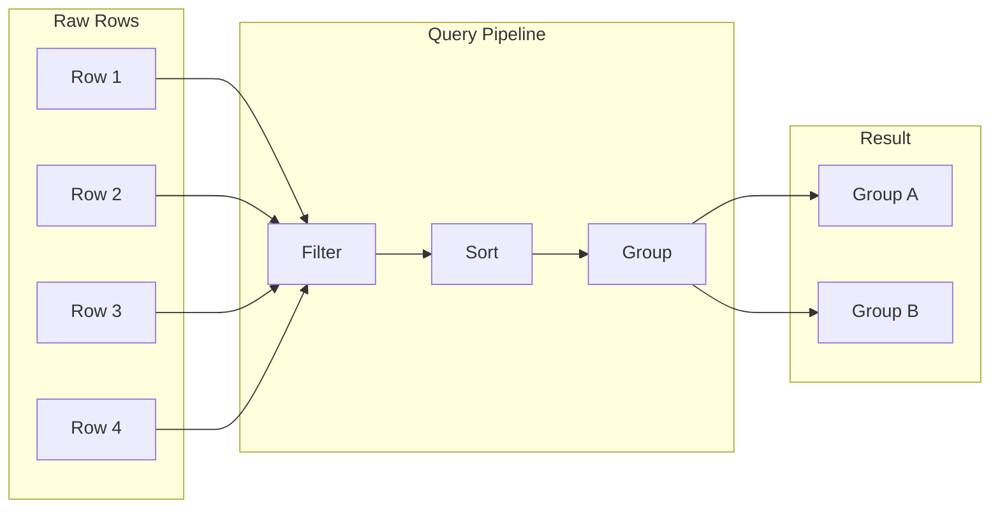

# 06: Filter, Sort, and Group

> Query system with filter builder, multi-column sorting, and grouping

**Duration:** 4-5 days
**Dependencies:** `@xnet/data` (NodeStore queries), `@xnet/react` (hooks)

## Overview

Views can be filtered, sorted, and grouped independently. This document covers:

1. **Filter system** - Complex filter groups with AND/OR logic
2. **Sort system** - Multi-column sorting
3. **Group system** - Group-by with aggregation headers
4. **Local execution** - In-memory filter/sort for small datasets
5. **Query builder** - UI for building filters



## Filter Types

### Filter Data Structures

```typescript
// packages/data/src/database/filter-types.ts

/**
 * A group of filter conditions combined with AND or OR.
 */
export interface FilterGroup {
  operator: 'and' | 'or'
  conditions: Array<FilterCondition | FilterGroup>
}

/**
 * A single filter condition on one column.
 */
export interface FilterCondition {
  columnId: string
  operator: FilterOperator
  value: unknown
}

/**
 * All supported filter operators.
 */
export type FilterOperator =
  // Text operators
  | 'equals'
  | 'notEquals'
  | 'contains'
  | 'notContains'
  | 'startsWith'
  | 'endsWith'
  // Empty operators
  | 'isEmpty'
  | 'isNotEmpty'
  // Number/Date comparison
  | 'greaterThan'
  | 'lessThan'
  | 'greaterOrEqual'
  | 'lessOrEqual'
  // Date specific
  | 'before'
  | 'after'
  | 'between'
  | 'inPast'
  | 'inFuture'
  | 'thisWeek'
  | 'thisMonth'
  // Multi-select operators
  | 'hasAny'
  | 'hasAll'
  | 'hasNone'
  // Relation operators
  | 'contains'
  | 'notContains'
```

### Operators by Column Type

```typescript
// packages/data/src/database/filter-operators.ts

export const OPERATORS_BY_TYPE: Record<ColumnType, FilterOperator[]> = {
  text: [
    'equals',
    'notEquals',
    'contains',
    'notContains',
    'startsWith',
    'endsWith',
    'isEmpty',
    'isNotEmpty'
  ],
  number: [
    'equals',
    'notEquals',
    'greaterThan',
    'lessThan',
    'greaterOrEqual',
    'lessOrEqual',
    'between',
    'isEmpty',
    'isNotEmpty'
  ],
  checkbox: ['equals'],
  date: [
    'equals',
    'before',
    'after',
    'between',
    'inPast',
    'inFuture',
    'thisWeek',
    'thisMonth',
    'isEmpty',
    'isNotEmpty'
  ],
  dateRange: ['before', 'after', 'between', 'isEmpty', 'isNotEmpty'],
  select: ['equals', 'notEquals', 'isEmpty', 'isNotEmpty'],
  multiSelect: ['hasAny', 'hasAll', 'hasNone', 'isEmpty', 'isNotEmpty'],
  person: ['equals', 'notEquals', 'isEmpty', 'isNotEmpty'],
  url: ['isEmpty', 'isNotEmpty', 'contains'],
  email: ['isEmpty', 'isNotEmpty', 'contains'],
  phone: ['isEmpty', 'isNotEmpty'],
  file: ['isEmpty', 'isNotEmpty'],
  relation: ['contains', 'notContains', 'isEmpty', 'isNotEmpty'],
  rollup: [], // Rollups use the result type's operators
  formula: [], // Formulas use the result type's operators
  richText: ['isEmpty', 'isNotEmpty', 'contains'],
  created: ['before', 'after', 'between', 'inPast'],
  createdBy: ['equals', 'notEquals'],
  updated: ['before', 'after', 'between', 'inPast'],
  updatedBy: ['equals', 'notEquals']
}
```

## Filter Execution

### In-Memory Filter Engine

```typescript
// packages/data/src/database/filter-engine.ts

import type { DatabaseRow, ColumnDefinition, FilterGroup, FilterCondition } from './types'

/**
 * Filter rows in memory using a filter group.
 */
export function filterRows(
  rows: DatabaseRow[],
  columns: ColumnDefinition[],
  filter: FilterGroup | null
): DatabaseRow[] {
  if (!filter || filter.conditions.length === 0) {
    return rows
  }

  return rows.filter((row) => evaluateGroup(row, columns, filter))
}

function evaluateGroup(row: DatabaseRow, columns: ColumnDefinition[], group: FilterGroup): boolean {
  const results = group.conditions.map((condition) => {
    if ('operator' in condition && 'conditions' in condition) {
      // Nested group
      return evaluateGroup(row, columns, condition as FilterGroup)
    }
    return evaluateCondition(row, columns, condition as FilterCondition)
  })

  if (group.operator === 'and') {
    return results.every(Boolean)
  } else {
    return results.some(Boolean)
  }
}

function evaluateCondition(
  row: DatabaseRow,
  columns: ColumnDefinition[],
  condition: FilterCondition
): boolean {
  const column = columns.find((c) => c.id === condition.columnId)
  if (!column) return true // Skip unknown columns

  const cellValue = row.cells[condition.columnId]
  const filterValue = condition.value

  return evaluateOperator(cellValue, filterValue, condition.operator, column.type)
}

function evaluateOperator(
  cellValue: unknown,
  filterValue: unknown,
  operator: FilterOperator,
  columnType: ColumnType
): boolean {
  switch (operator) {
    case 'equals':
      return cellValue === filterValue

    case 'notEquals':
      return cellValue !== filterValue

    case 'contains':
      if (typeof cellValue === 'string') {
        return cellValue.toLowerCase().includes(String(filterValue).toLowerCase())
      }
      if (Array.isArray(cellValue)) {
        return cellValue.includes(filterValue)
      }
      return false

    case 'notContains':
      return !evaluateOperator(cellValue, filterValue, 'contains', columnType)

    case 'startsWith':
      return (
        typeof cellValue === 'string' &&
        cellValue.toLowerCase().startsWith(String(filterValue).toLowerCase())
      )

    case 'endsWith':
      return (
        typeof cellValue === 'string' &&
        cellValue.toLowerCase().endsWith(String(filterValue).toLowerCase())
      )

    case 'isEmpty':
      return (
        cellValue === null ||
        cellValue === undefined ||
        cellValue === '' ||
        (Array.isArray(cellValue) && cellValue.length === 0)
      )

    case 'isNotEmpty':
      return !evaluateOperator(cellValue, null, 'isEmpty', columnType)

    case 'greaterThan':
      return Number(cellValue) > Number(filterValue)

    case 'lessThan':
      return Number(cellValue) < Number(filterValue)

    case 'greaterOrEqual':
      return Number(cellValue) >= Number(filterValue)

    case 'lessOrEqual':
      return Number(cellValue) <= Number(filterValue)

    case 'before':
      return new Date(cellValue as string) < new Date(filterValue as string)

    case 'after':
      return new Date(cellValue as string) > new Date(filterValue as string)

    case 'between':
      const [start, end] = filterValue as [string, string]
      const date = new Date(cellValue as string)
      return date >= new Date(start) && date <= new Date(end)

    case 'inPast':
      return new Date(cellValue as string) < new Date()

    case 'inFuture':
      return new Date(cellValue as string) > new Date()

    case 'thisWeek':
      return isThisWeek(new Date(cellValue as string))

    case 'thisMonth':
      return isThisMonth(new Date(cellValue as string))

    case 'hasAny':
      const anyValues = filterValue as unknown[]
      return Array.isArray(cellValue) && anyValues.some((v) => cellValue.includes(v))

    case 'hasAll':
      const allValues = filterValue as unknown[]
      return Array.isArray(cellValue) && allValues.every((v) => cellValue.includes(v))

    case 'hasNone':
      const noneValues = filterValue as unknown[]
      return !Array.isArray(cellValue) || !noneValues.some((v) => cellValue.includes(v))

    default:
      return true
  }
}
```

## Sort System

### Sort Data Structures

```typescript
// packages/data/src/database/sort-types.ts

export interface SortConfig {
  columnId: string
  direction: 'asc' | 'desc'
}
```

### In-Memory Sort Engine

```typescript
// packages/data/src/database/sort-engine.ts

import type { DatabaseRow, ColumnDefinition, SortConfig } from './types'

/**
 * Sort rows in memory using multi-column sort config.
 */
export function sortRows(
  rows: DatabaseRow[],
  columns: ColumnDefinition[],
  sorts: SortConfig[]
): DatabaseRow[] {
  if (!sorts || sorts.length === 0) {
    // Default sort by sortKey
    return [...rows].sort((a, b) => a.sortKey.localeCompare(b.sortKey))
  }

  return [...rows].sort((a, b) => {
    for (const sort of sorts) {
      const column = columns.find((c) => c.id === sort.columnId)
      if (!column) continue

      const aValue = a.cells[sort.columnId]
      const bValue = b.cells[sort.columnId]

      const comparison = compareValues(aValue, bValue, column.type)

      if (comparison !== 0) {
        return sort.direction === 'asc' ? comparison : -comparison
      }
    }

    // Fallback to sortKey
    return a.sortKey.localeCompare(b.sortKey)
  })
}

function compareValues(a: unknown, b: unknown, type: ColumnType): number {
  // Handle null/undefined
  if (a == null && b == null) return 0
  if (a == null) return 1
  if (b == null) return -1

  switch (type) {
    case 'text':
    case 'url':
    case 'email':
    case 'phone':
    case 'select':
      return String(a).localeCompare(String(b))

    case 'number':
      return Number(a) - Number(b)

    case 'checkbox':
      return (a ? 1 : 0) - (b ? 1 : 0)

    case 'date':
    case 'created':
    case 'updated':
      return new Date(a as string).getTime() - new Date(b as string).getTime()

    case 'multiSelect':
    case 'relation':
      return (a as unknown[]).length - (b as unknown[]).length

    default:
      return 0
  }
}
```

## Group System

### Group Data Structures

```typescript
// packages/data/src/database/group-types.ts

export interface GroupConfig {
  columnId: string
  sort?: 'asc' | 'desc'
  collapsedGroups?: string[]
}

export interface RowGroup {
  key: string
  label: string
  color?: string
  rows: DatabaseRow[]
  aggregates: Record<string, unknown>
}
```

### Group Engine

```typescript
// packages/data/src/database/group-engine.ts

import type { DatabaseRow, ColumnDefinition, GroupConfig, RowGroup } from './types'

/**
 * Group rows by a column value.
 */
export function groupRows(
  rows: DatabaseRow[],
  columns: ColumnDefinition[],
  groupBy: GroupConfig | null
): RowGroup[] {
  if (!groupBy) {
    return [
      {
        key: '_all',
        label: 'All Items',
        rows,
        aggregates: calculateAggregates(rows, columns)
      }
    ]
  }

  const column = columns.find((c) => c.id === groupBy.columnId)
  if (!column) {
    return [{ key: '_all', label: 'All Items', rows, aggregates: {} }]
  }

  // Get all possible group keys
  const groupKeys = getGroupKeys(rows, column)

  // Sort group keys
  const sortedKeys = sortGroupKeys(groupKeys, groupBy.sort ?? 'asc', column)

  // Build groups
  const groups: RowGroup[] = sortedKeys.map((key) => {
    const groupRows = rows.filter((row) => {
      const value = row.cells[groupBy.columnId]
      return getGroupKey(value, column) === key
    })

    return {
      key,
      label: getGroupLabel(key, column),
      color: getGroupColor(key, column),
      rows: groupRows,
      aggregates: calculateAggregates(groupRows, columns)
    }
  })

  return groups
}

function getGroupKeys(rows: DatabaseRow[], column: ColumnDefinition): Set<string> {
  const keys = new Set<string>()

  for (const row of rows) {
    const value = row.cells[column.id]
    keys.add(getGroupKey(value, column))
  }

  // Add empty options for select columns
  if (column.type === 'select') {
    const config = column.config as SelectColumnConfig
    for (const option of config.options) {
      keys.add(option.id)
    }
  }

  return keys
}

function getGroupKey(value: unknown, column: ColumnDefinition): string {
  if (value == null || value === '') return '_empty'

  switch (column.type) {
    case 'select':
      return String(value)
    case 'checkbox':
      return value ? 'checked' : 'unchecked'
    case 'person':
      return String(value)
    case 'date':
    case 'created':
    case 'updated':
      // Group by date (day)
      return new Date(value as string).toISOString().split('T')[0]
    default:
      return String(value)
  }
}

function getGroupLabel(key: string, column: ColumnDefinition): string {
  if (key === '_empty') return 'Empty'

  if (column.type === 'select') {
    const config = column.config as SelectColumnConfig
    const option = config.options.find((o) => o.id === key)
    return option?.name ?? key
  }

  if (column.type === 'checkbox') {
    return key === 'checked' ? 'Checked' : 'Unchecked'
  }

  return key
}

function getGroupColor(key: string, column: ColumnDefinition): string | undefined {
  if (column.type === 'select') {
    const config = column.config as SelectColumnConfig
    const option = config.options.find((o) => o.id === key)
    return option?.color
  }
  return undefined
}

function calculateAggregates(
  rows: DatabaseRow[],
  columns: ColumnDefinition[]
): Record<string, unknown> {
  const aggregates: Record<string, unknown> = {
    count: rows.length
  }

  // Calculate aggregates for number columns
  for (const column of columns) {
    if (column.type === 'number') {
      const values = rows
        .map((r) => r.cells[column.id])
        .filter((v): v is number => typeof v === 'number')

      if (values.length > 0) {
        aggregates[`${column.id}_sum`] = values.reduce((a, b) => a + b, 0)
        aggregates[`${column.id}_avg`] = (aggregates[`${column.id}_sum`] as number) / values.length
        aggregates[`${column.id}_min`] = Math.min(...values)
        aggregates[`${column.id}_max`] = Math.max(...values)
      }
    }
  }

  return aggregates
}
```

## Query Pipeline

```typescript
// packages/data/src/database/query-pipeline.ts

import { filterRows } from './filter-engine'
import { sortRows } from './sort-engine'
import { groupRows } from './group-engine'
import type {
  DatabaseRow,
  ColumnDefinition,
  FilterGroup,
  SortConfig,
  GroupConfig,
  RowGroup
} from './types'

interface QueryOptions {
  filter?: FilterGroup | null
  sorts?: SortConfig[]
  groupBy?: GroupConfig | null
  limit?: number
  offset?: number
}

interface QueryResult {
  groups: RowGroup[]
  total: number
  filtered: number
}

/**
 * Execute a full query pipeline: filter -> sort -> group.
 */
export function executeQuery(
  rows: DatabaseRow[],
  columns: ColumnDefinition[],
  options: QueryOptions
): QueryResult {
  const { filter, sorts, groupBy, limit, offset } = options

  // Step 1: Filter
  let result = filterRows(rows, columns, filter ?? null)
  const filtered = result.length

  // Step 2: Sort
  result = sortRows(result, columns, sorts ?? [])

  // Step 3: Paginate (before grouping for efficiency)
  if (offset) {
    result = result.slice(offset)
  }
  if (limit) {
    result = result.slice(0, limit)
  }

  // Step 4: Group
  const groups = groupRows(result, columns, groupBy ?? null)

  return {
    groups,
    total: rows.length,
    filtered
  }
}
```

## Filter Builder UI

```typescript
// packages/react/src/views/FilterBuilder.tsx

import { useState } from 'react'
import { Plus, Trash2 } from 'lucide-react'
import type { FilterGroup, FilterCondition, ColumnDefinition } from '@xnet/data'
import { OPERATORS_BY_TYPE } from '@xnet/data'

interface FilterBuilderProps {
  columns: ColumnDefinition[]
  value: FilterGroup | null
  onChange: (filter: FilterGroup | null) => void
}

export function FilterBuilder({ columns, value, onChange }: FilterBuilderProps) {
  const [group, setGroup] = useState<FilterGroup>(value ?? {
    operator: 'and',
    conditions: []
  })

  const addCondition = () => {
    const newCondition: FilterCondition = {
      columnId: columns[0]?.id ?? '',
      operator: 'equals',
      value: null
    }

    const updated = {
      ...group,
      conditions: [...group.conditions, newCondition]
    }

    setGroup(updated)
    onChange(updated)
  }

  const updateCondition = (index: number, updates: Partial<FilterCondition>) => {
    const conditions = [...group.conditions]
    conditions[index] = { ...conditions[index] as FilterCondition, ...updates }

    const updated = { ...group, conditions }
    setGroup(updated)
    onChange(updated)
  }

  const removeCondition = (index: number) => {
    const conditions = group.conditions.filter((_, i) => i !== index)
    const updated = { ...group, conditions }
    setGroup(updated)
    onChange(conditions.length === 0 ? null : updated)
  }

  const toggleOperator = () => {
    const updated = {
      ...group,
      operator: group.operator === 'and' ? 'or' as const : 'and' as const
    }
    setGroup(updated)
    onChange(updated)
  }

  return (
    <div className="p-4 space-y-2">
      {group.conditions.map((condition, index) => {
        if ('conditions' in condition) {
          // Nested group (TODO: support nested groups)
          return null
        }

        const cond = condition as FilterCondition
        const column = columns.find(c => c.id === cond.columnId)
        const operators = column ? OPERATORS_BY_TYPE[column.type] : []

        return (
          <div key={index} className="flex items-center gap-2">
            {index > 0 && (
              <button
                className="text-xs text-muted-foreground hover:text-foreground"
                onClick={toggleOperator}
              >
                {group.operator.toUpperCase()}
              </button>
            )}

            {/* Column selector */}
            <Select
              value={cond.columnId}
              onValueChange={id => updateCondition(index, {
                columnId: id,
                operator: OPERATORS_BY_TYPE[columns.find(c => c.id === id)?.type ?? 'text'][0],
                value: null
              })}
            >
              {columns.map(col => (
                <SelectItem key={col.id} value={col.id}>
                  {col.name}
                </SelectItem>
              ))}
            </Select>

            {/* Operator selector */}
            <Select
              value={cond.operator}
              onValueChange={op => updateCondition(index, { operator: op as FilterOperator })}
            >
              {operators.map(op => (
                <SelectItem key={op} value={op}>
                  {formatOperator(op)}
                </SelectItem>
              ))}
            </Select>

            {/* Value input */}
            {!['isEmpty', 'isNotEmpty'].includes(cond.operator) && (
              <FilterValueInput
                column={column}
                operator={cond.operator}
                value={cond.value}
                onChange={value => updateCondition(index, { value })}
              />
            )}

            {/* Remove button */}
            <Button variant="ghost" size="icon" onClick={() => removeCondition(index)}>
              <Trash2 className="w-4 h-4" />
            </Button>
          </div>
        )
      })}

      <Button variant="ghost" size="sm" onClick={addCondition}>
        <Plus className="w-4 h-4 mr-1" />
        Add filter
      </Button>
    </div>
  )
}

function FilterValueInput({ column, operator, value, onChange }: FilterValueInputProps) {
  if (!column) return null

  switch (column.type) {
    case 'text':
    case 'url':
    case 'email':
    case 'phone':
      return (
        <Input
          value={value as string ?? ''}
          onChange={e => onChange(e.target.value)}
          placeholder="Enter value..."
        />
      )

    case 'number':
      if (operator === 'between') {
        return (
          <div className="flex gap-1">
            <Input
              type="number"
              value={(value as [number, number])?.[0] ?? ''}
              onChange={e => onChange([parseFloat(e.target.value), (value as [number, number])?.[1] ?? 0])}
            />
            <span>to</span>
            <Input
              type="number"
              value={(value as [number, number])?.[1] ?? ''}
              onChange={e => onChange([(value as [number, number])?.[0] ?? 0, parseFloat(e.target.value)])}
            />
          </div>
        )
      }
      return (
        <Input
          type="number"
          value={value as number ?? ''}
          onChange={e => onChange(parseFloat(e.target.value))}
        />
      )

    case 'checkbox':
      return (
        <Select value={String(value)} onValueChange={v => onChange(v === 'true')}>
          <SelectItem value="true">Checked</SelectItem>
          <SelectItem value="false">Unchecked</SelectItem>
        </Select>
      )

    case 'select':
      const selectConfig = column.config as SelectColumnConfig
      return (
        <Select value={value as string} onValueChange={onChange}>
          {selectConfig.options.map(opt => (
            <SelectItem key={opt.id} value={opt.id}>{opt.name}</SelectItem>
          ))}
        </Select>
      )

    case 'multiSelect':
      const multiConfig = column.config as SelectColumnConfig
      return (
        <MultiSelect
          value={value as string[] ?? []}
          onChange={onChange}
          options={multiConfig.options}
        />
      )

    case 'date':
    case 'created':
    case 'updated':
      if (operator === 'between') {
        return <DateRangePicker value={value as [string, string]} onChange={onChange} />
      }
      if (['inPast', 'inFuture', 'thisWeek', 'thisMonth'].includes(operator)) {
        return null // No value needed
      }
      return <DatePicker value={value as string} onChange={onChange} />

    default:
      return <Input value={String(value ?? '')} onChange={e => onChange(e.target.value)} />
  }
}

function formatOperator(op: FilterOperator): string {
  const labels: Record<FilterOperator, string> = {
    equals: 'equals',
    notEquals: 'does not equal',
    contains: 'contains',
    notContains: 'does not contain',
    startsWith: 'starts with',
    endsWith: 'ends with',
    isEmpty: 'is empty',
    isNotEmpty: 'is not empty',
    greaterThan: 'greater than',
    lessThan: 'less than',
    greaterOrEqual: 'at least',
    lessOrEqual: 'at most',
    before: 'before',
    after: 'after',
    between: 'between',
    inPast: 'is in the past',
    inFuture: 'is in the future',
    thisWeek: 'is this week',
    thisMonth: 'is this month',
    hasAny: 'has any of',
    hasAll: 'has all of',
    hasNone: 'has none of'
  }
  return labels[op] ?? op
}
```

## Testing

```typescript
describe('Filter Engine', () => {
  const columns: ColumnDefinition[] = [
    { id: 'name', type: 'text', name: 'Name', config: {} },
    { id: 'age', type: 'number', name: 'Age', config: {} },
    { id: 'active', type: 'checkbox', name: 'Active', config: {} },
    { id: 'status', type: 'select', name: 'Status', config: { options: [] } }
  ]

  const rows: DatabaseRow[] = [
    { id: '1', sortKey: 'a0', cells: { name: 'Alice', age: 30, active: true, status: 'active' } },
    { id: '2', sortKey: 'a1', cells: { name: 'Bob', age: 25, active: false, status: 'inactive' } },
    { id: '3', sortKey: 'a2', cells: { name: 'Charlie', age: 35, active: true, status: 'active' } }
  ]

  describe('text filters', () => {
    it('filters by equals', () => {
      const filter: FilterGroup = {
        operator: 'and',
        conditions: [{ columnId: 'name', operator: 'equals', value: 'Alice' }]
      }

      const result = filterRows(rows, columns, filter)
      expect(result).toHaveLength(1)
      expect(result[0].id).toBe('1')
    })

    it('filters by contains', () => {
      const filter: FilterGroup = {
        operator: 'and',
        conditions: [{ columnId: 'name', operator: 'contains', value: 'li' }]
      }

      const result = filterRows(rows, columns, filter)
      expect(result).toHaveLength(2) // Alice, Charlie
    })
  })

  describe('number filters', () => {
    it('filters by greaterThan', () => {
      const filter: FilterGroup = {
        operator: 'and',
        conditions: [{ columnId: 'age', operator: 'greaterThan', value: 28 }]
      }

      const result = filterRows(rows, columns, filter)
      expect(result).toHaveLength(2) // Alice (30), Charlie (35)
    })

    it('filters by between', () => {
      const filter: FilterGroup = {
        operator: 'and',
        conditions: [{ columnId: 'age', operator: 'between', value: [26, 32] }]
      }

      const result = filterRows(rows, columns, filter)
      expect(result).toHaveLength(1) // Alice (30)
    })
  })

  describe('AND/OR logic', () => {
    it('applies AND logic', () => {
      const filter: FilterGroup = {
        operator: 'and',
        conditions: [
          { columnId: 'active', operator: 'equals', value: true },
          { columnId: 'age', operator: 'greaterThan', value: 32 }
        ]
      }

      const result = filterRows(rows, columns, filter)
      expect(result).toHaveLength(1) // Charlie
    })

    it('applies OR logic', () => {
      const filter: FilterGroup = {
        operator: 'or',
        conditions: [
          { columnId: 'name', operator: 'equals', value: 'Alice' },
          { columnId: 'name', operator: 'equals', value: 'Bob' }
        ]
      }

      const result = filterRows(rows, columns, filter)
      expect(result).toHaveLength(2)
    })
  })
})

describe('Sort Engine', () => {
  it('sorts by single column', () => {
    const result = sortRows(rows, columns, [{ columnId: 'age', direction: 'asc' }])

    expect(result[0].id).toBe('2') // Bob (25)
    expect(result[1].id).toBe('1') // Alice (30)
    expect(result[2].id).toBe('3') // Charlie (35)
  })

  it('sorts by multiple columns', () => {
    const rowsWithTies = [
      ...rows,
      { id: '4', sortKey: 'a3', cells: { name: 'Diana', age: 30, active: false } }
    ]

    const result = sortRows(rowsWithTies, columns, [
      { columnId: 'age', direction: 'asc' },
      { columnId: 'name', direction: 'asc' }
    ])

    // Age 30: Alice before Diana (alphabetically)
    expect(result.find((r) => r.cells.age === 30)?.id).toBe('1')
  })
})

describe('Group Engine', () => {
  it('groups by select column', () => {
    const groups = groupRows(rows, columns, { columnId: 'status' })

    expect(groups).toHaveLength(2)
    expect(groups.find((g) => g.key === 'active')?.rows).toHaveLength(2)
    expect(groups.find((g) => g.key === 'inactive')?.rows).toHaveLength(1)
  })

  it('calculates aggregates', () => {
    const groups = groupRows(rows, columns, { columnId: 'status' })
    const activeGroup = groups.find((g) => g.key === 'active')!

    expect(activeGroup.aggregates.count).toBe(2)
    expect(activeGroup.aggregates.age_sum).toBe(65) // 30 + 35
    expect(activeGroup.aggregates.age_avg).toBe(32.5)
  })
})
```

## Validation Gate

- [x] All filter operators implemented correctly
- [x] AND/OR group logic works
- [x] Multi-column sorting works
- [x] Grouping creates correct groups
- [x] Group aggregates calculate correctly
- [x] Query pipeline executes filter -> sort -> group
- [x] FilterBuilder UI creates valid filters
- [x] Operators filtered by column type
- [x] Empty values handled correctly
- [x] All tests pass

---

[Back to README](./README.md) | [Previous: View System](./05-view-system.md) | [Next: Virtualized Table ->](./07-virtualized-table.md)
